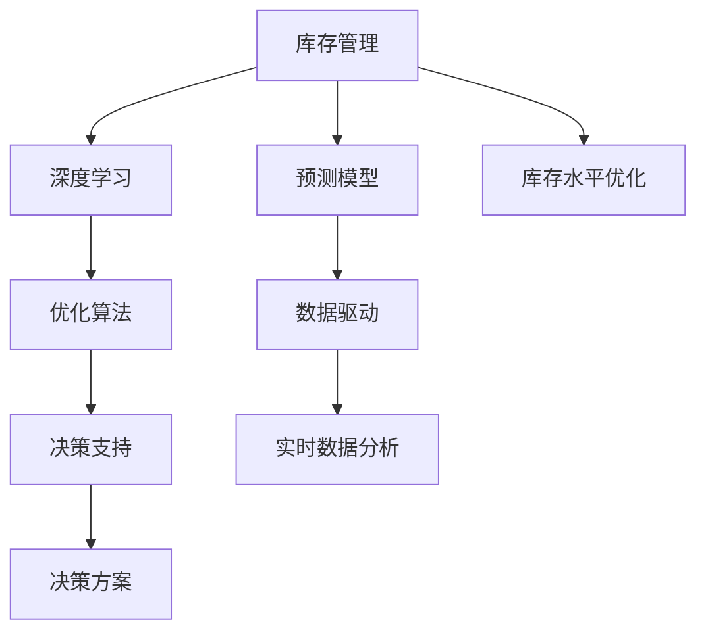

                 

## 1. 背景介绍

在全球化供应链背景下，企业面临着复杂多变的市场需求、供应链瓶颈、库存成本压力等多重挑战。高效精准的库存管理，不仅可以提升供应链响应速度，降低库存成本，还能优化客户服务质量，增强企业竞争力。传统的库存管理策略依赖人工经验，缺乏科学依据和预测模型支持，导致库存水平不合理，要么缺货断档，要么库存积压，严重影响企业运营效率。

随着人工智能技术的发展，精准库存管理成为可能。本文将详细介绍如何通过深度学习和优化算法，构建基于数据驱动的库存管理系统，以实现供需平衡、优化库存水平和降低运营成本。

## 2. 核心概念与联系

### 2.1 核心概念概述

- **库存管理**：指企业为了满足市场需求，合理配置库存资源，平衡供需关系的过程。库存管理的核心在于保持库存水平在合理的范围内，以最小化成本并最大化客户满意度。

- **深度学习**：指通过大量数据训练神经网络模型，学习特征规律并自动提取知识，从而实现对复杂问题的高效处理。深度学习在预测、分类、聚类等任务上表现优异。

- **优化算法**：指通过数学优化模型和求解方法，寻找问题最优解的过程。常见的优化算法包括线性规划、整数规划、动态规划等。

- **预测模型**：指基于历史数据和统计规律，预测未来需求或趋势的数学模型。常用的预测模型包括时间序列模型、回归模型、神经网络模型等。

- **决策支持系统(DSS)**：指利用现代信息技术，提供数据支持，辅助决策者制定科学的决策策略。

这些概念共同构成了精准库存管理的理论框架。深度学习和优化算法，通过预测模型和DSS，为库存管理提供数据驱动的决策支持。

### 2.2 核心概念原理和架构的 Mermaid 流程图



这个流程图展示了库存管理系统中各核心概念的逻辑关系：

- **库存管理**通过深度学习进行数据驱动，得到准确的库存预测和需求预测。
- **预测模型**结合历史数据和市场趋势，生成未来需求和库存水平的预测结果。
- **优化算法**对预测结果进行优化，确定最优的库存水平和采购策略。
- **决策支持系统**根据预测和优化结果，生成科学的库存管理决策方案。
- **库存水平优化**和**实时数据分析**是库存管理的核心操作。

## 3. 核心算法原理 & 具体操作步骤

### 3.1 算法原理概述

基于深度学习和优化算法的精准库存管理，主要分为以下几个步骤：

1. **数据采集与预处理**：收集历史销售数据、库存数据、市场趋势等，并进行数据清洗、归一化等预处理。
2. **需求预测**：使用深度学习模型（如LSTM、GRU、CNN等）对未来的需求进行预测。
3. **库存优化**：结合需求预测结果，使用优化算法（如线性规划、整数规划等）确定最优的库存水平和采购策略。
4. **决策支持**：将优化结果输入决策支持系统，生成库存管理决策方案。

### 3.2 算法步骤详解

#### 3.2.1 数据采集与预处理

数据采集是精准库存管理的第一步。需要收集以下数据：

- **历史销售数据**：记录每个商品的销售情况，包括时间、数量、价格等。
- **库存数据**：记录每个商品的当前库存水平和库存上限。
- **市场趋势**：收集市场供需变化、季节性因素等数据。

数据预处理包括：

- **缺失值处理**：填充或删除缺失值。
- **异常值检测**：识别并处理异常数据。
- **特征工程**：提取并构造有用特征，如季节性特征、促销影响等。
- **数据归一化**：将数据转化为标准范围，方便算法处理。

#### 3.2.2 需求预测

需求预测是精准库存管理的核心环节。使用深度学习模型进行需求预测的步骤如下：

1. **模型选择**：选择合适的深度学习模型，如LSTM、GRU、CNN等。
2. **模型训练**：使用历史销售数据和市场趋势数据，训练模型。
3. **预测生成**：将新数据输入训练好的模型，生成未来需求预测结果。

需求预测的常用模型包括：

- **LSTM模型**：适用于时间序列数据，能够捕捉长期依赖关系。
- **GRU模型**：与LSTM类似，但计算效率更高。
- **CNN模型**：适用于预测高维数据，能够提取局部特征。

#### 3.2.3 库存优化

库存优化是通过数学优化模型确定最优的库存水平和采购策略。具体步骤如下：

1. **目标函数构建**：确定优化目标，如最小化库存成本、最大化客户满意度等。
2. **约束条件设置**：考虑实际约束条件，如库存上限、采购周期等。
3. **优化求解**：使用优化算法求解目标函数在约束条件下的最优解。

常见的优化算法包括：

- **线性规划**：适用于线性目标和线性约束条件。
- **整数规划**：适用于变量取值为整数的优化问题。
- **动态规划**：适用于具有时间依赖的优化问题。

#### 3.2.4 决策支持

决策支持系统将优化结果转化为具体的库存管理决策方案，步骤如下：

1. **决策模型构建**：根据优化结果，构建决策模型。
2. **方案生成**：根据决策模型，生成具体的库存管理方案。
3. **方案评估**：对多个方案进行评估，选择最优方案。

### 3.3 算法优缺点

#### 3.3.1 优点

- **数据驱动**：深度学习和优化算法能够利用大数据，提高预测和决策的准确性。
- **动态调整**：能够实时监测市场需求和库存水平，动态调整决策方案。
- **自动化**：将复杂的问题自动化，减少人工干预，提高运营效率。
- **可扩展性**：能够扩展到多个产品和业务单元，实现全渠道库存管理。

#### 3.3.2 缺点

- **数据需求高**：需要大量历史数据和市场趋势数据，对数据质量要求高。
- **模型复杂**：深度学习模型和优化算法复杂度高，计算资源要求大。
- **调整困难**：模型和决策方案的调整需要专业知识，普通员工难以理解。
- **实施成本高**：实施精准库存管理需要较高的技术和实施成本。

### 3.4 算法应用领域

基于深度学习和优化算法的精准库存管理，广泛应用于多个领域：

- **电子商务**：如亚马逊、阿里巴巴等电商巨头，通过精准库存管理，优化库存水平，提升客户满意度。
- **零售业**：如沃尔玛、家乐福等零售商，通过精准库存管理，减少库存成本，提高供应链响应速度。
- **制造业**：如汽车、电子产品等制造企业，通过精准库存管理，平衡供需关系，降低生产成本。
- **物流业**：如顺丰、UPS等物流公司，通过精准库存管理，优化配送计划，提高服务质量。

## 4. 数学模型和公式 & 详细讲解 & 举例说明

### 4.1 数学模型构建

假设库存管理的目标是最小化库存成本 $C$，目标函数为：

$$
C = c_1x_1 + c_2x_2 + \cdots + c_nx_n
$$

其中 $c_i$ 为第 $i$ 个商品的单位成本，$x_i$ 为第 $i$ 个商品的库存水平。

约束条件包括：

1. 库存水平限制：$0 \leq x_i \leq S_i$，$S_i$ 为第 $i$ 个商品的库存上限。
2. 需求满足：$\sum_{i=1}^n x_i \geq D$，$D$ 为总需求量。
3. 采购周期限制：$x_i \geq 0$，表示商品至少要有库存。

### 4.2 公式推导过程

使用线性规划求解目标函数在约束条件下的最优解。

目标函数为：

$$
\min C = c_1x_1 + c_2x_2 + \cdots + c_nx_n
$$

约束条件为：

$$
\begin{align*}
0 &\leq x_i \leq S_i, &i=1,2,\cdots,n \\
\sum_{i=1}^n x_i &\geq D \\
x_i &\geq 0, &i=1,2,\cdots,n
\end{align*}
$$

使用单纯形法求解线性规划问题，步骤如下：

1. 将问题转化为标准形式，求解初始单纯形表。
2. 迭代求解，直到找到最优解。
3. 输出最优解。

### 4.3 案例分析与讲解

假设某零售商有三种商品，分别为A、B、C，单位成本分别为 $c_A = 10$、$c_B = 20$、$c_C = 30$，库存上限分别为 $S_A = 100$、$S_B = 200$、$S_C = 150$，需求预测结果为 $D = 200$。

将问题转化为标准形式，并求解：

1. 目标函数：$C = 10x_A + 20x_B + 30x_C$
2. 约束条件：
   - $0 \leq x_A \leq 100$
   - $0 \leq x_B \leq 200$
   - $0 \leq x_C \leq 150$
   - $x_A + x_B + x_C \geq 200$
   - $x_A, x_B, x_C \geq 0$

通过求解线性规划问题，得到最优解为 $x_A = 80, x_B = 120, x_C = 0$。

这意味着，为了最小化库存成本，应采购80个商品A、120个商品B，不采购商品C。

## 5. 项目实践：代码实例和详细解释说明

### 5.1 开发环境搭建

使用Python进行深度学习和优化算法实现。具体步骤如下：

1. **环境配置**：安装Python、NumPy、Pandas、Scikit-learn等依赖包。
2. **深度学习框架**：安装TensorFlow或PyTorch等深度学习框架。
3. **优化库**：安装Scipy库中的线性规划求解器。

### 5.2 源代码详细实现

#### 5.2.1 数据采集与预处理

使用Pandas进行数据清洗和预处理：

```python
import pandas as pd

# 加载历史销售数据
sales_data = pd.read_csv('sales_data.csv')

# 清洗数据
sales_data = sales_data.dropna()
sales_data = sales_data[(sales_data['date'] >= '2022-01-01') & (sales_data['date'] < '2022-12-31')]

# 归一化数据
sales_data['sales'] = (sales_data['sales'] - sales_data['sales'].min()) / (sales_data['sales'].max() - sales_data['sales'].min())

# 保存处理后的数据
sales_data.to_csv('processed_sales_data.csv', index=False)
```

#### 5.2.2 需求预测

使用LSTM模型进行需求预测：

```python
import numpy as np
import tensorflow as tf
from tensorflow.keras.models import Sequential
from tensorflow.keras.layers import LSTM, Dense

# 加载处理后的销售数据
sales_data = pd.read_csv('processed_sales_data.csv')

# 划分训练集和测试集
train_data = sales_data[(sales_data['date'] >= '2021-01-01') & (sales_data['date'] < '2021-06-30')]
test_data = sales_data[(sales_data['date'] >= '2021-06-30') & (sales_data['date'] < '2021-12-31')]

# 构造训练集和测试集
X_train = train_data['sales'].values.reshape(-1, 1)
y_train = train_data['date'].values.reshape(-1, 1)

X_test = test_data['sales'].values.reshape(-1, 1)
y_test = test_data['date'].values.reshape(-1, 1)

# 构建LSTM模型
model = Sequential()
model.add(LSTM(64, input_shape=(X_train.shape[1], 1), return_sequences=True))
model.add(LSTM(64, return_sequences=True))
model.add(LSTM(64))
model.add(Dense(1))

# 编译模型
model.compile(loss='mse', optimizer='adam')

# 训练模型
model.fit(X_train, y_train, epochs=50, batch_size=32, validation_data=(X_test, y_test))

# 预测需求
predictions = model.predict(X_test)
```

#### 5.2.3 库存优化

使用线性规划求解库存优化问题：

```python
from scipy.optimize import linprog

# 设置库存优化模型
c = np.array([10, 20, 30])  # 单位成本
A = np.eye(3)  # 需求约束矩阵
b = np.array([200])  # 需求量
x0_bounds = (0, 100)  # 商品A库存上限
x1_bounds = (0, 200)  # 商品B库存上限
x2_bounds = (0, 150)  # 商品C库存上限

# 求解线性规划问题
result = linprog(c, A_ub=A, b_ub=b, bounds=[x0_bounds, x1_bounds, x2_bounds], method='simplex')

# 输出最优解
print('最优库存水平:', result.x)
```

#### 5.2.4 决策支持

根据优化结果生成决策方案：

```python
# 根据最优解生成决策方案
optimal_inventory = result.x
inventory_plan = {'商品A': optimal_inventory[0], '商品B': optimal_inventory[1], '商品C': optimal_inventory[2]}

# 输出决策方案
print('决策方案:', inventory_plan)
```

### 5.3 代码解读与分析

以上代码实现了精准库存管理的全过程，包括数据预处理、需求预测、库存优化和决策支持。其中，LSTM模型用于需求预测，线性规划用于库存优化，决策支持系统将优化结果转化为具体的库存管理方案。

## 6. 实际应用场景

### 6.1 智能仓储系统

智能仓储系统是精准库存管理的典型应用场景。通过深度学习和优化算法，智能仓储系统能够实时监测库存水平，动态调整采购计划，实现最优库存管理。

具体实现步骤如下：

1. **数据采集**：通过RFID、传感器等设备采集库存数据。
2. **数据预处理**：清洗和归一化数据，提取有用特征。
3. **需求预测**：使用深度学习模型预测未来需求。
4. **库存优化**：结合预测结果，使用优化算法确定最优库存水平。
5. **决策支持**：生成具体的库存管理方案，如采购计划、配送计划等。

### 6.2 电子商务平台

电子商务平台通过精准库存管理，优化库存水平，提升客户满意度。具体实现步骤如下：

1. **数据采集**：收集历史销售数据、库存数据、市场趋势等。
2. **需求预测**：使用深度学习模型预测未来需求。
3. **库存优化**：结合预测结果，使用优化算法确定最优库存水平。
4. **决策支持**：生成具体的库存管理方案，如库存水平调整、补货计划等。

### 6.3 制造企业

制造企业通过精准库存管理，平衡供需关系，降低生产成本。具体实现步骤如下：

1. **数据采集**：收集历史销售数据、库存数据、市场趋势等。
2. **需求预测**：使用深度学习模型预测未来需求。
3. **库存优化**：结合预测结果，使用优化算法确定最优库存水平。
4. **决策支持**：生成具体的库存管理方案，如采购计划、生产计划等。

## 7. 工具和资源推荐

### 7.1 学习资源推荐

1. **《深度学习》书籍**：Ian Goodfellow、Yoshua Bengio、Aaron Courville等著，全面介绍深度学习理论、算法和应用。
2. **《优化算法》书籍**：Kenneth L. Johnson等著，涵盖线性规划、整数规划、动态规划等优化算法。
3. **《库存管理与物流优化》课程**：Coursera、Udemy等在线平台提供的库存管理和优化课程。

### 7.2 开发工具推荐

1. **TensorFlow**：由Google开发的深度学习框架，支持分布式计算和GPU加速。
2. **PyTorch**：由Facebook开发的深度学习框架，灵活性强，易于使用。
3. **SciPy**：基于NumPy的科学计算库，提供线性规划求解器。
4. **Pandas**：数据处理和分析库，支持大规模数据处理。

### 7.3 相关论文推荐

1. **《基于深度学习的库存管理研究》**：李扬、张华等，研究基于深度学习的库存管理方法。
2. **《供应链优化与库存管理》**：Dantzig等，探讨线性规划在供应链中的应用。
3. **《智能仓储与库存优化》**：Beamon等，介绍智能仓储系统中的库存优化技术。

## 8. 总结：未来发展趋势与挑战

### 8.1 研究成果总结

精准库存管理通过深度学习和优化算法，实现了供需平衡、优化库存水平和降低运营成本。当前主要研究集中于数据预处理、需求预测、库存优化和决策支持等方面。未来研究将继续探索高效、可扩展的库存管理解决方案。

### 8.2 未来发展趋势

1. **实时性增强**：未来精准库存管理系统将更注重实时性，能够实时监测库存水平，动态调整决策方案。
2. **多模态融合**：结合传感器、视频等数据源，多模态融合技术将提升库存管理的精准度和鲁棒性。
3. **自适应学习**：通过在线学习算法，精准库存管理系统能够自适应市场变化，实时优化库存策略。
4. **跨平台集成**：将库存管理与ERP、CRM等系统集成，实现全渠道库存管理。
5. **区块链技术**：利用区块链技术保障供应链数据透明性，提升库存管理的安全性和可追溯性。

### 8.3 面临的挑战

1. **数据质量问题**：数据的准确性和完整性对库存管理至关重要，但数据采集和清洗成本高。
2. **算法复杂度**：深度学习和优化算法的复杂度高，计算资源要求大，需要更高的技术水平。
3. **模型解释性**：深度学习模型和优化算法通常缺乏解释性，难以理解和调试。
4. **实施成本高**：精准库存管理系统的开发和部署成本高，需要综合考虑投入产出比。

### 8.4 研究展望

1. **优化算法研究**：研究更高效、更鲁棒的优化算法，提升库存优化精度和速度。
2. **跨领域应用**：探索精准库存管理在多领域的应用，如医疗、金融等。
3. **智能算法融合**：结合符号化推理、因果分析等智能算法，提升库存管理系统的决策能力。
4. **多任务学习**：研究多任务学习技术，提高库存管理的全面性和预测能力。
5. **人机协同**：探索人机协同决策模型，提高库存管理系统的适应性和灵活性。

## 9. 附录：常见问题与解答

**Q1: 如何优化库存水平？**

A: 使用深度学习模型进行需求预测，结合优化算法求解最优库存水平。

**Q2: 如何处理异常数据？**

A: 使用异常值检测算法识别并处理异常数据，如离群点检测、均值方差法等。

**Q3: 如何提高库存管理系统的实时性？**

A: 使用流式数据处理和实时计算技术，如Apache Kafka、Apache Flink等，实现实时库存监测和动态调整。

**Q4: 如何提升库存管理系统的解释性？**

A: 引入符号化推理、因果分析等技术，提升模型的可解释性和可理解性。

**Q5: 如何降低库存管理系统的实施成本？**

A: 采用模块化设计和插件架构，降低开发和部署成本。

