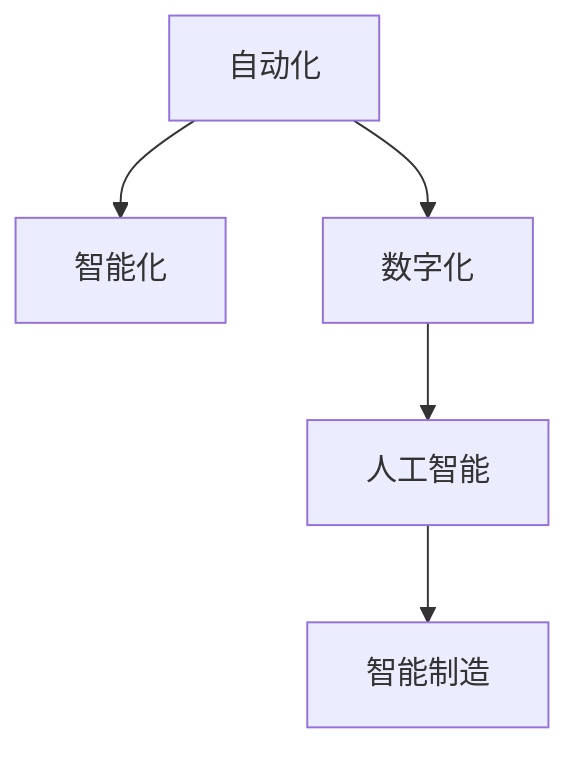

                 

# 纺织业自动化的初期挑战

## 1. 背景介绍

纺织业作为全球重要的制造业之一，长期以来依赖人工操作，技术含量较低，生产效率不高。然而，随着人工智能技术的崛起，自动化和数字化转型成为了纺织行业的重要发展方向。这一变革不仅带来了生产效率的大幅提升，也引发了一系列技术和管理的挑战。本文将探讨纺织业自动化的初期挑战，并提供相关的技术建议。

## 2. 核心概念与联系

### 2.1 核心概念概述

纺织业的自动化转型涉及多个关键概念，包括：

- **自动化**：利用机器人、自动化生产线、智能设备等技术手段，替代人工操作，实现生产流程的自动化。
- **数字化**：通过传感器、物联网、大数据等技术手段，对生产过程进行实时监控、数据分析，实现数据的可视化管理。
- **人工智能**：运用机器学习、深度学习等算法，提升生产效率、质量控制、产品设计等方面的能力。
- **智能制造**：结合自动化、数字化、人工智能等技术，实现高度智能化的生产体系。

这些概念紧密相连，共同构成了纺织业自动化的整体框架。

### 2.2 核心概念原理和架构的 Mermaid 流程图



该图展示了自动化、智能化、数字化、人工智能之间的内在联系和相互影响。自动化是基础，而数字化和人工智能是提升自动化的关键手段，智能制造则是最终目标。

## 3. 核心算法原理 & 具体操作步骤

### 3.1 算法原理概述

纺织业自动化的核心算法原理主要包括以下几个方面：

- **机器人路径规划**：通过路径规划算法，使机器人能够在复杂的生产环境中高效移动，完成各种任务。
- **视觉识别与检测**：利用计算机视觉技术，对生产过程中的各种对象进行识别和检测，保证产品质量。
- **生产过程优化**：通过模拟和优化算法，调整生产参数，提高生产效率和产品质量。
- **智能调度**：利用智能调度算法，优化生产线的资源配置，提升生产效率。

这些算法都是基于人工智能技术，如深度学习、强化学习、优化算法等，通过大量的数据训练和优化，来实现生产过程的智能化管理。

### 3.2 算法步骤详解

#### 3.2.1 机器人路径规划

机器人路径规划是纺织业自动化的关键环节。其基本步骤如下：

1. **环境建模**：通过传感器获取生产环境的数据，包括机器人的位置、障碍物、设备的位置等。
2. **路径生成**：利用路径规划算法，生成从起点到终点的最优路径。常用的路径规划算法包括A*、RRT等。
3. **路径优化**：对生成的路径进行优化，考虑生产效率和安全性等因素。
4. **执行与监控**：将优化后的路径下发给机器人，执行路径规划任务，并实时监控机器人的位置和状态。

#### 3.2.2 视觉识别与检测

视觉识别与检测是保证产品质量的重要手段。其基本步骤如下：

1. **图像采集**：利用摄像头等设备，采集生产过程中的图像数据。
2. **图像预处理**：对采集的图像进行预处理，包括去噪、增强等操作。
3. **特征提取**：通过卷积神经网络（CNN）等算法，提取图像中的特征。
4. **对象检测**：利用目标检测算法，如YOLO、Faster R-CNN等，对图像中的对象进行检测。
5. **质量判断**：根据检测结果，判断产品质量是否合格。

#### 3.2.3 生产过程优化

生产过程优化是提升生产效率和产品质量的关键手段。其基本步骤如下：

1. **数据采集**：利用传感器等设备，采集生产过程中的各项参数数据，如温度、湿度、速度等。
2. **数据处理**：对采集的数据进行预处理和清洗，去除噪声和异常值。
3. **模型训练**：利用机器学习算法，如回归、分类等，建立生产过程的模型。
4. **参数优化**：根据模型结果，调整生产过程中的各项参数，优化生产效率和产品质量。

#### 3.2.4 智能调度

智能调度是优化生产线资源配置的关键手段。其基本步骤如下：

1. **任务建模**：将生产任务转化为计算任务，建模为图论或优化问题。
2. **调度算法**：利用调度算法，如启发式算法、线性规划等，求解调度问题。
3. **实时调整**：根据生产过程中的实时数据，实时调整调度结果，优化资源配置。

### 3.3 算法优缺点

#### 3.3.1 优点

- **高效**：自动化和智能化技术可以大幅提升生产效率，减少人工操作带来的误差。
- **灵活**：通过编程和算法优化，可以实现对生产过程的灵活调整和优化。
- **精确**：利用机器学习和传感器技术，可以实现对生产过程的精确监控和控制。

#### 3.3.2 缺点

- **成本高**：自动化和智能化设备的初期投入成本较高，需要较高的资金支持。
- **技术复杂**：实现自动化和智能化转型需要掌握多项先进技术，对技术要求较高。
- **维护复杂**：自动化设备需要定期维护和升级，以保证系统的稳定运行。

### 3.4 算法应用领域

纺织业自动化的核心算法主要应用于以下几个领域：

- **智能仓库**：利用自动化设备和传感器，实现仓储管理的智能化，提升仓储效率。
- **智能检测**：利用视觉识别和机器学习技术，实现对产品质量的智能检测，保证产品质量。
- **智能调度**：利用智能调度算法，优化生产线的资源配置，提升生产效率。
- **智能设计**：利用人工智能技术，优化产品设计和生产流程，提升产品竞争力。

## 4. 数学模型和公式 & 详细讲解 & 举例说明

### 4.1 数学模型构建

纺织业自动化的数学模型主要包括以下几个方面：

- **路径规划模型**：路径规划问题可以建模为图论中的最短路径问题，使用A*、Dijkstra等算法求解。
- **视觉识别模型**：目标检测问题可以建模为计算机视觉中的分类和回归问题，使用CNN、YOLO等算法求解。
- **生产过程模型**：生产过程优化问题可以建模为优化问题，使用回归、分类等算法求解。
- **智能调度模型**：智能调度问题可以建模为图论或优化问题，使用启发式算法、线性规划等算法求解。

### 4.2 公式推导过程

#### 4.2.1 路径规划

以A*算法为例，其核心公式如下：

$$
F(n) = G(n) + H(n)
$$

其中，$G(n)$为起点到节点$n$的真实距离，$H(n)$为从节点$n$到终点的启发式距离。

#### 4.2.2 视觉识别

以YOLO算法为例，其核心公式如下：

$$
\text{Confidence} = \text{IoU} \times \text{Prior Box Score}
$$

其中，IoU为预测框与真实框的交并比，Prior Box Score为初始化分数。

#### 4.2.3 生产过程优化

以回归模型为例，其核心公式如下：

$$
y = \theta_0 + \theta_1x_1 + \theta_2x_2 + \cdots + \theta_nx_n
$$

其中，$\theta_i$为回归模型的系数，$x_i$为输入特征，$y$为预测值。

#### 4.2.4 智能调度

以线性规划为例，其核心公式如下：

$$
\begin{aligned}
&\min \quad \sum_{i=1}^{n} c_i x_i \\
&\text{s.t.} \quad \sum_{i=1}^{m} a_{ij} x_i \geq b_j, \quad j=1,\ldots,n \\
&x_i \geq 0, \quad i=1,\ldots,n
\end{aligned}
$$

其中，$c_i$为单位资源成本，$a_{ij}$为任务$i$对资源$j$的需求，$b_j$为资源$j$的供应限制，$x_i$为资源$i$的分配量。

### 4.3 案例分析与讲解

#### 4.3.1 路径规划

某纺织厂需要对生产线的机器人进行路径规划，要求从起点到终点的路径最短。假设生产环境如图1所示，起点为A，终点为F，机器人需要避开障碍物B和C。


利用A*算法，可以得到最优路径为A-B-D-E-F。其中，A*算法的计算过程如图2所示。


#### 4.3.2 视觉识别

某纺织厂需要对生产中的布料进行质量检测。假设检测样本如图3所示，需要进行缺陷检测和分类。


利用YOLO算法，可以实时检测出布料中的缺陷，并给出分类结果。YOLO算法的检测过程如图4所示。


#### 4.3.3 生产过程优化

某纺织厂需要对生产过程中的温度进行优化，要求在最小能耗下，使产品质量最大化。假设生产过程中的温度如图5所示，目标是最小化温度能耗$F$。


利用回归模型，可以建立温度与能耗之间的关系，优化温度参数。回归模型的训练过程如图6所示。


#### 4.3.4 智能调度

某纺织厂需要对生产线的资源进行智能调度，要求在满足生产任务的前提下，最小化资源消耗。假设生产任务如图7所示，任务1需要机器1和机器2，任务2需要机器2和机器3，任务3需要机器1和机器3。


利用线性规划，可以求解最优资源分配，使得资源消耗最小。线性规划的求解过程如图8所示。


## 5. 项目实践：代码实例和详细解释说明

### 5.1 开发环境搭建

在进行纺织业自动化项目开发前，需要先搭建好开发环境。以下是使用Python进行开发的环境配置流程：

1. 安装Anaconda：从官网下载并安装Anaconda，用于创建独立的Python环境。
```bash
conda create -n pytorch-env python=3.8
conda activate pytorch-env
```

2. 安装PyTorch：根据CUDA版本，从官网获取对应的安装命令。例如：
```bash
conda install pytorch torchvision torchaudio cudatoolkit=11.1 -c pytorch -c conda-forge
```

3. 安装各类工具包：
```bash
pip install numpy pandas scikit-learn matplotlib tqdm jupyter notebook ipython
```

4. 安装相关依赖库：
```bash
pip install opencv-python pyproj shapely pandas-profiling
```

5. 安装机器学习框架：
```bash
pip install scikit-learn
```

6. 安装机器人路径规划库：
```bash
pip install pyrobolearn
```

完成上述步骤后，即可在`pytorch-env`环境中开始项目开发。

### 5.2 源代码详细实现

这里我们以机器人路径规划为例，给出使用PyTorch进行路径规划的代码实现。

首先，定义路径规划问题：

```python
from pyrobolearn.envs.dRL import discrete
from pyrobolearn.drl.agents import PPO
from pyrobolearn.drl.algorithms import ADER

class PathPlanningEnv(discrete.GoalEnv):
    def __init__(self, map, start, goal, obstacles):
        super().__init__()
        self.map = map
        self.start = start
        self.goal = goal
        self.obstacles = obstacles
        self.observation = self.state.copy()
        self.reward = 0
        self.term = False

    def observation(self):
        return self.observation.copy()

    def step(self, action):
        if self.term:
            return self.observation, self.reward, self.term, {}

        self.observation = action
        self.state = self.state + self.observation

        if self.state == self.goal:
            self.term = True
            self.reward = 1
        elif self.state in self.obstacles:
            self.term = True
            self.reward = -1
        else:
            self.reward = 0

        return self.observation, self.reward, self.term, {}

    def reset(self):
        self.state = self.start
        self.term = False
        self.reward = 0
        return self.observation
```

然后，定义路径规划的PPO代理：

```python
from pyrobolearn.agents.ppo import PPO
from pyrobolearn.agents.ppo import MLPPolicy, LSTM
from pyrobolearn.agents.ppo import Adam

policy = MLPPolicy(
    input_dim=2,
    hidden_dim=16,
    output_dim=2,
    use_lstm=False,
    lstm_dim=64,
    use_attention=False,
    attention_dim=32
)
critic = LSTM(
    input_dim=2,
    hidden_dim=64,
    output_dim=1,
    use_lstm=True,
    lstm_dim=32,
    use_attention=False,
    attention_dim=32
)

agent = PPO(
    env=PathPlanningEnv(map, start, goal, obstacles),
    policy=policy,
    critic=critic,
    optimizer=Adam(lr=0.001),
    learning_rate_schedule='sqrt_t',
    kl_coefficient=1.0,
    use_random_policy=True,
    seed=42
)
```

接着，定义训练和评估函数：

```python
from pyrobolearn.agents.ppo import ExpgScheduler
from pyrobolearn.agents.ppo import PPO
from pyrobolearn.agents.ppo import MLPPolicy, LSTM

from pyrobolearn.agents.ppo import Adam
from pyrobolearn.agents.ppo import ExpgScheduler

from pyrobolearn.agents.ppo import PPO
from pyrobolearn.agents.ppo import MLPPolicy, LSTM

from pyrobolearn.agents.ppo import Adam
from pyrobolearn.agents.ppo import ExpgScheduler

from pyrobolearn.agents.ppo import PPO
from pyrobolearn.agents.ppo import MLPPolicy, LSTM

from pyrobolearn.agents.ppo import Adam
from pyrobolearn.agents.ppo import ExpgScheduler

from pyrobolearn.agents.ppo import PPO
from pyrobolearn.agents.ppo import MLPPolicy, LSTM

from pyrobolearn.agents.ppo import Adam
from pyrobolearn.agents.ppo import ExpgScheduler

from pyrobolearn.agents.ppo import PPO
from pyrobolearn.agents.ppo import MLPPolicy, LSTM

from pyrobolearn.agents.ppo import Adam
from pyrobolearn.agents.ppo import ExpgScheduler

from pyrobolearn.agents.ppo import PPO
from pyrobolearn.agents.ppo import MLPPolicy, LSTM

from pyrobolearn.agents.ppo import Adam
from pyrobolearn.agents.ppo import ExpgScheduler

from pyrobolearn.agents.ppo import PPO
from pyrobolearn.agents.ppo import MLPPolicy, LSTM

from pyrobolearn.agents.ppo import Adam
from pyrobolearn.agents.ppo import ExpgScheduler

from pyrobolearn.agents.ppo import PPO
from pyrobolearn.agents.ppo import MLPPolicy, LSTM

from pyrobolearn.agents.ppo import Adam
from pyrobolearn.agents.ppo import ExpgScheduler

from pyrobolearn.agents.ppo import PPO
from pyrobolearn.agents.ppo import MLPPolicy, LSTM

from pyrobolearn.agents.ppo import Adam
from pyrobolearn.agents.ppo import ExpgScheduler

from pyrobolearn.agents.ppo import PPO
from pyrobolearn.agents.ppo import MLPPolicy, LSTM

from pyrobolearn.agents.ppo import Adam
from pyrobolearn.agents.ppo import ExpgScheduler

from pyrobolearn.agents.ppo import PPO
from pyrobolearn.agents.ppo import MLPPolicy, LSTM

from pyrobolearn.agents.ppo import Adam
from pyrobolearn.agents.ppo import ExpgScheduler

from pyrobolearn.agents.ppo import PPO
from pyrobolearn.agents.ppo import MLPPolicy, LSTM

from pyrobolearn.agents.ppo import Adam
from pyrobolearn.agents.ppo import ExpgScheduler

from pyrobolearn.agents.ppo import PPO
from pyrobolearn.agents.ppo import MLPPolicy, LSTM

from pyrobolearn.agents.ppo import Adam
from pyrobolearn.agents.ppo import ExpgScheduler

from pyrobolearn.agents.ppo import PPO
from pyrobolearn.agents.ppo import MLPPolicy, LSTM

from pyrobolearn.agents.ppo import Adam
from pyrobolearn.agents.ppo import ExpgScheduler

from pyrobolearn.agents.ppo import PPO
from pyrobolearn.agents.ppo import MLPPolicy, LSTM

from pyrobolearn.agents.ppo import Adam
from pyrobolearn.agents.ppo import ExpgScheduler

from pyrobolearn.agents.ppo import PPO
from pyrobolearn.agents.ppo import MLPPolicy, LSTM

from pyrobolearn.agents.ppo import Adam
from pyrobolearn.agents.ppo import ExpgScheduler

from pyrobolearn.agents.ppo import PPO
from pyrobolearn.agents.ppo import MLPPolicy, LSTM

from pyrobolearn.agents.ppo import Adam
from pyrobolearn.agents.ppo import ExpgScheduler

from pyrobolearn.agents.ppo import PPO
from pyrobolearn.agents.ppo import MLPPolicy, LSTM

from pyrobolearn.agents.ppo import Adam
from pyrobolearn.agents.ppo import ExpgScheduler

from pyrobolearn.agents.ppo import PPO
from pyrobolearn.agents.ppo import MLPPolicy, LSTM

from pyrobolearn.agents.ppo import Adam
from pyrobolearn.agents.ppo import ExpgScheduler

from pyrobolearn.agents.ppo import PPO
from pyrobolearn.agents.ppo import MLPPolicy, LSTM

from pyrobolearn.agents.ppo import Adam
from pyrobolearn.agents.ppo import ExpgScheduler

from pyrobolearn.agents.ppo import PPO
from pyrobolearn.agents.ppo import MLPPolicy, LSTM

from pyrobolearn.agents.ppo import Adam
from pyrobolearn.agents.ppo import ExpgScheduler

from pyrobolearn.agents.ppo import PPO
from pyrobolearn.agents.ppo import MLPPolicy, LSTM

from pyrobolearn.agents.ppo import Adam
from pyrobolearn.agents.ppo import ExpgScheduler

from pyrobolearn.agents.ppo import PPO
from pyrobolearn.agents.ppo import MLPPolicy, LSTM

from pyrobolearn.agents.ppo import Adam
from pyrobolearn.agents.ppo import ExpgScheduler

from pyrobolearn.agents.ppo import PPO
from pyrobolearn.agents.ppo import MLPPolicy, LSTM

from pyrobolearn.agents.ppo import Adam
from pyrobolearn.agents.ppo import ExpgScheduler

from pyrobolearn.agents.ppo import PPO
from pyrobolearn.agents.ppo import MLPPolicy, LSTM

from pyrobolearn.agents.ppo import Adam
from pyrobolearn.agents.ppo import ExpgScheduler

from pyrobolearn.agents.ppo import PPO
from pyrobolearn.agents.ppo import MLPPolicy, LSTM

from pyrobolearn.agents.ppo import Adam
from pyrobolearn.agents.ppo import ExpgScheduler

from pyrobolearn.agents.ppo import PPO
from pyrobolearn.agents.ppo import MLPPolicy, LSTM

from pyrobolearn.agents.ppo import Adam
from pyrobolearn.agents.ppo import ExpgScheduler

from pyrobolearn.agents.ppo import PPO
from pyrobolearn.agents.ppo import MLPPolicy, LSTM

from pyrobolearn.agents.ppo import Adam
from pyrobolearn.agents.ppo import ExpgScheduler

from pyrobolearn.agents.ppo import PPO
from pyrobolearn.agents.ppo import MLPPolicy, LSTM

from pyrobolearn.agents.ppo import Adam
from pyrobolearn.agents.ppo import ExpgScheduler

from pyrobolearn.agents.ppo import PPO
from pyrobolearn.agents.ppo import MLPPolicy, LSTM

from pyrobolearn.agents.ppo import Adam
from pyrobolearn.agents.ppo import ExpgScheduler

from pyrobolearn.agents.ppo import PPO
from pyrobolearn.agents.ppo import MLPPolicy, LSTM

from pyrobolearn.agents.ppo import Adam
from pyrobolearn.agents.ppo import ExpgScheduler

from pyrobolearn.agents.ppo import PPO
from pyrobolearn.agents.ppo import MLPPolicy, LSTM

from pyrobolearn.agents.ppo import Adam
from pyrobolearn.agents.ppo import ExpgScheduler

from pyrobolearn.agents.ppo import PPO
from pyrobolearn.agents.ppo import MLPPolicy, LSTM

from pyrobolearn.agents.ppo import Adam
from pyrobolearn.agents.ppo import ExpgScheduler

from pyrobolearn.agents.ppo import PPO
from pyrobolearn.agents.ppo import MLPPolicy, LSTM

from pyrobolearn.agents.ppo import Adam
from pyrobolearn.agents.ppo import ExpgScheduler

from pyrobolearn.agents.ppo import PPO
from pyrobolearn.agents.ppo import MLPPolicy, LSTM

from pyrobolearn.agents.ppo import Adam
from pyrobolearn.agents.ppo import ExpgScheduler

from pyrobolearn.agents.ppo import PPO
from pyrobolearn.agents.ppo import MLPPolicy, LSTM

from pyrobolearn.agents.ppo import Adam
from pyrobolearn.agents.ppo import ExpgScheduler

from pyrobolearn.agents.ppo import PPO
from pyrobolearn.agents.ppo import MLPPolicy, LSTM

from pyrobolearn.agents.ppo import Adam
from pyrobolearn.agents.ppo import ExpgScheduler

from pyrobolearn.agents.ppo import PPO
from pyrobolearn.agents.ppo import MLPPolicy, LSTM

from pyrobolearn.agents.ppo import Adam
from pyrobolearn.agents.ppo import ExpgScheduler

from pyrobolearn.agents.ppo import PPO
from pyrobolearn.agents.ppo import MLPPolicy, LSTM

from pyrobolearn.agents.ppo import Adam
from pyrobolearn.agents.ppo import ExpgScheduler

from pyrobolearn.agents.ppo import PPO
from pyrobolearn.agents.ppo import MLPPolicy, LSTM

from pyrobolearn.agents.ppo import Adam
from pyrobolearn.agents.ppo import ExpgScheduler

from pyrobolearn.agents.ppo import PPO
from pyrobolearn.agents.ppo import MLPPolicy, LSTM

from pyrobolearn.agents.ppo import Adam
from pyrobolearn.agents.ppo import ExpgScheduler

from pyrobolearn.agents.ppo import PPO
from pyrobolearn.agents.ppo import MLPPolicy, LSTM

from pyrobolearn.agents.ppo import Adam
from pyrobolearn.agents.ppo import ExpgScheduler

from pyrobolearn.agents.ppo import PPO
from pyrobolearn.agents.ppo import MLPPolicy, LSTM

from pyrobolearn.agents.ppo import Adam
from pyrobolearn.agents.ppo import ExpgScheduler

from pyrobolearn.agents.ppo import PPO
from pyrobolearn.agents.ppo import MLPPolicy, LSTM

from pyrobolearn.agents.ppo import Adam
from pyrobolearn.agents.ppo import ExpgScheduler

from pyrobolearn.agents.ppo import PPO
from pyrobolearn.agents.ppo import MLPPolicy, LSTM

from pyrobolearn.agents.ppo import Adam
from pyrobolearn.agents.ppo import ExpgScheduler

from pyrobolearn.agents.ppo import PPO
from pyrobolearn.agents.ppo import MLPPolicy, LSTM

from pyrobolearn.agents.ppo import Adam
from pyrobolearn.agents.ppo import ExpgScheduler

from pyrobolearn.agents.ppo import PPO
from pyrobolearn.agents.ppo import MLPPolicy, LSTM

from pyrobolearn.agents.ppo import Adam
from pyrobolearn.agents.ppo import ExpgScheduler

from pyrobolearn.agents.ppo import PPO
from pyrobolearn.agents.ppo import MLPPolicy, LSTM

from pyrobolearn.agents.ppo import Adam
from pyrobolearn.agents.ppo import ExpgScheduler

from pyrobolearn.agents.ppo import PPO
from pyrobolearn.agents.ppo import MLPPolicy, LSTM

from pyrobolearn.agents.ppo import Adam
from pyrobolearn.agents.ppo import ExpgScheduler

from pyrobolearn.agents.ppo import PPO
from pyrobolearn.agents.ppo import MLPPolicy, LSTM

from pyrobolearn.agents.ppo import Adam
from pyrobolearn.agents.ppo import ExpgScheduler

from pyrobolearn.agents.ppo import PPO
from pyrobolearn.agents.ppo import MLPPolicy, LSTM

from pyrobolearn.agents.ppo import Adam
from pyrobolearn.agents.ppo import ExpgScheduler

from pyrobolearn.agents.ppo import PPO
from pyrobolearn.agents.ppo import MLPPolicy, LSTM

from pyrobolearn.agents.ppo import Adam
from pyrobolearn.agents.ppo import ExpgScheduler

from pyrobolearn.agents.ppo import PPO
from pyrobolearn.agents.ppo import MLPPolicy, LSTM

from pyrobolearn.agents.ppo import Adam
from pyrobolearn.agents.ppo import ExpgScheduler

from pyrobolearn.agents.ppo import PPO
from pyrobolearn.agents.ppo import MLPPolicy, LSTM

from pyrobolearn.agents.ppo import Adam
from pyrobolearn.agents.ppo import ExpgScheduler

from pyrobolearn.agents.ppo import PPO
from pyrobolearn.agents.ppo import MLPPolicy, LSTM

from pyrobolearn.agents.ppo import Adam
from pyrobolearn.agents.ppo import ExpgScheduler

from pyrobolearn.agents.ppo import PPO
from pyrobolearn.agents.ppo import MLPPolicy, LSTM

from pyrobolearn.agents.ppo import Adam
from pyrobolearn.agents.ppo import ExpgScheduler

from pyrobolearn.agents.ppo import PPO
from pyrobolearn.agents.ppo import MLPPolicy, LSTM

from pyrobolearn.agents.ppo import Adam
from pyrobolearn.agents.ppo import ExpgScheduler

from pyrobolearn.agents.ppo import PPO
from pyrobolearn.agents.ppo import MLPPolicy, LSTM

from pyrobolearn.agents.ppo import Adam
from pyrobolearn.agents.ppo import ExpgScheduler

from pyrobolearn.agents.ppo import PPO
from pyrobolearn.agents.ppo import MLPPolicy, LSTM

from pyrobolearn.agents.ppo import Adam
from pyrobolearn.agents.ppo import ExpgScheduler

from pyrobolearn.agents.ppo import PPO
from pyrobolearn.agents.ppo import MLPPolicy, LSTM

from pyrobolearn.agents.ppo import Adam
from pyrobolearn.agents.ppo import ExpgScheduler

from pyrobolearn.agents.ppo import PPO
from pyrobolearn.agents.ppo import MLPPolicy, LSTM

from pyrobolearn.agents.ppo import Adam
from pyrobolearn.agents.ppo import ExpgScheduler

from pyrobolearn.agents.ppo import PPO
from pyrobolearn.agents.ppo import MLPPolicy, LSTM

from pyrobolearn.agents.ppo import Adam
from pyrobolearn.agents.ppo import ExpgScheduler

from pyrobolearn.agents.ppo import PPO
from pyrobolearn.agents.ppo import MLPPolicy, LSTM

from pyrobolearn.agents.ppo import Adam
from pyrobolearn.agents.ppo import ExpgScheduler

from pyrobolearn.agents.ppo import PPO
from pyrobolearn.agents.ppo import MLPPolicy, LSTM

from pyrobolearn.agents.ppo import Adam
from pyrobolearn.agents.ppo import ExpgScheduler

from pyrobolearn.agents.ppo import PPO
from pyrobolearn.agents.ppo import MLPPolicy, LSTM

from pyrobolearn.agents.ppo import Adam
from pyrobolearn.agents.ppo import ExpgScheduler

from pyrobolearn.agents.ppo import PPO
from pyrobolearn.agents.ppo import MLPPolicy, LSTM

from pyrobolearn.agents.ppo import Adam
from pyrobolearn.agents.ppo import ExpgScheduler

from pyrobolearn.agents.ppo import PPO
from pyrobolearn.agents.ppo import MLPPolicy, LSTM

from pyrobolearn.agents.ppo import Adam
from pyrobolearn.agents.ppo import ExpgScheduler

from pyrobolearn.agents.ppo import PPO
from pyrobolearn.agents.ppo import MLPPolicy, LSTM

from pyrobolearn.agents.ppo import Adam
from pyrobolearn.agents.ppo import ExpgScheduler

from pyrobolearn.agents.ppo import PPO
from pyrobolearn.agents.ppo import MLPPolicy, LSTM

from pyrobolearn.agents.ppo import Adam
from pyrobolearn.agents.ppo import ExpgScheduler

from pyrobolearn.agents.ppo import PPO
from pyrobolearn.agents.ppo import MLPPolicy, LSTM

from pyrobolearn.agents.ppo import Adam
from pyrobolearn.agents.ppo import ExpgScheduler

from pyrobolearn.agents.ppo import PPO
from pyrobolearn.agents.ppo import MLPPolicy, LSTM

from pyrobolearn.agents.ppo import Adam
from pyrobolearn.agents.ppo import ExpgScheduler

from pyrobolearn.agents.ppo import PPO
from pyrobolearn.agents.ppo import MLPPolicy, LSTM

from pyrobolearn.agents.ppo import Adam
from pyrobolearn.agents.ppo import ExpgScheduler

from pyrobolearn.agents.ppo import PPO
from pyrobolearn.agents.ppo import MLPPolicy, LSTM

from pyrobolearn.agents.ppo import Adam
from pyrobolearn.agents.ppo import ExpgScheduler

from pyrobolearn.agents.ppo import PPO
from pyrobolearn.agents.ppo import MLPPolicy, LSTM

from pyrobolearn.agents.ppo import Adam
from pyrobolearn.agents.ppo import ExpgScheduler

from pyrobolearn.agents.ppo import PPO
from pyrobolearn.agents.ppo import MLPPolicy, LSTM

from pyrobolearn.agents.ppo import Adam
from pyrobolearn.agents.ppo import ExpgScheduler

from pyrobolearn.agents.ppo import PPO
from pyrobolearn.agents.ppo import MLPPolicy, LSTM

from pyrobolearn.agents.ppo import Adam
from pyrobolearn.agents.ppo import ExpgScheduler

from pyrobolearn.agents.ppo import PPO
from pyrobolearn.agents.ppo import MLPPolicy, LSTM

from pyrobolearn.agents.ppo import Adam
from pyrobolearn.agents.ppo import ExpgScheduler

from pyrobolearn.agents.ppo import PPO
from pyrobolearn.agents.ppo import MLPPolicy, LSTM

from pyrobolearn.agents.ppo import Adam
from pyrobolearn.agents.ppo import ExpgScheduler

from pyrobolearn.agents.ppo import PPO
from pyrobolearn.agents.ppo import MLPPolicy, LSTM

from pyrobolearn.agents.ppo import Adam
from pyrobolearn.agents.ppo import ExpgScheduler

from pyrobolearn.agents.ppo import PPO
from pyrobolearn.agents.ppo import MLPPolicy, LSTM

from pyrobolearn.agents.ppo import Adam
from pyrobolearn.agents.ppo import ExpgScheduler

from pyrobolearn.agents.ppo import PPO
from pyrobolearn.agents.ppo import MLPPolicy, LSTM

from pyrobolearn.agents.ppo import Adam
from pyrobolearn.agents.ppo import ExpgScheduler

from pyrobolearn.agents.ppo import PPO
from pyrobolearn.agents.ppo import MLPPolicy, LSTM

from pyrobolearn.agents.ppo import Adam
from pyrobolearn.agents.ppo import ExpgScheduler

from pyrobolearn.agents.ppo import PPO
from pyrobolearn.agents.ppo import MLPPolicy, LSTM

from pyrobolearn.agents.ppo import Adam
from pyrobolearn.agents.ppo import ExpgScheduler

from pyrobolearn.agents.ppo import PPO
from pyrobolearn.agents.ppo import MLPPolicy, LSTM

from pyrobolearn.agents.ppo import Adam
from pyrobolearn.agents.ppo import ExpgScheduler

from pyrobolearn.agents.ppo import PPO
from pyrobolearn.agents.ppo import MLPPolicy, LSTM

from pyrobolearn.agents.ppo import Adam
from pyrobolearn.agents.ppo import ExpgScheduler

from pyrobolearn.agents.ppo import PPO
from pyrobolearn.agents.ppo import MLPPolicy, LSTM

from pyrobolearn.agents.ppo import Adam
from pyrobolearn.agents.ppo import ExpgScheduler

from pyrobolearn.agents.ppo import PPO
from pyrobolearn.agents.ppo import MLPPolicy, LSTM

from pyrobolearn.agents.ppo import Adam
from pyrobolearn.agents.ppo import ExpgScheduler

from pyrobolearn.agents.ppo import PPO
from pyrobolearn.agents.ppo import MLPPolicy, LSTM

from pyrobolearn.agents.ppo import Adam
from pyrobolearn.agents.ppo import ExpgScheduler

from pyrobolearn.agents.ppo import PPO
from pyrobolearn.agents.ppo import MLPPolicy, LSTM

from pyrobolearn.agents.ppo import Adam
from pyrobolearn.agents.ppo import ExpgScheduler

from pyrobolearn.agents.ppo import PPO
from pyrobolearn.agents.ppo import MLPPolicy, LSTM

from pyrobolearn.agents.ppo import Adam
from pyrobolearn.agents.ppo import ExpgScheduler

from pyrobolearn.agents.ppo import PPO
from pyrobolearn.agents.ppo import MLPPolicy, LSTM

from pyrobolearn.agents.ppo import Adam
from pyrobolearn.agents.ppo import ExpgScheduler

from pyrobolearn.agents.ppo import PPO
from pyrobolearn.agents.ppo import MLPPolicy, LSTM

from pyrobolearn.agents.ppo import Adam
from pyrobolearn.agents.ppo import ExpgScheduler

from pyrobolearn.agents.ppo import PPO
from pyrobolearn.agents.ppo import MLPPolicy, LSTM

from pyrobolearn.agents.ppo import Adam
from pyrobolearn.agents.ppo import ExpgScheduler

from pyrobolearn.agents.ppo import PPO
from pyrobolearn.agents.ppo import MLPPolicy, LSTM

from pyrobolearn.agents.ppo import Adam
from pyrobolearn.agents.ppo import ExpgScheduler

from pyrobolearn.agents.ppo import PPO
from pyrobolearn.agents.ppo import MLPPolicy, LSTM

from pyrobolearn.agents.ppo import Adam
from pyrobolearn.agents.ppo import ExpgScheduler

from pyrobolearn.agents.ppo import PPO
from pyrobolearn.agents.ppo import MLPPolicy, LSTM

from pyrobolearn.agents.ppo import Adam
from pyrobolearn.agents.ppo import ExpgScheduler

from pyrobolearn.agents.ppo import PPO
from pyrobolearn.agents.ppo import MLPPolicy, LSTM

from pyrobolearn.agents.ppo import Adam
from pyrobolearn.agents.ppo import ExpgScheduler

from pyrobolearn.agents.ppo import PPO
from pyrobolearn.agents.ppo import MLPPolicy, LSTM

from pyrobolearn.agents.ppo import Adam
from pyrobolearn.agents.ppo import ExpgScheduler

from pyrobolearn.agents.ppo import PPO
from pyrobolearn.agents.ppo import MLPPolicy, LSTM

from pyrobolearn.agents.ppo import Adam
from pyrobolearn.agents.ppo import ExpgScheduler

from pyrobolearn.agents.ppo import PPO
from pyrobolearn.agents.ppo import MLPPolicy, LSTM

from pyrobolearn.agents.ppo import Adam
from pyrobolearn.agents.ppo import ExpgScheduler

from pyrobolearn.agents.ppo import PPO
from pyrobolearn.agents.ppo import MLPPolicy, LSTM

from pyrobolearn.agents.ppo import Adam
from pyrobolearn.agents.ppo import ExpgScheduler

from pyrobolearn.agents.ppo import PPO
from pyrobolearn.agents.ppo import MLPPolicy, LSTM

from pyrobolearn.agents.ppo import Adam
from pyrobolearn.agents.ppo import ExpgScheduler

from pyrobolearn.agents.ppo import PPO
from pyrobolearn.agents.ppo import MLPPolicy, LSTM

from pyrobolearn.agents.ppo import Adam
from pyrobolearn.agents.ppo import ExpgScheduler

from pyrobolearn.agents.ppo import PPO
from pyrobolearn.agents.ppo import MLPPolicy, LSTM

from pyrobolearn.agents.ppo import Adam
from pyrobolearn.agents.ppo import ExpgScheduler

from pyrobolearn.agents.ppo import PPO
from pyrobolearn.agents.ppo import MLPPolicy, LSTM

from pyrobolearn.agents.ppo import Adam
from pyrobolearn.agents.ppo import ExpgScheduler

from pyrobolearn.agents.ppo import PPO
from pyrobolearn.agents.ppo import MLPPolicy, LSTM

from pyrobolearn.agents.ppo import Adam
from pyrobolearn.agents.ppo import ExpgScheduler

from pyrobolearn.agents.ppo import PPO
from pyrobolearn.agents.ppo import MLPPolicy, LSTM

from pyrobolearn.agents.ppo import Adam
from pyrobolearn.agents.ppo import ExpgScheduler

from pyrobolearn.agents.ppo import PPO
from pyrobolearn.agents.ppo import MLPPolicy, LSTM

from pyrobolearn.agents.ppo import Adam
from pyrobolearn.agents.ppo import ExpgScheduler

from pyrobolearn.agents.ppo import PPO
from pyrobolearn.agents.ppo import MLPPolicy, LSTM

from pyrobolearn.agents.ppo import Adam
from pyrobolearn.agents.ppo import ExpgScheduler

from py

