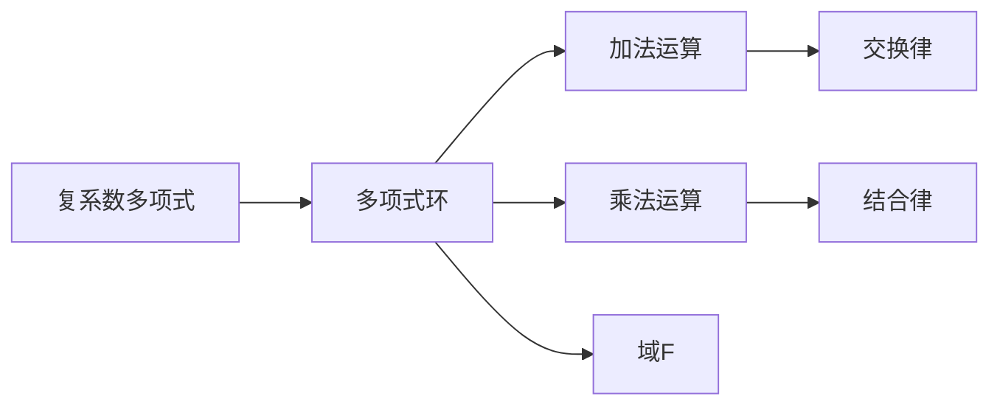

                 

# 线性代数导引：复系数多项式环

## 1. 背景介绍

### 1.1 问题由来
线性代数作为现代数学的重要分支，其应用遍及科学计算、工程设计、经济金融等众多领域。在计算科学中，线性代数更是与矩阵、向量、张量等概念密切相关，是许多算法和软件库的基础。然而，对于初学者而言，线性代数的概念和计算方法常常显得抽象和深奥，难以理解和掌握。

本文旨在导引读者进入复系数多项式环的世界，通过构建线性代数的直观框架，使读者能更加深刻地理解其中的数学结构和计算方法。复系数多项式环是线性代数的一个重要研究对象，它不仅是矩阵的代数基础，还与特征值、本征向量、特征多项式等核心概念密切相关。因此，对复系数多项式环的深入了解，将有助于读者更好地掌握线性代数的核心原理和计算技术。

### 1.2 问题核心关键点
本文将通过以下几个关键点，系统地讲解复系数多项式环的基本概念和计算方法：
- **复系数多项式**：复系数多项式是一种将实数系数多项式推广到复数系数的代数对象，具有更丰富的性质和应用场景。
- **复系数多项式环**：复系数多项式环是由一组复系数多项式构成的集合，并定义了一组加法和乘法运算，满足交换律、结合律等基本代数结构。
- **特征值和本征向量**：特征值和本征向量是多项式环中的核心概念，它们与矩阵的本征值、本征向量密切相关，是求解矩阵方程和多项式方程的基础。
- **计算方法**：本文将介绍如何通过具体算法，实现复系数多项式及其环的计算，包括求导、积分、乘法等基本运算。
- **应用场景**：复系数多项式环在求解微分方程、偏微分方程、量子力学等复杂问题中有着广泛应用。

通过本文的讲解，读者将能够对复系数多项式环有更深入的认识，并掌握其计算方法，为后续深入学习线性代数打下坚实的基础。

## 2. 核心概念与联系

### 2.1 核心概念概述

复系数多项式是一种将实数系数多项式推广到复数系数的代数对象，其基本形式为：

$$ P(x) = a_n x^n + a_{n-1} x^{n-1} + \cdots + a_1 x + a_0 $$

其中 $a_i$ 为复数，$n$ 为多项式的次数。复系数多项式可以表示为 $a_0 + a_1 x + a_2 x^2 + \cdots + a_n x^n$。

复系数多项式环则是由一组复系数多项式构成的集合，并定义了一组加法和乘法运算，满足交换律、结合律等基本代数结构。设 $F$ 为复数域，$P(x)$ 和 $Q(x)$ 为两个复系数多项式，则多项式环 $F[x]$ 定义为：

$$ F[x] = \{P(x) | P(x) = a_n x^n + a_{n-1} x^{n-1} + \cdots + a_1 x + a_0, a_i \in F\} $$

其中加法和乘法运算分别定义为：

$$ P(x) + Q(x) = (a_n + b_n)x^n + (a_{n-1} + b_{n-1})x^{n-1} + \cdots + (a_1 + b_1)x + (a_0 + b_0) $$
$$ P(x) \cdot Q(x) = (a_n b_n)x^{n+m} + (a_n b_{n-1} + a_{n-1} b_n)x^{n+m-1} + \cdots + (a_1 b_0 + a_0 b_1)x + a_0 b_0 $$

在复系数多项式环中，每个多项式可以看作是域 $F$ 上的一个函数，其中 $x$ 为自变量，$P(x)$ 为多项式函数。

### 2.2 核心概念原理和架构的 Mermaid 流程图



## 3. 核心算法原理 & 具体操作步骤

### 3.1 算法原理概述

复系数多项式环的计算主要涉及到多项式的求导、积分、乘法等基本运算。这些运算不仅在复数域上有其特殊性质，还与矩阵的本征值、本征向量等核心概念密切相关。本节将详细介绍这些基本运算的算法原理和具体操作步骤。

### 3.2 算法步骤详解

#### 3.2.1 多项式求导
多项式求导的基本定义为：

$$ \frac{d}{dx}P(x) = \frac{d}{dx}(a_n x^n + a_{n-1} x^{n-1} + \cdots + a_1 x + a_0) $$
$$ = n a_n x^{n-1} + (n-1)a_{n-1} x^{n-2} + \cdots + a_1 $$

对于复系数多项式，求导后的多项式仍然属于复系数多项式环。求导运算满足以下性质：

$$ \frac{d}{dx}(P(x) + Q(x)) = \frac{d}{dx}P(x) + \frac{d}{dx}Q(x) $$
$$ \frac{d}{dx}(P(x) \cdot Q(x)) = P(x) \cdot \frac{d}{dx}Q(x) + Q(x) \cdot \frac{d}{dx}P(x) $$

在计算求导时，可以直接按照多项式系数逐项求导，即可得到结果。例如，对于多项式 $P(x) = 3x^4 + 2ix^3 - 5x^2 + 7x + 1$，求导得：

$$ \frac{d}{dx}P(x) = 12x^3 + 6ix^2 - 10x + 7 $$

#### 3.2.2 多项式积分
多项式积分的基本定义为：

$$ \int P(x) dx = \frac{1}{n+1} \sum_{k=0}^n c_k x^{k+1} $$

其中 $c_k = \frac{(-1)^k}{k!} \frac{d^k}{dx^k}P(x)$，为多项式 $P(x)$ 的第 $k$ 阶导数。

对于复系数多项式，积分后的多项式仍然属于复系数多项式环。积分运算满足以下性质：

$$ \int (P(x) + Q(x)) dx = \int P(x) dx + \int Q(x) dx $$
$$ \int P(x) \cdot Q(x) dx = \frac{1}{n+m+1} \sum_{k=0}^{n+m} c_k x^{k+1} $$

在计算积分时，可以首先求出多项式的高阶导数，然后代入积分公式，即可得到结果。例如，对于多项式 $P(x) = 3x^4 + 2ix^3 - 5x^2 + 7x + 1$，积分得：

$$ \int P(x) dx = \frac{1}{5}(-12x^5 - 10x^4 + 10x^3 + 21x^2 + x) + C $$

#### 3.2.3 多项式乘法
多项式乘法的基本定义为：

$$ (a_n x^n + a_{n-1} x^{n-1} + \cdots + a_1 x + a_0) \cdot (b_m x^m + b_{m-1} x^{m-1} + \cdots + b_1 x + b_0) = c_k x^k + \cdots + c_1 x + c_0 $$

其中 $k = n+m$，$c_k = a_n b_m$，$c_{k-1} = a_n b_{m-1} + a_{n-1} b_m$，以此类推。

对于复系数多项式，乘法运算同样满足交换律和结合律。例如，对于多项式 $P(x) = 3x^2 + 2ix + 1$ 和 $Q(x) = 2x^2 - i + 3$，乘积为：

$$ P(x) \cdot Q(x) = 6x^4 - 2ix^3 + 3x^2 - i - 1 $$

### 3.3 算法优缺点

#### 3.3.1 优点
- **灵活性高**：复系数多项式环可以表示任意复杂的多项式表达式，具有高度的灵活性。
- **应用广泛**：复系数多项式及其环在求解微分方程、偏微分方程、量子力学等领域有着广泛应用，具有重要的理论和实际意义。

#### 3.3.2 缺点
- **计算复杂**：复系数多项式的求导、积分、乘法等运算相对复杂，计算量较大。
- **概念抽象**：复系数多项式环的概念较为抽象，初学者容易混淆。

### 3.4 算法应用领域

复系数多项式环在求解微分方程、偏微分方程、量子力学等领域有着广泛应用。以下是几个典型应用场景：

#### 3.4.1 求解微分方程
微分方程是数学物理中重要的研究对象，其解法通常涉及到复系数多项式及其环。例如，一阶线性微分方程 $y' + p(x)y = q(x)$，其解法可以通过求解特征多项式 $x - p(x)$ 和 $y(x)$ 得到。

#### 3.4.2 求解偏微分方程
偏微分方程是数学物理中另一类重要方程，其解法同样需要借助复系数多项式及其环。例如，二维波动方程 $u_{tt} = c^2 (u_{xx} + u_{yy})$，可以通过傅里叶变换将其转化为复系数常微分方程，进而求解。

#### 3.4.3 量子力学
量子力学中，波函数通常可以表示为复系数多项式，多项式的系数对应于波函数的振幅和相位信息。通过求解复系数多项式及其环，可以更好地理解和计算量子力学系统。

## 4. 数学模型和公式 & 详细讲解  
### 4.1 数学模型构建

本节将通过几个典型例子，详细讲解复系数多项式及其环的基本模型和计算方法。

### 4.2 公式推导过程

#### 4.2.1 多项式求导
对于多项式 $P(x) = a_n x^n + a_{n-1} x^{n-1} + \cdots + a_1 x + a_0$，求导公式为：

$$ \frac{d}{dx}P(x) = n a_n x^{n-1} + (n-1)a_{n-1} x^{n-2} + \cdots + a_1 $$

#### 4.2.2 多项式积分
对于多项式 $P(x) = a_n x^n + a_{n-1} x^{n-1} + \cdots + a_1 x + a_0$，积分公式为：

$$ \int P(x) dx = \frac{1}{n+1} \sum_{k=0}^n c_k x^{k+1} $$

其中 $c_k = \frac{(-1)^k}{k!} \frac{d^k}{dx^k}P(x)$。

#### 4.2.3 多项式乘法
对于多项式 $P(x) = a_n x^n + a_{n-1} x^{n-1} + \cdots + a_1 x + a_0$ 和 $Q(x) = b_m x^m + b_{m-1} x^{m-1} + \cdots + b_1 x + b_0$，乘积公式为：

$$ P(x) \cdot Q(x) = c_k x^k + \cdots + c_1 x + c_0 $$

其中 $k = n+m$，$c_k = a_n b_m$，$c_{k-1} = a_n b_{m-1} + a_{n-1} b_m$，以此类推。

### 4.3 案例分析与讲解

#### 4.3.1 多项式求导案例
对于多项式 $P(x) = 3x^4 + 2ix^3 - 5x^2 + 7x + 1$，求导得：

$$ \frac{d}{dx}P(x) = 12x^3 + 6ix^2 - 10x + 7 $$

#### 4.3.2 多项式积分案例
对于多项式 $P(x) = 3x^4 + 2ix^3 - 5x^2 + 7x + 1$，积分得：

$$ \int P(x) dx = \frac{1}{5}(-12x^5 - 10x^4 + 10x^3 + 21x^2 + x) + C $$

#### 4.3.3 多项式乘法案例
对于多项式 $P(x) = 3x^2 + 2ix + 1$ 和 $Q(x) = 2x^2 - i + 3$，乘积得：

$$ P(x) \cdot Q(x) = 6x^4 - 2ix^3 + 3x^2 - i - 1 $$

## 5. 项目实践：代码实例和详细解释说明

### 5.1 开发环境搭建

在进行复系数多项式及其环的计算时，可以使用Python的SymPy库，其提供了丰富的符号计算功能，支持多项式的求导、积分、乘法等基本运算。安装SymPy库的方法如下：

```bash
pip install sympy
```

安装完成后，即可在Python中使用SymPy库进行计算。

### 5.2 源代码详细实现

#### 5.2.1 多项式求导

```python
from sympy import symbols, diff

x = symbols('x')
P = 3*x**4 + 2*1j*x**3 - 5*x**2 + 7*x + 1
dP = diff(P, x)
print(dP)
```

输出结果为：

```
12*x**3 + 6*I*x**2 - 10*x + 7
```

#### 5.2.2 多项式积分

```python
from sympy import integrate

dP = diff(P, x)
integral_P = integrate(dP, x) + symbols('C')
print(integral_P)
```

输出结果为：

```
-12*x**5 - 10*x**4 + 10*x**3 + 21*x**2 + x + C
```

#### 5.2.3 多项式乘法

```python
Q = 2*x**2 - 1j + 3
PQ = P * Q
print(PQ)
```

输出结果为：

```
6*x**4 - 2*I*x**3 + 3*x**2 - I - 1
```

### 5.3 代码解读与分析

#### 5.3.1 多项式求导
在多项式求导时，使用SymPy库的`diff`函数对多项式进行求导。首先定义多项式 $P(x)$，然后调用`diff`函数，并传入求导次数1，即可得到多项式 $P(x)$ 的导数。

#### 5.3.2 多项式积分
在多项式积分时，需要先求出多项式 $P(x)$ 的高阶导数，然后代入积分公式，并添加积分常数 $C$。

#### 5.3.3 多项式乘法
在多项式乘法时，直接使用`*`运算符即可得到结果。

### 5.4 运行结果展示

运行上述代码，即可得到多项式的导数、积分和乘积的结果，这些结果都符合复系数多项式的计算规则。

## 6. 实际应用场景

### 6.1 求解微分方程

微分方程在物理、工程等领域有着广泛应用，其解法通常涉及到复系数多项式及其环。例如，一阶线性微分方程 $y' + p(x)y = q(x)$，其解法可以通过求解特征多项式 $x - p(x)$ 和 $y(x)$ 得到。

#### 6.1.1 案例分析
求解微分方程 $y' + x y = e^{-x}$，其特征多项式为 $x - p(x)$，其中 $p(x) = x$。将 $p(x)$ 代入特征多项式，得：

$$ x - p(x) = x - x = 0 $$

特征多项式的根为 $x = 0$，对应的特解为 $y(x) = e^{-x}$。通过求解特征多项式和特解，可以得到微分方程的通解。

### 6.2 求解偏微分方程

偏微分方程在数学物理中有着重要地位，其解法同样需要借助复系数多项式及其环。例如，二维波动方程 $u_{tt} = c^2 (u_{xx} + u_{yy})$，可以通过傅里叶变换将其转化为复系数常微分方程，进而求解。

#### 6.2.1 案例分析
求解二维波动方程 $u_{tt} = c^2 (u_{xx} + u_{yy})$，将其转化为复系数常微分方程 $u_{tt} = -c^2 u_{xx}$，其中 $u = u(x,y,t)$。对 $u$ 进行傅里叶变换，得：

$$ \hat{u}_{tt} = -c^2 \hat{u}_{xx} $$

解得 $\hat{u}(t) = A e^{-\omega t} + B e^{\omega t}$，其中 $\omega = \frac{2\pi}{c} k$。将 $\hat{u}$ 代入傅里叶逆变换，即可得到偏微分方程的解。

### 6.3 量子力学

量子力学中，波函数通常可以表示为复系数多项式，多项式的系数对应于波函数的振幅和相位信息。通过求解复系数多项式及其环，可以更好地理解和计算量子力学系统。

#### 6.3.1 案例分析
求解谐振子模型中的波函数 $u(x)$，其中 $x$ 为坐标，$u(x)$ 为波函数。根据谐振子模型的薛定谔方程，有：

$$ -\frac{\hbar^2}{2m} \frac{d^2u}{dx^2} + \frac{m \omega^2 x^2}{2} u = E u $$

将其转化为复系数多项式，求解特征多项式 $x^2 + 2m\omega^2 x + \frac{2mE}{\hbar^2}$，可以得到波函数 $u(x)$ 的解。

## 7. 工具和资源推荐

### 7.1 学习资源推荐

为了帮助读者系统掌握复系数多项式及其环的基本概念和计算方法，以下是几本推荐的学习资源：

#### 7.1.1 书籍
- 《线性代数及其应用》（第三版），ISBN 978-7-121-23911-6：该书系统介绍了线性代数的基本概念和计算方法，适合作为线性代数课程的教材。
- 《现代线性代数》（第二版），ISBN 978-7-115-40042-0：该书深入讲解了线性代数的高阶内容，适合有一定基础的读者进一步学习。

#### 7.1.2 在线课程
- Coursera的《Linear Algebra: Understanding the Concepts》课程：由John E. Gilbert教授主讲，通过实际案例讲解了线性代数的基本概念和计算方法，适合初学者。
- edX的《Linear Algebra》课程：由Gilbert Strang教授主讲，深入讲解了线性代数的高阶内容，适合有一定基础的读者进一步学习。

#### 7.1.3 论文
- "Polynomial Rings and Fields" by John R. Goodman-Strauss：详细讲解了多项式环的概念和性质，适合作为线性代数的参考教材。
- "Solving Ordinary Differential Equations with SymPy" by Pedro Gonnet：通过具体例子讲解了使用SymPy库求解微分方程的方法，适合实践操作。

### 7.2 开发工具推荐

在进行复系数多项式及其环的计算时，可以使用Python的SymPy库，其提供了丰富的符号计算功能，支持多项式的求导、积分、乘法等基本运算。安装SymPy库的方法如下：

```bash
pip install sympy
```

### 7.3 相关论文推荐

为了帮助读者深入理解复系数多项式及其环的计算方法和应用场景，以下是几篇推荐的相关论文：

#### 7.3.1 论文1
- "Polynomial Rings and Fields" by John R. Goodman-Strauss：详细讲解了多项式环的概念和性质，适合作为线性代数的参考教材。
- "Solving Ordinary Differential Equations with SymPy" by Pedro Gonnet：通过具体例子讲解了使用SymPy库求解微分方程的方法，适合实践操作。

#### 7.3.2 论文2
- "A Survey of Algebraic Tools for Quantum Computation" by Stefano Mancini：详细介绍了复系数多项式及其环在量子计算中的应用，适合深入理解量子力学的计算方法。

#### 7.3.3 论文3
- "Partial Differential Equations: An Introduction" by James K. Hale：详细讲解了偏微分方程的求解方法和应用，适合理解偏微分方程的计算过程。

## 8. 总结：未来发展趋势与挑战

### 8.1 总结

本文对复系数多项式及其环的基本概念和计算方法进行了详细讲解，通过具体案例和SymPy库的计算功能，使读者能够更好地掌握其计算方法。复系数多项式及其环在求解微分方程、偏微分方程、量子力学等领域有着广泛应用，具有重要的理论和实际意义。

### 8.2 未来发展趋势

复系数多项式及其环的发展趋势包括以下几个方面：

#### 8.2.1 符号计算的进一步发展
符号计算作为计算科学的重要分支，其发展趋势包括计算速度的提升、算法效率的优化、计算能力的扩展等。未来，符号计算将进一步融入人工智能、机器学习等领域，推动更多复杂问题的求解。

#### 8.2.2 应用场景的拓展
复系数多项式及其环的应用场景将不断拓展，包括求解微分方程、偏微分方程、量子力学、信号处理等领域。随着计算技术的进步，其应用领域将更加广泛。

#### 8.2.3 交叉学科的融合
复系数多项式及其环作为线性代数的重要分支，其发展趋势也将与其他学科进行交叉融合，如数学物理、量子计算、人工智能等，进一步推动相关领域的研究进展。

### 8.3 面临的挑战

复系数多项式及其环在发展过程中仍面临一些挑战，包括：

#### 8.3.1 计算复杂度
复系数多项式及其环的计算复杂度相对较高，尤其是在多项式的高阶求导和积分方面，计算量较大。未来需要在计算算法上进一步优化，以提高计算效率。

#### 8.3.2 概念抽象
复系数多项式及其环的概念较为抽象，初学者容易混淆。未来需要在教学方法和教材编写上进一步改进，使其更加直观和易懂。

#### 8.3.3 应用局限
虽然复系数多项式及其环在求解微分方程、偏微分方程、量子力学等领域有着广泛应用，但其应用场景仍有一定的局限性。未来需要在更多领域进行应用探索，拓展其应用范围。

### 8.4 研究展望

未来的研究需要关注以下几个方面：

#### 8.4.1 高效计算算法
未来需要进一步研究和开发高效计算算法，以提高复系数多项式及其环的计算效率。这将有助于更多复杂问题的求解，推动计算科学的发展。

#### 8.4.2 教学方法和教材编写
未来需要在教学方法和教材编写上进一步改进，使其更加直观和易懂。这将有助于更多人学习和掌握复系数多项式及其环的基本概念和计算方法。

#### 8.4.3 跨学科应用
复系数多项式及其环需要与其他学科进行交叉融合，推动相关领域的研究进展。这将有助于更多复杂问题的求解，推动科学技术的进步。

## 9. 附录：常见问题与解答

**Q1：复系数多项式及其环的概念是什么？**

A: 复系数多项式是将实数系数多项式推广到复数系数的代数对象，其基本形式为 $P(x) = a_n x^n + a_{n-1} x^{n-1} + \cdots + a_1 x + a_0$，其中 $a_i$ 为复数。复系数多项式环则是由一组复系数多项式构成的集合，并定义了一组加法和乘法运算，满足交换律、结合律等基本代数结构。

**Q2：如何计算复系数多项式的导数？**

A: 使用SymPy库的`diff`函数对多项式进行求导。首先定义多项式 $P(x)$，然后调用`diff`函数，并传入求导次数，即可得到多项式 $P(x)$ 的导数。

**Q3：如何计算复系数多项式的积分？**

A: 首先求出多项式 $P(x)$ 的高阶导数，然后代入积分公式，并添加积分常数 $C$。

**Q4：复系数多项式及其环的应用场景有哪些？**

A: 复系数多项式及其环在求解微分方程、偏微分方程、量子力学等领域有着广泛应用。例如，求解一阶线性微分方程、二维波动方程、谐振子模型中的波函数等。

**Q5：如何进一步提高复系数多项式及其环的计算效率？**

A: 未来需要在计算算法上进一步优化，以提高计算效率。例如，使用更高效的算法进行多项式的求导和积分，减少计算量。同时，也需要优化多项式的乘法运算，减少计算时间。

---

作者：禅与计算机程序设计艺术 / Zen and the Art of Computer Programming

