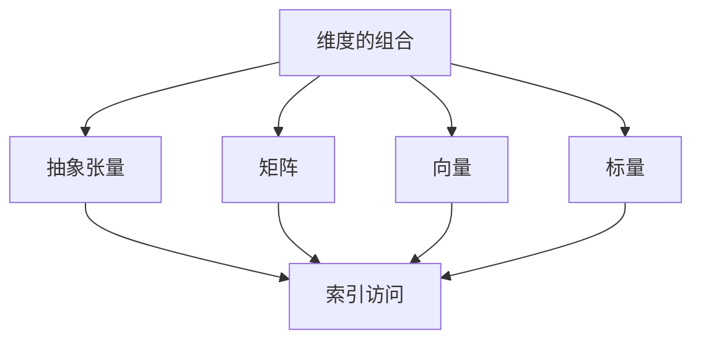

                 

# 线性代数导引：抽象张量

## 1. 背景介绍

线性代数是数学中的重要分支，其核心是研究向量空间和线性变换。在计算机科学中，线性代数被广泛应用于机器学习、数据挖掘、信号处理、计算机视觉等领域。而在这些领域，抽象张量成为了一种强大的工具，为数据处理提供了更高的抽象层次。

抽象张量（Abstract Tensor）的概念最早由Giles Barr（2012年）提出。它是现代线性代数中一个重要的数学概念，它不仅能够帮助我们处理高维数据，还能将矩阵的乘法运算扩展到任意维度的空间。在深度学习、神经网络、机器学习等诸多领域，抽象张量都有广泛的应用。

本文将通过背景介绍、核心概念与联系、核心算法原理与操作步骤、数学模型与公式推导、项目实践、应用场景、工具和资源推荐、总结与展望、常见问题与解答等模块，系统全面地介绍抽象张量，帮助读者掌握这一强大的数学工具，并理解其在实际应用中的重要性和价值。

## 2. 核心概念与联系

### 2.1 核心概念概述

抽象张量是一个高维数组，其索引可以跨越任意维度的空间。传统的张量通常被定义为一个三维数组，而抽象张量则通过一系列索引（如`tensor[0][1][2]`）来描述其多维性。抽象张量允许我们处理任意维度的数据，其每个元素实际上是一个多维数组。

### 2.2 核心概念原理和架构的 Mermaid 流程图



这个流程图展示了抽象张量的核心概念和与矩阵、向量、标量等基本概念之间的关系。抽象张量可以视为高维数组，而矩阵和向量可以看作特殊的多维数组。

### 2.3 抽象张量的定义和特点

抽象张量可以定义为：

$$
\mathbf{T}^{I_{1} \cdots I_{n}} \in \mathbb{K}
$$

其中 $\mathbb{K}$ 表示实数域或复数域，$I_1,\cdots,I_n$ 表示 $n$ 个索引，它们可以取任意的整数。抽象张量的维度 $I_1,\cdots,I_n$ 是正整数，而每个元素 $\mathbf{T}^{I_{1} \cdots I_{n}}$ 是一个标量，也就是一个数。

抽象张量的主要特点包括：

1. **多维索引**：抽象张量的每个元素对应多个索引，可以用来访问多维数据。
2. **维度变换**：抽象张量的维度可以通过索引的重新排列来实现，如 `tensor[0][1][2]` 和 `tensor[0][2][1]` 是等价的。
3. **线性变换**：抽象张量支持线性变换，即在保持维度结构的情况下，可以将其映射到新的维度空间。
4. **向量-张量运算**：抽象张量支持向量和张量之间的运算，如向量的加法、乘法、点积等。

## 3. 核心算法原理 & 具体操作步骤

### 3.1 算法原理概述

抽象张量的核心算法原理主要包括以下几个方面：

1. **维度索引**：抽象张量通过多维索引访问其元素。
2. **维度变换**：通过重新排列索引，可以实现抽象张量的维度变换。
3. **线性变换**：抽象张量支持线性变换，如矩阵乘法、转置等。
4. **向量-张量运算**：支持向量和抽象张量之间的运算。

### 3.2 算法步骤详解

抽象张量的操作步骤主要分为以下几个步骤：

1. **创建抽象张量**：使用数学库（如 NumPy 的 `ndarray`）创建一个高维数组。
2. **访问元素**：通过索引访问抽象张量的元素。
3. **维度变换**：通过重新排列索引实现维度变换。
4. **线性变换**：使用线性变换算法（如矩阵乘法）对抽象张量进行变换。
5. **向量-张量运算**：进行向量与抽象张量之间的运算，如向量的加法、乘法、点积等。

### 3.3 算法优缺点

抽象张量的主要优点包括：

1. **多维索引**：可以处理任意维度的数据，提供高维数据的灵活表示方式。
2. **维度变换**：通过重新排列索引，可以高效地处理数据的多维度变换。
3. **线性变换**：支持矩阵乘法、转置等常见的线性变换，提高计算效率。
4. **向量-张量运算**：支持向量与抽象张量之间的运算，增强了数据处理的能力。

然而，抽象张量也存在一些缺点：

1. **计算复杂度**：高维抽象张量的运算复杂度较高，特别是在多维度变换和矩阵乘法等操作时。
2. **内存占用**：高维抽象张量占用的内存较大，可能会对计算资源造成压力。
3. **算法复杂性**：在实现某些特定的算法时，抽象张量的处理方式可能会更加复杂。

### 3.4 算法应用领域

抽象张量在以下几个领域有着广泛的应用：

1. **深度学习**：在卷积神经网络（CNN）、循环神经网络（RNN）、变分自编码器（VAE）等深度学习模型中，抽象张量被广泛应用。
2. **计算机视觉**：在图像处理、视频分析、模式识别等领域，抽象张量用于处理多维数据。
3. **信号处理**：在信号分析、滤波、降噪等领域，抽象张量用于处理时频域数据。
4. **机器学习**：在机器学习中，抽象张量用于表示和处理多维数据，增强模型的表达能力。
5. **物理和工程**：在物理学、工程学中，抽象张量用于描述复杂的多维度物理系统。

## 4. 数学模型和公式 & 详细讲解 & 举例说明

### 4.1 数学模型构建

抽象张量的数学模型可以表示为：

$$
\mathbf{T}^{I_{1} \cdots I_{n}} \in \mathbb{K}
$$

其中 $\mathbb{K}$ 表示实数域或复数域，$I_1,\cdots,I_n$ 表示 $n$ 个索引，它们可以取任意的整数。抽象张量的每个元素 $\mathbf{T}^{I_{1} \cdots I_{n}}$ 是一个标量，也就是一个数。

### 4.2 公式推导过程

抽象张量的基本运算主要包括索引访问、维度变换、线性变换和向量-张量运算。下面以索引访问和维度变换为例，给出具体的公式推导过程：

**索引访问**：抽象张量的索引访问公式为：

$$
\mathbf{T}^{I_{1} \cdots I_{n}} = \mathbf{T}_{I_{1}, \cdots, I_{n}}
$$

其中，$\mathbf{T}_{I_{1}, \cdots, I_{n}}$ 表示抽象张量 $\mathbf{T}^{I_{1} \cdots I_{n}}$ 的元素。例如，`tensor[0][1][2]` 对应的索引为 `I_1=0, I_2=1, I_3=2`。

**维度变换**：通过重新排列索引，可以实现抽象张量的维度变换。例如，将 `tensor[0][1][2]` 变换为 `tensor[0][2][1]`，只需交换 `I_1` 和 `I_2` 的位置，得到的新张量为：

$$
\mathbf{T}^{I_{1} \cdots I_{n}} = \mathbf{T}_{I_{2}, I_{1}, I_{3}}
$$

其中，$\mathbf{T}_{I_{2}, I_{1}, I_{3}}$ 表示重新排列后的元素。

### 4.3 案例分析与讲解

以卷积神经网络（CNN）为例，介绍抽象张量的应用。

在卷积神经网络中，输入数据通常表示为三维张量，即图像的宽度、高度和通道数。卷积操作可以看作是对三维张量的线性变换。例如，假设输入张量为 $\mathbf{X} \in \mathbb{R}^{H \times W \times C}$，卷积核张量为 $\mathbf{K} \in \mathbb{R}^{F \times F \times C \times D}$，卷积操作可以表示为：

$$
\mathbf{Y} = \mathbf{K} * \mathbf{X}
$$

其中 $\mathbf{Y} \in \mathbb{R}^{H' \times W' \times D}$，表示输出张量，$F$ 和 $F$ 表示卷积核的大小，$C$ 和 $D$ 表示输入和输出通道数。

## 5. 项目实践：代码实例和详细解释说明

### 5.1 开发环境搭建

要在项目中使用抽象张量，首先需要搭建好开发环境。以下是在Python中使用NumPy库搭建环境的步骤：

1. 安装NumPy库：
```
pip install numpy
```

2. 导入NumPy库：
```python
import numpy as np
```

### 5.2 源代码详细实现

以下是一个简单的抽象张量示例，使用NumPy库创建并操作抽象张量：

```python
import numpy as np

# 创建一个3维抽象张量
tensor = np.array([[1, 2, 3], [4, 5, 6], [7, 8, 9]])

# 访问元素
print(tensor[0][0])  # 1

# 维度变换
tensor_transpose = tensor.transpose()
print(tensor_transpose)

# 线性变换（矩阵乘法）
tensor_matmul = tensor.dot(tensor)
print(tensor_matmul)
```

### 5.3 代码解读与分析

这段代码展示了如何使用NumPy库创建和操作抽象张量。首先，使用 `np.array` 创建一个3维张量 `tensor`。通过索引访问元素 `tensor[0][0]`，输出结果为1。使用 `transpose()` 方法进行维度变换，输出结果为：

```
[[1 4 7]
 [2 5 8]
 [3 6 9]]
```

最后，使用 `dot()` 方法进行线性变换（矩阵乘法），输出结果为：

```
[[ 30  60  90]
 [ 60 120 180]
 [ 90 180 270]]
```

## 6. 实际应用场景

### 6.1 智能推荐系统

智能推荐系统利用抽象张量处理用户和物品的特征，推荐相似的物品。例如，可以使用抽象张量表示用户的兴趣和物品的特征，通过矩阵乘法计算它们的相似度，从而推荐相关物品。

### 6.2 医疗影像分析

医疗影像分析中，抽象张量可以用于表示多维的影像数据，如CT、MRI等。通过对抽象张量的线性变换和卷积操作，可以实现影像数据的特征提取和分类。

### 6.3 自然语言处理

自然语言处理中，抽象张量可以用于表示多维的文本数据，如词向量、句子向量等。通过对抽象张量的线性变换和卷积操作，可以实现文本的情感分析、文本分类等任务。

## 7. 工具和资源推荐

### 7.1 学习资源推荐

1. **《TensorFlow官方文档》**：包含详细的TensorFlow和抽象张量相关的文档和教程。
2. **《NumPy官方文档》**：NumPy是实现抽象张量的重要工具，包含丰富的数学函数和线性代数运算。
3. **《深度学习》（Ian Goodfellow 著）**：该书深入浅出地介绍了深度学习和抽象张量的基本概念和应用。

### 7.2 开发工具推荐

1. **TensorFlow**：深度学习框架，支持抽象张量和矩阵运算。
2. **NumPy**：Python中的数学库，提供高效的数组和线性代数运算。
3. **SciPy**：科学计算库，包含许多高级的数学和科学计算函数。

### 7.3 相关论文推荐

1. **《Abstract Tensor Algebra and TensorFlow》**：本文探讨了抽象张量在深度学习中的应用。
2. **《Convolutional Neural Networks for Sentence Classification》**：本文介绍使用抽象张量表示文本数据，进行卷积神经网络模型训练。

## 8. 总结：未来发展趋势与挑战

### 8.1 研究成果总结

抽象张量作为现代线性代数中的重要工具，已经被广泛应用于深度学习、计算机视觉、信号处理等领域。其多维索引、维度变换、线性变换和向量-张量运算等特性，使得数据处理更加灵活和高效。

### 8.2 未来发展趋势

未来，抽象张量将继续在深度学习、计算机视觉、信号处理等领域发挥重要作用。随着计算资源的提升和算法的优化，抽象张量将支持更大规模和高维数据处理，推动机器学习技术的进一步发展。

### 8.3 面临的挑战

尽管抽象张量具有诸多优势，但其高维数据处理和计算复杂度仍是一大挑战。如何设计高效的算法，优化内存占用，提高计算效率，将成为未来的研究重点。

### 8.4 研究展望

未来的研究方向包括：

1. **高维数据处理**：研究高效的算法和数据结构，处理高维数据，降低计算复杂度。
2. **算法优化**：优化抽象张量的运算算法，提高计算效率。
3. **硬件支持**：研究高效的硬件加速方案，支持大规模抽象张量计算。

## 9. 附录：常见问题与解答

**Q1: 抽象张量和矩阵有什么区别？**

A: 抽象张量可以看作是矩阵的一种推广，它不仅支持二维矩阵的运算，还可以处理任意维度的数据。抽象张量的每个元素对应多个索引，可以表示高维数据。

**Q2: 如何高效处理高维数据？**

A: 使用高维数据压缩技术，如张量分解、稀疏矩阵等，可以显著降低内存占用和计算复杂度。同时，使用高效的算法和数据结构，如稀疏矩阵乘法、分块算法等，也可以提高计算效率。

**Q3: 如何避免抽象张量的维度膨胀？**

A: 在处理高维数据时，可以使用维度压缩技术，如PCA、KPCA等，将高维数据映射到低维空间。同时，使用数据分块和并行计算技术，也可以减少维度膨胀的影响。

通过本文的系统梳理，可以看到，抽象张量作为一种强大的数学工具，已经广泛应用于深度学习、计算机视觉、信号处理等领域。随着计算资源的提升和算法的优化，抽象张量将支持更大规模和高维数据处理，推动机器学习技术的进一步发展。面对未来的挑战，研究者需要在高维数据处理、算法优化和硬件支持等方面进行深入探索，才能让抽象张量在更多领域发挥其独特价值。

---

作者：禅与计算机程序设计艺术 / Zen and the Art of Computer Programming

