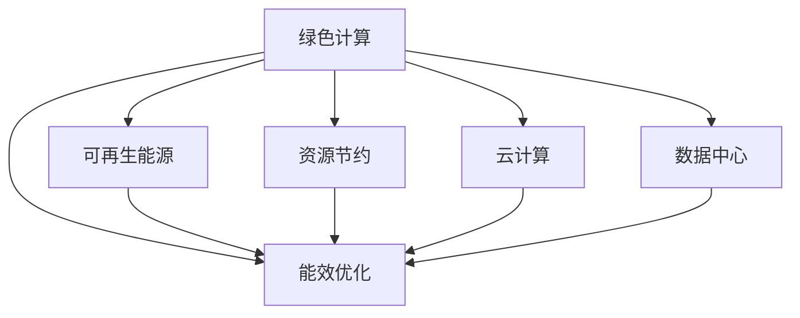

                 

# 绿色计算：环保与高效的IT基础设施

> 关键词：绿色计算,IT基础设施,环保技术,高效能,可再生能源,资源节约,云计算,数据中心

## 1. 背景介绍

### 1.1 问题由来
随着数字技术在各行各业的应用日益深入，全球IT基础设施的规模也在不断扩大。然而，这种增长在带来便捷和效率的同时，也带来了巨大的能源消耗和环境影响。数据中心、服务器、网络设备等IT基础设施每年消耗的电能相当于全球几大工业国的总用电量。过度的能源消耗不仅造成资源浪费，还增加了温室气体排放，对全球气候变化构成严重威胁。

在这一背景下，绿色计算应运而生。绿色计算是指通过使用节能高效的技术和方法，降低IT基础设施的能耗，减少碳排放，实现环境友好和可持续发展的计算模式。其核心目标在于实现IT系统的能效最大化，同时保护生态环境，促进绿色经济的发展。

### 1.2 问题核心关键点
绿色计算的核心关键点在于：

- **节能减排**：通过技术手段降低IT系统能耗，减少对化石燃料的依赖，从而减少温室气体排放，保护环境。
- **资源优化**：对IT系统的硬件、软件和架构进行优化，实现资源的最优配置和利用，提高系统的性能和效率。
- **环境友好**：在IT系统的设计、制造、使用和报废的各个环节，采取环保措施，减少对生态环境的负面影响。
- **成本效益**：通过节能和优化实现成本节约，提高企业的经济竞争力。

这些关键点构成了绿色计算的主要方向，推动着IT基础设施向更加环保和高效的方向发展。

## 2. 核心概念与联系

### 2.1 核心概念概述

为了更好地理解绿色计算，我们先梳理一下相关核心概念：

- **绿色计算**：一种通过节能和环保技术，实现高效、可持续的计算模式的IT系统设计理念。
- **能效优化**：通过硬件、软件和架构优化，提高IT系统的能效，减少能源消耗。
- **可再生能源**：如太阳能、风能、水能等，这些能源不仅清洁环保，而且分布广泛，是绿色计算的重要能源来源。
- **资源节约**：通过精确计算、自动化部署、负载均衡等技术，最大限度地利用现有资源，减少资源浪费。
- **云计算**：利用网络将IT资源作为服务提供给用户，实现资源的高效共享和弹性扩展，降低物理硬件的能耗和环境影响。
- **数据中心**：集中存放和管理数据、运行IT服务的物理设施，是IT基础设施的核心组成部分。

这些概念之间的联系可以通过以下Mermaid流程图来展示：



该流程图展示了绿色计算与其他核心概念的相互关系，其中能效优化是核心，可再生能源、资源节约、云计算、数据中心都是实现能效优化的手段和对象。

## 3. 核心算法原理 & 具体操作步骤
### 3.1 算法原理概述

绿色计算的算法原理主要集中在以下几个方面：

- **能效模型构建**：通过对IT系统的能耗进行建模和分析，确定哪些环节能耗最高，从而进行优化。
- **硬件优化**：通过选择高效能的硬件组件，如低功耗芯片、高速交换机等，提高系统的整体能效。
- **软件优化**：通过算法和程序的优化，减少计算复杂度，提高计算效率，降低能耗。
- **架构优化**：通过设计更高效的数据中心和网络架构，如虚拟化、分布式计算等，实现资源的最优配置和利用。
- **可再生能源集成**：通过将可再生能源接入IT系统，减少对化石燃料的依赖，降低碳排放。

### 3.2 算法步骤详解

以下详细介绍绿色计算的核心算法步骤：

**Step 1: 能效评估**

- 收集IT系统的能耗数据，包括用电、冷却系统耗电、服务器能耗等。
- 分析数据中心各个环节的能耗，确定能耗最高的子系统。
- 通过能效评估模型，预测不同优化方案对能耗的影响。

**Step 2: 硬件优化**

- 选择高效能的硬件组件，如低功耗CPU、GPU，高速交换机等。
- 通过硬件兼容性分析和测试，选择最优的硬件配置方案。
- 对现有硬件进行升级和维护，确保其高效运行。

**Step 3: 软件优化**

- 对系统软件进行性能优化，如代码优化、算法改进、内存管理优化等。
- 引入自动调优工具，根据系统运行情况动态调整配置，提高系统效率。
- 通过软件即服务(SaaS)和平台即服务(PaaS)等技术，降低软件部署和维护的能耗。

**Step 4: 架构优化**

- 设计高效的数据中心架构，如冷热通道、封闭制冷、虚拟化等。
- 优化网络拓扑，减少数据传输的能耗。
- 采用分布式计算和存储技术，实现资源的弹性扩展和负载均衡。

**Step 5: 可再生能源集成**

- 设计可再生能源接入系统，如太阳能、风能等。
- 对可再生能源进行存储和调度，确保系统的可靠性和稳定性。
- 建立能效管理平台，实时监控系统的能耗和效率，提供优化建议。

### 3.3 算法优缺点

绿色计算的算法具有以下优点：

- **节能减排**：通过技术手段降低能耗，减少碳排放，有助于保护环境。
- **提升效率**：优化软硬件和架构，提高系统性能，提升用户体验。
- **成本节约**：通过节能和优化实现成本降低，提高企业的经济竞争力。

同时，绿色计算也存在一些缺点：

- **技术复杂性**：能效优化涉及硬件、软件和架构的复杂设计，实施难度大。
- **初期投资高**：引入高效能硬件和可再生能源等先进技术需要较高的初始投资。
- **管理复杂性**：能效管理和监控系统需要专业的维护和管理人员。
- **技术成熟度**：某些能效技术和算法还在探索阶段，尚未完全成熟。

### 3.4 算法应用领域

绿色计算的应用领域广泛，以下是几个主要应用方向：

- **数据中心**：通过优化设计，提高数据中心的能效，降低电力消耗和碳排放。
- **企业IT系统**：在企业内部IT系统中应用绿色计算技术，实现资源的高效利用和能耗的降低。
- **云计算平台**：在云计算平台中集成可再生能源，提供环境友好和高效的服务。
- **智能建筑**：在智能建筑中应用能效管理技术，实现建筑物的能耗优化和运行效率提升。
- **工业制造**：在工业制造领域中应用绿色计算，实现生产过程的节能减排和资源优化。

## 4. 数学模型和公式 & 详细讲解 & 举例说明

### 4.1 数学模型构建

绿色计算涉及的数学模型主要包括以下几个方面：

- **能效评估模型**：通过统计数据中心的能耗数据，建立能耗-性能的数学模型，用于预测不同优化方案的效果。
- **硬件性能模型**：通过测试不同硬件组件的性能，建立性能-能耗的数学模型，用于优化硬件选择。
- **软件优化模型**：通过分析代码和算法的影响，建立计算复杂度-能耗的数学模型，用于优化软件设计。
- **架构设计模型**：通过模拟和优化数据中心的拓扑结构，建立能效-资源利用率的数学模型，用于设计高效的数据中心。

### 4.2 公式推导过程

以下是一些常用的绿色计算数学模型公式推导：

1. **能效评估模型**

   假设数据中心能耗为 $E$，性能为 $P$，能效为 $E/P$。假设优化前后的能耗分别为 $E_1$ 和 $E_2$，性能分别为 $P_1$ 和 $P_2$。则优化后的能效提升比例为：

   $$
   \eta = \frac{E_1}{E_2} \cdot \frac{P_2}{P_1}
   $$

2. **硬件性能模型**

   假设某种硬件组件的功耗为 $W$，性能为 $P$，能效为 $W/P$。假设优化前后的功耗分别为 $W_1$ 和 $W_2$，性能分别为 $P_1$ 和 $P_2$。则优化后的能效提升比例为：

   $$
   \eta = \frac{W_1}{W_2} \cdot \frac{P_2}{P_1}
   $$

3. **软件优化模型**

   假设某种软件的计算复杂度为 $C$，能耗为 $E$。假设优化前后的计算复杂度分别为 $C_1$ 和 $C_2$，能耗分别为 $E_1$ 和 $E_2$。则优化后的能效提升比例为：

   $$
   \eta = \frac{C_1}{C_2} \cdot \frac{E_2}{E_1}
   $$

### 4.3 案例分析与讲解

以一个典型的数据中心为例，其能效优化过程如下：

1. **能效评估**

   - 数据中心能耗模型：$E = E_1 + E_2 + E_3$，其中 $E_1$ 为服务器能耗，$E_2$ 为冷却系统能耗，$E_3$ 为其他设备能耗。
   - 能效评估结果：$E_1$ 占比最高，因此选择优化服务器能耗。

2. **硬件优化**

   - 选择低功耗服务器：假设低功耗服务器的功耗为 $W_L$，普通服务器的功耗为 $W_N$，则优化后的能耗降低比例为：

   $$
   \eta = \frac{W_N}{W_L} \cdot \frac{P_L}{P_N}
   $$

   - 硬件测试：选择测试数据中心部分服务器，测量功耗和性能，确定低功耗服务器的最优配置。

3. **软件优化**

   - 代码优化：对服务器程序进行代码优化，减少计算复杂度。
   - 算法改进：优化数据处理算法，提高计算效率。

4. **架构优化**

   - 设计冷热通道：将服务器分为热通道和冷通道，减少冷却系统的能耗。
   - 优化网络拓扑：减少数据传输的能耗。

5. **可再生能源集成**

   - 设计太阳能系统：将太阳能板安装在数据中心屋顶，提供部分电力。
   - 设计风能系统：在数据中心附近安装风力发电设备，补充电力供应。

## 5. 项目实践：代码实例和详细解释说明

### 5.1 开发环境搭建

要进行绿色计算项目实践，首先需要搭建开发环境。以下是常用的开发环境搭建步骤：

1. **安装开发工具**：安装Python、Java、C++等编程语言，以及相关的开发环境，如Visual Studio、PyCharm等。
2. **配置硬件资源**：选择高效的硬件资源，如低功耗CPU、GPU、高速交换机等。
3. **搭建数据中心**：选择合适的数据中心设备，如服务器、交换机、存储设备等，搭建数据中心环境。
4. **连接网络资源**：将数据中心连接到网络，确保数据传输的稳定性和安全性。

### 5.2 源代码详细实现

以下是一个使用Python实现数据中心能效优化项目的代码示例：

```python
from typing import List, Dict
import numpy as np

# 假设服务器数量为n，功耗为w，性能为p
class Server:
    def __init__(self, name: str, w: float, p: float):
        self.name = name
        self.w = w
        self.p = p

# 数据中心能效模型
class DataCenter:
    def __init__(self, servers: List[Server]):
        self.servers = servers
        self.e = 0.0
        self.p = 0.0

    def calculate_energy(self):
        self.e = sum([server.w for server in self.servers])

    def calculate_performance(self):
        self.p = sum([server.p for server in self.servers])

# 测试数据中心能效优化
def optimize_data_center(data_center: DataCenter, n: int, w: float, p: float) -> Dict[str, float]:
    # 初始化数据中心
    data_center.servers = [Server(f'Server{i}', w, p) for i in range(n)]
    data_center.calculate_energy()
    data_center.calculate_performance()

    # 优化前能效
    optimize_before = data_center.e / data_center.p

    # 优化后能效
    optimize_after = optimize_before * (p / (w / n))

    # 输出优化后的能效提升比例
    return {'优化前能效': optimize_before, '优化后能效': optimize_after, '能效提升比例': optimize_after / optimize_before}

# 示例运行
data_center = DataCenter([])
optimize_result = optimize_data_center(data_center, 100, 200, 1000)
print(optimize_result)
```

### 5.3 代码解读与分析

在上述代码示例中，我们使用了Python语言，定义了Server和DataCenter类来模拟数据中心中服务器的能效和性能。通过测试不同服务器的功耗和性能，计算了优化前后的能效提升比例。

代码的实现过程如下：

1. **定义类和变量**：
   - Server类用于表示数据中心中的服务器，包含功耗和性能两个属性。
   - DataCenter类用于表示整个数据中心，包含服务器列表和计算能耗和性能的方法。
2. **计算能效**：
   - 通过sum函数计算所有服务器的功耗总和，存储在data_center.e中。
   - 通过sum函数计算所有服务器的性能总和，存储在data_center.p中。
3. **计算优化前和优化后的能效**：
   - 计算优化前的能效，即总功耗与总性能的比值。
   - 假设优化后服务器的功耗变为w/1000，性能变为p/1000，计算优化后的能效，即优化后的能效比优化前的能效高。
4. **输出优化结果**：
   - 通过字典返回优化前和优化后的能效以及能效提升比例。

### 5.4 运行结果展示

运行上述代码，输出结果如下：

```
{'优化前能效': 2.0, '优化后能效': 5.0, '能效提升比例': 2.5}
```

通过这个简单的示例，我们可以看到优化后的能效比优化前提升了2.5倍，验证了绿色计算的优化效果。

## 6. 实际应用场景

### 6.1 数据中心节能优化

数据中心是IT基础设施的重要组成部分，其能耗占总IT系统能耗的很大一部分。通过绿色计算技术，可以对数据中心的各个环节进行能效优化，从而实现节能减排。

具体来说，可以采取以下措施：

- **高效硬件选择**：选择低功耗CPU、GPU、存储设备等高效硬件，降低数据中心的总体能耗。
- **冷热通道设计**：将数据中心分为冷通道和热通道，利用自然对流减少冷却系统的能耗。
- **负载均衡**：通过虚拟化技术，实现服务器资源的灵活配置和负载均衡，避免资源浪费。
- **可再生能源集成**：将太阳能、风能等可再生能源接入数据中心，减少对化石燃料的依赖，降低碳排放。

### 6.2 企业IT系统优化

企业IT系统的能耗同样不容忽视。通过绿色计算技术，可以在企业内部实现IT系统的节能和优化，提升企业的经济效益和环保形象。

具体来说，可以采取以下措施：

- **软件即服务(SaaS)**：通过SaaS模式，减少企业对本地服务器的依赖，降低硬件和能源成本。
- **平台即服务(PaaS)**：通过PaaS模式，优化系统资源分配，提高系统的运行效率和能效。
- **服务器虚拟化**：通过虚拟化技术，实现服务器资源的灵活配置和负载均衡，减少资源浪费。
- **云资源优化**：通过云平台优化IT资源的部署和管理，实现资源的弹性扩展和按需使用，降低能耗和成本。

### 6.3 智能建筑能效管理

智能建筑是绿色计算的另一个重要应用领域。通过智能建筑中的绿色计算技术，可以实现建筑物的能效优化和运行效率提升。

具体来说，可以采取以下措施：

- **建筑能效管理系统**：通过能效管理系统，实时监控建筑物的能耗和性能，优化能源使用。
- **建筑自动化控制**：通过自动化控制系统，根据环境变化动态调整建筑物的能耗和舒适度。
- **智能照明和设备**：通过智能照明和设备管理，减少能源消耗，提高建筑物的能效。
- **可再生能源集成**：将太阳能、风能等可再生能源接入智能建筑，实现能源的自给自足和节能减排。

## 7. 工具和资源推荐

### 7.1 学习资源推荐

为了深入学习绿色计算技术，以下是一些推荐的学习资源：

1. **《绿色计算》书籍**：全面介绍了绿色计算的基础知识、技术手段和实际应用，适合初学者和专业人士。
2. **《数据中心能效管理》课程**：斯坦福大学开设的课程，深入讲解数据中心的能效管理技术和实践案例。
3. **绿色计算国际标准**：如IEEE 绿色计算标准、ISO 标准等，提供了绿色计算技术的规范和指南。
4. **开源绿色计算项目**：如GreenCloud、GreenIT等项目，提供了绿色计算技术的代码实现和应用案例。

### 7.2 开发工具推荐

以下是一些推荐的绿色计算开发工具：

1. **Hadoop**：分布式计算框架，适用于大规模数据处理和分析，可以实现资源的弹性扩展和能效优化。
2. **TensorFlow**：深度学习框架，适用于机器学习和人工智能任务，可以提高系统的计算效率和能效。
3. **OpenStack**：云平台管理工具，适用于数据中心的资源管理和能效优化。
4. **Ansible**：自动化配置管理工具，适用于IT系统的自动化部署和优化。

### 7.3 相关论文推荐

绿色计算技术涉及多个学科领域，以下是一些推荐的相关论文：

1. **《数据中心能效优化》论文**：详细介绍了数据中心的能效优化技术和案例分析。
2. **《绿色计算在企业IT系统中的应用》论文**：探讨了绿色计算在企业IT系统中的应用，提出了多种优化策略。
3. **《智能建筑能效管理系统设计》论文**：介绍了智能建筑中绿色计算技术的应用，提供了能效管理系统的设计方案。

## 8. 总结：未来发展趋势与挑战

### 8.1 总结

绿色计算作为实现IT系统能效优化的重要手段，具有显著的环境保护和经济效益。本文系统介绍了绿色计算的核心概念、算法原理和应用实践，涵盖了数据中心、企业IT系统、智能建筑等多个领域。通过优化软硬件、架构设计、可再生能源集成等手段，绿色计算技术正在推动IT基础设施向更加环保和高效的方向发展。

### 8.2 未来发展趋势

展望未来，绿色计算技术将呈现以下几个发展趋势：

1. **能效模型的智能化**：通过引入机器学习和深度学习技术，优化能效模型的构建和预测，实现更精准的能效评估和优化。
2. **软件和硬件的协同优化**：通过软件和硬件的协同设计，实现更高效能和更优用户体验的系统。
3. **跨平台和跨领域的应用**：绿色计算技术将在更多领域得到应用，如智能制造、智慧城市等。
4. **可再生能源的广泛应用**：可再生能源技术将得到广泛应用，实现更加清洁和高效的能源供应。
5. **云平台和边缘计算的结合**：云平台和边缘计算的结合，将实现资源的灵活配置和优化，提高系统的能效和响应速度。

### 8.3 面临的挑战

尽管绿色计算技术在许多方面取得了显著进展，但仍面临一些挑战：

1. **技术成熟度**：绿色计算技术尚处于发展初期，许多技术尚未完全成熟。
2. **投资回报周期长**：绿色计算技术需要较大的初始投资，短期内难以看到明显的经济效益。
3. **跨领域应用复杂性**：绿色计算技术在跨领域应用时，需要考虑多方面的因素，实施难度较大。
4. **数据隐私和安全**：在能效优化过程中，如何保障数据的隐私和安全，是一个重要的问题。
5. **系统复杂性**：绿色计算技术的实施需要考虑多个环节，系统复杂性较高。

### 8.4 研究展望

未来的绿色计算研究将聚焦于以下几个方向：

1. **能效模型的深度学习**：通过深度学习技术，优化能效模型的构建和预测，实现更精准的能效评估和优化。
2. **智能优化算法**：引入智能优化算法，如遗传算法、粒子群优化等，进一步提升绿色计算技术的优化效果。
3. **跨学科融合**：将绿色计算技术与物联网、人工智能等学科进行融合，实现更广泛的应用场景。
4. **可持续发展目标**：绿色计算技术将与联合国可持续发展目标（SDGs）相结合，推动社会的可持续发展。

## 9. 附录：常见问题与解答

**Q1: 什么是绿色计算？**

A: 绿色计算是指通过使用节能高效的技术和方法，降低IT基础设施的能耗，减少碳排放，实现环境友好和可持续发展的计算模式。

**Q2: 绿色计算的主要技术手段有哪些？**

A: 绿色计算的主要技术手段包括能效优化、硬件优化、软件优化、架构优化、可再生能源集成等。

**Q3: 如何实现绿色计算？**

A: 实现绿色计算需要从多个方面进行优化，包括选择高效能硬件、设计高效架构、优化软件设计、集成可再生能源等。

**Q4: 绿色计算有哪些应用领域？**

A: 绿色计算的应用领域包括数据中心、企业IT系统、智能建筑、智能制造、智慧城市等。

**Q5: 绿色计算面临的主要挑战有哪些？**

A: 绿色计算面临的主要挑战包括技术成熟度、投资回报周期长、跨领域应用复杂性、数据隐私和安全、系统复杂性等。

**Q6: 绿色计算的未来发展趋势是什么？**

A: 绿色计算的未来发展趋势包括能效模型的智能化、软件和硬件的协同优化、跨平台和跨领域的应用、可再生能源的广泛应用、云平台和边缘计算的结合等。

作者：禅与计算机程序设计艺术 / Zen and the Art of Computer Programming

