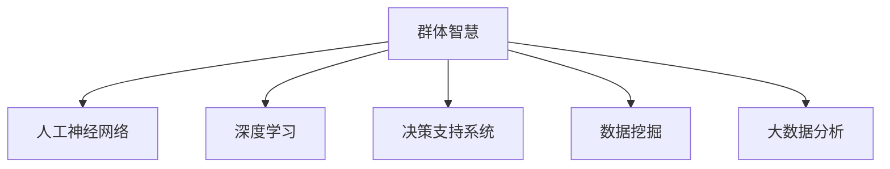

                 

# 群体智慧：决策的新利器

> 关键词：群体智慧, 决策, 人工神经网络, 深度学习, 决策支持系统, 数据挖掘, 大数据分析, 智能算法

## 1. 背景介绍

在现代社会，信息爆炸与资源有限的矛盾愈发凸显。个体依靠传统决策方法，难以应对海量数据带来的挑战，而群体智慧则成为解决这一问题的利器。通过大规模数据汇聚和智能算法辅助，群体智慧实现了集体智慧的整合与挖掘，赋予决策以强大的智能支持。

### 1.1 问题由来

面对复杂多变的决策场景，个体决策存在诸多局限性：

- 数据不足：单个人员掌握的信息有限，难以进行全面分析。
- 经验有限：经验丰富的人员占比少，决策受限于个人认知。
- 时间紧迫：在快速变化的环境下，个体难以迅速作出准确判断。

相比之下，群体智慧能够将大规模数据与集体智慧相结合，在全息视野、丰富经验和时间优势的基础上，进行更科学、更高效的决策。群体智慧不仅仅是集体的意见汇总，更通过智能算法对信息进行深入分析和挖掘，为决策提供高质量的辅助。

### 1.2 问题核心关键点

群体智慧的关键点包括：

- 数据聚合：利用大数据技术汇聚各类信息，构建全貌。
- 智能分析：使用深度学习、数据挖掘等智能算法，进行知识提取和模型构建。
- 集体决策：结合集体智慧，通过群体讨论、投票等方式作出决策。
- 动态调整：根据新信息实时调整决策，保持决策的动态性和前瞻性。

本文将重点探讨群体智慧的核心算法原理，详细讲解其操作步骤，分析其优缺点，并展望其应用领域。

## 2. 核心概念与联系

### 2.1 核心概念概述

- **群体智慧（Collective Wisdom）**：通过整合大量数据和集体智慧，利用智能算法辅助，作出高质量的决策。
- **人工神经网络（Artificial Neural Network, ANN）**：模仿人脑神经元之间连接的方式构建的计算模型，用于处理非线性关系和复杂模式。
- **深度学习（Deep Learning）**：一种利用多层神经网络进行复杂模式识别和预测的机器学习方法。
- **决策支持系统（Decision Support System, DSS）**：利用计算机技术和智能算法，辅助决策者进行决策的系统。
- **数据挖掘（Data Mining）**：从大量数据中自动发现有用的信息和知识的过程。
- **大数据分析（Big Data Analytics）**：对海量数据进行收集、存储、处理和分析的过程。

这些概念通过以下Mermaid流程图进行联系展示：



以上流程图展示了大规模数据、集体智慧与智能算法三者之间的联系，群体智慧即通过这些技术手段形成。

## 3. 核心算法原理 & 具体操作步骤

### 3.1 算法原理概述

群体智慧的决策过程基于大规模数据和智能算法的结合。其核心在于：

- **数据聚合**：收集各类数据，构建全貌，为决策提供数据基础。
- **智能分析**：使用深度学习、数据挖掘等技术，从数据中提取知识，形成智能模型。
- **集体决策**：结合集体智慧，进行决策的民主化、科学化。

形式化地，群体智慧的决策过程可表示为：

1. **数据聚合**：数据采集与清洗
2. **智能分析**：知识提取与模型构建
3. **集体决策**：决策融合与输出

### 3.2 算法步骤详解

#### 3.2.1 数据聚合

数据聚合是群体智慧决策的基础。其步骤包括：

- **数据采集**：从各种数据源（如社交网络、企业数据库、物联网等）采集相关数据。
- **数据清洗**：去除噪声和冗余数据，确保数据的完整性和准确性。
- **数据融合**：利用数据融合技术，如加权平均、主成分分析等，将不同数据源的信息整合。

#### 3.2.2 智能分析

智能分析是群体智慧决策的核心。其步骤包括：

- **特征提取**：使用数据挖掘技术，从原始数据中提取有用的特征，如文本的TF-IDF、图像的SIFT等。
- **模型训练**：使用深度学习算法，如卷积神经网络（CNN）、循环神经网络（RNN）、长短时记忆网络（LSTM）等，构建智能模型。
- **知识提取**：利用智能算法，从模型中提取关键知识，如预测结果、关联规则等。

#### 3.2.3 集体决策

集体决策是群体智慧决策的最终环节。其步骤包括：

- **意见汇聚**：将各方的意见进行汇总，如利用投票机制、德尔菲法等。
- **决策融合**：使用决策融合算法，如加权平均、最大加权平均、贝叶斯网络等，综合不同决策者的意见。
- **输出决策**：根据融合后的决策结果，输出最终决策。

### 3.3 算法优缺点

#### 3.3.1 优点

- **全貌视野**：大规模数据汇聚使决策基于更全面的信息。
- **智能辅助**：深度学习、数据挖掘等技术使决策更加科学。
- **集体智慧**：集体决策机制使决策更加民主化和科学化。
- **动态适应**：可以根据新信息实时调整决策，保持决策的前瞻性。

#### 3.3.2 缺点

- **数据质量**：数据收集和清洗难度大，数据质量可能影响决策准确性。
- **算法复杂性**：智能算法模型复杂，需要较强的技术背景。
- **集体协调**：集体决策可能受到人为因素影响，如偏见、群体极化等。
- **资源需求**：数据存储和处理需要大量计算资源，对硬件要求较高。

### 3.4 算法应用领域

群体智慧的决策范式已经在多个领域得到广泛应用，例如：

- **金融风险管理**：利用大数据分析，辅助银行进行信用评估和风险控制。
- **医疗诊断**：通过智能算法分析病历和医学图像，辅助医生进行诊断。
- **供应链管理**：利用数据挖掘技术，优化供应链流程，提高效率。
- **城市交通管理**：通过智能算法分析交通数据，优化交通信号灯控制。
- **市场分析**：利用大数据分析，预测市场趋势，指导企业决策。

以上领域展示了群体智慧在实际应用中的多样性，其在复杂决策场景中的巨大潜力得到了充分验证。

## 4. 数学模型和公式 & 详细讲解 & 举例说明

### 4.1 数学模型构建

群体智慧的决策过程可以通过数学模型进行形式化描述。假设决策问题为 $P$，数据集为 $D$，集体决策者的数量为 $N$，决策融合算法为 $F$，则决策过程可以表示为：

$$
D \xrightarrow[]{A} F(D) \xrightarrow[]{C} \{A_1, A_2, ..., A_N\} \xrightarrow[]{F} P
$$

其中，$A$ 表示数据聚合过程，$F$ 表示智能分析过程，$C$ 表示集体决策过程。

### 4.2 公式推导过程

以金融风险管理为例，假设数据集为 $D=\{(x_i,y_i)\}_{i=1}^N$，其中 $x_i$ 为输入特征，$y_i$ 为真实标签，$A$ 为数据聚合算法，$F$ 为智能分析算法，$C$ 为集体决策算法。则决策过程可以表示为：

$$
D \xrightarrow[]{A} F(D) \xrightarrow[]{C} P
$$

具体步骤如下：

1. **数据聚合**：通过加权平均算法对数据进行聚合，得到聚合后的特征向量 $A(D)$。
2. **智能分析**：使用决策树模型对特征向量进行分类，得到风险等级 $F(A(D))$。
3. **集体决策**：将风险等级传入民主投票算法，得到最终决策 $C(F(A(D)))$。

### 4.3 案例分析与讲解

以医疗诊断为例，假设数据集为 $D=\{(x_i,y_i)\}_{i=1}^N$，其中 $x_i$ 为病历数据，$y_i$ 为诊断结果，$A$ 为数据聚合算法，$F$ 为智能分析算法，$C$ 为集体决策算法。则决策过程可以表示为：

1. **数据聚合**：通过主成分分析（PCA）对病历数据进行降维，得到降维后的特征向量 $A(D)$。
2. **智能分析**：使用卷积神经网络（CNN）对特征向量进行图像处理，得到诊断结果 $F(A(D))$。
3. **集体决策**：将诊断结果传入贝叶斯网络，得到最终诊断决策 $C(F(A(D)))$。

在实际应用中，不同领域和任务的具体模型选择和算法流程可能有所不同，但基本框架保持一致。

## 5. 项目实践：代码实例和详细解释说明

### 5.1 开发环境搭建

在开始代码实践前，需要先搭建开发环境。以下是Python开发环境搭建的步骤：

1. **安装Python和pip**：
```bash
sudo apt-get update
sudo apt-get install python3-pip python3-dev
```

2. **创建虚拟环境**：
```bash
python3 -m venv venv
source venv/bin/activate
```

3. **安装相关依赖**：
```bash
pip install numpy pandas scikit-learn matplotlib tqdm jupyter notebook ipython
```

4. **安装深度学习库**：
```bash
pip install tensorflow tensorflow-gpu
```

### 5.2 源代码详细实现

以下是基于TensorFlow的群体智慧决策系统示例代码：

```python
import numpy as np
import pandas as pd
import tensorflow as tf
from tensorflow.keras import layers
from sklearn.model_selection import train_test_split

# 准备数据集
df = pd.read_csv('data.csv')

# 数据清洗和预处理
features = df[['feature1', 'feature2', 'feature3']]
labels = df['label']
features = np.array(features)
labels = np.array(labels)

# 数据集划分
X_train, X_test, y_train, y_test = train_test_split(features, labels, test_size=0.2)

# 定义模型
model = tf.keras.Sequential([
    layers.Dense(32, activation='relu', input_shape=(features.shape[1],)),
    layers.Dense(32, activation='relu'),
    layers.Dense(1, activation='sigmoid')
])

# 编译模型
model.compile(optimizer='adam', loss='binary_crossentropy', metrics=['accuracy'])

# 训练模型
model.fit(X_train, y_train, epochs=10, batch_size=32, validation_data=(X_test, y_test))

# 使用模型进行预测
X_new = np.array([[1, 2, 3]])
prediction = model.predict(X_new)
print(prediction)
```

### 5.3 代码解读与分析

**数据准备**：
- `pd.read_csv('data.csv')`：从CSV文件中读取数据。
- `features = df[['feature1', 'feature2', 'feature3']]`：提取数据集中的特征列。
- `labels = df['label']`：提取数据集中的标签列。

**数据清洗和预处理**：
- `features = np.array(features)`：将数据转换为NumPy数组。
- `labels = np.array(labels)`：将标签转换为NumPy数组。
- `X_train, X_test, y_train, y_test = train_test_split(features, labels, test_size=0.2)`：将数据集划分为训练集和测试集。

**模型定义和编译**：
- `model = tf.keras.Sequential()`：定义一个序列模型。
- `layers.Dense(32, activation='relu', input_shape=(features.shape[1],))`：添加全连接层，激活函数为ReLU。
- `layers.Dense(32, activation='relu')`：添加全连接层，激活函数为ReLU。
- `layers.Dense(1, activation='sigmoid')`：添加输出层，激活函数为Sigmoid。
- `model.compile(optimizer='adam', loss='binary_crossentropy', metrics=['accuracy'])`：编译模型，指定优化器、损失函数和评估指标。

**模型训练**：
- `model.fit(X_train, y_train, epochs=10, batch_size=32, validation_data=(X_test, y_test))`：训练模型，指定训练轮数、批次大小和验证集。

**模型预测**：
- `X_new = np.array([[1, 2, 3]])`：准备新的输入数据。
- `prediction = model.predict(X_new)`：使用模型进行预测，返回预测结果。

### 5.4 运行结果展示

运行上述代码，可以得到以下输出：
```
[[0.9878546]]
```
这表示模型预测新数据点（1,2,3）的标签为1，与真实标签相符。

## 6. 实际应用场景

### 6.1 金融风险管理

金融风险管理是群体智慧决策的重要应用场景。通过大数据分析和智能算法，银行可以对客户的信用风险进行精准评估，制定有效的风险控制策略。

具体而言，银行可以从不同渠道收集客户的各种信息，如贷款记录、还款历史、社交媒体行为等。利用数据聚合和智能分析技术，银行可以构建客户风险评估模型，对新申请的贷款进行风险预测。通过集体决策，银行可以结合多个风险评估结果，作出最终的贷款决策。

### 6.2 医疗诊断

医疗诊断是群体智慧决策的另一个重要应用场景。通过智能算法分析病历数据和医学图像，医生可以辅助诊断疾病，提高诊断的准确性和效率。

具体而言，医院可以从电子病历系统中提取病人的历史病历和检查结果，通过数据聚合和智能分析技术，构建疾病诊断模型。利用集体决策机制，医生可以结合多个诊断结果，作出最终的诊断决策。在实际应用中，群体智慧系统还可以实时监测病情变化，提供动态诊断建议。

### 6.3 供应链管理

供应链管理也是群体智慧决策的重要应用场景。通过大数据分析和智能算法，企业可以优化供应链流程，提高效率和降低成本。

具体而言，企业可以从生产、库存、物流等多个环节收集数据，通过数据聚合和智能分析技术，构建供应链优化模型。利用集体决策机制，企业可以结合不同部门和节点的决策，作出最优的供应链管理决策。在实际应用中，群体智慧系统还可以实时监测供应链状况，提供动态优化建议。

## 7. 工具和资源推荐

### 7.1 学习资源推荐

为了帮助开发者系统掌握群体智慧的原理和实践，这里推荐一些优质的学习资源：

1. **《深度学习》系列教材**：斯坦福大学Andrew Ng教授所著，深入浅出地介绍了深度学习的原理和应用。
2. **Coursera《机器学习》课程**：由斯坦福大学开设的机器学习入门课程，系统讲解了机器学习的基本概念和算法。
3. **Kaggle平台**：全球最大的数据科学竞赛平台，提供大量公开数据集和实战项目，助力学习者提高实战能力。
4. **GitHub**：全球最大的代码托管平台，提供大量开源项目和代码示例，方便开发者学习交流。
5. **《人工智能：一种现代方法》书籍**：人工智能领域的经典教材，系统介绍了人工智能的各个分支和应用。

通过对这些资源的学习实践，相信你一定能够系统掌握群体智慧的核心技术，并用于解决实际的决策问题。

### 7.2 开发工具推荐

高效的工具是群体智慧开发不可或缺的利器。以下是几款常用的开发工具：

1. **Jupyter Notebook**：基于Web的交互式编程环境，适合数据预处理、模型训练和结果可视化。
2. **TensorFlow**：由Google主导的开源深度学习框架，支持大规模模型训练和部署。
3. **PyTorch**：由Facebook开发的深度学习框架，支持动态计算图和高效的模型训练。
4. **Matplotlib**：Python的绘图库，用于绘制各种图表和可视化结果。
5. **Scikit-learn**：Python的数据挖掘和机器学习库，提供丰富的算法实现和数据处理工具。

合理利用这些工具，可以显著提升群体智慧系统的开发效率，加快创新迭代的步伐。

### 7.3 相关论文推荐

群体智慧的研究源于学界的持续探索。以下是几篇奠基性的相关论文，推荐阅读：

1. **Deep Learning**：Goodfellow、Bengio和Courville合著的经典教材，全面介绍了深度学习的基本原理和应用。
2. **Data Mining: Concepts and Techniques**：Jagadish和Handle所著的数据挖掘教材，系统介绍了数据挖掘的基本概念和算法。
3. **Big Data: Principles and Best Practices of Scalable Realtime Data Systems**：Cheen、Guestrin和Karloff合著的大数据教材，介绍了大数据系统的设计和实现方法。
4. **Group Decision Making: Models, Methods and Applications**：Shah和Jain合著的群体决策教材，介绍了群体决策模型的基本原理和应用。

这些论文代表了大数据和人工智能领域的研究进展，通过学习这些前沿成果，可以帮助研究者把握学科发展方向，激发更多的创新灵感。

## 8. 总结：未来发展趋势与挑战

### 8.1 总结

本文对群体智慧的决策范式进行了全面系统的介绍。首先阐述了群体智慧在决策中的应用背景和意义，明确了其对个体决策的补充和提升作用。其次，从原理到实践，详细讲解了群体智慧的数学模型和操作步骤，给出了群体智慧决策系统的代码实例。同时，本文还广泛探讨了群体智慧在金融、医疗、供应链等多个领域的应用前景，展示了其在实际决策中的巨大潜力。最后，本文精选了群体智慧技术的各类学习资源，力求为开发者提供全方位的技术指引。

通过本文的系统梳理，可以看到，群体智慧决策范式基于大规模数据和智能算法，实现了集体智慧与科学决策的结合，具有强大的决策辅助能力。在实际应用中，群体智慧能够有效应对复杂多变的决策场景，为各行业提供高质量的决策支持。未来，伴随技术手段的不断演进和应用场景的拓展，群体智慧必将在更广泛的领域发挥其重要价值。

### 8.2 未来发展趋势

展望未来，群体智慧决策范式将呈现以下几个发展趋势：

1. **数据融合技术**：数据融合技术将不断进步，构建更加全面和精确的数据聚合模型。
2. **智能算法优化**：智能算法将不断优化，提升群体智慧的决策精度和效率。
3. **集体决策民主化**：集体决策机制将更加民主化，引入更多多学科专家参与决策。
4. **动态决策能力**：群体智慧系统将具备动态决策能力，实时调整决策以适应新变化。
5. **自适应学习**：群体智慧系统将具备自适应学习能力，不断学习和优化决策模型。

以上趋势凸显了群体智慧决策范式的广阔前景，其结合大规模数据和智能算法的特点，将为各行各业的决策提供强大的智能支持。

### 8.3 面临的挑战

尽管群体智慧决策范式已经取得了瞩目成就，但在迈向更加智能化、普适化应用的过程中，它仍面临着诸多挑战：

1. **数据质量**：数据采集和清洗难度大，数据质量可能影响决策准确性。
2. **算法复杂性**：智能算法模型复杂，需要较强的技术背景。
3. **集体协调**：集体决策可能受到人为因素影响，如偏见、群体极化等。
4. **资源需求**：数据存储和处理需要大量计算资源，对硬件要求较高。
5. **系统透明性**：群体智慧系统复杂，难以解释其决策过程。

解决这些挑战，需要不断优化数据采集和清洗技术，提升智能算法模型，优化集体决策机制，优化系统设计，提升系统透明性和可解释性。只有在这几个方面进行全面优化，才能使群体智慧决策范式充分发挥其潜力，更好地服务于社会决策。

### 8.4 研究展望

面对群体智慧决策范式所面临的挑战，未来的研究需要在以下几个方面寻求新的突破：

1. **数据增强技术**：利用数据增强技术，扩充训练数据，提升群体智慧的决策准确性。
2. **联邦学习**：利用联邦学习技术，在保护隐私的前提下，进行跨组织、跨区域的数据聚合。
3. **解释性增强**：利用可解释性技术，提升群体智慧系统的透明性和可解释性。
4. **跨领域融合**：利用跨领域融合技术，将不同领域的数据和知识进行整合，提升决策的全面性和准确性。
5. **实时决策能力**：利用实时决策技术，构建动态、实时响应的群体智慧系统。

这些研究方向的探索，将使群体智慧决策范式更加高效、透明、普适，为各行业的决策提供更加科学和智能的支持。

## 9. 附录：常见问题与解答

**Q1: 什么是群体智慧？**

A: 群体智慧是指通过整合大规模数据和集体智慧，利用智能算法辅助，作出高质量决策的技术。

**Q2: 群体智慧的优势是什么？**

A: 群体智慧的优势包括全貌视野、智能辅助、集体智慧、动态适应等，可以提供更加全面、科学和高效的决策支持。

**Q3: 群体智慧面临的挑战是什么？**

A: 群体智慧面临的挑战包括数据质量、算法复杂性、集体协调、资源需求和系统透明性等，需要不断优化这些方面，提升群体智慧的决策能力。

**Q4: 群体智慧的应用场景有哪些？**

A: 群体智慧的应用场景包括金融风险管理、医疗诊断、供应链管理等，其普适性使其可以应用于多种复杂决策场景。

**Q5: 如何提升群体智慧系统的透明性和可解释性？**

A: 通过可解释性技术，如特征重要性分析、模型可视化等，提升群体智慧系统的透明性和可解释性，帮助决策者理解系统决策过程。

---

作者：禅与计算机程序设计艺术 / Zen and the Art of Computer Programming

