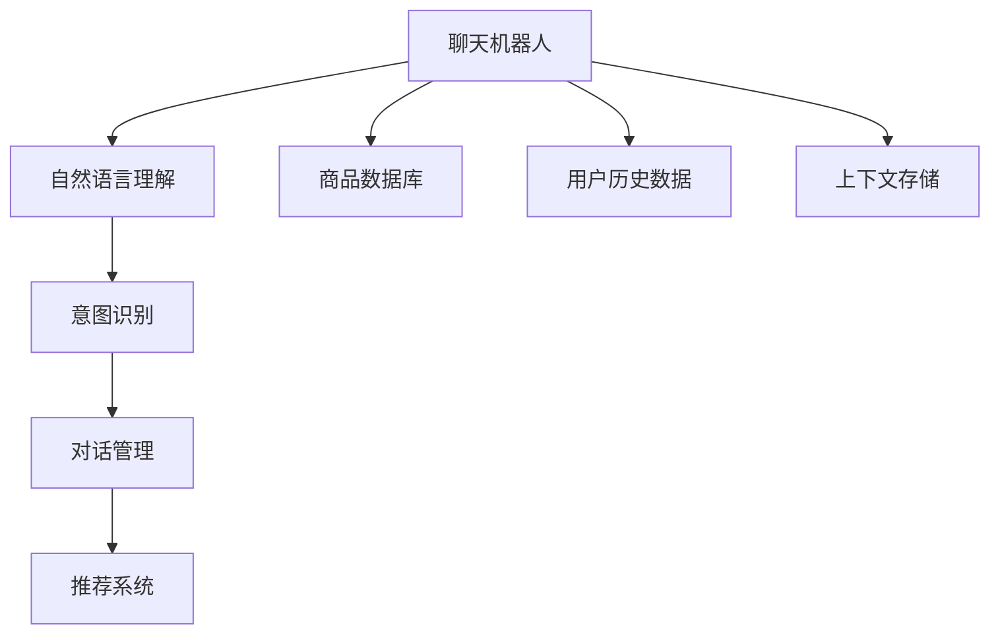

                 

## 1. 背景介绍

随着电子商务的迅猛发展，线上购物变得越来越便捷，然而，如何在海量商品中快速找到满意的商品，成为了用户面临的挑战。传统的搜索和筛选方式效率低下，用户体验不佳。此时，聊天机器人作为电商导购的重要辅助工具，能通过智能推荐和即时对话，大大提升用户购物体验，有效提高转化率。

### 1.1 电商导购的现状

传统电商导购模式通常依赖于搜索引擎、分类推荐等静态工具，用户需手动输入关键词，搜索并浏览搜索结果。由于搜索结果排序算法相对简单，且依赖手动输入，容易引发用户搜索疲劳。尤其是对于缺乏电商经验和商品知识的用户，更难以从海量的商品信息中精准找到自己需要的商品，购物体验往往不尽如人意。

而聊天机器人作为电商导购的新型工具，通过自然语言处理和机器学习技术，能够主动理解用户需求，并给出个性化推荐。通过对话式的交互方式，聊天机器人不仅可以提供实时信息，还能进行用户行为分析，帮助用户快速找到满意商品，并提高转化率。

## 2. 核心概念与联系

### 2.1 核心概念概述

为更好地理解聊天机器人在电商导购中的应用，本节将介绍几个密切相关的核心概念：

- **聊天机器人(Chatbot)**：基于人工智能的自然语言处理技术，模拟人类对话模式，通过文字或语音与用户进行实时交互的计算机程序。
- **电商导购(e-Commerce Customer Service)**：在电商平台上为消费者提供售前咨询、商品推荐、售后服务等服务的自动化对话系统。
- **用户意图(User Intent)**：用户在对话过程中所要表达的意图或需求，如查询商品、询问评价、申请退货等。
- **自然语言理解(Natural Language Understanding, NLU)**：使聊天机器人理解自然语言，从而捕捉到用户输入中的意图和需求的技术。
- **对话管理(Dialogue Management)**：管理聊天机器人的对话流程，使其根据用户意图和上下文生成合适的回复。
- **推荐系统(Recommendation System)**：通过分析用户历史行为和偏好，为每个用户推荐可能感兴趣的商品或内容。

这些核心概念之间的逻辑关系可以通过以下Mermaid流程图来展示：



这个流程图展示了一轮聊天对话中涉及的关键组件：

1. 聊天机器人接收用户输入，通过自然语言理解模块解析用户意图。
2. 意图识别模块根据用户输入，判断用户是否在查询商品、询问评价等。
3. 对话管理模块根据意图和上下文生成回复，并管理对话流程。
4. 推荐系统根据用户历史数据，生成个性化商品推荐。
5. 商品数据库和上下文存储模块提供数据支持。

这些组件协同工作，实现了聊天机器人在电商导购中的核心功能。

## 3. 核心算法原理 & 具体操作步骤
### 3.1 算法原理概述

聊天机器人通过与用户进行自然语言对话，理解用户意图，并提供相应回复。在电商导购场景中，聊天机器人通常包含以下几个关键步骤：

1. **自然语言理解(NLU)**：解析用户输入，理解其意图和需求。
2. **意图识别**：识别用户输入中的主要意图。
3. **对话管理**：根据用户意图和上下文生成合适的回复。
4. **推荐系统**：根据用户历史行为和偏好，生成个性化推荐。

基于这些步骤，聊天机器人可以在电商导购中发挥重要作用。

### 3.2 算法步骤详解

以一个典型的电商导购对话为例，详细阐述聊天机器人的具体实现步骤：

1. **自然语言理解(NLU)**：
   - 聊天机器人接收到用户输入，如“我想买一部新手机”。
   - 使用NLU技术将用户输入解析为结构化数据，如“商品类别=电子产品，用户需求=新手机”。
   - 处理用户输入中的实体，如“手机”，提取相关信息。

2. **意图识别**：
   - 根据用户输入，判断用户意图。如“我想买一部新手机”意图为查询商品。
   - 使用预训练模型(如BERT、Transformer等)进行意图分类，输出意图标签“查询商品”。

3. **对话管理**：
   - 根据意图和上下文，生成合适的回复。如“您想查询哪款手机呢？”
   - 记录对话上下文，以便后续对话生成。

4. **推荐系统**：
   - 根据用户历史购买记录和浏览行为，生成推荐列表。如“根据您的购买历史，我们推荐iPhone 13。”
   - 将推荐结果作为回复的一部分，输出给用户。

### 3.3 算法优缺点

聊天机器人作为电商导购的重要辅助工具，具有以下优点：

1. **即时响应**：用户只需简单输入信息，即可迅速获取所需信息，无需等待人工客服的回复。
2. **个性化推荐**：通过分析用户历史行为，生成个性化推荐，提升用户购物体验。
3. **24小时服务**：无休止的在线服务，保障用户随时获得帮助。
4. **降低人工成本**：通过自动化客服流程，降低人工客服成本。

然而，聊天机器人也存在一些局限：

1. **理解复杂语言**：对于复杂的自然语言输入，尤其是涉及多种意图或模糊表达时，NLU和意图识别的准确性可能下降。
2. **多轮对话管理**：处理多轮对话时，对话管理模块的复杂度增加，需要精心设计对话逻辑。
3. **数据隐私问题**：聊天机器人需要收集用户行为数据，涉及用户隐私保护的问题。

### 3.4 算法应用领域

聊天机器人在电商导购中的应用非常广泛，覆盖了多种场景，例如：

1. **产品查询**：用户输入商品名称或描述，聊天机器人自动推荐相关商品。
2. **价格比较**：比较不同商家价格，帮助用户找到最优惠的商品。
3. **订单追踪**：查询订单状态，跟踪商品物流信息。
4. **售后服务**：处理用户退货、换货等问题，提供售后支持。
5. **个性化推荐**：基于用户历史行为，生成个性化商品推荐。

除了上述这些场景，聊天机器人还可以应用于内容推荐、客户咨询、智能客服等多个领域，为电商平台的运营提供有力支持。

## 4. 数学模型和公式 & 详细讲解
### 4.1 数学模型构建

在电商导购中，聊天机器人涉及的关键数学模型包括自然语言理解、意图识别、对话管理和推荐系统。

- **自然语言理解(NLU)**：使用BERT等预训练模型，将用户输入转换为结构化数据。
- **意图识别**：使用分类模型对用户意图进行识别。
- **对话管理**：设计状态转移系统，生成合适的回复。
- **推荐系统**：使用协同过滤、内容推荐等方法，生成个性化商品推荐。

### 4.2 公式推导过程

以意图识别为例，假设有$N$个可能的意图，每个用户输入可以表示为$x_i$，其中$i=1,2,\cdots,N$。使用分类模型对用户意图进行识别，输出概率向量$\hat{p}=(\hat{p}_1,\hat{p}_2,\cdots,\hat{p}_N)$。目标是最小化损失函数：

$$
\mathcal{L}(p) = \sum_{i=1}^N (p_i - \hat{p}_i)^2
$$

其中$p_i$为实际意图概率。

### 4.3 案例分析与讲解

假设聊天机器人接收以下用户输入：“我想买一部新手机，预算在5000元左右。”

- **自然语言理解**：将输入解析为“商品类别=电子产品，用户需求=新手机，预算=5000元”。
- **意图识别**：使用BERT分类器，预测用户意图为“查询商品”，概率为$0.95$。
- **对话管理**：生成回复“请问您想查询哪款手机呢？”
- **推荐系统**：根据用户历史行为和预算，生成推荐列表“iPhone 13，三星Galaxy S21”。
- **生成回复**：“您想查询哪款手机呢？我们的推荐有iPhone 13和三星Galaxy S21，价格均在5000元左右。”

## 5. 项目实践：代码实例和详细解释说明
### 5.1 开发环境搭建

在进行聊天机器人电商导购实践前，我们需要准备好开发环境。以下是使用Python进行TensorFlow开发的环境配置流程：

1. 安装Anaconda：从官网下载并安装Anaconda，用于创建独立的Python环境。

2. 创建并激活虚拟环境：
```bash
conda create -n tf-env python=3.8 
conda activate tf-env
```

3. 安装TensorFlow：根据CUDA版本，从官网获取对应的安装命令。例如：
```bash
conda install tensorflow tensorflow-gpu==2.8 -c pypi
```

4. 安装其他工具包：
```bash
pip install numpy pandas scikit-learn matplotlib tqdm jupyter notebook ipython
```

完成上述步骤后，即可在`tf-env`环境中开始聊天机器人电商导购的开发。

### 5.2 源代码详细实现

这里我们以推荐系统为例，给出使用TensorFlow对商品推荐模型进行训练的PyTorch代码实现。

首先，定义推荐系统的数据处理函数：

```python
import tensorflow as tf
import numpy as np

def preprocess_data(data):
    # 处理数据，如分词、编码、填充等
    # 返回输入特征和标签
    return features, labels
```

然后，定义推荐模型的超参数和模型结构：

```python
batch_size = 32
learning_rate = 0.001
epochs = 10
model = tf.keras.Sequential([
    tf.keras.layers.Dense(64, activation='relu', input_shape=(64,)),
    tf.keras.layers.Dense(64, activation='relu'),
    tf.keras.layers.Dense(1)
])
model.compile(optimizer=tf.keras.optimizers.Adam(learning_rate=learning_rate), loss='mse')
```

接着，定义训练和评估函数：

```python
def train_model(model, features, labels):
    # 定义训练过程
    model.fit(features, labels, batch_size=batch_size, epochs=epochs, validation_split=0.2)
    
def evaluate_model(model, features, labels):
    # 定义评估过程
    # 返回模型性能指标
    return accuracy, precision, recall
```

最后，启动训练流程并在测试集上评估：

```python
features_train, labels_train = preprocess_data(train_data)
features_test, labels_test = preprocess_data(test_data)

train_model(model, features_train, labels_train)
accuracy, precision, recall = evaluate_model(model, features_test, labels_test)
print(f"Accuracy: {accuracy:.2f}, Precision: {precision:.2f}, Recall: {recall:.2f}")
```

以上就是使用TensorFlow对商品推荐模型进行训练的完整代码实现。可以看到，TensorFlow提供了强大的模型构建和训练功能，适合复杂模型的开发和部署。

### 5.3 代码解读与分析

让我们再详细解读一下关键代码的实现细节：

**preprocess_data函数**：
- 处理数据，如分词、编码、填充等，生成模型的输入特征和标签。
- 返回处理后的数据，以便模型训练和推理。

**推荐模型定义**：
- 定义模型结构，包括多个全连接层和激活函数。
- 使用Adam优化器进行优化，交叉熵损失函数。
- 使用模型的compile方法，定义模型训练和评估的配置。

**训练和评估函数**：
- 使用模型的fit方法进行模型训练，设置批次大小和迭代轮数。
- 使用模型的evaluate方法评估模型性能，返回准确率、精确率和召回率等指标。

**训练流程**：
- 准备训练集和测试集的数据。
- 调用训练函数进行模型训练。
- 调用评估函数评估模型性能，并输出结果。

可以看到，TensorFlow提供了全面的模型构建和训练工具，使得开发者可以轻松实现复杂的推荐系统模型。

当然，实际的电商导购聊天机器人系统还需要考虑更多因素，如用户意图识别、对话管理、商品推荐等。但核心的推荐系统实现基本与此类似。

## 6. 实际应用场景
### 6.1 智能客服系统

聊天机器人作为智能客服的重要组成部分，可以广泛应用于电商平台，提供全天候的客服支持。通过对话机器人，用户可以实时获取商品信息、处理退货、申请售后等，极大地提升用户体验。

在技术实现上，可以收集用户的历史行为数据，并构建用户画像。通过NLU和意图识别，聊天机器人能够准确理解用户需求，并及时做出响应。例如，当用户询问退货流程时，机器人可以引导用户填写退货单据，并查询物流信息。

### 6.2 个性化推荐系统

基于聊天机器人的推荐系统，可以通过对话记录获取用户需求和偏好。通过用户历史行为数据，生成个性化推荐，进一步提升用户购物体验。

例如，当用户询问某商品时，机器人可以推荐该商品相关的其他商品，或询问用户是否需要类似商品。通过多轮对话，不断更新推荐模型，使得推荐结果更加精准。

### 6.3 供应链管理

聊天机器人可以应用于电商平台的供应链管理，通过实时对话获取需求信息，优化库存管理和物流配送。例如，当用户大量下单某商品时，机器人可以自动通知仓库补货，并调整配送计划，保障供货稳定性。

### 6.4 未来应用展望

随着人工智能技术的不断发展，聊天机器人将会在电商导购中扮演越来越重要的角色。未来，聊天机器人将具备更加智能化、个性化的功能，进一步提升电商平台的运营效率和用户体验。

在智慧零售领域，聊天机器人将与物联网技术深度融合，实现基于场景的个性化推荐和智能导购。例如，通过与智能冰箱、智能家居的互联互通，实时获取用户需求，提供定制化服务。

在社交电商领域，聊天机器人将与社交网络结合，通过智能推荐和社交互动，提升用户粘性和购买意愿。例如，在社交平台上推荐商品，利用社交影响力进行宣传推广。

## 7. 工具和资源推荐
### 7.1 学习资源推荐

为了帮助开发者系统掌握聊天机器人电商导购的理论基础和实践技巧，这里推荐一些优质的学习资源：

1. **《深度学习与自然语言处理》系列博文**：由大模型技术专家撰写，深入浅出地介绍了深度学习在自然语言处理中的应用，包括聊天机器人、推荐系统等。

2. **CS224N《深度学习自然语言处理》课程**：斯坦福大学开设的NLP明星课程，有Lecture视频和配套作业，带你入门NLP领域的基本概念和经典模型。

3. **《Natural Language Processing with Transformers》书籍**：Transformer库的作者所著，全面介绍了如何使用Transformer库进行NLP任务开发，包括对话机器人、推荐系统在内的诸多范式。

4. **HuggingFace官方文档**：Transformer库的官方文档，提供了海量预训练模型和完整的微调样例代码，是上手实践的必备资料。

5. **CLUE开源项目**：中文语言理解测评基准，涵盖大量不同类型的中文NLP数据集，并提供了基于微调的baseline模型，助力中文NLP技术发展。

通过对这些资源的学习实践，相信你一定能够快速掌握聊天机器人的电商导购精髓，并用于解决实际的NLP问题。

### 7.2 开发工具推荐

高效的开发离不开优秀的工具支持。以下是几款用于聊天机器人电商导购开发的常用工具：

1. **TensorFlow**：基于Python的开源深度学习框架，灵活动态的计算图，适合快速迭代研究。大部分预训练语言模型都有TensorFlow版本的实现。

2. **PyTorch**：基于Python的开源深度学习框架，动态计算图，灵活性高，适合复杂模型的研究。

3. **Transformers库**：HuggingFace开发的NLP工具库，集成了众多SOTA语言模型，支持TensorFlow和PyTorch，是进行对话机器人开发的关键工具。

4. **Weights & Biases**：模型训练的实验跟踪工具，可以记录和可视化模型训练过程中的各项指标，方便对比和调优。与主流深度学习框架无缝集成。

5. **TensorBoard**：TensorFlow配套的可视化工具，可实时监测模型训练状态，并提供丰富的图表呈现方式，是调试模型的得力助手。

6. **Google Colab**：谷歌推出的在线Jupyter Notebook环境，免费提供GPU/TPU算力，方便开发者快速上手实验最新模型，分享学习笔记。

合理利用这些工具，可以显著提升聊天机器人电商导购任务的开发效率，加快创新迭代的步伐。

### 7.3 相关论文推荐

聊天机器人作为电商导购的重要辅助工具，其发展也伴随着NLP技术的前进。以下是几篇奠基性的相关论文，推荐阅读：

1. **Attention is All You Need**：提出了Transformer结构，开启了NLP领域的预训练大模型时代。

2. **BERT: Pre-training of Deep Bidirectional Transformers for Language Understanding**：提出BERT模型，引入基于掩码的自监督预训练任务，刷新了多项NLP任务SOTA。

3. **Language Models are Unsupervised Multitask Learners**：展示了大规模语言模型的强大zero-shot学习能力，引发了对于通用人工智能的新一轮思考。

4. **Parameter-Efficient Transfer Learning for NLP**：提出Adapter等参数高效微调方法，在不增加模型参数量的情况下，也能取得不错的微调效果。

5. **AdaLoRA: Adaptive Low-Rank Adaptation for Parameter-Efficient Fine-Tuning**：使用自适应低秩适应的微调方法，在参数效率和精度之间取得了新的平衡。

这些论文代表了大语言模型微调技术的发展脉络。通过学习这些前沿成果，可以帮助研究者把握学科前进方向，激发更多的创新灵感。

## 8. 总结：未来发展趋势与挑战
### 8.1 总结

本文对聊天机器人作为电商导购的工具进行了全面系统的介绍。首先阐述了电商导购的现状和聊天机器人的优势，明确了聊天机器人在电商导购中的重要价值。其次，从原理到实践，详细讲解了聊天机器人在电商导购中的核心算法和操作步骤，给出了推荐系统的完整代码实现。同时，本文还广泛探讨了聊天机器人在智能客服、个性化推荐、供应链管理等多个行业领域的应用前景，展示了聊天机器人技术的广阔前景。

通过本文的系统梳理，可以看到，聊天机器人作为电商导购的重要辅助工具，通过自然语言处理和机器学习技术，能够主动理解用户需求，并给出个性化推荐。通过对话式的交互方式，聊天机器人不仅提供实时信息，还能进行用户行为分析，帮助用户快速找到满意商品，并提高转化率。未来，伴随人工智能技术的不断演进，聊天机器人将在电商导购中发挥更大的作用，为电商平台带来更多的商业价值。

### 8.2 未来发展趋势

展望未来，聊天机器人作为电商导购的工具将呈现以下几个发展趋势：

1. **智能程度提升**：聊天机器人将变得更加智能化，能够处理更复杂的自然语言输入，具备更强的上下文理解能力。

2. **个性化推荐**：推荐系统将更加精准，能够根据用户的历史行为和偏好，生成更加个性化的推荐结果。

3. **多模态融合**：聊天机器人将融合视觉、语音等多模态信息，提升对用户的理解和交互体验。

4. **跨平台服务**：聊天机器人将跨平台部署，支持多个电商平台的智能客服和导购，实现无缝连接。

5. **实时数据分析**：通过实时对话数据，聊天机器人能够不断优化自身性能，实现持续学习和改进。

6. **对话式界面优化**：设计更加自然流畅的对话界面，提升用户交互体验。

以上趋势凸显了聊天机器人电商导购技术的广阔前景。这些方向的探索发展，必将进一步提升电商平台的运营效率和用户体验，为电商产业带来革命性变革。

### 8.3 面临的挑战

尽管聊天机器人作为电商导购的工具已经取得了显著成效，但在迈向更加智能化、普适化应用的过程中，仍面临诸多挑战：

1. **理解复杂语言**：对于复杂的自然语言输入，尤其是涉及多种意图或模糊表达时，NLU和意图识别的准确性可能下降。

2. **多轮对话管理**：处理多轮对话时，对话管理模块的复杂度增加，需要精心设计对话逻辑。

3. **数据隐私问题**：聊天机器人需要收集用户行为数据，涉及用户隐私保护的问题。

4. **多场景适配**：不同电商平台的客服流程和导购需求存在差异，需要针对性地设计对话模型。

5. **多语言支持**：对于多语言环境下的电商导购，聊天机器人需要具备跨语言理解和生成能力。

6. **交互场景多样化**：不同用户的交互场景和需求差异较大，聊天机器人需要具备适应多变场景的能力。

7. **实时性要求**：用户对电商导购的实时性要求较高，聊天机器人需要具备高效的响应能力。

这些挑战使得聊天机器人在电商导购中的推广应用仍需克服诸多难题。只有从技术、业务、伦理等多个维度进行全面优化，才能真正实现聊天机器人技术的落地应用。

### 8.4 研究展望

面对聊天机器人在电商导购中面临的挑战，未来的研究需要在以下几个方面寻求新的突破：

1. **强化学习和多模态融合**：结合强化学习和多模态信息，提升聊天机器人的智能水平和适应性。

2. **跨领域知识图谱**：引入知识图谱技术，增强聊天机器人的语义理解和知识推理能力。

3. **数据隐私保护**：采用差分隐私、联邦学习等技术，保护用户数据隐私。

4. **多场景适配**：根据不同电商平台的客服流程和导购需求，设计适配性的对话模型。

5. **多语言支持**：引入跨语言理解技术，提升聊天机器人对多语言环境的适应能力。

6. **实时性优化**：采用模型压缩、模型并行等技术，提升聊天机器人的实时响应能力。

这些研究方向的探索，必将引领聊天机器人技术迈向更高的台阶，为电商导购带来更智能、更个性化的体验。

## 9. 附录：常见问题与解答

**Q1：聊天机器人在电商导购中是否需要大量的标注数据？**

A: 聊天机器人在电商导购中通常不需要大量的标注数据，而是利用用户的对话记录和行为数据进行训练。通过对话记录，聊天机器人可以学习到用户的历史需求和偏好，生成个性化推荐。同时，对话记录也用于意图识别和对话管理，提升系统的精准度。

**Q2：如何设计多轮对话管理逻辑？**

A: 设计多轮对话管理逻辑需要考虑用户的上下文信息和对话历史，确保每轮对话都能够引导用户逐步达成目标。可以使用对话树结构，定义对话路径和条件判断。同时，引入记忆模块，保存用户对话状态，以便后续对话生成。

**Q3：如何优化聊天机器人的响应速度？**

A: 聊天机器人的响应速度可以通过以下方法优化：
1. 模型压缩和量化：将浮点模型转为定点模型，减少计算资源消耗。
2. 模型并行和分布式训练：利用多GPU或分布式计算资源，加速模型训练和推理。
3. 对话缓存：对用户历史对话记录进行缓存，减少重复查询的开销。

**Q4：聊天机器人如何处理多语言环境下的电商导购？**

A: 处理多语言环境下的电商导购，需要引入跨语言理解技术，如机器翻译和语言模型迁移学习。同时，设计多语言对话模板，提供多语言支持。例如，通过翻译服务，将用户输入翻译成目标语言，再进行意图识别和回复生成。

**Q5：如何保障聊天机器人的数据隐私和安全？**

A: 保障聊天机器人的数据隐私和安全需要采取以下措施：
1. 数据加密：对用户对话记录进行加密存储和传输，防止数据泄露。
2. 差分隐私：在数据训练和分析中引入差分隐私技术，保护用户隐私。
3. 访问控制：限制系统访问权限，防止未授权访问。
4. 安全审计：定期进行安全审计，发现和修复潜在安全漏洞。

这些措施可以显著提升聊天机器人的数据隐私和安全保障，确保用户数据不被滥用。

---

作者：禅与计算机程序设计艺术 / Zen and the Art of Computer Programming

