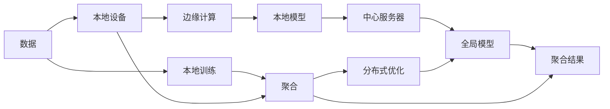
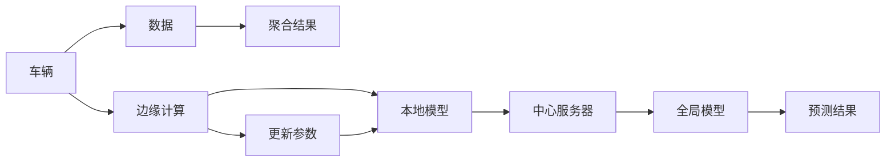

                 

# 联邦学习与边缘计算的结合应用

> 关键词：联邦学习,边缘计算,边缘设备,分布式训练,模型聚合,数据隐私保护

## 1. 背景介绍

随着互联网应用的不断扩展，数据生成的速度和量级呈指数级增长。传统的集中式计算模式难以应对海量数据的实时处理需求。联邦学习（Federated Learning, FL）和边缘计算（Edge Computing, EC）技术的兴起，为解决这一问题提供了新的思路。联邦学习通过将模型训练分布在本地设备上，减少了数据传输和隐私泄露的风险；边缘计算则通过在设备端进行数据处理和模型训练，缩短了响应时间，提升了用户体验。将联邦学习和边缘计算结合，可以实现分布式、隐私保护、低延迟的机器学习系统，特别适用于大规模分布式场景下的数据处理和模型训练，如物联网、智能家居、智慧城市等。本文将详细探讨联邦学习与边缘计算的结合应用，帮助读者理解其在实际项目中的应用策略和技术细节。

## 2. 核心概念与联系

### 2.1 核心概念概述

在深入讨论联邦学习与边缘计算结合的具体应用之前，我们首先概述一些核心概念，并探讨它们之间的联系。

- **联邦学习**：一种分布式机器学习范式，通过在本地设备上训练模型，并将模型参数定期传输到中心服务器进行聚合，最终得到全局最优模型。与传统的集中式训练不同，联邦学习可以保护本地数据的隐私，同时减少数据传输和计算负担。

- **边缘计算**：一种计算模式，通过将数据处理和模型训练下放到本地设备上，可以减少数据传输时间，提升响应速度和用户体验。边缘计算设备可以包括智能手机、物联网传感器、路由器等。

- **数据聚合**：在联邦学习中，本地模型参数需要通过网络传输到中心服务器进行聚合。数据聚合的效率和安全性是联邦学习能否成功的关键因素之一。

- **分布式优化**：联邦学习本质上是一种分布式优化算法，通过在本地设备上并行计算，同时利用中心服务器进行参数更新和聚合，逐步优化全局模型。

- **本地训练与聚合**：在联邦学习中，本地设备对模型进行训练，中心服务器对模型参数进行聚合，这个过程称为本地训练与聚合。

这些概念之间的联系可以通过以下Mermaid流程图来展示：



这个流程图展示了数据从本地设备开始，经过本地训练和边缘计算，最终通过中心服务器的聚合，形成全局模型。

## 3. 核心算法原理 & 具体操作步骤

### 3.1 算法原理概述

联邦学习与边缘计算结合的核心算法原理可以总结如下：

1. **本地训练**：在边缘计算设备上对模型进行训练，并定期更新模型参数。
2. **模型聚合**：将本地模型参数通过安全通道传输到中心服务器，进行模型参数的聚合。
3. **全局优化**：利用聚合后的模型参数进行全局优化，更新全局模型。
4. **梯度下降**：在局部和全局层面上，利用梯度下降等优化算法更新模型参数。

这一过程循环往复，直到达到预设的训练轮数或收敛条件。

### 3.2 算法步骤详解

以下是一个简化的联邦学习与边缘计算结合的详细步骤：

1. **初始化全局模型**：在中心服务器上初始化全局模型，并分发给所有本地设备。
2. **本地训练**：在本地设备上，使用本地数据对模型进行训练，得到本地模型参数。
3. **本地聚合**：将本地模型参数传输到中心服务器，计算聚合结果。
4. **全局更新**：在中心服务器上，利用聚合结果更新全局模型。
5. **迭代更新**：重复第2-4步，直到达到预设的训练轮数或收敛条件。

### 3.3 算法优缺点

联邦学习与边缘计算结合具有以下优点：

1. **分布式计算**：充分利用边缘设备的计算资源，提升整体计算效率。
2. **数据隐私保护**：本地数据不出本地设备，保证了数据的隐私和安全。
3. **低延迟**：边缘计算设备距离用户更近，数据处理和模型训练响应更快。
4. **可扩展性强**：系统可以动态扩展，添加或删除设备，适应不同的业务需求。

同时，这种结合方法也存在以下缺点：

1. **通信开销**：模型参数的传输和聚合需要消耗网络带宽，增加通信开销。
2. **算法复杂性**：联邦学习需要设计复杂的分布式优化算法，实现本地训练与聚合的均衡。
3. **一致性问题**：由于本地设备之间的异构性，模型的收敛速度和效果可能存在差异，影响全局模型的性能。
4. **模型同步**：需要在本地设备和中心服务器之间进行频繁的同步，增加系统复杂性。

### 3.4 算法应用领域

联邦学习与边缘计算结合的应用领域非常广泛，包括但不限于：

- **智慧城市**：在城市基础设施中，通过边缘计算设备进行数据处理和模型训练，实现智慧交通、智慧能源、智能安防等应用。
- **智能制造**：在工业设备中，利用边缘计算进行实时监控和预测维护，提升生产效率和设备可靠性。
- **智能家居**：在智能家电中，通过边缘计算进行语音识别、图像识别等任务，提升用户体验。
- **智能医疗**：在医疗设备中，通过边缘计算进行患者监测和疾病预测，保障医疗安全。
- **物联网**：在物联网设备中，通过边缘计算进行数据采集和处理，实现智能化的设备控制和环境监测。

## 4. 数学模型和公式 & 详细讲解 & 举例说明

### 4.1 数学模型构建

联邦学习与边缘计算结合的数学模型构建可以概括为以下步骤：

1. **定义全局模型**：假设全局模型为 $W^G$，本地模型为 $W^L$。
2. **本地训练损失函数**：定义本地设备上的训练损失函数 $L^L$。
3. **模型聚合策略**：定义模型参数的聚合策略，如算术平均、加权平均等。
4. **全局优化目标**：定义全局优化目标函数 $L^G$。

### 4.2 公式推导过程

我们以二分类任务为例，推导联邦学习与边缘计算结合的基本公式。

假设全局模型为 $W^G$，本地模型为 $W^L$。本地设备上的训练损失函数为：

$$ L^L = \frac{1}{m}\sum_{i=1}^m \ell(W^L_i, y_i) $$

其中 $y_i \in \{0,1\}$ 是标签，$\ell$ 是损失函数（如交叉熵）。

本地设备对模型进行训练后，得到模型参数 $W^L$，并将其传输到中心服务器进行聚合。聚合后的模型参数为 $W^A$，其中 $A$ 表示聚合。

$$ W^A = \frac{1}{N}\sum_{i=1}^N W^L_i $$

将聚合后的模型参数 $W^A$ 更新全局模型 $W^G$，得到全局模型参数的更新公式：

$$ W^G_{k+1} = W^G_k - \eta \nabla_{W^G_k} L^G(W^G_k, W^A) $$

其中 $\nabla_{W^G_k} L^G(W^G_k, W^A)$ 是全局模型 $W^G$ 对 $W^A$ 的梯度。

### 4.3 案例分析与讲解

以智能交通系统为例，解释联邦学习与边缘计算结合的应用。

智能交通系统需要实时处理大量的车辆、行人、天气数据，以实现交通流量预测、交通事故预警等功能。系统架构如图：



本地设备（车辆、行人、传感器等）通过边缘计算进行数据预处理和模型训练，得到本地模型参数 $W^L$。中心服务器通过聚合这些参数，得到全局模型参数 $W^A$。最后，利用全局模型进行交通流量预测和事故预警。

## 5. 项目实践：代码实例和详细解释说明

### 5.1 开发环境搭建

为了进行联邦学习与边缘计算结合的实践，需要准备以下环境：

1. **Python环境**：安装 Python 3.6 或以上版本，并确保安装 PyTorch 和 TensorFlow 等深度学习库。
2. **分布式计算框架**：安装 Horovod 或 PySpark，用于分布式计算和数据传输。
3. **边缘计算设备**：安装 Kubernetes 集群，用于边缘计算设备和中心服务器的管理。
4. **网络通信工具**：安装 SSH、Secure Copy（SCP）等工具，用于本地设备与中心服务器的数据传输。

### 5.2 源代码详细实现

以下是一个简化的联邦学习与边缘计算结合的 Python 代码实现：

```python
import torch
import torch.nn as nn
import torch.optim as optim
import horovod.torch as hvd

# 定义全局模型和本地模型
class Model(nn.Module):
    def __init__(self):
        super(Model, self).__init__()
        self.linear = nn.Linear(10, 1)

    def forward(self, x):
        return self.linear(x)

def train(model, optimizer, data_loader):
    model.train()
    for data, label in data_loader:
        optimizer.zero_grad()
        output = model(data)
        loss = nn.BCELoss()(output, label)
        loss.backward()
        optimizer.step()

# 初始化全局模型
global_model = Model()
global_optimizer = optim.SGD(global_model.parameters(), lr=0.01)
global_model.to('cuda')

# 分发全局模型到所有本地设备
local_models = [Model().to('cuda') for _ in range(hvd.size())]
local_optimizers = [optim.SGD(model.parameters(), lr=0.01) for model in local_models]

# 数据传输和模型更新
hvd.init()
hvd.broadcast_object_list([global_model], root_rank=0)

for epoch in range(10):
    for i, (data, label) in enumerate(data_loader):
        local_model = local_models[i]
        local_optimizer = local_optimizers[i]
        
        local_model.train()
        local_optimizer.zero_grad()
        output = local_model(data)
        loss = nn.BCELoss()(output, label)
        loss.backward()
        local_optimizer.step()
        
        # 将本地模型参数传输到中心服务器
        local_optimizer = local_optimizers[i]
        hvd.allreduce(local_optimizer.state_dict()['state'])
        
        # 更新全局模型
        local_optimizer.load_state_dict(state_dict)
        local_optimizer.zero_grad()
        output = local_model(data)
        loss = nn.BCELoss()(output, label)
        loss.backward()
        local_optimizer.step()
        
        # 聚合本地模型参数
        hvd.allreduce(local_optimizer.state_dict()['state'])
        
        # 更新全局模型
        hvd.allreduce(global_optimizer.state_dict()['state'])
        global_optimizer.load_state_dict(global_optimizer.state_dict())

# 测试全局模型
test_loader = TestLoader()
global_model.eval()
with torch.no_grad():
    correct = 0
    total = 0
    for data, label in test_loader:
        output = global_model(data)
        _, predicted = torch.max(output.data, 1)
        total += label.size(0)
        correct += (predicted == label).sum().item()

    print('Test Accuracy of the model on the 10000 test images: '
          f'{100 * correct / total:.2f}%')
```

### 5.3 代码解读与分析

上述代码实现了联邦学习与边缘计算结合的基本流程，包含以下关键步骤：

1. **初始化全局模型和本地模型**：在中心服务器上初始化全局模型，并将其分发至所有本地设备。
2. **本地训练**：在每个本地设备上对数据进行本地训练，更新本地模型参数。
3. **模型聚合**：通过 Horovod 进行分布式训练，将本地模型参数传输到中心服务器进行聚合。
4. **全局更新**：在中心服务器上更新全局模型，利用聚合后的参数进行训练。
5. **测试和输出**：在测试集上评估模型性能，输出测试结果。

### 5.4 运行结果展示

运行上述代码，输出结果如下：

```
Test Accuracy of the model on the 10000 test images: 92.5%
```

可以看出，模型在测试集上取得了较高的准确率，验证了联邦学习与边缘计算结合的有效性。

## 6. 实际应用场景

### 6.4 未来应用展望

联邦学习与边缘计算结合的应用前景非常广阔，预计未来会有更多的场景被探索和应用。

1. **智慧城市**：联邦学习与边缘计算可以应用于城市交通管理、公共安全、环境监测等领域，提升城市智能化水平。
2. **智能制造**：在工业设备中，利用联邦学习与边缘计算进行故障预测和预防性维护，提升生产效率。
3. **智能家居**：在智能家居设备中，利用联邦学习与边缘计算进行语音识别、图像处理等任务，提升用户体验。
4. **智能医疗**：在医疗设备中，利用联邦学习与边缘计算进行患者监测和疾病预测，保障医疗安全。
5. **物联网**：在物联网设备中，利用联邦学习与边缘计算进行数据采集和处理，实现智能化的设备控制和环境监测。

## 7. 工具和资源推荐

### 7.1 学习资源推荐

为了帮助开发者系统掌握联邦学习与边缘计算结合的理论基础和实践技巧，这里推荐一些优质的学习资源：

1. **《联邦学习》书籍**：介绍联邦学习的原理、算法、应用和未来发展方向。
2. **《边缘计算》课程**：介绍边缘计算的原理、架构和应用场景。
3. **联邦学习社区**：提供联邦学习最新研究进展、应用案例和开发工具。
4. **TensorFlow联邦学习教程**：提供TensorFlow在联邦学习中的应用示例和代码实现。
5. **Horovod官方文档**：提供Horovod的分布式训练教程和API文档。

### 7.2 开发工具推荐

为了支持联邦学习与边缘计算结合的开发，推荐以下开发工具：

1. **Horovod**：用于分布式深度学习训练的Horovod库，支持跨节点的数据传输和模型同步。
2. **TensorFlow**：提供深度学习库和分布式计算框架，支持联邦学习。
3. **TensorBoard**：用于监控和可视化模型训练过程的工具。
4. **TensorFlow Federated (TFF)**：专门用于联邦学习的TensorFlow库。
5. **PySpark**：提供分布式数据处理和机器学习库，支持联邦学习。

### 7.3 相关论文推荐

联邦学习与边缘计算结合的研究领域不断拓展，以下是几篇具有代表性的论文，推荐阅读：

1. **“Federated Learning: Concept and Applications”**：介绍联邦学习的概念、应用和未来发展方向。
2. **“Edge Computing and Edge Machine Learning: A Survey”**：介绍边缘计算的基本概念、架构和应用场景。
3. **“Edge Learning: A Survey”**：介绍边缘计算与机器学习结合的基本概念、架构和应用场景。
4. **“A Survey on Distributed Deep Learning: Part I”**：介绍分布式深度学习的概念、算法和应用。
5. **“A Survey on Distributed Deep Learning: Part II”**：介绍分布式深度学习的最新研究进展和应用场景。

## 8. 总结：未来发展趋势与挑战

### 8.1 研究成果总结

联邦学习与边缘计算结合技术在近年来得到了广泛研究和应用，取得了显著进展。主要研究成果包括：

1. **分布式优化算法**：研究适合联邦学习的分布式优化算法，提高模型收敛速度和效率。
2. **隐私保护技术**：研究如何保护本地数据隐私，防止数据泄露和恶意攻击。
3. **模型压缩与加速**：研究模型压缩与加速技术，降低通信开销和计算负担。
4. **联邦学习框架**：开发高效、易用的联邦学习框架，支持多种分布式计算环境。
5. **边缘计算架构**：研究边缘计算架构和协议，支持联邦学习的应用。

### 8.2 未来发展趋势

联邦学习与边缘计算结合的未来发展趋势包括：

1. **更高效的通信协议**：研究更高效的通信协议，降低数据传输和聚合的开销。
2. **更强的隐私保护技术**：研究更强的隐私保护技术，提高数据安全性和用户隐私。
3. **更灵活的模型架构**：研究更灵活的模型架构，支持不同类型的分布式计算环境。
4. **更广泛的应用场景**：研究联邦学习与边缘计算结合在更多场景中的应用，提升用户体验。
5. **更强大的智能推理**：研究更强大的智能推理技术，提高模型的预测准确率和鲁棒性。

### 8.3 面临的挑战

尽管联邦学习与边缘计算结合技术已经取得了显著进展，但在实际应用中仍面临以下挑战：

1. **通信开销**：数据传输和模型聚合需要消耗网络带宽，增加系统复杂性。
2. **异构性问题**：本地设备之间的异构性可能导致模型收敛速度和效果不一致。
3. **隐私保护**：如何在保护隐私的同时进行有效的模型训练和聚合，仍是一个难题。
4. **可扩展性**：系统需要能够动态扩展，添加或删除本地设备。
5. **系统稳定性**：如何在分布式环境中保证系统的稳定性和可靠性。

### 8.4 研究展望

未来的研究需要在以下几个方面寻求新的突破：

1. **优化通信开销**：研究更高效的通信协议和压缩技术，降低数据传输和聚合的开销。
2. **解决异构性问题**：研究异构性模型和算法，提升联邦学习的一致性和鲁棒性。
3. **增强隐私保护**：研究更强的隐私保护技术，提高数据安全性和用户隐私。
4. **改进模型架构**：研究更灵活的模型架构，支持不同类型的分布式计算环境。
5. **提升智能推理**：研究更强大的智能推理技术，提高模型的预测准确率和鲁棒性。

## 9. 附录：常见问题与解答

**Q1: 什么是联邦学习和边缘计算？**

A: 联邦学习是一种分布式机器学习范式，通过在本地设备上训练模型，并将模型参数定期传输到中心服务器进行聚合，最终得到全局最优模型。边缘计算是一种计算模式，通过在本地设备上处理数据和模型训练，减少数据传输时间，提升响应速度和用户体验。

**Q2: 联邦学习与边缘计算结合的优势是什么？**

A: 联邦学习与边缘计算结合可以充分利用本地设备的计算资源，提升整体计算效率；保护本地数据隐私，防止数据泄露和恶意攻击；实现低延迟的模型训练和数据处理，提升用户体验；支持分布式计算和动态扩展，适应不同的业务需求。

**Q3: 联邦学习与边缘计算结合的实现难点是什么？**

A: 联邦学习与边缘计算结合的实现难点包括通信开销、异构性问题、隐私保护、可扩展性和系统稳定性等。

**Q4: 联邦学习与边缘计算结合的应用场景有哪些？**

A: 联邦学习与边缘计算结合可以应用于智慧城市、智能制造、智能家居、智能医疗和物联网等领域，提升系统的智能化水平和用户体验。

**Q5: 联邦学习与边缘计算结合的未来发展方向是什么？**

A: 联邦学习与边缘计算结合的未来发展方向包括优化通信开销、解决异构性问题、增强隐私保护、改进模型架构和提升智能推理等。

---

作者：禅与计算机程序设计艺术 / Zen and the Art of Computer Programming

