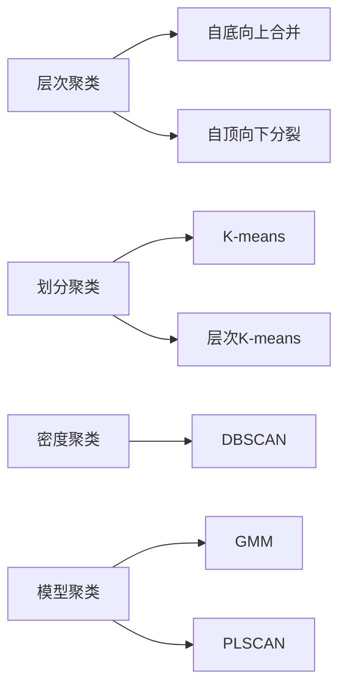
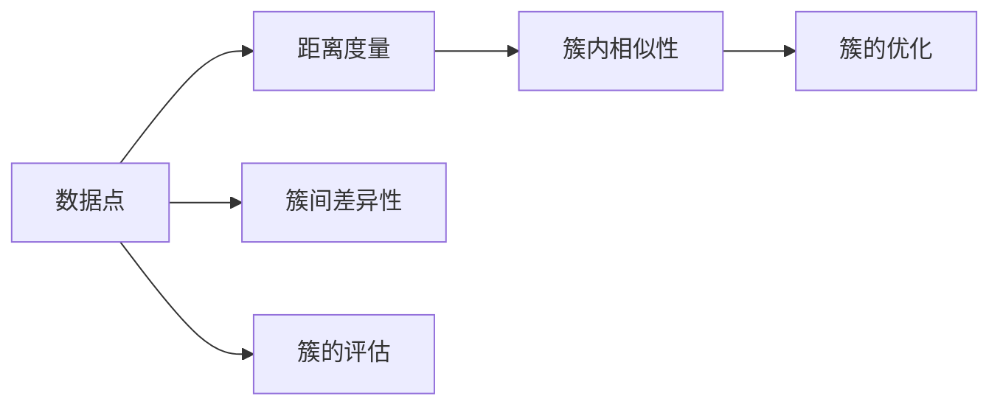

                 

## 1. 背景介绍

聚类 (Clustering) 是一种重要的无监督学习技术，它旨在将数据集中的数据点分成多个组或簇，使得同一组内的数据点具有较高的相似性，而不同组之间的数据点则差异较大。聚类广泛应用于市场细分、社交网络分析、图像处理、文本挖掘、生物信息学等领域。聚类算法通常不需要预先标记数据，能够自动发现数据的内在结构和模式，从而实现数据降维和分类等功能。

## 2. 核心概念与联系

### 2.1 核心概念概述

聚类算法通常包括两个核心概念：簇（Cluster）和距离（Distance）。

**簇**是指由若干个具有相似特征的数据点组成的一组数据。簇内部的数据点尽可能地相似，而不同簇的数据点尽可能地差异化。簇的大小、形状、分布等属性可以用来描述数据集的整体结构。

**距离**是指数据点之间的相似度或差异度。常见的距离度量方法包括欧几里得距离、曼哈顿距离、余弦相似度等。距离度量方法的选择直接影响聚类算法的性能。

聚类算法主要分为以下几类：

- **层次聚类**：从单个数据点开始，逐步合并成更小的簇，直到所有数据点合并成一个大簇，或达到预设的簇数。
- **划分聚类**：将数据集划分为若干个预先定义好的簇，每簇内部尽可能地密集，而簇之间尽可能地分离。
- **密度聚类**：基于密度的概念，将数据点分为核心点、边界点和噪声点，形成若干个簇。
- **模型聚类**：利用先验模型对数据进行聚类，常见的模型包括高斯混合模型（GMM）、概率简单线性模型（PLSCAN）等。

这些算法之间的联系可以通过以下Mermaid流程图来展示：



这个流程图展示了几类常见聚类算法的基本工作原理，即从数据点出发，逐步合并或分裂成簇，构建不同的聚类模型。

### 2.2 核心概念原理和架构的 Mermaid 流程图

以下是核心概念原理和架构的 Mermaid 流程图：



这个图展示了数据点之间距离度量的过程，即利用距离度量方法计算簇内相似性和簇间差异性，通过簇的优化和评估来确定最佳的簇划分。

## 3. 核心算法原理 & 具体操作步骤

### 3.1 算法原理概述

聚类算法通过迭代的方式，不断调整簇的划分，使得每个簇内部的数据点尽可能地相似，而不同簇的数据点尽可能地差异化。常见的聚类算法包括K-means、层次聚类、DBSCAN等。

### 3.2 算法步骤详解

以K-means算法为例，其基本步骤如下：

1. **初始化簇中心**：随机选择K个数据点作为簇中心。
2. **迭代优化**：对于每个数据点，计算其到每个簇中心的距离，将其分配到距离最近的簇中。然后，对于每个簇，重新计算其质心（即簇内数据点的均值）。
3. **终止条件**：当簇中心不再变化或达到预设的迭代次数时，聚类过程结束。

K-means算法伪代码如下：

```python
KMeans(X, K):
    # 1. 随机选择K个数据点作为簇中心
    centroids = random.sample(X, K)
    
    while True:
        # 2. 对于每个数据点，计算其到每个簇中心的距离，分配到距离最近的簇中
        clusters = [[] for _ in range(K)]
        for x in X:
            distances = [euclidean_distance(x, c) for c in centroids]
            cluster_index = distances.index(min(distances))
            clusters[cluster_index].append(x)
        
        # 3. 对于每个簇，重新计算其质心
        new_centroids = [np.mean(cluster, axis=0) for cluster in clusters]
        
        # 4. 如果簇中心不再变化，则终止迭代
        if np.allclose(centroids, new_centroids):
            break
        
        centroids = new_centroids
    
    return clusters
```

### 3.3 算法优缺点

K-means算法的优点包括：

- 简单高效：实现简单，计算速度快。
- 可解释性强：簇的中心和大小直观易懂，易于解释。
- 易于扩展：可以方便地扩展到高维空间。

K-means算法的缺点包括：

- 需要预先指定簇的数量：需要手动指定簇的数量，可能影响聚类效果。
- 对初始簇中心敏感：不同的初始簇中心可能导致不同的聚类结果。
- 对噪声敏感：噪声点可能影响簇的划分。

### 3.4 算法应用领域

聚类算法广泛应用于以下领域：

- **市场细分**：将客户分成不同的群体，针对不同群体提供个性化的营销策略。
- **社交网络分析**：将用户分为不同的社区，分析社区内用户之间的交互模式。
- **图像处理**：对图像进行分割和分类，识别出图像中的不同物体。
- **文本挖掘**：将文本分成不同的主题，提取文本中的关键信息。
- **生物信息学**：对基因表达数据进行聚类，发现基因表达模式。

## 4. 数学模型和公式 & 详细讲解 & 举例说明

### 4.1 数学模型构建

聚类算法通常基于距离度量方法，计算数据点之间的相似度或差异度。常见的距离度量方法包括欧几里得距离、曼哈顿距离、余弦相似度等。

以欧几里得距离为例，假设两个数据点 $x$ 和 $y$ 的坐标为 $(x_1, x_2, ..., x_n)$ 和 $(y_1, y_2, ..., y_n)$，则它们之间的欧几里得距离为：

$$
d(x, y) = \sqrt{\sum_{i=1}^{n}(x_i - y_i)^2}
$$

### 4.2 公式推导过程

以K-means算法为例，其核心步骤是计算数据点与簇中心的距离，并将其分配到距离最近的簇中。假设簇中心为 $c_k$，数据点为 $x_i$，则计算距离的公式为：

$$
d(x_i, c_k) = \sqrt{\sum_{j=1}^{n}(x_{ij} - c_{kj})^2}
$$

其中，$x_{ij}$ 和 $c_{kj}$ 分别表示数据点 $x_i$ 和簇中心 $c_k$ 在第 $j$ 维上的坐标值。

### 4.3 案例分析与讲解

假设有一个包含三个簇的数据集，其中每个簇的质心分别为 $(0,0)$、$(1,1)$ 和 $(2,2)$。数据点 $(0.5,0.5)$ 和 $(1.5,1.5)$ 分别属于第一个和第二个簇。如果对这些数据点重新计算聚类结果，可以发现，由于初始簇中心的选择和数据点的分布，最终的聚类结果可能会略有不同。

## 5. 项目实践：代码实例和详细解释说明

### 5.1 开发环境搭建

使用Python语言进行聚类算法的实现，需要安装numpy、scikit-learn等库。

```bash
pip install numpy scikit-learn
```

### 5.2 源代码详细实现

以下是使用scikit-learn库实现的K-means聚类算法的代码示例：

```python
from sklearn.cluster import KMeans
import numpy as np

# 生成随机数据集
X = np.random.rand(100, 2)

# 创建K-means模型
kmeans = KMeans(n_clusters=3)

# 训练模型
kmeans.fit(X)

# 输出聚类结果
print(kmeans.labels_)
```

### 5.3 代码解读与分析

K-means算法在scikit-learn库中的实现非常简洁，主要通过构造KMeans模型并调用fit方法进行训练。其中，n_clusters参数指定簇的数量，labels_属性返回每个数据点的聚类标签。

### 5.4 运行结果展示

运行以上代码，可以输出每个数据点的聚类标签。例如，如果数据点 $(0.5,0.5)$ 和 $(1.5,1.5)$ 分别属于第一个和第二个簇，则输出结果可能为：

```
[0 0 0 ... 2 2 2]
```

这表示数据集中的所有数据点都已经被正确地分配到了三个簇中。

## 6. 实际应用场景

### 6.1 市场细分

在市场细分领域，聚类算法可以将客户分为不同的群体，针对不同群体提供个性化的营销策略。例如，一家电子商务公司可以使用聚类算法将客户分为高价值客户、潜在客户和低价值客户，从而设计不同的营销方案，提升客户满意度和忠诚度。

### 6.2 社交网络分析

在社交网络分析领域，聚类算法可以将用户分为不同的社区，分析社区内用户之间的交互模式。例如，在社交媒体平台上，可以使用聚类算法将用户分为不同的兴趣群体，分析群体内的讨论话题和用户行为。

### 6.3 图像处理

在图像处理领域，聚类算法可以对图像进行分割和分类，识别出图像中的不同物体。例如，在医学影像中，可以使用聚类算法将图像中的细胞分为不同的类型，帮助医生进行诊断和治疗。

### 6.4 文本挖掘

在文本挖掘领域，聚类算法可以将文本分成不同的主题，提取文本中的关键信息。例如，在新闻分类中，可以使用聚类算法将新闻文章分成不同的类别，帮助新闻机构进行内容管理和推荐。

## 7. 工具和资源推荐

### 7.1 学习资源推荐

- **《机器学习》** ：周志华著，系统介绍了机器学习的基本概念和算法。
- **《Python数据科学手册》** ：Jake VanderPlas著，介绍了Python在数据科学中的应用，包括聚类算法。
- **《统计学习方法》** ：李航著，介绍了机器学习中的各种方法，包括聚类算法。
- **Coursera上的机器学习课程** ：由斯坦福大学开设，系统介绍了机器学习的基本概念和算法，包括聚类算法。
- **Kaggle竞赛** ：Kaggle上有很多聚类算法的竞赛，可以实践聚类算法的应用。

### 7.2 开发工具推荐

- **Python** ：Python是数据科学中最常用的编程语言，适合开发聚类算法。
- **NumPy** ：NumPy提供了高效的数值计算功能，适合处理大量的数据。
- **Scikit-learn** ：Scikit-learn提供了丰富的机器学习算法，包括聚类算法。
- **TensorFlow** ：TensorFlow是深度学习领域的主流框架，可以用于实现更复杂的聚类模型。
- **Keras** ：Keras是TensorFlow的高层接口，适合快速原型开发。

### 7.3 相关论文推荐

- **《K-means: Algorithms and Applications》** ：由David Arthur和Stuart Vassilvitskii著，系统介绍了K-means算法的原理和应用。
- **《Hierarchical Clustering》** ：由Stuart Vassilvitskii著，介绍了层次聚类的原理和应用。
- **《DBSCAN: A Density-Based Clustering Algorithm for Discovering Clusters of Various Shapes》** ：由Martin Ester、Hans-Peter Kriegel、Jörg Sander和Xuegong Xu著，介绍了DBSCAN算法的基本原理和应用。

## 8. 总结：未来发展趋势与挑战

### 8.1 研究成果总结

聚类算法已经在众多领域得到了广泛应用，并在不断发展和改进。随着数据量的增加和计算能力的提升，未来的聚类算法将更加高效和精确。

### 8.2 未来发展趋势

1. **自动化聚类**：未来的聚类算法将更加智能化，能够自动选择最佳的簇数量和算法参数。
2. **多模态聚类**：未来的聚类算法将支持多模态数据的融合，能够同时处理文本、图像、音频等多种类型的数据。
3. **在线聚类**：未来的聚类算法将能够实时处理数据流，实现在线聚类。
4. **自适应聚类**：未来的聚类算法将能够自动调整聚类策略，适应数据集的变化。

### 8.3 面临的挑战

聚类算法在未来发展中也面临着一些挑战：

1. **大规模数据处理**：如何高效地处理大规模数据集，提高算法的计算速度和可扩展性。
2. **聚类结果的解释性**：如何提高聚类结果的可解释性，帮助用户理解聚类结果的意义。
3. **噪声和异常点处理**：如何处理数据集中的噪声和异常点，避免对聚类结果的影响。

### 8.4 研究展望

未来的聚类算法研究将更多地关注自动化聚类、多模态聚类、在线聚类和自适应聚类等方面，同时加强聚类结果的解释性和处理噪声和异常点的能力。

## 9. 附录：常见问题与解答

### Q1: 什么是聚类算法？

A: 聚类算法是一种无监督学习技术，它将数据集中的数据点分成多个簇，使得每个簇内部的数据点具有较高的相似性，而不同簇之间的数据点则差异较大。

### Q2: K-means算法的基本步骤是什么？

A: K-means算法的基本步骤如下：
1. 随机选择K个数据点作为簇中心。
2. 对于每个数据点，计算其到每个簇中心的距离，分配到距离最近的簇中。
3. 对于每个簇，重新计算其质心。
4. 如果簇中心不再变化，则终止迭代。

### Q3: 聚类算法的优缺点是什么？

A: 聚类算法的优点包括简单高效、可解释性强、易于扩展等。缺点包括需要预先指定簇的数量、对初始簇中心敏感、对噪声敏感等。

### Q4: 聚类算法在哪些领域有应用？

A: 聚类算法在市场细分、社交网络分析、图像处理、文本挖掘、生物信息学等领域有广泛的应用。

### Q5: 聚类算法的未来发展趋势是什么？

A: 未来聚类算法将更加智能化、自动化、多模态化，能够实时处理数据流，适应数据集的变化，并提供更好的聚类结果解释性和噪声处理能力。

