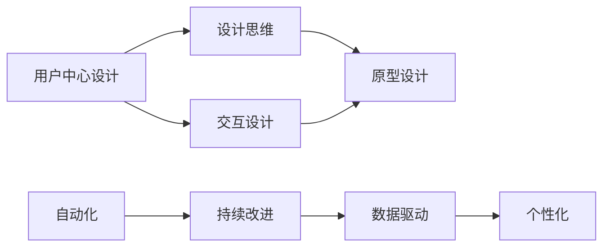

                 

# 自动化创业中的用户体验设计

> 关键词：用户体验设计, 自动化, 创业, 设计思维, 用户反馈, 持续改进, 数据驱动, 个性化, 交互设计, 原型设计

## 1. 背景介绍

在当今这个快速发展的数字化时代，用户体验设计(UX Design)已经成为了创业公司成功的关键因素之一。无论是初创企业还是大型科技公司，拥有优秀用户体验的企业往往能在市场竞争中立于不败之地。特别是在自动化创业领域，用户体验设计的优劣直接决定了产品能否被用户接受和使用。

自动化创业是指使用自动化技术来简化或自动化业务流程，从而降低成本、提高效率的创业模式。近年来，随着人工智能、大数据、云计算等技术的飞速发展，自动化创业成为了一个热门领域。从智能客服到自动驾驶，从智能制造到机器人助手，自动化技术正在各个行业中找到其用武之地。然而，将技术转化为用户友好的产品，如何让用户体验与技术完美结合，却是自动化创业中的一个巨大挑战。

## 2. 核心概念与联系

### 2.1 核心概念概述

为了更好地理解自动化创业中的用户体验设计，我们先简要介绍几个核心概念：

- **用户体验设计(UX Design)**：专注于提升用户与产品交互的愉悦度和效率，通过设计和创新提升用户满意度。
- **用户中心设计(User-Centered Design)**：以用户需求为核心，从用户角度出发进行产品设计，确保产品能够满足用户真实需求。
- **设计思维(Design Thinking)**：一种以用户为中心的创新方法，通过深度访谈、共情、原型制作等步骤，激发创新思维，解决用户问题。
- **自动化(Automation)**：通过技术手段自动化执行一系列任务，减少人力成本，提高效率。
- **持续改进(Continuous Improvement)**：不断优化和改进产品，以适应用户需求和技术进步。
- **数据驱动(Data-Driven)**：通过数据分析来指导决策，确保产品设计的合理性和有效性。
- **个性化(Personalization)**：根据用户的具体需求和行为，定制个性化的产品体验。
- **交互设计(Interaction Design)**：专注于用户与产品互动的细节，提升产品的易用性和吸引力。
- **原型设计(Prototype Design)**：在正式开发前，快速创建产品模型，用于测试和迭代。

这些核心概念相互联系，共同构成了自动化创业中用户体验设计的框架。用户中心设计、设计思维和交互设计是设计的基础，自动化和持续改进则是实现的手段，而数据驱动和个性化则是评估和优化的依据。

### 2.2 核心概念原理和架构的 Mermaid 流程图



通过上述流程图，我们可以清晰地看到用户体验设计在自动化创业中的全流程：

1. **用户中心设计**：以用户需求为核心，确保设计思路和解决方案符合用户期望。
2. **设计思维**：通过深度访谈、共情等方法，挖掘用户真实需求，激发创新思维。
3. **交互设计**：提升用户与产品的互动体验，增强产品吸引力和易用性。
4. **原型设计**：快速创建产品原型，用于测试和迭代。
5. **自动化**：通过技术手段实现任务自动化，提升效率。
6. **持续改进**：根据用户反馈和数据洞察，不断优化产品，提升用户体验。
7. **数据驱动**：利用数据分析指导决策，确保产品设计的合理性和有效性。
8. **个性化**：根据用户行为和偏好，提供个性化的产品体验。

这些步骤相互关联，形成一个闭环反馈系统，持续提升用户体验。

## 3. 核心算法原理 & 具体操作步骤

### 3.1 算法原理概述

在自动化创业中，用户体验设计的核心在于将技术转化为易于使用、满足用户需求的产品。这需要通过一系列设计方法和技术手段来实现。以下是基于设计思维和用户体验设计的基本原理和步骤：

- **共情(Empathy)**：深入理解用户需求和痛点，通过访谈、观察等手段获取用户真实的反馈。
- **定义(Define)**：明确用户需求和目标，制定产品愿景和设计目标。
- **创意(Ideate)**：基于用户需求，生成多种创意和解决方案，并进行筛选和优化。
- **原型(Prototype)**：创建初步的产品原型，进行用户测试和反馈收集。
- **验证(Validate)**：通过用户测试和数据分析，验证产品设计是否符合用户需求和目标，并根据反馈进行调整。

### 3.2 算法步骤详解

#### 3.2.1 共情 (Empathy)

共情是用户体验设计的起点。通过深入理解用户需求和痛点，确定设计方向和目标。具体步骤如下：

1. **用户访谈**：与目标用户进行深度访谈，了解他们的需求、痛点和行为习惯。
2. **用户观察**：观察用户在使用产品时的行为和反应，发现潜在问题和改进点。
3. **情感分析**：通过分析用户反馈中的情感倾向，识别用户真实的情感需求。
4. **用户画像**：基于访谈和观察数据，构建典型的用户画像，代表目标用户群体。

#### 3.2.2 定义 (Define)

在共情的基础上，明确产品设计的目标和方向，具体步骤如下：

1. **用户需求分析**：根据共情数据，分析用户的核心需求和痛点，确定产品的主要功能和特性。
2. **产品愿景制定**：结合市场需求和技术可行性，制定产品的整体愿景和设计目标。
3. **设计目标设定**：基于用户需求和产品愿景，设定具体的设计目标，如易用性、效率、安全性等。

#### 3.2.3 创意 (Ideate)

创意阶段是生成多种解决方案，进行筛选和优化的过程。具体步骤如下：

1. **头脑风暴**：组织设计团队进行头脑风暴，生成尽可能多的创意和解决方案。
2. **筛选与评估**：基于用户需求和设计目标，筛选出最有潜力的创意，并进行评估和优化。
3. **原型设计**：快速创建初步的产品原型，用于后续测试和验证。

#### 3.2.4 原型 (Prototype)

原型设计是快速验证和优化产品设计的阶段。具体步骤如下：

1. **草图绘制**：绘制产品草图，初步展示设计思路和功能布局。
2. **快速原型**：使用工具（如Sketch、Figma、Axure等）快速创建初步的产品原型。
3. **用户测试**：将原型提交给目标用户进行测试，收集反馈和建议。

#### 3.2.5 验证 (Validate)

验证阶段是对产品设计的最终测试和优化。具体步骤如下：

1. **用户测试**：通过用户测试和数据分析，验证产品设计是否符合用户需求和目标。
2. **数据分析**：分析用户反馈和行为数据，发现潜在问题和改进点。
3. **迭代优化**：根据用户测试和数据分析结果，不断迭代和优化产品设计。

### 3.3 算法优缺点

**优点**：

1. **用户中心**：通过深入理解用户需求和痛点，设计出真正满足用户需求的产品。
2. **数据驱动**：利用数据分析指导设计决策，确保产品设计的合理性和有效性。
3. **持续改进**：通过用户测试和数据分析，不断优化产品设计，提升用户体验。
4. **创新性**：设计思维和原型设计有助于激发创新思维，产生更多创意和解决方案。

**缺点**：

1. **资源消耗**：用户中心设计和原型设计需要大量的人力和时间投入，初期成本较高。
2. **复杂性高**：需要跨部门合作，协调设计和开发团队，复杂度较高。
3. **易变性**：用户需求和技术环境的变化可能导致频繁的调整和优化。

### 3.4 算法应用领域

基于用户体验设计的自动化创业方法，广泛应用于以下领域：

- **智能客服**：通过用户体验设计提升客服自动化系统的用户满意度。
- **智能制造**：通过优化生产流程和用户界面，提升自动化生产系统的用户体验。
- **智能家居**：通过设计易用、智能的家居设备，提升用户的居住体验。
- **金融科技**：通过设计安全、便捷的金融服务，提升用户的金融体验。
- **健康医疗**：通过设计易用、准确的医疗设备，提升患者的治疗体验。
- **自动驾驶**：通过设计直观、安全的驾驶界面，提升用户的驾驶体验。

## 4. 数学模型和公式 & 详细讲解 & 举例说明

### 4.1 数学模型构建

用户体验设计的量化评估通常依赖于多种指标和模型。以下是几个常用的数学模型和指标：

1. **用户满意度(Satisfaction Score)**：衡量用户对产品的总体满意度，可以通过问卷调查或NPS（净推荐值）评估。
2. **任务完成率(Completion Rate)**：衡量用户完成任务的效率，通过任务测试数据计算。
3. **用户流失率(Churn Rate)**：衡量用户流失率，通过用户行为数据计算。
4. **错误率(Error Rate)**：衡量用户在操作过程中出现错误的频率，通过错误数据统计。

### 4.2 公式推导过程

以用户满意度(Satisfaction Score)为例，其计算公式为：

$$
S = \frac{\sum_{i=1}^N (u_i \times w_i)}{\sum_{i=1}^N w_i}
$$

其中 $u_i$ 为第 $i$ 个用户的满意度评分，$w_i$ 为每个用户的重要度权重。

以任务完成率(Completion Rate)为例，其计算公式为：

$$
C = \frac{\sum_{i=1}^N \text{Completed Tasks}_i}{\sum_{i=1}^N \text{Total Tasks}_i}
$$

其中 $\text{Completed Tasks}_i$ 为第 $i$ 个用户成功完成任务的数量，$\text{Total Tasks}_i$ 为第 $i$ 个用户尝试完成的任务总数。

### 4.3 案例分析与讲解

**案例：智能客服系统的用户体验设计**

智能客服系统是一个典型的自动化创业案例，其用户体验设计的核心在于提升用户满意度。具体步骤如下：

1. **共情**：通过用户访谈和观察，了解用户在使用客服系统时的需求和痛点。
2. **定义**：明确用户需求，设定产品愿景和设计目标，如提升用户满意度、提高问题解决效率等。
3. **创意**：设计多种解决方案，如自动回复、人工客服、知识库查询等。
4. **原型**：创建初步的智能客服原型，进行用户测试和反馈收集。
5. **验证**：通过用户测试和数据分析，验证原型设计的有效性，进行迭代优化。

## 5. 项目实践：代码实例和详细解释说明

### 5.1 开发环境搭建

为了进行用户体验设计的实践，我们需要准备以下开发环境：

1. **开发工具**：如Sketch、Figma、Axure等原型设计工具。
2. **数据收集工具**：如SurveyMonkey、Typeform等问卷调查工具。
3. **数据分析工具**：如Excel、Tableau等数据分析工具。

**工具搭建步骤**：

1. **安装Sketch**：从官网下载并安装Sketch，用于创建原型和设计界面。
2. **安装Figma**：从官网下载并安装Figma，用于实时协作和共享设计文件。
3. **安装Axure**：从官网下载并安装Axure，用于创建交互式原型和进行用户测试。
4. **安装SurveyMonkey**：注册并使用SurveyMonkey，创建问卷调查并收集用户反馈。
5. **安装Typeform**：注册并使用Typeform，创建问卷调查并收集用户反馈。
6. **安装Excel**：安装Excel，用于数据分析和处理。
7. **安装Tableau**：安装Tableau，用于数据可视化和分析。

### 5.2 源代码详细实现

**代码示例：创建简单的用户体验评估问卷**

```python
import random
import string

class UserFeedback:
    def __init__(self, questions, responses):
        self.questions = questions
        self.responses = responses
    
    def generate_survey(self, num_users):
        surveys = []
        for _ in range(num_users):
            user_survey = {}
            for i, question in enumerate(self.questions):
                response = random.choice(self.responses[i])
                user_survey[f"Q{i+1}"] = response
            surveys.append(user_survey)
        return surveys
    
    def analyze_feedback(self, surveys):
        # 实现简单的数据分析和处理
        pass

# 创建用户体验评估问卷
questions = ["您对产品的满意度如何？", "您认为产品的易用性如何？", "您是否推荐该产品？"]
responses = [["非常满意", "满意", "一般", "不满意", "非常不满意"], ["非常好用", "好用", "一般", "不好用", "非常不好用"], ["强烈推荐", "推荐", "观望", "不推荐", "强烈不推荐"]]

feedback = UserFeedback(questions, responses)

# 生成100份用户反馈问卷
surveys = feedback.generate_survey(100)

# 分析用户反馈数据
feedback.analyze_feedback(surveys)
```

### 5.3 代码解读与分析

在上述代码中，我们定义了一个 `UserFeedback` 类，用于生成和分析用户体验评估问卷。具体步骤如下：

1. **创建问卷问题**：定义问卷问题和对应的响应选项。
2. **生成问卷数据**：根据问卷问题生成指定数量的问卷数据。
3. **分析问卷数据**：对生成的问卷数据进行分析，了解用户反馈。

### 5.4 运行结果展示

运行上述代码，我们可以生成100份用户反馈问卷，并对其进行分析。例如，可以使用Excel和Tableau对问卷数据进行可视化，分析用户满意度和产品易用性等关键指标。

## 6. 实际应用场景

### 6.1 智能客服系统的用户体验设计

智能客服系统是一个典型的自动化创业案例，其用户体验设计的核心在于提升用户满意度。具体步骤如下：

1. **共情**：通过用户访谈和观察，了解用户在使用客服系统时的需求和痛点。
2. **定义**：明确用户需求，设定产品愿景和设计目标，如提升用户满意度、提高问题解决效率等。
3. **创意**：设计多种解决方案，如自动回复、人工客服、知识库查询等。
4. **原型**：创建初步的智能客服原型，进行用户测试和反馈收集。
5. **验证**：通过用户测试和数据分析，验证原型设计的有效性，进行迭代优化。

### 6.2 智能制造的自动化设计

智能制造的自动化设计需要考虑用户操作界面的友好性和效率。具体步骤如下：

1. **共情**：通过观察和访谈，了解用户在生产流程中的需求和痛点。
2. **定义**：明确用户需求，设定产品愿景和设计目标，如提升生产效率、降低生产成本等。
3. **创意**：设计多种解决方案，如自动化控制系统、智能设备等。
4. **原型**：创建初步的智能制造原型，进行用户测试和反馈收集。
5. **验证**：通过用户测试和数据分析，验证原型设计的有效性，进行迭代优化。

### 6.3 智能家居的体验设计

智能家居的体验设计需要考虑用户居住环境的舒适性和便利性。具体步骤如下：

1. **共情**：通过访谈和观察，了解用户在居住环境中的需求和痛点。
2. **定义**：明确用户需求，设定产品愿景和设计目标，如提升居住舒适性、提高生活质量等。
3. **创意**：设计多种解决方案，如智能灯光控制、智能温控系统等。
4. **原型**：创建初步的智能家居原型，进行用户测试和反馈收集。
5. **验证**：通过用户测试和数据分析，验证原型设计的有效性，进行迭代优化。

### 6.4 金融科技的用户体验设计

金融科技的用户体验设计需要考虑用户交易的便捷性和安全性。具体步骤如下：

1. **共情**：通过访谈和观察，了解用户在金融交易中的需求和痛点。
2. **定义**：明确用户需求，设定产品愿景和设计目标，如提升交易便捷性、保障用户安全等。
3. **创意**：设计多种解决方案，如一键支付、交易记录查询等。
4. **原型**：创建初步的金融科技原型，进行用户测试和反馈收集。
5. **验证**：通过用户测试和数据分析，验证原型设计的有效性，进行迭代优化。

## 7. 工具和资源推荐

### 7.1 学习资源推荐

为了帮助开发者系统掌握用户体验设计的方法和工具，这里推荐一些优质的学习资源：

1. **《设计心理学》**：豆瓣评分9.2，深入浅出地介绍了设计心理学的基础理论和实践方法。
2. **《用户体验设计全案》**：豆瓣评分8.9，全面介绍了用户体验设计的全流程和实践案例。
3. **《设计思维》**：豆瓣评分9.0，系统介绍了设计思维的基本原理和实用工具。
4. **《用户体验设计基础》**：豆瓣评分8.7，深入讲解了用户体验设计的基础知识和技能。
5. **《用户体验设计模式》**：豆瓣评分9.2，总结了用户体验设计的典型模式和设计原则。
6. **《设计思维实战》**：豆瓣评分8.5，提供了设计思维在实际项目中的应用案例和技巧。

### 7.2 开发工具推荐

用户体验设计的开发工具多种多样，以下是几款常用的工具：

1. **Sketch**：用户界面设计工具，支持原型制作、界面设计、色彩搭配等功能。
2. **Figma**：实时协作设计工具，支持团队成员共同设计和反馈。
3. **Axure**：交互原型设计工具，支持创建交互式原型和用户测试。
4. **SurveyMonkey**：问卷调查工具，支持创建问卷和收集用户反馈。
5. **Typeform**：问卷调查工具，支持创建互动性问卷和收集用户反馈。
6. **Excel**：数据分析工具，支持数据的统计和可视化。
7. **Tableau**：数据可视化工具，支持数据的高级分析和可视化。

### 7.3 相关论文推荐

用户体验设计的研究涉及多个学科，以下是几篇经典论文，推荐阅读：

1. **《设计心理学基础》**：介绍了设计心理学的基本原理和应用方法。
2. **《用户体验设计的用户模型》**：探讨了用户模型在用户体验设计中的应用。
3. **《设计思维在产品创新中的应用》**：总结了设计思维在产品创新中的实际应用案例。
4. **《基于数据的用户体验优化》**：讨论了数据在用户体验设计中的重要性。
5. **《自动化设计：人机协作的未来》**：探讨了自动化技术在用户体验设计中的应用。

## 8. 总结：未来发展趋势与挑战

### 8.1 研究成果总结

本文系统介绍了用户体验设计在自动化创业中的应用，通过理论和方法的详细讲解，为读者提供了全面的实践指导。通过案例分析，展示了用户体验设计在智能客服、智能制造、智能家居等多个领域的应用。同时，本文还推荐了相关学习资源和工具，为读者提供了进一步学习和实践的渠道。

### 8.2 未来发展趋势

随着技术的发展，用户体验设计在自动化创业中的应用将更加广泛和深入：

1. **多模态交互**：结合语音、图像、手势等多模态交互方式，提升用户体验的丰富性和多样性。
2. **个性化推荐**：基于用户行为和偏好，提供个性化的产品体验，提升用户满意度。
3. **AI辅助设计**：利用AI技术进行自动化设计，提高设计的效率和质量。
4. **数据驱动设计**：通过数据分析指导设计决策，确保产品设计的合理性和有效性。
5. **实时反馈优化**：通过实时用户反馈，持续优化产品设计，提升用户体验。
6. **跨领域融合**：将用户体验设计与其他学科（如心理学、社会学）进行融合，提升设计的深度和广度。

### 8.3 面临的挑战

尽管用户体验设计在自动化创业中的应用前景广阔，但仍然面临诸多挑战：

1. **数据隐私**：在收集用户反馈和数据时，如何保护用户隐私，防止数据泄露。
2. **跨部门协作**：设计团队与开发团队之间的协作复杂，如何提高协作效率，减少沟通成本。
3. **用户反馈收集**：在用户反馈获取和处理过程中，如何提高用户参与度，收集高质量数据。
4. **设计迭代成本**：设计迭代过程中，如何降低成本，提高效率，避免浪费资源。
5. **用户多样性**：在面对不同用户群体时，如何设计符合不同用户需求的产品。
6. **技术变革**：在技术快速发展的背景下，如何及时更新设计思维和方法，保持设计的前沿性。

### 8.4 研究展望

未来的用户体验设计研究需要从多个方面进行探索和突破：

1. **隐私保护技术**：研究隐私保护技术，确保用户数据的安全性和匿名性。
2. **自动化设计工具**：开发自动化设计工具，提升设计效率和质量。
3. **用户反馈平台**：构建用户反馈平台，收集和分析用户数据，指导设计决策。
4. **跨领域合作**：加强与其他学科的合作，提升设计的深度和广度。
5. **实时反馈系统**：开发实时反馈系统，支持持续优化设计。
6. **AI辅助设计**：利用AI技术进行设计辅助，提升设计效率和质量。

总之，用户体验设计在自动化创业中的应用前景广阔，但面临的挑战也逐渐增多。只有不断创新和突破，才能将用户体验设计推向新的高度，推动自动化创业的发展。

## 9. 附录：常见问题与解答

**Q1：用户体验设计在自动化创业中有什么作用？**

A: 用户体验设计在自动化创业中具有重要作用，主要体现在以下几个方面：

1. **提升用户满意度**：通过优化用户界面和交互流程，提升用户对产品的满意度。
2. **提高用户参与度**：设计符合用户需求的界面，提高用户的使用意愿和参与度。
3. **减少用户流失**：通过设计易用、高效的产品，减少用户流失率，提升用户留存率。
4. **提升产品竞争力**：优秀的用户体验设计可以提升产品的市场竞争力和用户口碑。

**Q2：如何平衡用户体验和自动化技术？**

A: 平衡用户体验和自动化技术的关键在于设计思维和数据驱动：

1. **设计思维**：深入理解用户需求和痛点，通过共情和共创，设计出符合用户需求的产品。
2. **数据驱动**：通过数据分析指导设计决策，确保产品设计的合理性和有效性。
3. **人机协作**：设计易于操作的界面，使技术手段与用户需求无缝结合。
4. **持续优化**：根据用户反馈和数据分析，不断优化产品设计，提升用户体验。

**Q3：用户体验设计的成本如何控制？**

A: 用户体验设计的成本控制主要依赖于设计思维和流程优化：

1. **快速原型设计**：通过快速创建初步设计原型，快速迭代和优化，降低设计成本。
2. **用户测试**：通过用户测试，快速收集反馈，减少后期修改成本。
3. **跨部门协作**：通过跨部门协作，提高设计效率，降低沟通成本。
4. **自动化工具**：利用自动化设计工具，提升设计效率和质量。

**Q4：用户体验设计的未来发展趋势是什么？**

A: 用户体验设计的未来发展趋势主要体现在以下几个方面：

1. **多模态交互**：结合语音、图像、手势等多模态交互方式，提升用户体验的丰富性和多样性。
2. **个性化推荐**：基于用户行为和偏好，提供个性化的产品体验，提升用户满意度。
3. **AI辅助设计**：利用AI技术进行自动化设计，提高设计的效率和质量。
4. **数据驱动设计**：通过数据分析指导设计决策，确保产品设计的合理性和有效性。
5. **实时反馈优化**：通过实时用户反馈，持续优化产品设计，提升用户体验。
6. **跨领域融合**：将用户体验设计与其他学科（如心理学、社会学）进行融合，提升设计的深度和广度。

**Q5：用户体验设计的实际应用案例有哪些？**

A: 用户体验设计的实际应用案例广泛，以下是几个典型案例：

1. **智能客服系统**：通过设计易用、高效的界面，提升用户满意度，提高问题解决效率。
2. **智能家居设备**：设计友好、智能的家居界面，提升用户的居住体验。
3. **金融科技产品**：设计安全、便捷的交易界面，提升用户的使用体验。
4. **医疗健康应用**：设计易用、准确的医疗设备，提升患者的治疗体验。

总之，用户体验设计在自动化创业中具有重要作用，通过设计思维和数据驱动，提升产品的用户满意度和竞争力。未来，随着技术的不断进步和设计的持续优化，用户体验设计将在自动化创业中发挥更大的作用。

