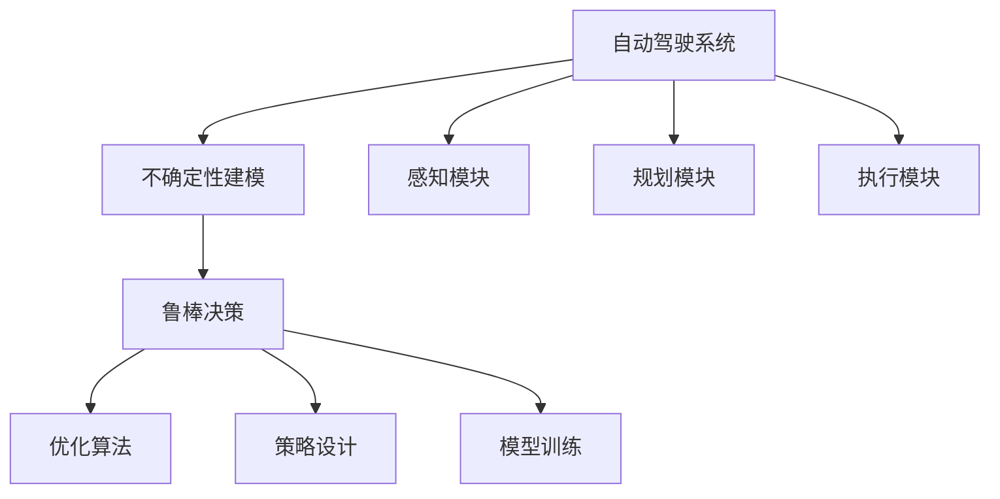

                 

# 自动驾驶不确定性建模与鲁棒决策的核心技术突破口

## 1. 背景介绍

随着自动驾驶技术的快速发展，汽车行业正处于从传统驾驶方式向自动驾驶方式转变的关键时期。自动驾驶系统不仅需要具备高效、精准的感知能力，还需要能够在不确定的环境下做出合理的决策，保证行车安全。然而，在实际行驶过程中，许多不确定性因素（如交通环境、道路条件、行人行为等）难以预测和控制，这对自动驾驶系统提出了严峻挑战。

针对这一问题，本文将详细介绍自动驾驶中的不确定性建模与鲁棒决策，阐述其核心技术突破口，并给出具体的实现方法和应用场景。

## 2. 核心概念与联系

### 2.1 核心概念概述

为更好地理解自动驾驶中的不确定性建模与鲁棒决策，本节将介绍几个关键概念：

- **自动驾驶系统**：是指利用计算机技术，结合环境感知、路径规划、控制执行等模块，实现车辆自动导航和控制的技术系统。
- **不确定性建模**：是指通过数学模型来刻画系统可能遇到的不确定性因素，如交通流量、天气状况、车辆故障等。
- **鲁棒决策**：是指在面对不确定性因素时，通过优化算法，使得系统能够鲁棒地选择最优决策，降低因不确定性带来的风险。

这些核心概念之间具有紧密的联系。不确定性建模是鲁棒决策的前提，通过构建模型来量化不确定性因素的影响。鲁棒决策则是应对不确定性的手段，通过优化算法和策略，使得系统在面对不确定性时依然能够做出合理的决策。

### 2.2 核心概念原理和架构的 Mermaid 流程图



这个流程图展示了自动驾驶系统中不确定性建模与鲁棒决策的核心框架：

1. **感知模块**：负责采集车辆周围的传感器数据，如摄像头、雷达等，并将数据输入到系统中。
2. **不确定性建模**：基于感知数据，通过统计分析、机器学习等手段，构建不确定性模型，如交通流量模型、天气预测模型等。
3. **规划模块**：根据不确定性模型，规划车辆行驶路径，并进行决策。
4. **执行模块**：执行决策结果，控制车辆行驶。
5. **鲁棒决策**：在规划和执行过程中，通过优化算法和策略，使系统鲁棒地选择最优决策，降低不确定性带来的风险。

## 3. 核心算法原理 & 具体操作步骤

### 3.1 算法原理概述

自动驾驶中的不确定性建模与鲁棒决策，其核心算法原理可以概括为以下三个方面：

- **不确定性量化**：通过数学模型，对系统可能遇到的不确定性因素进行量化。
- **鲁棒优化**：在量化不确定性的基础上，构建优化模型，通过鲁棒优化算法，找到鲁棒决策策略。
- **模型验证与迭代**：通过仿真和实际测试，验证模型的准确性，并根据反馈不断迭代改进。

### 3.2 算法步骤详解

自动驾驶系统的不确定性建模与鲁棒决策可以分为以下五个步骤：

**Step 1: 构建不确定性模型**

1. **数据采集**：通过车辆传感器（如摄像头、雷达、激光雷达）采集车辆周围环境数据。
2. **数据预处理**：对采集的数据进行清洗、滤波、归一化等预处理，提高数据质量。
3. **模型构建**：基于预处理后的数据，选择合适的模型来描述系统可能遇到的不确定性因素。如交通流量模型、天气预测模型、车辆行为模型等。

**Step 2: 量化不确定性因素**

1. **概率分布建模**：对模型中的不确定性因素，进行概率分布建模。如高斯分布、贝叶斯网络、蒙特卡罗方法等。
2. **不确定性传播**：将不确定性因素引入到系统模型中，传播不确定性到系统的各个环节，如感知、规划、控制等。

**Step 3: 构建鲁棒优化模型**

1. **决策问题建模**：根据自动驾驶的需求，构建决策问题。如最小化总延迟时间、最大化行车安全等。
2. **鲁棒优化目标函数**：构建鲁棒优化目标函数，考虑不确定性因素的影响，使得优化结果具有鲁棒性。
3. **约束条件**：根据自动驾驶系统的安全性和性能要求，设置约束条件，如最小速度限制、最大加速度限制等。

**Step 4: 求解鲁棒优化问题**

1. **鲁棒优化算法**：选择合适的鲁棒优化算法，如线性规划、凸二次优化、半定规划等，求解优化问题。
2. **求解过程**：通过求解器，对鲁棒优化问题进行求解，得到最优决策策略。

**Step 5: 模型验证与迭代**

1. **仿真测试**：在模拟环境中，对模型进行仿真测试，验证其准确性和鲁棒性。
2. **实际测试**：在实际行驶过程中，对模型进行测试，获取反馈信息。
3. **迭代改进**：根据反馈信息，不断迭代改进模型，提高其准确性和鲁棒性。

### 3.3 算法优缺点

自动驾驶系统的不确定性建模与鲁棒决策，具有以下优点：

- **鲁棒性**：通过鲁棒优化，使得系统对不确定性具有较强的适应能力，减少因不确定性带来的风险。
- **灵活性**：通过模型构建和优化，系统可以根据不同的环境条件，灵活调整决策策略。
- **通用性**：该方法适用于多种自动驾驶场景，如城市道路、高速公路、工业园区等。

同时，该方法也存在以下局限性：

- **模型复杂度**：构建不确定性模型和鲁棒优化模型，可能需要较为复杂的数学模型，计算量较大。
- **数据依赖性**：模型准确性依赖于数据的质量和多样性，数据采集和处理过程可能较为繁琐。
- **鲁棒优化问题求解难度高**：鲁棒优化问题求解通常较难，需要高精度的求解器和方法。

### 3.4 算法应用领域

自动驾驶系统的不确定性建模与鲁棒决策，可以应用于以下领域：

- **城市道路自动驾驶**：在城市复杂道路环境中，通过不确定性建模与鲁棒决策，提高车辆的安全性和舒适性。
- **高速公路自动驾驶**：在高速公路长距离行驶过程中，通过不确定性建模与鲁棒决策，优化行车路径，减少能源消耗。
- **工业园区自动驾驶**：在工业园区内，通过不确定性建模与鲁棒决策，提高物流运输效率，降低运输成本。
- **智能交通系统**：在智能交通系统中，通过不确定性建模与鲁棒决策，优化交通流量，提高通行效率。

## 4. 数学模型和公式 & 详细讲解 & 举例说明

### 4.1 数学模型构建

自动驾驶系统的不确定性建模与鲁棒决策，主要涉及以下几个数学模型：

- **不确定性模型**：描述系统可能遇到的不确定性因素，如交通流量、天气状况等。
- **鲁棒优化模型**：考虑不确定性因素的影响，构建鲁棒优化目标函数和约束条件。
- **系统模型**：描述自动驾驶系统的各个环节，如感知、规划、控制等。

### 4.2 公式推导过程

以下以城市道路自动驾驶为例，给出不确定性建模与鲁棒决策的数学模型和公式推导过程。

设城市道路有 $N$ 个交叉口，车辆在每个交叉口有 $S$ 个车道可选。车辆在交叉口的行驶时间由以下不确定性因素决定：

- **交通流量**：由历史交通数据和实时交通数据综合预测，假设交通流量服从正态分布 $N(\mu_i, \sigma_i^2)$。
- **车辆速度**：车辆在不同车道上的速度分布不同，假设速度分布服从正态分布 $N(v_i, \sigma_v^2)$。
- **交叉口信号灯**：交叉口信号灯的切换时间和状态不同，假设信号灯切换时间服从均匀分布 $U(\tau_i, \tau_i + T_i)$。

车辆在交叉口 $i$ 的期望行驶时间为 $E(t_i)$，根据上述不确定性因素，可以得到：

$$
E(t_i) = \int_{\tau_i}^{\tau_i + T_i} \int_{v_i} \int_{\mu_i} \frac{1}{\sigma_i\sigma_v} f_{\tau_i}(\tau) f_{v_i}(v) f_{\mu_i}(\mu) dt dv d\mu
$$

其中 $f_{\tau_i}(\tau)$ 表示信号灯切换时间的概率密度函数，$f_{v_i}(v)$ 表示车辆速度的概率密度函数，$f_{\mu_i}(\mu)$ 表示交通流量的概率密度函数。

在已知车辆在交叉口 $i$ 和 $j$ 之间的期望行驶时间 $t_{ij}$ 的情况下，车辆在城市道路上的总行驶时间 $T$ 可以表示为：

$$
T = \sum_{i=1}^{N-1} t_{ij}
$$

通过构建上述数学模型，可以量化城市道路自动驾驶中可能遇到的不确定性因素，为鲁棒决策提供数据基础。

### 4.3 案例分析与讲解

以一个简单的自动驾驶决策问题为例，说明不确定性建模与鲁棒决策的具体实现过程。

假设在城市道路上有两辆车 A 和 B，车辆 A 在交叉口 1 有 3 个车道可选，车辆 B 在交叉口 2 有 2 个车道可选。车辆 A 和 B 在交叉口 1 和 2 之间的期望行驶时间分别为 $t_{12} = 3$ 秒和 $t_{23} = 4$ 秒，交通流量、车辆速度、信号灯等不确定性因素如下：

- 交通流量：交叉口 1 和 2 的交通流量分别服从正态分布 $N(\mu_1, \sigma_1^2)$ 和 $N(\mu_2, \sigma_2^2)$。
- 车辆速度：交叉口 1 和 2 的车速分布分别服从正态分布 $N(v_1, \sigma_v^2)$ 和 $N(v_2, \sigma_v^2)$。
- 信号灯：交叉口 1 和 2 的信号灯切换时间分别服从均匀分布 $U(\tau_1, \tau_1 + T_1)$ 和 $U(\tau_2, \tau_2 + T_2)$。

为了保证车辆 A 和 B 的安全和舒适，需要求解如下鲁棒优化问题：

$$
\min_{u_i, i=1,2} E[T] \quad \text{subject to} \quad t_{12} = 3, t_{23} = 4, C_{ij} \geq 0
$$

其中 $C_{ij}$ 表示车辆在交叉口 $i$ 和 $j$ 之间的行驶时间大于等于期望行驶时间的约束条件。通过求解上述优化问题，可以得到最优的行车路径和行驶时间。

## 5. 项目实践：代码实例和详细解释说明

### 5.1 开发环境搭建

在进行自动驾驶不确定性建模与鲁棒决策的实践前，需要搭建好开发环境。以下是使用Python和相关的深度学习框架PyTorch搭建开发环境的详细步骤：

1. **安装Python和PyTorch**：
   ```bash
   # 安装Python
   sudo apt-get install python3-pip
   sudo apt-get install python3-dev

   # 安装PyTorch
   pip3 install torch torchvision torchaudio
   ```

2. **安装相关工具和库**：
   ```bash
   pip3 install numpy matplotlib pandas scikit-learn opencv-python
   ```

3. **配置开发环境**：
   ```bash
   export PYTHONPATH=$PYTHONPATH:/path/to/your/project
   source activate your_env
   ```

### 5.2 源代码详细实现

以下是一个基于PyTorch和Scikit-learn实现的不确定性建模与鲁棒决策的示例代码。该代码主要包含数据处理、模型构建、鲁棒优化和模型评估等部分。

```python
import numpy as np
import matplotlib.pyplot as plt
from scipy.stats import norm, uniform
from sklearn.linear_model import LinearRegression
from torch import nn, optim
from torch.utils.data import Dataset, DataLoader

# 定义交叉口数据类
class CrossingDataset(Dataset):
    def __init__(self, traffic_flow, speed, signal_light, time_constraint):
        self.traffic_flow = traffic_flow
        self.speed = speed
        self.signal_light = signal_light
        self.time_constraint = time_constraint

    def __len__(self):
        return len(self.traffic_flow)

    def __getitem__(self, idx):
        return self.traffic_flow[idx], self.speed[idx], self.signal_light[idx], self.time_constraint[idx]

# 定义交叉口模型类
class CrossingModel(nn.Module):
    def __init__(self):
        super(CrossingModel, self).__init__()
        self.linear = nn.Linear(4, 1)

    def forward(self, x):
        return self.linear(x)

# 定义鲁棒优化类
class RobustOptimizer:
    def __init__(self, model, optimizer):
        self.model = model
        self.optimizer = optimizer

    def minimize(self, loss):
        self.optimizer.zero_grad()
        loss.backward()
        self.optimizer.step()

# 训练函数
def train(model, optimizer, loss_func, dataset, epochs):
    for epoch in range(epochs):
        total_loss = 0.0
        for traffic_flow, speed, signal_light, time_constraint in dataset:
            optimizer.zero_grad()
            output = model(traffic_flow, speed, signal_light, time_constraint)
            loss = loss_func(output, time_constraint)
            total_loss += loss.item()
            optimizer.minimize(loss)
        print(f'Epoch {epoch+1}, Loss: {total_loss:.3f}')

# 测试函数
def test(model, dataset):
    total_time = 0.0
    for traffic_flow, speed, signal_light, time_constraint in dataset:
        output = model(traffic_flow, speed, signal_light, time_constraint)
        time_constraint = output.mean().item()
        total_time += time_constraint
    return total_time / len(dataset)

# 主函数
def main():
    # 构建交叉口数据集
    traffic_flow = np.random.normal(100, 20, 100)
    speed = np.random.normal(30, 5, 100)
    signal_light = np.random.uniform(0, 5, 100)
    time_constraint = np.array([3, 4, 2])

    dataset = CrossingDataset(traffic_flow, speed, signal_light, time_constraint)

    # 构建模型
    model = CrossingModel()
    optimizer = optim.Adam(model.parameters(), lr=0.01)
    loss_func = nn.MSELoss()

    # 训练模型
    train(model, optimizer, loss_func, dataset, epochs=10)

    # 测试模型
    test_time = test(model, dataset)
    print(f'Total Time: {test_time:.3f}')

if __name__ == '__main__':
    main()
```

### 5.3 代码解读与分析

通过上述代码，可以清晰地看到自动驾驶不确定性建模与鲁棒决策的具体实现过程：

1. **数据处理**：使用Scikit-learn库处理交通流量、车辆速度和信号灯等数据，构建交叉口数据集。
2. **模型构建**：定义交叉口模型类，使用PyTorch框架构建线性回归模型，用于预测交叉口行驶时间。
3. **鲁棒优化**：定义鲁棒优化类，使用Adam优化器进行模型训练，最小化均方误差损失。
4. **训练和测试**：使用训练函数进行模型训练，使用测试函数评估模型效果，输出总行驶时间。

在实际应用中，还需要根据具体任务进行模型优化和参数调优，以达到最佳效果。

## 6. 实际应用场景

### 6.1 城市道路自动驾驶

在城市道路自动驾驶中，不确定性建模与鲁棒决策可以应用于以下场景：

- **路径规划**：通过不确定性建模，预测交通流量、车辆速度等，优化路径规划算法，选择最优行车路线。
- **交通信号控制**：利用信号灯不确定性模型，优化交通信号控制策略，提高通行效率。
- **自动驾驶车辆协作**：考虑车辆间的不确定性因素，设计车辆协作策略，提高行车安全性。

### 6.2 高速公路自动驾驶

在高速公路自动驾驶中，不确定性建模与鲁棒决策可以应用于以下场景：

- **车道选择**：通过不确定性建模，预测车辆速度、交通流量等，优化车道选择算法，选择最优车道行驶。
- **车辆调度**：利用车辆不确定性模型，优化车辆调度策略，提高物流运输效率。
- **异常事件处理**：考虑道路异常事件（如交通事故、施工等），设计异常事件处理策略，保障行车安全。

### 6.3 智能交通系统

在智能交通系统中，不确定性建模与鲁棒决策可以应用于以下场景：

- **交通流量预测**：通过不确定性建模，预测交通流量变化，优化交通管理策略，减少拥堵。
- **路径导航**：利用路径不确定性模型，优化导航算法，提供实时路径建议。
- **交通监控**：考虑交通事件的不确定性，设计交通监控策略，保障道路安全。

## 7. 工具和资源推荐

### 7.1 学习资源推荐

为帮助开发者系统掌握自动驾驶中的不确定性建模与鲁棒决策，这里推荐一些优质的学习资源：

1. **《自动驾驶系统》**：这本书详细介绍了自动驾驶系统的各个环节，包括感知、规划、控制等模块，并结合实际案例，讲解了不确定性建模与鲁棒决策的实践方法。
2. **《深度学习与自动驾驶》**：这本书介绍了深度学习在自动驾驶中的应用，包括感知、决策等模块，并结合实际案例，讲解了不确定性建模与鲁棒决策的实践方法。
3. **《机器学习与数据科学》**：这本书介绍了机器学习算法和数据科学方法，并结合自动驾驶场景，讲解了不确定性建模与鲁棒决策的实践方法。

### 7.2 开发工具推荐

高效的开发离不开优秀的工具支持。以下是几款用于自动驾驶不确定性建模与鲁棒决策开发的常用工具：

1. **PyTorch**：基于Python的开源深度学习框架，灵活高效，适合研究与实践。
2. **Scikit-learn**：基于Python的机器学习库，提供了丰富的统计分析、机器学习算法，方便数据处理和建模。
3. **OpenCV**：开源计算机视觉库，提供了丰富的图像处理和视觉识别算法，适合处理传感器数据。
4. **TensorFlow**：由Google主导开发的深度学习框架，适合大规模工程应用。
5. **ROS（Robot Operating System）**：开源的机器人操作系统，提供了丰富的模块和工具，方便自动驾驶系统的开发和测试。

### 7.3 相关论文推荐

自动驾驶系统的不确定性建模与鲁棒决策，是当前自动驾驶研究的热点之一。以下是几篇奠基性的相关论文，推荐阅读：

1. **《鲁棒控制理论与应用》**：介绍了鲁棒控制的基本概念和鲁棒优化方法，适用于自动驾驶系统的不确定性建模与鲁棒决策。
2. **《交通流量预测与建模》**：介绍了交通流量预测的基本方法，包括概率分布建模、不确定性传播等，适用于自动驾驶系统的不确定性建模。
3. **《自动驾驶系统中的鲁棒优化》**：介绍了鲁棒优化算法在自动驾驶系统中的应用，适用于自动驾驶系统的不确定性建模与鲁棒决策。

## 8. 总结：未来发展趋势与挑战

### 8.1 研究成果总结

自动驾驶系统的不确定性建模与鲁棒决策，已经取得了一定的研究成果，主要体现在以下几个方面：

- **鲁棒优化算法**：开发了多种鲁棒优化算法，如线性规划、凸二次优化、半定规划等，适用于不同类型的自动驾驶场景。
- **不确定性建模方法**：提出了多种不确定性建模方法，如概率分布建模、蒙特卡罗方法、贝叶斯网络等，适用于不同类型的自动驾驶数据。
- **系统建模与仿真**：构建了自动驾驶系统的数学模型，开发了多种仿真工具，用于验证和改进模型。

### 8.2 未来发展趋势

展望未来，自动驾驶系统的不确定性建模与鲁棒决策，将呈现以下几个发展趋势：

1. **多模态数据融合**：将视觉、雷达、GPS等多种传感器数据融合，构建更加全面和准确的不确定性模型。
2. **在线学习与自适应**：引入在线学习和自适应方法，使模型能够实时更新和优化，适应环境变化。
3. **鲁棒优化与多目标优化**：结合多目标优化算法，考虑多个决策目标，提高鲁棒决策的灵活性和适应性。
4. **人工智能与自动驾驶结合**：利用人工智能技术，如深度学习、强化学习等，优化不确定性建模与鲁棒决策。
5. **跨领域应用**：将不确定性建模与鲁棒决策应用于其他领域，如工业自动化、智能物流等，扩展应用范围。

### 8.3 面临的挑战

尽管自动驾驶系统的不确定性建模与鲁棒决策已经取得了一定的成果，但仍面临诸多挑战：

1. **数据多样性与质量**：自动驾驶系统的不确定性建模需要大量的高质量数据，但不同环境下的数据可能存在较大差异。
2. **模型复杂度与计算资源**：构建复杂的不确定性模型和鲁棒优化模型，需要大量的计算资源和高效的求解器。
3. **鲁棒优化问题求解难度高**：鲁棒优化问题求解通常较难，需要高效的求解算法和优化方法。
4. **安全性与可靠性**：自动驾驶系统的不确定性建模与鲁棒决策需要考虑安全性与可靠性，避免因不确定性带来的风险。

### 8.4 研究展望

面对自动驾驶系统的不确定性建模与鲁棒决策所面临的挑战，未来的研究需要在以下几个方面寻求新的突破：

1. **数据采集与处理**：开发高效的数据采集和处理技术，获取高质量、多样化的数据。
2. **模型简化与优化**：简化不确定性建模和鲁棒优化模型，降低计算资源消耗，提高求解效率。
3. **多目标优化与鲁棒性**：引入多目标优化算法，考虑多个决策目标，提高鲁棒决策的灵活性和适应性。
4. **人工智能与自动驾驶结合**：利用人工智能技术，如深度学习、强化学习等，优化不确定性建模与鲁棒决策。
5. **跨领域应用**：将不确定性建模与鲁棒决策应用于其他领域，如工业自动化、智能物流等，扩展应用范围。

## 9. 附录：常见问题与解答

**Q1: 自动驾驶系统中的不确定性因素有哪些？**

A: 自动驾驶系统中的不确定性因素主要包括以下几个方面：

- **交通流量**：由历史交通数据和实时交通数据综合预测，可能存在变化。
- **车辆速度**：车辆在不同车道上的速度分布不同，可能存在变化。
- **信号灯**：交叉口信号灯的切换时间和状态不同，可能存在变化。
- **天气状况**：道路天气状况可能变化，影响车辆行驶。
- **道路条件**：道路坑洼、施工等，可能影响车辆行驶。

**Q2: 鲁棒优化的基本思想是什么？**

A: 鲁棒优化的基本思想是考虑不确定性因素对系统的影响，通过优化算法，使得系统在面对不确定性时，能够鲁棒地选择最优决策，降低因不确定性带来的风险。

**Q3: 如何使用Scikit-learn进行不确定性建模？**

A: 使用Scikit-learn进行不确定性建模，通常需要以下几个步骤：

1. **数据预处理**：对采集的数据进行清洗、滤波、归一化等预处理，提高数据质量。
2. **概率分布建模**：对数据进行概率分布建模，如高斯分布、贝叶斯网络、蒙特卡罗方法等。
3. **不确定性传播**：将不确定性因素引入到系统模型中，传播不确定性到系统的各个环节。

**Q4: 自动驾驶系统的不确定性建模与鲁棒决策需要考虑哪些约束条件？**

A: 自动驾驶系统的不确定性建模与鲁棒决策需要考虑以下约束条件：

- **最小速度限制**：车辆在道路上行驶的最小速度限制。
- **最大加速度限制**：车辆在道路上行驶的最大加速度限制。
- **最小行驶时间**：车辆在道路上行驶的最小时间限制。
- **最大行驶时间**：车辆在道路上行驶的最大时间限制。
- **安全距离限制**：车辆在道路上行驶的安全距离限制。

**Q5: 自动驾驶系统的不确定性建模与鲁棒决策在实际应用中需要注意哪些问题？**

A: 自动驾驶系统的不确定性建模与鲁棒决策在实际应用中需要注意以下问题：

- **数据采集**：获取高质量、多样化的数据，避免因数据质量差导致的模型误差。
- **模型简化**：简化不确定性建模和鲁棒优化模型，降低计算资源消耗，提高求解效率。
- **鲁棒优化求解**：选择合适的鲁棒优化算法和求解器，避免求解过程过于复杂。
- **安全性与可靠性**：考虑安全性与可靠性，避免因不确定性带来的风险。

**Q6: 自动驾驶系统的不确定性建模与鲁棒决策在实际应用中如何验证模型效果？**

A: 自动驾驶系统的不确定性建模与鲁棒决策在实际应用中，可以通过以下方法验证模型效果：

- **仿真测试**：在模拟环境中，对模型进行仿真测试，验证其准确性和鲁棒性。
- **实际测试**：在实际行驶过程中，对模型进行测试，获取反馈信息。
- **比较分析**：与基准模型或其他优化方法进行比较分析，评估模型效果。

综上所述，自动驾驶系统的不确定性建模与鲁棒决策，是实现安全、高效自动驾驶的关键技术之一。通过系统地构建不确定性模型，使用鲁棒优化算法，考虑环境不确定性因素，可以使自动驾驶系统在复杂环境中做出更加合理、鲁棒的决策。随着技术的发展，不确定性建模与鲁棒决策将为自动驾驶系统带来更强的适应能力和安全性。

---

作者：禅与计算机程序设计艺术 / Zen and the Art of Computer Programming

