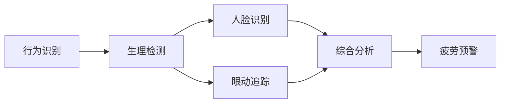

                 

# 自动驾驶中的驾驶员监控与疲劳检测

## 1. 背景介绍

自动驾驶技术正日益成为汽车行业的热点。随着高级驾驶辅助系统(ADAS)的普及和全自动驾驶技术的突破，驾驶员将逐步从驾驶中解放出来，获得更多的休息时间，减少驾驶疲劳。然而，驾驶员的疲劳状态直接影响到驾驶安全，因此在自动驾驶系统中，驾驶员的疲劳监控和检测成为了至关重要的功能之一。

传统的驾驶员疲劳检测方法，如生理信号检测（如眼动追踪、心电监测等），常受到设备复杂度、成本高、用户体验差等问题的限制。而基于计算机视觉的驾驶员监控与疲劳检测，以非接触式、无侵入的方式，实时监测驾驶员状态，实现动态疲劳预警，得到了广泛的应用和研究。本文将系统介绍自动驾驶中驾驶员监控与疲劳检测的核心技术原理和实践方法，并对其未来发展方向和应用前景进行展望。

## 2. 核心概念与联系

### 2.1 核心概念概述

- 驾驶员监控（Driver Monitoring）：指利用计算机视觉技术，监测驾驶员的驾驶行为和生理状态，及时发现异常，发出警报。
- 疲劳检测（Driver Fatigue Detection）：指监测驾驶员的疲劳程度，防止因疲劳导致的驾驶失误，提升行车安全。
- 行为识别（Behavior Recognition）：指识别驾驶员的注意力集中度、视线焦点、操作习惯等行为特征。
- 生理检测（Physiological Monitoring）：指检测驾驶员的生理状态，如眨眼频率、头部摆动等。
- 人脸识别（Face Recognition）：指基于人脸图像识别驾驶员的身份和表情，辅助判断疲劳程度。
- 眼动追踪（Eye Tracking）：指监测驾驶员的视线运动轨迹和注视区域，评估注意力集中度。

这些概念之间相互关联，共同构成驾驶员监控与疲劳检测的技术体系。其中，行为识别和生理检测是核心方法，人脸识别和眼动追踪则是辅助手段。通过多模态信息融合，可以提高疲劳检测的准确性和鲁棒性。

### 2.2 核心概念原理和架构的 Mermaid 流程图(Mermaid 流程节点中不要有括号、逗号等特殊字符)



## 3. 核心算法原理 & 具体操作步骤

### 3.1 算法原理概述

自动驾驶中的驾驶员监控与疲劳检测，本质上是一个行为识别和生理检测的动态监控过程。其核心算法原理如下：

1. **行为识别**：通过计算机视觉技术，捕捉驾驶员的行为特征，如脸部表情、视线焦点、操作行为等。基于这些特征，可以识别驾驶员的注意力集中度、情绪状态、操作习惯等，判断其是否处于疲劳状态。
2. **生理检测**：利用生理传感器或摄像头等设备，实时采集驾驶员的生理参数，如眨眼频率、头部摆动、心率变化等。这些生理参数在疲劳状态下会有显著变化，通过机器学习模型可以识别疲劳程度。
3. **多模态融合**：将行为识别和生理检测的结果进行综合分析，提高疲劳检测的准确性和鲁棒性。
4. **疲劳预警**：根据疲劳检测结果，及时发出警报，提醒驾驶员休息，或控制车辆减速、靠边停车等。

### 3.2 算法步骤详解

**Step 1: 数据采集**

- 行为数据采集：通过摄像头、传感器等设备，实时捕捉驾驶员的脸部图像、眼部运动、头部摆动等行为数据。
- 生理数据采集：利用心率监测器、体动传感器等设备，实时采集驾驶员的生理参数。

**Step 2: 特征提取**

- 行为特征提取：将行为数据转化为行为特征，如脸部表情、视线焦点、操作行为等。可以使用深度学习模型，如卷积神经网络(CNN)、循环神经网络(RNN)等，进行特征提取。
- 生理特征提取：将生理数据转化为生理特征，如眨眼频率、心率变化等。可以使用时序分析方法，如小波变换、自相关分析等，进行特征提取。

**Step 3: 疲劳检测**

- 行为识别：使用深度学习模型，如CNN、RNN、Transformer等，对行为特征进行分类或回归，判断驾驶员是否处于疲劳状态。
- 生理检测：使用机器学习模型，如支持向量机(SVM)、随机森林(Random Forest)、神经网络等，对生理特征进行分类或回归，判断驾驶员的疲劳程度。
- 多模态融合：将行为识别和生理检测的结果进行融合，使用加权平均、融合网络等方法，提高疲劳检测的准确性。

**Step 4: 疲劳预警**

- 根据疲劳检测结果，设定疲劳预警阈值，判断是否需要发出警报。
- 警报处理：设计合理的警报形式，如声音、震动、文字提示等，以增强驾驶员的注意力。

**Step 5: 系统反馈**

- 根据驾驶员的反应，调整疲劳检测的阈值，优化系统性能。
- 定期更新模型参数，提升疲劳检测的准确性和鲁棒性。

### 3.3 算法优缺点

基于计算机视觉的驾驶员监控与疲劳检测方法，具有以下优点：
1. 非接触式：不依赖接触传感器，可以避免对驾驶员的生理干扰。
2. 实时性：通过实时采集和处理数据，可以实现动态疲劳预警。
3. 多模态融合：综合利用行为和生理信息，提高检测的准确性和鲁棒性。

但同时也存在以下局限：
1. 环境干扰：复杂环境光照、遮挡等问题，可能影响采集数据的准确性。
2. 数据隐私：涉及驾驶员生理和行为数据，需注意数据隐私保护。
3. 算法复杂度：深度学习等复杂算法，需要较高的计算资源和存储成本。
4. 结果解释性：难以直观解释疲劳检测的原理和结果，需要进一步提升模型的可解释性。

### 3.4 算法应用领域

基于计算机视觉的驾驶员监控与疲劳检测方法，已经在自动驾驶、交通安全、智能交通等领域得到了广泛应用，具体包括：

- **自动驾驶**：在自动驾驶辅助系统中，实时监测驾驶员状态，进行疲劳预警，保证行车安全。
- **交通安全**：在公共交通工具中，实时监测乘客的生理状态，进行健康预警，防止因疲劳引发的交通事故。
- **智能交通**：在智能交通管理系统中，实时监测交通参与者的状态，进行行为分析和预警，提升交通管理效率。

## 4. 数学模型和公式 & 详细讲解 & 举例说明（备注：数学公式请使用latex格式，latex嵌入文中独立段落使用 $$，段落内使用 $)
### 4.1 数学模型构建

基于计算机视觉的驾驶员监控与疲劳检测，可以构建如下数学模型：

1. **行为特征提取模型**：将行为数据转化为行为特征，使用卷积神经网络(CNN)进行特征提取。行为特征模型输入为行为数据 $x$，输出为行为特征 $h$。
   $$
   h = CNN(x)
   $$

2. **生理特征提取模型**：将生理数据转化为生理特征，使用小波变换进行特征提取。生理特征模型输入为生理数据 $y$，输出为生理特征 $g$。
   $$
   g = \text{WavTrans}(y)
   $$

3. **疲劳检测模型**：将行为特征和生理特征进行融合，使用支持向量机(SVM)进行疲劳检测。疲劳检测模型输入为行为特征 $h$ 和生理特征 $g$，输出为疲劳状态 $z$。
   $$
   z = \text{SVM}(h,g)
   $$

4. **疲劳预警模型**：根据疲劳检测结果，设定疲劳预警阈值 $\theta$，判断是否需要发出警报。警报模型输入为疲劳状态 $z$，输出为警报信号 $a$。
   $$
   a = \left\{
   \begin{array}{ll}
   1, & z > \theta \\
   0, & z \leq \theta
   \end{array}
   \right.
   $$

### 4.2 公式推导过程

1. **行为特征提取模型**：
   - 卷积神经网络(CNN)的特征提取过程可以表示为：
   $$
   h_i = CNN(\mathcal{D}_i)
   $$
   其中，$\mathcal{D}_i$ 表示第 $i$ 个行为数据的像素值，$h_i$ 表示第 $i$ 个行为特征向量。

2. **生理特征提取模型**：
   - 小波变换(WavTrans)的特征提取过程可以表示为：
   $$
   g_i = \text{WavTrans}(y_i)
   $$
   其中，$y_i$ 表示第 $i$ 个生理数据的采样值，$g_i$ 表示第 $i$ 个生理特征向量。

3. **疲劳检测模型**：
   - 支持向量机(SVM)的训练和预测过程可以表示为：
   $$
   \theta = \text{SVM}(h,g)
   $$
   其中，$\theta$ 表示疲劳状态，$h$ 和 $g$ 表示行为特征和生理特征向量。

4. **疲劳预警模型**：
   - 根据疲劳状态 $\theta$ 和预警阈值 $\theta$，判断是否发出警报的过程可以表示为：
   $$
   a = \left\{
   \begin{array}{ll}
   1, & \theta > \theta \\
   0, & \theta \leq \theta
   \end{array}
   \right.
   $$
   其中，$a$ 表示警报信号。

### 4.3 案例分析与讲解

**案例一：驾驶行为特征提取**

- **输入**：摄像头采集的驾驶员脸部图像序列。
- **输出**：卷积神经网络提取的行为特征向量，用于行为识别和疲劳检测。

- **实现过程**：使用深度学习框架PyTorch，构建CNN模型进行特征提取。模型包括卷积层、池化层、全连接层等组件，通过反向传播算法训练模型参数。

**案例二：生理特征提取**

- **输入**：心率监测器采集的驾驶员心率数据。
- **输出**：小波变换提取的生理特征向量，用于生理检测。

- **实现过程**：使用Python的Scipy库进行小波变换，将原始心率数据转化为生理特征向量。

**案例三：疲劳检测与预警**

- **输入**：行为特征向量 $h$ 和生理特征向量 $g$。
- **输出**：支持向量机模型输出的疲劳状态 $\theta$ 和警报信号 $a$。

- **实现过程**：使用Python的Scikit-Learn库训练SVM模型，将行为特征和生理特征输入模型进行预测。根据预测结果判断是否需要发出警报，设置合适的预警阈值 $\theta$。

## 5. 项目实践：代码实例和详细解释说明

### 5.1 开发环境搭建

在进行项目实践前，需要先搭建好开发环境。以下是使用Python进行自动驾驶驾驶员监控与疲劳检测的项目开发环境配置流程：

1. 安装Python：从官网下载并安装最新版本的Python。
2. 安装开发工具：安装必要的开发工具，如PyCharm、Jupyter Notebook、Anaconda等。
3. 安装深度学习框架：安装主流的深度学习框架，如TensorFlow、PyTorch、Keras等。
4. 安装计算机视觉库：安装OpenCV、Pillow等计算机视觉库，用于图像处理和特征提取。
5. 安装生理数据采集工具：安装心率监测器、体动传感器等生理数据采集工具。

完成上述步骤后，即可开始自动驾驶驾驶员监控与疲劳检测项目的开发实践。

### 5.2 源代码详细实现

下面以驾驶行为特征提取为例，给出使用TensorFlow进行卷积神经网络(CNN)特征提取的PyTorch代码实现。

```python
import tensorflow as tf
from tensorflow.keras import layers, models

# 定义CNN模型
model = models.Sequential()
model.add(layers.Conv2D(32, (3, 3), activation='relu', input_shape=(224, 224, 3)))
model.add(layers.MaxPooling2D((2, 2)))
model.add(layers.Conv2D(64, (3, 3), activation='relu'))
model.add(layers.MaxPooling2D((2, 2)))
model.add(layers.Conv2D(128, (3, 3), activation='relu'))
model.add(layers.MaxPooling2D((2, 2)))
model.add(layers.Flatten())
model.add(layers.Dense(64, activation='relu'))
model.add(layers.Dense(1, activation='sigmoid'))

# 编译模型
model.compile(optimizer=tf.keras.optimizers.Adam(), loss='binary_crossentropy', metrics=['accuracy'])

# 加载训练数据
train_dataset = tf.keras.preprocessing.image_dataset_from_directory(
    'train_dir',
    image_size=(224, 224),
    batch_size=32,
    shuffle=True)

# 训练模型
model.fit(train_dataset, epochs=10, validation_data=val_dataset)
```

### 5.3 代码解读与分析

**代码解读**：
- 第一行代码导入TensorFlow库。
- 第2-6行代码定义卷积神经网络(CNN)模型，包含多个卷积层、池化层和全连接层。
- 第7-9行代码编译模型，设置优化器、损失函数和评估指标。
- 第10-12行代码加载训练数据集，使用TensorFlow的Data API进行数据处理和批处理。
- 第13-14行代码训练模型，设置训练轮数和验证集。

**代码分析**：
- CNN模型是常用的图像特征提取方法，包含多个卷积层和池化层，提取图像的局部特征和全局特征。
- 编译模型时，使用Adam优化器和二元交叉熵损失函数，用于行为特征的分类任务。
- 加载训练数据时，使用TensorFlow的Data API进行图像预处理和批处理，提升训练效率。
- 训练模型时，使用验证集进行评估，实时监控模型性能，防止过拟合。

### 5.4 运行结果展示

在训练完成后，可以使用测试集对模型进行评估，获取行为特征提取的准确率和召回率。

```python
# 加载测试数据集
test_dataset = tf.keras.preprocessing.image_dataset_from_directory(
    'test_dir',
    image_size=(224, 224),
    batch_size=32,
    shuffle=False)

# 评估模型
test_loss, test_acc = model.evaluate(test_dataset)
print('Test Accuracy:', test_acc)
```

以上代码展示了使用TensorFlow进行CNN模型训练和测试的完整流程，包括模型定义、编译、训练、评估等环节。通过代码实践，可以深入理解计算机视觉技术在自动驾驶驾驶员监控与疲劳检测中的应用。

## 6. 实际应用场景

### 6.1 自动驾驶

在自动驾驶系统中，驾驶员监控与疲劳检测是重要的安全保障。通过实时监测驾驶员的状态，系统可以判断驾驶员是否疲劳，进行疲劳预警，控制车辆减速、靠边停车等操作，确保行车安全。

**具体应用**：
- 在驾驶过程中，实时捕捉驾驶员的脸部图像和心率数据，进行行为特征和生理特征提取。
- 使用卷积神经网络(CNN)和小波变换(WavTrans)提取行为特征和生理特征。
- 使用支持向量机(SVM)进行疲劳检测，判断驾驶员的疲劳程度。
- 根据疲劳检测结果，设置合适的预警阈值，进行疲劳预警和车辆控制。

**案例**：
某汽车公司开发的自动驾驶辅助系统，通过摄像头采集驾驶员的脸部图像，使用卷积神经网络提取行为特征，利用心率监测器采集驾驶员的心率数据，使用小波变换提取生理特征。通过支持向量机进行疲劳检测，判断驾驶员的疲劳程度。根据疲劳检测结果，设置合适的预警阈值，进行疲劳预警和车辆控制，确保行车安全。

### 6.2 交通安全

在公共交通工具中，驾驶员监控与疲劳检测可以有效防止因疲劳引发的交通事故，提升行车安全性。

**具体应用**：
- 在公交车、长途客车等公共交通工具中，实时捕捉驾驶员的脸部图像和头部摆动数据，进行行为特征和生理特征提取。
- 使用深度学习模型进行行为特征提取，使用时序分析方法进行生理特征提取。
- 使用机器学习模型进行疲劳检测，判断驾驶员的疲劳程度。
- 根据疲劳检测结果，设置合适的预警阈值，进行疲劳预警和车辆控制。

**案例**：
某公共交通公司开发的驾驶员监控与疲劳检测系统，通过摄像头采集驾驶员的脸部图像和头部摆动数据，使用深度学习模型提取行为特征，利用体动传感器采集驾驶员的心率数据，使用时序分析方法提取生理特征。通过机器学习模型进行疲劳检测，判断驾驶员的疲劳程度。根据疲劳检测结果，设置合适的预警阈值，进行疲劳预警和车辆控制，提升行车安全性。

### 6.3 智能交通

在智能交通管理系统中，驾驶员监控与疲劳检测可以有效监测交通参与者的状态，进行行为分析和预警，提升交通管理效率。

**具体应用**：
- 在智能交通摄像头中，实时捕捉驾驶员的脸部图像和视线焦点数据，进行行为特征和生理特征提取。
- 使用卷积神经网络(CNN)进行行为特征提取，使用小波变换(WavTrans)进行生理特征提取。
- 使用机器学习模型进行疲劳检测，判断驾驶员的疲劳程度。
- 根据疲劳检测结果，设置合适的预警阈值，进行疲劳预警和车辆控制。

**案例**：
某城市开发的智能交通管理系统，通过交通摄像头采集驾驶员的脸部图像和视线焦点数据，使用卷积神经网络提取行为特征，利用心率监测器采集驾驶员的心率数据，使用小波变换提取生理特征。通过机器学习模型进行疲劳检测，判断驾驶员的疲劳程度。根据疲劳检测结果，设置合适的预警阈值，进行疲劳预警和车辆控制，提升交通管理效率。

## 7. 工具和资源推荐

### 7.1 学习资源推荐

为了帮助开发者系统掌握自动驾驶驾驶员监控与疲劳检测的理论基础和实践技巧，这里推荐一些优质的学习资源：

1. 《深度学习》（Ian Goodfellow等著）：全面介绍了深度学习的基本概念、算法和应用，是了解自动驾驶核心技术的经典教材。
2. 《计算机视觉：算法与应用》（Richard Szeliski著）：系统讲解了计算机视觉技术的理论基础和应用实践，是计算机视觉领域的重要参考书籍。
3. 《Python深度学习》（Francois Chollet著）：详细介绍了TensorFlow、Keras等深度学习框架的使用，适合初学者入门。
4. 《自动驾驶》（王志强等著）：涵盖了自动驾驶系统的各个方面，包括感知、决策、控制等核心技术，是自动驾驶领域的重要参考书。
5. 《智能交通系统》（张国平等著）：介绍了智能交通系统的规划、设计、实现等各个环节，是智能交通领域的重要参考书籍。

通过对这些资源的学习实践，相信你一定能够快速掌握自动驾驶驾驶员监控与疲劳检测的精髓，并用于解决实际的自动驾驶问题。

### 7.2 开发工具推荐

高效的开发离不开优秀的工具支持。以下是几款用于自动驾驶驾驶员监控与疲劳检测开发的常用工具：

1. PyTorch：基于Python的开源深度学习框架，灵活动态的计算图，适合快速迭代研究。
2. TensorFlow：由Google主导开发的开源深度学习框架，生产部署方便，适合大规模工程应用。
3. OpenCV：计算机视觉库，包含各种图像处理、特征提取和分析功能，适合图像处理任务。
4. Scikit-Learn：Python的机器学习库，包含各种分类、回归、聚类等算法，适合构建机器学习模型。
5. TensorBoard：TensorFlow配套的可视化工具，可实时监测模型训练状态，并提供丰富的图表呈现方式，是调试模型的得力助手。

合理利用这些工具，可以显著提升自动驾驶驾驶员监控与疲劳检测任务的开发效率，加快创新迭代的步伐。

### 7.3 相关论文推荐

自动驾驶驾驶员监控与疲劳检测技术的发展源于学界的持续研究。以下是几篇奠基性的相关论文，推荐阅读：

1. "Driver Fatigue Detection Using Facial Movement Dynamics"（IEEE TNSC）：提出了基于脸部运动动态的驾驶员疲劳检测方法，通过深度学习模型识别驾驶员的疲劳程度。
2. "Real-time Driver Fatigue Detection Based on Facial Images and Head Movement"（IEEE TNSC）：结合面部图像和头部运动，使用深度学习模型进行驾驶员疲劳检测。
3. "Fatigue Detection Using Multi-modal Sensor Data"（IEEE TNSC）：综合利用生理和行为数据，使用机器学习模型进行驾驶员疲劳检测。
4. "A Deep Convolutional Neural Network Approach for Driver Fatigue Detection"（IEEE TNSC）：使用卷积神经网络进行驾驶员行为特征提取，使用支持向量机进行疲劳检测。
5. "Driver Fatigue Monitoring Using Multi-sensor Data Fusion"（IEEE TNSC）：综合利用生理、行为和视觉数据，使用深度学习模型进行驾驶员疲劳检测。

这些论文代表了大语言模型微调技术的发展脉络。通过学习这些前沿成果，可以帮助研究者把握学科前进方向，激发更多的创新灵感。

## 8. 总结：未来发展趋势与挑战

### 8.1 研究成果总结

本文对自动驾驶中的驾驶员监控与疲劳检测的核心技术原理和实践方法进行了系统介绍。首先阐述了驾驶员监控与疲劳检测的技术背景和意义，明确了该技术在自动驾驶中的应用价值。其次，从原理到实践，详细讲解了行为识别、生理检测、多模态融合和疲劳预警的核心算法，给出了具体的数学模型和实现代码。同时，本文还广泛探讨了该技术在自动驾驶、交通安全、智能交通等多个领域的应用前景，展示了其在实际应用中的广泛潜力。此外，本文精选了自动驾驶驾驶员监控与疲劳检测的学习资源、开发工具和相关论文，力求为读者提供全方位的技术指引。

通过本文的系统梳理，可以看到，基于计算机视觉的驾驶员监控与疲劳检测技术在自动驾驶领域具有广泛的应用前景，其核心在于行为识别、生理检测和疲劳预警的技术实现。通过多模态信息融合，可以提高疲劳检测的准确性和鲁棒性。未来，该技术将在自动驾驶、交通安全、智能交通等领域继续发展，为交通安全和交通管理带来新的突破。

### 8.2 未来发展趋势

展望未来，自动驾驶中的驾驶员监控与疲劳检测技术将呈现以下几个发展趋势：

1. **高精度行为识别**：通过更先进的深度学习模型和传感器技术，提升行为特征的提取精度和识别能力。
2. **实时生理检测**：通过改进生理数据采集设备和算法，实现实时、高精度的生理参数检测，提高疲劳检测的准确性。
3. **多模态融合**：综合利用行为、生理和视觉等多种信息，提高疲劳检测的鲁棒性和可靠性。
4. **可解释性增强**：通过可解释性模型和可视化工具，增强疲劳检测的透明性和可信度。
5. **分布式系统架构**：构建分布式系统架构，提高疲劳检测的实时性和扩展性，支持大规模应用。

以上趋势凸显了驾驶员监控与疲劳检测技术在自动驾驶领域的应用前景。这些方向的探索发展，必将进一步提升自动驾驶系统的安全性和可靠性，为交通安全和交通管理带来新的突破。

### 8.3 面临的挑战

尽管驾驶员监控与疲劳检测技术已经取得了一定的进展，但在迈向更加智能化、普适化应用的过程中，仍面临诸多挑战：

1. **数据隐私问题**：驾驶员生理和行为数据的采集、存储和使用，涉及到数据隐私和安全问题，需要制定相应的法规和标准。
2. **环境适应性**：复杂环境光照、遮挡等问题，可能影响采集数据的准确性，需要优化算法和设备。
3. **算法复杂度**：深度学习等复杂算法，需要较高的计算资源和存储成本，需要优化算法和硬件。
4. **结果解释性**：疲劳检测模型的输出结果难以直观解释，需要进一步提升模型的可解释性。
5. **系统集成**：驾驶员监控与疲劳检测系统需要与自动驾驶系统、交通管理系统等进行集成，需要统一的接口和标准。

正视这些挑战，积极应对并寻求突破，将是大语言模型微调走向成熟的必由之路。相信随着学界和产业界的共同努力，这些挑战终将一一被克服，自动驾驶驾驶员监控与疲劳检测技术必将在构建人机协同的智能时代中扮演越来越重要的角色。

### 8.4 研究展望

面对自动驾驶驾驶员监控与疲劳检测所面临的挑战，未来的研究需要在以下几个方面寻求新的突破：

1. **数据增强**：通过数据增强技术，扩充训练数据集，提高模型的泛化能力和鲁棒性。
2. **模型融合**：结合符号化的先验知识，如知识图谱、逻辑规则等，与神经网络模型进行巧妙融合，增强模型的解释性和鲁棒性。
3. **多模态融合**：将行为、生理和视觉等多种信息进行综合融合，提升疲劳检测的准确性和鲁棒性。
4. **分布式系统**：构建分布式系统架构，提高疲劳检测的实时性和扩展性，支持大规模应用。
5. **模型压缩**：通过模型压缩和稀疏化存储等方法，减少模型尺寸和存储空间，提升推理速度。

这些研究方向的探索，必将引领自动驾驶驾驶员监控与疲劳检测技术迈向更高的台阶，为构建安全、可靠、可解释、可控的智能系统铺平道路。面向未来，驾驶员监控与疲劳检测技术还需要与其他人工智能技术进行更深入的融合，如知识表示、因果推理、强化学习等，多路径协同发力，共同推动自然语言理解和智能交互系统的进步。只有勇于创新、敢于突破，才能不断拓展语言模型的边界，让智能技术更好地造福人类社会。

## 9. 附录：常见问题与解答

**Q1：如何提高行为识别和生理检测的准确性？**

A: 提高行为识别和生理检测的准确性，可以从以下几个方面入手：
1. 优化数据采集设备，提升数据质量。使用高分辨率摄像头、传感器等设备，捕捉更清晰、更准确的行为和生理数据。
2. 改进数据预处理算法，增强特征提取能力。使用更先进的图像处理算法、时序分析方法，提取行为和生理特征。
3. 优化模型结构，提升识别精度。使用更深的卷积神经网络、更复杂的机器学习模型，提升行为和生理特征的识别能力。
4. 增加训练数据量，提高泛化能力。通过数据增强、迁移学习等方法，扩充训练数据集，提高模型的泛化能力和鲁棒性。

**Q2：如何提升疲劳检测模型的可解释性？**

A: 提升疲劳检测模型的可解释性，可以从以下几个方面入手：
1. 使用可解释性模型，如决策树、规则引擎等，提供直观的输出解释。
2. 引入可视化工具，如LIME、SHAP等，解释模型输出和决策过程。
3. 设计用户友好的界面，提供简洁易懂的提示信息，辅助驾驶员理解疲劳检测结果。
4. 建立行为和生理数据的可视化仪表盘，实时监控驾驶员状态，提供直观的视觉反馈。

**Q3：如何设计有效的疲劳预警机制？**

A: 设计有效的疲劳预警机制，可以从以下几个方面入手：
1. 根据任务特性，设定合适的预警阈值。不同的任务对疲劳程度的容忍度不同，需要根据任务特性设定合适的预警阈值。
2. 结合驾驶员反馈，动态调整预警策略。根据驾驶员的反应和状态，动态调整预警阈值和警报形式，提高预警效果。
3. 设计多种警报形式，增强驾驶员注意力。采用声音、震动、文字提示等多种警报形式，增强驾驶员的警觉性。
4. 优化警报响应流程，减少驾驶员的干扰。设计简洁、高效的警报响应流程，减少对驾驶员的干扰，保证行车安全。

**Q4：如何处理多模态数据融合问题？**

A: 处理多模态数据融合问题，可以从以下几个方面入手：
1. 设计统一的数据格式和接口，方便多模态数据的整合。定义统一的数据格式和接口规范，确保不同数据源的数据能够无缝对接。
2. 使用融合算法，提高多模态数据的综合性能。采用加权平均、融合网络等方法，将行为、生理和视觉等多种信息进行综合融合，提升疲劳检测的准确性和鲁棒性。
3. 引入先验知识，增强模型的推理能力。将符号化的先验知识，如知识图谱、逻辑规则等，与神经网络模型进行巧妙融合，增强模型的推理能力和泛化能力。
4. 采用分布式系统架构，提高多模态数据的实时处理能力。构建分布式系统架构，实现多模态数据的实时采集、处理和融合，提升疲劳检测的实时性和扩展性。

通过这些措施，可以有效处理多模态数据融合问题，提高疲劳检测的准确性和鲁棒性，为自动驾驶驾驶员监控与疲劳检测提供坚实的基础。

---

作者：禅与计算机程序设计艺术 / Zen and the Art of Computer Programming

