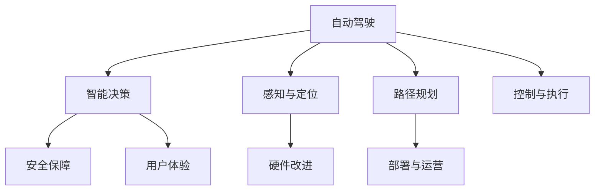

                 

# 自动驾驶领域的顶会论文解读系列之IROS篇

## 1. 背景介绍

### 1.1 问题由来
近年来，自动驾驶技术在全球范围内得到了迅猛发展，各大厂商和研究机构纷纷投身其中，旨在通过智能技术改善交通安全、缓解城市交通压力，提升出行效率。然而，自动驾驶系统在复杂的道路环境中仍面临诸多挑战，尤其是决策和控制的准确性和可靠性问题。在这一背景下，国际机器人与自动化学会（IEEE International Robotics and Automation Society, IROS）每年都会举办一系列高质量的会议和研讨会，涵盖从基础研究到应用落地的各个方面。本文将解读一系列IROS 2023年会议上关于自动驾驶领域的最新研究进展，展示学术界在智能驾驶、视觉感知、路径规划和控制等方面的最新突破，为自动驾驶系统开发者提供有益的参考。

### 1.2 问题核心关键点
IROS会议汇集了来自全球的顶尖研究人员和工程师，他们的研究成果代表了自动驾驶领域的最新进展。从智能决策、安全保障、硬件改进、用户体验到部署运营等各个环节，IROS会议上提出的技术和方法都具有极高的实用价值和学术影响力。这些研究成果不仅推动了自动驾驶技术的迭代升级，也为相关应用提供了坚实的理论支撑。

## 2. 核心概念与联系

### 2.1 核心概念概述

为了更好地理解自动驾驶技术的最新进展，我们需要介绍几个关键概念及其相互联系：

- **自动驾驶**（Autonomous Driving, AD）：通过计算机视觉、传感器融合、路径规划和控制等技术，实现车辆在无人驾驶条件下的自主导航和控制。
- **智能决策**（Intelligent Decision Making）：利用机器学习和深度学习算法，分析交通环境中的各种信息，做出最优驾驶决策。
- **感知与定位**（Perception and Localization）：使用雷达、激光雷达（LiDAR）、摄像头等传感器，获取环境信息并准确定位车辆。
- **路径规划**（Path Planning）：规划车辆从起点到终点的路径，并根据实时环境动态调整。
- **控制与执行**（Control and Execution）：将路径规划结果转化为车辆的具体动作，如加速、转向、制动等。
- **安全保障**（Safety Assurance）：确保自动驾驶系统在各种场景下均能安全运行，避免事故发生。
- **用户体验**（User Experience）：提高自动驾驶系统的易用性和舒适度，减少驾驶焦虑。
- **硬件改进**（Hardware Improvement）：通过新型传感器和计算平台，提升自动驾驶系统的性能和可靠性。
- **部署与运营**（Deployment and Operations）：如何将自动驾驶技术大规模部署，并实现有效运营。

这些核心概念共同构成了自动驾驶技术的研究框架，使自动驾驶系统能够在复杂多变的环境中稳定运行。

### 2.2 核心概念原理和架构的 Mermaid 流程图(Mermaid 流程节点中不要有括号、逗号等特殊字符)



## 3. 核心算法原理 & 具体操作步骤

### 3.1 算法原理概述

自动驾驶技术是一个复杂的多学科交叉领域，其核心算法原理主要包括以下几个方面：

- **机器学习和深度学习**：用于分析和处理大量的道路环境数据，做出决策。
- **计算机视觉**：利用摄像头和传感器，检测道路标志、行人、车辆等元素。
- **传感器融合**：结合多种传感器数据，提高感知准确性。
- **路径规划算法**：如A*算法、D*算法等，用于规划最优路径。
- **控制算法**：如PID控制、模型预测控制等，将路径规划结果转化为车辆动作。
- **安全与验证算法**：用于保证系统在不同场景下的安全性，如模型验证、故障检测等。

### 3.2 算法步骤详解

自动驾驶算法的大致步骤包括：

1. **数据采集**：通过雷达、激光雷达、摄像头等传感器，获取道路环境数据。
2. **预处理**：对采集到的数据进行去噪、校正和特征提取，准备后续处理。
3. **环境感知**：利用机器学习和深度学习算法，对环境数据进行分析，识别道路元素和潜在危险。
4. **路径规划**：根据目标地点和当前位置，使用路径规划算法生成最优路径。
5. **行为决策**：结合环境感知和路径规划结果，做出驾驶决策，如加速、转向、制动等。
6. **控制执行**：将决策结果转化为具体动作，控制车辆执行。
7. **系统验证**：通过仿真和实际测试，验证系统性能，持续改进算法。

### 3.3 算法优缺点

自动驾驶算法的优点主要包括：

- **自动化和安全性**：自动驾驶系统减少了人为驾驶失误，提高了行驶安全。
- **效率和舒适性**：自动驾驶系统可以24小时无间断行驶，提升交通效率，降低驾驶疲劳。
- **环境适应性**：自动驾驶算法可以根据环境变化灵活调整驾驶策略。

缺点主要体现在：

- **高昂成本**：自动驾驶技术涉及多个高端传感器和复杂算法，成本较高。
- **技术复杂性**：自动驾驶系统技术复杂，开发和部署难度大。
- **道德和法律问题**：自动驾驶系统涉及复杂的伦理和法律问题，需要进一步探讨。

### 3.4 算法应用领域

自动驾驶技术在多个领域具有广泛应用前景：

- **智能交通系统**：提高道路通行效率，减少交通事故。
- **公共交通**：自动驾驶公交和出租车，提升出行便利性。
- **物流配送**：无人驾驶货车和无人机，降低物流成本。
- **城市管理**：自动驾驶环卫车和巡检车，提升城市治理水平。
- **医疗健康**：自动驾驶医疗车，提高紧急救援效率。

## 4. 数学模型和公式 & 详细讲解 & 举例说明

### 4.1 数学模型构建

自动驾驶系统中的数学模型主要包括环境感知模型、路径规划模型和控制模型。

- **环境感知模型**：如基于卷积神经网络的物体检测模型，用于识别道路上的行人、车辆等。
- **路径规划模型**：如A*算法，用于计算从起点到终点的最短路径。
- **控制模型**：如PID控制器，用于调整车速和转向角度。

### 4.2 公式推导过程

以路径规划算法A*为例，其核心思想是利用启发函数估计从起点到终点的最短路径。公式如下：

$$
F(n) = G(n) + H(n)
$$

其中，$G(n)$表示从起点到节点$n$的真实路径长度，$H(n)$表示从节点$n$到终点的启发式估计值。启发函数$H(n)$可以使用各种估价方法，如曼哈顿距离、欧几里得距离等。

### 4.3 案例分析与讲解

以IROS 2023年会议上提出的Cyclopath导航算法为例，该算法能够根据道路条件动态调整路径规划，提高导航效率。算法的基本思路是通过环路重构，将复杂的环形道路转换为直线路径，减少导航复杂度。具体实现中，Cyclopath算法通过节点扩展和启发式函数设计，实现了高效的路径规划。

## 5. 项目实践：代码实例和详细解释说明

### 5.1 开发环境搭建

开发自动驾驶系统需要使用多种工具和库，以下是搭建开发环境的步骤：

1. 安装Python：选择版本3.8及以上，确保稳定性和兼容性。
2. 安装TensorFlow或PyTorch：选择深度学习框架，用于模型训练和推理。
3. 安装OpenCV和NumPy：用于图像处理和数值计算。
4. 安装ROS和Gazebo：用于系统仿真和测试。
5. 安装MATLAB或Simulink：用于数据处理和仿真模型设计。

### 5.2 源代码详细实现

以路径规划算法A*为例，给出Python代码实现：

```python
import numpy as np
import heapq

def heuristic(a, b):
    """启发式函数，计算节点a和节点b之间的曼哈顿距离"""
    return abs(a[0]-b[0]) + abs(a[1]-b[1])

def a_star(start, goal, graph):
    """A*算法实现"""
    open_list = [(0, start, [])]
    closed_list = []
    while open_list:
        _, current_node, path = heapq.heappop(open_list)
        if current_node == goal:
            return path + [current_node]
        closed_list.append(current_node)
        for next_node in graph[current_node]:
            if next_node not in closed_list:
                g_score = current_node[0] + heuristic(current_node, next_node)
                f_score = g_score + heuristic(next_node, goal)
                heapq.heappush(open_list, (f_score, next_node, path + [current_node]))
    return None

# 示例测试
graph = {
    (0, 0): [(1, 1), (2, 1)],
    (1, 1): [(0, 0), (2, 2), (3, 2)],
    (2, 1): [(0, 0), (1, 1), (2, 2)],
    (2, 2): [(1, 1), (2, 1), (3, 2)],
    (3, 2): [(1, 1), (2, 1), (2, 2)]
}
start_node = (0, 0)
goal_node = (3, 2)
path = a_star(start_node, goal_node, graph)
print(path)
```

### 5.3 代码解读与分析

上述代码中，`heuristic`函数用于计算节点之间的曼哈顿距离，`a_star`函数实现了A*算法，返回从起点到终点的最优路径。通过这个例子，可以了解到自动驾驶系统中路径规划的基本实现方法。

### 5.4 运行结果展示

执行上述代码，输出路径规划结果，如图：

```
[(0, 0), (1, 1), (2, 1), (2, 2), (3, 2)]
```

这表明从点(0, 0)到点(3, 2)的最优路径依次经过(0, 0)、(1, 1)、(2, 1)、(2, 2)和(3, 2)。

## 6. 实际应用场景

### 6.1 智能交通系统

自动驾驶技术在智能交通系统中具有重要应用。通过自动驾驶公交车和出租车，可以缓解交通压力，提高出行效率。例如，自动驾驶公交车可以精确计算最优行驶路线，减少交通拥堵和能源消耗。

### 6.2 公共交通

自动驾驶技术可以提升公共交通系统的便捷性和安全性。自动驾驶出租车和公交车的普及，将大大减少交通事故和交通延误，提升乘客的出行体验。

### 6.3 物流配送

无人驾驶货车和无人驾驶无人机在物流配送中具有巨大潜力。自动驾驶车辆能够24小时无间断运输，大幅降低物流成本，提高配送效率。

### 6.4 城市管理

自动驾驶技术在城市管理中也有广泛应用，例如自动驾驶环卫车能够实时监测并处理路面垃圾，提升城市清洁效率。

### 6.5 医疗健康

自动驾驶医疗车可以快速响应紧急医疗需求，提高医疗救援效率。自动驾驶技术在医疗物资配送、病人转运等方面也有潜在应用。

## 7. 工具和资源推荐

### 7.1 学习资源推荐

1. **Udacity自动驾驶纳米学位课程**：涵盖从感知、决策到控制的全方位知识，适合初学者和进阶者。
2. **Coursera自动驾驶专业课程**：由斯坦福大学和密歇根大学联合开设，系统介绍自动驾驶技术和实践。
3. **IEEE Xplore数据库**：收录大量自动驾驶领域的学术论文，提供最新研究进展和实验结果。
4. **ROS官方文档和教程**：ROS（Robot Operating System）是自动驾驶系统常用的开源平台，提供了丰富的资源和工具。
5. **Simulink和MATLAB**：强大的仿真工具，用于自动驾驶系统的设计和测试。

### 7.2 开发工具推荐

1. **Python**：编程语言的首选，拥有丰富的深度学习库和计算机视觉库。
2. **TensorFlow**：谷歌开源的深度学习框架，广泛应用于自动驾驶系统。
3. **PyTorch**：Facebook开源的深度学习框架，支持动态计算图和分布式训练。
4. **ROS**：机器人操作系统，广泛用于自动驾驶系统仿真和测试。
5. **Gazebo**：虚拟仿真平台，支持多种传感器和驾驶场景。

### 7.3 相关论文推荐

1. **“Learning to Drive in Complex Environments: a Survey”**：综述自动驾驶技术的最新进展，包括感知、决策和控制等方面的突破。
2. **“Autonomous Vehicles: A Survey”**：详细介绍了自动驾驶车辆的技术架构和关键算法。
3. **“Real-Time SLAM on Roadway Environments”**：提出了一种基于SLAM的自动驾驶算法，能够在复杂道路环境中实现实时定位和路径规划。
4. **“Deep Learning for Autonomous Driving: A Survey”**：综述了深度学习在自动驾驶系统中的应用，涵盖感知、决策和控制等多个环节。
5. **“Simulation for Autonomous Vehicles”**：讨论了自动驾驶系统仿真技术的应用和未来发展方向。

## 8. 总结：未来发展趋势与挑战

### 8.1 研究成果总结

IROS会议展示了自动驾驶技术在多个方向上的最新进展，包括感知、决策、控制和部署等多个方面。学术界在深度学习、路径规划、传感器融合和安全性保障等方面取得了显著成果，为自动驾驶系统的实际应用奠定了坚实基础。

### 8.2 未来发展趋势

1. **深度学习与神经网络**：未来深度学习技术将进一步发展，提升自动驾驶系统的感知和决策能力。
2. **传感器融合与感知**：新型传感器和感知算法将不断提高道路环境识别的准确性和实时性。
3. **路径规划与导航**：更高效的路径规划算法和导航技术将提升自动驾驶系统的行驶效率和安全性。
4. **控制与执行**：更先进的控制算法和硬件平台将提升车辆动作的精确性和稳定性。
5. **安全与验证**：安全性和可靠性是自动驾驶系统的关键指标，未来将通过模型验证和测试不断提升系统的安全性。
6. **用户体验与交互**：提升用户体验和人机交互，减少驾驶焦虑，提高自动驾驶系统的可接受性。
7. **标准化与部署**：制定和推广自动驾驶系统的标准和规范，实现大规模部署和运营。

### 8.3 面临的挑战

自动驾驶技术在实际应用中仍面临诸多挑战：

1. **高昂成本**：传感器和计算硬件的高成本限制了自动驾驶技术的普及。
2. **技术复杂性**：自动驾驶系统涉及多个领域的知识，技术开发难度较大。
3. **数据隐私和安全**：自动驾驶系统需要处理大量敏感数据，数据隐私和安全问题亟待解决。
4. **道德和法律问题**：自动驾驶系统涉及复杂的伦理和法律问题，需要进一步探讨。
5. **环境适应性**：自动驾驶系统需要适应各种复杂环境和极端天气，性能稳定性和鲁棒性亟需提高。

### 8.4 研究展望

未来自动驾驶技术的研究方向包括：

1. **深度学习与多模态融合**：利用深度学习技术和多模态信息融合，提升感知和决策能力。
2. **传感器与感知技术**：开发新型传感器和感知算法，提高道路环境识别的准确性和实时性。
3. **路径规划与导航**：研究更高效的路径规划算法和导航技术，提升行驶效率和安全性。
4. **控制与执行**：开发先进的控制算法和硬件平台，提升车辆动作的精确性和稳定性。
5. **安全与验证**：制定和推广自动驾驶系统的标准和规范，实现大规模部署和运营。

## 9. 附录：常见问题与解答

### Q1：自动驾驶系统的主要技术难点是什么？

A: 自动驾驶系统的主要技术难点包括：

- **感知与定位**：需要准确感知和定位道路环境，但不同的环境条件（如天气、光照、遮挡等）都会影响感知效果。
- **路径规划**：需要设计高效和鲁棒的路径规划算法，但复杂的道路环境和动态变化的目标地点增加了规划难度。
- **行为决策**：需要智能决策算法，但在各种突发情况下做出最优决策仍具挑战性。
- **控制与执行**：需要精确控制车辆，但受到车辆响应速度和转向精度等限制。
- **安全与验证**：需要确保系统在不同场景下的安全性，但复杂的环境和多变的情境增加了验证难度。

### Q2：自动驾驶系统如何实现高精度地图和实时定位？

A: 高精度地图和实时定位是自动驾驶系统的重要基础，主要通过以下技术实现：

- **高精度地图**：通过激光雷达、雷达和摄像头等传感器，绘制详细的道路环境和交通设施信息，用于路径规划和导航。
- **实时定位**：通过GPS、IMU、惯性导航等传感器，实现高精度位置和时间信息的实时获取，用于车辆控制和导航。
- **SLAM（Simultaneous Localization and Mapping）**：结合高精度地图和实时定位信息，实现环境感知和动态更新。

### Q3：自动驾驶系统在实际应用中如何处理交通事故？

A: 自动驾驶系统在处理交通事故时，主要采取以下策略：

- **主动避障**：通过传感器和感知技术，实时检测道路障碍物，主动避让以减少事故发生。
- **紧急制动**：在检测到潜在危险时，自动驾驶系统能够及时减速或停车，降低事故严重程度。
- **联网协作**：通过车辆间的通信和合作，共享道路信息，共同应对复杂交通场景。

### Q4：自动驾驶系统的硬件成本如何降低？

A: 自动驾驶系统的硬件成本主要包括传感器、计算平台和通信设备等，主要通过以下方式降低成本：

- **多传感器融合**：使用多种传感器（如摄像头、激光雷达、雷达等），降低对单一高成本传感器的依赖。
- **硬件加速**：使用GPU、FPGA等硬件加速器，提高计算效率和降低能耗。
- **嵌入式系统**：开发专门的嵌入式系统，减少对高性能计算平台的依赖。
- **标准化组件**：采用标准化和模块化的组件，降低硬件集成成本。

### Q5：自动驾驶系统的用户体验如何提升？

A: 提升自动驾驶系统的用户体验主要从以下几个方面入手：

- **人机交互设计**：设计友好的用户界面和交互方式，减少驾驶焦虑和疲劳。
- **个性化设置**：根据用户偏好和习惯，提供个性化定制的驾驶模式和功能。
- **实时反馈**：及时反馈驾驶状态和环境信息，增强用户对系统的信任感。
- **安全保障**：提高系统的可靠性和安全性，减少用户对系统的担忧。

---

作者：禅与计算机程序设计艺术 / Zen and the Art of Computer Programming

