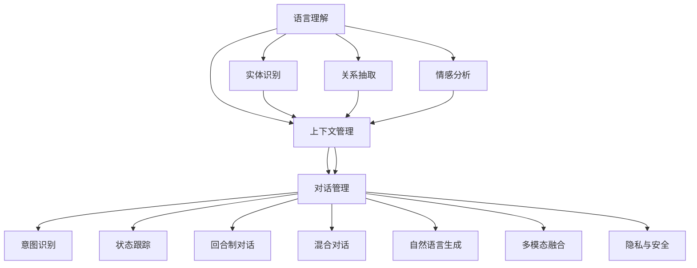

                 

# 自然语言交互在CUI中的深远优势

## 1. 背景介绍

### 1.1 问题由来
随着技术的不断进步，自然语言交互(Natural Language Interaction, NLI)在计算机用户界面(Computer User Interface, CUI)中的应用越来越广泛。无论是智能助手、语音识别，还是自动翻译、问答系统，自然语言交互都在提供更加自然、便捷的用户体验。然而，要实现高精度的自然语言交互，需要克服诸多技术难题。本论文将深入探讨自然语言交互在CUI中的深远优势，及其面临的挑战和未来发展方向。

### 1.2 问题核心关键点
自然语言交互的核心在于使计算机能够理解和响应用户的自然语言输入。其关键点包括：
1. 语言理解：计算机能够准确理解自然语言的语义，包括实体识别、关系抽取、情感分析等。
2. 对话管理：构建有效的对话流程，确保对话的连贯性和逻辑性。
3. 自然语言生成：计算机能够生成自然流畅的文本或语音输出，增强用户体验。
4. 跨模态融合：集成文本、语音、图像等多模态数据，提供更丰富的交互方式。
5. 隐私和安全：在自然语言交互中保护用户隐私，防止信息泄露和安全威胁。

### 1.3 问题研究意义
自然语言交互在CUI中的应用，具有深远的意义：

1. 提升用户体验：自然语言交互使得用户能够以更加自然、直接的方式与计算机交互，减少输入成本，提高互动效率。
2. 促进人机协同：通过自然语言交互，计算机可以更好地理解用户需求，提供个性化的服务，增强人机协同的智能水平。
3. 开拓新应用场景：自然语言交互技术可以应用于更多传统上难以自动化的场景，如客服、教育、医疗等，提升相关行业的自动化和智能化水平。
4. 推动行业发展：自然语言交互技术的进步将推动人工智能、计算机视觉、语音识别等多项技术的共同发展，带来全行业的突破性进步。
5. 激发创新思维：自然语言交互技术在不断改进中，推动了认知智能和通用人工智能(AI)的探索，激发新的研究思维和创新方向。

## 2. 核心概念与联系

### 2.1 核心概念概述

自然语言交互（NLI）是指计算机系统能够理解和响应用户的自然语言输入，与用户进行自然、流畅的对话，提供个性化的信息和服务。这一过程通常包括以下几个关键环节：

1. **语言理解（Language Understanding）**：
   - 通过NLP技术，计算机能够解析文本，理解其中的实体、关系、情感等信息。
   - 包括分词、词性标注、命名实体识别、依存句法分析、语义角色标注等步骤。

2. **对话管理（Dialogue Management）**：
   - 确保对话流程的连贯性和逻辑性，包括上下文管理、意图识别、状态跟踪等。
   - 包括回合制对话、混合对话等模型，以及任务导向对话和闲聊对话的区别。

3. **自然语言生成（Natural Language Generation, NLG）**：
   - 根据对话管理输出的结果，生成自然流畅的文本或语音输出。
   - 包括文本生成、语音合成、多模态输出等技术。

4. **跨模态融合（Cross-Modal Fusion）**：
   - 集成文本、语音、图像等多模态数据，提供更丰富的交互方式。
   - 包括多模态融合模型和表示学习技术。

5. **隐私与安全（Privacy and Security）**：
   - 在自然语言交互中保护用户隐私，防止信息泄露和安全威胁。
   - 包括差分隐私、联邦学习、隐私保护模型等技术。

以上核心概念共同构成了自然语言交互的完整框架，使其能够实现高效、自然、安全的用户交互。

### 2.2 核心概念原理和架构的 Mermaid 流程图

## 3. 核心算法原理 & 具体操作步骤
### 3.1 算法原理概述

自然语言交互的核心算法原理主要包括以下几个方面：

1. **语言理解模型**：
   - 通过神经网络模型（如RNN、LSTM、Transformer等），对输入文本进行分词、词性标注、实体识别、关系抽取等处理。
   - 采用注意力机制、上下文表示等技术，增强模型的语义理解能力。

2. **对话管理模型**：
   - 基于状态空间或树形结构的对话管理器，确保对话流程的连贯性和逻辑性。
   - 采用图神经网络、强化学习等技术，优化对话流程，提高系统响应速度。

3. **自然语言生成模型**：
   - 通过神经生成模型（如RNN、LSTM、Transformer等），生成自然流畅的文本或语音输出。
   - 采用变分自编码器、GPT等模型，增强文本生成的自然性和多样性。

4. **跨模态融合模型**：
   - 通过多模态融合技术（如联合嵌入、跨模态对比学习等），集成文本、语音、图像等多模态数据。
   - 采用多模态表示学习技术，提升模型的跨模态理解能力。

5. **隐私与安全模型**：
   - 通过差分隐私、联邦学习等技术，保护用户隐私，防止信息泄露。
   - 采用安全多方计算、同态加密等技术，确保系统安全性和可靠性。

### 3.2 算法步骤详解

自然语言交互的算法步骤通常包括以下几个关键步骤：

1. **输入处理**：
   - 对用户的自然语言输入进行预处理，包括分词、词性标注、命名实体识别等。
   - 采用分词工具（如Jieba、NLTK等）和命名实体识别模型（如BERT、CRF等）进行处理。

2. **意图识别**：
   - 通过意图分类模型（如逻辑回归、支持向量机、神经网络等），对用户输入的意图进行分类。
   - 采用监督学习或半监督学习技术，训练意图分类模型，提升意图识别的准确性。

3. **上下文理解**：
   - 通过上下文表示模型（如LSTM、Transformer等），捕捉对话的历史信息和上下文信息。
   - 采用注意力机制、上下文表示等技术，增强模型的语义理解能力。

4. **对话管理**：
   - 通过对话管理器（如基于规则的对话管理器、基于深度学习的对话管理器等），管理对话流程。
   - 采用图神经网络、强化学习等技术，优化对话流程，提高系统响应速度。

5. **输出生成**：
   - 通过自然语言生成模型（如RNN、LSTM、GPT等），生成自然流畅的文本或语音输出。
   - 采用变分自编码器、GPT等模型，增强文本生成的自然性和多样性。

6. **跨模态融合**：
   - 通过多模态融合技术（如联合嵌入、跨模态对比学习等），集成文本、语音、图像等多模态数据。
   - 采用多模态表示学习技术，提升模型的跨模态理解能力。

7. **隐私与安全处理**：
   - 通过差分隐私、联邦学习等技术，保护用户隐私，防止信息泄露。
   - 采用安全多方计算、同态加密等技术，确保系统安全性和可靠性。

### 3.3 算法优缺点

自然语言交互算法具有以下优点：

1. **用户友好**：自然语言交互使用户能够以更加自然、直接的方式与计算机交互，减少输入成本，提高互动效率。
2. **智能化程度高**：通过自然语言理解，计算机可以更好地理解用户需求，提供个性化的服务，增强人机协同的智能水平。
3. **应用范围广**：自然语言交互技术可以应用于更多传统上难以自动化的场景，如客服、教育、医疗等，提升相关行业的自动化和智能化水平。
4. **技术创新强**：自然语言交互技术在不断改进中，推动了认知智能和通用人工智能(AI)的探索，激发新的研究思维和创新方向。

自然语言交互算法也存在以下缺点：

1. **数据需求高**：自然语言交互算法需要大量的标注数据进行训练，标注数据收集和处理成本较高。
2. **模型复杂度高**：自然语言交互算法模型通常较复杂，计算资源和计算效率要求较高。
3. **隐私安全风险**：在自然语言交互中，用户隐私保护和信息安全问题需要引起高度重视。

### 3.4 算法应用领域

自然语言交互算法在以下领域具有广泛的应用前景：

1. **智能客服**：
   - 通过自然语言交互，智能客服系统能够自动理解客户咨询，提供快速、准确的解决方案，提升客户满意度。
   - 应用领域包括电商、金融、医疗等，提供7x24小时不间断服务。

2. **智能翻译**：
   - 通过自然语言交互，智能翻译系统能够自动理解用户的输入，将其翻译成目标语言，提供即时的翻译服务。
   - 应用领域包括在线教育、国际商务、旅游等，提升语言交流效率。

3. **智能问答**：
   - 通过自然语言交互，智能问答系统能够自动理解用户问题，提供精准、快速的答案。
   - 应用领域包括教育、医疗、客服等，提供精准的信息查询服务。

4. **智能导航**：
   - 通过自然语言交互，智能导航系统能够自动理解用户的指令，提供路径规划、路线推荐等服务。
   - 应用领域包括交通、旅游、物流等，提升出行效率和体验。

5. **智能推荐**：
   - 通过自然语言交互，智能推荐系统能够自动理解用户需求，提供个性化的商品、内容、服务等推荐。
   - 应用领域包括电商、媒体、视频等，提升用户体验和满意度。

## 4. 数学模型和公式 & 详细讲解 & 举例说明

### 4.1 数学模型构建

自然语言交互的数学模型通常包括以下几个部分：

1. **语言理解模型**：
   - 采用Transformer模型，对输入文本进行编码和解码，输出上下文表示。

2. **意图识别模型**：
   - 采用分类模型（如逻辑回归、支持向量机、神经网络等），对用户输入的意图进行分类。

3. **对话管理模型**：
   - 采用图神经网络或强化学习模型，对对话历史和上下文进行建模，输出对话策略。

4. **自然语言生成模型**：
   - 采用生成模型（如RNN、LSTM、GPT等），生成自然流畅的文本或语音输出。

5. **跨模态融合模型**：
   - 采用联合嵌入技术，对文本、语音、图像等多模态数据进行融合。

6. **隐私与安全模型**：
   - 采用差分隐私技术，对用户数据进行隐私保护。

### 4.2 公式推导过程

以下以Transformer模型为例，详细推导语言理解模型的数学公式。

Transformer模型采用注意力机制，对输入序列进行编码和解码，输出上下文表示。假设输入序列为 $x_1, x_2, ..., x_n$，其中 $x_i \in \mathbb{R}^d$，表示第 $i$ 个输入词的向量表示。

Transformer模型包括编码器和解码器两部分，分别用于处理输入和输出序列。假设编码器为 $Enc(x)$，解码器为 $Dec(y)$，其中 $y \in \mathbb{R}^d$ 表示解码器的输出。

编码器的数学公式为：

$$
h_i = x_i + \sum_{j=1}^n \alpha_{ij} \cdot W \cdot h_{j-1}
$$

其中 $\alpha_{ij}$ 表示注意力权重，$W$ 为权重矩阵，$h_i$ 表示第 $i$ 个编码器的隐藏状态。

解码器的数学公式为：

$$
y_i = y_{i-1} + \sum_{j=1}^n \beta_{ij} \cdot V \cdot h_{j-1}
$$

其中 $\beta_{ij}$ 表示注意力权重，$V$ 为权重矩阵，$y_i$ 表示第 $i$ 个解码器的隐藏状态。

### 4.3 案例分析与讲解

以智能客服系统为例，详细讲解自然语言交互的应用。

智能客服系统通过自然语言交互，自动理解客户咨询，提供快速、准确的解决方案，提升客户满意度。假设客服系统的输入为用户的自然语言咨询，输出为系统的应答和解决方案。

具体步骤如下：

1. **输入处理**：对用户的自然语言咨询进行分词、词性标注、命名实体识别等处理。
2. **意图识别**：通过意图分类模型，对用户咨询的意图进行分类。
3. **上下文理解**：通过上下文表示模型，捕捉对话的历史信息和上下文信息。
4. **对话管理**：通过对话管理器，管理对话流程，提供快速准确的解决方案。
5. **输出生成**：通过自然语言生成模型，生成自然流畅的应答和解决方案。
6. **跨模态融合**：通过多模态融合技术，集成语音、图像等多模态数据，提升用户体验。
7. **隐私与安全处理**：通过差分隐私、同态加密等技术，保护用户隐私和信息安全。

## 5. 项目实践：代码实例和详细解释说明

### 5.1 开发环境搭建

在进行自然语言交互项目实践前，我们需要准备好开发环境。以下是使用Python进行TensorFlow开发的环

