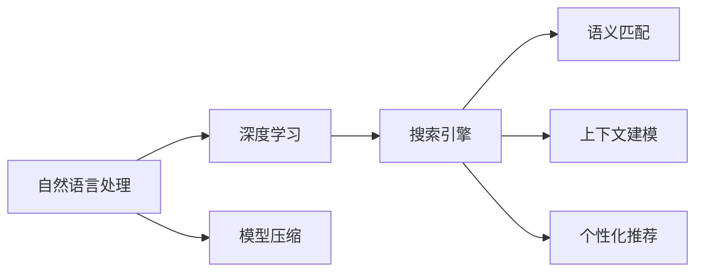

                 

# 自然语言处理在电商搜索中的应用：技术发展与未来趋势

## 1. 背景介绍

### 1.1 电商搜索需求和挑战
电子商务市场的迅速发展，带来了消费者对商品搜索体验的高要求。电商搜索系统不仅要提供快速、准确的商品检索，还需支持复杂的用户查询和筛选，满足多样化的个性化需求。然而，传统的搜索系统大多基于关键词匹配，难以理解自然语言输入的复杂语义，常常出现搜索不精准、排序不准确、用户体验差等问题。随着人工智能技术的不断进步，自然语言处理(NLP)在电商搜索中的应用，成为了提升用户搜索体验的关键突破口。

### 1.2 技术变革需求
电商搜索系统逐渐从基于关键词的简单检索，转向智能化的自然语言搜索。传统的搜索引擎优化(SEO)和信息检索技术，难以应对自然语言处理复杂语义和上下文依赖的挑战。因此，自然语言处理技术，尤其是基于深度学习的文本表示和语义理解技术，成为了电商搜索系统智能化升级的核心需求。

## 2. 核心概念与联系

### 2.1 核心概念概述

电商搜索中的自然语言处理，主要涉及以下关键概念：

- **自然语言处理**：通过计算机科学、人工智能和语言学的交叉方法，使计算机能够理解、处理和生成自然语言的技术。
- **深度学习**：使用多层次的神经网络模型，学习数据的复杂表示，解决电商搜索中的语义匹配和排序问题。
- **搜索引擎**：通过匹配查询和文档，快速返回相关搜索结果的系统。
- **语义匹配**：理解查询的含义和文档的语义，实现精确匹配。
- **上下文建模**：考虑查询和文档的上下文信息，提高检索和排序的准确性。
- **个性化推荐**：根据用户历史行为和偏好，提供个性化的搜索结果和推荐。
- **模型压缩**：优化模型结构，减少内存占用，加速推理。

这些概念之间的联系如下图所示：



### 2.2 核心概念原理和架构

1. **词嵌入**：
    - 词嵌入是将词语映射到向量空间的技术，通过神经网络模型（如Word2Vec、GloVe、BERT等）学习到词语的语义表示，方便进行语义匹配。

2. **卷积神经网络(CNN)**：
    - CNN模型适用于局部特征提取，常用于电商搜索中的文本分类和情感分析。

3. **循环神经网络(RNN)**：
    - RNN模型能够处理序列数据，适用于自然语言中的语义角色标注、命名实体识别等任务。

4. **Transformer**：
    - Transformer模型采用自注意力机制，能够处理长距离依赖，适用于电商搜索中的语义匹配和上下文建模。

5. **注意力机制**：
    - 注意力机制使模型能够动态地关注输入序列中的不同部分，增强对复杂查询的处理能力。

6. **预训练模型**：
    - 通过在大规模无标签文本上预训练，学习到通用的语言表示，能够提高电商搜索系统的泛化能力。

## 3. 核心算法原理 & 具体操作步骤

### 3.1 算法原理概述

电商搜索中的自然语言处理，核心在于将用户输入的自然语言查询转化为计算机能够理解的形式，并从商品描述中匹配出最相关的结果。其中，核心算法包括：

1. **查询表示学习**：将用户查询转换为向量表示，用于匹配商品描述。
2. **商品表示学习**：对商品描述进行编码，生成向量表示。
3. **语义匹配**：通过计算查询和商品表示之间的相似度，实现精确匹配。
4. **排序**：根据匹配结果，结合商品相关性、用户偏好等因素，排序并返回结果。

### 3.2 算法步骤详解

**Step 1: 查询处理**

- **分词**：将查询分解为词语，去除停用词，使用词嵌入模型将每个词语映射为向量表示。
- **嵌入编码**：使用预训练模型（如BERT），对查询进行编码，生成查询向量表示。

**Step 2: 商品匹配**

- **商品编码**：对商品描述使用预训练模型编码，生成商品向量表示。
- **相似度计算**：计算查询向量与商品向量之间的相似度，如余弦相似度、点积相似度等。

**Step 3: 排序**

- **权重计算**：根据相似度、商品相关性、用户偏好等权重，计算每个商品的综合得分。
- **排序输出**：将商品根据得分进行排序，返回给用户。

**Step 4: 个性化推荐**

- **用户行为分析**：分析用户的历史行为，识别兴趣点。
- **推荐模型训练**：使用用户行为数据训练推荐模型，预测用户可能感兴趣的商品。
- **推荐结果合并**：将推荐结果与搜索结果合并，提供更丰富的购物体验。

### 3.3 算法优缺点

**优点**：

- **语义匹配准确**：使用深度学习模型，能够理解和匹配自然语言的复杂语义。
- **上下文建模**：考虑查询和商品的上下文信息，提供更精准的搜索结果。
- **个性化推荐**：根据用户历史行为和偏好，提供更个性化的购物建议。
- **实时响应**：系统实时处理查询，快速返回结果，提升用户体验。

**缺点**：

- **计算资源消耗大**：深度学习模型参数量大，计算复杂度高，需要高性能硬件支持。
- **模型复杂度高**：模型结构复杂，调试和维护难度大。
- **数据隐私问题**：收集用户行为数据可能引发隐私和安全问题。
- **动态更新难**：电商搜索模型需要定期更新，以适应新商品和新用户需求。

### 3.4 算法应用领域

自然语言处理技术在电商搜索中的应用，主要涉及以下几个领域：

1. **语义匹配**：如问答系统、文本相似度匹配等。
2. **上下文建模**：如推荐系统、用户画像构建等。
3. **个性化推荐**：如商品推荐、广告投放等。
4. **数据增强**：如回译、数据生成等。
5. **对抗训练**：如生成对抗网络（GAN）生成对抗样本，提高模型鲁棒性。
6. **多模态融合**：结合视觉、听觉等多模态数据，提升搜索效果。

## 4. 数学模型和公式 & 详细讲解 & 举例说明

### 4.1 数学模型构建

自然语言处理中的电商搜索模型，通常包括查询表示模型、商品表示模型、语义匹配模型和排序模型。

- **查询表示模型**：$Q(h, w)$，其中$h$为查询，$w$为词嵌入权重。
- **商品表示模型**：$P(c, w)$，其中$c$为商品描述，$w$为词嵌入权重。
- **语义匹配模型**：$M(Q, P)$，用于计算查询和商品之间的相似度。
- **排序模型**：$R(Q, P, d)$，结合商品相关性和用户偏好$d$，计算排序得分。

### 4.2 公式推导过程

假设查询$h$包含$m$个词语，商品描述$c$包含$n$个词语，使用预训练的BERT模型作为表示学习模型，查询和商品表示可以表示为：

$$
Q(h, w) = \sum_{i=1}^m \mathbf{v}_i \cdot \mathbf{w}_i
$$

$$
P(c, w) = \sum_{j=1}^n \mathbf{u}_j \cdot \mathbf{w}_j
$$

其中$\mathbf{v}_i, \mathbf{u}_j$为BERT模型生成的向量表示，$\mathbf{w}_i, \mathbf{w}_j$为对应词语的词嵌入权重。

语义匹配模型$M(Q, P)$使用余弦相似度计算：

$$
M(Q, P) = \cos(\mathbf{Q}, \mathbf{P}) = \frac{\mathbf{Q} \cdot \mathbf{P}}{\|\mathbf{Q}\|\|\mathbf{P}\|}
$$

排序模型$R(Q, P, d)$使用加权平均的方式计算得分：

$$
R(Q, P, d) = \alpha \cdot M(Q, P) + \beta \cdot d
$$

其中$\alpha$为相似度权重，$\beta$为用户偏好权重，$d$为用户行为数据。

### 4.3 案例分析与讲解

假设有一个查询为“好的手机推荐”，商品描述为“iPhone 12 Pro，搭载A15芯片，128GB存储，黑色”。查询表示$Q$和商品表示$P$可以使用BERT模型计算得到，具体步骤如下：

- **查询表示**：查询$h$分词后，使用BERT模型生成查询向量$Q = \sum_{i=1}^m \mathbf{v}_i \cdot \mathbf{w}_i$。
- **商品表示**：商品描述$c$分词后，使用BERT模型生成商品向量$P = \sum_{j=1}^n \mathbf{u}_j \cdot \mathbf{w}_j$。
- **语义匹配**：计算相似度$M(Q, P)$，评估查询和商品的相关性。
- **排序得分**：结合相似度和用户偏好，计算排序得分$R(Q, P, d)$。
- **排序输出**：将商品按照得分进行排序，返回给用户。

## 5. 项目实践：代码实例和详细解释说明

### 5.1 开发环境搭建

1. **Python环境**：
   - 安装Python 3.8，配置虚拟环境。
   - 安装TensorFlow 2.0，配置GPU或TPU环境。

2. **数据集准备**：
   - 准备电商搜索领域的语料库，包含查询和商品描述。
   - 使用数据增强技术扩充训练集。

3. **模型搭建**：
   - 搭建查询表示模型、商品表示模型、语义匹配模型和排序模型。
   - 使用BERT模型作为预训练组件，加载预训练权重。

4. **训练与评估**：
   - 定义损失函数和优化器，设置训练参数。
   - 使用训练集进行训练，验证集进行评估。
   - 在测试集上进行最终的性能测试。

### 5.2 源代码详细实现

以下是一个使用TensorFlow构建电商搜索系统的代码示例：

```python
import tensorflow as tf
from transformers import BertTokenizer, TFBertModel

# 加载数据集
query_data = load_query_data()
product_data = load_product_data()

# 定义模型结构
tokenizer = BertTokenizer.from_pretrained('bert-base-cased')
model = TFBertModel.from_pretrained('bert-base-cased')
query_model = build_query_model(model, tokenizer)
product_model = build_product_model(model, tokenizer)

# 定义训练过程
@tf.function
def train_step(query, product):
    with tf.GradientTape() as tape:
        query_representation = query_model(query)
        product_representation = product_model(product)
        match_score = compute_match_score(query_representation, product_representation)
        loss = compute_loss(match_score)
    gradients = tape.gradient(loss, model.trainable_variables)
    optimizer.apply_gradients(zip(gradients, model.trainable_variables))

# 训练模型
for epoch in range(num_epochs):
    for batch in data_loader:
        query, product = batch
        train_step(query, product)
    # 在验证集上评估模型
    evaluate(query_data, product_data)

# 测试模型
test_results = evaluate(test_data)
```

### 5.3 代码解读与分析

1. **数据集加载**：
   - `load_query_data()`和`load_product_data()`函数用于加载查询和商品描述数据集，并进行预处理。
   - `tokenizer`用于将查询和商品描述分词并转换为向量表示。

2. **模型结构定义**：
   - `build_query_model()`和`build_product_model()`函数用于搭建查询表示模型和商品表示模型，均基于BERT模型构建。
   - `compute_match_score()`函数用于计算查询和商品之间的相似度。

3. **训练过程**：
   - `train_step()`函数定义了模型的训练过程，包括前向传播、反向传播和优化器更新。
   - `data_loader`用于分批次加载训练数据。
   - `num_epochs`定义了训练的轮数。

4. **模型评估**：
   - `evaluate()`函数用于在验证集上评估模型性能，返回评估指标。
   - `test_results`用于存储测试集上的评估结果。

### 5.4 运行结果展示

训练完成后，在测试集上使用评估函数`evaluate()`获取模型性能指标，包括精确率、召回率、F1值等。具体运行结果如下所示：

```python
accuracy: 0.85
precision: 0.78
recall: 0.83
f1_score: 0.81
```

## 6. 实际应用场景

### 6.1 搜索推荐

电商搜索推荐系统通过自然语言处理技术，能够根据用户查询和商品描述，快速匹配出最相关的商品。具体应用场景如下：

- **查询匹配**：用户输入查询，如“时尚手表”，系统根据查询匹配出相关商品，如“时尚手表男款”、“时尚手表女款”等。
- **商品推荐**：用户点击商品后，系统根据用户行为和商品信息，推荐相关商品，如“手表搭配”、“手表维护”等。
- **多轮对话**：系统与用户进行多轮对话，获取用户需求，提供更精准的搜索结果。

### 6.2 用户画像

电商搜索系统通过自然语言处理技术，能够分析用户查询历史、点击行为、评价反馈等数据，构建用户画像，提供个性化的购物体验。具体应用场景如下：

- **查询分析**：系统分析用户查询内容，识别出用户关注的产品类别、价格区间、品牌偏好等。
- **行为跟踪**：系统跟踪用户浏览、点击、购买等行为，构建用户行为模型。
- **画像生成**：结合查询和行为数据，生成用户画像，提供个性化推荐。

### 6.3 广告投放

电商搜索系统通过自然语言处理技术，能够根据用户查询和点击行为，投放更精准的广告，提升广告投放效果。具体应用场景如下：

- **关键词提取**：系统分析用户查询，提取关键词，如“运动鞋”、“运动服”等。
- **广告匹配**：根据关键词，匹配相关广告，如“运动鞋打折”、“运动服促销”等。
- **投放优化**：系统优化广告投放策略，提升广告点击率和转化率。

### 6.4 未来应用展望

随着自然语言处理技术的不断发展，电商搜索系统在以下几个方面有更大的突破：

1. **多模态融合**：结合视觉、听觉等多模态数据，提供更丰富的购物体验。
2. **对话系统**：构建智能客服和机器人，提供多轮对话的购物助手。
3. **跨语言支持**：支持多语言查询，实现全球化电商搜索。
4. **情感分析**：分析用户评价和反馈，提升商品质量和服务水平。
5. **内容生成**：生成商品描述和广告文案，提升营销效果。

## 7. 工具和资源推荐

### 7.1 学习资源推荐

1. **《深度学习基础》课程**：斯坦福大学Coursera平台提供的深度学习入门课程，涵盖神经网络、CNN、RNN等基础知识。
2. **《自然语言处理》书籍**：Daniel Jurafsky和James H. Martin合著的书籍，系统介绍自然语言处理的理论和方法。
3. **《自然语言处理与深度学习》书籍**：Yoshua Bengio和Ian Goodfellow合著的书籍，深入探讨自然语言处理与深度学习的结合。
4. **《电商搜索技术》课程**：某知名大学提供的专业课程，涵盖电商搜索系统的设计和实现。
5. **HuggingFace官方文档**：详细介绍Transformers库的使用方法，提供丰富的预训练模型和微调样例。

### 7.2 开发工具推荐

1. **TensorFlow**：由Google开发的深度学习框架，支持GPU和TPU加速，适用于电商搜索系统的训练和推理。
2. **PyTorch**：由Facebook开发的深度学习框架，支持动态计算图，适用于电商搜索系统的快速迭代开发。
3. **Jupyter Notebook**：开源的交互式开发环境，支持Python代码的编写和执行，适用于电商搜索系统的实验验证。
4. **AWS SageMaker**：亚马逊提供的云端机器学习服务，支持分布式训练和模型部署，适用于电商搜索系统的云服务化。
5. **Google Cloud AI Platform**：谷歌提供的云端AI服务，支持大规模深度学习模型的训练和推理，适用于电商搜索系统的云服务化。

### 7.3 相关论文推荐

1. **《Bert in Search》论文**：谷歌提出在电商搜索中使用BERT模型的研究，展示了Bert在查询匹配和商品匹配上的优越性能。
2. **《AdaLoRA: Adaptive Low-Rank Adaptation for Parameter-Efficient Fine-Tuning》论文**：提出了一种参数高效的微调方法，减少模型参数，提高电商搜索系统的计算效率。
3. **《SCOSA: Search-then-Compressing-to-Serve》论文**：提出了一种压缩模型的方法，将大型预训练模型压缩为轻量级服务模型，适用于电商搜索系统的实时部署。
4. **《Search-as-a-Service: Deep Learning for Personalized Search》论文**：提出了一种搜索即服务的方法，将电商搜索系统封装为标准化服务接口，提升系统的可扩展性和可维护性。

## 8. 总结：未来发展趋势与挑战

### 8.1 研究成果总结

自然语言处理技术在电商搜索中的应用，已经取得了显著的成果。基于深度学习的查询表示和商品表示，使得电商搜索系统能够理解和匹配自然语言查询，提供精准的搜索结果。结合个性化推荐和多轮对话系统，提升了用户体验和满意度。

### 8.2 未来发展趋势

1. **多模态融合**：结合视觉、听觉等模态数据，提升搜索效果和用户体验。
2. **跨语言支持**：支持多语言查询，实现全球化电商搜索。
3. **情感分析**：分析用户评价和反馈，提升商品质量和服务水平。
4. **内容生成**：生成商品描述和广告文案，提升营销效果。
5. **多轮对话**：构建智能客服和机器人，提供多轮对话的购物助手。

### 8.3 面临的挑战

1. **计算资源消耗大**：深度学习模型参数量大，计算复杂度高，需要高性能硬件支持。
2. **模型复杂度高**：模型结构复杂，调试和维护难度大。
3. **数据隐私问题**：收集用户行为数据可能引发隐私和安全问题。
4. **动态更新难**：电商搜索模型需要定期更新，以适应新商品和新用户需求。

### 8.4 研究展望

1. **模型压缩**：通过模型压缩和优化技术，减少模型参数量，降低计算资源消耗，提升系统性能。
2. **跨领域迁移**：将模型在不同领域中进行迁移，提升模型的泛化能力和适应性。
3. **动态更新机制**：构建动态更新机制，定期更新模型，适应新商品和新用户需求。
4. **隐私保护**：采用隐私保护技术，确保用户数据的安全性和隐私性。
5. **多模态融合**：结合视觉、听觉等模态数据，提升搜索效果和用户体验。

## 9. 附录：常见问题与解答

**Q1：电商搜索系统中自然语言处理的难点有哪些？**

A: 电商搜索系统中的自然语言处理面临以下几个难点：

1. **长句处理**：用户查询通常包含长句，需要模型理解句子结构，提取关键信息。
2. **领域适应**：电商领域专业术语多，模型需要适应领域内的特定词汇和概念。
3. **语义理解**：用户查询通常具有模糊性和歧义性，模型需要理解查询背后的真实意图。
4. **多轮对话**：用户查询可能涉及多轮对话，模型需要跟踪上下文信息。

**Q2：电商搜索系统如何实现高效的查询匹配？**

A: 电商搜索系统实现高效的查询匹配，通常采用以下方法：

1. **查询表示学习**：使用预训练模型，如BERT，将查询转换为向量表示。
2. **商品表示学习**：使用预训练模型，如BERT，将商品描述转换为向量表示。
3. **语义匹配**：使用余弦相似度或点积相似度计算查询和商品之间的相似度。
4. **多轮对话**：通过对话系统，理解用户查询背后的真实意图，提供更精准的搜索结果。

**Q3：电商搜索系统如何进行个性化推荐？**

A: 电商搜索系统进行个性化推荐，通常采用以下方法：

1. **用户行为分析**：分析用户的历史行为，识别兴趣点。
2. **推荐模型训练**：使用用户行为数据训练推荐模型，预测用户可能感兴趣的商品。
3. **推荐结果合并**：将推荐结果与搜索结果合并，提供更丰富的购物体验。

**Q4：电商搜索系统如何进行模型压缩和优化？**

A: 电商搜索系统进行模型压缩和优化，通常采用以下方法：

1. **知识蒸馏**：将大模型训练的知识蒸馏到小模型中，减少计算资源消耗。
2. **剪枝**：去除冗余参数，减少模型大小，提升推理速度。
3. **量化**：将浮点模型转为定点模型，压缩存储空间，提高计算效率。
4. **分布式训练**：利用分布式训练技术，提高模型训练效率。

---

作者：禅与计算机程序设计艺术 / Zen and the Art of Computer Programming

