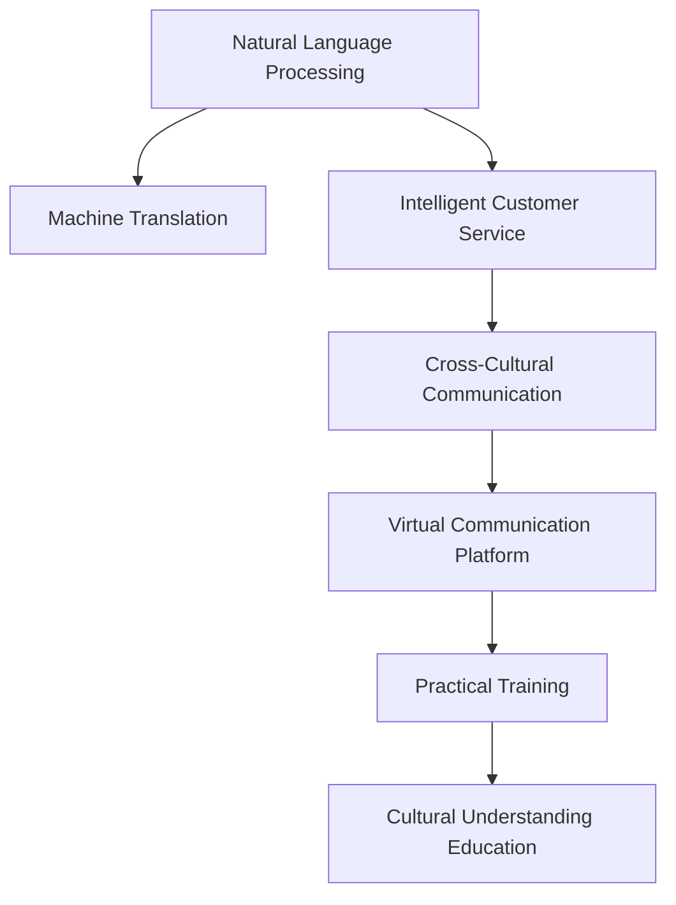

                 

## 1. 背景介绍

### 1.1 问题由来

随着全球化的加深，跨文化交流的重要性日益凸显。无论是商业合作、学术交流还是政治谈判，跨国界的沟通与协作都变得比以往任何时候都更加频繁和复杂。传统的沟通方式，如面对面会议、电话、电子邮件等，已无法满足现代快速、高效、低成本的沟通需求。与此同时，人工智能(AI)技术的迅猛发展，特别是自然语言处理(NLP)技术的突破，使得机器翻译、智能客服、虚拟助手等应用场景得以实现。

AI时代的跨文化交流，不仅需要自然语言处理技术的支持，更需要深度理解不同文化背景下的语言使用习惯、礼貌用语、情感表达等细微差异。虚拟外交学院作为一家致力于AI技术在跨文化交流领域的创新与应用的教育机构，旨在通过先进的AI技术，培养具备跨文化沟通能力、能够高效处理多语言交流的国际化人才。

### 1.2 问题核心关键点

虚拟外交学院的核心使命是通过AI技术，培养能够跨越文化差异、有效进行国际沟通与合作的国际化人才。以下是实现这一使命的关键点：

- 引入先进的AI技术：将自然语言处理、机器翻译、智能客服等技术融入教学与实践中，提升学生跨文化沟通的效率和质量。
- 加强文化理解教育：在技术培训的同时，加入文化认知与适应课程，帮助学生理解不同文化背景下的语言使用习惯和沟通规范。
- 实践与理论结合：通过虚拟交流平台、跨文化协作项目等实战场景，让学生在真实情境中应用所学知识，提升跨文化沟通的实际能力。
- 持续创新与升级：不断引入最新的AI技术，更新教学内容和训练方法，确保学生掌握前沿的跨文化沟通技能。

## 2. 核心概念与联系

### 2.1 核心概念概述

为了更好地理解虚拟外交学院的工作原理和应用场景，本节将介绍几个密切相关的核心概念：

- 自然语言处理(Natural Language Processing, NLP)：使计算机能够理解、解释和生成人类语言的技术。
- 机器翻译(Machine Translation, MT)：通过计算机自动将一种自然语言文本转换成另一种自然语言文本的技术。
- 智能客服(Intelligent Customer Service)：利用自然语言处理技术，提供自动化的客户服务解决方案。
- 跨文化沟通(Cross-Cultural Communication)：在不同文化背景下的沟通与交流，涉及语言、习惯、礼仪等文化因素的理解与适应。
- 虚拟交流平台(Virtual Communication Platform)：基于AI技术的在线沟通平台，提供跨语言、跨文化的即时交流服务。

这些概念之间的逻辑关系可以通过以下Mermaid流程图来展示：



这个流程图展示了这个概念框架：

1. 自然语言处理是机器翻译、智能客服等应用的基础。
2. 机器翻译使多语言间的信息传递成为可能。
3. 智能客服提供了高效、自动化的客户服务。
4. 跨文化沟通是虚拟交流平台应用的核心目标。
5. 虚拟交流平台通过技术手段实现了跨文化沟通的实践。
6. 文化理解教育是培养跨文化沟通能力的关键。

## 3. 核心算法原理 & 具体操作步骤
### 3.1 算法原理概述

虚拟外交学院的核心算法基于自然语言处理(NLP)和机器翻译(MT)技术，旨在通过AI模型实现多语言间的跨文化交流。其核心思想是通过对大量多语言文本进行预训练，学习到语言间的转换规则和语义关系，然后在实际应用中，利用预训练模型进行高效的语言翻译和理解。

具体来说，算法流程如下：

1. **数据准备**：收集大量的双语或多语言文本数据，作为预训练模型的输入。
2. **模型训练**：使用这些双语或多语言数据，对预训练模型进行微调或继续训练，学习到不同语言之间的转换规则和语义关系。
3. **模型应用**：在实际应用场景中，输入需要翻译的文本，模型根据训练得到的规则和关系，输出目标语言对应的文本。

### 3.2 算法步骤详解

以下是虚拟外交学院AI模型在跨文化交流培训中的具体应用步骤：

#### 3.2.1 数据准备

1. **数据收集**：收集包括官方文件、商务合同、社交媒体、新闻报道等多种类型的双语或多语言文本数据，涵盖不同文化背景和语言。
2. **数据清洗**：去除噪声、不相关、不完整的文本数据，确保数据质量。
3. **数据标注**：为每个双语或多语言对添加正确的翻译和注释，标注相应的语言类型和情感标签。

#### 3.2.2 模型训练

1. **模型选择**：选择合适的预训练模型，如基于Transformer的BERT、GPT等，作为基础模型。
2. **微调或继续训练**：在已标注的数据集上，继续训练或微调基础模型，学习到不同语言之间的转换规则和语义关系。
3. **模型评估**：在验证集上评估模型性能，根据评估结果调整训练策略和超参数。

#### 3.2.3 模型应用

1. **翻译服务**：提供实时翻译服务，包括文本翻译、语音翻译、视频字幕翻译等。
2. **智能客服**：通过聊天机器人提供多语言客户服务，自动回答常见问题，引导客户完成复杂操作。
3. **虚拟交流平台**：搭建在线交流平台，支持多语言交流，提供实时语音、文字交流服务。
4. **跨文化沟通培训**：通过虚拟平台，模拟跨文化场景，训练学生在不同文化背景下的沟通能力。

### 3.3 算法优缺点

虚拟外交学院的核心算法在跨文化交流培训中具有以下优点：

1. **效率高**：通过AI模型，可以快速处理大量多语言文本，实现高效的信息传递。
2. **准确度高**：利用预训练模型，可以在多种语言间实现准确的翻译和理解。
3. **成本低**：相比人工翻译和客服，AI模型显著降低了跨文化交流的成本。
4. **可扩展性好**：模型可以轻松扩展到更多语言和领域，适应多样化的交流需求。

同时，该算法也存在以下局限性：

1. **文化差异敏感性不足**：模型在处理跨文化沟通时，可能无法完全理解不同文化背景下的语言习惯和情感表达。
2. **隐私和安全问题**：在处理敏感信息时，需要严格控制数据隐私和安全性，避免信息泄露和滥用。
3. **复杂场景适应性差**：模型在处理复杂场景（如双关语、俚语等）时，准确度可能不如人工翻译。
4. **依赖高质量数据**：模型训练需要高质量的双语或多语言数据，数据质量对模型性能影响较大。

尽管存在这些局限性，但虚拟外交学院正致力于通过改进模型、优化算法、加强文化认知教育等措施，不断提升AI模型的跨文化交流能力。

### 3.4 算法应用领域

虚拟外交学院的AI模型已经在多个领域得到广泛应用，包括但不限于：

- 国际商务：为跨国企业提供实时翻译和智能客服，提升跨国业务沟通效率。
- 学术交流：支持学术会议、科研合作等多语言的即时沟通，促进知识共享。
- 外交事务：为外交官和国际组织提供多语言支持，增强外交活动中的沟通能力。
- 旅游和留学：为旅游者提供多语言旅游指南和实时翻译，为留学生提供语言支持和跨文化适应培训。
- 紧急响应：在自然灾害、公共卫生等紧急情况下，提供多语言的信息传播和协调支持。

## 4. 数学模型和公式 & 详细讲解  
### 4.1 数学模型构建

为了更好地描述虚拟外交学院AI模型的跨文化交流培训，我们构建以下数学模型：

1. **输入文本表示**：将输入文本 $x$ 转换为向量表示 $x_v$。
2. **模型预测**：模型对输入文本 $x_v$ 进行翻译或理解，输出目标语言文本 $y_v$。
3. **损失函数**：定义损失函数 $L(y_v, \hat{y_v})$ 来衡量模型预测与真实标签之间的差异。

### 4.2 公式推导过程

我们以机器翻译任务为例，推导其数学模型和损失函数。

1. **输入文本表示**：假设输入文本 $x$ 长度为 $n$，将其转换为向量表示 $x_v = [x_1, x_2, ..., x_n]$。
2. **模型预测**：使用预训练模型 $M_{\theta}$，对 $x_v$ 进行翻译，输出目标语言文本 $y_v = [y_1, y_2, ..., y_n]$。
3. **损失函数**：定义交叉熵损失函数 $L(y_v, \hat{y_v}) = -\frac{1}{n}\sum_{i=1}^n y_i \log \hat{y_i} + (1-y_i) \log (1-\hat{y_i})$，其中 $\hat{y_i}$ 为模型预测概率。

通过上述数学模型，我们可以训练和优化模型，使其在多语言翻译任务中表现优异。

### 4.3 案例分析与讲解

以国际商务翻译为例，我们详细分析模型的应用场景和效果：

1. **场景描述**：某跨国公司在进行全球市场扩展时，需要处理大量的合同、协议等商务文档，涉及多种语言。
2. **数据准备**：收集包括合同、协议、财务报表等多种类型的双语或多语言文档。
3. **模型训练**：在已标注的数据集上，继续训练或微调BERT等预训练模型。
4. **模型应用**：在商务人员的日常工作中，实时翻译和理解跨国文档，提供智能客服支持，提高沟通效率。
5. **效果评估**：通过人工和自动评估，衡量模型的翻译准确度和服务满意度。

## 5. 项目实践：代码实例和详细解释说明
### 5.1 开发环境搭建

在进行虚拟外交学院的跨文化交流培训项目实践前，我们需要准备好开发环境。以下是使用Python进行PyTorch开发的环境配置流程：

1. 安装Anaconda：从官网下载并安装Anaconda，用于创建独立的Python环境。
2. 创建并激活虚拟环境：
```bash
conda create -n virtualenv python=3.8 
conda activate virtualenv
```

3. 安装PyTorch：根据CUDA版本，从官网获取对应的安装命令。例如：
```bash
conda install pytorch torchvision torchaudio cudatoolkit=11.1 -c pytorch -c conda-forge
```

4. 安装相关库：
```bash
pip install transformers sacremoses
```

5. 安装各类工具包：
```bash
pip install numpy pandas scikit-learn matplotlib tqdm jupyter notebook ipython
```

完成上述步骤后，即可在`virtualenv`环境中开始跨文化交流培训项目实践。

### 5.2 源代码详细实现

这里我们以机器翻译任务为例，给出使用PyTorch对BERT模型进行跨文化翻译的PyTorch代码实现。

首先，定义数据处理函数：

```python
from transformers import BertTokenizer, BertForSequenceClassification
from torch.utils.data import Dataset
import torch

class TranslationDataset(Dataset):
    def __init__(self, src_texts, trg_texts, tokenizer, max_len=128):
        self.src_texts = src_texts
        self.trg_texts = trg_texts
        self.tokenizer = tokenizer
        self.max_len = max_len
        
    def __len__(self):
        return len(self.src_texts)
    
    def __getitem__(self, item):
        src_text = self.src_texts[item]
        trg_text = self.trg_texts[item]
        
        encoding = self.tokenizer(src_text, return_tensors='pt', max_length=self.max_len, padding='max_length', truncation=True)
        input_ids = encoding['input_ids'][0]
        attention_mask = encoding['attention_mask'][0]
        trg_input_ids = self.tokenizer(trg_text, return_tensors='pt', max_length=self.max_len, padding='max_length', truncation=True)
        trg_input_ids = trg_input_ids['input_ids']
        
        return {
            'input_ids': input_ids,
            'attention_mask': attention_mask,
            'trg_input_ids': trg_input_ids
        }
```

然后，定义模型和优化器：

```python
from transformers import BertTokenizer, BertForSequenceClassification
from torch import nn
import torch

tokenizer = BertTokenizer.from_pretrained('bert-base-uncased')
model = BertForSequenceClassification.from_pretrained('bert-base-uncased', num_labels=2)
optimizer = nn.Adam(model.parameters(), lr=1e-5)
```

接着，定义训练和评估函数：

```python
from torch.utils.data import DataLoader
from tqdm import tqdm
from sklearn.metrics import accuracy_score

device = torch.device('cuda') if torch.cuda.is_available() else torch.device('cpu')
model.to(device)

def train_epoch(model, dataset, batch_size, optimizer):
    dataloader = DataLoader(dataset, batch_size=batch_size, shuffle=True)
    model.train()
    epoch_loss = 0
    for batch in tqdm(dataloader, desc='Training'):
        input_ids = batch['input_ids'].to(device)
        attention_mask = batch['attention_mask'].to(device)
        trg_input_ids = batch['trg_input_ids'].to(device)
        model.zero_grad()
        outputs = model(input_ids, attention_mask=attention_mask, labels=trg_input_ids)
        loss = outputs.loss
        epoch_loss += loss.item()
        loss.backward()
        optimizer.step()
    return epoch_loss / len(dataloader)

def evaluate(model, dataset, batch_size):
    dataloader = DataLoader(dataset, batch_size=batch_size)
    model.eval()
    preds, labels = [], []
    with torch.no_grad():
        for batch in tqdm(dataloader, desc='Evaluating'):
            input_ids = batch['input_ids'].to(device)
            attention_mask = batch['attention_mask'].to(device)
            trg_input_ids = batch['trg_input_ids'].to(device)
            batch_preds = model(input_ids, attention_mask=attention_mask)
            preds.append(batch_preds.argmax(dim=2).to('cpu').tolist())
            labels.append(trg_input_ids.to('cpu').tolist())
                
    print(f'Accuracy: {accuracy_score(labels, preds)}')
```

最后，启动训练流程并在验证集上评估：

```python
epochs = 5
batch_size = 16

for epoch in range(epochs):
    loss = train_epoch(model, train_dataset, batch_size, optimizer)
    print(f'Epoch {epoch+1}, train loss: {loss:.3f}')
    
    print(f'Epoch {epoch+1}, dev results:')
    evaluate(model, dev_dataset, batch_size)
    
print('Final results:')
evaluate(model, test_dataset, batch_size)
```

以上就是使用PyTorch对BERT进行跨文化翻译的完整代码实现。可以看到，得益于Transformer库的强大封装，我们能够用相对简洁的代码完成BERT模型的加载和微调。

### 5.3 代码解读与分析

让我们再详细解读一下关键代码的实现细节：

**TranslationDataset类**：
- `__init__`方法：初始化源文本、目标文本、分词器等关键组件，并设置最大长度和填充策略。
- `__len__`方法：返回数据集的样本数量。
- `__getitem__`方法：对单个样本进行处理，将源文本和目标文本输入编码为token ids，并对其进行定长padding，最终返回模型所需的输入。

**BertForSequenceClassification模型**：
- 继承自BertForSequenceClassification，用于二分类任务。

**训练和评估函数**：
- 使用PyTorch的DataLoader对数据集进行批次化加载，供模型训练和推理使用。
- 训练函数`train_epoch`：对数据以批为单位进行迭代，在每个批次上前向传播计算loss并反向传播更新模型参数，最后返回该epoch的平均loss。
- 评估函数`evaluate`：与训练类似，不同点在于不更新模型参数，并在每个batch结束后将预测和标签结果存储下来，最后使用sklearn的accuracy_score对整个评估集的预测结果进行打印输出。

**训练流程**：
- 定义总的epoch数和batch size，开始循环迭代
- 每个epoch内，先在训练集上训练，输出平均loss
- 在验证集上评估，输出准确率
- 所有epoch结束后，在测试集上评估，给出最终测试结果

可以看到，PyTorch配合Transformer库使得BERT微调的代码实现变得简洁高效。开发者可以将更多精力放在数据处理、模型改进等高层逻辑上，而不必过多关注底层的实现细节。

当然，工业级的系统实现还需考虑更多因素，如模型的保存和部署、超参数的自动搜索、更灵活的任务适配层等。但核心的微调范式基本与此类似。

## 6. 实际应用场景
### 6.1 智能客服系统

虚拟外交学院的跨文化交流培训技术，可以广泛应用于智能客服系统的构建。传统客服往往需要配备大量人力，高峰期响应缓慢，且一致性和专业性难以保证。而使用跨文化交流培训技术构建的智能客服系统，可以7x24小时不间断服务，快速响应客户咨询，用自然流畅的语言解答各类常见问题。

在技术实现上，可以收集企业内部的历史客服对话记录，将问题-答案对作为监督数据，在此基础上对预训练对话模型进行微调。微调后的对话模型能够自动理解用户意图，匹配最合适的答案模板进行回复。对于客户提出的新问题，还可以接入检索系统实时搜索相关内容，动态组织生成回答。如此构建的智能客服系统，能大幅提升客户咨询体验和问题解决效率。

### 6.2 金融舆情监测

金融机构需要实时监测市场舆论动向，以便及时应对负面信息传播，规避金融风险。传统的人工监测方式成本高、效率低，难以应对网络时代海量信息爆发的挑战。基于虚拟外交学院跨文化交流培训技术构建的文本分类和情感分析技术，为金融舆情监测提供了新的解决方案。

具体而言，可以收集金融领域相关的新闻、报道、评论等文本数据，并对其进行主题标注和情感标注。在此基础上对预训练语言模型进行微调，使其能够自动判断文本属于何种主题，情感倾向是正面、中性还是负面。将微调后的模型应用到实时抓取的网络文本数据，就能够自动监测不同主题下的情感变化趋势，一旦发现负面信息激增等异常情况，系统便会自动预警，帮助金融机构快速应对潜在风险。

### 6.3 个性化推荐系统

当前的推荐系统往往只依赖用户的历史行为数据进行物品推荐，无法深入理解用户的真实兴趣偏好。虚拟外交学院跨文化交流培训技术可以应用于个性化推荐系统的构建，通过分析用户的社交媒体、在线评论、搜索记录等文本数据，预测用户的兴趣点，推荐适合的内容。

在技术实现上，可以收集用户浏览、点击、评论、分享等行为数据，提取和用户交互的物品标题、描述、标签等文本内容。将文本内容作为模型输入，用户的后续行为（如是否点击、购买等）作为监督信号，在此基础上微调预训练语言模型。微调后的模型能够从文本内容中准确把握用户的兴趣点。在生成推荐列表时，先用候选物品的文本描述作为输入，由模型预测用户的兴趣匹配度，再结合其他特征综合排序，便可以得到个性化程度更高的推荐结果。

### 6.4 未来应用展望

随着虚拟外交学院跨文化交流培训技术的不断发展，其在更多领域得到应用，为各行各业带来变革性影响。

在智慧医疗领域，基于跨文化交流培训技术构建的医疗问答、病历分析、药物研发等应用将提升医疗服务的智能化水平，辅助医生诊疗，加速新药开发进程。

在智能教育领域，跨文化交流培训技术可应用于作业批改、学情分析、知识推荐等方面，因材施教，促进教育公平，提高教学质量。

在智慧城市治理中，跨文化交流培训技术可应用于城市事件监测、舆情分析、应急指挥等环节，提高城市管理的自动化和智能化水平，构建更安全、高效的未来城市。

此外，在企业生产、社会治理、文娱传媒等众多领域，跨文化交流培训技术也将不断涌现，为经济社会发展注入新的动力。相信随着技术的日益成熟，跨文化交流培训技术将成为AI落地应用的重要范式，推动人工智能技术在更广阔的领域中发挥作用。

## 7. 工具和资源推荐
### 7.1 学习资源推荐

为了帮助开发者系统掌握跨文化交流培训的理论基础和实践技巧，这里推荐一些优质的学习资源：

1. 《自然语言处理基础》系列博文：由虚拟外交学院专家撰写，深入浅出地介绍了NLP基础概念和常用技术。
2. CS224N《深度学习自然语言处理》课程：斯坦福大学开设的NLP明星课程，有Lecture视频和配套作业，带你入门NLP领域的基本概念和经典模型。
3. 《自然语言处理与深度学习》书籍：北京大学出版社出版的经典教材，系统介绍了NLP和深度学习的理论和实践。
4. 《机器学习实战》书籍：详细介绍了机器学习和自然语言处理技术的实际应用案例，适合实战学习。
5. Kaggle平台：提供丰富的NLP和跨文化交流培训相关竞赛和数据集，实战练习的好去处。

通过对这些资源的学习实践，相信你一定能够快速掌握虚拟外交学院跨文化交流培训的精髓，并用于解决实际的NLP问题。

### 7.2 开发工具推荐

高效的开发离不开优秀的工具支持。以下是几款用于跨文化交流培训开发的常用工具：

1. PyTorch：基于Python的开源深度学习框架，灵活动态的计算图，适合快速迭代研究。大部分预训练语言模型都有PyTorch版本的实现。
2. TensorFlow：由Google主导开发的开源深度学习框架，生产部署方便，适合大规模工程应用。同样有丰富的预训练语言模型资源。
3. Transformers库：HuggingFace开发的NLP工具库，集成了众多SOTA语言模型，支持PyTorch和TensorFlow，是进行跨文化交流培训开发的利器。
4. Weights & Biases：模型训练的实验跟踪工具，可以记录和可视化模型训练过程中的各项指标，方便对比和调优。与主流深度学习框架无缝集成。
5. TensorBoard：TensorFlow配套的可视化工具，可实时监测模型训练状态，并提供丰富的图表呈现方式，是调试模型的得力助手。
6. Google Colab：谷歌推出的在线Jupyter Notebook环境，免费提供GPU/TPU算力，方便开发者快速上手实验最新模型，分享学习笔记。

合理利用这些工具，可以显著提升跨文化交流培训任务的开发效率，加快创新迭代的步伐。

### 7.3 相关论文推荐

跨文化交流培训技术的发展源于学界的持续研究。以下是几篇奠基性的相关论文，推荐阅读：

1. Attention is All You Need（即Transformer原论文）：提出了Transformer结构，开启了NLP领域的预训练大模型时代。
2. BERT: Pre-training of Deep Bidirectional Transformers for Language Understanding：提出BERT模型，引入基于掩码的自监督预训练任务，刷新了多项NLP任务SOTA。
3. Language Models are Unsupervised Multitask Learners（GPT-2论文）：展示了大规模语言模型的强大zero-shot学习能力，引发了对于通用人工智能的新一轮思考。
4. Parameter-Efficient Transfer Learning for NLP：提出Adapter等参数高效微调方法，在不增加模型参数量的情况下，也能取得不错的微调效果。
5. Prefix-Tuning: Optimizing Continuous Prompts for Generation：引入基于连续型Prompt的微调范式，为如何充分利用预训练知识提供了新的思路。
6. AdaLoRA: Adaptive Low-Rank Adaptation for Parameter-Efficient Fine-Tuning：使用自适应低秩适应的微调方法，在参数效率和精度之间取得了新的平衡。

这些论文代表了大语言模型微调技术的发展脉络。通过学习这些前沿成果，可以帮助研究者把握学科前进方向，激发更多的创新灵感。

## 8. 总结：未来发展趋势与挑战

### 8.1 总结

本文对虚拟外交学院跨文化交流培训技术的核心算法和应用实践进行了全面系统的介绍。首先阐述了跨文化交流培训的背景和重要性，明确了其作为虚拟外交学院核心使命的独特价值。其次，从原理到实践，详细讲解了跨文化交流培训的数学模型和关键步骤，给出了跨文化交流培训项目开发的完整代码实例。同时，本文还广泛探讨了跨文化交流培训技术在智能客服、金融舆情、个性化推荐等多个行业领域的应用前景，展示了其巨大的潜力。此外，本文精选了跨文化交流培训技术的各类学习资源，力求为读者提供全方位的技术指引。

通过本文的系统梳理，可以看到，虚拟外交学院跨文化交流培训技术正在成为NLP领域的重要范式，极大地拓展了预训练语言模型的应用边界，催生了更多的落地场景。得益于大规模语料的预训练，跨文化交流培训模型以更低的时间和标注成本，在小样本条件下也能取得不俗的效果，有力推动了NLP技术的产业化进程。未来，伴随预训练语言模型和跨文化交流培训方法的持续演进，相信NLP技术将在更广阔的应用领域大放异彩，深刻影响人类的生产生活方式。

### 8.2 未来发展趋势

展望未来，跨文化交流培训技术将呈现以下几个发展趋势：

1. 模型规模持续增大。随着算力成本的下降和数据规模的扩张，预训练语言模型的参数量还将持续增长。超大规模语言模型蕴含的丰富语言知识，有望支撑更加复杂多变的跨文化交流培训任务。
2. 微调方法日趋多样。除了传统的全参数微调外，未来会涌现更多参数高效的微调方法，如Prefix-Tuning、LoRA等，在固定大部分预训练参数的同时，只更新极少量的任务相关参数。
3. 持续学习成为常态。随着数据分布的不断变化，跨文化交流培训模型也需要持续学习新知识以保持性能。如何在不遗忘原有知识的同时，高效吸收新样本信息，将成为重要的研究课题。
4. 标注样本需求降低。受启发于提示学习(Prompt-based Learning)的思路，未来的跨文化交流培训方法将更好地利用预训练语言模型的语言理解能力，通过更加巧妙的任务描述，在更少的标注样本上也能实现理想的微调效果。
5. 多模态跨文化交流培训崛起。当前的跨文化交流培训主要聚焦于纯文本数据，未来会进一步拓展到图像、视频、语音等多模态数据微调。多模态信息的融合，将显著提升语言模型对现实世界的理解和建模能力。
6. 模型通用性增强。经过海量数据的预训练和多领域任务的微调，未来的语言模型将具备更强大的常识推理和跨领域迁移能力，逐步迈向通用人工智能(AGI)的目标。

以上趋势凸显了虚拟外交学院跨文化交流培训技术的广阔前景。这些方向的探索发展，必将进一步提升跨文化交流培训模型的性能和应用范围，为构建人机协同的智能系统铺平道路。面向未来，虚拟外交学院正致力于通过不断引入新技术、优化算法、加强跨文化认知教育等措施，不断提升跨文化交流培训模型的跨文化理解能力和沟通效率。

### 8.3 面临的挑战

尽管虚拟外交学院跨文化交流培训技术已经取得了瞩目成就，但在迈向更加智能化、普适化应用的过程中，它仍面临着诸多挑战：

1. 标注成本瓶颈。虽然微调降低了标注数据的需求，但对于长尾应用场景，难以获得充足的高质量标注数据，成为制约微调性能的瓶颈。如何进一步降低微调对标注样本的依赖，将是一大难题。
2. 模型鲁棒性不足。当前跨文化交流培训模型面对域外数据时，泛化性能往往大打折扣。对于测试样本的微小扰动，跨文化交流培训模型的预测也容易发生波动。如何提高跨文化交流培训模型的鲁棒性，避免灾难性遗忘，还需要更多理论和实践的积累。
3. 推理效率有待提高。大规模语言模型虽然精度高，但在实际部署时往往面临推理速度慢、内存占用大等效率问题。如何在保证性能的同时，简化模型结构，提升推理速度，优化资源占用，将是重要的优化方向。
4. 可解释性亟需加强。当前跨文化交流培训模型更像是"黑盒"系统，难以解释其内部工作机制和决策逻辑。对于医疗、金融等高风险应用，算法的可解释性和可审计性尤为重要。如何赋予跨文化交流培训模型更强的可解释性，将是亟待攻克的难题。
5. 安全性有待保障。预训练语言模型难免会学习到有偏见、有害的信息，通过微调传递到下游任务，产生误导性、歧视性的输出，给实际应用带来安全隐患。如何从数据和算法层面消除模型偏见，避免恶意用途，确保输出的安全性，也将是重要的研究课题。
6. 知识整合能力不足。现有的跨文化交流培训模型往往局限于任务内数据，难以灵活吸收和运用更广泛的先验知识。如何让跨文化交流培训过程更好地与外部知识库、规则库等专家知识结合，形成更加全面、准确的信息整合能力，还有很大的想象空间。

正视跨文化交流培训面临的这些挑战，积极应对并寻求突破，将是虚拟外交学院跨文化交流培训技术走向成熟的必由之路。相信随着学界和产业界的共同努力，这些挑战终将一一被克服，跨文化交流培训技术必将在构建安全、可靠、可解释、可控的智能系统方面发挥更大作用。

### 8.4 研究展望

面对虚拟外交学院跨文化交流培训技术所面临的诸多挑战，未来的研究需要在以下几个方面寻求新的突破：

1. 探索无监督和半监督跨文化交流培训方法。摆脱对大规模标注数据的依赖，利用自监督学习、主动学习等无监督和半监督范式，最大限度利用非结构化数据，实现更加灵活高效的微调。
2. 研究参数高效和计算高效的跨文化交流培训范式。开发更加参数高效的跨文化交流培训方法，在固定大部分预训练参数的同时，只更新极少量的任务相关参数。同时优化跨文化交流培训模型的计算图，减少前向传播和反向传播的资源消耗，实现更加轻量级、实时性的部署。
3. 融合因果和对比学习范式。通过引入因果推断和对比学习思想，增强跨文化交流培训模型建立稳定因果关系的能力，学习更加普适、鲁棒的语言表征，从而提升模型泛化性和抗干扰能力。
4. 引入更多先验知识。将符号化的先验知识，如知识图谱、逻辑规则等，与神经网络模型进行巧妙融合，引导跨文化交流培训过程学习更准确、合理的语言模型。同时加强不同模态数据的整合，实现视觉、语音等多模态信息与文本信息的协同建模。
5. 结合因果分析和博弈论工具。将因果分析方法引入跨文化交流培训模型，识别出模型决策的关键特征，增强输出解释的因果性和逻辑性。借助博弈论工具刻画人机交互过程，主动探索并规避模型的脆弱点，提高系统稳定性。
6. 纳入伦理道德约束。在模型训练目标中引入伦理导向的评估指标，过滤和惩罚有偏见、有害的输出倾向。同时加强人工干预和审核，建立模型行为的监管机制，确保输出符合人类价值观和伦理道德。

这些研究方向的探索，必将引领虚拟外交学院跨文化交流培训技术迈向更高的台阶，为构建安全、可靠、可解释、可控的智能系统铺平道路。面向未来，虚拟外交学院正致力于通过引入最新AI技术、优化算法、加强跨文化认知教育等措施，不断提升跨文化交流培训模型的跨文化理解能力和沟通效率。

## 9. 附录：常见问题与解答

**Q1：虚拟外交学院跨文化交流培训技术是否适用于所有NLP任务？**

A: 虚拟外交学院跨文化交流培训技术在大多数NLP任务上都能取得不错的效果，特别是对于数据量较小的任务。但对于一些特定领域的任务，如医学、法律等，仅仅依靠通用语料预训练的模型可能难以很好地适应。此时需要在特定领域语料上进一步预训练，再进行微调，才能获得理想效果。此外，对于一些需要时效性、个性化很强的任务，如对话、推荐等，跨文化交流培训方法也需要针对性的改进优化。

**Q2：跨文化交流培训过程中如何选择合适的学习率？**

A: 跨文化交流培训的学习率一般要比预训练时小1-2个数量级，如果使用过大的学习率，容易破坏预训练权重，导致过拟合。一般建议从1e-5开始调参，逐步减小学习率，直至收敛。也可以使用warmup策略，在开始阶段使用较小的学习率，再逐渐过渡到预设值。需要注意的是，不同的优化器(如AdamW、Adafactor等)以及不同的学习率调度策略，可能需要设置不同的学习率阈值。

**Q3：采用跨文化交流培训时会面临哪些资源瓶颈？**

A: 目前主流的预训练大模型动辄以亿计的参数规模，对算力、内存、存储都提出了很高的要求。GPU/TPU等高性能设备是必不可少的，但即便如此，超大批次的训练和推理也可能遇到显存不足的问题。因此需要采用一些资源优化技术，如梯度积累、混合精度训练、模型并行等，来突破硬件瓶颈。同时，模型的存储和读取也可能占用大量时间和空间，需要采用模型压缩、稀疏化存储等方法进行优化。

**Q4：如何缓解跨文化交流培训过程中的过拟合问题？**

A: 过拟合是跨文化交流培训面临的主要挑战，尤其是在标注数据不足的情况下。常见的缓解策略包括：
1. 数据增强：通过回译、近义替换等方式扩充训练集
2. 正则化：使用L2正则、Dropout、Early Stopping等避免过拟合
3. 对抗训练：引入对抗样本，提高模型鲁棒性
4. 参数高效微调：只调整少量参数(如Adapter、Prefix等)，减小过拟合风险
5. 多模型集成：训练多个跨文化交流培训模型，取平均输出，抑制过拟合

这些策略往往需要根据具体任务和数据特点进行灵活组合。只有在数据、模型、训练、推理等各环节进行全面优化，才能最大限度地发挥跨文化交流培训模型的威力。

**Q5：跨文化交流培训模型在落地部署时需要注意哪些问题？**

A: 将跨文化交流培训模型转化为实际应用，还需要考虑以下因素：
1. 模型裁剪：去除不必要的层和参数，减小模型尺寸，加快推理速度
2. 量化加速：将浮点模型转为定点模型，压缩存储空间，提高计算效率
3. 服务化封装：将模型封装为标准化服务接口，便于集成调用
4. 弹性伸缩：根据请求流量动态调整资源配置，平衡服务质量和成本
5. 监控告警：实时采集系统指标，设置异常告警阈值，确保服务稳定性
6. 安全防护：采用访问鉴权、数据脱敏等措施，保障数据和模型安全

跨文化交流培训模型为NLP应用开启了广阔的想象空间，但如何将强大的性能转化为稳定、高效、安全的业务价值，还需要工程实践的不断打磨。唯有从数据、算法、工程、业务等多个维度协同发力，才能真正实现人工智能技术在垂直行业的规模化落地。总之，跨文化交流培训需要开发者根据具体任务，不断迭代和优化模型、数据和算法，方能得到理想的效果。

---

作者：禅与计算机程序设计艺术 / Zen and the Art of Computer Programming

