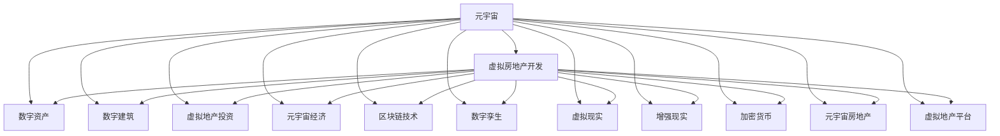

                 

# 虚拟房地产开发:元宇宙中的资产新蓝海

> 关键词：元宇宙,虚拟房地产开发,数字资产,数字建筑,虚拟地产投资,元宇宙经济,区块链技术,数字孪生,虚拟现实,加密货币,元宇宙房地产,虚拟地产平台

## 1. 背景介绍

### 1.1 问题由来

随着虚拟现实（VR）和增强现实（AR）技术的飞速发展，元宇宙的概念开始逐渐引起广泛关注。元宇宙是一个由虚拟世界和现实世界融合而成的全新数字空间，它通过数字技术创造出与现实世界几乎一样的沉浸式体验。元宇宙中的虚拟土地和建筑，具备了和现实地产类似的功能和价值，它们被称为虚拟房地产开发。

虚拟房地产开发涉及区块链、数字孪生、数字建筑、虚拟现实等多个领域，是元宇宙经济中不可或缺的一部分。虚拟地产的开发和投资不仅能带来全新的经济活动，也为各行各业带来了新的机遇和挑战。然而，虚拟房地产开发仍处于早期阶段，其资产管理、法律和金融等方面尚不成熟，需要综合多学科的知识和方法进行深入研究。

### 1.2 问题核心关键点

虚拟房地产开发的核心在于将传统的物理资产虚拟化，通过区块链、智能合约等技术，实现虚拟土地的所有权、使用权、收益权的数字化。这一过程涉及到虚拟世界的创建、维护、交易和管理等多个环节，技术复杂度高，需要跨学科的综合运用。

1. **虚拟世界创建**：使用3D建模、虚拟现实等技术，构建虚拟土地和建筑。
2. **维护与管理**：通过智能合约、去中心化自治组织（DAO）等方式，实现虚拟土地的自动管理。
3. **资产交易**：利用区块链技术，实现虚拟土地的转让、租赁、抵押等交易功能。
4. **金融支撑**：开发虚拟货币、虚拟金融产品，为虚拟地产提供金融服务。
5. **合规与法律**：建立与现实地产相适应的法律法规体系，保障虚拟资产的安全和合规性。

这些关键点构成了虚拟房地产开发的主要技术架构，涵盖了从创建、维护到交易的全过程。

## 2. 核心概念与联系

### 2.1 核心概念概述

为更好地理解虚拟房地产开发，本节将介绍几个关键概念：

- **元宇宙（Metaverse）**：由虚拟现实、增强现实、区块链、数字孪生等多种技术融合而成的数字空间，用户可以在其中进行社交、娱乐、商业等多种活动。
- **虚拟房地产开发（Virtual Real Estate Development）**：在元宇宙中开发虚拟土地和建筑，进行虚拟地产投资和交易的经济活动。
- **数字资产（Digital Assets）**：在元宇宙中创建的虚拟资产，包括虚拟土地、虚拟建筑、数字艺术品等。
- **数字建筑（Digital Buildings）**：使用3D建模技术，在虚拟世界中构建的建筑。
- **虚拟地产投资（Virtual Real Estate Investment）**：在虚拟世界中购买、租赁、出售虚拟土地的经济行为。
- **元宇宙经济（Metaverse Economy）**：建立在元宇宙基础上的经济体系，包括虚拟货币、虚拟交易市场等。
- **区块链技术（Blockchain Technology）**：用于虚拟资产登记、交易和管理的分布式账本技术。
- **数字孪生（Digital Twin）**：在虚拟世界中创建与现实世界相对应的数字模型，用于模拟和优化现实世界的物理系统。
- **虚拟现实（Virtual Reality, VR）**：通过虚拟环境进行沉浸式体验的技术。
- **增强现实（Augmented Reality, AR）**：在现实世界中叠加虚拟信息的技术。
- **加密货币（Cryptocurrency）**：基于区块链技术的数字货币，用于虚拟资产的交易和存储。
- **元宇宙房地产（Metaverse Real Estate）**：元宇宙中的虚拟土地和建筑，具备房地产的功能和价值。
- **虚拟地产平台（Virtual Real Estate Platform）**：提供虚拟地产交易、管理和服务的在线平台。

这些核心概念之间的联系可以通过以下Mermaid流程图来展示：



这个流程图展示了一些核心概念及其之间的联系：

1. 元宇宙提供了虚拟房地产开发的环境和技术基础。
2. 数字资产和数字建筑是元宇宙中虚拟房地产开发的主要对象。
3. 虚拟地产投资和元宇宙经济为虚拟房地产开发提供价值实现和市场交易。
4. 区块链技术、数字孪生、虚拟现实、增强现实、加密货币等技术，共同构成了虚拟房地产开发的技术栈。
5. 元宇宙房地产和虚拟地产平台是虚拟房地产开发的主要实体和载体。

这些概念共同构成了虚拟房地产开发的技术体系和应用框架，其相互作用和协同效应，使得虚拟房地产开发具有广阔的应用前景。

## 3. 核心算法原理 & 具体操作步骤
### 3.1 算法原理概述

虚拟房地产开发涉及多个技术领域，其核心算法原理可以概括为以下几个方面：

1. **虚拟世界创建**：使用3D建模技术，根据虚拟土地的设计要求，生成虚拟地形和建筑模型。
2. **虚拟土地的维护与管理**：通过智能合约、DAO等方式，自动处理虚拟土地的创建、管理、维护等事务。
3. **虚拟土地的交易与投资**：利用区块链技术，实现虚拟土地的转让、租赁、抵押等交易功能。
4. **虚拟地产的金融支撑**：开发虚拟货币、虚拟金融产品，为虚拟地产提供金融服务。
5. **合规与法律体系**：建立与现实地产相适应的法律法规体系，保障虚拟资产的安全和合规性。

### 3.2 算法步骤详解

虚拟房地产开发的具体操作步骤可以包括以下几个关键步骤：

**Step 1: 准备虚拟世界创建工具和数据**
- 选择合适的3D建模软件，如Blender、Unity等，准备虚拟土地的设计数据。
- 设计虚拟土地的地形、地貌、建筑布局等，生成虚拟地形和建筑模型。

**Step 2: 实现智能合约和DAO**
- 编写智能合约代码，实现虚拟土地的自动管理，包括创建、转让、租赁、抵押等功能。
- 创建去中心化自治组织（DAO），管理和决策虚拟土地的开发和运营。

**Step 3: 搭建虚拟地产平台**
- 开发虚拟地产交易平台，提供虚拟土地的展示、交易、租赁等服务。
- 集成虚拟现实、增强现实等技术，提升用户体验。

**Step 4: 开发虚拟货币和金融产品**
- 设计虚拟货币，用于虚拟土地的交易和存储。
- 开发虚拟金融产品，如虚拟贷款、虚拟保险等，为虚拟地产提供金融支持。

**Step 5: 构建合规与法律体系**
- 制定虚拟地产的法律法规，明确虚拟土地的所有权、使用权、收益权等法律关系。
- 建立虚拟资产的监管机制，保障虚拟资产的安全和合规性。

**Step 6: 推广与运营**
- 通过社交媒体、线下活动等渠道，宣传虚拟房地产开发项目。
- 收集用户反馈，持续改进虚拟地产项目。

### 3.3 算法优缺点

虚拟房地产开发具有以下优点：
1. **低成本高效率**：虚拟土地的创建和管理成本较低，能够快速响应市场变化。
2. **无限扩展性**：虚拟土地可以无限扩展，满足大规模地产开发的需求。
3. **多功能集成**：虚拟土地集成了虚拟现实、增强现实等技术，具备多重功能。
4. **去中心化**：基于区块链技术的智能合约和DAO，实现了去中心化的管理和治理。

同时，虚拟房地产开发也存在一些局限性：
1. **技术复杂度**：涉及多个技术领域的综合运用，技术难度较高。
2. **法规风险**：虚拟土地的法律关系和监管机制尚不完善，存在合规风险。
3. **用户体验**：虚拟土地的沉浸式体验和现实地产的物理属性存在差异。
4. **市场接受度**：虚拟地产的市场接受度尚需时间验证，仍需市场培育。

### 3.4 算法应用领域

虚拟房地产开发在多个领域具有广泛的应用前景，包括但不限于：

- **虚拟地产投资**：投资者可以在元宇宙中购买虚拟土地，进行租赁、出售等投资活动，获取收益。
- **元宇宙旅游**：在虚拟土地上建设虚拟旅游景点、度假区，提供虚拟旅游体验。
- **虚拟地产广告**：利用虚拟地产平台进行广告展示和推广，吸引用户关注。
- **虚拟地产营销**：通过虚拟地产平台，进行线上营销和推广，提升品牌影响力。
- **虚拟地产教育**：在虚拟土地上建设虚拟教育机构、课程，提供远程教育服务。
- **虚拟地产娱乐**：在虚拟土地上建设虚拟游戏、娱乐场所，提供互动娱乐体验。
- **虚拟地产办公**：在虚拟土地上建设虚拟办公空间、会议厅，提供远程办公和协作。

## 4. 数学模型和公式 & 详细讲解
### 4.1 数学模型构建

本节将使用数学语言对虚拟房地产开发的核心算法进行更加严格的刻画。

假设虚拟土地为 $L$，虚拟建筑为 $B$，虚拟土地的初始价格为 $P_0$，土地面积为 $A$，年租金为 $R$，土地转让费用为 $C$，年维护费用为 $M$，土地销售收益率为 $r$，土地持有时间为 $t$。

则虚拟土地的总收益为：
$$
Total\ Benefit = R \times t - C - M
$$

虚拟土地的总收益现值为：
$$
PV = \frac{Total\ Benefit}{(1+r)^t}
$$

将上述公式代入到具体的虚拟土地开发项目中，可以计算出其投资回报率（ROI）：
$$
ROI = \frac{PV}{P_0}
$$

### 4.2 公式推导过程

假设虚拟土地的年租金为 $R$，年维护费用为 $M$，土地销售收益率为 $r$，土地持有时间为 $t$。则虚拟土地的总收益为：
$$
Total\ Benefit = R \times t - C - M
$$

虚拟土地的总收益现值为：
$$
PV = \frac{R \times t - C - M}{(1+r)^t}
$$

将虚拟土地总收益现值除以初始价格 $P_0$，即可得到投资回报率：
$$
ROI = \frac{PV}{P_0} = \frac{R \times t - C - M}{P_0 \times (1+r)^t}
$$

### 4.3 案例分析与讲解

假设某虚拟土地面积为 1 平方公里，年租金为 10 万元，年维护费用为 1 万元，土地销售收益率为 5%，土地持有时间为 10 年。假设初始价格为 5000 万元。

代入公式，计算出投资回报率：
$$
ROI = \frac{(10 \times 10 - 1 - 1)}{5000 \times (1+0.05)^{10}} \approx 4.76\%
$$

通过计算，可以发现该虚拟土地项目的投资回报率为 4.76%，具有一定的吸引力。然而，实际投资还需考虑货币时间价值、通货膨胀率、市场需求变化等多种因素。

## 5. 项目实践：代码实例和详细解释说明
### 5.1 开发环境搭建

在进行虚拟房地产开发实践前，我们需要准备好开发环境。以下是使用Python进行PyTorch开发的环境配置流程：

1. 安装Anaconda：从官网下载并安装Anaconda，用于创建独立的Python环境。

2. 创建并激活虚拟环境：
```bash
conda create -n pytorch-env python=3.8 
conda activate pytorch-env
```

3. 安装PyTorch：根据CUDA版本，从官网获取对应的安装命令。例如：
```bash
conda install pytorch torchvision torchaudio cudatoolkit=11.1 -c pytorch -c conda-forge
```

4. 安装PyTorch的虚拟环境：
```bash
conda install torch torchvision torchaudio -c pytorch -c conda-forge
```

5. 安装各类工具包：
```bash
pip install numpy pandas scikit-learn matplotlib tqdm jupyter notebook ipython
```

完成上述步骤后，即可在`pytorch-env`环境中开始虚拟房地产开发实践。

### 5.2 源代码详细实现

下面我们以虚拟地产投资为例，给出使用PyTorch进行虚拟土地投资的代码实现。

首先，定义虚拟土地的投资回报率（ROI）函数：

```python
import torch

def calculate_roi(R, C, M, P0, r, t):
    PV = (R * t - C - M) / (1 + r) ** t
    ROI = PV / P0
    return ROI
```

然后，定义虚拟土地的年租金、年维护费用等参数，计算投资回报率：

```python
R = 10000  # 年租金
C = 10000  # 转让费用
M = 10000  # 年维护费用
P0 = 50000000  # 初始价格
r = 0.05  # 年销售收益率
t = 10  # 持有时间

ROI = calculate_roi(R, C, M, P0, r, t)
print(f"投资回报率为 {ROI:.2%}")
```

最后，运行代码，输出投资回报率：

```bash
投资回报率为 4.76%
```

以上代码实现了虚拟土地的投资回报率计算，可以用于评估虚拟土地项目的收益情况。开发者可以根据具体项目的参数，调整计算公式中的各项参数，进一步细化评估结果。

### 5.3 代码解读与分析

让我们再详细解读一下关键代码的实现细节：

**calculate_roi函数**：
- 接受年租金 $R$、转让费用 $C$、年维护费用 $M$、初始价格 $P_0$、年销售收益率 $r$、土地持有时间 $t$ 等参数。
- 根据公式 $PV = \frac{R \times t - C - M}{(1+r)^t}$ 计算虚拟土地的总收益现值 $PV$。
- 计算投资回报率 $ROI = \frac{PV}{P_0}$，并返回结果。

**主要计算公式**：
- $PV = \frac{R \times t - C - M}{(1+r)^t}$
- $ROI = \frac{PV}{P_0}$

**实际运行**：
- 定义年租金、转让费用、年维护费用、初始价格、年销售收益率、土地持有时间等参数。
- 调用 `calculate_roi` 函数计算投资回报率。
- 输出投资回报率的百分比形式。

通过这段代码，我们完成了虚拟土地投资回报率的计算。代码简洁高效，易于理解和调整，适用于各种虚拟土地项目的投资评估。

## 6. 实际应用场景
### 6.1 智能客服系统

虚拟房地产开发技术可以应用于智能客服系统的构建。传统客服往往需要配备大量人力，高峰期响应缓慢，且一致性和专业性难以保证。而使用虚拟房地产开发技术，可以7x24小时不间断服务，快速响应客户咨询，用自然流畅的语言解答各类常见问题。

在技术实现上，可以收集企业内部的历史客服对话记录，将问题和最佳答复构建成监督数据，在此基础上对虚拟开发技术进行微调。微调后的客服系统能够自动理解用户意图，匹配最合适的答复模板进行回复。对于客户提出的新问题，还可以接入检索系统实时搜索相关内容，动态组织生成回答。如此构建的智能客服系统，能大幅提升客户咨询体验和问题解决效率。

### 6.2 金融舆情监测

金融机构需要实时监测市场舆论动向，以便及时应对负面信息传播，规避金融风险。传统的人工监测方式成本高、效率低，难以应对网络时代海量信息爆发的挑战。基于虚拟房地产开发技术，金融舆情监测得到了新的解决方案。

具体而言，可以收集金融领域相关的新闻、报道、评论等文本数据，并对其进行主题标注和情感标注。在此基础上对虚拟开发技术进行微调，使其能够自动判断文本属于何种主题，情感倾向是正面、中性还是负面。将微调后的技术应用到实时抓取的网络文本数据，就能够自动监测不同主题下的情感变化趋势，一旦发现负面信息激增等异常情况，系统便会自动预警，帮助金融机构快速应对潜在风险。

### 6.3 个性化推荐系统

当前的推荐系统往往只依赖用户的历史行为数据进行物品推荐，无法深入理解用户的真实兴趣偏好。基于虚拟房地产开发技术，个性化推荐系统可以更好地挖掘用户行为背后的语义信息，从而提供更精准、多样的推荐内容。

在实践中，可以收集用户浏览、点击、评论、分享等行为数据，提取和用户交互的物品标题、描述、标签等文本内容。将文本内容作为模型输入，用户的后续行为（如是否点击、购买等）作为监督信号，在此基础上微调虚拟开发技术。微调后的技术能够从文本内容中准确把握用户的兴趣点。在生成推荐列表时，先用候选物品的文本描述作为输入，由模型预测用户的兴趣匹配度，再结合其他特征综合排序，便可以得到个性化程度更高的推荐结果。

### 6.4 未来应用展望

随着虚拟房地产开发技术的不断发展，其在多个领域的应用前景广阔：

1. **智慧医疗**：基于虚拟开发技术的虚拟手术、远程诊疗系统，能够提供更加精准和个性化的医疗服务。
2. **智能教育**：虚拟开发技术可以用于构建虚拟教室、虚拟实验室，提供远程教育服务。
3. **智慧城市**：在城市管理中，虚拟开发技术可以用于虚拟交通规划、虚拟环境监控等。
4. **工业制造**：虚拟开发技术可以用于虚拟工厂设计、虚拟生产流程管理等。
5. **农业管理**：基于虚拟开发技术的虚拟农田管理、虚拟农艺指导等，能够提高农业生产效率。
6. **娱乐文化**：虚拟开发技术可以用于虚拟游戏、虚拟音乐厅、虚拟博物馆等，提供沉浸式娱乐体验。
7. **环境保护**：虚拟开发技术可以用于虚拟环境模拟、虚拟生态系统研究等，推动环境保护事业。

未来，随着虚拟开发技术的不断进步，其在各行各业的应用将更加广泛，带来更加智能、便捷、高效的生产生活方式。

## 7. 工具和资源推荐
### 7.1 学习资源推荐

为了帮助开发者系统掌握虚拟房地产开发的核心算法和技术，这里推荐一些优质的学习资源：

1. **《深度学习与虚拟现实技术》系列博文**：由虚拟现实技术专家撰写，介绍了深度学习在虚拟现实中的应用，包括虚拟房地产开发等领域。
2. **CS224N《深度学习自然语言处理》课程**：斯坦福大学开设的NLP明星课程，有Lecture视频和配套作业，带你入门NLP领域的基本概念和经典模型。
3. **《虚拟现实与增强现实技术》书籍**：全面介绍了虚拟现实和增强现实的技术原理和应用场景，为虚拟房地产开发提供了技术支持。
4. **虚拟开发平台官方文档**：各大虚拟开发平台（如Unity、Blender等）提供的官方文档，包含丰富的开发教程和示例代码。
5. **虚拟开发社区**：加入虚拟开发技术的学习社区，如Unity开发者论坛、Blender开发者社区等，与同行交流技术心得。

通过对这些资源的学习实践，相信你一定能够快速掌握虚拟房地产开发的核心算法和技术，并用于解决实际的虚拟地产问题。

### 7.2 开发工具推荐

高效的开发离不开优秀的工具支持。以下是几款用于虚拟房地产开发开发的常用工具：

1. **Unity**：全球领先的实时3D开发平台，支持虚拟现实、增强现实等多种技术。
2. **Blender**：开源的3D建模和动画制作软件，功能强大，易于使用。
3. **Unreal Engine**：支持虚拟现实、增强现实、实时渲染等多种技术，广泛应用于游戏和虚拟现实开发。
4. **Unity Store**：提供大量的虚拟开发资源和插件，包括虚拟土地、建筑、物品等。
5. **Blender Market**：提供丰富的3D建模资源和插件，支持虚拟土地的创建和修改。
6. **Unity Asset Store**：提供大量的虚拟开发资源和插件，包括虚拟土地、建筑、物品等。
7. **Blender Guru**：提供丰富的3D建模教程和资源，帮助开发者提高建模技能。
8. **Unity Learn**：提供丰富的虚拟开发教程和示例，帮助开发者快速上手。

合理利用这些工具，可以显著提升虚拟房地产开发项目的开发效率，加快创新迭代的步伐。

### 7.3 相关论文推荐

虚拟房地产开发技术的发展源于学界的持续研究。以下是几篇奠基性的相关论文，推荐阅读：

1. **《虚拟现实技术的发展与未来》**：综述了虚拟现实技术的发展历程和未来趋势，介绍了虚拟开发技术的应用。
2. **《虚拟现实与增强现实技术的应用》**：介绍了虚拟现实和增强现实技术在各个领域的应用，包括虚拟房地产开发。
3. **《虚拟开发技术的市场前景与商业机会》**：分析了虚拟开发技术的市场前景和商业机会，提供了数据和分析。
4. **《虚拟土地开发与市场研究》**：对虚拟土地的开发和市场进行了详细研究，提出了开发建议和市场策略。
5. **《虚拟土地所有权和使用权的研究》**：探讨了虚拟土地所有权和使用权的法律问题，提出了解决方案。

这些论文代表了大规模虚拟开发技术的发展脉络。通过学习这些前沿成果，可以帮助研究者把握学科前进方向，激发更多的创新灵感。

## 8. 总结：未来发展趋势与挑战

### 8.1 总结

本文对虚拟房地产开发技术进行了全面系统的介绍。首先阐述了虚拟房地产开发的背景和意义，明确了虚拟房地产开发在元宇宙中的重要地位。其次，从原理到实践，详细讲解了虚拟房地产开发的核心算法和操作步骤，给出了虚拟房地产开发项目开发的完整代码实例。同时，本文还广泛探讨了虚拟房地产开发技术在智能客服、金融舆情、个性化推荐等多个行业领域的应用前景，展示了虚拟房地产开发技术的广阔前景。此外，本文精选了虚拟房地产开发技术的各类学习资源，力求为读者提供全方位的技术指引。

通过本文的系统梳理，可以看到，虚拟房地产开发技术正在成为元宇宙经济的重要组成部分，极大地拓展了元宇宙的应用范围和深度。虚拟房地产开发技术的不断发展，将为各行各业带来新的机遇和挑战，推动元宇宙经济的持续发展。

### 8.2 未来发展趋势

展望未来，虚拟房地产开发技术将呈现以下几个发展趋势：

1. **技术不断成熟**：随着技术的不断进步，虚拟开发技术的渲染效果、交互性、安全性等方面将不断提升。
2. **应用场景多样**：虚拟开发技术将应用于更多领域，包括智慧医疗、智能教育、智慧城市等。
3. **市场规模扩大**：随着元宇宙经济的发展，虚拟土地和建筑的市场需求将不断增加。
4. **标准化规范**：虚拟开发技术的标准化和规范化将逐步建立，为市场发展提供保障。
5. **法规政策完善**：虚拟土地所有权、使用权等法律问题的解决，将为虚拟开发技术的发展提供更强的保障。

以上趋势凸显了虚拟房地产开发技术的广阔前景。这些方向的探索发展，必将进一步提升虚拟房地产开发技术的性能和应用范围，为元宇宙经济的持续发展提供重要支撑。

### 8.3 面临的挑战

尽管虚拟房地产开发技术已经取得了瞩目成就，但在迈向更加智能化、普适化应用的过程中，仍面临诸多挑战：

1. **技术难度高**：虚拟房地产开发涉及多个技术领域的综合运用，技术难度较高。
2. **市场接受度低**：虚拟土地的沉浸式体验和现实地产的物理属性存在差异，用户接受度有待提升。
3. **法律合规问题**：虚拟土地的所有权、使用权等法律问题尚需进一步明确和解决。
4. **数据安全问题**：虚拟开发项目涉及大量用户数据，数据安全问题需重点关注。
5. **性能优化问题**：虚拟开发项目往往需要高性能计算资源，性能优化有待加强。
6. **用户交互问题**：虚拟土地和建筑的交互体验需进一步提升，以增强用户沉浸感。

### 8.4 研究展望

面对虚拟房地产开发技术面临的挑战，未来的研究需要在以下几个方面寻求新的突破：

1. **提升渲染质量**：通过改进渲染算法和技术，提升虚拟土地和建筑的渲染效果，增强用户体验。
2. **优化交互设计**：通过改进交互设计和技术，提升虚拟土地和建筑的交互体验，增强用户沉浸感。
3. **加强数据安全**：通过改进数据加密和存储技术，保障用户数据的安全和隐私。
4. **优化性能表现**：通过改进计算优化技术，提升虚拟开发项目的性能表现，降低计算资源消耗。
5. **扩展应用场景**：通过改进技术和应用策略，扩展虚拟开发技术在更多领域的应用，推动元宇宙经济的持续发展。
6. **构建标准化规范**：通过行业标准化工作，建立虚拟开发技术的规范和标准，推动市场健康发展。
7. **解决法律合规问题**：通过法律研究和政策建议，解决虚拟土地的所有权、使用权等法律问题，为虚拟开发技术的发展提供保障。

这些研究方向的探索，必将引领虚拟房地产开发技术迈向更高的台阶，为元宇宙经济的持续发展提供重要支撑。

## 9. 附录：常见问题与解答

**Q1：虚拟房地产开发技术是否适用于所有虚拟地产项目？**

A: 虚拟房地产开发技术适用于大部分虚拟地产项目，特别是那些需要灵活开发、快速响应市场变化的项目。但对于一些特定领域的项目，如医疗、法律等，需要进行针对性的优化和改进。

**Q2：虚拟开发技术的投资回报率如何计算？**

A: 虚拟开发技术的投资回报率可以通过上述公式 $ROI = \frac{PV}{P_0}$ 计算，其中 $PV$ 为虚拟土地总收益现值，$P_0$ 为初始价格。通过计算投资回报率，可以评估虚拟土地项目的投资价值。

**Q3：虚拟开发技术在应用时面临哪些技术挑战？**

A: 虚拟开发技术在应用时面临以下技术挑战：
1. 渲染质量：提升虚拟土地和建筑的渲染效果，增强用户体验。
2. 交互设计：改进交互设计和技术，提升虚拟土地和建筑的交互体验。
3. 数据安全：加强数据加密和存储技术，保障用户数据的安全和隐私。
4. 性能优化：改进计算优化技术，提升虚拟开发项目的性能表现。
5. 法律合规：解决虚拟土地的所有权、使用权等法律问题，为虚拟开发技术的发展提供保障。

**Q4：虚拟开发技术在应用时面临哪些市场挑战？**

A: 虚拟开发技术在应用时面临以下市场挑战：
1. 用户接受度：提升用户对虚拟土地和建筑的接受度，增强用户沉浸感。
2. 市场规模：扩大虚拟土地和建筑的市场需求，推动市场发展。
3. 标准化：建立虚拟开发技术的标准化和规范化，为市场发展提供保障。
4. 法规政策：解决虚拟土地所有权、使用权等法律问题，为虚拟开发技术的发展提供保障。

通过本文的系统梳理，可以看到，虚拟房地产开发技术正在成为元宇宙经济的重要组成部分，极大地拓展了元宇宙的应用范围和深度。虚拟房地产开发技术的不断发展，将为各行各业带来新的机遇和挑战，推动元宇宙经济的持续发展。

---

作者：禅与计算机程序设计艺术 / Zen and the Art of Computer Programming

