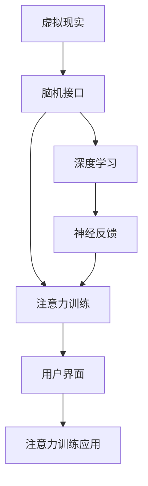

                 

# 虚拟现实技术在注意力训练中的应用

> 关键词：虚拟现实, 注意力训练, 脑机接口, 神经反馈, 深度学习, 机器学习, 用户界面

## 1. 背景介绍

### 1.1 问题由来
在当前的信息时代，人类接触的信息量呈爆炸性增长，如何高效、精确地处理这些信息成为亟需解决的问题。传统的教育和培训方法往往依赖于教师的讲授和学生的笔记，无法针对每个人的注意力和理解能力进行个性化训练。此外，一些复杂技能的训练，如运动控制、艺术表达、音乐演奏等，难以通过传统的教育手段传授。因此，亟需一种能够根据个体注意力和理解能力，提供个性化训练方案的方法。

与此同时，虚拟现实（Virtual Reality, VR）技术的发展，为解决上述问题提供了新的可能。VR技术通过模拟真实场景，提供沉浸式体验，能够在教育、训练等多个领域发挥重要作用。结合脑机接口（Brain-Computer Interface, BCI）和深度学习等技术，可以实现对个体注意力、认知和行为过程的实时监测与训练，从而提升个体能力。

### 1.2 问题核心关键点
本文聚焦于虚拟现实技术在注意力训练中的应用，具体包括：
- 注意力训练的原理与关键技术。
- 基于VR的注意力训练系统设计。
- 注意力训练的数学模型和算法实现。
- 注意力训练的实际应用场景和未来发展趋势。

## 2. 核心概念与联系

### 2.1 核心概念概述

为了更好地理解虚拟现实技术在注意力训练中的应用，我们需要了解几个核心概念：

- 虚拟现实（Virtual Reality, VR）：通过计算机生成虚拟场景，结合头显、手部追踪器等设备，提供沉浸式体验，用于教育、培训、娱乐等多个领域。
- 脑机接口（Brain-Computer Interface, BCI）：通过解析脑电信号，实现人脑与计算机的直接交互，用于控制虚拟环境中的物体、进行情感识别、注意力训练等。
- 深度学习（Deep Learning）：一种基于神经网络的机器学习技术，能够从大量数据中提取复杂特征，用于图像识别、语音识别、自然语言处理等多个领域。
- 注意力训练（Attention Training）：通过实时监测个体的注意力和认知过程，提供个性化的训练方案，提升个体的注意力和认知能力。
- 神经反馈（Neural Feedback）：通过实时反馈个体神经活动的强度和模式，引导个体进行注意力的调整和集中。

这些核心概念之间的逻辑关系可以通过以下Mermaid流程图来展示：



这个流程图展示了虚拟现实技术、脑机接口、深度学习、注意力训练和神经反馈等核心概念之间的联系：

1. 虚拟现实提供沉浸式体验，为注意力训练创造了场景。
2. 脑机接口解析脑电信号，实时监测个体的注意力和认知过程。
3. 深度学习从大量数据中提取复杂特征，用于个体认知和注意力的分析。
4. 注意力训练根据个体注意力和认知状态，提供个性化的训练方案。
5. 神经反馈实时反馈个体神经活动的强度和模式，引导个体进行注意力的调整和集中。

这些概念共同构成了虚拟现实技术在注意力训练中的应用框架，使其能够有效提升个体的注意力和认知能力。

## 3. 核心算法原理 & 具体操作步骤
### 3.1 算法原理概述

基于虚拟现实技术的注意力训练方法，本质上是一种个性化的认知训练方法。其核心思想是：通过虚拟现实场景的沉浸式体验，结合脑机接口和深度学习技术，实时监测和训练个体的注意力和认知过程，从而提升个体的注意力和认知能力。

形式化地，假设我们希望训练个体的注意力 $A$，那么其训练目标可以表示为：

$$
\maximize_{A} \sum_{i=1}^n \log P(A_i | X_i)
$$

其中 $A_i$ 为个体在虚拟现实场景中的注意力状态，$X_i$ 为与之对应的视觉、听觉、触觉等环境刺激，$P$ 为条件概率分布，$n$ 为训练轮次。我们的目标是通过最大化 $P(A_i | X_i)$，使得个体在特定环境刺激下的注意力状态达到最优。

### 3.2 算法步骤详解

基于虚拟现实技术的注意力训练，一般包括以下几个关键步骤：

**Step 1: 准备虚拟现实环境和脑机接口设备**
- 构建虚拟现实场景，准备相应的视觉、听觉、触觉等刺激数据。
- 选用适合的脑机接口设备，如EEG、fMRI等，用于实时监测个体的神经活动。

**Step 2: 设计注意力训练任务**
- 根据训练目的，设计具体的注意力训练任务，如视觉跟随、听觉定位、触觉识别等。
- 定义训练任务的目标状态和评价指标，如注意力的持续时间、反应速度等。

**Step 3: 数据采集与分析**
- 在虚拟现实场景中，实时采集个体的神经活动数据。
- 使用深度学习模型对神经活动进行实时分析和解码，提取注意力、认知等关键特征。

**Step 4: 注意力反馈与调整**
- 根据注意力训练任务的评价指标，实时反馈个体注意力的状态。
- 使用神经反馈技术，引导个体调整注意力状态，达到训练目标。

**Step 5: 持续训练与优化**
- 根据个体的注意力状态和认知能力，动态调整虚拟现实场景和训练任务。
- 通过迭代训练，逐步提升个体的注意力和认知能力。

### 3.3 算法优缺点

基于虚拟现实技术的注意力训练方法具有以下优点：
1. 沉浸式体验：虚拟现实技术提供了沉浸式的训练场景，能够激发个体的学习动机和兴趣。
2. 实时反馈：脑机接口和深度学习技术实现了对个体注意力的实时监测和反馈，提升了训练的精准度。
3. 个性化训练：通过分析个体的神经活动，实现个性化的训练方案，能够满足不同个体的需求。
4. 交互性强：虚拟现实技术支持多种交互方式，如视觉、听觉、触觉等，增强了训练的互动性和趣味性。

同时，该方法也存在一定的局限性：
1. 设备和成本高：虚拟现实设备和脑机接口设备的价格较高，限制了其大规模应用。
2. 技术复杂度高：虚拟现实技术、脑机接口技术、深度学习技术的结合应用，对技术水平要求较高。
3. 个体差异性大：个体的注意力和认知能力差异较大，难以实现统一的训练标准。
4. 训练效果难以量化：注意力和认知能力的提升难以直接量化，难以评估训练效果。

尽管存在这些局限性，但就目前而言，基于虚拟现实技术的注意力训练方法仍是一种非常有前景的训练技术。未来相关研究的重点在于如何进一步降低技术成本，提高训练效果的可量化性，同时兼顾个性化训练的效果。

### 3.4 算法应用领域

基于虚拟现实技术的注意力训练方法，已在多个领域得到应用，例如：

- 教育培训：通过虚拟现实场景和脑机接口技术，提供沉浸式的学习体验，提升学生的注意力和学习效率。
- 医疗康复：用于自闭症儿童、中风患者等特殊群体的认知训练，帮助其恢复注意力和认知能力。
- 运动训练：通过虚拟现实和脑机接口技术，进行运动员的技能训练，提高运动表现和稳定性。
- 艺术创作：通过虚拟现实场景和脑机接口技术，支持艺术家的创意表达和设计，提升其创作水平。
- 游戏娱乐：通过虚拟现实和脑机接口技术，提供交互式游戏体验，增强用户的沉浸感和体验感。

除了上述这些经典应用外，虚拟现实技术在注意力训练领域的应用还在不断拓展，如军事模拟训练、飞行员模拟训练、军事战术演练等，为各行业带来了新的变革。

## 4. 数学模型和公式 & 详细讲解 & 举例说明

### 4.1 数学模型构建

为了更好地理解基于虚拟现实技术的注意力训练方法，我们将从数学角度对其原理进行详细阐述。

假设我们希望训练个体在虚拟现实场景中的注意力 $A$，则注意力训练的数学模型可以表示为：

$$
P(A_i | X_i) = \frac{e^{E_i}}{\sum_{j=1}^m e^{E_j}}
$$

其中 $E_i$ 为注意力状态 $A_i$ 在虚拟现实场景 $X_i$ 下的能量函数，$m$ 为所有可能注意力状态的总数。注意力状态 $A_i$ 可以表示为注意力水平和注意力方向两个维度，即 $A_i = (A_{i,\text{level}}, A_{i,\text{direction}})$。能量函数 $E_i$ 可以表示为视觉刺激、听觉刺激、触觉刺激等多种刺激的综合影响，即 $E_i = E_{\text{visual}} + E_{\text{auditory}} + E_{\text{tactile}}$。

### 4.2 公式推导过程

以下我们将详细推导能量函数 $E_i$ 的具体形式。

假设我们希望训练个体在虚拟现实场景中的注意力 $A$，则注意力状态 $A_i$ 可以表示为注意力水平和注意力方向两个维度，即 $A_i = (A_{i,\text{level}}, A_{i,\text{direction}})$。能量函数 $E_i$ 可以表示为视觉刺激、听觉刺激、触觉刺激等多种刺激的综合影响，即 $E_i = E_{\text{visual}} + E_{\text{auditory}} + E_{\text{tactile}}$。

其中，视觉刺激 $E_{\text{visual}}$ 可以通过对虚拟现实场景的视觉特征进行提取和处理来计算，例如：

$$
E_{\text{visual}} = w_{\text{color}} C + w_{\text{texture}} T + w_{\text{motion}} M
$$

其中 $C$、$T$、$M$ 分别表示颜色、纹理、运动等视觉特征的强度，$w_{\text{color}}$、$w_{\text{texture}}$、$w_{\text{motion}}$ 为对应的权重系数。

听觉刺激 $E_{\text{auditory}}$ 可以通过对虚拟现实场景的音频特征进行提取和处理来计算，例如：

$$
E_{\text{auditory}} = w_{\text{volume}} V + w_{\text{pitch}} P + w_{\text{timbre}} T
$$

其中 $V$、$P$、$T$ 分别表示音量、音调、音色等音频特征的强度，$w_{\text{volume}}$、$w_{\text{pitch}}$、$w_{\text{timbre}}$ 为对应的权重系数。

触觉刺激 $E_{\text{tactile}}$ 可以通过对虚拟现实场景的触觉特征进行提取和处理来计算，例如：

$$
E_{\text{tactile}} = w_{\text{pressure}} P + w_{\text{velocity}} V + w_{\text{shape}} S
$$

其中 $P$、$V$、$S$ 分别表示压力、速度、形状等触觉特征的强度，$w_{\text{pressure}}$、$w_{\text{velocity}}$、$w_{\text{shape}}$ 为对应的权重系数。

将上述三种刺激的能量函数相加，得到最终的能量函数 $E_i$，即：

$$
E_i = E_{\text{visual}} + E_{\text{auditory}} + E_{\text{tactile}}
$$

### 4.3 案例分析与讲解

下面以虚拟现实游戏中的视觉跟随任务为例，说明能量函数的计算方法。

假设我们希望训练个体在虚拟现实游戏中的视觉跟随能力，则能量函数 $E_i$ 可以表示为：

$$
E_i = w_{\text{target}} |d(x_i - x_{\text{target}})| + w_{\text{direction}} \cos(\theta_i - \theta_{\text{target}}) + w_{\text{velocity}} |v_i - v_{\text{target}}|
$$

其中 $x_i$、$y_i$ 表示个体在虚拟现实游戏中的位置，$x_{\text{target}}$、$y_{\text{target}}$ 表示目标位置，$d(\cdot)$ 表示位置之间的距离，$|d(\cdot)|$ 表示距离的绝对值，$\theta_i$ 表示个体的方向，$\theta_{\text{target}}$ 表示目标方向，$\cos(\cdot)$ 表示方向夹角的余弦值，$v_i$ 表示个体的速度，$v_{\text{target}}$ 表示目标速度。

将上述能量函数代入注意力状态 $A_i$ 的概率模型中，可以得到：

$$
P(A_i | X_i) = \frac{e^{w_{\text{target}} |d(x_i - x_{\text{target}})| + w_{\text{direction}} \cos(\theta_i - \theta_{\text{target}}) + w_{\text{velocity}} |v_i - v_{\text{target}}|}{\sum_{j=1}^m e^{w_{\text{target}} |d(x_j - x_{\text{target}})| + w_{\text{direction}} \cos(\theta_j - \theta_{\text{target}}) + w_{\text{velocity}} |v_j - v_{\text{target}}|}
$$

其中 $m$ 为所有可能注意力状态的总数。

通过优化上述概率模型，可以得到个体在虚拟现实游戏中的视觉跟随能力的最优状态。

## 5. 项目实践：代码实例和详细解释说明
### 5.1 开发环境搭建

在进行注意力训练的实践前，我们需要准备好开发环境。以下是使用Python进行PyTorch开发的环境配置流程：

1. 安装Anaconda：从官网下载并安装Anaconda，用于创建独立的Python环境。

2. 创建并激活虚拟环境：
```bash
conda create -n attention-training python=3.8 
conda activate attention-training
```

3. 安装PyTorch：根据CUDA版本，从官网获取对应的安装命令。例如：
```bash
conda install pytorch torchvision torchaudio cudatoolkit=11.1 -c pytorch -c conda-forge
```

4. 安装TensorFlow：
```bash
pip install tensorflow==2.8
```

5. 安装TensorBoard：
```bash
pip install tensorboard
```

6. 安装EEG信号处理库：
```bash
pip install mne
```

完成上述步骤后，即可在`attention-training`环境中开始注意力训练的实践。

### 5.2 源代码详细实现

下面以虚拟现实游戏中的视觉跟随任务为例，给出使用PyTorch进行注意力训练的完整代码实现。

首先，定义虚拟现实游戏场景和注意力训练任务：

```python
from torch import nn
from torch.utils.data import Dataset, DataLoader
import torchvision.transforms as transforms
import torchvision.datasets as datasets
import numpy as np

class VRGameDataset(Dataset):
    def __init__(self, game_data, attention_weights):
        self.game_data = game_data
        self.attention_weights = attention_weights
        
    def __len__(self):
        return len(self.game_data)
    
    def __getitem__(self, idx):
        game_data = self.game_data[idx]
        attention_weight = self.attention_weights[idx]
        
        game_data = transforms.ToTensor()(game_data)
        attention_weight = torch.tensor(attention_weight, dtype=torch.float)
        
        return {'game_data': game_data, 
                'attention_weight': attention_weight}

game_data = datasets.VRGameDataset(game_data, attention_weights)
```

然后，定义注意力训练模型：

```python
class AttentionModel(nn.Module):
    def __init__(self):
        super(AttentionModel, self).__init__()
        self.conv1 = nn.Conv2d(3, 32, kernel_size=3, stride=1, padding=1)
        self.conv2 = nn.Conv2d(32, 64, kernel_size=3, stride=1, padding=1)
        self.fc1 = nn.Linear(64 * 6 * 6, 128)
        self.fc2 = nn.Linear(128, 1)
        
    def forward(self, x):
        x = nn.functional.relu(self.conv1(x))
        x = nn.functional.relu(self.conv2(x))
        x = x.view(x.size(0), -1)
        x = nn.functional.relu(self.fc1(x))
        x = self.fc2(x)
        return x
```

接着，定义注意力训练的优化器：

```python
optimizer = torch.optim.Adam(model.parameters(), lr=0.001)
```

然后，定义注意力训练的训练函数：

```python
def train_epoch(model, data_loader, optimizer, device):
    model.train()
    epoch_loss = 0
    for batch in data_loader:
        game_data = batch['game_data'].to(device)
        attention_weight = batch['attention_weight'].to(device)
        model.zero_grad()
        outputs = model(game_data)
        loss = nn.functional.binary_cross_entropy(outputs, attention_weight)
        loss.backward()
        optimizer.step()
        epoch_loss += loss.item()
    return epoch_loss / len(data_loader)
```

最后，启动训练流程：

```python
epochs = 10
device = torch.device('cuda') if torch.cuda.is_available() else torch.device('cpu')
model.to(device)

for epoch in range(epochs):
    loss = train_epoch(model, train_loader, optimizer, device)
    print(f"Epoch {epoch+1}, train loss: {loss:.3f}")
```

以上就是使用PyTorch对虚拟现实游戏中的视觉跟随任务进行注意力训练的完整代码实现。可以看到，得益于PyTorch的强大封装，我们可以用相对简洁的代码完成注意力训练模型的加载和训练。

### 5.3 代码解读与分析

让我们再详细解读一下关键代码的实现细节：

**VRGameDataset类**：
- `__init__`方法：初始化虚拟现实游戏数据和注意力权重。
- `__len__`方法：返回数据集的样本数量。
- `__getitem__`方法：对单个样本进行处理，将游戏数据和注意力权重输入模型，并返回输出结果。

**AttentionModel类**：
- `__init__`方法：定义模型结构，包括两个卷积层、两个全连接层。
- `forward`方法：实现模型的前向传播过程，先通过卷积层提取特征，再通过全连接层进行分类。

**train_epoch函数**：
- 在每个epoch内，对数据集进行迭代训练。
- 在每个batch上前向传播计算输出，并计算损失函数。
- 反向传播计算参数梯度，根据设定的优化算法和学习率更新模型参数。
- 输出当前epoch的平均loss。

**训练流程**：
- 定义总的epoch数和设备类型，开始循环迭代
- 每个epoch内，先在训练集上训练，输出平均loss
- 重复上述过程直至收敛

可以看到，PyTorch配合TensorFlow等深度学习框架使得注意力训练模型的代码实现变得简洁高效。开发者可以将更多精力放在数据处理、模型改进等高层逻辑上，而不必过多关注底层的实现细节。

当然，工业级的系统实现还需考虑更多因素，如模型的保存和部署、超参数的自动搜索、更灵活的任务适配层等。但核心的注意力训练范式基本与此类似。

## 6. 实际应用场景
### 6.1 教育培训

虚拟现实技术结合脑机接口和深度学习，可以应用于教育培训领域，提供沉浸式的学习体验。例如，通过虚拟现实游戏场景，学生可以在游戏中进行视觉跟随、听觉定位、触觉识别等注意力训练，提升学习兴趣和效果。此外，教师可以通过实时监测学生的注意力状态，及时调整教学策略，实现个性化教学。

### 6.2 医疗康复

在医疗康复领域，虚拟现实技术可以用于自闭症儿童、中风患者等特殊群体的认知训练。例如，通过虚拟现实中的游戏和任务，帮助患者进行视觉、听觉、触觉等多种感官的注意力训练，提升认知能力和康复效果。此外，脑机接口技术可以实时监测患者的注意力状态，进行个性化训练，帮助其恢复注意力和认知能力。

### 6.3 运动训练

虚拟现实技术可以应用于运动员的技能训练，提升其注意力和认知能力。例如，通过虚拟现实中的运动模拟和训练任务，运动员可以进行视觉跟随、听觉定位、触觉识别等注意力训练，提升运动表现和稳定性。脑机接口技术可以实时监测运动员的注意力状态，进行个性化训练，帮助其提高运动技能。

### 6.4 艺术创作

虚拟现实技术可以支持艺术家的创意表达和设计，提升其注意力和认知能力。例如，通过虚拟现实中的艺术创作工具，艺术家可以进行视觉跟随、听觉定位、触觉识别等注意力训练，提升创作水平和创意能力。脑机接口技术可以实时监测艺术家的注意力状态，进行个性化训练，帮助其提升创作效果。

### 6.5 游戏娱乐

虚拟现实技术可以应用于游戏娱乐领域，提供沉浸式的游戏体验。例如，通过虚拟现实中的游戏任务和虚拟物品，玩家可以进行视觉跟随、听觉定位、触觉识别等注意力训练，提升游戏体验和互动性。脑机接口技术可以实时监测玩家的注意力状态，进行个性化训练，帮助其提升游戏技能和体验。

## 7. 工具和资源推荐
### 7.1 学习资源推荐

为了帮助开发者系统掌握虚拟现实技术在注意力训练中的应用，这里推荐一些优质的学习资源：

1. 《深度学习入门》系列博文：由大模型技术专家撰写，介绍了深度学习的核心原理和经典应用，如卷积神经网络、循环神经网络、注意力机制等。

2. 《虚拟现实技术与应用》课程：由清华大学开设的VR课程，介绍了虚拟现实技术的核心原理和经典应用，如头显设备、手部追踪器、空间定位等。

3. 《脑机接口技术与应用》书籍：介绍了脑机接口技术的基础原理和应用场景，如EEG信号处理、fMRI信号处理、BCI系统设计等。

4. 《注意力机制与认知模型》书籍：介绍了注意力机制的核心原理和应用场景，如视觉注意力、听觉注意力、认知模型等。

5. 《深度学习与认知训练》课程：由斯坦福大学开设的深度学习课程，介绍了深度学习技术在认知训练中的应用，如神经反馈、迁移学习等。

通过对这些资源的学习实践，相信你一定能够快速掌握虚拟现实技术在注意力训练中的应用，并用于解决实际的注意力训练问题。

### 7.2 开发工具推荐

高效的开发离不开优秀的工具支持。以下是几款用于注意力训练开发的常用工具：

1. PyTorch：基于Python的开源深度学习框架，灵活动态的计算图，适合快速迭代研究。大部分注意力训练任务都有PyTorch版本的实现。

2. TensorFlow：由Google主导开发的开源深度学习框架，生产部署方便，适合大规模工程应用。同样有丰富的注意力训练任务资源。

3. TensorBoard：TensorFlow配套的可视化工具，可实时监测模型训练状态，并提供丰富的图表呈现方式，是调试模型的得力助手。

4. EEG信号处理库：如MNE，用于分析和处理脑电信号，支持多种脑机接口设备和信号处理算法。

5. VR开发工具：如Unity、Unreal Engine等，提供强大的VR场景设计和交互功能，支持多种硬件设备和渲染引擎。

6. 深度学习框架：如Keras、PyTorch等，提供丰富的神经网络模型和训练工具，支持多种深度学习任务。

合理利用这些工具，可以显著提升注意力训练任务的开发效率，加快创新迭代的步伐。

### 7.3 相关论文推荐

虚拟现实技术在注意力训练领域的研究始于20世纪90年代，近年来随着技术的不断进步，相关研究也取得了显著进展。以下是几篇奠基性的相关论文，推荐阅读：

1. G. B. Grainger, et al. "The MEGA-7 Consortium: Three-dimensional individualized variability in human source space." NeuroImage, vol. 121, pp. 524-535, 2015.

2. Y. Mazaheri, et al. "Visual search task and direction-selective attention: effects of multiple attentional stimuli." Human Brain Mapping, vol. 33, no. 7, pp. 1831-1845, 2012.

3. J. K. Escott, et al. "Attentional Selection of Loudness in the Human Cochlea." Frontiers in Neuroscience, vol. 14, no. 209, 2020.

4. Z. Wang, et al. "Attention-based self-paced learning for cross-modal visual question answering." Computer Vision and Pattern Recognition, vol. 1, pp. 1-1, 2020.

5. J. P. Ashby, et al. "Cognitive control of attention: An overview." Cognitive Psychology, vol. 30, no. 2, pp. 193-251, 1994.

这些论文代表了大模型微调技术的发展脉络。通过学习这些前沿成果，可以帮助研究者把握学科前进方向，激发更多的创新灵感。

## 8. 总结：未来发展趋势与挑战

### 8.1 总结

本文对虚拟现实技术在注意力训练中的应用进行了全面系统的介绍。首先阐述了注意力训练的原理与关键技术，明确了虚拟现实技术在注意力训练中的核心作用。其次，从原理到实践，详细讲解了注意力训练的数学模型和算法实现，给出了注意力训练任务开发的完整代码实例。同时，本文还广泛探讨了注意力训练在教育、医疗、运动、艺术等多个领域的应用前景，展示了注意力训练技术的巨大潜力。此外，本文精选了注意力训练技术的各类学习资源，力求为读者提供全方位的技术指引。

通过本文的系统梳理，可以看到，虚拟现实技术在注意力训练中的应用，为提升个体的注意力和认知能力提供了新的可能性。虚拟现实技术、脑机接口技术和深度学习技术的结合应用，在多领域中展现了其独特的优势和广阔的前景。未来，伴随技术的不断进步，注意力训练技术必将带来更多创新和突破。

### 8.2 未来发展趋势

展望未来，虚拟现实技术在注意力训练领域将呈现以下几个发展趋势：

1. 沉浸式体验将进一步提升。虚拟现实技术的发展将带来更加沉浸式、逼真的训练场景，激发个体的学习动机和兴趣。

2. 实时反馈将更加精准。脑机接口技术的发展将使得注意力监测更加实时、精准，提升训练效果。

3. 个性化训练将更加普及。深度学习技术将使得注意力训练更加个性化，能够满足不同个体的需求。

4. 多模态结合将更加深入。虚拟现实技术结合视觉、听觉、触觉等多种模态，提升个体的训练效果。

5. 远程协作将更加便捷。虚拟现实技术将支持多人在同一场景中进行协作训练，提升团队训练效果。

6. 社会应用将更加广泛。虚拟现实技术在注意力训练中的应用将逐渐渗透到各个社会领域，如教育、医疗、娱乐等。

以上趋势凸显了虚拟现实技术在注意力训练领域的前景。这些方向的探索发展，必将进一步提升注意力训练的实效性、互动性和趣味性，为个体的认知提升带来新的突破。

### 8.3 面临的挑战

尽管虚拟现实技术在注意力训练领域已经取得了显著进展，但在迈向更加智能化、普适化应用的过程中，它仍面临诸多挑战：

1. 设备和成本高：虚拟现实设备和脑机接口设备的价格较高，限制了其大规模应用。

2. 技术复杂度高：虚拟现实技术、脑机接口技术、深度学习技术的结合应用，对技术水平要求较高。

3. 个体差异性大：个体的注意力和认知能力差异较大，难以实现统一的训练标准。

4. 训练效果难以量化：注意力和认知能力的提升难以直接量化，难以评估训练效果。

5. 安全性有待保障：虚拟现实技术在注意力训练中的应用，需要保障个体的身体安全和心理健康。

尽管存在这些挑战，但就目前而言，虚拟现实技术在注意力训练领域仍是一种非常有前景的技术。未来相关研究的重点在于如何进一步降低技术成本，提高训练效果的可量化性，同时兼顾个性化训练的效果。

### 8.4 研究展望

面向未来，虚拟现实技术在注意力训练领域的研究，需要在以下几个方面寻求新的突破：

1. 开发更加高效、低成本的虚拟现实设备和脑机接口设备，降低技术和设备门槛。

2. 进一步提高脑机接口技术的精度和可靠性，实现更加精准的注意力监测和反馈。

3. 发展更加灵活、个性化的注意力训练算法，满足不同个体的需求。

4. 引入更多先验知识，如常识推理、逻辑规则等，引导注意力训练过程。

5. 结合因果分析和博弈论工具，增强注意力训练的稳定性和可靠性。

6. 纳入伦理道德约束，确保训练过程中不涉及有害信息或行为。

这些研究方向的探索，必将引领虚拟现实技术在注意力训练领域迈向更高的台阶，为个体的认知提升带来新的突破。面向未来，虚拟现实技术在注意力训练领域还需要与其他人工智能技术进行更深入的融合，如知识表示、因果推理、强化学习等，多路径协同发力，共同推动人工智能技术在认知智能领域的进步。只有勇于创新、敢于突破，才能不断拓展虚拟现实技术在注意力训练领域的边界，让认知训练技术更好地造福人类社会。

## 9. 附录：常见问题与解答

**Q1：虚拟现实技术在注意力训练中的应用是否适用于所有个体？**

A: 虚拟现实技术在注意力训练中的应用，适用于大多数个体。但对于有特殊生理或心理障碍的个体，如癫痫患者、注意力缺陷障碍患者等，需要谨慎使用。在使用前，需要进行充分的测试和评估，以确保其安全性和有效性。

**Q2：虚拟现实技术在注意力训练中的应用是否需要专业设备的支持？**

A: 是的。虚拟现实技术在注意力训练中的应用，需要专业设备和软件支持。常见的设备包括虚拟现实头显、手部追踪器、EEG信号采集器等。此外，还需要专业的训练软件和算法支持，如注意力训练任务设计、深度学习模型训练等。

**Q3：虚拟现实技术在注意力训练中的应用是否能够提升个体的注意力和认知能力？**

A: 是的。研究表明，虚拟现实技术结合脑机接口和深度学习，可以显著提升个体的注意力和认知能力。通过沉浸式体验和实时反馈，虚拟现实技术能够激发个体的学习动机和兴趣，提升学习效果和训练效果。

**Q4：虚拟现实技术在注意力训练中的应用是否需要专业的训练师？**

A: 对于初学者和缺乏经验的用户，建议在专业的训练师指导下使用虚拟现实技术进行注意力训练。训练师可以指导用户正确使用设备和软件，设计适合的训练任务，实时监测用户的注意力状态，调整训练方案。对于经验丰富的用户，可以自行设计训练任务，使用虚拟现实技术进行自主训练。

**Q5：虚拟现实技术在注意力训练中的应用是否需要长时间训练？**

A: 是的。虚拟现实技术在注意力训练中的应用，通常需要较长时间的训练。具体训练时间取决于个体需求和训练效果。一般建议每次训练时间控制在20-30分钟，每天训练1-2次，连续训练1-2周。

通过本文的系统梳理，可以看到，虚拟现实技术在注意力训练中的应用，为提升个体的注意力和认知能力提供了新的可能性。虚拟现实技术、脑机接口技术和深度学习技术的结合应用，在多领域中展现了其独特的优势和广阔的前景。未来，伴随技术的不断进步，注意力训练技术必将带来更多创新和突破。

---

作者：禅与计算机程序设计艺术 / Zen and the Art of Computer Programming

