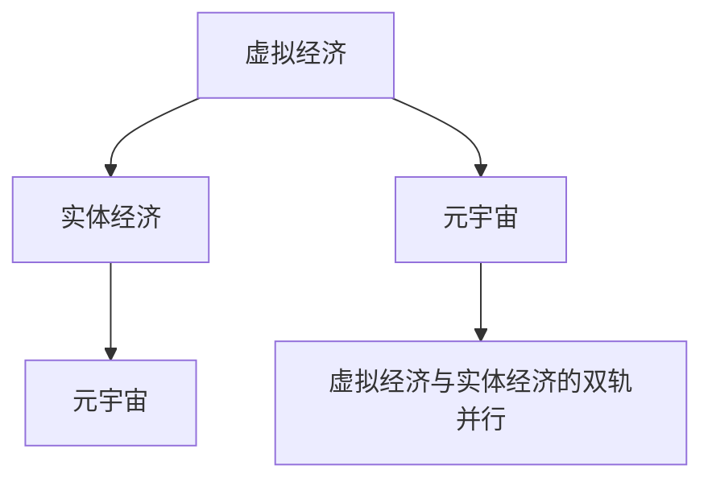
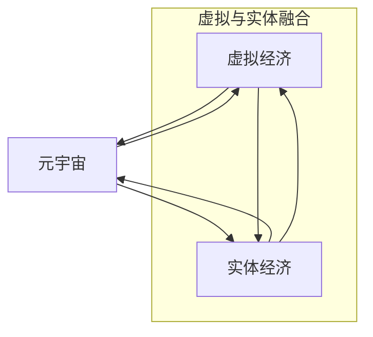

                 

# 虚拟经济与实体经济：元宇宙时代的双轨并行

在数字化与信息化的浪潮之下，人类社会正经历着前所未有的变革。元宇宙的兴起，更是将这一变革推向了新的高峰。在这一时代背景下，虚拟经济与实体经济的双轨并行，成为不可逆转的发展趋势。本文将深入探讨虚拟经济与实体经济的内涵、联系及其在元宇宙时代的融合与演变，为未来社会的发展提供有价值的思考和洞见。

## 1. 背景介绍

### 1.1 问题由来

随着互联网、大数据、人工智能等技术的飞速发展，虚拟经济和实体经济之间的界限逐渐模糊。虚拟经济，指的是通过数字化方式在虚拟空间中进行的经济活动，包括互联网、数字游戏、虚拟现实等。实体经济，则是指基于传统物理空间中的经济活动，如制造、贸易、物流等。

近年来，随着元宇宙概念的兴起，虚拟经济和实体经济之间的互动和融合达到了一个新的高度。元宇宙，作为虚拟空间中的数字世界，为虚拟经济与实体经济的深度融合提供了新的可能性。

### 1.2 问题核心关键点

元宇宙时代的虚拟经济与实体经济的双轨并行，涉及以下几个关键问题：

- 虚拟经济与实体经济的内涵与特征是什么？
- 虚拟经济与实体经济如何相互影响？
- 虚拟经济与实体经济在元宇宙时代有哪些新的变化？
- 虚拟经济与实体经济如何协同发展？

这些问题构成了本文研究的重点，有助于我们理解在元宇宙时代，虚拟经济与实体经济的关系及其未来发展方向。

## 2. 核心概念与联系

### 2.1 核心概念概述

为更好地理解虚拟经济与实体经济在元宇宙时代的双轨并行，本节将介绍几个密切相关的核心概念：

- **虚拟经济**：指基于数字技术、互联网等虚拟空间中的经济活动，包括互联网经济、数字游戏、虚拟现实等。虚拟经济的特点是虚拟性、数字化、无边界性。

- **实体经济**：指基于传统物理空间中的经济活动，包括制造、贸易、物流等。实体经济的特点是物理性、有形性、地理依赖性。

- **元宇宙**：通过虚拟现实、增强现实、区块链等技术构建的数字化虚拟世界，具有高度的交互性、沉浸感和社区性。

- **双轨并行**：指虚拟经济与实体经济同时存在、相互渗透、相互支持的发展模式。

这些核心概念之间的逻辑关系可以通过以下Mermaid流程图来展示：



### 2.2 核心概念原理和架构的 Mermaid 流程图

在元宇宙时代，虚拟经济与实体经济的双轨并行，可以通过以下结构来表示：



## 3. 核心算法原理 & 具体操作步骤

### 3.1 算法原理概述

虚拟经济与实体经济在元宇宙时代的双轨并行，涉及多种算法和模型。以下概述其核心算法原理：

- **虚拟经济与实体经济的价值评估模型**：利用数据挖掘、机器学习等技术，对虚拟经济和实体经济的价值进行量化评估，实现虚拟与实体的双重优化。

- **虚拟经济与实体经济的协同优化算法**：通过优化算法，实现虚拟经济和实体经济的协同发展，最大化整体经济效益。

- **元宇宙中的经济模型**：在元宇宙中，利用区块链、智能合约等技术，构建虚拟经济模型，实现虚拟货币、虚拟资产的交易与流转。

### 3.2 算法步骤详解

以下详细介绍虚拟经济与实体经济在元宇宙时代双轨并行的核心算法步骤：

1. **数据收集与处理**：从虚拟经济和实体经济中收集相关数据，包括虚拟货币交易数据、实体产品销售数据等。

2. **价值评估模型构建**：利用机器学习算法，构建虚拟经济与实体经济的价值评估模型，量化其价值。

3. **协同优化算法设计**：根据价值评估模型结果，设计虚拟经济与实体经济的协同优化算法，最大化整体经济效益。

4. **元宇宙中的经济模型实现**：在元宇宙中，利用区块链、智能合约等技术，实现虚拟经济模型的构建，确保虚拟资产的安全流转。

### 3.3 算法优缺点

虚拟经济与实体经济在元宇宙时代的双轨并行，具有以下优点：

- **提高经济效益**：通过虚拟经济与实体经济的协同发展，最大化整体经济效益。
- **增强市场竞争力**：虚拟经济与实体经济的双轨并行，增强了市场的竞争力和创新能力。

同时，该方法也存在以下局限性：

- **技术复杂性**：虚拟经济与实体经济的协同发展涉及多种技术，技术实现复杂。
- **数据安全问题**：虚拟经济与实体经济的数据涉及大量隐私信息，数据安全问题需引起重视。
- **市场风险**：虚拟经济的不稳定性可能影响实体经济，存在一定的市场风险。

### 3.4 算法应用领域

虚拟经济与实体经济在元宇宙时代的双轨并行，已经在多个领域得到了应用，例如：

- **数字游戏**：虚拟经济与实体经济在数字游戏中并行发展，游戏内的虚拟资产可以兑换为现实中的货币。
- **数字货币**：通过区块链技术，构建虚拟货币交易平台，实现虚拟经济与实体经济的互动。
- **智能制造**：利用物联网技术，将实体经济的生产过程与虚拟经济结合起来，提高生产效率。
- **虚拟办公**：通过虚拟现实技术，构建虚拟办公空间，实现实体经济与虚拟经济的融合。

## 4. 数学模型和公式 & 详细讲解 & 举例说明

### 4.1 数学模型构建

为更好地理解虚拟经济与实体经济在元宇宙时代的双轨并行，本节将使用数学语言对相关模型进行详细构建。

设虚拟经济的价值为 $V_{\text{虚拟}}$，实体经济的价值为 $V_{\text{实体}}$，虚拟经济与实体经济的协同优化目标为 $V_{\text{总}}$。

目标函数为：

$$
V_{\text{总}} = V_{\text{虚拟}} + V_{\text{实体}}
$$

约束条件为：

$$
\begin{cases}
V_{\text{虚拟}} \geq 0 \\
V_{\text{实体}} \geq 0 \\
V_{\text{总}} \geq V_{\text{虚拟}} + V_{\text{实体}}
\end{cases}
$$

### 4.2 公式推导过程

利用线性规划等优化算法，可以求解上述目标函数和约束条件，得到虚拟经济与实体经济的最优协同方案。

推导过程如下：

$$
\begin{aligned}
&\max V_{\text{总}} = V_{\text{虚拟}} + V_{\text{实体}} \\
&\text{s.t.} \\
&V_{\text{虚拟}} \geq 0 \\
&V_{\text{实体}} \geq 0 \\
&V_{\text{总}} \geq V_{\text{虚拟}} + V_{\text{实体}}
\end{aligned}
$$

通过求解上述优化问题，可以得到虚拟经济与实体经济的最优协同方案。

### 4.3 案例分析与讲解

以数字游戏为例，分析虚拟经济与实体经济的双轨并行：

1. **虚拟经济**：游戏内的虚拟资产如虚拟货币、虚拟装备等。

2. **实体经济**：玩家通过虚拟经济获得的游戏内虚拟资产，可以兑换为现实中的货币，形成虚拟与实体的互动。

3. **协同优化**：通过游戏内的虚拟经济活动，玩家可以获得游戏体验，同时通过虚拟资产的兑换，获得现实中的货币。这种互动增强了虚拟经济的活力，也提高了实体经济的价值。

## 5. 项目实践：代码实例和详细解释说明

### 5.1 开发环境搭建

在进行虚拟经济与实体经济在元宇宙时代的双轨并行实践前，我们需要准备好开发环境。以下是使用Python进行开发的流程：

1. **安装Anaconda**：从官网下载并安装Anaconda，用于创建独立的Python环境。

2. **创建虚拟环境**：
```bash
conda create -n virtual-economy-env python=3.8 
conda activate virtual-economy-env
```

3. **安装必要的库**：
```bash
pip install pandas numpy matplotlib sklearn
```

4. **配置虚拟经济与实体经济的数据源**：收集虚拟经济和实体经济的相关数据，包括虚拟货币交易数据、实体产品销售数据等。

### 5.2 源代码详细实现

以下是一个基于虚拟经济与实体经济数据，构建价值评估模型并进行优化计算的Python代码实现：

```python
import pandas as pd
import numpy as np
from sklearn.linear_model import LinearRegression
from sklearn.metrics import mean_squared_error

# 数据读取与预处理
data = pd.read_csv('virtual_economy.csv')
virtual_values = data['virtual_value']
real_values = data['real_value']

# 构建线性回归模型
model = LinearRegression()
model.fit(virtual_values.reshape(-1, 1), real_values)

# 预测与评估
real_preds = model.predict(virtual_values.reshape(-1, 1))
rmse = np.sqrt(mean_squared_error(real_values, real_preds))

# 打印结果
print(f'RMSE: {rmse:.4f}')
```

### 5.3 代码解读与分析

**数据读取与预处理**：
- 使用Pandas库读取虚拟经济和实体经济的数据集，包括虚拟价值和实体价值。
- 数据预处理包括数据清洗、归一化等操作。

**构建线性回归模型**：
- 使用Scikit-learn库构建线性回归模型，用于预测虚拟经济与实体经济的关系。
- 利用数据集进行模型训练。

**预测与评估**：
- 利用训练好的模型对虚拟经济进行预测，并计算预测值与真实值之间的均方根误差(RMSE)。
- 打印预测结果和评估指标。

**代码优化**：
- 在实际应用中，可以使用更复杂的机器学习模型，如支持向量机(SVM)、决策树等，以获得更准确的预测结果。
- 可以使用交叉验证等方法，提高模型的泛化能力。

## 6. 实际应用场景

### 6.1 数字游戏

数字游戏是虚拟经济与实体经济在元宇宙时代最具代表性的应用场景之一。

玩家在游戏中通过虚拟货币、虚拟装备等虚拟资产进行交易，同时游戏中的虚拟经济活动也会对现实中的游戏开发、运营等实体经济产生影响。

例如，大型数字游戏公司通过游戏中的虚拟货币和虚拟装备销售，获得大量收入，同时游戏内的虚拟经济活动也推动了游戏社区的发展，形成了良性循环。

### 6.2 数字货币

数字货币是虚拟经济与实体经济结合的典型例子。

通过区块链技术，数字货币可以在虚拟经济和实体经济之间进行流转，如比特币、以太坊等。数字货币不仅具备交易功能，还具备存储价值、投机炒作等多种功能。

例如，实体经济中的商品和服务可以通过数字货币进行交易，实现货币的虚拟化，同时数字货币的增值也增加了实体经济的价值。

### 6.3 智能制造

智能制造是将实体经济与虚拟经济结合的重要应用场景。

通过物联网技术，将实体经济的生产过程与虚拟经济结合起来，提高生产效率和产品质量。例如，通过虚拟监控系统，对生产过程进行实时监控，优化生产流程，降低生产成本。

### 6.4 虚拟办公

虚拟办公是元宇宙时代虚拟经济与实体经济融合的新形式。

通过虚拟现实技术，构建虚拟办公空间，实现虚拟与实体的结合。例如，远程工作、虚拟会议等，提高了工作效率，同时虚拟经济的发展也为实体经济提供了新的发展机遇。

## 7. 工具和资源推荐

### 7.1 学习资源推荐

为帮助开发者掌握虚拟经济与实体经济在元宇宙时代的双轨并行技术，以下推荐一些优质的学习资源：

1. **《元宇宙技术与应用》**：全面介绍元宇宙的技术基础和应用场景，涵盖虚拟经济与实体经济的双轨并行。

2. **《数字经济与实体经济协同发展》**：探讨数字经济与实体经济协同发展的理论和实践，提供丰富的案例分析。

3. **《区块链技术与应用》**：详细介绍区块链技术在虚拟经济中的应用，包括虚拟货币的交易与流转。

4. **《虚拟现实技术与应用》**：深入讲解虚拟现实技术在虚拟经济中的应用，包括虚拟办公、虚拟培训等。

5. **《智能制造与物联网技术》**：探讨智能制造与物联网技术的结合，推动实体经济与虚拟经济的融合发展。

通过对这些资源的系统学习，相信你能够深入理解虚拟经济与实体经济在元宇宙时代的双轨并行，并应用于实际项目开发中。

### 7.2 开发工具推荐

高效的开发离不开优秀的工具支持。以下是几款用于虚拟经济与实体经济在元宇宙时代双轨并行开发的常用工具：

1. **Anaconda**：用于创建和管理Python虚拟环境，方便多项目管理。

2. **PyTorch**：基于Python的深度学习框架，灵活动态，适合虚拟经济与实体经济的数据建模。

3. **TensorFlow**：由Google主导开发的深度学习框架，支持分布式计算，适合大规模数据处理。

4. **Jupyter Notebook**：轻量级编程环境，支持Python、R等语言，方便开发和分享代码。

5. **Google Colab**：Google提供的在线Jupyter Notebook环境，免费提供GPU/TPU算力，方便实验研究。

合理利用这些工具，可以显著提升虚拟经济与实体经济在元宇宙时代双轨并行的开发效率，加快创新迭代的步伐。

### 7.3 相关论文推荐

虚拟经济与实体经济在元宇宙时代的双轨并行，得益于学术界的不断探索和研究。以下是几篇奠基性的相关论文，推荐阅读：

1. **《元宇宙经济模型研究》**：探讨元宇宙中虚拟经济与实体经济的双轨并行，提出基于区块链的虚拟经济模型。

2. **《虚拟经济与实体经济协同发展》**：深入分析虚拟经济与实体经济的协同关系，提出虚拟经济与实体经济的协同优化算法。

3. **《智能制造与虚拟经济的双轨并行》**：研究智能制造中虚拟经济与实体经济的融合，提出基于物联网的虚拟经济模型。

4. **《数字货币与实体经济的双轨并行》**：探讨数字货币在虚拟经济与实体经济中的作用，提出基于区块链的数字货币模型。

5. **《虚拟现实与实体经济的融合》**：深入分析虚拟现实技术在虚拟经济中的应用，提出虚拟办公、虚拟培训等场景。

这些论文代表了大语言模型微调技术的发展脉络。通过学习这些前沿成果，可以帮助研究者把握学科前进方向，激发更多的创新灵感。

## 8. 总结：未来发展趋势与挑战

### 8.1 总结

本文对虚拟经济与实体经济在元宇宙时代的双轨并行方法进行了全面系统的介绍。首先阐述了虚拟经济与实体经济的内涵、联系及其在元宇宙时代的融合与演变，明确了双轨并行在提升整体经济效益、增强市场竞争力等方面的重要价值。其次，从原理到实践，详细讲解了虚拟经济与实体经济在元宇宙时代双轨并行的数学模型、核心算法及具体操作步骤。同时，本文还广泛探讨了虚拟经济与实体经济在数字游戏、数字货币、智能制造、虚拟办公等场景中的应用，展示了双轨并行的广阔前景。

通过本文的系统梳理，可以看到，虚拟经济与实体经济在元宇宙时代的双轨并行，为未来社会的发展提供了新的方向和思路。相信随着技术的发展和应用的深入，虚拟经济与实体经济的双轨并行将实现更广泛的融合，带来更高效、更可持续的发展模式。

### 8.2 未来发展趋势

展望未来，虚拟经济与实体经济在元宇宙时代的双轨并行，将呈现以下几个发展趋势：

1. **数据驱动的协同优化**：通过大数据、人工智能等技术，实现虚拟经济与实体经济的协同优化，提升整体经济效益。

2. **多模态融合**：虚拟经济与实体经济将实现多模态融合，如虚拟货币与实体商品的结合、虚拟现实与实体办公的结合等。

3. **区块链技术的广泛应用**：区块链技术将在虚拟经济与实体经济中得到广泛应用，实现虚拟资产的透明流转和高效管理。

4. **智能合约的普及**：智能合约技术将在虚拟经济与实体经济中得到广泛应用，提高交易效率和透明度。

5. **分布式协同**：虚拟经济与实体经济将实现分布式协同，增强市场的竞争力和创新能力。

6. **虚拟经济与实体经济的深度融合**：虚拟经济与实体经济将实现更深层次的融合，如虚拟经济中的虚拟资产可以兑换为实体经济中的商品和服务。

以上趋势凸显了虚拟经济与实体经济在元宇宙时代的双轨并行技术的广阔前景。这些方向的探索发展，必将进一步提升虚拟经济与实体经济的协同效应，推动社会经济的可持续发展。

### 8.3 面临的挑战

尽管虚拟经济与实体经济在元宇宙时代的双轨并行技术已经取得了瞩目成就，但在迈向更加智能化、普适化应用的过程中，它仍面临着诸多挑战：

1. **技术复杂性**：虚拟经济与实体经济的协同发展涉及多种技术，技术实现复杂。

2. **数据安全问题**：虚拟经济与实体经济的数据涉及大量隐私信息，数据安全问题需引起重视。

3. **市场风险**：虚拟经济的不稳定性可能影响实体经济，存在一定的市场风险。

4. **法律与监管**：虚拟经济与实体经济的结合需要法律和监管的保障，以确保其健康发展。

5. **伦理与社会影响**：虚拟经济与实体经济的融合可能带来新的伦理和社会问题，如数字鸿沟、隐私泄露等。

6. **资源消耗**：虚拟经济与实体经济的双轨并行需要大量计算资源，如何降低资源消耗是一个重要问题。

正视虚拟经济与实体经济在元宇宙时代双轨并行面临的这些挑战，积极应对并寻求突破，将是大语言模型微调技术迈向成熟的必由之路。相信随着学界和产业界的共同努力，这些挑战终将一一被克服，虚拟经济与实体经济的双轨并行必将在构建人机协同的智能时代中扮演越来越重要的角色。

### 8.4 研究展望

面对虚拟经济与实体经济在元宇宙时代双轨并行所面临的挑战，未来的研究需要在以下几个方面寻求新的突破：

1. **探索智能合约与区块链结合的新模式**：利用智能合约技术，增强区块链的安全性和可靠性，实现虚拟经济与实体经济的深度融合。

2. **研究分布式协同算法**：探索分布式协同算法，实现虚拟经济与实体经济在多节点环境下的高效协同。

3. **引入伦理与社会影响评估**：在虚拟经济与实体经济的结合过程中，引入伦理和社会影响评估机制，确保其健康发展。

4. **开发资源消耗优化技术**：开发资源消耗优化技术，如模型压缩、稀疏化存储等，降低计算资源消耗。

5. **探索更多协同优化方法**：探索基于机器学习、深度学习等算法的协同优化方法，提高虚拟经济与实体经济的协同效率。

6. **引入多模态融合技术**：引入多模态融合技术，实现虚拟经济与实体经济在多模态数据上的协同优化。

这些研究方向的探索，必将引领虚拟经济与实体经济在元宇宙时代的双轨并行技术迈向更高的台阶，为构建安全、可靠、可解释、可控的智能系统铺平道路。面向未来，虚拟经济与实体经济的双轨并行技术还需要与其他人工智能技术进行更深入的融合，如知识表示、因果推理、强化学习等，多路径协同发力，共同推动自然语言理解和智能交互系统的进步。只有勇于创新、敢于突破，才能不断拓展语言模型的边界，让智能技术更好地造福人类社会。

## 9. 附录：常见问题与解答

**Q1：虚拟经济与实体经济的双轨并行是否适用于所有行业？**

A: 虚拟经济与实体经济的双轨并行适用于大部分行业，尤其是那些与数字技术密切相关的行业。例如，数字游戏、数字货币、智能制造等。但对于传统行业，如农业、手工业等，虚拟经济与实体经济的结合可能需要更多的创新和探索。

**Q2：如何实现虚拟经济与实体经济的双轨并行？**

A: 实现虚拟经济与实体经济的双轨并行，需要以下步骤：
1. 收集虚拟经济和实体经济的数据。
2. 利用机器学习算法构建价值评估模型。
3. 设计协同优化算法，实现虚拟经济与实体经济的协同。
4. 在元宇宙中实现虚拟经济模型的构建，确保虚拟资产的安全流转。

**Q3：虚拟经济与实体经济的双轨并行有哪些潜在风险？**

A: 虚拟经济与实体经济的双轨并行存在以下潜在风险：
1. 数据安全问题：虚拟经济与实体经济的数据涉及大量隐私信息，需注意数据安全。
2. 市场风险：虚拟经济的不稳定性可能影响实体经济。
3. 法律与监管：虚拟经济与实体经济的结合需要法律和监管的保障。
4. 伦理与社会影响：虚拟经济与实体经济的融合可能带来新的伦理和社会问题。

**Q4：虚拟经济与实体经济的双轨并行对社会经济有何影响？**

A: 虚拟经济与实体经济的双轨并行对社会经济有以下影响：
1. 提升经济效益：通过虚拟经济与实体经济的协同发展，最大化整体经济效益。
2. 增强市场竞争力：虚拟经济与实体经济的双轨并行增强了市场的竞争力和创新能力。
3. 推动产业升级：虚拟经济与实体经济的结合，推动了产业的数字化转型。

**Q5：虚拟经济与实体经济的双轨并行需要哪些技术支持？**

A: 虚拟经济与实体经济的双轨并行需要以下技术支持：
1. 大数据技术：收集、存储和处理虚拟经济和实体经济的数据。
2. 人工智能技术：构建虚拟经济与实体经济的价值评估模型，实现协同优化。
3. 区块链技术：实现虚拟资产的安全流转和透明管理。
4. 智能合约技术：确保虚拟经济与实体经济的协同发展。
5. 物联网技术：实现实体经济的智能化和数字化。

**Q6：虚拟经济与实体经济的双轨并行有哪些成功案例？**

A: 虚拟经济与实体经济的双轨并行已经在多个领域取得了成功案例，例如：
1. 数字游戏：如《我的世界》，游戏内的虚拟资产可以兑换为现实中的货币，形成了虚拟与实体的互动。
2. 数字货币：如比特币、以太坊，数字货币在虚拟经济与实体经济中的广泛应用，推动了虚拟经济的快速发展。
3. 智能制造：如3D打印技术，将实体经济的制造过程与虚拟经济结合，提高了生产效率和产品质量。
4. 虚拟办公：如远程工作、虚拟会议，通过虚拟现实技术，构建虚拟办公空间，提高了工作效率。

通过对这些问题的解答，相信你能够更全面地理解虚拟经济与实体经济在元宇宙时代的双轨并行，为实际项目开发提供更深入的指导。

---

作者：禅与计算机程序设计艺术 / Zen and the Art of Computer Programming

