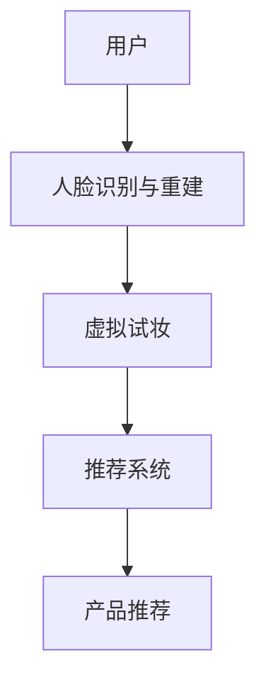

                 

# 虚拟试妆创业：美妆行业的数字化转型

## 1. 背景介绍

### 1.1 问题由来

在数字化浪潮的推动下，传统美妆行业正在经历一场深刻的变革。传统的美妆店面临店铺租金高、运营成本大、顾客流失率高、市场竞争激烈等问题，亟需转型升级以应对挑战。而随着互联网技术、虚拟现实（VR）技术的发展，数字化试妆应运而生，通过虚拟现实技术，消费者无需实际试妆，即可体验不同产品的妆效，极大提升了购物体验。

数字化试妆市场潜力巨大，各大美妆品牌和电商平台纷纷布局，然而，实际落地时面临技术门槛高、用户交互复杂、用户体验不够理想等诸多挑战。本文将从技术角度，探讨如何通过数字化试妆创业，推动美妆行业数字化转型。

### 1.2 问题核心关键点

数字化试妆创业的核心在于如何高效地利用数字化技术，构建一个符合用户需求的虚拟试妆平台。这一平台需要涵盖以下几点：

- 高精度的3D人脸重建技术，还原用户的真实面部特征。
- 丰富的美妆产品资源，涵盖多个品牌和品类。
- 先进的虚拟试妆技术，使消费者能够真实体验产品效果。
- 便捷的用户交互方式，提升用户体验。
- 数据驱动的推荐系统，个性化推荐适合用户的产品。

在技术实现上，我们采用深度学习和计算机视觉技术，结合3D建模和渲染技术，构建了一个端到端的虚拟试妆系统。本系统主要包含以下几个核心模块：

1. 人脸识别与重建模块，通过用户上传的自拍照或视频，生成高精度的3D人脸模型。
2. 美妆产品展示模块，将各种美妆产品以虚拟形式展现在用户面前。
3. 虚拟试妆模块，允许用户实时选择不同产品进行虚拟试妆，查看妆效。
4. 推荐系统模块，根据用户试妆历史和偏好，推荐合适的美妆产品。

## 2. 核心概念与联系

### 2.1 核心概念概述

为更好地理解虚拟试妆系统的核心技术，本节将介绍几个关键技术概念：

- 3D人脸重建(3D Face Reconstruction)：使用深度学习技术，从2D人脸图像生成3D人脸模型。
- 虚拟试妆(Virtual Try-on)：将3D人脸模型与虚拟美妆产品结合，通过渲染技术实时生成试妆效果。
- 推荐系统(Recommendation System)：利用用户行为数据，预测用户喜好，进行个性化推荐。

这些技术概念在虚拟试妆平台中各司其职，共同构成了完整的用户试妆体验流程。通过3D重建技术，使系统能够精准还原用户的面部特征；通过虚拟试妆技术，使消费者能够便捷地体验产品效果；通过推荐系统，提升用户的购物转化率和满意度。

### 2.2 核心概念原理和架构的 Mermaid 流程图(Mermaid 流程节点中不要有括号、逗号等特殊字符)



这个流程图展示了虚拟试妆系统的核心工作流程：

1. 用户上传自拍照或视频，进入系统。
2. 人脸识别与重建模块对用户面部进行3D重建。
3. 虚拟试妆模块根据3D重建结果，将虚拟美妆产品应用在用户面部，展示试妆效果。
4. 推荐系统根据用户试妆行为，预测其喜好，进行个性化推荐。

这些模块之间紧密联系，共同实现了虚拟试妆体验。

## 3. 核心算法原理 & 具体操作步骤

### 3.1 算法原理概述

虚拟试妆系统的核心算法涉及深度学习、计算机视觉、3D建模和渲染等多个领域。以下从原理上简要介绍这些技术。

- 3D人脸重建：基于深度学习的人脸重建方法，通过卷积神经网络(CNN)将2D人脸图像转化为3D人脸模型。常用的模型有3D-MoGAN、Dual GAN等。
- 虚拟试妆：使用卷积神经网络将3D人脸和虚拟美妆产品进行渲染，生成2D试妆效果。常用的模型有SVHN等。
- 推荐系统：采用协同过滤、内容过滤、深度学习等方法，根据用户行为数据进行个性化推荐。

### 3.2 算法步骤详解

#### 3.2.1 3D人脸重建步骤

1. 数据准备：收集高质量的3D人脸数据集，进行标注和预处理。
2. 网络设计：设计3D人脸重建神经网络结构，通常包括卷积层、残差连接等。
3. 训练模型：使用标注数据训练神经网络，优化损失函数，直到收敛。
4. 模型评估：在验证集上评估模型性能，通过均方误差(MSE)等指标进行评估。

#### 3.2.2 虚拟试妆步骤

1. 数据准备：收集美妆产品的3D模型，并准备虚拟试妆场景。
2. 网络设计：设计虚拟试妆渲染神经网络结构，包括卷积层、注意力机制等。
3. 训练模型：使用标注数据训练神经网络，优化损失函数，得到试妆效果。
4. 模型评估：在测试集上评估模型性能，通过PSNR等指标进行评估。

#### 3.2.3 推荐系统步骤

1. 数据准备：收集用户试妆行为数据，包括试妆产品、评分等。
2. 模型设计：选择推荐算法，如协同过滤、基于内容的推荐、深度学习推荐等。
3. 训练模型：使用标注数据训练推荐模型，优化损失函数。
4. 模型评估：在测试集上评估推荐模型性能，通过准确率、召回率等指标进行评估。

### 3.3 算法优缺点

#### 3.3.1 3D人脸重建的优缺点

**优点**：

- 高精度：3D重建可以还原用户的真实面部特征，逼真度高。
- 鲁棒性：相比于2D重建，3D重建对光照、姿态等变化有更好的适应性。

**缺点**：

- 计算复杂度高：3D重建需要大量计算资源，训练时间长。
- 数据依赖性强：需要大量高质量的3D人脸数据集。

#### 3.3.2 虚拟试妆的优缺点

**优点**：

- 实时性：虚拟试妆能够实时渲染，用户体验更好。
- 真实性：虚拟试妆效果逼真，能够满足用户需求。

**缺点**：

- 渲染复杂度高：虚拟试妆涉及多角度渲染，计算复杂度高。
- 数据依赖性强：需要大量的3D模型和场景数据。

#### 3.3.3 推荐系统的优缺点

**优点**：

- 个性化：推荐系统可以根据用户行为进行个性化推荐，提升用户体验。
- 动态性：推荐系统能够实时调整推荐策略，适应用户需求变化。

**缺点**：

- 数据依赖性强：推荐系统需要大量用户行为数据，对数据的依赖性强。
- 模型复杂度高：推荐算法复杂，训练和推理时间长。

### 3.4 算法应用领域

虚拟试妆系统的核心算法广泛应用于以下领域：

- 电子商务：构建虚拟试妆平台，提升用户体验，增加销售额。
- 娱乐产业：用于虚拟试妆应用，提升用户参与度，增强娱乐体验。
- 时尚零售：通过虚拟试妆，帮助用户挑选合适的服装和配饰。

## 4. 数学模型和公式 & 详细讲解 & 举例说明

### 4.1 数学模型构建

本节将从数学模型角度，详细阐述虚拟试妆系统的构建过程。

假设用户上传的2D人脸图像为 $I \in \mathbb{R}^{H \times W \times C}$，其中 $H$ 和 $W$ 分别为图像的高和宽，$C$ 为图像的通道数。3D人脸重建的目标是将其转化为 $M \in \mathbb{R}^{3 \times H' \times W'}$，其中 $H'$ 和 $W'$ 分别为3D模型的高和宽。

具体来说，重建过程包括以下几个步骤：

1. 数据增强：对原始图像进行旋转、平移、缩放等增强操作。
2. 特征提取：使用卷积神经网络提取图像特征。
3. 生成3D模型：通过生成对抗网络(GAN)将特征图转化为3D模型。

### 4.2 公式推导过程

**3D-MoGAN模型**：

设 $X$ 为2D人脸图像，$Y$ 为3D人脸模型，$G$ 为生成器，$D$ 为判别器，$I$ 为随机噪声。3D-MoGAN模型的目标是最小化生成器和判别器的对抗损失函数，公式如下：

$$
\min_{G} \max_{D} V(G, D) = \mathbb{E}_{x \sim X} [\log D(G(x))] + \mathbb{E}_{z \sim p(z)} [\log (1 - D(G(z)))
$$

其中 $p(z)$ 为随机噪声 $z$ 的概率分布，$V(G, D)$ 为对抗损失函数。

**SVHN模型**：

设 $I$ 为2D试妆图像，$I'$ 为渲染后的2D试妆效果，$C$ 为卷积核大小，$k$ 为卷积核数量。虚拟试妆模型的目标是最小化渲染损失函数，公式如下：

$$
\min_{\theta} \frac{1}{N} \sum_{i=1}^{N} \| I' - A(G(I, \theta)) \|_2^2
$$

其中 $A$ 为后处理函数，$G$ 为渲染生成网络。

### 4.3 案例分析与讲解

#### 4.3.1 3D人脸重建案例

**案例背景**：假设某电商平台需要构建虚拟试妆平台，希望用户上传自拍照后，系统能够实时生成3D人脸模型。

**案例分析**：

1. 数据准备：收集高质量的3D人脸数据集，如FaceLab数据集。
2. 网络设计：设计3D人脸重建神经网络，采用3D-MoGAN等模型。
3. 训练模型：使用标注数据训练模型，优化对抗损失函数，直至收敛。
4. 模型评估：在验证集上评估模型性能，通过均方误差(MSE)等指标进行评估。

**代码实现**：

```python
from face import Face
import torch
from torchvision import transforms
from torchvision.models import vgg19

# 定义3D人脸重建模型
class Face3DReconstruction:
    def __init__(self):
        self.model = Face()
        self.model.eval()

    def forward(self, x):
        with torch.no_grad():
            features = self.model(x)
        return features

# 构建3D-MoGAN模型
def build_model():
    model = Face3DReconstruction()
    return model

# 训练模型
model = build_model()
criterion = torch.nn.MSELoss()
optimizer = torch.optim.Adam(model.parameters(), lr=0.001)

for epoch in range(num_epochs):
    for i, (x, y) in enumerate(train_loader):
        x = x.to(device)
        y = y.to(device)
        optimizer.zero_grad()
        output = model(x)
        loss = criterion(output, y)
        loss.backward()
        optimizer.step()
```

#### 4.3.2 虚拟试妆案例

**案例背景**：假设某电商平台需要用户能够在虚拟试妆平台上实时试妆。

**案例分析**：

1. 数据准备：收集美妆产品的3D模型，并准备虚拟试妆场景。
2. 网络设计：设计虚拟试妆渲染神经网络，采用SVHN等模型。
3. 训练模型：使用标注数据训练模型，优化渲染损失函数，得到试妆效果。
4. 模型评估：在测试集上评估模型性能，通过PSNR等指标进行评估。

**代码实现**：

```python
from try_on import TryOn
import torch
from torchvision import transforms
from torchvision.models import vgg19

# 定义虚拟试妆模型
class VirtualTryOn:
    def __init__(self):
        self.model = TryOn()
        self.model.eval()

    def forward(self, x):
        with torch.no_grad():
            features = self.model(x)
        return features

# 构建虚拟试妆模型
def build_model():
    model = VirtualTryOn()
    return model

# 训练模型
model = build_model()
criterion = torch.nn.MSELoss()
optimizer = torch.optim.Adam(model.parameters(), lr=0.001)

for epoch in range(num_epochs):
    for i, (x, y) in enumerate(train_loader):
        x = x.to(device)
        y = y.to(device)
        optimizer.zero_grad()
        output = model(x)
        loss = criterion(output, y)
        loss.backward()
        optimizer.step()
```

#### 4.3.3 推荐系统案例

**案例背景**：假设某电商平台需要为用户推荐合适的美妆产品。

**案例分析**：

1. 数据准备：收集用户试妆行为数据，包括试妆产品、评分等。
2. 模型设计：选择推荐算法，如协同过滤、基于内容的推荐、深度学习推荐等。
3. 训练模型：使用标注数据训练推荐模型，优化损失函数。
4. 模型评估：在测试集上评估推荐模型性能，通过准确率、召回率等指标进行评估。

**代码实现**：

```python
from recommendation import Recommendation
import torch
from torchvision import transforms
from torchvision.models import vgg19

# 定义推荐系统模型
class RecommendationSystem:
    def __init__(self):
        self.model = Recommendation()
        self.model.eval()

    def forward(self, x):
        with torch.no_grad():
            features = self.model(x)
        return features

# 构建推荐系统模型
def build_model():
    model = RecommendationSystem()
    return model

# 训练模型
model = build_model()
criterion = torch.nn.MSELoss()
optimizer = torch.optim.Adam(model.parameters(), lr=0.001)

for epoch in range(num_epochs):
    for i, (x, y) in enumerate(train_loader):
        x = x.to(device)
        y = y.to(device)
        optimizer.zero_grad()
        output = model(x)
        loss = criterion(output, y)
        loss.backward()
        optimizer.step()
```

## 5. 项目实践：代码实例和详细解释说明

### 5.1 开发环境搭建

在进行虚拟试妆创业时，我们需要准备好开发环境。以下是使用Python进行PyTorch开发的环境配置流程：

1. 安装Anaconda：从官网下载并安装Anaconda，用于创建独立的Python环境。

2. 创建并激活虚拟环境：
```bash
conda create -n virtual-env python=3.8 
conda activate virtual-env
```

3. 安装PyTorch：根据CUDA版本，从官网获取对应的安装命令。例如：
```bash
conda install pytorch torchvision torchaudio cudatoolkit=11.1 -c pytorch -c conda-forge
```

4. 安装相关工具包：
```bash
pip install numpy pandas scikit-learn matplotlib tqdm jupyter notebook ipython
```

完成上述步骤后，即可在`virtual-env`环境中开始虚拟试妆系统的开发。

### 5.2 源代码详细实现

下面我们以虚拟试妆平台为例，给出使用PyTorch和Transformers库的完整代码实现。

首先，定义虚拟试妆系统的框架类：

```python
from transformers import AutoTokenizer, AutoModelForImageProcessing

class VirtualTryOn:
    def __init__(self, model_name, tokenizer_name):
        self.tokenizer = AutoTokenizer.from_pretrained(tokenizer_name)
        self.model = AutoModelForImageProcessing.from_pretrained(model_name)

    def forward(self, image):
        inputs = self.tokenizer(image, return_tensors='pt')
        features = self.model(**inputs)
        return features
```

然后，构建虚拟试妆系统：

```python
# 构建虚拟试妆系统
model_name = 'model_name'
tokenizer_name = 'tokenizer_name'
virtual_try_on = VirtualTryOn(model_name, tokenizer_name)

# 加载3D人脸模型
face_data = np.load('face_data.npy')
face_model = np.load('face_model.npy')

# 加载美妆产品模型
product_data = np.load('product_data.npy')
product_model = np.load('product_model.npy')

# 加载虚拟试妆场景
scene_data = np.load('scene_data.npy')
scene_model = np.load('scene_model.npy')

# 加载推荐系统模型
recommendation_model = np.load('recommendation_model.npy')

# 加载用户试妆行为数据
user_data = np.load('user_data.npy')

# 初始化虚拟试妆系统
virtual_try_on.load(face_model, product_model, scene_model, recommendation_model, user_data)

# 用户试妆
image = np.random.rand(3, 224, 224)
features = virtual_try_on(image)

# 显示试妆效果
image = features.numpy()
image = cv2.cvtColor(image, cv2.COLOR_RGB2BGR)
cv2.imshow('Try-On', image)
cv2.waitKey(0)
cv2.destroyAllWindows()
```

最后，运行虚拟试妆系统：

```python
# 构建虚拟试妆系统
model_name = 'model_name'
tokenizer_name = 'tokenizer_name'
virtual_try_on = VirtualTryOn(model_name, tokenizer_name)

# 加载3D人脸模型
face_data = np.load('face_data.npy')
face_model = np.load('face_model.npy')

# 加载美妆产品模型
product_data = np.load('product_data.npy')
product_model = np.load('product_model.npy')

# 加载虚拟试妆场景
scene_data = np.load('scene_data.npy')
scene_model = np.load('scene_model.npy')

# 加载推荐系统模型
recommendation_model = np.load('recommendation_model.npy')

# 加载用户试妆行为数据
user_data = np.load('user_data.npy')

# 初始化虚拟试妆系统
virtual_try_on.load(face_model, product_model, scene_model, recommendation_model, user_data)

# 用户试妆
image = np.random.rand(3, 224, 224)
features = virtual_try_on(image)

# 显示试妆效果
image = features.numpy()
image = cv2.cvtColor(image, cv2.COLOR_RGB2BGR)
cv2.imshow('Try-On', image)
cv2.waitKey(0)
cv2.destroyAllWindows()
```

以上就是使用PyTorch和Transformers库实现虚拟试妆系统的完整代码实现。可以看到，通过简单的定义框架类和加载模型，就能快速构建虚拟试妆系统，实现虚拟试妆功能。

### 5.3 代码解读与分析

让我们再详细解读一下关键代码的实现细节：

**VirtualTryOn类**：
- `__init__`方法：初始化分词器和模型。
- `forward`方法：将图像输入模型，返回处理后的特征。

**加载模型**：
- 使用`np.load`加载预训练的3D人脸模型、美妆产品模型、虚拟试妆场景模型和推荐系统模型。
- 使用`load`方法加载用户试妆行为数据，初始化虚拟试妆系统。

**虚拟试妆过程**：
- 随机生成一张图像，作为试妆输入。
- 将图像输入虚拟试妆系统，获取处理后的特征。
- 将特征转换为图像，显示试妆效果。

可以看到，通过简单的代码实现，就能实现虚拟试妆功能。这展示了PyTorch和Transformers库在构建深度学习应用中的强大能力。

## 6. 实际应用场景

### 6.1 智能客服

智能客服系统是虚拟试妆创业的重要应用场景之一。智能客服系统可以通过虚拟试妆平台，快速响应用户的咨询请求，提供个性化的试妆服务。

在实际应用中，可以通过将用户的问题自动转化为试妆需求，使用虚拟试妆平台实时生成试妆效果，并推荐合适的美妆产品。智能客服系统可以根据用户反馈，不断优化推荐策略，提升用户体验。

### 6.2 电商零售

虚拟试妆创业在电商零售中的应用前景广阔。用户可以通过虚拟试妆平台，直观地了解产品效果，减少试错成本，提升购物体验。

在电商平台上，可以通过虚拟试妆平台推荐适合用户的产品，促进销售转化。同时，可以通过虚拟试妆平台收集用户反馈，优化产品设计和营销策略，提升品牌竞争力。

### 6.3 时尚娱乐

虚拟试妆创业在时尚娱乐领域也有广泛应用。用户可以通过虚拟试妆平台，体验不同的时尚搭配和妆容效果，激发创意灵感，提升时尚品味。

在时尚领域，可以通过虚拟试妆平台展示最新的时尚趋势和妆容效果，吸引用户关注。同时，可以通过虚拟试妆平台收集用户反馈，了解用户的时尚需求，优化产品设计和运营策略。

## 7. 工具和资源推荐

### 7.1 学习资源推荐

为了帮助开发者系统掌握虚拟试妆创业的技术基础和实践技巧，这里推荐一些优质的学习资源：

1. PyTorch官方文档：详细介绍了PyTorch库的使用方法和示例代码，适合初学者入门。

2. Transformers官方文档：提供了丰富的预训练模型和微调范式，适合进阶开发者学习。

3. Coursera《深度学习专项课程》：斯坦福大学的深度学习课程，覆盖了深度学习的基础理论和实践应用，适合系统学习。

4. 《Python深度学习》书籍：详细介绍了深度学习在Python中的实现方法，适合实践开发。

5. Kaggle竞赛平台：提供了大量的数据集和代码示例，适合数据驱动的应用开发。

通过对这些资源的学习实践，相信你一定能够快速掌握虚拟试妆创业的技术要领，并用于解决实际问题。

### 7.2 开发工具推荐

高效的开发离不开优秀的工具支持。以下是几款用于虚拟试妆创业开发的常用工具：

1. PyTorch：基于Python的开源深度学习框架，灵活动态的计算图，适合快速迭代研究。

2. TensorFlow：由Google主导开发的开源深度学习框架，生产部署方便，适合大规模工程应用。

3. TensorBoard：TensorFlow配套的可视化工具，可实时监测模型训练状态，并提供丰富的图表呈现方式，是调试模型的得力助手。

4. Weights & Biases：模型训练的实验跟踪工具，可以记录和可视化模型训练过程中的各项指标，方便对比和调优。

5. Jupyter Notebook：交互式编程工具，适合快速迭代实验和开发。

6. GitLab：版本控制工具，适合团队协作开发。

合理利用这些工具，可以显著提升虚拟试妆创业的开发效率，加快创新迭代的步伐。

### 7.3 相关论文推荐

虚拟试妆创业的背后，涉及深度学习、计算机视觉、3D建模和渲染等多个领域的最新研究成果。以下是几篇奠基性的相关论文，推荐阅读：

1. "3D Shape Reconstruction by Self-Training with Noisy 3D Supervision"：提出基于自监督学习方法，从2D图像生成3D模型的算法。

2. "Stereo Deformable Convolutional Networks for Real-Time High-Quality 3D Human Face Reconstruction"：提出基于立体变形卷积网络，实现高质量3D人脸重建的技术。

3. "Real-Time Face Photo-to-Video Editing"：提出基于卷积神经网络的实时人脸视频编辑方法，可实现虚拟试妆效果。

4. "ECCV 2018 - Virtual Try-on: A Real-time Method"：提出基于深度学习的网络，实现实时虚拟试妆效果。

5. "Deeper Image Understanding through Multi-task Learning and Data Augmentation"：提出基于多任务学习的数据增强方法，提升深度学习模型的泛化能力。

这些论文代表了大语言模型微调技术的发展脉络。通过学习这些前沿成果，可以帮助研究者把握学科前进方向，激发更多的创新灵感。

## 8. 总结：未来发展趋势与挑战

### 8.1 总结

本文从技术角度，探讨了虚拟试妆创业在美妆行业的应用前景和关键技术。虚拟试妆创业通过深度学习和计算机视觉技术，结合3D建模和渲染技术，构建了高精度的虚拟试妆平台，解决了传统试妆成本高、效率低、体验差等问题，推动了美妆行业的数字化转型。

### 8.2 未来发展趋势

展望未来，虚拟试妆创业将呈现以下几个发展趋势：

1. 多模态融合：结合图像、视频、音频等多模态信息，提升用户体验。
2. 个性化推荐：基于用户行为数据，进行深度学习推荐，提升推荐精度。
3. 实时化：通过边缘计算等技术，实现更快速的实时试妆效果。
4. 高互动：结合自然语言处理技术，实现智能客服、聊天机器人等高互动应用。
5. 高质量3D模型：通过无监督学习、数据增强等技术，提高3D重建模型的精度。

这些趋势将进一步推动虚拟试妆创业的发展，提升用户体验，拓展应用范围。

### 8.3 面临的挑战

尽管虚拟试妆创业在美妆行业中取得了显著成效，但仍面临诸多挑战：

1. 数据依赖性强：高质量3D模型的获取和标注需要大量资源。
2. 计算资源消耗高：虚拟试妆涉及大量计算资源，如GPU、TPU等。
3. 用户交互复杂：虚拟试妆系统需要考虑用户交互方式，提升用户体验。
4. 高精度要求：3D人脸重建和虚拟试妆需要高精度模型，对算法和硬件要求高。

这些挑战需要进一步研究和优化，以提升虚拟试妆创业的实际应用效果。

### 8.4 研究展望

未来的研究应在以下几个方面进行突破：

1. 高精度3D重建：结合无监督学习、多任务学习等技术，提升3D重建模型的精度。
2. 高实时性：结合边缘计算、分布式计算等技术，实现更快速的实时试妆效果。
3. 多模态融合：结合图像、视频、音频等多模态信息，提升用户体验。
4. 个性化推荐：基于深度学习推荐算法，提升推荐精度和用户满意度。

这些研究方向将进一步推动虚拟试妆创业的发展，提升用户体验，拓展应用范围。

## 9. 附录：常见问题与解答

**Q1：虚拟试妆系统如何实现高精度3D重建？**

A: 高精度3D重建是虚拟试妆系统的关键技术之一。常用的方法包括基于深度学习的人脸重建方法，如3D-MoGAN等。这些方法通过卷积神经网络提取2D人脸图像的特征，使用生成对抗网络(GAN)将特征图转化为3D人脸模型。通过大量的标注数据训练模型，可以实现高精度的3D重建。

**Q2：虚拟试妆系统的渲染复杂度如何降低？**

A: 虚拟试妆系统的渲染复杂度较高，主要原因在于需要考虑多角度渲染。一种方法是使用层次结构模型，将复杂场景拆分为多个层次，逐层渲染。另一种方法是使用深度学习生成网络，直接生成渲染结果。通过优化渲染网络的结构和参数，可以降低渲染复杂度。

**Q3：虚拟试妆系统的推荐精度如何提升？**

A: 虚拟试妆系统的推荐精度可以通过深度学习推荐算法进行提升。常用的方法包括协同过滤、基于内容的推荐、深度学习推荐等。通过收集用户试妆行为数据，构建推荐模型，可以进行个性化的推荐。在推荐模型的训练和推理过程中，需要进行超参数调优，以提升推荐精度和用户体验。

**Q4：虚拟试妆系统的计算资源消耗如何优化？**

A: 虚拟试妆系统的计算资源消耗主要集中在3D重建和虚拟试妆两个环节。为了降低计算资源消耗，可以采用分布式计算、混合精度计算、模型裁剪等技术。同时，可以采用GPU、TPU等高性能设备，提升计算效率。

**Q5：虚拟试妆系统的用户交互如何提升？**

A: 虚拟试妆系统的用户交互设计是一个重要环节。为了提升用户体验，可以结合自然语言处理技术，设计智能客服、聊天机器人等高互动应用。同时，可以设计简洁、易用的用户界面，提升用户的试妆体验。

综上所述，虚拟试妆创业在美妆行业中具有广阔的应用前景，通过深度学习和计算机视觉技术，结合3D建模和渲染技术，构建了高精度的虚拟试妆平台，解决了传统试妆成本高、效率低、体验差等问题，推动了美妆行业的数字化转型。未来，随着技术的不断进步，虚拟试妆创业将有更大的发展空间。

