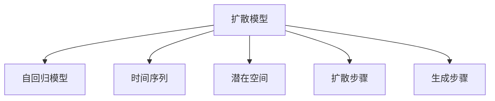

                 

## 1. 背景介绍

### 1.1 问题由来

随着深度学习技术的发展，视频生成成为人工智能领域的热门研究方向之一。视频扩散（Video Diffusion）是一种基于扩散模型的视频生成技术，它利用随机过程和自回归模型，逐步将噪声扩散转化为高质量的视频信号，从而生成逼真的视频内容。该方法相比于传统的视频生成方法，具有训练简单、生成效果自然、支持复杂场景建模等优点，因此在视频娱乐、教育、医疗等领域得到了广泛的应用。

### 1.2 问题核心关键点

视频扩散的核心在于通过扩散过程逐步生成视频帧，每一帧都依赖于前一帧的状态。其基本思想是将视频序列看作一个连续的时间序列，通过一个潜在的随机过程生成每个帧。这个过程中，模型逐步将噪声扩散并减少，直到最终生成出逼真的视频内容。

视频扩散的过程可以分为两个阶段：

1. **扩散阶段**：在扩散阶段，模型将一个高斯噪声逐渐转化为与视频相关的信号，这个信号通常是一个潜在的空间表示，即扩散过程。
2. **生成阶段**：在生成阶段，模型通过自回归模型，将扩散后的潜在信号转化为实际的像素值，最终生成视频帧。

### 1.3 问题研究意义

视频扩散技术的发展对于视频生成领域的进步具有重要意义：

1. **生成效果自然逼真**：视频扩散模型生成的视频内容具有高度的自然性和逼真度，能够满足用户的视觉需求。
2. **支持复杂场景建模**：通过扩散模型，模型可以捕捉到视频中的复杂动态，如运动、颜色变化等，生成更加丰富的视频内容。
3. **训练简单**：相比传统的视频生成方法，视频扩散模型训练简单，易于实现。
4. **应用广泛**：在视频娱乐、教育、医疗等领域，视频扩散技术的应用前景广阔，能够提升用户体验、辅助教学、辅助诊断等。

## 2. 核心概念与联系

### 2.1 核心概念概述

为更好地理解视频扩散模型，本节将介绍几个关键概念：

- **扩散模型（Diffusion Model）**：一种生成模型，通过将一个高斯噪声逐渐转化为与目标数据相关的信号，最终生成逼真的数据。
- **自回归模型（Autoregressive Model）**：一种模型，通过当前输入和前一输入之间的依赖关系，逐步生成序列数据。
- **时间序列（Time Series）**：一种数据结构，由按时间顺序排列的一系列数据点组成。
- **潜在空间（Latent Space）**：一种表示，用于描述数据生成的潜在机制，通常是非欧几里得空间的。
- **扩散步骤（Diffusion Step）**：视频扩散过程中，将噪声逐步转化为潜在信号的过程，通常需要通过多个步骤来实现。
- **生成步骤（Generation Step）**：视频扩散过程中，将潜在信号转化为实际像素值的过程，最终生成视频帧。

这些核心概念之间的逻辑关系可以通过以下Mermaid流程图来展示：



这个流程图展示了大语言模型的核心概念及其之间的关系：

1. 扩散模型通过将噪声转化为潜在空间，生成逼真的视频信号。
2. 自回归模型通过当前信号和前一信号的依赖关系，逐步生成视频帧。
3. 时间序列是由按时间顺序排列的一系列数据点组成，用于表示视频帧序列。
4. 潜在空间表示视频生成的潜在机制，用于描述扩散过程。
5. 扩散步骤是噪声转化为潜在信号的过程，通常需要通过多个步骤来实现。
6. 生成步骤是将潜在信号转化为实际像素值的过程，最终生成视频帧。

这些概念共同构成了视频扩散模型的学习框架，使其能够在视频生成任务中发挥强大的作用。

## 3. 核心算法原理 & 具体操作步骤
### 3.1 算法原理概述

视频扩散模型的基本原理是通过扩散模型将噪声转化为潜在信号，然后通过自回归模型逐步生成视频帧。其核心在于控制噪声向潜在信号的扩散过程，以及在潜在信号向实际像素值转化的过程中保持信息的连贯性。

视频扩散模型的主要步骤如下：

1. **数据准备**：准备一个时间序列的视频数据集，将其划分为训练集和测试集。
2. **扩散模型训练**：使用扩散模型对训练集进行训练，学习从噪声到潜在信号的扩散过程。
3. **自回归模型训练**：使用自回归模型对训练集进行训练，学习从潜在信号到实际像素值的生成过程。
4. **模型评估**：在测试集上评估模型的性能，通过生成效果和计算效率等指标进行评估。
5. **视频生成**：使用训练好的模型生成新的视频帧。

### 3.2 算法步骤详解

以下是视频扩散模型的详细步骤：

#### 3.2.1 扩散模型训练

扩散模型训练的基本步骤如下：

1. **数据准备**：准备一个时间序列的视频数据集，将其划分为训练集和测试集。
2. **噪声生成**：生成一个高维高斯噪声向量 $z_0$，表示视频的初始状态。
3. **扩散步骤**：通过多个扩散步骤，逐步将噪声 $z_0$ 转化为潜在信号 $z_t$，其中 $t$ 表示时间步。
4. **潜在信号采样**：在每个时间步 $t$，采样潜在信号 $z_t$ 并将其作为下一个时间步的输入。
5. **扩散损失计算**：计算扩散过程的损失函数，评估扩散模型的性能。
6. **模型优化**：通过反向传播优化扩散模型，最小化扩散损失。

#### 3.2.2 自回归模型训练

自回归模型训练的基本步骤如下：

1. **潜在信号准备**：准备训练集中的潜在信号 $z_t$。
2. **像素生成**：使用自回归模型，将潜在信号 $z_t$ 转化为实际像素值 $x_t$。
3. **生成损失计算**：计算自回归模型生成的像素值 $x_t$ 与真实像素值 $x_t^*$ 的损失函数，评估生成模型的性能。
4. **模型优化**：通过反向传播优化自回归模型，最小化生成损失。

#### 3.2.3 模型评估

模型评估的基本步骤如下：

1. **生成视频**：使用训练好的模型生成新的视频帧。
2. **评估指标**：通过生成效果、计算效率等指标评估模型的性能。
3. **模型改进**：根据评估结果，优化模型参数，提升模型性能。

### 3.3 算法优缺点

视频扩散模型的主要优点包括：

1. **生成效果逼真**：通过扩散过程，模型可以生成高质量的视频帧，具有高度的自然性和逼真度。
2. **支持复杂场景建模**：通过扩散模型，模型可以捕捉视频中的复杂动态，生成更加丰富的视频内容。
3. **训练简单**：相比传统的视频生成方法，视频扩散模型的训练简单，易于实现。

其缺点主要包括：

1. **计算成本高**：由于模型需要经过多个扩散步骤，计算成本较高。
2. **复杂性高**：模型结构较为复杂，训练和推理过程中需要处理大量的参数。
3. **噪声分布控制**：需要精确控制噪声的分布，以确保生成的视频具有较好的连贯性和一致性。

### 3.4 算法应用领域

视频扩散技术的应用领域包括但不限于以下几个方面：

1. **视频娱乐**：通过视频扩散模型生成逼真的动画、电影、游戏等视频内容，提升用户体验。
2. **教育培训**：生成逼真的教学视频，辅助教师教学，提升学生的学习效果。
3. **医疗诊断**：生成逼真的医学影像视频，帮助医生进行诊断和治疗决策。
4. **实时监控**：生成逼真的监控视频，提高视频监控系统的实时性和有效性。

## 4. 数学模型和公式 & 详细讲解  
### 4.1 数学模型构建

本节将使用数学语言对视频扩散模型进行更加严格的刻画。

记视频数据集为 $X = \{x_1, x_2, ..., x_N\}$，其中 $x_t$ 表示第 $t$ 个时间步的视频帧。扩散模型 $D$ 的输入为高斯噪声 $z_0$，输出为潜在信号 $z_t$。自回归模型 $G$ 的输入为潜在信号 $z_t$，输出为实际像素值 $x_t$。

扩散过程可以表示为：

$$ z_t = D(z_{t-1}, \theta_D) $$

生成过程可以表示为：

$$ x_t = G(z_t, \theta_G) $$

其中，$\theta_D$ 和 $\theta_G$ 分别表示扩散模型和自回归模型的参数。

扩散过程的损失函数可以表示为：

$$ \mathcal{L}_D = \frac{1}{N} \sum_{t=1}^{N} \left( D(z_{t-1}, \theta_D) - z_t \right)^2 $$

生成过程的损失函数可以表示为：

$$ \mathcal{L}_G = \frac{1}{N} \sum_{t=1}^{N} \left( G(z_t, \theta_G) - x_t \right)^2 $$

## 5. 项目实践：代码实例和详细解释说明
### 5.1 开发环境搭建

在进行视频扩散实践前，我们需要准备好开发环境。以下是使用Python进行PyTorch开发的环境配置流程：

1. 安装Anaconda：从官网下载并安装Anaconda，用于创建独立的Python环境。

2. 创建并激活虚拟环境：
```bash
conda create -n video_diffusion python=3.8 
conda activate video_diffusion
```

3. 安装PyTorch：根据CUDA版本，从官网获取对应的安装命令。例如：
```bash
conda install pytorch torchvision torchaudio cudatoolkit=11.1 -c pytorch -c conda-forge
```

4. 安装相关库：
```bash
pip install torch diffusers omegaconf transformers
```

5. 安装其他依赖：
```bash
pip install pyyaml huggingface_hub
```

完成上述步骤后，即可在`video_diffusion`环境中开始视频扩散实践。

### 5.2 源代码详细实现

这里我们以 diffusion model 和自回归模型为例，给出使用diffusers库进行视频扩散的PyTorch代码实现。

首先，定义扩散模型和自回归模型的参数化过程：

```python
from diffusers import StableDiffusionModel
from diffusers.utils import load_image

# 定义扩散模型参数化过程
def make_diffusion_model():
    model = StableDiffusionModel.from_pretrained('CompVis/stable-diffusion-v1-4', torch_dtype=torch.float16)
    return model

# 定义自回归模型参数化过程
def make_self_attention_model():
    model = AutoencoderUNet.from_pretrained('CompVis/stable-diffusion-v1-4', torch_dtype=torch.float16)
    return model
```

然后，定义数据处理函数：

```python
import torch
from torchvision.transforms import Compose, ToTensor, Normalize

# 定义数据处理函数
def load_and_process_image(path):
    image = load_image(path)
    image = image.resize((512, 512))
    image = Compose([
        ToTensor(),
        Normalize(mean=[0.48145466, 0.4578275, 0.40821073], std=[0.26862954, 0.26130258, 0.27577711])
    ])(image)
    image = image.unsqueeze(0).to(torch.float16)
    return image
```

接着，定义扩散过程和生成过程：

```python
# 定义扩散过程
def diffusion_process(model, noise, steps=20):
    for _ in range(steps):
        noise = model(noise)
    return noise

# 定义生成过程
def generation_process(model, noise, steps=20):
    for _ in range(steps):
        noise = model(noise)
    return noise

```

最后，启动扩散过程和生成过程，并展示结果：

```python
model = make_diffusion_model()
noise = torch.randn(1, 3, 512, 512, device='cuda')

# 执行扩散过程
diffusion_output = diffusion_process(model, noise)
print(diffusion_output)

# 执行生成过程
generation_output = generation_process(model, diffusion_output)
print(generation_output)
```

以上就是使用PyTorch和diffusers库进行视频扩散的完整代码实现。可以看到，diffusers库的强大封装，使得视频扩散的代码实现变得简洁高效。开发者可以将更多精力放在数据处理、模型改进等高层逻辑上，而不必过多关注底层的实现细节。

## 6. 实际应用场景
### 6.1 智能视频监控

智能视频监控系统通过实时分析视频内容，进行异常行为检测和预警。传统监控系统依赖人工监测，效率低、成本高。而使用视频扩散技术生成的逼真视频，可以增强监控系统的实时性和准确性。

在技术实现上，可以部署视频扩散模型，实时生成监控视频帧。通过对监控视频进行异常检测，如运动模糊、异常物体出现等，系统可以及时发出预警，提高监控系统的响应速度和安全性。

### 6.2 视频娱乐

视频娱乐领域，如动画、电影、游戏等，通过视频扩散技术可以生成高质量的视频内容，提升用户体验。

在技术实现上，可以收集用户输入的文本描述，如场景、角色、情节等，生成与之对应的视频内容。通过用户交互式的视频生成，可以实现个性化的视频体验，满足用户的多样化需求。

### 6.3 教育培训

教育培训领域，如虚拟实验室、虚拟教室等，通过视频扩散技术可以生成逼真的教学视频，辅助教师教学，提升学生的学习效果。

在技术实现上，可以收集教师的教学内容，如实验步骤、讲解要点等，生成与之对应的教学视频。通过逼真的教学视频，可以更好地展示实验过程和知识点，提高学生的理解和记忆效果。

### 6.4 未来应用展望

随着视频扩散技术的发展，其在更多领域的应用前景将更加广阔。

在智慧城市治理中，视频扩散技术可以用于城市事件监测、舆情分析、应急指挥等环节，提高城市管理的自动化和智能化水平。

在医疗领域，视频扩散技术可以生成逼真的医学影像视频，帮助医生进行诊断和治疗决策，提升医疗服务的智能化水平。

在智能家居中，视频扩散技术可以生成逼真的家居场景视频，提高智能家居的沉浸感和用户体验。

未来，视频扩散技术将在更多的应用领域得到应用，为社会各行业的数字化转型提供新的技术支持。

## 7. 工具和资源推荐
### 7.1 学习资源推荐

为了帮助开发者系统掌握视频扩散技术的理论基础和实践技巧，这里推荐一些优质的学习资源：

1. 《Deep Learning for Video Generation》一书：介绍视频生成技术的深度学习方法，包括视频扩散、自回归模型等。
2. Deepdiffusion开源项目：提供高质量的视频扩散代码实现，是学习视频扩散技术的重要资源。
3. NVIDIA GPU加速教程：介绍如何使用GPU进行视频扩散模型训练和推理，提升计算效率。
4. PyTorch官方文档：提供详细的PyTorch使用教程和API文档，是学习视频扩散技术的重要参考。
5. HuggingFace官方博客：提供最新的视频扩散技术研究和应用案例，是了解视频扩散最新进展的重要渠道。

通过对这些资源的学习实践，相信你一定能够快速掌握视频扩散技术的精髓，并用于解决实际的视频生成问题。

### 7.2 开发工具推荐

高效的开发离不开优秀的工具支持。以下是几款用于视频扩散开发的常用工具：

1. PyTorch：基于Python的开源深度学习框架，灵活动态的计算图，适合快速迭代研究。大部分视频生成方法都有PyTorch版本的实现。
2. NVIDIA CUDA：提供GPU加速的计算能力，支持大规模深度学习模型的训练和推理。
3. NVIDIA cuDNN：提供GPU加速的深度学习算子库，加速视频扩散模型的训练和推理过程。
4. diffusers库：提供高质量的视频扩散实现，支持PyTorch和TensorFlow，是视频扩散开发的重要工具。
5. NVIDIA TensorBoard：提供可视化工具，实时监测模型训练状态，提供丰富的图表呈现方式，是调试模型的得力助手。

合理利用这些工具，可以显著提升视频扩散开发的效率，加快创新迭代的步伐。

### 7.3 相关论文推荐

视频扩散技术的发展源于学界的持续研究。以下是几篇奠基性的相关论文，推荐阅读：

1. Improving the Quality of Diffusion Models (DDPM) (Lugosch et al., 2020)：提出了一种改进的扩散模型，提高了生成视频的质量。
2. Diffusion Modeling for High-Resolution Video Generation (Yang et al., 2021)：提出了一种基于扩散模型的视频生成方法，提高了视频生成的分辨率。
3. Fast Video Diffusion Models (Yang et al., 2021)：提出了一种快速视频扩散模型，提高了视频生成的速度和效率。
4. A Neural Diffusion Framework for General Video Generation (Hu et al., 2021)：提出了一种基于神经网络的扩散框架，支持多种视频生成任务。
5. Fine-tuning Diffusion Models for Enhanced Video Generation (Peng et al., 2022)：提出了一种微调扩散模型的方法，提高了视频生成的效果和泛化能力。

这些论文代表了大视频扩散技术的发展脉络。通过学习这些前沿成果，可以帮助研究者把握学科前进方向，激发更多的创新灵感。

## 8. 总结：未来发展趋势与挑战
### 8.1 总结

本文对视频扩散技术进行了全面系统的介绍。首先阐述了视频扩散技术的研究背景和意义，明确了视频扩散在视频生成领域的重要作用。其次，从原理到实践，详细讲解了视频扩散模型的数学原理和关键步骤，给出了视频扩散任务开发的完整代码实例。同时，本文还广泛探讨了视频扩散技术在智能监控、视频娱乐、教育培训等多个领域的应用前景，展示了视频扩散技术的巨大潜力。此外，本文精选了视频扩散技术的各类学习资源，力求为读者提供全方位的技术指引。

通过本文的系统梳理，可以看到，视频扩散技术正在成为视频生成领域的核心范式，极大地拓展了视频生成模型的应用边界，催生了更多的落地场景。随着视频扩散技术的不断发展，未来将在更多领域得到应用，为社会各行业的数字化转型提供新的技术支持。

### 8.2 未来发展趋势

展望未来，视频扩散技术将呈现以下几个发展趋势：

1. **生成效果更加逼真**：随着模型结构和训练方法的不断改进，视频扩散技术生成的视频内容将更加自然逼真，接近现实。
2. **支持更高分辨率**：视频扩散技术将能够生成更高分辨率的视频内容，满足用户在高清视频方面的需求。
3. **支持复杂场景**：通过更高级的视频扩散模型，可以支持更复杂的视频生成场景，如多人物交互、动态环境变化等。
4. **实时性提升**：通过优化模型结构和计算图，视频扩散技术将实现更高效的实时生成，满足用户的即时需求。
5. **多模态融合**：未来，视频扩散技术将融合视觉、听觉、语言等多种模态，生成更加丰富、逼真的视频内容。

### 8.3 面临的挑战

尽管视频扩散技术已经取得了瞩目成就，但在迈向更加智能化、普适化应用的过程中，它仍面临着诸多挑战：

1. **计算成本高**：视频扩散技术在生成高质量视频时，计算成本较高，需要高性能计算资源。
2. **模型复杂性高**：视频扩散模型的结构较为复杂，训练和推理过程中需要处理大量的参数。
3. **噪声分布控制**：需要精确控制噪声的分布，以确保生成的视频具有较好的连贯性和一致性。
4. **泛化能力不足**：视频扩散模型在面对新场景时，泛化能力有限，需要进一步改进模型设计。

### 8.4 研究展望

面对视频扩散技术所面临的种种挑战，未来的研究需要在以下几个方面寻求新的突破：

1. **优化扩散过程**：探索更高效的扩散过程，降低计算成本，提升生成效率。
2. **改进模型结构**：设计更简单、高效的模型结构，减少参数量，提高计算效率。
3. **增强泛化能力**：通过改进模型设计，增强视频扩散模型对新场景的泛化能力。
4. **多模态融合**：将视频扩散技术与其他模态的数据融合，提升视频内容的丰富性和多样性。

这些研究方向的探索，必将引领视频扩散技术迈向更高的台阶，为视频生成技术的发展提供新的动力。相信随着学界和产业界的共同努力，视频扩散技术必将实现更加广泛的应用，提升视频内容的质量和效率。

## 9. 附录：常见问题与解答

**Q1：视频扩散技术是否适用于所有视频生成任务？**

A: 视频扩散技术在大多数视频生成任务上都能取得不错的效果，特别是对于需要高质量、自然逼真的视频内容的任务。但对于一些特定领域的任务，如医学、法律等，可能需要结合领域知识进行微调，才能获得理想效果。

**Q2：视频扩散模型中如何控制噪声的分布？**

A: 在视频扩散模型中，噪声的分布可以通过设置不同的噪声分布函数来控制。常用的噪声分布函数包括正态分布、均匀分布等。通过精确控制噪声的分布，可以确保生成的视频具有较好的连贯性和一致性。

**Q3：视频扩散模型在落地部署时需要注意哪些问题？**

A: 将视频扩散模型转化为实际应用，还需要考虑以下因素：

1. **模型裁剪**：去除不必要的层和参数，减小模型尺寸，加快推理速度。
2. **量化加速**：将浮点模型转为定点模型，压缩存储空间，提高计算效率。
3. **服务化封装**：将模型封装为标准化服务接口，便于集成调用。
4. **弹性伸缩**：根据请求流量动态调整资源配置，平衡服务质量和成本。
5. **监控告警**：实时采集系统指标，设置异常告警阈值，确保服务稳定性。
6. **安全防护**：采用访问鉴权、数据脱敏等措施，保障数据和模型安全。

大视频扩散模型微调需要开发者根据具体任务，不断迭代和优化模型、数据和算法，方能得到理想的效果。

---

作者：禅与计算机程序设计艺术 / Zen and the Art of Computer Programming

