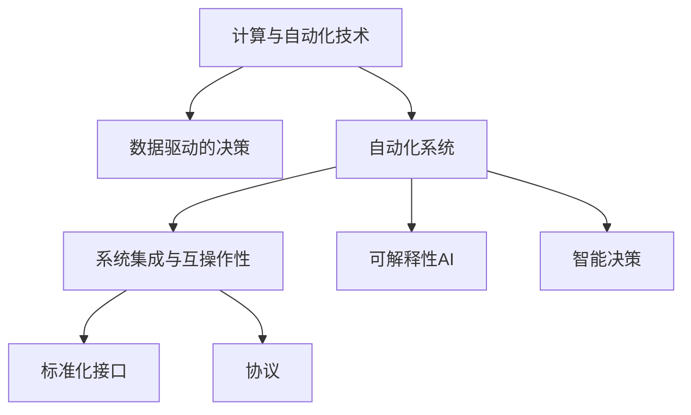

                 

# 计算变化与自动化技术的结合

## 1. 背景介绍

### 1.1 问题由来

随着数字化的深入发展，计算与自动化技术在各行各业的应用越来越广泛。无论是智能制造、智慧农业，还是金融科技、智能客服，计算与自动化技术的结合都为传统产业带来了革命性的变革。然而，计算与自动化技术的结合并非一帆风顺，面临诸多挑战和问题。如何更好地理解和应用计算与自动化技术，成为当前技术研究和工程实践的重要课题。

### 1.2 问题核心关键点

在计算与自动化技术的结合过程中，以下几个关键点尤为重要：

1. **数据管理与处理**：数据的收集、存储、清洗、处理是计算与自动化技术的基础，对数据的质量和完整性有较高要求。
2. **算法与模型选择**：选择合适的算法和模型是实现自动化决策的核心，影响自动化系统的效率和效果。
3. **自动化系统的可解释性**：自动化系统需要具备良好的可解释性，便于用户理解和信任。
4. **系统集成与互操作性**：多个系统之间的集成和互操作性是实现跨领域、跨行业的自动化应用的关键。
5. **安全性与隐私保护**：自动化系统需要在数据处理和决策过程中保证数据安全和用户隐私。

### 1.3 问题研究意义

研究和解决计算与自动化技术的结合问题，具有重要的理论和实际意义：

1. **提升产业效率**：通过计算与自动化技术的结合，可以大幅提升产业的生产效率、运营效率和服务效率，降低人工成本。
2. **优化资源配置**：自动化技术能够更好地优化资源的配置和利用，提升资源利用率和经济效益。
3. **推动技术创新**：计算与自动化技术的结合能够激发新技术和新应用的开发，推动技术进步和创新。
4. **促进社会进步**：自动化技术在医疗、教育、交通等领域的应用，能够改善人类生活质量，促进社会进步。

## 2. 核心概念与联系

### 2.1 核心概念概述

为更好地理解计算与自动化技术的结合，本节将介绍几个密切相关的核心概念：

- **计算与自动化技术**：通过计算和自动化技术实现复杂任务自动化的过程。涉及数据处理、算法选择、模型训练、决策执行等环节。
- **数据驱动的决策**：基于数据收集、分析和处理，通过算法和模型进行决策，实现自动化。
- **自动化系统**：利用计算与自动化技术实现特定任务自动化的系统，包括硬件设备和软件算法两部分。
- **系统集成与互操作性**：通过标准化接口和协议，实现多个自动化系统之间的数据共享和功能集成。
- **可解释性AI**：使自动化系统具备良好的可解释性，便于用户理解和调试。
- **智能决策**：通过算法和模型对复杂情境进行分析和推理，实现自动化的智能决策。

这些核心概念之间的逻辑关系可以通过以下Mermaid流程图来展示：



这个流程图展示了几大核心概念之间的关系：

1. 计算与自动化技术为数据驱动的决策提供了计算能力。
2. 自动化系统通过数据驱动的决策和智能决策实现任务的自动化。
3. 系统集成与互操作性使得多个自动化系统能够协同工作，提升整体效率。
4. 可解释性AI使自动化系统具备更好的用户界面和解释能力。
5. 标准化接口和协议是实现系统集成与互操作性的基础。

## 3. 核心算法原理 & 具体操作步骤

### 3.1 算法原理概述

计算与自动化技术的结合过程中，核心算法原理主要包括以下几个方面：

- **数据预处理与清洗**：通过数据清洗和标准化处理，去除噪声和异常值，确保数据质量。
- **算法与模型选择**：根据任务需求选择合适的算法和模型，如回归、分类、聚类等。
- **模型训练与优化**：通过训练数据集，优化模型参数，提升模型效果。
- **决策执行与反馈**：将优化后的模型应用于实际场景，根据决策结果进行反馈和优化。

### 3.2 算法步骤详解

基于计算与自动化技术的结合，算法步骤通常包括以下几个关键环节：

**Step 1: 数据收集与预处理**

1. **数据收集**：收集与任务相关的数据，包括结构化数据、非结构化数据等。
2. **数据清洗**：去除数据中的噪声、异常值和重复数据，确保数据质量。
3. **数据标准化**：对数据进行标准化处理，如归一化、标准化等，便于后续分析和处理。

**Step 2: 算法与模型选择**

1. **任务分析**：分析任务需求和特点，确定数据类型和处理方式。
2. **算法选择**：根据任务类型选择合适的算法，如回归、分类、聚类等。
3. **模型构建**：选择合适的模型，并根据数据特点进行调整和优化。

**Step 3: 模型训练与优化**

1. **划分数据集**：将数据集划分为训练集、验证集和测试集，用于模型训练和评估。
2. **模型训练**：使用训练集数据训练模型，优化模型参数。
3. **模型评估**：使用验证集数据评估模型性能，调整模型参数。
4. **模型优化**：根据评估结果进行模型优化，提升模型效果。

**Step 4: 决策执行与反馈**

1. **模型部署**：将优化后的模型部署到实际应用场景中，执行决策。
2. **结果反馈**：根据决策结果进行反馈，优化模型参数和算法。
3. **持续改进**：根据反馈结果，持续改进模型和算法，提升系统性能。

### 3.3 算法优缺点

计算与自动化技术的结合算法具有以下优点：

1. **高效性**：通过计算和自动化技术，可以大幅提升数据处理和任务执行的效率。
2. **可扩展性**：自动化系统可以根据需求进行扩展和优化，适应不同的应用场景。
3. **可重复性**：自动化系统具有较高的可重复性，便于调试和维护。

同时，该算法也存在一定的局限性：

1. **数据依赖性**：计算与自动化技术的结合高度依赖数据质量和数据量，数据不足或质量差会影响系统性能。
2. **算法复杂性**：不同的任务可能需要不同的算法和模型，选择合适的算法和模型需要一定的专业知识。
3. **系统复杂性**：自动化系统涉及多个组件和模块，系统集成和维护的复杂性较高。

### 3.4 算法应用领域

计算与自动化技术的结合算法在多个领域得到了广泛应用：

- **智能制造**：通过计算与自动化技术实现生产过程的自动化和智能化，提升生产效率和产品质量。
- **智慧农业**：利用计算与自动化技术进行精准农业，实现资源优化和环境监测。
- **金融科技**：通过计算与自动化技术进行风险控制、智能投顾等，提升金融服务的效率和质量。
- **智能客服**：利用计算与自动化技术实现智能问答和问题解决，提升客户服务体验。
- **医疗健康**：通过计算与自动化技术进行疾病预测、智能诊断等，提升医疗服务的质量和效率。

除了上述这些经典应用外，计算与自动化技术的结合算法还被创新性地应用到更多场景中，如智能交通、能源管理、物流配送等，为各行各业带来了新的变革。

## 4. 数学模型和公式 & 详细讲解

### 4.1 数学模型构建

本节将使用数学语言对计算与自动化技术的结合算法进行更加严格的刻画。

记输入数据为 $X = [x_1, x_2, ..., x_n]$，其中 $x_i$ 为单个数据样本。输出数据为 $Y = [y_1, y_2, ..., y_n]$，其中 $y_i$ 为单个样本的标签或目标变量。

定义模型 $M(X; \theta)$ 为输入数据 $X$ 到输出数据 $Y$ 的映射，其中 $\theta$ 为模型参数。

定义损失函数 $\mathcal{L}(\theta)$ 为模型 $M(X; \theta)$ 在数据集 $D$ 上的经验风险，用于衡量模型预测输出与真实标签之间的差异。常见的损失函数包括均方误差损失、交叉熵损失等。

模型的优化目标是最小化损失函数，即找到最优参数：

$$
\theta^* = \mathop{\arg\min}_{\theta} \mathcal{L}(\theta)
$$

在实践中，我们通常使用基于梯度的优化算法（如SGD、Adam等）来近似求解上述最优化问题。设 $\eta$ 为学习率，$\lambda$ 为正则化系数，则参数的更新公式为：

$$
\theta \leftarrow \theta - \eta \nabla_{\theta}\mathcal{L}(\theta) - \eta\lambda\theta
$$

其中 $\nabla_{\theta}\mathcal{L}(\theta)$ 为损失函数对参数 $\theta$ 的梯度，可通过反向传播算法高效计算。

### 4.2 公式推导过程

以下我们以二分类任务为例，推导均方误差损失函数及其梯度的计算公式。

假设模型 $M_{\theta}$ 在输入 $x$ 上的输出为 $\hat{y}=M_{\theta}(x) \in [0,1]$，表示样本属于正类的概率。真实标签 $y \in \{0,1\}$。则均方误差损失函数定义为：

$$
\ell(M_{\theta}(x),y) = (y-\hat{y})^2
$$

将其代入经验风险公式，得：

$$
\mathcal{L}(\theta) = \frac{1}{N}\sum_{i=1}^N (y_i-\hat{y}_i)^2
$$

根据链式法则，损失函数对参数 $\theta_k$ 的梯度为：

$$
\frac{\partial \mathcal{L}(\theta)}{\partial \theta_k} = -\frac{2}{N}\sum_{i=1}^N \frac{\partial \hat{y}_i}{\partial \theta_k} \cdot (y_i-\hat{y}_i)
$$

其中 $\frac{\partial \hat{y}_i}{\partial \theta_k}$ 为模型对输入 $x_i$ 的输出对参数 $\theta_k$ 的导数，可通过自动微分技术计算。

在得到损失函数的梯度后，即可带入参数更新公式，完成模型的迭代优化。重复上述过程直至收敛，最终得到适应数据集 $D$ 的最优模型参数 $\theta^*$。

### 4.3 案例分析与讲解

以下我们以智能客服系统为例，展示计算与自动化技术结合的实际应用。

假设我们有一个智能客服系统，需要根据用户输入的问题，快速匹配并回复相关答案。系统可以收集历史客服对话记录，将问题和最佳答复构建成监督数据，在此基础上对预训练模型进行微调。

具体而言，数据处理流程如下：

1. **数据收集**：收集历史客服对话记录，包括用户问题和客服回答。
2. **数据清洗**：去除重复和噪声数据，保留高质量对话记录。
3. **数据标注**：对每个问题-回答对进行标注，形成监督数据集。
4. **数据增强**：通过近义词替换、长句切分等方法，丰富训练数据。
5. **模型训练**：选择BERT等预训练模型，将其适配为智能客服任务，进行微调训练。
6. **模型评估**：在验证集上评估模型性能，调整超参数。
7. **模型部署**：将训练好的模型部署到实际客服系统中，根据用户问题生成回复。

在模型部署后，可以不断收集新用户反馈，持续优化模型，提升客服系统的智能化水平。

## 5. 项目实践：代码实例和详细解释说明

### 5.1 开发环境搭建

在进行计算与自动化技术结合的项目实践前，我们需要准备好开发环境。以下是使用Python进行PyTorch开发的环境配置流程：

1. 安装Anaconda：从官网下载并安装Anaconda，用于创建独立的Python环境。

2. 创建并激活虚拟环境：
```bash
conda create -n pytorch-env python=3.8 
conda activate pytorch-env
```

3. 安装PyTorch：根据CUDA版本，从官网获取对应的安装命令。例如：
```bash
conda install pytorch torchvision torchaudio cudatoolkit=11.1 -c pytorch -c conda-forge
```

4. 安装各类工具包：
```bash
pip install numpy pandas scikit-learn matplotlib tqdm jupyter notebook ipython
```

完成上述步骤后，即可在`pytorch-env`环境中开始项目实践。

### 5.2 源代码详细实现

下面我们以智能客服系统为例，给出使用Transformers库对BERT模型进行微调的PyTorch代码实现。

首先，定义智能客服系统的任务适配层：

```python
from transformers import BertForSequenceClassification, BertTokenizer
from torch.utils.data import Dataset

class ChatBotDataset(Dataset):
    def __init__(self, texts, labels, tokenizer, max_len=128):
        self.texts = texts
        self.labels = labels
        self.tokenizer = tokenizer
        self.max_len = max_len
        
    def __len__(self):
        return len(self.texts)
    
    def __getitem__(self, item):
        text = self.texts[item]
        label = self.labels[item]
        
        encoding = self.tokenizer(text, return_tensors='pt', max_length=self.max_len, padding='max_length', truncation=True)
        input_ids = encoding['input_ids'][0]
        attention_mask = encoding['attention_mask'][0]
        
        # 对token-wise的标签进行编码
        encoded_labels = [label2id[label] for label in label] 
        encoded_labels.extend([label2id['neutral']] * (self.max_len - len(encoded_labels)))
        labels = torch.tensor(encoded_labels, dtype=torch.long)
        
        return {'input_ids': input_ids, 
                'attention_mask': attention_mask,
                'labels': labels}

# 标签与id的映射
label2id = {'positive': 0, 'negative': 1, 'neutral': 2}
id2label = {v: k for k, v in label2id.items()}

# 创建dataset
tokenizer = BertTokenizer.from_pretrained('bert-base-cased')

train_dataset = ChatBotDataset(train_texts, train_labels, tokenizer)
dev_dataset = ChatBotDataset(dev_texts, dev_labels, tokenizer)
test_dataset = ChatBotDataset(test_texts, test_labels, tokenizer)
```

然后，定义模型和优化器：

```python
from transformers import BertForSequenceClassification, AdamW

model = BertForSequenceClassification.from_pretrained('bert-base-cased', num_labels=len(label2id))

optimizer = AdamW(model.parameters(), lr=2e-5)
```

接着，定义训练和评估函数：

```python
from torch.utils.data import DataLoader
from tqdm import tqdm
from sklearn.metrics import classification_report

device = torch.device('cuda') if torch.cuda.is_available() else torch.device('cpu')
model.to(device)

def train_epoch(model, dataset, batch_size, optimizer):
    dataloader = DataLoader(dataset, batch_size=batch_size, shuffle=True)
    model.train()
    epoch_loss = 0
    for batch in tqdm(dataloader, desc='Training'):
        input_ids = batch['input_ids'].to(device)
        attention_mask = batch['attention_mask'].to(device)
        labels = batch['labels'].to(device)
        model.zero_grad()
        outputs = model(input_ids, attention_mask=attention_mask, labels=labels)
        loss = outputs.loss
        epoch_loss += loss.item()
        loss.backward()
        optimizer.step()
    return epoch_loss / len(dataloader)

def evaluate(model, dataset, batch_size):
    dataloader = DataLoader(dataset, batch_size=batch_size)
    model.eval()
    preds, labels = [], []
    with torch.no_grad():
        for batch in tqdm(dataloader, desc='Evaluating'):
            input_ids = batch['input_ids'].to(device)
            attention_mask = batch['attention_mask'].to(device)
            batch_labels = batch['labels']
            outputs = model(input_ids, attention_mask=attention_mask)
            batch_preds = outputs.logits.argmax(dim=2).to('cpu').tolist()
            batch_labels = batch_labels.to('cpu').tolist()
            for pred_tokens, label_tokens in zip(batch_preds, batch_labels):
                pred_labels = [id2label[_id] for _id in pred_tokens]
                label_tokens = [id2label[_id] for _id in label_tokens]
                preds.append(pred_labels[:len(label_tokens)])
                labels.append(label_tokens)
                
    print(classification_report(labels, preds))
```

最后，启动训练流程并在测试集上评估：

```python
epochs = 5
batch_size = 16

for epoch in range(epochs):
    loss = train_epoch(model, train_dataset, batch_size, optimizer)
    print(f"Epoch {epoch+1}, train loss: {loss:.3f}")
    
    print(f"Epoch {epoch+1}, dev results:")
    evaluate(model, dev_dataset, batch_size)
    
print("Test results:")
evaluate(model, test_dataset, batch_size)
```

以上就是使用PyTorch对BERT进行智能客服系统任务微调的完整代码实现。可以看到，得益于Transformers库的强大封装，我们可以用相对简洁的代码完成BERT模型的加载和微调。

### 5.3 代码解读与分析

让我们再详细解读一下关键代码的实现细节：

**ChatBotDataset类**：
- `__init__`方法：初始化文本、标签、分词器等关键组件。
- `__len__`方法：返回数据集的样本数量。
- `__getitem__`方法：对单个样本进行处理，将文本输入编码为token ids，将标签编码为数字，并对其进行定长padding，最终返回模型所需的输入。

**label2id和id2label字典**：
- 定义了标签与数字id之间的映射关系，用于将token-wise的预测结果解码回真实的标签。

**训练和评估函数**：
- 使用PyTorch的DataLoader对数据集进行批次化加载，供模型训练和推理使用。
- 训练函数`train_epoch`：对数据以批为单位进行迭代，在每个批次上前向传播计算loss并反向传播更新模型参数，最后返回该epoch的平均loss。
- 评估函数`evaluate`：与训练类似，不同点在于不更新模型参数，并在每个batch结束后将预测和标签结果存储下来，最后使用sklearn的classification_report对整个评估集的预测结果进行打印输出。

**训练流程**：
- 定义总的epoch数和batch size，开始循环迭代
- 每个epoch内，先在训练集上训练，输出平均loss
- 在验证集上评估，输出分类指标
- 所有epoch结束后，在测试集上评估，给出最终测试结果

可以看到，PyTorch配合Transformers库使得BERT微调的代码实现变得简洁高效。开发者可以将更多精力放在数据处理、模型改进等高层逻辑上，而不必过多关注底层的实现细节。

当然，工业级的系统实现还需考虑更多因素，如模型的保存和部署、超参数的自动搜索、更灵活的任务适配层等。但核心的微调范式基本与此类似。

## 6. 实际应用场景

### 6.1 智能制造

计算与自动化技术的结合在智能制造领域得到了广泛应用。传统的制造业往往是劳动密集型、效率低下、生产不稳定。通过计算与自动化技术的结合，可以实现生产过程的自动化和智能化，提升生产效率和产品质量。

在技术实现上，可以采集生产设备的运行数据，使用机器学习算法进行故障预测和预防性维护。将传感器数据输入到深度学习模型中，学习设备运行状态与故障之间的关联。在模型训练过程中，使用历史故障数据进行监督学习，优化模型参数。训练好的模型可以实时监测设备状态，预测可能发生的故障，提前进行维护，减少生产停滞时间。

### 6.2 智慧农业

智慧农业通过计算与自动化技术，实现精准农业和环境监测。传统的农业生产往往依赖人工经验，生产效率低、资源浪费严重。通过智能设备采集土壤、气象、作物等数据，使用计算与自动化技术进行数据分析和处理，优化农业生产。

在智慧农业中，可以使用深度学习模型进行病虫害预测和产量预测。将采集到的农业数据输入到深度学习模型中，学习数据与病虫害之间的关系，预测未来的病虫害发生概率。通过模型训练，优化模型参数，提高预测准确度。预测结果可以用于农业生产的决策支持，提前采取防治措施，减少农作物损失。

### 6.3 金融科技

金融科技通过计算与自动化技术，提升金融服务的效率和质量。传统的金融服务依赖人工操作，效率低、风险高。通过计算与自动化技术，可以实现风险控制、智能投顾等。

在金融科技中，可以使用深度学习模型进行信用评分和欺诈检测。将金融数据输入到深度学习模型中，学习数据与信用风险之间的关系，预测客户的信用评分。通过模型训练，优化模型参数，提高信用评分预测的准确度。信用评分可以用于贷款审批、信用评估等，降低贷款风险，提高金融服务的效率和质量。

### 6.4 智能客服

智能客服通过计算与自动化技术，实现自动问答和问题解决。传统的客服服务依赖人工操作，成本高、效率低。通过计算与自动化技术，可以实现智能问答和问题解决，提升客户服务体验。

在智能客服中，可以使用深度学习模型进行智能问答。将历史客服对话记录输入到深度学习模型中，学习问题和答复之间的关系，训练模型进行智能问答。通过模型训练，优化模型参数，提高智能问答的准确度。智能问答可以用于智能客服系统，自动回答用户问题，提升客户服务体验。

### 6.5 未来应用展望

随着计算与自动化技术的不断进步，未来的应用场景将更加广阔，影响也将更加深远：

1. **智能交通**：通过计算与自动化技术，实现交通流量监测、智能调度等，提升交通系统的效率和安全性。
2. **智能物流**：利用计算与自动化技术，实现仓储自动化、运输调度优化等，降低物流成本，提升配送效率。
3. **智能城市**：通过计算与自动化技术，实现城市环境监测、公共安全管理等，提升城市管理水平。
4. **智能医疗**：利用计算与自动化技术，实现疾病预测、智能诊断等，提升医疗服务质量和效率。
5. **智能教育**：通过计算与自动化技术，实现个性化学习、智能评估等，提升教育质量和学习效果。

## 7. 工具和资源推荐

### 7.1 学习资源推荐

为了帮助开发者系统掌握计算与自动化技术的结合的理论基础和实践技巧，这里推荐一些优质的学习资源：

1. **《深度学习》系列书籍**：由吴恩达教授主编，系统介绍深度学习理论、算法和应用。
2. **《机器学习实战》**：由Peter Harrington编写，通过实践案例介绍机器学习算法的应用。
3. **《Python深度学习》**：由Francois Chollet编写，介绍使用Keras实现深度学习算法的实践。
4. **《TensorFlow实战》**：由Google团队编写，介绍使用TensorFlow实现深度学习算法的实践。
5. **《PyTorch深度学习》**：由Eli Stevens等人编写，介绍使用PyTorch实现深度学习算法的实践。

通过对这些资源的学习实践，相信你一定能够快速掌握计算与自动化技术的结合的精髓，并用于解决实际的计算与自动化问题。

### 7.2 开发工具推荐

高效的开发离不开优秀的工具支持。以下是几款用于计算与自动化技术结合开发的常用工具：

1. **PyTorch**：基于Python的开源深度学习框架，灵活动态的计算图，适合快速迭代研究。大部分预训练语言模型都有PyTorch版本的实现。
2. **TensorFlow**：由Google主导开发的开源深度学习框架，生产部署方便，适合大规模工程应用。同样有丰富的预训练语言模型资源。
3. **Transformers库**：HuggingFace开发的NLP工具库，集成了众多SOTA语言模型，支持PyTorch和TensorFlow，是进行计算与自动化技术结合开发的利器。
4. **Weights & Biases**：模型训练的实验跟踪工具，可以记录和可视化模型训练过程中的各项指标，方便对比和调优。与主流深度学习框架无缝集成。
5. **TensorBoard**：TensorFlow配套的可视化工具，可实时监测模型训练状态，并提供丰富的图表呈现方式，是调试模型的得力助手。
6. **Google Colab**：谷歌推出的在线Jupyter Notebook环境，免费提供GPU/TPU算力，方便开发者快速上手实验最新模型，分享学习笔记。

合理利用这些工具，可以显著提升计算与自动化技术结合的开发效率，加快创新迭代的步伐。

### 7.3 相关论文推荐

计算与自动化技术的结合是近年来人工智能领域的研究热点，以下是几篇奠基性的相关论文，推荐阅读：

1. **DeepMind的AlphaGo**：通过计算与自动化技术，实现了围棋的智能对弈。
2. **OpenAI的AlphaStar**：通过计算与自动化技术，实现了星际争霸的智能对弈。
3. **Google的DeepQ-Network**：通过计算与自动化技术，实现了人工智能在智能游戏中的胜利。
4. **Facebook的NerVOSE**：通过计算与自动化技术，实现了语音识别和自然语言处理的任务。
5. **Amazon的Amazon SageMaker**：通过计算与自动化技术，提供了机器学习和深度学习的应用平台。

这些论文代表了大规模计算与自动化技术的结合的研究方向，为未来的计算与自动化技术带来了新的发展思路和应用场景。

## 8. 总结：未来发展趋势与挑战

### 8.1 总结

本文对计算与自动化技术的结合进行了全面系统的介绍。首先阐述了计算与自动化技术在各行业的应用背景和研究意义，明确了其在提升效率、优化资源配置等方面的独特价值。其次，从原理到实践，详细讲解了计算与自动化技术的结合的数学原理和关键步骤，给出了具体的应用案例和代码实现。同时，本文还广泛探讨了计算与自动化技术结合在智能制造、智慧农业、金融科技、智能客服等多个领域的应用前景，展示了其广阔的应用前景。此外，本文精选了计算与自动化技术结合的相关学习资源和开发工具，力求为开发者提供全方位的技术指引。

通过本文的系统梳理，可以看到，计算与自动化技术的结合在大规模生产、智能决策、自动问答等领域的应用前景广阔，具有重要的实际意义。未来，随着计算与自动化技术的不断进步，其在各行各业的应用也将不断深化，推动技术进步和社会进步。

### 8.2 未来发展趋势

展望未来，计算与自动化技术的结合将呈现以下几个发展趋势：

1. **自动化系统的智能化**：未来的计算与自动化系统将具备更强的智能化能力，能够进行复杂的决策和推理，实现更加精准和智能的自动化。
2. **计算与自动化技术的融合**：未来的计算与自动化技术将更加紧密结合，形成更加协同高效的系统，提升整体效率。
3. **多模态信息的融合**：未来的计算与自动化系统将能够融合视觉、语音、文本等多种模态信息，实现更全面、更精准的信息处理。
4. **跨领域、跨行业的协同**：未来的计算与自动化技术将在不同行业、不同领域之间形成协同，实现更广泛、更深入的应用。
5. **人机协同**：未来的计算与自动化技术将更加注重人机协同，充分发挥人类的优势和机器的能力，实现更高效、更智能的协同工作。

这些趋势将进一步推动计算与自动化技术的结合在更多领域得到应用，带来更广阔的发展空间和更多创新的可能性。

### 8.3 面临的挑战

尽管计算与自动化技术的结合已经取得了显著成果，但在迈向更加智能化、普适化应用的过程中，仍面临诸多挑战：

1. **数据质量和量**：计算与自动化技术依赖高质量的数据，数据不足或质量差会影响系统性能。
2. **算法复杂性**：不同任务可能需要不同的算法和模型，选择合适的算法和模型需要一定的专业知识。
3. **系统集成与互操作性**：多个计算与自动化系统之间的集成和互操作性是实现跨领域、跨行业的自动化应用的关键。
4. **系统复杂性**：自动化系统涉及多个组件和模块，系统集成和维护的复杂性较高。
5. **安全性与隐私保护**：计算与自动化系统需要在数据处理和决策过程中保证数据安全和用户隐私。

这些挑战需要在未来的研究中加以解决，以推动计算与自动化技术的结合更好地应用于实际生产中。

### 8.4 研究展望

面对计算与自动化技术结合所面临的挑战，未来的研究需要在以下几个方面寻求新的突破：

1. **数据获取与处理**：研究如何通过数据增强、主动学习等方法，提高数据的质量和数量，减少对标注样本的依赖。
2. **算法优化与选择**：研究如何通过算法优化、模型融合等方法，提高算法的鲁棒性和准确度。
3. **系统集成与互操作性**：研究如何通过标准化接口和协议，实现多个计算与自动化系统的协同工作。
4. **智能决策与解释**：研究如何通过可解释性AI，提升计算与自动化系统的可解释性和用户界面。
5. **安全性与隐私保护**：研究如何通过数据加密、隐私保护等方法，保障数据安全和用户隐私。

这些研究方向的探索将推动计算与自动化技术的结合向更高的台阶发展，为各行各业带来更广泛、更深入的应用。

## 9. 附录：常见问题与解答

**Q1：计算与自动化技术的结合是否适用于所有任务？**

A: 计算与自动化技术的结合在大多数任务上都能取得不错的效果，特别是对于数据量较小的任务。但对于一些特定领域的任务，如医学、法律等，仅仅依靠通用语料预训练的模型可能难以很好地适应。此时需要在特定领域语料上进一步预训练，再进行微调，才能获得理想效果。此外，对于一些需要时效性、个性化很强的任务，如对话、推荐等，计算与自动化技术也需要针对性的改进优化。

**Q2：如何选择适合的计算与自动化技术结合的算法？**

A: 选择适合的计算与自动化技术结合的算法需要考虑多个因素，包括任务的性质、数据的特点、系统的需求等。常见的算法包括回归、分类、聚类、深度学习等。可以通过实验对比不同算法的性能，选择最优的算法进行应用。同时，也可以使用算法融合、集成学习等方法，提升算法的鲁棒性和准确度。

**Q3：如何评估计算与自动化技术结合的算法的性能？**

A: 评估计算与自动化技术结合的算法的性能通常需要考虑多个指标，包括准确率、召回率、F1值、均方误差等。在不同的任务中，适用的评估指标可能会有所不同。可以使用交叉验证、A/B测试等方法，对算法进行评估和优化。

**Q4：计算与自动化技术结合的系统如何部署和维护？**

A: 计算与自动化技术结合的系统部署和维护需要考虑多个方面，包括系统的可扩展性、稳定性、安全性等。可以在云平台上进行系统部署，使用容器化技术实现系统的可扩展性和自动化部署。同时，需要定期对系统进行维护和更新，以保证系统的稳定性和性能。

**Q5：如何提升计算与自动化技术结合的系统性能？**

A: 提升计算与自动化技术结合的系统的性能需要考虑多个方面，包括数据质量、算法选择、系统架构、硬件设备等。可以通过数据增强、算法优化、系统架构改进、硬件设备升级等方法，提升系统的性能。同时，需要持续优化和改进，以应对不断变化的需求和场景。

**Q6：计算与自动化技术结合的系统的可解释性如何提升？**

A: 提升计算与自动化技术结合的系统的可解释性需要考虑多个方面，包括算法的透明性、模型的可解释性、系统的用户界面等。可以使用可解释性AI方法，如LIME、SHAP等，提升模型的可解释性。同时，需要设计直观、易用的用户界面，方便用户理解和使用系统。

这些问题的解答将帮助开发者更好地理解和应用计算与自动化技术的结合，推动其在各行各业的应用和创新。

