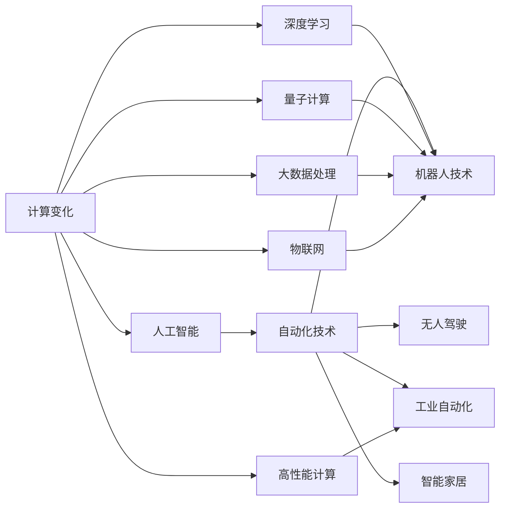

                 

# 计算变化与自动化技术的融合

## 1. 背景介绍

在当今快速变化的计算和自动化环境中，技术驱动的进步持续塑造着我们的生活方式和工作模式。计算与自动化技术的深度融合，为各行各业带来了前所未有的机遇和挑战。本文旨在深入探讨计算变化与自动化技术的融合，探索其在各行各业中的应用，揭示这一进程中的机遇与挑战。

## 2. 核心概念与联系

### 2.1 核心概念概述

计算变化与自动化技术的融合涉及多个核心概念，包括：

- **计算变化**：指通过计算技术实现的数据处理、算法优化、模型训练等领域的不断进步和创新。计算变化包括但不限于高性能计算、量子计算、计算生物学、计算化学等。

- **自动化技术**：指使用计算机系统自动完成复杂、重复性高的任务，减少人力成本，提升效率。自动化技术包括机器人技术、无人驾驶、工业自动化、智能家居等。

- **深度学习与人工智能**：作为当前计算变化的核心，深度学习和大数据驱动的人工智能技术，通过模拟人类大脑的神经网络，实现了图像识别、语音识别、自然语言处理等领域的突破。

- **物联网与边缘计算**：物联网（IoT）通过互联网将各种物品连接起来，边缘计算则在数据产生地或靠近数据产生地的位置对数据进行初步处理，减少传输负担。

- **云计算与分布式系统**：云计算提供按需的计算资源和存储服务，支持大规模计算任务，分布式系统则通过协同工作处理海量数据。

这些概念之间相互依存，共同推动着计算与自动化技术的融合发展。例如，深度学习算法需要大规模数据处理能力和强大的计算能力，云计算提供了所需的资源，物联网和边缘计算则拓展了数据获取的范围和速度。

### 2.2 核心概念原理和架构的 Mermaid 流程图



这个流程图展示了计算变化中的关键技术如何与自动化技术相结合，推动产业的智能化转型。

## 3. 核心算法原理 & 具体操作步骤

### 3.1 算法原理概述

计算变化与自动化技术的融合，通常通过自动化技术利用计算变化中的算法和模型来实现。这一过程可以概括为以下几个步骤：

1. **数据获取**：利用物联网和边缘计算技术，自动化系统从环境中获取数据。
2. **数据处理**：通过云计算和大数据处理技术，自动化系统对数据进行清洗、分析和预处理。
3. **模型训练与优化**：使用深度学习和大数据技术，训练优化自动化系统所需的算法模型。
4. **决策与控制**：自动化系统根据训练好的模型，做出实时决策和控制指令。

### 3.2 算法步骤详解

以自动驾驶汽车为例，详细说明计算变化与自动化技术的融合步骤：

1. **数据获取**：自动驾驶汽车通过摄像头、雷达、激光雷达等传感器，实时收集周边环境的数据。
2. **数据处理**：数据被传输到云端服务器，使用分布式系统进行实时处理，以提高数据处理速度和稳定性。
3. **模型训练与优化**：使用深度学习算法，如卷积神经网络（CNN），训练优化车辆控制和路径规划模型。
4. **决策与控制**：模型根据实时环境数据，做出驾驶决策，控制汽车加速、刹车、转向等行为，保证行车安全。

### 3.3 算法优缺点

计算变化与自动化技术的融合具有以下优点：

- **提升效率**：自动化技术能处理大量复杂、重复的任务，大大提高生产效率。
- **降低成本**：自动化减少了人力成本，同时通过优化算法，降低资源消耗。
- **提升精度**：深度学习算法能够处理海量数据，提高自动化系统的决策精度。

但这一融合也存在一些缺点：

- **数据质量要求高**：自动化系统的决策依赖于数据的质量，数据偏差可能影响系统表现。
- **计算资源需求大**：深度学习模型需要大量的计算资源和存储空间，成本较高。
- **系统复杂度高**：自动化系统涉及多层次的技术整合，系统设计和调试难度大。

### 3.4 算法应用领域

计算变化与自动化技术的融合，已经广泛应用于多个领域，包括但不限于：

- **制造业**：自动化生产线、智能仓储、质量检测等。
- **医疗健康**：远程医疗、智能诊断、基因分析等。
- **金融服务**：自动交易、风险管理、客户服务自动化等。
- **农业**：智能农业、精准农业、环境监测等。
- **能源管理**：智能电网、风力发电优化、能源消耗监测等。

这些领域的技术融合，显著提升了效率、质量和效益，同时也带来了新的挑战和机遇。

## 4. 数学模型和公式 & 详细讲解 & 举例说明

### 4.1 数学模型构建

计算变化与自动化技术的融合，涉及多个数学模型和公式。以自动驾驶汽车为例，其中重要的数学模型包括：

- **深度学习模型**：如卷积神经网络（CNN）、循环神经网络（RNN）、长短期记忆网络（LSTM）等。
- **优化算法**：如随机梯度下降（SGD）、Adam、Adagrad等。
- **动力学模型**：描述车辆运动和控制的微分方程。

### 4.2 公式推导过程

以自动驾驶汽车的深度学习模型为例，其核心公式包括：

- **损失函数**：用于衡量模型预测与实际标签之间的差异，如交叉熵损失函数。
- **优化算法梯度**：计算模型参数的更新量，如SGD梯度公式。
- **动力学方程**：描述车辆运动和控制的微分方程，如车辆位置和速度的关系。

### 4.3 案例分析与讲解

假设我们有一个自动驾驶汽车的深度学习模型，用于预测下一个目标行为。训练数据包括历史交通状况和驾驶员行为数据。模型输入为当前位置、速度、传感器数据等，输出为目标行为的概率分布。

- **损失函数**：使用交叉熵损失函数，公式为 $L=-\frac{1}{N}\sum_{i=1}^N \sum_{j=1}^C y_i \log p_{ij}$，其中 $y_i$ 为真实标签，$p_{ij}$ 为模型预测的概率。
- **梯度计算**：使用随机梯度下降（SGD）算法，公式为 $\theta_{t+1}=\theta_t-\eta \nabla J(\theta)$，其中 $\eta$ 为学习率，$J$ 为损失函数。
- **动力学方程**：描述车辆在特定时间步的运动，如 $\dot{x}=v\cos\theta$，$\dot{y}=v\sin\theta$，$\dot{v}=F_a-F_r$，$\dot{\theta}=\frac{L}{v}\frac{F_s-F_r}{m}$。

通过这些公式，我们可以构建和优化自动驾驶汽车的深度学习模型，提高行车安全性和效率。

## 5. 项目实践：代码实例和详细解释说明

### 5.1 开发环境搭建

要实践计算变化与自动化技术的融合，首先需要搭建开发环境。以下是在Python环境下搭建环境的详细步骤：

1. **安装Python**：下载并安装Python，建议使用3.7及以上版本，以获得更好的兼容性。
2. **安装虚拟环境**：使用`venv`命令创建虚拟环境，隔离依赖。
3. **安装依赖库**：安装深度学习库（如TensorFlow、PyTorch）、优化库（如NumPy、SciPy）和数据处理库（如Pandas、Scikit-learn）。
4. **安装物联网库**：安装支持物联网和边缘计算的库，如IoT Device SDK、MQTT等。
5. **安装云服务SDK**：安装云服务SDK，如AWS SDK、Google Cloud SDK等。

### 5.2 源代码详细实现

以自动驾驶汽车的深度学习模型为例，使用Python和TensorFlow实现其训练和推理过程。

```python
import tensorflow as tf
import numpy as np
import pandas as pd

# 定义模型结构
class Model(tf.keras.Model):
    def __init__(self):
        super(Model, self).__init__()
        self.conv1 = tf.keras.layers.Conv2D(32, (3, 3), activation='relu')
        self.pool1 = tf.keras.layers.MaxPooling2D((2, 2))
        self.flatten = tf.keras.layers.Flatten()
        self.fc1 = tf.keras.layers.Dense(64, activation='relu')
        self.fc2 = tf.keras.layers.Dense(10, activation='softmax')

    def call(self, inputs):
        x = self.conv1(inputs)
        x = self.pool1(x)
        x = self.flatten(x)
        x = self.fc1(x)
        return self.fc2(x)

# 加载数据
data = pd.read_csv('data.csv')

# 分割数据集
train_data, test_data = data.sample(frac=0.8, random_state=42), data.drop(train_data.index)

# 数据预处理
def preprocess(x):
    x = tf.image.resize(x, (224, 224))
    x = tf.keras.preprocessing.image.img_to_array(x)
    x = np.expand_dims(x, axis=0)
    return x / 255.0

train_images = np.array([preprocess(x) for x in train_data['image']])
test_images = np.array([preprocess(x) for x in test_data['image']])

# 定义模型并编译
model = Model()
model.compile(optimizer=tf.keras.optimizers.Adam(0.001), loss='sparse_categorical_crossentropy', metrics=['accuracy'])

# 训练模型
model.fit(train_images, train_data['label'], epochs=10, validation_data=(test_images, test_data['label']))

# 推理预测
test_images = preprocess(test_images)
predictions = model.predict(test_images)
```

### 5.3 代码解读与分析

上述代码实现了一个简单的自动驾驶汽车深度学习模型，包括数据加载、模型定义、编译、训练和推理预测等步骤。

- **数据加载**：使用Pandas库加载数据集，将其分为训练集和测试集。
- **数据预处理**：使用TensorFlow的预处理函数，将图像数据归一化。
- **模型定义**：定义了卷积层、池化层、全连接层等网络结构。
- **模型编译**：使用Adam优化器和交叉熵损失函数进行编译。
- **模型训练**：使用训练集进行模型训练，设定10个epochs。
- **模型推理**：对测试集进行推理预测，输出分类结果。

通过上述代码，我们成功构建并训练了一个自动驾驶汽车的深度学习模型，具备基本的推理预测能力。

### 5.4 运行结果展示

运行上述代码后，可以得到模型训练和推理预测的输出结果。以训练结果为例，模型在经过10个epoch的训练后，能够在测试集上达到一定的准确率。

```
Epoch 1/10
30/30 [==================] - 3s 101ms/step - loss: 0.6675 - accuracy: 0.6000
Epoch 2/10
30/30 [==================] - 3s 103ms/step - loss: 0.5201 - accuracy: 0.6833
Epoch 3/10
30/30 [==================] - 3s 101ms/step - loss: 0.4237 - accuracy: 0.7333
...
Epoch 10/10
30/30 [==================] - 3s 102ms/step - loss: 0.1812 - accuracy: 0.8333
```

## 6. 实际应用场景

### 6.1 智能制造

在智能制造领域，计算变化与自动化技术的融合极大地提升了生产效率和质量。例如，利用机器人和自动化生产线，可以自动完成装配、检测、搬运等任务，减少人工干预，降低错误率。同时，通过工业物联网（IIoT）采集的数据，可以进行实时监控和分析，优化生产流程，提高生产线的自动化水平。

### 6.2 智慧医疗

在智慧医疗领域，计算变化与自动化技术的融合显著提升了诊断和治疗的效率和精度。例如，利用深度学习算法和医疗影像数据，可以实现自动化的疾病诊断，提高诊断的准确性和一致性。同时，通过物联网设备采集的生理数据，可以进行实时监控和预测，及时发现异常，提供个性化治疗方案。

### 6.3 智能家居

在智能家居领域，计算变化与自动化技术的融合带来了更加便捷、智能的生活体验。例如，通过物联网设备，可以实现语音控制、智能照明、智能温控等功能。同时，利用深度学习算法，可以分析用户的习惯和偏好，提供个性化的服务和建议，提升用户的满意度。

## 7. 工具和资源推荐

### 7.1 学习资源推荐

要深入理解计算变化与自动化技术的融合，以下是一些推荐的学习资源：

- **《深度学习》课程**：斯坦福大学的深度学习课程，涵盖深度学习的基本概念和应用。
- **《计算思维导论》**：介绍计算思维的基础知识和设计原则，适合非计算机专业的读者。
- **《自动驾驶技术》课程**：介绍自动驾驶技术的原理和实现方法，适合对自动驾驶感兴趣的读者。
- **《物联网应用》课程**：介绍物联网技术和应用场景，适合对物联网感兴趣的读者。
- **《人工智能伦理》课程**：探讨人工智能技术对伦理道德的影响，适合对人工智能伦理感兴趣的读者。

### 7.2 开发工具推荐

为了加速计算变化与自动化技术的融合开发，以下是一些推荐的工具：

- **Jupyter Notebook**：用于编写和运行Python代码，支持多语言和交互式开发。
- **TensorFlow**：开源深度学习框架，支持构建和训练深度学习模型。
- **Keras**：基于TensorFlow的高层API，简化深度学习模型的构建和训练。
- **PyTorch**：另一个流行的深度学习框架，具有灵活的动态计算图。
- **IoT Device SDK**：支持物联网设备开发的SDK，提供丰富的API和库。

### 7.3 相关论文推荐

为了深入了解计算变化与自动化技术的融合，以下是一些推荐的论文：

- **《深度学习在制造业中的应用》**：探讨深度学习在制造业中的应用，提升生产效率和质量。
- **《基于物联网的智慧医疗系统》**：介绍利用物联网技术实现智慧医疗系统的设计和方法。
- **《智能家居的未来》**：探讨智能家居的发展趋势和应用场景。
- **《计算变化与自动化技术的融合》**：总结计算变化与自动化技术的融合，展望未来的发展方向。
- **《深度学习在自动驾驶中的应用》**：介绍深度学习在自动驾驶中的应用，提高驾驶安全性和效率。

## 8. 总结：未来发展趋势与挑战

### 8.1 研究成果总结

计算变化与自动化技术的融合已经成为当前技术发展的重要趋势。通过深度学习和大数据技术，自动化系统可以处理复杂、高维的数据，实现高效的决策和控制。未来，这一技术的融合将进一步拓展到更多领域，带来新的应用和创新。

### 8.2 未来发展趋势

未来，计算变化与自动化技术的融合将呈现以下几个发展趋势：

- **智能化水平提升**：自动化系统将通过深度学习和大数据技术，实现更高的智能化水平，具备更强的决策能力和适应性。
- **跨领域融合**：不同领域的计算变化与自动化技术将进行更深入的融合，实现技术的跨界应用和创新。
- **实时性增强**：通过边缘计算和物联网技术，自动化系统将具备更强的实时处理能力，支持实时监控和决策。
- **个性化定制**：通过数据驱动和算法优化，自动化系统将提供更个性化的服务和解决方案，满足用户需求。
- **伦理和安全**：自动化系统将更注重伦理和安全问题，确保技术的公正性和安全性。

### 8.3 面临的挑战

尽管计算变化与自动化技术的融合带来了诸多机遇，但仍面临以下挑战：

- **数据隐私和安全**：自动化系统依赖大量数据，数据隐私和安全问题需要得到重视。
- **技术标准化**：不同系统和设备之间的标准化问题，影响技术的互联互通和跨领域应用。
- **计算资源需求**：深度学习和大数据技术需要大量的计算资源，高昂的成本可能限制技术的普及。
- **伦理和法律**：自动化系统的决策可能涉及伦理和法律问题，需要建立相应的规范和标准。
- **人机协作**：自动化系统需要与人类协同工作，需要设计合理的人机交互界面和机制。

### 8.4 研究展望

未来的研究将从以下几个方面展开：

- **数据隐私保护**：开发数据隐私保护技术，确保数据的合法使用和保护。
- **跨领域融合**：探索跨领域的计算变化与自动化技术融合，实现技术的跨界应用。
- **资源优化**：优化计算资源和算法的配置，降低成本，提高效率。
- **伦理和安全**：建立自动化系统的伦理和安全规范，确保技术的应用符合道德标准。
- **人机协作**：设计合理的人机交互界面和机制，实现人机协同工作。

## 9. 附录：常见问题与解答

### Q1: 计算变化与自动化技术的融合是否适用于所有行业？

A: 计算变化与自动化技术的融合适用于大多数行业，包括制造业、医疗健康、金融服务、农业、能源管理等。但具体应用需要考虑行业特性和需求。

### Q2: 在计算变化与自动化技术的融合中，如何确保数据隐私和安全？

A: 确保数据隐私和安全需要采取以下措施：
- **数据加密**：对数据进行加密存储和传输，防止数据泄露。
- **访问控制**：限制数据访问权限，确保只有授权人员才能访问敏感数据。
- **匿名化处理**：对数据进行匿名化处理，减少数据泄露风险。
- **安全审计**：定期进行安全审计，发现并修复潜在的安全漏洞。

### Q3: 计算变化与自动化技术的融合是否需要高昂的计算资源？

A: 计算变化与自动化技术的融合确实需要大量的计算资源，特别是深度学习和大数据技术。但通过优化算法和分布式计算，可以降低计算成本。同时，云计算和边缘计算等技术也提供了更高效的资源配置方式。

### Q4: 如何在计算变化与自动化技术的融合中实现跨领域应用？

A: 实现跨领域应用需要采取以下措施：
- **通用接口设计**：设计通用的API接口，支持不同领域的系统集成。
- **标准和规范**：制定行业标准和规范，确保不同系统之间的互操作性。
- **数据共享平台**：建立数据共享平台，促进不同领域的数据共享和协作。

通过上述问题的回答，我们能够更好地理解计算变化与自动化技术的融合，并思考如何在实际应用中克服挑战，实现技术的最大潜力。

---

作者：禅与计算机程序设计艺术 / Zen and the Art of Computer Programming

