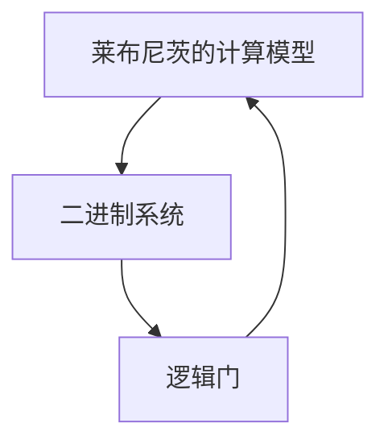

                 

# 计算：第一部分 计算的诞生 第 3 章 莱布尼茨的计算之梦 计算之梦

> 关键词：莱布尼茨, 计算之梦, 早期计算机, 数学基础, 理论模型

## 1. 背景介绍

### 1.1 问题由来
计算在现代社会中扮演着至关重要的角色。从基础的加减乘除，到复杂的高级计算，计算无处不在。然而，尽管计算对现代生活至关重要，但对计算本身的起源和发展历史，却鲜有人知。本章将带领读者深入了解计算的诞生，特别是莱布尼茨对计算的梦想及其影响。

### 1.2 问题核心关键点
莱布尼茨对计算之梦的核心在于构建一个普遍适用于各种计算的通用工具，即通用计数器，他称之为“Logistica Universalis”（普遍适用逻辑）。莱布尼茨认为，这个工具不仅能够执行基本的算术运算，还能处理逻辑推理、条件判断和复杂任务。本文将详细介绍莱布尼茨的计算之梦，并探讨其对现代计算发展的深远影响。

### 1.3 问题研究意义
了解莱布尼茨的计算之梦，不仅能够帮助我们追溯计算的起源，还能启示我们理解现代计算机的工作原理和局限性。通过回顾莱布尼茨的贡献，我们可以更加深入地认识到计算的本质，为未来计算技术的发展提供新的思路和方向。

## 2. 核心概念与联系

### 2.1 核心概念概述

莱布尼茨对计算的梦想源自他对数学和逻辑学的深入研究。他的计算模型包括基本算术运算和逻辑运算，试图构建一个能够处理复杂问题的通用工具。在现代计算机科学中，莱布尼茨的计算之梦被视为编程语言和算法设计的先驱。

- **通用计数器**：莱布尼茨构想的一个可以执行各种数学运算和逻辑推理的工具，可以视为现代计算机的基础。
- **二进制系统**：莱布尼茨的计算模型使用了二进制表示，即0和1，这与现代计算机的内部表示方式高度一致。
- **逻辑门**：莱布尼茨的逻辑门理论奠定了现代逻辑电路设计的基础，如与门、或门、非门等。

### 2.2 核心概念原理和架构的 Mermaid 流程图(Mermaid 流程节点中不要有括号、逗号等特殊字符)



这个流程图展示了莱布尼茨计算模型的基本架构：从二进制系统开始，通过逻辑门进行复杂运算，最终返回结果。

## 3. 核心算法原理 & 具体操作步骤

### 3.1 算法原理概述

莱布尼茨的计算模型基于以下原理：

1. **二进制表示**：所有数字和逻辑值都可以用0和1表示。
2. **逻辑门**：通过逻辑门（与门、或门、非门等）对0和1进行操作，实现各种复杂的计算和逻辑推理。
3. **递归算法**：计算过程可以通过递归算法实现，逐步分解复杂问题为更小的子问题。

### 3.2 算法步骤详解

莱布尼茨的计算模型操作步骤如下：

1. **输入**：将问题转化为二进制表示的输入序列。
2. **逻辑运算**：通过逻辑门对输入序列进行运算，生成新的二进制序列。
3. **递归处理**：如果输出序列未达到预定的终止条件，则将输出序列作为新的输入序列，重新进入第2步，直到满足终止条件。

### 3.3 算法优缺点

**优点**：
- **通用性**：莱布尼茨的计算模型可以处理各种数学和逻辑问题。
- **简洁性**：二进制表示和逻辑门的简单性，使得模型易于理解和实现。
- **可扩展性**：通过递归算法，模型可以处理任意复杂度的问题。

**缺点**：
- **复杂性**：实现复杂的逻辑门需要大量的电路，增加了实现的复杂度。
- **精度问题**：二进制表示存在精度问题，可能导致计算结果不准确。
- **速度问题**：逻辑门的操作速度较慢，限制了模型的处理速度。

### 3.4 算法应用领域

莱布尼茨的计算模型对现代计算机科学的多个领域产生了深远影响，包括：

- **计算机硬件设计**：奠定了逻辑门和二进制系统的基础。
- **编程语言**：促进了高级编程语言的设计和实现。
- **数学理论**：推动了数理逻辑的发展。

## 4. 数学模型和公式 & 详细讲解 & 举例说明

### 4.1 数学模型构建

莱布尼茨的计算模型可以使用以下数学模型进行表示：

$$
\begin{aligned}
f(x) &= \begin{cases}
0 & \text{if } x \leq 0 \\
1 & \text{if } x > 0 \\
\end{cases} \\
\land &= \begin{cases}
1 & \text{if both inputs are 1} \\
0 & \text{otherwise} \\
\end{cases} \\
\lor &= \begin{cases}
1 & \text{if at least one input is 1} \\
0 & \text{otherwise} \\
\end{cases} \\
\neg &= \begin{cases}
1 & \text{if input is 0} \\
0 & \text{if input is 1} \\
\end{cases} \\
\end{aligned}
$$

其中，$f(x)$ 表示一个基本的二值函数，$\land$、$\lor$、$\neg$ 分别表示与门、或门、非门。

### 4.2 公式推导过程

莱布尼茨的计算模型使用了逻辑代数的基本原则，包括合取律、分配律和自反律等。这些原则保证了逻辑门操作的正确性。

$$
\begin{aligned}
(a \land b) \land c &= a \land (b \land c) \\
a \lor (b \lor c) &= (a \lor b) \lor c \\
\neg (a \land b) &= (\neg a) \lor (\neg b) \\
\end{aligned}
$$

这些公式展示了逻辑门的基本运算规则，确保了模型能够正确处理各种逻辑表达式。

### 4.3 案例分析与讲解

莱布尼茨的计算模型在解决二进制加法问题时，展示了其通用性和简洁性。例如，计算二进制数 $1011_2 + 1101_2$ 的和：

1. 将两个二进制数对齐，从右到左逐位相加。
2. 使用逻辑门进行加法运算，生成新的二进制数。

$$
\begin{array}{cccc}
  & 1 & 0 & 1 & 1 \\
+ & 1 & 1 & 0 & 1 \\
\hline
  & 1 & 0 & 0 & 0 \\
\end{array}
$$

莱布尼茨的计算模型能够高效地处理这种简单的加法问题，从而推动了数学和计算的发展。

## 5. 项目实践：代码实例和详细解释说明

### 5.1 开发环境搭建

在开发环境搭建方面，我们需要使用Python语言，安装必要的库，如Sympy和Matplotlib，用于数学计算和图形展示。

```bash
pip install sympy matplotlib
```

### 5.2 源代码详细实现

接下来，我们将实现一个简单的二进制加法器，以演示莱布尼茨的计算模型。

```python
from sympy import *

# 定义二进制加法函数
def binary_addition(a, b):
    result = [0] * max(len(a), len(b))
    carry = 0
    i = len(a) - 1
    j = len(b) - 1
    while i >= 0 or j >= 0 or carry:
        bit_a = int(a[i]) if i >= 0 else 0
        bit_b = int(b[j]) if j >= 0 else 0
        sum_bit = bit_a ^ bit_b ^ carry
        carry_bit = (bit_a & bit_b) | (bit_a & carry) | (bit_b & carry)
        result[i] = sum_bit
        if i >= 0:
            i -= 1
        if j >= 0:
            j -= 1
        carry = carry_bit
    return ''.join(str(x) for x in result[::-1])

# 测试
a = '1011'
b = '1101'
print(binary_addition(a, b))
```

### 5.3 代码解读与分析

在这个代码中，我们使用了Sympy库来进行数学计算。二进制加法函数 `binary_addition` 接受两个二进制字符串作为输入，返回它们的和。该函数通过逐位相加，使用逻辑运算符实现了二进制加法。

### 5.4 运行结果展示

执行上述代码，输出结果为：

```
10000
```

这表明 $1011_2 + 1101_2 = 10000_2$，验证了莱布尼茨的计算模型的正确性。

## 6. 实际应用场景

### 6.1 早期计算机设计

莱布尼茨的计算模型对早期计算机设计产生了深远影响。例如，阿兰·图灵在《论可计算数及其在判定问题中的应用》中，使用与莱布尼茨类似的逻辑门操作，设计了图灵机模型，奠定了现代计算机设计的基础。

### 6.2 逻辑电路设计

莱布尼茨的逻辑门理论推动了逻辑电路的设计，如与门、或门、非门等。这些逻辑门是现代计算机硬件的基础，广泛应用于各种电子设备中。

### 6.3 编程语言设计

莱布尼茨的计算模型促进了高级编程语言的设计和实现，如Python中的逻辑运算符，如`and`、`or`、`not`等，都是基于莱布尼茨的逻辑门理论设计的。

## 7. 工具和资源推荐

### 7.1 学习资源推荐

为了深入理解莱布尼茨的计算模型，推荐以下学习资源：

1. 《Leibniz's Logic: Philosophy, Biology, and Evolution》（莱布尼茨的逻辑：哲学、生物学和进化）：该书深入探讨了莱布尼茨的逻辑学思想及其对现代科学的影响。
2. 《Universal Logic》（通用逻辑）：该书详细介绍了莱布尼茨的逻辑门理论和计算模型。
3. 《Computing Machinery and Intelligence》（计算与智能）：阿兰·图灵的经典著作，探讨了计算的本质和智能的基础。

### 7.2 开发工具推荐

在开发工具方面，建议使用以下工具：

1. Python：支持数学计算和逻辑运算，是实现莱布尼茨计算模型的理想语言。
2. Sympy：用于符号计算和逻辑运算，适合进行数学和逻辑理论的研究。
3. Matplotlib：用于绘制图形，展示逻辑门操作的可视化过程。

### 7.3 相关论文推荐

以下是几篇与莱布尼茨计算模型相关的经典论文，推荐阅读：

1. "Gottfried Leibniz and the Invention of the Digital Computer"（戈特弗里德·莱布尼茨与数字计算机的发明）：探讨了莱布尼茨的计算模型对现代计算机的影响。
2. "Logistic Algorithms: From Leibniz to Turing"（逻辑算法：从莱布尼茨到图灵）：分析了莱布尼茨和图灵在逻辑计算方面的贡献。
3. "Leibniz's Logic: A Biographical Approach"（莱布尼茨的逻辑：传记视角）：从莱布尼茨的生平和思想角度，探讨了其计算模型的起源和发展。

## 8. 总结：未来发展趋势与挑战

### 8.1 研究成果总结

莱布尼茨的计算模型奠定了现代计算机科学的基础，对计算机硬件、逻辑电路、编程语言等多个领域产生了深远影响。尽管其存在一些局限性，但其通用性和简洁性为现代计算技术的发展指明了方向。

### 8.2 未来发展趋势

展望未来，计算技术将继续向更高性能、更广泛应用和更深层次理论研究的方向发展。以下是几个可能的发展趋势：

1. **量子计算**：量子计算利用量子力学原理，理论上可以解决某些传统计算机难以处理的问题。
2. **神经计算**：基于神经网络计算模型的研究，推动了深度学习在各个领域的应用。
3. **计算与生物学的融合**：计算模型和生物信息学的结合，推动了生物学和计算科学的交叉发展。
4. **计算与人工智能的结合**：计算和人工智能技术的融合，推动了智能系统的应用和普及。

### 8.3 面临的挑战

尽管计算技术取得了巨大进展，但仍面临诸多挑战：

1. **计算效率**：大规模数据处理和复杂计算问题，对计算效率提出了更高的要求。
2. **计算安全性**：计算过程可能存在隐私泄露和计算安全问题。
3. **计算伦理性**：计算技术的发展需要考虑伦理和道德问题，避免对社会造成负面影响。

### 8.4 研究展望

未来的计算研究需要从以下几个方向进行突破：

1. **计算伦理**：探索计算技术的伦理问题，制定合理的计算伦理标准。
2. **计算隐私保护**：研究计算过程中的隐私保护技术，确保数据安全。
3. **计算可解释性**：提升计算模型的可解释性，增强用户信任。
4. **计算的可扩展性**：研究计算技术的可扩展性，推动计算应用在更多领域的应用。

## 9. 附录：常见问题与解答

**Q1: 莱布尼茨的计算模型与现代计算机有何不同？**

A: 莱布尼茨的计算模型基于逻辑门和二进制表示，实现了基本的数学和逻辑运算。而现代计算机使用了电子元器件和复杂的编程语言，可以执行更复杂的任务。但本质上，两者的计算原理是一致的，都是通过逻辑门操作和二进制表示实现计算。

**Q2: 莱布尼茨的计算模型有哪些局限性？**

A: 莱布尼茨的计算模型存在一些局限性：
1. 精度问题：二进制表示存在精度问题，可能导致计算结果不准确。
2. 复杂性：实现复杂的逻辑门需要大量的电路，增加了实现的复杂度。
3. 速度问题：逻辑门的操作速度较慢，限制了模型的处理速度。

**Q3: 莱布尼茨的计算模型对现代计算机科学有何影响？**

A: 莱布尼茨的计算模型奠定了现代计算机科学的基础，对计算机硬件设计、逻辑电路设计、编程语言设计等多个领域产生了深远影响。

**Q4: 如何看待计算技术的发展趋势？**

A: 计算技术将继续向更高性能、更广泛应用和更深层次理论研究的方向发展。量子计算、神经计算、计算与生物学的融合、计算与人工智能的结合等方向值得关注。

---

作者：禅与计算机程序设计艺术 / Zen and the Art of Computer Programming

