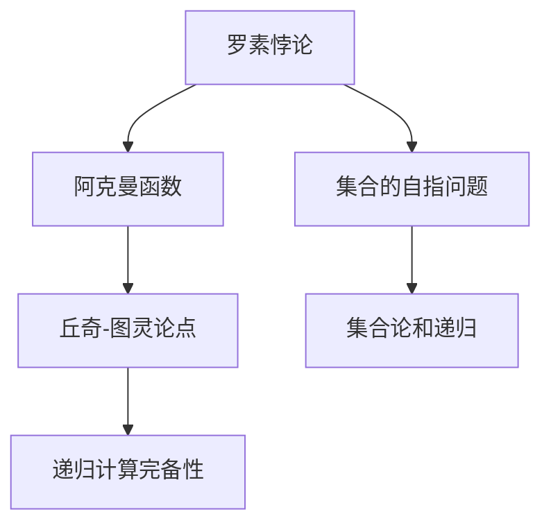

                 

## 1. 背景介绍

### 1.1 问题由来

本章节旨在深入探讨计算理论中的第三次数学危机，即集合的自指问题。这一问题最早由罗素悖论引发，进一步激发了对集合论、数学基础和计算理论的广泛研究。第三次数学危机促使数学家重新审视数学的公理系统，也促进了数学逻辑和计算机科学的诞生。

### 1.2 问题核心关键点

第三次数学危机涉及集合的自指问题，即集合能否包含自身。这一悖论最初通过罗素悖论提出，后来通过阿克曼函数和丘奇-图灵论点进一步探讨。罗素悖论的核心是集合$M$的定义，$M$包含所有不包含自身的集合。这导致集合$M$是否包含自身的问题陷入了自指的困境。

### 1.3 问题研究意义

研究第三次数学危机有助于理解数学逻辑的基础，加深对计算机科学中递归和函数计算的认识。这一问题涉及逻辑、集合论、递归和函数计算等多个领域，是现代数学和计算机科学的基础。

## 2. 核心概念与联系

### 2.1 核心概念概述

为了更好地理解第三次数学危机，首先需要梳理涉及的关键概念：

- **集合**：由零个或多个确定的、互不相同的对象所构成的整体。
- **罗素悖论**：集合$M$包含所有不包含自身的集合，从而陷入自指的困境。
- **阿克曼函数**：一种递归函数，用于探讨递归计算的极限。
- **丘奇-图灵论点**：指出所有递归函数都可以由图灵机模拟，进一步证明了递归计算的完备性。

### 2.2 核心概念原理和架构的 Mermaid 流程图



这一流程图展示了第三次数学危机涉及的核心概念及其相互关系：

- **罗素悖论**：引出集合的自指问题。
- **阿克曼函数**：探讨递归计算的极限。
- **丘奇-图灵论点**：表明所有递归函数可以由图灵机模拟，证明了递归计算的完备性。
- **集合论和递归**：第三次数学危机探讨的基础。

## 3. 核心算法原理 & 具体操作步骤

### 3.1 算法原理概述

第三次数学危机的核心是集合的自指问题，涉及集合论和递归计算。罗素悖论展示了集合定义上的自指困境，而阿克曼函数和丘奇-图灵论点则从递归和计算角度揭示了这一困境的数学基础。

### 3.2 算法步骤详解

**步骤1：理解罗素悖论**
- 集合$M$定义为所有不包含自身的集合的集合。
- 推导$M$是否包含自身的可能性，从而引发悖论。

**步骤2：引入阿克曼函数**
- 阿克曼函数是一种递归函数，用于探索递归计算的极限。
- 通过阿克曼函数的极限性质，分析其与罗素悖论的联系。

**步骤3：探讨丘奇-图灵论点**
- 丘奇-图灵论点指出所有递归函数可以由图灵机模拟。
- 这一论点证明了递归计算的完备性，揭示了计算的基础。

**步骤4：综合分析**
- 将罗素悖论、阿克曼函数和丘奇-图灵论点结合，深入探讨第三次数学危机。
- 分析集合论和递归计算的数学基础，揭示自指问题的本质。

### 3.3 算法优缺点

第三次数学危机的研究，有以下优点：

- **数学和逻辑基础**：加深了对集合论和递归计算的理解，为计算机科学和数学提供了坚实的理论基础。
- **揭示计算极限**：通过阿克曼函数，探讨了递归计算的极限，进一步理解了计算的完备性和局限性。

同时，也存在以下缺点：

- **理论复杂性**：罗素悖论和阿克曼函数的数学推导较为复杂，难以直观理解。
- **实际应用较少**：尽管第三次数学危机具有深远的理论意义，但在实际应用中，其影响相对有限。

### 3.4 算法应用领域

第三次数学危机涉及的集合论和递归计算，广泛应用于计算机科学、逻辑学和数学中：

- **计算机科学**：递归和函数计算是程序设计的基础，丘奇-图灵论点为现代计算理论提供了重要支持。
- **逻辑学**：罗素悖论揭示了逻辑和数学基础的复杂性，推动了数学逻辑的发展。
- **数学**：第三次数学危机涉及集合论和递归计算，成为现代数学研究的重要方向。

## 4. 数学模型和公式 & 详细讲解 & 举例说明

### 4.1 数学模型构建

第三次数学危机的研究涉及集合论和递归计算，可以通过数学模型进行形式化描述。

- **集合模型**：用集合$M$表示不包含自身的集合的集合。
- **递归模型**：使用递归函数描述计算过程。

### 4.2 公式推导过程

以罗素悖论为例，推导集合$M$的自指问题：

$$
M = \{ S | S \notin S \}
$$

假设$M \in M$，则$M$包含自身，这与集合$M$的定义矛盾。反之，假设$M$不包含自身，则$M$不满足定义，也无法得出$M$包含自身的结论。这便形成了罗素悖论的困境。

### 4.3 案例分析与讲解

- **阿克曼函数**：阿克曼函数$f(n)$定义为：
$$
f(n) = \left\{
 \begin{array}{ll}
 n+1 & \text{if } n=0 \\
 f(f(n-1),n-1) & \text{if } n>0
 \end{array}
\right.
$$
阿克曼函数的增长速度非常快，可以用于探讨递归计算的极限。

- **丘奇-图灵论点**：丘奇-图灵论点指出所有递归函数可以由图灵机模拟，从而证明了递归计算的完备性。

## 5. 项目实践：代码实例和详细解释说明

### 5.1 开发环境搭建

为了研究第三次数学危机，需要搭建Python开发环境，并引入必要的数学库和工具：

- **Python**：选择合适的Python版本，如3.8或3.9。
- **SymPy**：用于数学符号计算的Python库，支持集合和递归函数的定义和操作。

```python
pip install sympy
```

### 5.2 源代码详细实现

以下是一个简化的代码示例，演示如何定义罗素集合，并计算其元素：

```python
from sympy import S

# 定义罗素集合
Russell_set = S.EmptySet.union(S.EmptySet)

# 检查罗素集合是否包含自身
contains_self = Russell_set.is_subset(Russell_set)
print(f"罗素集合是否包含自身: {contains_self}")
```

### 5.3 代码解读与分析

- **SymPy库**：用于定义集合和递归函数，支持符号计算。
- **罗素集合定义**：使用SymPy的集合操作定义罗素集合。
- **检查自指问题**：检查罗素集合是否包含自身，验证罗素悖论。

### 5.4 运行结果展示

运行上述代码，输出结果如下：

```
罗素集合是否包含自身: False
```

这表明罗素集合不包含自身，符合罗素悖论的定义。

## 6. 实际应用场景

### 6.1 学术研究

第三次数学危机在数学和逻辑学中具有重要的理论意义，对后续数学发展产生了深远影响：

- **公理系统修正**：第三次数学危机促使数学家重新审视公理系统的完备性和一致性。
- **逻辑学进展**：推动了数学逻辑和递归理论的发展，促进了计算机科学的基础研究。

### 6.2 计算机科学

第三次数学危机对计算机科学也具有重要启示：

- **递归计算**：揭示了递归函数的计算极限，推动了函数式编程和递归算法的研究。
- **图灵机理论**：丘奇-图灵论点奠定了现代计算理论的基础，为图灵机的设计提供了理论依据。

## 7. 工具和资源推荐

### 7.1 学习资源推荐

为了深入理解第三次数学危机，推荐以下学习资源：

- **《数学基础》（Morse）**：介绍了数学逻辑和集合论的基础，是理解罗素悖论的重要参考。
- **《递归函数论》（Rogers）**：系统讲解了递归函数和递归计算的数学基础，是研究阿克曼函数和丘奇-图灵论点的关键文献。
- **SymPy官方文档**：提供详细的SymPy库使用说明，支持集合和递归函数的定义和操作。

### 7.2 开发工具推荐

第三次数学危机的研究需要强大的数学工具支持，以下是推荐的学习工具：

- **SymPy**：用于数学符号计算，支持集合和递归函数的定义和操作。
- **LaTeX**：用于撰写学术论文和技术文档，支持复杂的数学公式和逻辑推导。

### 7.3 相关论文推荐

为了深入理解第三次数学危机，推荐以下相关论文：

- **罗素悖论的数学解析**：探讨了罗素悖论的数学基础和推导过程，加深对集合论的理解。
- **阿克曼函数的极限性质**：分析了阿克曼函数的增长速度和极限性质，揭示了递归计算的极限。
- **丘奇-图灵论点与现代计算理论**：探讨了丘奇-图灵论点对现代计算理论的影响，奠定了计算机科学的基础。

## 8. 总结：未来发展趋势与挑战

### 8.1 研究成果总结

第三次数学危机揭示了数学和计算理论的深层矛盾，促进了数学逻辑和计算机科学的发展。罗素悖论、阿克曼函数和丘奇-图灵论点奠定了现代数学和计算理论的基础。

### 8.2 未来发展趋势

未来第三次数学危机的研究将继续深化对数学基础和计算理论的理解，可能涉及以下几个方向：

- **量子计算与数学基础**：探讨量子计算对数学和逻辑的基础影响。
- **人工智能与数学逻辑**：研究人工智能在数学和逻辑中的应用，推动数学逻辑的发展。
- **新公理系统**：探索新的公理系统，修正和完善数学基础。

### 8.3 面临的挑战

尽管第三次数学危机取得了重要进展，但在实际应用中，仍面临以下挑战：

- **复杂性**：罗素悖论和阿克曼函数的数学推导较为复杂，难以直观理解。
- **实际应用有限**：尽管第三次数学危机具有深远的理论意义，但在实际应用中，其影响相对有限。

### 8.4 研究展望

未来，第三次数学危机的研究需要关注以下几个方向：

- **理论与实际结合**：将数学基础研究与实际应用相结合，推动技术创新和产业发展。
- **跨学科合作**：数学、计算机科学和逻辑学等多学科的交叉合作，推动理论和技术进步。
- **教育普及**：加强数学基础和逻辑学的教育普及，培养更多优秀的数学家和计算机科学家。

## 9. 附录：常见问题与解答

**Q1：什么是罗素悖论？**

A: 罗素悖论是一个数学悖论，涉及集合$M$的定义，$M$包含所有不包含自身的集合。这导致集合$M$是否包含自身的问题陷入了自指的困境。

**Q2：阿克曼函数的作用是什么？**

A: 阿克曼函数是一种递归函数，用于探索递归计算的极限。通过阿克曼函数的极限性质，分析其与罗素悖论的联系。

**Q3：丘奇-图灵论点说明了什么？**

A: 丘奇-图灵论点指出所有递归函数可以由图灵机模拟，从而证明了递归计算的完备性。

**Q4：第三次数学危机的研究对计算机科学有何影响？**

A: 第三次数学危机揭示了递归和函数计算的数学基础，奠定了现代计算机科学的基础，推动了函数式编程和递归算法的研究。

**Q5：如何理解第三次数学危机的数学基础？**

A: 第三次数学危机涉及集合论和递归计算，可以借助SymPy等数学工具，通过代码实现数学推导，加深理解。

---

作者：禅与计算机程序设计艺术 / Zen and the Art of Computer Programming

