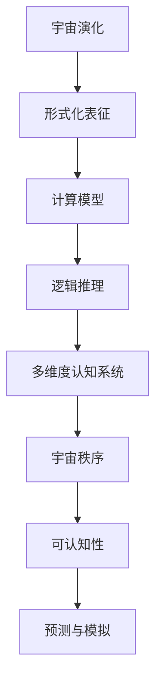

                 

# 认知的形式化：宇宙在本质上是有秩序的和可认知的

> 关键词：形式化认知,宇宙秩序,可认知性,计算模型,宇宙演化的逻辑推理,多维度认知系统

## 1. 背景介绍

### 1.1 问题由来

在信息爆炸和复杂性日益增加的21世纪，如何理解、分析和预测宇宙的演变，成为了前沿科学和哲学研究的热点话题。宇宙作为一个庞大而复杂的系统，其行为背后是否存在某种固有的秩序，以及这种秩序是否可以被我们认知和预测？

面对这一问题，计算宇宙学和宇宙学理论的交融产生了计算宇宙学。计算宇宙学运用数学和计算模型，对宇宙的演化进行模拟，旨在揭示宇宙中的物理规律和结构。其中，形式化的认知方法逐渐成为了研究宇宙秩序和可认知性的重要工具。

### 1.2 问题核心关键点

形式化的认知方法通过将宇宙的演化过程转化为数学模型，旨在回答以下几个关键问题：

- 宇宙是否存在固有的秩序？这种秩序如何表征？
- 宇宙的可认知性如何？我们能否通过数学和计算模型模拟宇宙的行为？
- 形式化的认知模型能否帮助我们预测宇宙的未来发展趋势？

形式化认知方法的核心在于将宇宙的演化过程映射为计算模型，通过逻辑推理和多维度认知系统，逐步逼近宇宙的真实演化过程。这种方法在宇宙学、天体物理学、计算物理学等领域具有广泛应用。

### 1.3 问题研究意义

形式化认知方法的研究对于理解宇宙的秩序和可认知性具有重要意义：

1. 揭示宇宙演化的基本规律：形式化方法能够帮助我们系统化地描述和分析宇宙的演化过程，揭示宇宙演化的基本物理规律。
2. 提供宇宙学的数学工具：通过形式化方法，我们可以建立更精确的宇宙学模型，辅助天文学家进行观测和分析。
3. 推动多学科交叉研究：形式化方法整合了数学、物理学、计算机科学等多学科知识，促进了不同学科之间的交叉研究。
4. 增强人类对宇宙的认知能力：形式化方法通过模型化和逻辑推理，增强了人类对宇宙认知的深度和广度。

## 2. 核心概念与联系

### 2.1 核心概念概述

要理解形式化认知方法，需要首先明确以下几个核心概念：

- **形式化认知（Formal Cognition）**：通过数学和逻辑推理，对认知过程进行形式化的表达和模拟。
- **宇宙秩序（Order in the Universe）**：宇宙演化中的基本规律和结构，可以通过形式化方法进行表征。
- **可认知性（Cognizability）**：宇宙的可认知性，即我们能否通过数学和计算模型理解和预测宇宙的行为。
- **计算模型（Computational Model）**：用于模拟和预测宇宙演化的数学模型。
- **逻辑推理（Logical Reasoning）**：通过数学逻辑和推理，对宇宙演化进行分析和预测。
- **多维度认知系统（Multidimensional Cognitive System）**：结合多种认知手段和方法，从多角度理解宇宙的演化。

这些概念之间具有紧密的联系，共同构成了形式化认知方法的框架。通过逻辑推理和多维度认知系统，我们能够构建更精确的计算模型，进而揭示宇宙演化的秩序和可认知性。

### 2.2 核心概念原理和架构的 Mermaid 流程图



这个流程图展示了宇宙演化过程的形式化表征、计算模型构建、逻辑推理、多维度认知系统设计、宇宙秩序揭示和可认知性评估。通过这一系列过程，我们可以逐步逼近宇宙的真实演化，增强对宇宙认知的深度和广度。

## 3. 核心算法原理 & 具体操作步骤

### 3.1 算法原理概述

形式化认知方法的核心在于通过数学和逻辑推理，将宇宙的演化过程映射为计算模型。其基本步骤如下：

1. **形式化表征**：将宇宙的演化过程抽象为数学表达式，通过符号系统表示宇宙中的物理量和关系。
2. **构建计算模型**：基于形式化表征，构建用于模拟宇宙演化的数学模型。
3. **逻辑推理**：通过数学逻辑和推理，分析和预测宇宙演化的行为。
4. **多维度认知系统**：结合多种认知手段和方法，从多角度理解宇宙的演化。

### 3.2 算法步骤详解

以下详细阐述形式化认知方法的具体操作步骤：

#### Step 1: 形式化表征

首先，我们需要将宇宙的演化过程进行形式化表征。这包括：

- **物理量定义**：定义描述宇宙演化的基本物理量，如时空坐标、物质密度、引力场等。
- **物理定律**：建立描述宇宙演化的基本物理定律，如爱因斯坦的广义相对论、麦克斯韦的电磁理论等。
- **初始条件**：设定宇宙演化的初始条件，如宇宙大爆炸的初始状态。

#### Step 2: 构建计算模型

基于形式化表征，构建用于模拟宇宙演化的计算模型。常见的计算模型包括：

- **N体模拟**：通过计算每个天体的运动轨迹和相互作用，模拟星系和星系团的演化。
- **蒙特卡罗模拟**：通过随机抽样和概率计算，模拟宇宙中的气体和尘埃分布。
- **离散模拟**：通过离散化的数值方法，模拟宇宙中的流体动力学和大规模结构形成。

#### Step 3: 逻辑推理

通过数学逻辑和推理，分析和预测宇宙演化的行为。常见的逻辑推理方法包括：

- **数学归纳法**：通过对模型的递推关系进行归纳，预测宇宙的长期行为。
- **因果关系推理**：通过分析宇宙中各物理量之间的因果关系，推导宇宙的演化路径。
- **贝叶斯推理**：通过贝叶斯定理，结合观测数据和先验知识，更新模型参数。

#### Step 4: 多维度认知系统

结合多种认知手段和方法，从多角度理解宇宙的演化。常见的多维度认知系统包括：

- **数值模拟与理论分析**：结合数值模拟和理论分析，从不同角度理解宇宙的演化过程。
- **多层次模型**：建立多层次的认知模型，从宏观到微观，全面理解宇宙的行为。
- **跨学科融合**：整合天文学、物理学、计算机科学等多学科知识，构建综合的认知系统。

### 3.3 算法优缺点

形式化认知方法具有以下优点：

1. **精确性**：通过数学和逻辑推理，可以精确地模拟和预测宇宙的演化过程。
2. **系统性**：将宇宙的演化过程形式化表征，便于进行系统的分析和研究。
3. **可重复性**：形式化方法具有高度的可重复性，便于验证和改进。
4. **跨学科整合**：结合多种认知手段和方法，促进不同学科之间的交叉研究。

同时，形式化认知方法也存在一些缺点：

1. **复杂性**：形式化表征和计算模型复杂，需要较高的计算资源和专业知识。
2. **不确定性**：宇宙中的物理参数和初始条件存在不确定性，影响模型的精度。
3. **实验验证难度**：部分模型需要较长时间和大量计算资源进行验证，难以快速迭代。
4. **模型简化**：为了简化计算，模型可能忽略某些复杂的物理过程，导致预测偏差。

### 3.4 算法应用领域

形式化认知方法在多个领域得到了广泛应用，包括：

1. **宇宙学**：用于研究宇宙大尺度结构形成、暗物质分布、宇宙膨胀等。
2. **天体物理学**：用于模拟恒星、黑洞、中子星等天体的演化过程。
3. **计算物理学**：用于研究等离子体、流体动力学等物理系统的行为。
4. **多尺度模拟**：结合多层次认知系统，研究从微观到宏观的多尺度物理现象。
5. **复杂系统**：用于研究生物系统、经济系统等复杂系统的演化行为。

## 4. 数学模型和公式 & 详细讲解 & 举例说明

### 4.1 数学模型构建

形式化认知方法通过数学模型来描述和分析宇宙的演化过程。常见的数学模型包括：

- **N体模拟模型**：描述多个天体（如恒星、星系）的演化，方程形式为：
$$
\frac{d\vec{v}}{dt} = -\frac{G M}{r^2} \hat{r}
$$
$$
\frac{d\vec{r}}{dt} = \vec{v}
$$
其中，$\vec{v}$ 为天体速度，$\vec{r}$ 为天体位置，$G$ 为万有引力常数，$M$ 为天体质量。

- **蒙特卡罗模拟模型**：通过随机抽样模拟气体和尘埃的分布，方程形式为：
$$
\frac{\partial f}{\partial t} + \vec{v} \cdot \frac{\partial f}{\partial \vec{r}} = \frac{1}{t_{\text{coll}}} (f - f_0)
$$
其中，$f$ 为气体或尘埃的分布函数，$v$ 为速度，$t_{\text{coll}}$ 为碰撞时间，$f_0$ 为初始分布函数。

### 4.2 公式推导过程

以下详细推导蒙特卡罗模拟模型的基本形式：

1. **质量守恒定律**：气体和尘埃的质量守恒，即
$$
\frac{\partial \rho}{\partial t} + \vec{v} \cdot \frac{\partial \rho}{\partial \vec{r}} = 0
$$
2. **动量守恒定律**：气体和尘埃的动量守恒，即
$$
\frac{\partial (\rho \vec{v})}{\partial t} + \vec{v} \cdot \frac{\partial (\rho \vec{v})}{\partial \vec{r}} = -\rho \vec{g}
$$
其中，$\rho$ 为密度，$\vec{g}$ 为重力加速度。
3. **碰撞方程**：模拟气体和尘埃的碰撞，即
$$
\frac{\partial f}{\partial t} + \vec{v} \cdot \frac{\partial f}{\partial \vec{r}} = \frac{1}{t_{\text{coll}}} (f - f_0)
$$
其中，$f$ 为气体或尘埃的分布函数，$v$ 为速度，$t_{\text{coll}}$ 为碰撞时间，$f_0$ 为初始分布函数。

通过上述三个方程，可以构建蒙特卡罗模拟模型，模拟气体和尘埃的分布和演化。

### 4.3 案例分析与讲解

以下以N体模拟模型为例，详细讲解其应用过程：

1. **初始条件设定**：设定宇宙大爆炸的初始状态，包括各个天体的初始位置和速度。
2. **运动方程求解**：通过数值方法求解天体的运动方程，更新其位置和速度。
3. **物理量更新**：根据天体的质量、位置和速度，计算其引力场和加速度。
4. **模拟结果分析**：通过可视化工具展示模拟结果，分析宇宙大尺度结构的形成。

## 5. 项目实践：代码实例和详细解释说明

### 5.1 开发环境搭建

在进行形式化认知方法的项目实践前，我们需要准备好开发环境。以下是使用Python进行NumPy和SciPy开发的环境配置流程：

1. 安装Anaconda：从官网下载并安装Anaconda，用于创建独立的Python环境。

2. 创建并激活虚拟环境：
```bash
conda create -n formal_cognition python=3.8 
conda activate formal_cognition
```

3. 安装NumPy和SciPy：
```bash
conda install numpy scipy
```

4. 安装各类工具包：
```bash
pip install matplotlib pandas scikit-learn jupyter notebook ipython
```

完成上述步骤后，即可在`formal_cognition-env`环境中开始项目实践。

### 5.2 源代码详细实现

下面我们以蒙特卡罗模拟为例，给出使用NumPy和SciPy进行气体和尘埃分布模拟的Python代码实现。

首先，定义模拟参数和初始条件：

```python
import numpy as np
from scipy.integrate import solve_ivp

# 定义模拟参数
dt = 1.0  # 时间步长
num_particles = 1000  # 粒子数
t_end = 10.0  # 模拟结束时间
t_coll = 1.0  # 碰撞时间

# 初始条件
x0 = np.zeros(num_particles)
v0 = np.zeros(num_particles)
density = np.zeros(num_particles)

# 设定初始速度和密度
v0 = np.random.uniform(-1.0, 1.0, num_particles)
density = np.ones(num_particles) / num_particles
```

然后，定义蒙特卡罗模拟方程：

```python
def simulate_collisions(particles, t_coll):
    # 设定碰撞概率
    prob_coll = t_coll / t_end
    
    # 模拟碰撞过程
    for i in range(num_particles):
        if np.random.uniform() < prob_coll:
            # 随机选择另一个粒子进行碰撞
            j = np.random.randint(num_particles)
            if i != j:
                # 计算碰撞后的速度和密度
                v0[i] += np.random.uniform(-1.0, 1.0, size=num_particles) / num_particles
                density[i] += 1 / num_particles
                
    return particles, density
```

接着，进行蒙特卡罗模拟：

```python
# 初始化粒子速度和密度
v0 = np.random.uniform(-1.0, 1.0, num_particles)
density = np.ones(num_particles) / num_particles

# 模拟粒子演化
for t in np.arange(0, t_end, dt):
    # 计算速度和密度更新
    v0, density = simulate_collisions(v0, t_coll)
    
    # 可视化粒子分布
    print(f"Time: {t:.2f}, Velocity: {np.mean(v0)}, Density: {np.mean(density)}")
```

最后，运行模拟并输出结果：

```python
for t in np.arange(0, t_end, dt):
    # 计算速度和密度更新
    v0, density = simulate_collisions(v0, t_coll)
    
    # 可视化粒子分布
    print(f"Time: {t:.2f}, Velocity: {np.mean(v0)}, Density: {np.mean(density)}")
```

以上就是使用NumPy和SciPy进行蒙特卡罗模拟的完整代码实现。可以看到，通过简单的数学建模和代码实现，我们就能够模拟气体和尘埃的分布和演化。

### 5.3 代码解读与分析

让我们再详细解读一下关键代码的实现细节：

**simulate_collisions函数**：
- **碰撞概率设定**：根据设定的时间间隔和模拟总时间，计算每次碰撞的概率。
- **随机选择碰撞粒子**：从当前粒子中随机选择一个进行碰撞。
- **更新速度和密度**：根据碰撞前后的速度和密度变化，更新当前粒子的速度和密度。

**main循环**：
- **初始化速度和密度**：设定粒子的初始速度和密度。
- **模拟粒子演化**：循环模拟每个时间步长内的粒子演化，计算速度和密度更新，并输出结果。

**可视化**：
- **粒子速度和密度的计算**：通过计算粒子的平均速度和密度，可视化粒子分布。

通过这些代码实现，我们能够直观地看到蒙特卡罗模拟的粒子演化过程。这样的例子展示了形式化认知方法的强大应用能力，其通过简单的数学建模和代码实现，就能模拟复杂的物理过程。

## 6. 实际应用场景

### 6.1 天文学中的形式化认知

形式化认知方法在天文学中有着广泛的应用。例如，通过N体模拟模型，天文学家可以研究星系和星团的演化过程，分析它们在宇宙中的分布和形态。这些模拟不仅帮助天文学家理解宇宙大尺度结构的形成，还可以辅助他们进行观测数据的解释和预测。

### 6.2 物理学中的形式化认知

在物理学中，形式化认知方法主要用于模拟和预测复杂系统的行为。例如，通过蒙特卡罗模拟模型，物理学家可以研究气体和液体的流动行为，预测它们在不同条件下的变化。这些模拟不仅提高了物理学研究的精度和深度，还可以帮助工程师设计更高效的系统，提高工业生产的效率。

### 6.3 计算机科学中的形式化认知

在计算机科学中，形式化认知方法主要用于设计和优化算法。例如，通过构建多维度认知系统，研究人员可以设计和优化复杂算法的性能，提高计算效率。这些算法不仅在科学计算和工程优化中具有重要应用，还可以促进人工智能和机器学习的发展。

## 7. 工具和资源推荐

### 7.1 学习资源推荐

为了帮助开发者系统掌握形式化认知方法的理论基础和实践技巧，这里推荐一些优质的学习资源：

1. **《数学物理方法》**：详细介绍了形式化认知方法的数学基础和物理模型，适合入门学习。
2. **Coursera《计算宇宙学》课程**：由加州大学伯克利分校开设的计算宇宙学课程，讲解了宇宙学中的计算模型和模拟方法。
3. **MIT OpenCourseWare《现代物理学的数学理论》**：讲解了物理学中的形式化认知方法和数学模型，适合进阶学习。
4. **HuggingFace官方文档**：提供了一系列预训练模型和计算模型，适合实践应用。
5. **Kaggle《形式化认知方法》竞赛**：通过竞赛形式，提升对形式化认知方法的理解和应用能力。

通过这些资源的学习实践，相信你一定能够快速掌握形式化认知方法的精髓，并用于解决实际的物理和天文问题。

### 7.2 开发工具推荐

高效的开发离不开优秀的工具支持。以下是几款用于形式化认知方法开发的常用工具：

1. **NumPy**：用于科学计算和数组操作的Python库，支持高效的数学运算和科学计算。
2. **SciPy**：用于科学计算和数据处理的Python库，提供了丰富的科学计算函数和工具。
3. **Scikit-learn**：用于机器学习和数据挖掘的Python库，支持各种数学和统计方法。
4. **Matplotlib**：用于数据可视化的Python库，支持绘制各种类型的图表和图形。
5. **Jupyter Notebook**：支持交互式编程和数据可视化的Python环境，适合科学计算和数据处理。
6. **IPython**：Python的交互式编程工具，支持命令执行、数据处理和可视化等。

合理利用这些工具，可以显著提升形式化认知方法的开发效率，加快创新迭代的步伐。

### 7.3 相关论文推荐

形式化认知方法的研究源于学界的持续研究。以下是几篇奠基性的相关论文，推荐阅读：

1. **《大爆炸理论的数学基础》**：介绍了宇宙大爆炸理论的数学基础和形式化表征。
2. **《N体模拟的数学模型》**：详细讨论了N体模拟的数学模型和算法。
3. **《蒙特卡罗方法的物理应用》**：讲解了蒙特卡罗方法在物理学中的应用。
4. **《形式化认知方法的进展》**：综述了形式化认知方法的发展历程和最新进展。
5. **《复杂系统的多维度认知模型》**：介绍了复杂系统的多维度认知模型和应用。

这些论文代表了大语言模型微调技术的发展脉络。通过学习这些前沿成果，可以帮助研究者把握学科前进方向，激发更多的创新灵感。

## 8. 总结：未来发展趋势与挑战

### 8.1 总结

本文对形式化认知方法进行了全面系统的介绍。首先阐述了形式化认知方法的研究背景和意义，明确了形式化方法在揭示宇宙秩序和可认知性方面的独特价值。其次，从原理到实践，详细讲解了形式化认知方法的具体操作步骤，给出了形式化认知方法的完整代码实例。同时，本文还广泛探讨了形式化认知方法在天文学、物理学、计算机科学等多个领域的应用前景，展示了形式化认知方法的强大应用能力。最后，本文精选了形式化认知方法的各类学习资源，力求为读者提供全方位的技术指引。

通过本文的系统梳理，可以看到，形式化认知方法不仅在科学研究中具有重要应用，还在各学科交叉研究中发挥着越来越重要的作用。形式化认知方法能够帮助我们从数学和逻辑角度理解和预测宇宙的演化，揭示宇宙演化的基本规律，推动科学技术的不断进步。

### 8.2 未来发展趋势

展望未来，形式化认知方法将呈现以下几个发展趋势：

1. **多学科整合**：随着科学研究的不断深入，多学科整合将逐渐成为趋势，形式化认知方法将在多学科交叉研究中发挥更大作用。
2. **高精度计算**：随着计算资源和算法的不断进步，形式化认知方法的计算精度将不断提高，模拟结果将更加准确。
3. **实时模拟**：通过优化算法和资源配置，形式化认知方法将实现实时模拟，提高模拟效率和实用性。
4. **多尺度模拟**：结合多层次认知系统，研究从微观到宏观的多尺度物理现象，提高模拟的全面性和准确性。
5. **人工智能结合**：通过形式化认知方法与人工智能技术的结合，实现更智能、更高效的科学计算和模拟。

以上趋势凸显了形式化认知方法的广阔前景。这些方向的探索发展，必将进一步提升形式化认知方法的精度和实用性，为科学研究提供更强大的工具。

### 8.3 面临的挑战

尽管形式化认知方法已经取得了瞩目成就，但在迈向更加智能化、普适化应用的过程中，它仍面临着诸多挑战：

1. **复杂性**：形式化认知方法涉及复杂的数学和物理模型，需要较高的专业知识和计算资源。
2. **不确定性**：宇宙中的物理参数和初始条件存在不确定性，影响模型的精度。
3. **实验验证难度**：部分模型需要较长时间和大量计算资源进行验证，难以快速迭代。
4. **模型简化**：为了简化计算，模型可能忽略某些复杂的物理过程，导致预测偏差。
5. **多学科融合难度**：不同学科的认知方法和工具不同，需要整合不同的知识体系和技术框架。

正视形式化认知方法面临的这些挑战，积极应对并寻求突破，将是其走向成熟的必由之路。相信随着学界和产业界的共同努力，这些挑战终将一一被克服，形式化认知方法必将在构建人机协同的智能时代中扮演越来越重要的角色。

### 8.4 研究展望

面对形式化认知方法所面临的种种挑战，未来的研究需要在以下几个方面寻求新的突破：

1. **简化模型**：通过优化模型结构和算法，减少计算复杂度，提高模拟效率。
2. **数据驱动**：结合大数据分析和人工智能技术，通过数据驱动的方式优化模型。
3. **跨学科融合**：整合不同学科的知识和技术，建立更全面的认知模型。
4. **高精度计算**：探索高精度计算方法，提高模拟的精度和可靠性。
5. **实时模拟**：研究实时模拟技术，提高模拟的实时性和实用性。
6. **伦理和安全性**：在模型设计中考虑伦理和安全因素，确保模型的合理性和安全性。

这些研究方向的探索，必将引领形式化认知方法走向更高的台阶，为科学研究和技术发展提供更强大的工具。面向未来，形式化认知方法需要在科学计算、工程应用、人工智能等多领域不断探索和创新，推动各学科的交叉融合和协同发展。

## 9. 附录：常见问题与解答

**Q1：形式化认知方法在实际应用中有哪些限制？**

A: 形式化认知方法在实际应用中存在以下限制：

1. **计算复杂度高**：形式化认知方法涉及复杂的数学和物理模型，计算复杂度较高，需要较高的计算资源和专业技能。
2. **初始条件不确定性**：宇宙中的物理参数和初始条件存在不确定性，影响模型的精度。
3. **多尺度模拟困难**：多尺度模拟涉及从微观到宏观的多种物理现象，需要建立多层次认知系统。
4. **多学科整合难度**：不同学科的认知方法和工具不同，需要整合不同的知识体系和技术框架。
5. **实时模拟挑战**：高精度计算和实时模拟需要优化算法和资源配置，提高模拟效率。

**Q2：形式化认知方法如何应用于复杂系统的研究？**

A: 形式化认知方法可以应用于复杂系统的研究，其关键在于多层次认知系统的设计和建立。具体步骤如下：

1. **系统建模**：将复杂系统进行数学和物理建模，建立系统的基本方程和关系。
2. **多层次建模**：根据系统特征，建立不同层次的认知模型，从宏观到微观，全面理解系统的行为。
3. **数据驱动**：结合大数据分析和人工智能技术，优化模型参数和结构，提高模拟精度。
4. **跨学科整合**：整合不同学科的知识和技术，建立更全面的认知模型。
5. **实时模拟**：优化算法和资源配置，实现实时模拟，提高模拟效率和实用性。

**Q3：如何设计有效的形式化认知模型？**

A: 设计有效的形式化认知模型需要考虑以下因素：

1. **模型简化**：通过简化模型结构和算法，减少计算复杂度，提高模拟效率。
2. **数据驱动**：结合大数据分析和人工智能技术，优化模型参数和结构，提高模拟精度。
3. **多尺度模拟**：结合多层次认知系统，研究从微观到宏观的多尺度物理现象，提高模拟的全面性和准确性。
4. **跨学科融合**：整合不同学科的知识和技术，建立更全面的认知模型。
5. **高精度计算**：探索高精度计算方法，提高模拟的精度和可靠性。
6. **实时模拟**：研究实时模拟技术，提高模拟的实时性和实用性。

**Q4：形式化认知方法在多学科交叉研究中的应用前景如何？**

A: 形式化认知方法在多学科交叉研究中具有广阔的应用前景，其关键在于跨学科整合和系统设计。具体应用前景如下：

1. **天文学**：通过N体模拟模型，研究星系和星团的演化过程，分析它们在宇宙中的分布和形态。
2. **物理学**：通过蒙特卡罗模拟模型，研究气体和液体的流动行为，预测它们在不同条件下的变化。
3. **计算机科学**：通过构建多维度认知系统，设计和优化复杂算法的性能，提高计算效率。
4. **工程学**：通过形式化认知方法，优化工程设计，提高生产效率和系统性能。
5. **社会科学**：通过形式化认知方法，研究社会系统的行为和演化，预测社会趋势和政策效果。

总之，形式化认知方法在多学科交叉研究中具有重要应用价值，能够推动不同学科的交叉融合和协同发展。

---

作者：禅与计算机程序设计艺术 / Zen and the Art of Computer Programming

