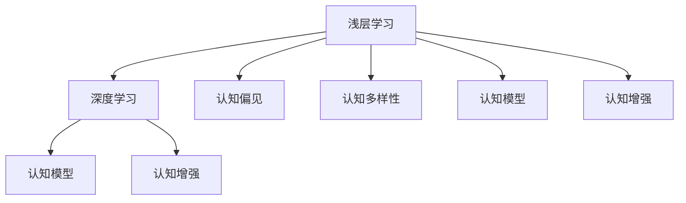

                 

# 认知过程中浅薄与深刻的对比

> 关键词：认知、浅层学习、深度学习、认知偏见、认知多样性、认知模型、认知增强

## 1. 背景介绍

### 1.1 问题由来

认知是人类大脑对外界信息进行处理、理解和推理的过程。这一过程不仅涉及到感知、记忆、语言理解等多个方面，还与个体的经验、教育背景、文化环境等密切相关。在人工智能领域，特别是深度学习技术的推动下，通过神经网络和机器学习算法对认知过程进行模拟和理解，已成为研究热点。

然而，无论是人还是机器，在认知过程中都可能存在浅薄与深刻的不同层次。浅薄认知往往基于表面现象或简单规则，难以处理复杂或未知的情况；而深刻认知则能深入理解事物的本质，能够应对更多样化、复杂化的情境。本文将从浅层学习和深度学习的角度出发，探讨认知过程中浅薄与深刻的对比，旨在为认知模型的设计和应用提供有价值的参考。

## 2. 核心概念与联系

### 2.1 核心概念概述

为了深入理解认知过程中浅薄与深刻的对比，我们首先需要明确几个关键概念：

- **浅层学习**：指机器通过简单的特征提取和线性分类等浅层算法进行信息处理的机制。这一过程通常不涉及深度神经网络的多层非线性变换。
- **深度学习**：通过多层神经网络对输入数据进行非线性变换，自动学习复杂特征表示的一种高级学习范式。深度学习能够处理大规模非结构化数据，具有强大的表示学习能力。
- **认知偏见**：指人在认知过程中由于先验知识、心理习惯等因素导致的判断错误或认知偏差。例如，确认偏误、后见之明等。
- **认知多样性**：指个体在认知过程中对不同信息源、不同角度的接受和整合能力。包括语言理解、文化差异等。
- **认知模型**：模拟人类认知过程的计算模型，能够通过训练学习从输入数据中提取特征，并基于这些特征进行推理、决策。
- **认知增强**：通过技术手段增强人类认知能力的努力。包括脑机接口、智能辅助系统等。

这些概念之间的关系可以通过以下Mermaid流程图来展示：



这个流程图展示了浅层学习和深度学习如何影响认知过程，认知偏见、认知多样性和认知模型如何共同作用于认知过程，以及认知增强在提升认知能力方面的作用。

## 3. 核心算法原理 & 具体操作步骤

### 3.1 算法原理概述

深度学习在处理认知任务时，通过多层非线性变换，自动学习输入数据的高级特征表示。这一过程类似于人脑中的神经元网络，通过多次迭代和反向传播，逐步优化模型参数，从而实现对输入数据的深层次理解和复杂特征的提取。

相比之下，浅层学习则更侧重于简单的特征提取和线性分类。这一过程通常不涉及复杂的非线性变换，难以处理复杂的输入数据。

### 3.2 算法步骤详解

以下是基于深度学习的认知任务处理流程：

**Step 1: 数据预处理**
- 收集与认知任务相关的数据，如文本、图像、音频等。
- 对数据进行清洗、归一化、标记等预处理步骤。

**Step 2: 构建认知模型**
- 选择适合的深度神经网络结构，如卷积神经网络（CNN）、递归神经网络（RNN）、变压器（Transformer）等。
- 设计合适的损失函数和优化器，如交叉熵、Adam等。

**Step 3: 训练认知模型**
- 使用标注数据对认知模型进行监督学习，通过前向传播和反向传播更新模型参数。
- 在验证集上评估模型性能，调整超参数以防止过拟合。

**Step 4: 模型评估与应用**
- 在测试集上评估模型性能，验证其在实际应用中的效果。
- 应用模型对新的认知任务进行推理、决策。

### 3.3 算法优缺点

深度学习在处理复杂认知任务时具有以下优点：
- 强大的特征表示能力，能够自动学习高级特征。
- 处理大规模非结构化数据的能力，适用于多种认知任务。
- 高度的泛化能力，能够在不同领域和场景下表现良好。

然而，深度学习也存在以下缺点：
- 对数据质量和标注需求较高，需要大量高质量标注数据。
- 模型复杂度较高，训练和推理耗时较长。
- 对模型结构和超参数的调优要求较高，需要丰富的经验和技巧。

### 3.4 算法应用领域

深度学习在认知任务中的应用广泛，涉及以下领域：

- **自然语言处理（NLP）**：如文本分类、情感分析、机器翻译、对话系统等。
- **计算机视觉（CV）**：如图像分类、目标检测、人脸识别、视频分析等。
- **语音识别与处理**：如语音识别、情感识别、语音生成等。
- **推荐系统**：如用户行为分析、商品推荐等。
- **医疗诊断**：如医学影像分析、疾病预测等。

深度学习在以上领域的成功应用，展现了其强大的认知处理能力。

## 4. 数学模型和公式 & 详细讲解 & 举例说明

### 4.1 数学模型构建

基于深度学习的认知模型通常包括输入层、多个隐藏层和输出层。以文本分类任务为例，数学模型可以表示为：

$$
\text{model}(x) = \text{softmax}(\text{softmax}(\text{FFN}(\text{embedding}(x))))
$$

其中，$x$ 表示输入文本，$\text{embedding}(x)$ 表示文本嵌入，$\text{FFN}$ 表示前馈神经网络，$\text{softmax}$ 表示输出层的激活函数。

### 4.2 公式推导过程

以文本分类任务为例，其损失函数通常为交叉熵损失：

$$
\mathcal{L} = -\frac{1}{N}\sum_{i=1}^N \sum_{j=1}^C y_j \log(p_j)
$$

其中，$N$ 为样本数量，$C$ 为类别数，$y_j$ 为样本 $x_i$ 的真实类别，$p_j$ 为模型预测的类别概率。

### 4.3 案例分析与讲解

以情感分析为例，使用预训练的BERT模型进行微调，以处理英文电影评论的情感分类。具体步骤如下：

1. 数据预处理：收集电影评论数据，进行清洗和标记。
2. 构建模型：选择BERT作为预训练模型，添加分类头进行情感分类。
3. 训练模型：使用标注数据对模型进行微调，通过交叉熵损失进行优化。
4. 模型评估：在测试集上评估模型性能，使用混淆矩阵和准确率等指标。
5. 应用模型：将模型应用于新的电影评论，预测其情感极性。

## 5. 项目实践：代码实例和详细解释说明

### 5.1 开发环境搭建

1. 安装Python：从官网下载并安装Python。
2. 安装Pip：通过命令 `python -m pip install --upgrade pip` 更新pip。
3. 安装相关库：使用pip安装TensorFlow、Keras等深度学习库，以及相关依赖。

### 5.2 源代码详细实现

以下是使用TensorFlow和Keras构建情感分类模型的代码：

```python
import tensorflow as tf
from tensorflow.keras import layers, models

# 构建模型
input_layer = layers.Input(shape=(None,))
embedding_layer = layers.Embedding(input_dim=10000, output_dim=128)(input_layer)
lstm_layer = layers.LSTM(64)(embedding_layer)
output_layer = layers.Dense(2, activation='softmax')(lstm_layer)
model = models.Model(inputs=input_layer, outputs=output_layer)

# 编译模型
model.compile(optimizer='adam', loss='categorical_crossentropy', metrics=['accuracy'])

# 训练模型
model.fit(train_dataset, epochs=10, validation_data=val_dataset)

# 评估模型
test_loss, test_acc = model.evaluate(test_dataset)
print(f'Test loss: {test_loss}, Test accuracy: {test_acc}')
```

### 5.3 代码解读与分析

上述代码实现了使用LSTM层和softmax输出层对电影评论进行情感分类。模型首先通过嵌入层将输入的文本转换为向量表示，然后通过LSTM层进行序列建模，最后通过全连接层输出情感类别。在训练过程中，使用交叉熵损失进行优化，并监测准确率作为评估指标。

## 6. 实际应用场景

### 6.1 自然语言处理

深度学习在自然语言处理中的应用已经非常广泛。例如，情感分析、机器翻译、问答系统等任务都可以通过深度学习模型进行处理。这些模型通过学习语言的上下文和语义特征，实现了对自然语言的高效理解和生成。

### 6.2 计算机视觉

深度学习在计算机视觉领域的应用也非常广泛。例如，图像分类、目标检测、人脸识别、视频分析等任务都可以通过深度学习模型进行处理。这些模型通过学习图像的特征表示，实现了对视觉信息的高级理解。

### 6.3 医疗诊断

深度学习在医疗诊断中的应用也日益增多。例如，医学影像分析、疾病预测等任务都可以通过深度学习模型进行处理。这些模型通过学习医学影像的特征表示，实现了对疾病的高效诊断和预测。

### 6.4 未来应用展望

未来，深度学习将在更多领域得到应用，为人类认知能力的提升带来新的突破。例如，在自动驾驶、智能家居、虚拟助手等领域，深度学习模型的应用将更加广泛。

## 7. 工具和资源推荐

### 7.1 学习资源推荐

为了帮助开发者系统掌握深度学习在认知任务中的应用，这里推荐一些优质的学习资源：

1. Deep Learning Specialization by Andrew Ng：由斯坦福大学教授Andrew Ng开设的深度学习课程，涵盖了深度学习的各个方面，从基础到高级。
2. TensorFlow官方文档：TensorFlow的官方文档，提供了丰富的教程和样例代码，是学习深度学习的必备资源。
3. PyTorch官方文档：PyTorch的官方文档，提供了详细的API说明和样例代码，适合初学者快速上手。
4. Fast.ai：Fast.ai提供了一系列深度学习课程和资源，以实用为导向，适合希望快速应用深度学习的开发者。

### 7.2 开发工具推荐

深度学习模型的开发离不开优秀的工具支持。以下是几款常用的深度学习开发工具：

1. TensorFlow：由Google主导开发的深度学习框架，支持分布式训练和推理，适合大规模工程应用。
2. PyTorch：由Facebook开发的深度学习框架，支持动态图和静态图，适合快速迭代和研究。
3. Keras：基于TensorFlow和Theano的高级深度学习框架，提供简单易用的API，适合初学者使用。
4. Jupyter Notebook：开源的交互式编程环境，支持代码编写、数据处理和可视化，适合深度学习研究和开发。

### 7.3 相关论文推荐

深度学习在认知任务中的应用源于学界的持续研究。以下是几篇奠基性的相关论文，推荐阅读：

1. ImageNet Classification with Deep Convolutional Neural Networks：提出使用卷积神经网络（CNN）进行图像分类，标志着深度学习在计算机视觉领域的突破。
2. Attention Is All You Need：提出使用Transformer模型进行自然语言处理，开启了预训练大模型时代。
3. Deep Residual Learning for Image Recognition：提出使用残差网络（ResNet）进行图像分类，显著提升了深度神经网络的训练效率和精度。
4. Sequence to Sequence Learning with Neural Networks：提出使用循环神经网络（RNN）进行序列到序列的生成任务，如机器翻译、对话系统等。
5. A Survey on Deep Learning for Visual Recognition：综述了深度学习在计算机视觉领域的应用，包括图像分类、目标检测、人脸识别等。

这些论文代表了深度学习在认知任务中的发展脉络。通过学习这些前沿成果，可以帮助研究者把握学科前进方向，激发更多的创新灵感。

## 8. 总结：未来发展趋势与挑战

### 8.1 总结

本文从浅层学习和深度学习的角度出发，探讨了认知过程中浅薄与深刻的对比。深度学习在处理复杂认知任务时具有强大的特征表示能力和泛化能力，但同时也存在数据需求高、模型复杂度大等挑战。浅层学习则更侧重于简单的特征提取和线性分类，适用于处理简单的认知任务。

通过本文的系统梳理，可以看到，深度学习在认知任务中的应用已经取得了显著的成果，但仍然面临许多挑战。未来，需要在数据质量、模型结构、训练效率等方面进行深入研究，才能进一步提升深度学习模型的性能和应用范围。

### 8.2 未来发展趋势

展望未来，深度学习在认知任务中的应用将呈现以下几个发展趋势：

1. 更加高效的结构设计：通过结构优化和算法创新，提高深度学习模型的训练和推理效率。
2. 更好的模型解释：开发更加透明、可解释的深度学习模型，提升模型的可解释性和可信度。
3. 更加广泛的适用性：进一步拓展深度学习在各领域的适用性，如自动驾驶、智能家居等。
4. 更加灵活的超参数调优：开发更加灵活的超参数调优方法，提高模型训练的稳定性和性能。

### 8.3 面临的挑战

尽管深度学习在认知任务中的应用已经取得了显著的成果，但在迈向更加智能化、普适化应用的过程中，仍面临诸多挑战：

1. 数据质量和标注成本：深度学习模型对高质量标注数据的需求较高，标注成本也较高。
2. 模型复杂度和资源消耗：深度学习模型通常具有较高的复杂度，训练和推理耗时较长。
3. 模型解释和可信度：深度学习模型的内部工作机制不透明，难以解释其决策过程。
4. 泛化能力和鲁棒性：深度学习模型在不同领域和场景下的泛化能力和鲁棒性需要进一步提高。
5. 安全性和隐私保护：深度学习模型在实际应用中可能面临数据泄露、隐私保护等问题。

### 8.4 研究展望

未来，深度学习在认知任务中的应用需要进一步优化和改进。具体的研究方向包括：

1. 引入更多先验知识：将符号化的先验知识与深度学习模型进行结合，提高模型的鲁棒性和泛化能力。
2. 开发更加灵活的结构设计：探索更加高效的结构设计，提高深度学习模型的训练和推理效率。
3. 提高模型的可解释性：开发更加透明、可解释的深度学习模型，提升模型的可信度。
4. 实现更加灵活的超参数调优：开发更加灵活的超参数调优方法，提高模型训练的稳定性和性能。
5. 引入多模态数据：将视觉、语音、文本等多种模态数据进行融合，实现多模态认知增强。

这些研究方向将进一步推动深度学习在认知任务中的应用，为人类认知能力的提升带来新的突破。

## 9. 附录：常见问题与解答

**Q1：深度学习模型如何处理输入数据？**

A: 深度学习模型通过输入层将原始数据（如文本、图像等）转换为模型能够处理的向量表示，然后进行多层的非线性变换。例如，文本数据通过嵌入层转换为向量表示，图像数据通过卷积层转换为特征表示。

**Q2：深度学习模型如何避免过拟合？**

A: 深度学习模型通常使用数据增强、正则化、dropout等方法来避免过拟合。例如，通过在训练集上增加随机裁剪、旋转等数据增强方式，使用L2正则化、dropout等正则化技术，可以提高模型的泛化能力和鲁棒性。

**Q3：深度学习模型的训练和推理效率如何提升？**

A: 可以通过模型压缩、量化加速、混合精度训练等技术来提升深度学习模型的训练和推理效率。例如，使用剪枝、量化等方法减少模型参数，使用混合精度训练减少内存占用和计算成本。

**Q4：深度学习模型在实际应用中面临哪些挑战？**

A: 深度学习模型在实际应用中面临数据质量、模型复杂度、训练时间、资源消耗、模型解释和可信度等挑战。需要针对具体应用场景进行优化和改进，才能获得良好的效果。

**Q5：深度学习模型在认知任务中的应用前景如何？**

A: 深度学习在认知任务中的应用前景非常广阔，能够处理自然语言、视觉、语音等多种模态数据，适用于情感分析、图像分类、对话系统等多种认知任务。未来，深度学习模型将在更多领域得到应用，为人类认知能力的提升带来新的突破。

---

作者：禅与计算机程序设计艺术 / Zen and the Art of Computer Programming

