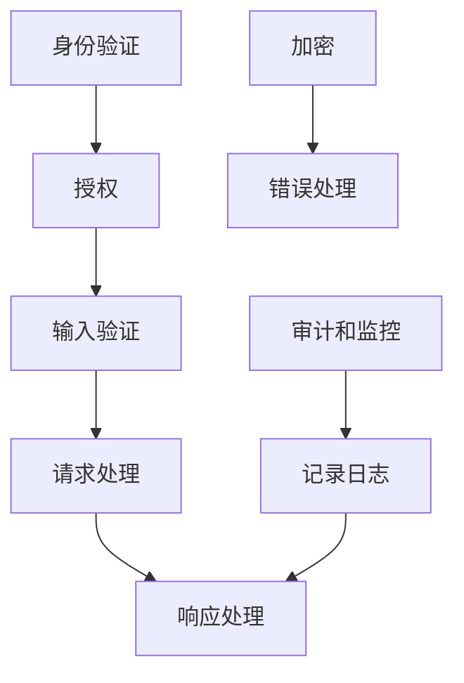

                 

## 1. 背景介绍

在现代软件开发中，API（应用程序编程接口）扮演着至关重要的角色，它们是应用程序之间的桥梁，允许程序以一种标准化的方式进行通信和交互。然而，API的安全性问题日益严重，它们往往成为攻击者入侵系统的重要入口。设计安全的API不仅关乎业务连续性和用户隐私，还涉及到企业的声誉和市场竞争。因此，设计安全的API成为了软件工程和网络安全领域的一个重要课题。

### 1.1 问题由来

随着API的应用范围越来越广，API的安全性问题日益凸显。例如，亚马逊的AWS API在2019年曾被黑客攻击，导致数百万个用户的账户信息泄露。这不仅给用户造成了巨大的损失，也严重影响了亚马逊的品牌声誉。因此，设计安全的API已经成为企业必须解决的问题。

### 1.2 问题核心关键点

设计安全的API涉及多个方面，包括身份验证、授权、输入验证、加密、错误处理等。以下是设计安全API的核心要点：

1. **身份验证和授权**：确保只有经过验证的用户才能访问API。
2. **输入验证**：防止恶意输入导致安全漏洞。
3. **加密**：确保数据在传输和存储过程中的安全性。
4. **错误处理**：避免敏感信息泄露。
5. **审计和监控**：记录和追踪API访问，及时发现和处理异常行为。

这些关键点涵盖了API设计的各个方面，是确保API安全性的基础。

## 2. 核心概念与联系

### 2.1 核心概念概述

为了更好地理解设计安全API的注意事项，本节将介绍几个密切相关的核心概念：

- **身份验证**：确定用户身份的过程，通常使用密码、令牌、生物特征等方式。
- **授权**：根据用户身份，限制其对API资源的访问权限。
- **输入验证**：检查和过滤API请求中的输入数据，防止SQL注入、跨站脚本攻击等。
- **加密**：对敏感数据进行加密处理，防止数据泄露。
- **错误处理**：处理API请求中的错误，避免敏感信息泄露。
- **审计和监控**：记录和追踪API访问，及时发现和处理异常行为。

这些核心概念之间有着紧密的联系，共同构成了API安全性的保障体系。通过理解这些概念，我们可以更好地把握API设计的安全要求。

### 2.2 核心概念原理和架构的 Mermaid 流程图



这个流程图展示了API设计的各个环节及其相互关系：

1. 用户首先进行身份验证，确定其身份。
2. 根据验证结果进行授权，限制用户对API的访问权限。
3. 对用户输入进行验证，防止恶意输入。
4. 对敏感数据进行加密处理。
5. 处理API请求中的错误，避免敏感信息泄露。
6. 记录和追踪API访问，及时发现和处理异常行为。

这些环节构成了一个完整的API安全性保障体系，帮助保护API免受攻击。

## 3. 核心算法原理 & 具体操作步骤

### 3.1 算法原理概述

设计安全的API，其核心算法原理主要涉及以下几个方面：

- **身份验证算法**：确保用户身份的真实性和唯一性。
- **授权算法**：基于用户身份，限制其对API资源的访问权限。
- **输入验证算法**：检查和过滤API请求中的输入数据，防止恶意输入。
- **加密算法**：对敏感数据进行加密处理，防止数据泄露。
- **错误处理算法**：处理API请求中的错误，避免敏感信息泄露。
- **审计和监控算法**：记录和追踪API访问，及时发现和处理异常行为。

这些算法共同构成了一个完整的API安全性保障体系，确保API的安全性。

### 3.2 算法步骤详解

设计安全的API涉及多个步骤，包括需求分析、设计、实现、测试和部署。以下是设计安全API的主要步骤：

**Step 1: 需求分析**

- 确定API的功能和安全性需求。
- 了解用户和应用场景，制定安全策略。

**Step 2: 设计**

- 设计API接口，包括URL、请求方法、请求参数等。
- 制定身份验证和授权策略。
- 设计输入验证和加密算法。
- 制定错误处理和审计监控策略。

**Step 3: 实现**

- 实现API接口，包括编写代码、配置环境等。
- 实现身份验证和授权算法。
- 实现输入验证和加密算法。
- 实现错误处理和审计监控算法。

**Step 4: 测试**

- 进行单元测试，确保API各个组件正常工作。
- 进行安全测试，包括身份验证、授权、输入验证、加密、错误处理、审计和监控等。
- 修复测试中发现的问题。

**Step 5: 部署**

- 将API部署到生产环境。
- 配置日志记录和监控系统。

### 3.3 算法优缺点

设计安全的API具有以下优点：

1. 提高API的安全性，减少安全漏洞和攻击。
2. 保护用户数据和隐私，提升用户信任度。
3. 避免因API漏洞导致的业务中断和损失。

同时，设计安全的API也存在一些缺点：

1. 设计和实现复杂，需要投入更多时间和资源。
2. 增加了开发和运维的难度和成本。
3. 可能影响API的性能和响应速度。

尽管如此，设计安全的API对于保障API的安全性和可靠性至关重要，是现代软件开发不可或缺的一部分。

### 3.4 算法应用领域

设计安全的API广泛应用于各种软件开发场景，包括：

- 云服务API：确保云计算服务的安全性。
- 移动应用API：确保移动应用的访问安全。
- Web应用API：确保Web应用的访问安全。
- IoT设备API：确保物联网设备的访问安全。
- 企业内部API：确保企业内部系统的访问安全。

这些领域的设计安全和API安全密切相关，需要采用类似的策略和措施。

## 4. 数学模型和公式 & 详细讲解 & 举例说明

### 4.1 数学模型构建

设计安全的API涉及到多个数学模型，以下是对几个核心模型的构建和说明：

- **身份验证模型**：通过密码、令牌等验证用户身份。
- **授权模型**：根据用户身份，限制其对API资源的访问权限。
- **输入验证模型**：检查和过滤API请求中的输入数据，防止SQL注入、跨站脚本攻击等。
- **加密模型**：对敏感数据进行加密处理，防止数据泄露。
- **错误处理模型**：处理API请求中的错误，避免敏感信息泄露。
- **审计和监控模型**：记录和追踪API访问，及时发现和处理异常行为。

### 4.2 公式推导过程

以下是对几个核心模型的公式推导过程：

- **身份验证模型**：假设密码为 $P$，令牌为 $T$，验证函数为 $V$，则验证过程可以表示为：

  $$
  V(P, T) = \begin{cases}
  true, & \text{如果 } P = P' \text{ 且 } T = T' \\
  false, & \text{否则}
  \end{cases}
  $$

- **授权模型**：假设用户角色为 $R$，API资源为 $A$，授权函数为 $A$，则授权过程可以表示为：

  $$
  A(R, A) = \begin{cases}
  true, & \text{如果 } R \in P(A) \\
  false, & \text{否则}
  \end{cases}
  $$

- **输入验证模型**：假设输入数据为 $I$，验证函数为 $V$，则验证过程可以表示为：

  $$
  V(I) = \begin{cases}
  true, & \text{如果 } I \in V \\
  false, & \text{否则}
  \end{cases}
  $$

- **加密模型**：假设明文为 $P$，密文为 $C$，加密函数为 $E$，则加密过程可以表示为：

  $$
  C = E(P)
  $$

- **错误处理模型**：假设请求为 $R$，响应为 $R'$，错误处理函数为 $H$，则错误处理过程可以表示为：

  $$
  R' = H(R)
  $$

- **审计和监控模型**：假设访问记录为 $R$，日志为 $L$，审计函数为 $A$，则审计过程可以表示为：

  $$
  L = A(R)
  $$

### 4.3 案例分析与讲解

以下是一个设计安全API的案例分析：

假设我们设计一个云存储服务的API，其功能包括上传、下载、删除文件等。我们需要设计一个安全API，确保只有授权用户才能访问文件。

**Step 1: 需求分析**

- 用户需要身份验证。
- 用户需要授权访问特定文件。
- 需要防止SQL注入、跨站脚本攻击等安全漏洞。
- 需要对敏感数据进行加密处理。
- 需要记录和追踪API访问，及时发现和处理异常行为。

**Step 2: 设计**

- 设计API接口，包括URL、请求方法、请求参数等。
- 制定身份验证和授权策略。
- 设计输入验证和加密算法。
- 制定错误处理和审计监控策略。

**Step 3: 实现**

- 实现API接口，包括编写代码、配置环境等。
- 实现身份验证和授权算法。
- 实现输入验证和加密算法。
- 实现错误处理和审计监控算法。

**Step 4: 测试**

- 进行单元测试，确保API各个组件正常工作。
- 进行安全测试，包括身份验证、授权、输入验证、加密、错误处理、审计和监控等。
- 修复测试中发现的问题。

**Step 5: 部署**

- 将API部署到生产环境。
- 配置日志记录和监控系统。

## 5. 项目实践：代码实例和详细解释说明

### 5.1 开发环境搭建

在进行API设计和安全实践前，我们需要准备好开发环境。以下是使用Python进行Flask开发的环境配置流程：

1. 安装Anaconda：从官网下载并安装Anaconda，用于创建独立的Python环境。

2. 创建并激活虚拟环境：
```bash
conda create -n flask-env python=3.8 
conda activate flask-env
```

3. 安装Flask：
```bash
pip install Flask
```

4. 安装Flask-Security：
```bash
pip install Flask-Security
```

5. 安装Flask-JWT-Extended：
```bash
pip install Flask-JWT-Extended
```

完成上述步骤后，即可在`flask-env`环境中开始API设计实践。

### 5.2 源代码详细实现

以下是使用Flask设计安全API的代码实现。

```python
from flask import Flask, request
from flask_jwt_extended import JWTManager, jwt_required, create_access_token
from flask_sqlalchemy import SQLAlchemy

app = Flask(__name__)
app.config['SQLALCHEMY_DATABASE_URI'] = 'sqlite:////tmp/test.db'
app.config['JWT_SECRET_KEY'] = 'super-secret'
app.config['JWT_ACCESS_TOKEN_EXPIRES'] = 3600

app.config['SECRET_KEY'] = 'super-secret'
app.config['SQLALCHEMY_DATABASE_URI'] = 'sqlite:////tmp/test.db'

db = SQLAlchemy(app)
jwt = JWTManager(app)

class User(db.Model):
    id = db.Column(db.Integer, primary_key=True)
    username = db.Column(db.String(80), unique=True, nullable=False)
    password = db.Column(db.String(120), nullable=False)

@app.route('/login', methods=['POST'])
def login():
    username = request.json.get('username')
    password = request.json.get('password')
    user = User.query.filter_by(username=username).first()
    if user and user.check_password(password):
        access_token = create_access_token(identity=username)
        return {'access_token': access_token}, 200
    else:
        return {'message': 'Invalid username or password'}, 401

@app.route('/files', methods=['GET', 'POST'])
@jwt_required
def files():
    if request.method == 'GET':
        # 获取文件列表
        pass
    elif request.method == 'POST':
        # 上传文件
        pass
    else:
        return {'message': 'Invalid request method'}, 405

@app.route('/files/<file_id>', methods=['DELETE'])
@jwt_required
def delete_file(file_id):
    # 删除文件
    pass

if __name__ == '__main__':
    app.run(debug=True)
```

这个代码实现了基本的身份验证和授权功能。具体步骤如下：

1. 创建Flask应用，并配置数据库和JWT密钥。
2. 定义User模型，存储用户信息。
3. 实现/login路由，验证用户身份并返回访问令牌。
4. 实现/files路由，需要身份验证才能访问，包括文件列表获取、文件上传和文件删除。
5. 启动应用，并运行debug模式。

### 5.3 代码解读与分析

让我们再详细解读一下关键代码的实现细节：

- **Flask-Security**：使用Flask-Security进行身份验证和授权。
- **Flask-JWT-Extended**：使用Flask-JWT-Extended实现JWT令牌验证。
- **User模型**：定义User模型，存储用户信息。
- **/login路由**：实现登录接口，验证用户身份并返回JWT令牌。
- **/files路由**：实现文件操作接口，需要身份验证才能访问。
- **delete_file函数**：实现删除文件接口，需要身份验证。

可以看到，Flask-Security和Flask-JWT-Extended提供了强大的身份验证和授权功能，使得API设计更加便捷和安全。

当然，实际应用中还需要考虑更多的因素，如数据库安全、密码加密、错误处理、审计和监控等。但核心的身份验证和授权功能已经通过代码实现了，未来可以根据具体需求进行优化和扩展。

## 6. 实际应用场景

### 6.1 企业内部API

企业内部API是设计安全API的重要应用场景之一。例如，企业内部的开发团队可以通过API访问数据库、缓存、第三方服务等，以便高效协同开发。

在设计企业内部API时，需要确保：

1. 只有授权团队成员才能访问API。
2. 访问权限根据团队成员的职责进行限制。
3. 对敏感数据进行加密处理。
4. 记录和追踪API访问，及时发现和处理异常行为。

通过设计安全的企业内部API，企业可以提高开发效率，同时保障数据安全。

### 6.2 移动应用API

移动应用API是设计安全API的另一个重要应用场景。移动应用通过API访问后端服务，获取数据、执行操作等。

在设计移动应用API时，需要确保：

1. 用户需要进行身份验证。
2. 对敏感数据进行加密处理。
3. 记录和追踪API访问，及时发现和处理异常行为。

通过设计安全的移动应用API，移动应用可以保护用户数据，提升用户体验，同时保障应用安全。

### 6.3 云服务API

云服务API是设计安全API的重要应用场景之一。云服务通过API提供计算、存储、网络等服务，保障业务连续性。

在设计云服务API时，需要确保：

1. 用户需要进行身份验证。
2. 对敏感数据进行加密处理。
3. 记录和追踪API访问，及时发现和处理异常行为。

通过设计安全的云服务API，云服务提供商可以保障业务连续性，同时保护用户数据安全。

### 6.4 未来应用展望

随着API应用场景的不断扩展，设计安全的API将成为未来软件开发的重要趋势。以下是对未来API安全性的展望：

1. 人工智能与API结合：利用人工智能技术，提升API安全性和自动化水平。
2. 多云环境下的API安全：在多云环境下，设计安全的API，确保跨云应用的安全性。
3. 分布式环境下的API安全：在分布式环境中，设计安全的API，确保微服务架构的安全性。
4. 区块链技术的应用：利用区块链技术，确保API的透明性和不可篡改性。
5. 云计算环境下的API安全：在云计算环境中，设计安全的API，确保云服务的安全性。

这些趋势将推动API安全性的不断提升，为软件开发带来新的机遇和挑战。

## 7. 工具和资源推荐

### 7.1 学习资源推荐

为了帮助开发者系统掌握API设计和安全理论基础，以下是一些优质的学习资源：

1. 《RESTful API设计指南》：介绍RESTful API设计原则和最佳实践。
2. 《Flask Web Development》：Flask框架的官方文档，详细介绍了Flask的安全功能和API设计。
3. 《Flask-Security官方文档》：Flask-Security的官方文档，介绍了身份验证和授权的实现方法。
4. 《Flask-JWT-Extended官方文档》：Flask-JWT-Extended的官方文档，介绍了JWT令牌验证的实现方法。
5. 《API安全设计》：详细介绍API安全设计的原则和最佳实践。

通过对这些资源的学习实践，相信你一定能够快速掌握API设计和安全设计的精髓，并用于解决实际的API安全问题。

### 7.2 开发工具推荐

高效的开发离不开优秀的工具支持。以下是几款用于API设计和安全的常用工具：

1. Flask：基于Python的轻量级Web框架，灵活高效，适合快速开发API。
2. Flask-Security：Flask框架的安全插件，提供身份验证和授权功能。
3. Flask-JWT-Extended：Flask框架的JWT令牌验证插件。
4. PyJWT：Python的JWT库，支持JWT令牌的生成和验证。
5. SQLAlchemy：Python的ORM库，方便进行数据库操作。
6. PyMySQL：Python的MySQL库，方便进行MySQL数据库操作。

合理利用这些工具，可以显著提升API设计和安全的开发效率，加快创新迭代的步伐。

### 7.3 相关论文推荐

API设计和安全设计的研究源于学界的持续研究。以下是几篇奠基性的相关论文，推荐阅读：

1. "Secure Web API Design: A Security and Privacy Guideline"：介绍Web API设计原则和最佳实践。
2. "Designing and Implementing Secure Web APIs"：详细介绍Web API设计和实施的最佳实践。
3. "API Security for Cloud Native Applications"：介绍云原生应用API安全的实现方法。
4. "Secure RESTful API Design"：介绍RESTful API设计和安全的最佳实践。
5. "Designing Secure APIs with OAuth2"：介绍OAuth2在API设计中的应用。

这些论文代表了大API设计和安全设计的最新进展，通过学习这些前沿成果，可以帮助研究者把握学科前进方向，激发更多的创新灵感。

## 8. 总结：未来发展趋势与挑战

### 8.1 总结

本文对设计安全API的注意事项进行了全面系统的介绍。首先阐述了API设计和安全设计的背景和意义，明确了设计安全API的重要性。其次，从原理到实践，详细讲解了身份验证、授权、输入验证、加密、错误处理、审计和监控等核心概念，给出了API设计和安全的完整代码实例。同时，本文还探讨了API设计在企业内部、移动应用、云服务等多个领域的应用前景，展示了API设计的安全性和重要性。

通过本文的系统梳理，可以看到，设计安全的API已经成为软件开发的重要组成部分，关乎业务连续性、用户隐私和企业声誉。未来，随着API应用的不断扩展，设计安全的API将发挥越来越重要的作用，保障软件开发的安全性和可靠性。

### 8.2 未来发展趋势

展望未来，API设计和安全设计将呈现以下几个发展趋势：

1. 人工智能与API结合：利用人工智能技术，提升API安全性和自动化水平。
2. 多云环境下的API安全：在多云环境下，设计安全的API，确保跨云应用的安全性。
3. 分布式环境下的API安全：在分布式环境中，设计安全的API，确保微服务架构的安全性。
4. 区块链技术的应用：利用区块链技术，确保API的透明性和不可篡改性。
5. 云计算环境下的API安全：在云计算环境中，设计安全的API，确保云服务的安全性。

这些趋势凸显了API设计和安全设计的广阔前景，为软件开发带来了新的机遇和挑战。

### 8.3 面临的挑战

尽管API设计和安全设计已经取得了一定的进展，但在迈向更加智能化、普适化应用的过程中，它们仍面临诸多挑战：

1. 设计和实现复杂，需要投入更多时间和资源。
2. 增加了开发和运维的难度和成本。
3. 可能影响API的性能和响应速度。

尽管如此，设计安全的API对于保障API的安全性和可靠性至关重要，是现代软件开发不可或缺的一部分。

### 8.4 研究展望

未来，API设计和安全设计的研究需要在以下几个方面寻求新的突破：

1. 探索无监督和半监督设计方法。摆脱对大规模标注数据的依赖，利用自监督学习、主动学习等无监督和半监督范式，最大限度利用非结构化数据，实现更加灵活高效的设计。
2. 研究参数高效和计算高效的API设计方法。开发更加参数高效的API设计方法，在固定大部分API参数的情况下，只更新极少量的任务相关参数。同时优化API设计的计算图，减少前向传播和反向传播的资源消耗，实现更加轻量级、实时性的部署。
3. 引入更多先验知识。将符号化的先验知识，如知识图谱、逻辑规则等，与神经网络模型进行巧妙融合，引导API设计过程学习更准确、合理的API设计知识。
4. 结合因果分析和博弈论工具。将因果分析方法引入API设计，识别出API设计决策的关键特征，增强输出解释的因果性和逻辑性。借助博弈论工具刻画人机交互过程，主动探索并规避API设计的脆弱点，提高系统稳定性。
5. 纳入伦理道德约束。在API设计目标中引入伦理导向的评估指标，过滤和惩罚有害的输出倾向。同时加强人工干预和审核，建立API设计的监管机制，确保输出符合人类价值观和伦理道德。

这些研究方向的探索，必将引领API设计和安全设计技术迈向更高的台阶，为构建安全、可靠、可解释、可控的智能系统铺平道路。面向未来，API设计和安全设计技术还需要与其他人工智能技术进行更深入的融合，如知识表示、因果推理、强化学习等，多路径协同发力，共同推动API设计技术的发展。只有勇于创新、敢于突破，才能不断拓展API设计的边界，让智能技术更好地造福人类社会。

## 9. 附录：常见问题与解答

**Q1: API设计和安全设计是否适用于所有软件开发场景？**

A: API设计和安全设计在大多数软件开发场景中都有应用价值。但需要注意的是，对于某些特殊场景，如低延迟应用、实时性应用等，API设计和安全设计可能会带来额外的资源消耗，需要根据具体情况进行权衡。

**Q2: 设计安全的API会增加开发和运维的难度和成本吗？**

A: 设计安全的API确实会增加开发和运维的难度和成本。但相比因安全漏洞带来的潜在风险和损失，这些投入是非常有必要的。通过合理设计和实现安全的API，可以极大地提升系统的安全性和可靠性，减少安全漏洞和攻击。

**Q3: API设计和安全设计会影响API的性能和响应速度吗？**

A: 设计安全的API可能会对API的性能和响应速度带来一定的影响。但通过优化设计和实现，可以最小化这种影响，甚至提升API的性能。例如，利用缓存、异步处理等技术，可以提升API的响应速度。

**Q4: 如何设计安全的API？**

A: 设计安全的API需要遵循以下原则：

1. 确定API的功能和安全性需求。
2. 了解用户和应用场景，制定安全策略。
3. 设计API接口，包括URL、请求方法、请求参数等。
4. 制定身份验证和授权策略。
5. 设计输入验证和加密算法。
6. 制定错误处理和审计监控策略。
7. 实现API接口，包括编写代码、配置环境等。
8. 实现身份验证和授权算法。
9. 实现输入验证和加密算法。
10. 实现错误处理和审计监控算法。
11. 进行单元测试，确保API各个组件正常工作。
12. 进行安全测试，包括身份验证、授权、输入验证、加密、错误处理、审计和监控等。
13. 修复测试中发现的问题。
14. 配置日志记录和监控系统。

通过遵循这些原则，可以设计出更加安全、可靠的API。

**Q5: 如何保护API的访问安全？**

A: 保护API的访问安全需要遵循以下原则：

1. 用户需要进行身份验证。
2. 对敏感数据进行加密处理。
3. 记录和追踪API访问，及时发现和处理异常行为。

通过遵循这些原则，可以保护API的访问安全，确保API免受攻击。

---
作者：禅与计算机程序设计艺术 / Zen and the Art of Computer Programming

