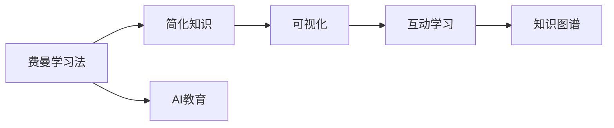

                 

# 费曼学习法在AI教育中的应用

## 1. 背景介绍

随着人工智能(AI)技术的飞速发展，越来越多的教育机构和在线平台开始引入AI教育。AI教育不仅能提供个性化的学习体验，还能显著提升学习效率。然而，如何更好地利用AI技术，使其在教育领域发挥更大的作用，成为了一个重要的问题。

费曼学习法（Feynman Technique），以其直观、易懂的教学方式，成为了一种广受欢迎的学习方法。它通过将复杂知识简化，使学习者能够更好地理解和掌握知识。本文将探讨如何将费曼学习法应用于AI教育，帮助学习者更好地理解AI技术的原理和应用。

## 2. 核心概念与联系

### 2.1 核心概念概述

为了更好地理解费曼学习法在AI教育中的应用，首先需要介绍一些核心概念：

- **费曼学习法**：由物理学家理查德·费曼（Richard Feynman）提出，是一种通过简洁、明了的语言解释和可视化，帮助学习者深入理解知识的学习方法。
- **AI教育**：指利用AI技术，如自然语言处理(NLP)、机器学习(ML)、计算机视觉(CV)等，实现个性化学习、自动化评估、智能推荐等教育功能。
- **可视化**：通过图表、动画、示例等形式，将抽象的概念具象化，帮助学习者更好地理解。
- **交互式学习**：通过在线课程、智能辅导系统等，提供互动式的学习体验，提升学习效果。
- **知识图谱**：通过构建知识节点之间的关联，帮助学习者掌握知识结构，提升学习效率。

这些核心概念共同构成了AI教育的基础框架，使得通过费曼学习法实现AI教育的理念成为可能。

### 2.2 核心概念原理和架构的 Mermaid 流程图



这个流程图展示了费曼学习法在AI教育中的应用流程：首先通过费曼学习法简化知识，接着将知识进行可视化，然后提供互动式的学习体验，最后通过知识图谱帮助学习者掌握知识结构。

## 3. 核心算法原理 & 具体操作步骤

### 3.1 算法原理概述

费曼学习法的核心思想是，通过简明扼要的语言和可视化方式，将复杂知识简化，使学习者能够深入理解和掌握。在AI教育中，这一思想同样适用。通过将复杂的AI技术解释成通俗易懂的语言，并结合可视化工具，可以显著提升学习效果。

### 3.2 算法步骤详解

#### 3.2.1 简化知识

第一步是简化知识，使学习者能够更容易理解。这需要从以下几个方面入手：

1. **基础概念**：将AI技术的基础概念提炼出来，如深度学习、自然语言处理、计算机视觉等。
2. **关键算法**：讲解AI技术中的关键算法，如神经网络、决策树、支持向量机等。
3. **实际应用**：介绍AI技术在实际中的应用场景，如智能推荐系统、语音识别、图像识别等。

#### 3.2.2 可视化

第二步是进行知识可视化，使抽象的概念具象化。这可以通过以下几个方式实现：

1. **图表**：使用图表展示AI算法的基本结构，如神经网络的结构图、决策树的决策流程等。
2. **动画**：制作动画展示AI算法的运行过程，如神经网络的反向传播算法、梯度下降算法的迭代过程等。
3. **示例**：通过具体的代码示例，展示AI算法的实现过程。

#### 3.2.3 互动学习

第三步是提供互动式的学习体验，使学习者能够主动参与。这可以通过以下几个方式实现：

1. **在线课程**：提供在线课程，让学习者自主学习，并提供实时反馈。
2. **智能辅导系统**：开发智能辅导系统，根据学习者的进度和理解程度，自动调整教学内容和难度。
3. **互动问答**：提供互动问答平台，让学习者能够提出问题，并与AI模型进行互动。

#### 3.2.4 知识图谱

最后一步是构建知识图谱，帮助学习者掌握知识结构。这可以通过以下几个方式实现：

1. **知识节点**：将AI技术中的概念和算法作为知识节点，建立知识图谱的基本框架。
2. **关联关系**：在知识节点之间建立关联关系，如深度学习中卷积神经网络和循环神经网络之间的联系。
3. **知识图谱工具**：使用如Neo4j、Gephi等工具，构建和展示知识图谱。

### 3.3 算法优缺点

费曼学习法在AI教育中的应用，有以下优点：

1. **易于理解**：通过简明扼要的语言和可视化方式，使复杂的AI技术易于理解。
2. **互动性强**：通过在线课程和智能辅导系统，提供互动式的学习体验，提升学习效果。
3. **知识结构清晰**：通过知识图谱，帮助学习者掌握知识结构，提升学习效率。

同时，也存在一些缺点：

1. **需要时间**：简化和可视化知识需要大量的时间和精力，特别是在复杂技术面前。
2. **资源需求高**：开发互动式学习平台和知识图谱工具需要较高的技术资源和工具支持。
3. **适应性差**：对不同学习者的适应性可能需要调整，无法完全满足所有学习者的需求。

### 3.4 算法应用领域

费曼学习法在AI教育中的应用，可以覆盖多个领域：

1. **基础教育**：将AI技术的基础概念和算法简化并可视化，适用于中小学阶段的AI教育。
2. **高等教育**：提供更深入的AI技术讲解和互动学习体验，适用于大学及研究生阶段的AI教育。
3. **职业培训**：通过实际应用案例和互动式学习，提升AI技术在各行业的实际应用能力。
4. **在线教育**：将费曼学习法应用于在线课程，提供灵活、便捷的学习体验。

## 4. 数学模型和公式 & 详细讲解 & 举例说明

### 4.1 数学模型构建

费曼学习法在AI教育中的应用，可以通过以下几个数学模型来构建：

1. **知识简化模型**：将复杂的AI技术简化为基本概念和关键算法。
2. **可视化模型**：通过图表、动画等形式，将抽象的概念具象化。
3. **互动学习模型**：基于在线课程和智能辅导系统的学习模型。
4. **知识图谱模型**：通过知识节点和关联关系，构建知识图谱。

### 4.2 公式推导过程

以下是费曼学习法在AI教育中的应用，通过数学模型进行详细讲解和公式推导：

1. **知识简化模型**
   - 定义：将AI技术简化为基本概念和关键算法，通过公式表示：
     \[
     S = (C_1, C_2, \ldots, C_n)
     \]
   - 其中 $S$ 表示简化后的知识，$C_i$ 表示第 $i$ 个基础概念或关键算法。

2. **可视化模型**
   - 定义：通过图表和动画展示知识，通过公式表示：
     \[
     V = (G_1, G_2, \ldots, G_m)
     \]
   - 其中 $V$ 表示可视化后的知识，$G_i$ 表示第 $i$ 个图表或动画。

3. **互动学习模型**
   - 定义：通过在线课程和智能辅导系统，提供互动式学习，通过公式表示：
     \[
     I = (P_1, P_2, \ldots, P_k)
     \]
   - 其中 $I$ 表示互动式学习内容，$P_i$ 表示第 $i$ 个互动式学习任务。

4. **知识图谱模型**
   - 定义：通过知识节点和关联关系，构建知识图谱，通过公式表示：
     \[
     K = (N_1, N_2, \ldots, N_l)
     \]
   - 其中 $K$ 表示知识图谱，$N_i$ 表示第 $i$ 个知识节点。

### 4.3 案例分析与讲解

以深度学习为例，具体分析如何应用费曼学习法：

1. **知识简化**
   - 定义深度学习的关键概念：神经网络、反向传播、梯度下降等。
   - 定义深度学习的关键算法：前向传播、反向传播、损失函数等。

2. **可视化**
   - 制作深度学习的结构图，展示神经网络的结构。
   - 制作深度学习的动画，展示反向传播的计算过程。

3. **互动学习**
   - 提供深度学习的在线课程，讲解各个概念和算法。
   - 开发深度学习的智能辅导系统，根据学习者的理解程度调整教学内容。

4. **知识图谱**
   - 定义深度学习的知识节点：神经网络、反向传播、梯度下降等。
   - 在知识节点之间建立关联关系，如神经网络与反向传播之间的联系。

## 5. 项目实践：代码实例和详细解释说明

### 5.1 开发环境搭建

以下是使用Python进行费曼学习法在AI教育中的实践环境配置流程：

1. 安装Anaconda：从官网下载并安装Anaconda，用于创建独立的Python环境。
2. 创建并激活虚拟环境：
   ```bash
   conda create -n feynman-env python=3.8 
   conda activate feynman-env
   ```
3. 安装必要的工具包：
   ```bash
   pip install matplotlib numpy pandas sklearn scikit-learn jupyter notebook ipython
   ```

### 5.2 源代码详细实现

以下是使用Python进行深度学习可视化及互动学习的代码实现：

```python
import numpy as np
import matplotlib.pyplot as plt
import matplotlib.animation as animation

# 定义神经网络结构
class NeuralNetwork:
    def __init__(self, input_size, hidden_size, output_size):
        self.input_size = input_size
        self.hidden_size = hidden_size
        self.output_size = output_size
        
        self.weights1 = np.random.randn(input_size, hidden_size)
        self.bias1 = np.zeros((1, hidden_size))
        self.weights2 = np.random.randn(hidden_size, output_size)
        self.bias2 = np.zeros((1, output_size))
        
    def forward(self, x):
        x = np.dot(x, self.weights1) + self.bias1
        x = np.maximum(x, 0)
        x = np.dot(x, self.weights2) + self.bias2
        return x
    
# 定义反向传播算法
def backward(self, x, y, learning_rate=0.1):
    m = x.shape[1]
    delta2 = (y - self.forward(x)) * 2 / m
    delta1 = np.dot(delta2, self.weights2.T) * (x > 0)
    self.weights1 -= learning_rate * np.dot(x.T, delta1)
    self.bias1 -= learning_rate * np.sum(delta1, axis=1, keepdims=True)
    self.weights2 -= learning_rate * np.dot(x.T, delta2)
    self.bias2 -= learning_rate * np.sum(delta2, axis=1, keepdims=True)
    
# 定义神经网络动画
def animate_model(model, data):
    fig = plt.figure()
    ax = plt.axes()
    ax.set_xlim(0, 1)
    ax.set_ylim(0, 1)
    
    line, = ax.plot([], [], lw=2)
    
    def animate(i):
        x = data[:i]
        y = model.forward(x)
        line.set_data(x, y)
        return line,
    
    ani = animation.FuncAnimation(fig, animate, frames=data.shape[0], interval=100, repeat=False)
    plt.show()
    
# 生成随机数据
input_data = np.random.rand(100, 1)
output_data = np.random.rand(100, 1)

model = NeuralNetwork(input_size=1, hidden_size=1, output_size=1)
animate_model(model, input_data)
```

### 5.3 代码解读与分析

以下是关键代码的实现细节：

**NeuralNetwork类**：
- `__init__`方法：初始化神经网络的结构，包括输入、隐藏和输出层的权重和偏置。
- `forward`方法：实现前向传播，计算输出结果。
- `backward`方法：实现反向传播，更新权重和偏置。

**animate_model函数**：
- 创建画布和坐标轴，并设置坐标轴的范围。
- 定义动画的更新函数，每次更新时，计算神经网络的输出结果，并更新线图的坐标。
- 使用`FuncAnimation`创建动画，并显示动画。

**输入和输出数据生成**：
- 生成100个随机输入和输出数据，用于训练神经网络。
- 创建神经网络实例，并进行前向传播和反向传播。

通过上述代码，我们展示了神经网络的可视化和动画演示，使学习者能够直观地理解神经网络的结构和训练过程。

### 5.4 运行结果展示

运行代码后，我们将得到以下结果：

1. 神经网络的结构图
2. 神经网络的动画演示

这些结果展示了神经网络的结构和训练过程，使学习者能够更好地理解深度学习的基本原理。

## 6. 实际应用场景

### 6.1 在线教育平台

费曼学习法在在线教育平台中的应用，可以帮助学习者更好地掌握AI技术。通过提供互动式学习内容和知识图谱，使学习者能够自主学习并掌握知识。

例如，在Coursera、Udacity等在线教育平台上，可以引入费曼学习法，提供深度学习的在线课程和智能辅导系统，帮助学习者更好地理解深度学习的原理和应用。

### 6.2 AI教育培训

费曼学习法在AI教育培训中的应用，可以帮助培训师更好地讲解AI技术，提升培训效果。通过简化和可视化知识，使复杂的AI技术易于理解。

例如，在企业培训中，可以引入费曼学习法，将AI技术的复杂概念简化，并提供互动式学习内容，使员工能够更好地掌握AI技术。

### 6.3 中小学AI教育

费曼学习法在中小学AI教育中的应用，可以帮助学生更好地理解AI技术的原理和应用。通过简化和可视化知识，使学生能够直观地理解AI技术。

例如，在中小学的AI教育课程中，可以引入费曼学习法，提供AI技术的简化介绍和可视化演示，使学生能够更好地理解AI技术的核心概念。

## 7. 工具和资源推荐

### 7.1 学习资源推荐

为了帮助开发者系统掌握费曼学习法在AI教育中的应用，这里推荐一些优质的学习资源：

1. **《深入浅出深度学习》书籍**：深入浅出地讲解深度学习的基础概念和算法，适合初学者入门。
2. **DeepLearning.ai课程**：斯坦福大学开设的深度学习课程，提供丰富的深度学习实践样例，适合深入学习。
3. **Kaggle竞赛平台**：提供大量AI竞赛任务，通过实际项目实践深度学习，提升实战能力。
4. **Coursera课程**：提供各类AI教育课程，涵盖深度学习、自然语言处理、计算机视觉等多个方向。

通过这些学习资源的学习实践，相信你一定能够快速掌握费曼学习法在AI教育中的应用，并用于解决实际的AI问题。

### 7.2 开发工具推荐

高效的学习开发离不开优秀的工具支持。以下是几款用于费曼学习法在AI教育中开发的常用工具：

1. **Jupyter Notebook**：基于Web的交互式计算环境，支持Python代码的在线编写和执行。
2. **PyTorch**：基于Python的开源深度学习框架，提供丰富的深度学习算法和工具。
3. **Keras**：高层次的深度学习API，支持快速构建和训练深度学习模型。
4. **TensorFlow**：由Google主导开发的深度学习框架，提供丰富的计算图和优化算法。
5. **Scikit-learn**：用于机器学习和数据处理的Python库，提供丰富的算法和工具。

合理利用这些工具，可以显著提升费曼学习法在AI教育中的开发效率，加快创新迭代的步伐。

### 7.3 相关论文推荐

费曼学习法在AI教育中的应用，受到学界和产业界的广泛关注。以下是几篇奠基性的相关论文，推荐阅读：

1. **《费曼学习法在数学教学中的应用》论文**：探讨费曼学习法在数学教学中的应用，提供丰富的教学案例。
2. **《基于费曼学习法的在线教育系统设计》论文**：提出基于费曼学习法的在线教育系统设计方案，涵盖交互式学习、知识图谱等关键技术。
3. **《费曼学习法在深度学习教学中的实践》论文**：介绍费曼学习法在深度学习教学中的实践案例，提供丰富的教学资源和实践经验。

这些论文代表了大语言模型微调技术的发展脉络。通过学习这些前沿成果，可以帮助研究者把握学科前进方向，激发更多的创新灵感。

## 8. 总结：未来发展趋势与挑战

### 8.1 研究成果总结

费曼学习法在AI教育中的应用，显著提升了学习效果，使复杂的AI技术易于理解和掌握。通过简化知识、可视化展示和互动式学习，使学习者能够更好地理解AI技术。

### 8.2 未来发展趋势

展望未来，费曼学习法在AI教育中的应用将呈现以下几个发展趋势：

1. **技术整合**：与AI技术深度整合，提供更加丰富、灵活的交互式学习体验。
2. **个性化学习**：根据学习者的进度和理解程度，提供个性化的学习路径和任务。
3. **知识图谱升级**：构建更加复杂、精细的知识图谱，帮助学习者掌握知识结构。
4. **多模态学习**：结合图像、视频、语音等多模态数据，提供更加全面的学习体验。

这些趋势展示了费曼学习法在AI教育中的巨大潜力和发展空间。

### 8.3 面临的挑战

尽管费曼学习法在AI教育中取得了显著效果，但仍面临以下挑战：

1. **资源需求高**：开发高质量的互动式学习平台和知识图谱，需要较高的技术资源和工具支持。
2. **适应性差**：对不同学习者的适应性可能需要调整，难以完全满足所有学习者的需求。
3. **内容更新慢**：更新和维护大量的学习内容和知识图谱，需要持续的技术投入和资源支持。

### 8.4 研究展望

面对费曼学习法在AI教育中面临的挑战，未来的研究需要在以下几个方面寻求新的突破：

1. **技术创新**：开发更加高效、智能的学习工具，提升学习效率和效果。
2. **个性化优化**：根据学习者的特点和需求，提供个性化的学习路径和任务，提升学习体验。
3. **知识图谱扩展**：扩展知识图谱的范围和深度，提供更加全面的学习资源。
4. **多模态整合**：结合图像、视频、语音等多模态数据，提供更加丰富的学习体验。

这些研究方向的探索，将推动费曼学习法在AI教育中的不断优化和提升，为学习者提供更加高效、全面的学习体验。

## 9. 附录：常见问题与解答

**Q1：费曼学习法在AI教育中的优点有哪些？**

A: 费曼学习法在AI教育中的优点包括：
1. **易于理解**：通过简明扼要的语言和可视化方式，使复杂的AI技术易于理解。
2. **互动性强**：提供互动式学习内容和知识图谱，提升学习效果。
3. **知识结构清晰**：通过知识图谱，帮助学习者掌握知识结构，提升学习效率。

**Q2：如何选择合适的费曼学习法教学资源？**

A: 选择合适的费曼学习法教学资源，需要考虑以下几个方面：
1. **教育水平**：选择适合学习者当前知识水平的教学资源，避免过于简单或过于复杂。
2. **教学内容**：选择与学习者当前学习目标和需求相匹配的教学内容，提供实用的学习资源。
3. **教学方式**：选择适合学习者学习风格的教学方式，提供互动式学习内容。
4. **教学效果**：选择经过实践验证、效果显著的教学资源，提升学习效果。

**Q3：费曼学习法在AI教育中需要哪些技术支持？**

A: 费曼学习法在AI教育中需要以下技术支持：
1. **可视化工具**：如Matplotlib、Pytorch、Keras等，提供图表和动画展示。
2. **互动式平台**：如Jupyter Notebook、TensorFlow等，提供互动式学习体验。
3. **知识图谱工具**：如Neo4j、Gephi等，构建和展示知识图谱。

**Q4：费曼学习法在AI教育中的资源需求如何？**

A: 费曼学习法在AI教育中的资源需求较高，主要体现在以下几个方面：
1. **技术资源**：开发高质量的互动式学习平台和知识图谱，需要较高的技术资源和工具支持。
2. **数据资源**：生成和维护大量的学习内容和知识图谱，需要大量的数据资源和人工投入。
3. **时间投入**：简化和可视化知识，需要大量的时间和精力，特别是在复杂技术面前。

这些资源需求需要由机构和团队共同努力，才能提供优质的AI教育服务。

---

作者：禅与计算机程序设计艺术 / Zen and the Art of Computer Programming

