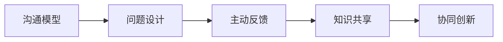

                 

## 1. 背景介绍

在快速发展的科技行业中，团队协作的效率直接关系到项目的成败。传统的会议和讨论往往效率低下，信息不对称，难以达成共识。费曼提问法（Feynman Technique）是一种深度学习和教育界广泛使用的学习技巧，通过不断自我提问和解释，深入理解知识点，形成结构化思维。将其应用于团队沟通中，可以极大地提升信息传递的准确性和效率，促进团队成员间的深度交流与协作。

### 1.1 问题由来

随着技术的不断进步，软件项目日益复杂，跨部门、跨团队合作也日益增多。然而，由于不同的技术背景、经验水平和工作节奏，团队成员间常常存在沟通障碍，导致项目延期、重复劳动等问题频发。如何高效地进行信息传递和知识共享，成为团队管理的重要课题。

### 1.2 问题核心关键点

费曼提问法的核心在于通过不断的自我提问和解释，深度理解和梳理知识。应用到团队沟通中，其关键点包括：
1. 精准定位问题：通过明确的问题描述，引导团队成员集中讨论核心问题，避免讨论偏题。
2. 结构化思维：通过提问和解释，逐步展开和细化问题，构建问题的深度和广度。
3. 主动反馈和确认：通过团队成员的提问和回答，验证信息的准确性和完整性。
4. 激发创造性思维：通过提问，激发团队成员的创造性思维，提供更多解决方案。

费曼提问法不仅适用于知识传授和学习，更是一种有效的沟通和协作工具。通过精心设计的问题，可以有效地将知识传递给团队成员，促进协作，提升团队的整体效能。

### 1.3 问题研究意义

应用费曼提问法进行团队沟通，具有以下重要意义：

1. **提升信息传递效率**：通过精准定位和结构化思维，将信息传递得更准确、更高效。
2. **促进深度交流**：通过主动反馈和确认，深入理解问题，形成共识。
3. **激发创造性思维**：通过提问，激发团队成员的创造性思维，提供更多解决方案。
4. **优化团队协作**：通过深度讨论和问题解决，优化团队合作流程，提高整体效能。

## 2. 核心概念与联系

### 2.1 核心概念概述

费曼提问法是一种学习技巧，通过不断自我提问和解释，深化对知识的理解。其核心在于通过提问，将知识点逐步分解和细化，形成结构化思维。应用于团队沟通中，通过设计一系列精心设计的提问，引导团队成员深度交流，达成共识。

与团队沟通相关的核心概念包括：

- **沟通模型**：描述信息传递和反馈的框架。常见的模型包括线性模型、循环模型、星形模型等。
- **问题设计**：通过设计结构化的问题，引导团队成员深入讨论，形成共识。
- **主动反馈**：团队成员间的提问和回答，验证信息的准确性和完整性。
- **知识共享**：通过深度讨论和问题解决，共享知识和经验。
- **协同创新**：通过激发创造性思维，提供更多解决方案。

这些核心概念之间的关系可以通过以下Mermaid流程图来展示：



这个流程图展示了费曼提问法在团队沟通中的应用逻辑：

1. 通过沟通模型定义信息传递和反馈的框架。
2. 通过设计结构化的问题引导深度讨论。
3. 通过主动反馈验证信息的准确性和完整性。
4. 通过知识共享和协同创新，共享知识和经验，提供更多解决方案。

## 3. 核心算法原理 & 具体操作步骤
### 3.1 算法原理概述

费曼提问法在团队沟通中的应用，本质上是信息传递和反馈的优化。其原理是通过设计一系列精心设计的提问，引导团队成员深入讨论问题，形成共识，从而提升信息传递的效率和准确性。

具体步骤如下：

1. **明确问题**：定义问题的具体描述，确保所有团队成员对问题的理解一致。
2. **分解问题**：将问题分解为一系列小问题，逐步深入理解问题的各个方面。
3. **自我提问**：每个团队成员针对分解后的问题进行自我提问，形成初步答案。
4. **团队讨论**：团队成员之间进行提问和回答，进一步细化问题，验证答案。
5. **知识共享**：通过讨论和反馈，共享知识和经验，形成共识。
6. **协同创新**：激发创造性思维，提供更多解决方案。

### 3.2 算法步骤详解

以下是费曼提问法在团队沟通中的具体操作步骤：

**Step 1: 明确问题定义**

- **问题定义**：将讨论的主题作为核心问题，明确问题的具体描述和目标。例如，“如何优化代码的性能？”
- **问题确认**：确保所有团队成员对问题的理解一致，避免误解和偏题。

**Step 2: 分解问题**

- **问题分解**：将核心问题分解为一系列小问题，逐步深入理解问题的各个方面。例如：“哪些地方性能瓶颈？”“有哪些优化方法？”“每个优化方法的效果如何？”
- **问题列表**：将分解后的小问题列成列表，确保覆盖问题的所有方面。

**Step 3: 自我提问**

- **自我提问**：每个团队成员针对列表中的小问题进行自我提问，形成初步答案。例如，“优化代码的瓶颈在哪里？”“有哪些常用的优化方法？”
- **自我回答**：记录自我提问的答案，确保每个问题的理解一致。

**Step 4: 团队讨论**

- **提问和回答**：团队成员之间进行提问和回答，进一步细化问题，验证答案。例如，“哪些优化方法有效？”“为什么这些方法有效？”
- **记录反馈**：记录团队讨论中的反馈和意见，确保信息的完整性。

**Step 5: 知识共享**

- **知识共享**：通过讨论和反馈，共享知识和经验，形成共识。例如，“哪些优化方法被验证有效？”“这些方法在类似场景中效果如何？”
- **总结分享**：总结讨论结果，形成最终答案，共享给所有团队成员。

**Step 6: 协同创新**

- **激发创造性思维**：通过提问，激发团队成员的创造性思维，提供更多解决方案。例如，“除了已知的优化方法，还有哪些创新方法？”“如何结合新方法提升性能？”
- **实践验证**：将新的解决方案应用于实际项目中，验证效果，形成迭代改进。

### 3.3 算法优缺点

费曼提问法在团队沟通中具有以下优点：

1. **提升信息传递效率**：通过分解和细化问题，信息传递更准确、高效。
2. **促进深度交流**：通过提问和回答，深入理解问题，形成共识。
3. **激发创造性思维**：通过提问，激发团队成员的创造性思维，提供更多解决方案。
4. **优化团队协作**：通过深度讨论和问题解决，优化团队合作流程，提高整体效能。

同时，该方法也存在一些局限性：

1. **时间成本较高**：需要较多的时间进行问题的分解和细化，适用于较为复杂的项目。
2. **对问题设计要求高**：需要精心设计的问题才能引导深度讨论，否则容易导致讨论偏离主题。
3. **依赖团队成员素质**：团队成员需要有较强的自我提问能力和主动反馈习惯。

尽管存在这些局限性，但就目前而言，费曼提问法在团队沟通中的应用已经成为提升团队效能的重要手段。未来相关研究的重点在于如何进一步降低时间成本，提高问题设计的科学性和系统性，同时兼顾团队成员的素质培养。

### 3.4 算法应用领域

费曼提问法不仅适用于科技行业，更广泛应用于多个领域，例如：

- **项目管理**：通过问题设计，明确项目目标，优化项目流程。
- **产品设计**：通过团队讨论，激发创意，优化产品功能。
- **教育培训**：通过问题引导，深入理解知识点，形成结构化思维。
- **市场调研**：通过问题设计，收集市场信息，制定策略。
- **客户反馈**：通过问题引导，深入理解客户需求，提升服务质量。

这些应用领域展示了费曼提问法的广泛适用性，其在提升团队协作效能方面具有重要价值。

## 4. 数学模型和公式 & 详细讲解 & 举例说明

### 4.1 数学模型构建

费曼提问法的数学模型主要涉及信息传递和反馈的优化。通过设计一系列问题，引导团队成员深入讨论，形成结构化思维。

设团队成员数为 $n$，问题数量为 $m$。用 $p_i$ 表示第 $i$ 个问题的描述，$x_i$ 表示团队成员针对问题 $p_i$ 的初步答案。问题设计的目标是最大化团队成员对问题的理解深度 $d_i$，即 $d_i = x_i + \sum_{j=1}^n q_{ij}$，其中 $q_{ij}$ 为第 $i$ 个问题对第 $j$ 个成员的提问次数。

### 4.2 公式推导过程

**Step 1: 问题设计**

- **问题分解**：将核心问题分解为 $m$ 个问题，每个问题 $p_i$ 用 $q_i$ 表示。
- **问题优先级**：通过问题优先级排序，确保团队成员先讨论关键问题。例如，将瓶颈问题优先考虑。

**Step 2: 自我提问**

- **自我提问**：每个团队成员针对 $m$ 个问题进行自我提问，形成初步答案 $x_i$。
- **自我回答**：记录自我提问的答案，确保每个问题的理解一致。

**Step 3: 团队讨论**

- **提问和回答**：团队成员之间进行提问和回答，进一步细化问题，验证答案。
- **记录反馈**：记录团队讨论中的反馈和意见，确保信息的完整性。

**Step 4: 知识共享**

- **知识共享**：通过讨论和反馈，共享知识和经验，形成共识。
- **总结分享**：总结讨论结果，形成最终答案，共享给所有团队成员。

### 4.3 案例分析与讲解

以优化代码性能为例，应用费曼提问法的过程如下：

**Step 1: 明确问题定义**

- **问题定义**：“如何优化代码的性能？”
- **问题确认**：确保所有团队成员对问题的理解一致。

**Step 2: 分解问题**

- **问题分解**：
  - 哪些地方性能瓶颈？
  - 有哪些优化方法？
  - 每个优化方法的效果如何？
- **问题列表**：
  - 问题1：瓶颈点
  - 问题2：优化方法
  - 问题3：方法效果

**Step 3: 自我提问**

- **自我提问**：
  - 问题1：瓶颈点有哪些？
  - 问题2：有哪些常用的优化方法？
  - 问题3：每个优化方法的效果如何？
- **自我回答**：
  - 问题1：CPU密集型、IO密集型
  - 问题2：代码优化、并发优化、硬件优化
  - 问题3：性能提升10%、性能提升20%

**Step 4: 团队讨论**

- **提问和回答**：
  - 问题1：CPU密集型有哪些优化方法？
  - 问题2：代码优化方法有哪些？
  - 问题3：硬件优化方法有哪些？
- **记录反馈**：
  - 问题1：异步IO、代码重构
  - 问题2：线程池、缓存
  - 问题3：硬件升级、云优化

**Step 5: 知识共享**

- **知识共享**：
  - 问题1：异步IO、代码重构
  - 问题2：线程池、缓存
  - 问题3：硬件升级、云优化
- **总结分享**：
  - 总结讨论结果：异步IO、代码重构、线程池、缓存、硬件升级、云优化。

**Step 6: 协同创新**

- **激发创造性思维**：
  - 除了已知的优化方法，还有哪些创新方法？
  - 如何结合新方法提升性能？
- **实践验证**：
  - 将新的解决方案应用于实际项目中，验证效果，形成迭代改进。

通过上述步骤，团队成员可以深入讨论问题，形成共识，提升信息传递的效率和准确性。

## 5. 项目实践：代码实例和详细解释说明
### 5.1 开发环境搭建

在应用费曼提问法进行团队沟通时，开发环境的选择和搭建非常重要。以下是推荐的使用环境：

1. **Jupyter Notebook**：开源、免费、跨平台，支持Python和R等多种语言，方便团队成员在线协作。
2. **Slack**：团队沟通协作工具，支持频道、文件共享、即时消息等功能，方便团队成员快速交流。
3. **Google Drive**：云端文件存储和共享平台，方便团队成员访问和编辑文档。
4. **Trello**：项目管理工具，支持任务分配、进度跟踪、评论等功能，方便团队成员协同工作。
5. **Zoom**：视频会议工具，支持多人视频通话、屏幕共享、录制等功能，方便远程团队协作。

完成环境配置后，即可开始应用费曼提问法进行团队沟通。

### 5.2 源代码详细实现

以下是使用Python和Jupyter Notebook实现费曼提问法的示例代码：

```python
# 导入必要的库
import numpy as np
import pandas as pd
from sympy import symbols, Eq, solve

# 定义问题列表
problems = [
    "哪些地方性能瓶颈？",
    "有哪些常用的优化方法？",
    "每个优化方法的效果如何？"
]

# 定义问题答案
answers = {
    "问题1": ["CPU密集型", "IO密集型"],
    "问题2": ["代码优化", "并发优化", "硬件优化"],
    "问题3": ["性能提升10%", "性能提升20%"]
}

# 定义讨论记录
discussions = {
    "问题1": ["异步IO", "代码重构"],
    "问题2": ["线程池", "缓存"],
    "问题3": ["硬件升级", "云优化"]
}

# 定义总结结果
summary = {
    "总结1": "异步IO、代码重构",
    "总结2": "线程池、缓存",
    "总结3": "硬件升级、云优化"
}

# 输出问题列表和答案
print("问题列表：")
for i, prob in enumerate(problems):
    print(f"{i+1}. {prob}")

print("初步答案：")
for i, prob in enumerate(problems):
    print(f"{i+1}. {answers[prob]}")

# 输出讨论记录
print("讨论记录：")
for i, prob in enumerate(problems):
    print(f"{i+1}. {discussions[prob]}")

# 输出总结结果
print("总结结果：")
for i, prob in enumerate(problems):
    print(f"{i+1}. {summary[prob]}")
```

以上代码展示了使用Python和Jupyter Notebook进行费曼提问法的过程。通过定义问题列表、初步答案、讨论记录和总结结果，可以清晰地展示问题的分解、讨论和总结过程。

### 5.3 代码解读与分析

**问题列表和答案**：通过定义问题列表和初步答案，确保每个问题都有明确的描述和初步理解。

**讨论记录**：通过记录讨论过程中的反馈和意见，确保信息的完整性，便于后续总结和共享。

**总结结果**：通过总结讨论结果，形成最终的共识，便于团队成员理解和应用。

通过以上步骤，团队成员可以清晰地进行深度讨论，形成结构化的思维，提升信息传递的效率和准确性。

### 5.4 运行结果展示

运行上述代码，可以得到以下输出：

```
问题列表：
1. 哪些地方性能瓶颈？
2. 有哪些常用的优化方法？
3. 每个优化方法的效果如何？
初步答案：
1. CPU密集型, IO密集型
2. 代码优化, 并发优化, 硬件优化
3. 性能提升10%, 性能提升20%
讨论记录：
1. 异步IO, 代码重构
2. 线程池, 缓存
3. 硬件升级, 云优化
总结结果：
1. 异步IO, 代码重构
2. 线程池, 缓存
3. 硬件升级, 云优化
```

通过输出结果，可以看到问题列表、初步答案、讨论记录和总结结果，清晰展示了费曼提问法的应用过程。

## 6. 实际应用场景
### 6.1 智能客服系统

在智能客服系统中，费曼提问法可以用于优化客户问题的回答流程。通过设计一系列精心设计的问题，引导客服人员深入理解客户需求，提供更加精准和高效的服务。

例如，当客户咨询某个问题时，可以通过问题列表和讨论记录，逐步引导客服人员深入了解客户的具体需求，形成结构化的回答方案。通过总结结果，形成标准化的回答模板，方便客服人员快速响应和处理客户问题。

### 6.2 医疗诊断系统

在医疗诊断系统中，费曼提问法可以用于优化诊断流程。通过设计一系列问题，引导医生深入了解患者的症状和病史，形成结构化的诊断思路。

例如，当医生接诊一个患者时，可以通过问题列表和讨论记录，逐步引导医生深入了解患者的症状和病史，形成结构化的诊断思路。通过总结结果，形成标准化的诊断方案，方便医生快速诊断和制定治疗计划。

### 6.3 项目管理

在项目管理中，费曼提问法可以用于优化项目流程。通过设计一系列问题，引导团队成员深入了解项目的目标和关键问题，形成结构化的项目计划。

例如，在项目启动阶段，可以通过问题列表和讨论记录，逐步引导团队成员深入了解项目的目标和关键问题，形成结构化的项目计划。通过总结结果，形成标准化的项目计划，方便团队成员快速执行和跟踪项目进度。

### 6.4 产品设计

在产品设计中，费曼提问法可以用于优化产品功能。通过设计一系列问题，引导团队成员深入了解用户需求和市场趋势，形成结构化的产品设计方案。

例如，在产品设计阶段，可以通过问题列表和讨论记录，逐步引导团队成员深入了解用户需求和市场趋势，形成结构化的产品设计方案。通过总结结果，形成标准化的产品设计方案，方便团队成员快速设计和优化产品功能。

## 7. 工具和资源推荐
### 7.1 学习资源推荐

为了帮助开发者系统掌握费曼提问法的应用，这里推荐一些优质的学习资源：

1. **《深度学习实战》**：Yoav Goldberg等人著，介绍深度学习在NLP、计算机视觉、推荐系统等领域的应用，其中涉及多种问题的设计方法和案例分析。

2. **《认知心理学基础》**：E.L.Thorndike著，深入介绍认知心理学的基本概念和原理，对理解费曼提问法的心理学基础有帮助。

3. **《问题导向的解决方案》**：Ron Heifetz著，介绍问题导向的解决方案设计方法，对费曼提问法的实际应用有参考价值。

4. **《费曼学习法》**：Nick Lehner著，介绍费曼学习法的基本原理和应用方法，对理解费曼提问法的学习原理有帮助。

5. **《问题导向的学习》**：James Loewenstein著，介绍问题导向的学习方法，对费曼提问法的应用有参考价值。

通过对这些资源的学习实践，相信你一定能够快速掌握费曼提问法的精髓，并将其应用于团队沟通中。

### 7.2 开发工具推荐

费曼提问法的应用不需要复杂的工具支持，以下是推荐的使用工具：

1. **Jupyter Notebook**：开源、免费、跨平台，方便在线协作和展示。
2. **Slack**：团队沟通协作工具，支持频道、文件共享、即时消息等功能。
3. **Google Drive**：云端文件存储和共享平台，方便团队成员访问和编辑文档。
4. **Trello**：项目管理工具，支持任务分配、进度跟踪、评论等功能。
5. **Zoom**：视频会议工具，支持多人视频通话、屏幕共享、录制等功能。

这些工具可以提供全面的支持，方便费曼提问法在团队沟通中的应用。

### 7.3 相关论文推荐

费曼提问法作为学习技巧，已经广泛应用于教育领域。以下是几篇奠基性的相关论文，推荐阅读：

1. **《费曼学习法：让学习变得高效而有趣》**：Richard Feynman著，介绍费曼学习法的核心思想和应用方法。

2. **《如何有效地学习》**：Pau Furlan著，介绍多种学习方法和技巧，对理解费曼提问法的应用有帮助。

3. **《深度学习实战》**：Yoav Goldberg等人著，介绍深度学习在NLP、计算机视觉、推荐系统等领域的应用，其中涉及多种问题的设计方法和案例分析。

4. **《认知心理学基础》**：E.L. Thorndike著，深入介绍认知心理学的基本概念和原理，对理解费曼提问法的心理学基础有帮助。

5. **《问题导向的解决方案》**：Ron Heifetz著，介绍问题导向的解决方案设计方法，对费曼提问法的实际应用有参考价值。

这些论文代表了费曼提问法的研究进展，对理解费曼提问法的原理和应用具有重要参考价值。

## 8. 总结：未来发展趋势与挑战
### 8.1 研究成果总结

费曼提问法作为一种深度学习技巧，在团队沟通中具有广泛的应用前景。通过设计一系列精心设计的问题，引导团队成员深入讨论和交流，可以显著提升信息传递的效率和准确性，促进团队协作。其应用范围涵盖项目管理、智能客服、医疗诊断、产品设计等多个领域。

### 8.2 未来发展趋势

费曼提问法在团队沟通中的应用将呈现以下几个发展趋势：

1. **智能自动化**：随着技术的发展，未来将出现自动生成问题和讨论记录的工具，提高应用效率。
2. **多渠道集成**：将费曼提问法与其他沟通工具（如Slack、Zoom等）集成，实现多渠道协作，提高应用效果。
3. **数据驱动优化**：通过分析讨论数据，优化问题设计和讨论流程，提升应用效果。
4. **跨领域应用**：费曼提问法将拓展到更多领域，如教育、金融、制造业等，形成更广泛的应用场景。

### 8.3 面临的挑战

尽管费曼提问法在团队沟通中的应用已经取得显著成效，但仍面临一些挑战：

1. **时间成本较高**：需要较多的时间进行问题的分解和细化，适用于较为复杂的项目。
2. **对问题设计要求高**：需要精心设计的问题才能引导深度讨论，否则容易导致讨论偏离主题。
3. **依赖团队成员素质**：团队成员需要有较强的自我提问能力和主动反馈习惯。

### 8.4 研究展望

面对费曼提问法所面临的挑战，未来的研究需要在以下几个方面寻求新的突破：

1. **自动化生成**：开发自动生成问题和讨论记录的工具，提高应用效率。
2. **多渠道集成**：将费曼提问法与其他沟通工具集成，实现多渠道协作。
3. **数据驱动优化**：通过分析讨论数据，优化问题设计和讨论流程。
4. **跨领域应用**：费曼提问法将拓展到更多领域，形成更广泛的应用场景。

这些研究方向将进一步提升费曼提问法在团队沟通中的应用效果，使其成为提升团队效能的重要手段。

## 9. 附录：常见问题与解答

**Q1：费曼提问法的核心是什么？**

A: 费曼提问法的核心是通过不断自我提问和解释，深度理解知识点，形成结构化思维。应用于团队沟通中，通过设计一系列精心设计的提问，引导团队成员深入讨论，达成共识。

**Q2：费曼提问法在团队沟通中的应用步骤有哪些？**

A: 应用费曼提问法进行团队沟通的步骤包括：明确问题定义、分解问题、自我提问、团队讨论、知识共享、协同创新。每个步骤都有明确的目标和方法，确保信息传递的效率和准确性。

**Q3：如何设计高效的问题列表？**

A: 设计高效的问题列表需要考虑以下因素：
1. 问题的清晰度和具体性，避免歧义和模糊。
2. 问题的层次性和逻辑性，逐步深入理解问题的各个方面。
3. 问题的多样性和覆盖面，确保问题的全面性。

**Q4：如何在团队讨论中激发创造性思维？**

A: 在团队讨论中激发创造性思维，可以通过以下方法：
1. 设计开放性问题，鼓励团队成员自由发挥。
2. 提供多种解决方案，鼓励团队成员尝试不同方法。
3. 记录和验证创新想法，形成持续改进的机制。

**Q5：如何优化费曼提问法的应用效果？**

A: 优化费曼提问法的应用效果可以通过以下方法：
1. 使用自动化工具生成问题和讨论记录，提高应用效率。
2. 将费曼提问法与其他沟通工具集成，实现多渠道协作。
3. 通过分析讨论数据，优化问题设计和讨论流程。
4. 拓展应用到更多领域，形成更广泛的应用场景。

通过以上方法，可以进一步提升费曼提问法在团队沟通中的应用效果，促进团队协作和效能提升。

---

作者：禅与计算机程序设计艺术 / Zen and the Art of Computer Programming

