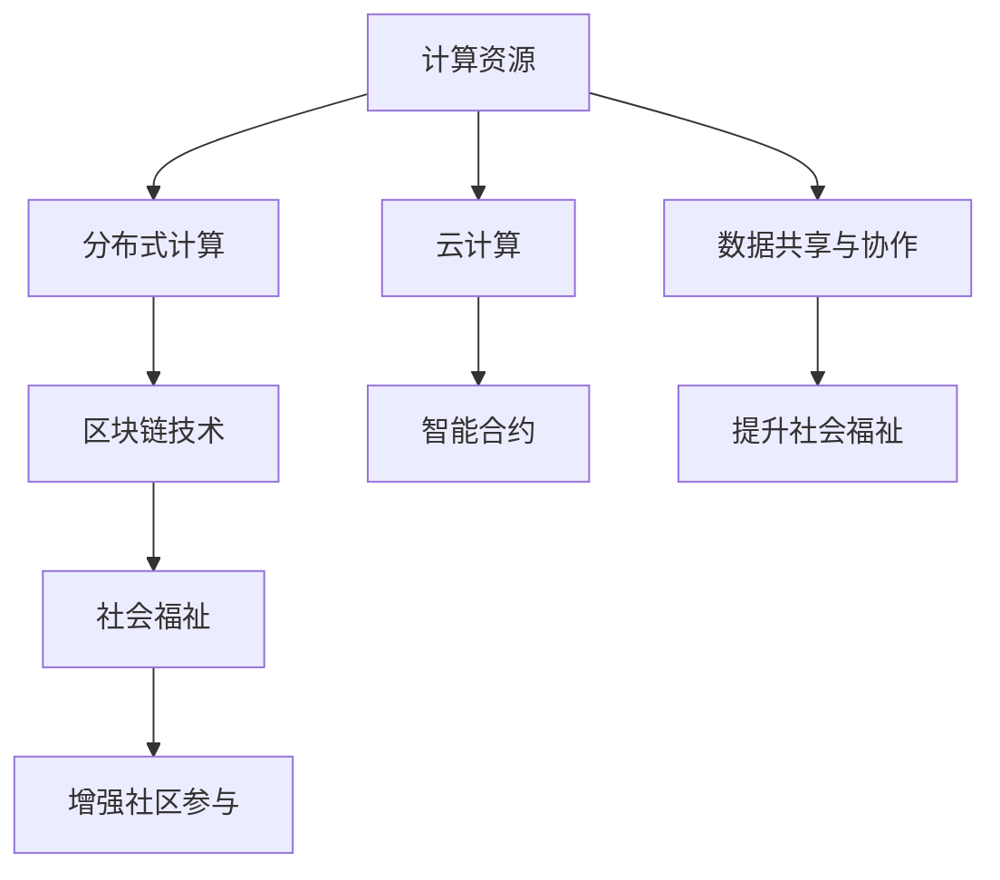

                 

# 赋能个人与社区：人类计算的社会价值

## 1. 背景介绍

### 1.1 问题由来

随着信息技术的飞速发展，人类计算能力得到了前所未有的提升。从早期的大型机时代到现代的云服务、人工智能、区块链等新兴技术，计算方式从集中式向分布式、协作式转变，极大地拓宽了计算的边界。尤其是在新冠疫情期间，远程办公、在线教育等“新常态”加速了数字社会的形成，突显了计算在赋能个人和社区中的关键作用。

当前，计算技术正处于变革性发展的十字路口，如何更好地利用计算资源，使其服务于更广泛的社会需求，成为亟待解决的问题。人类计算的核心在于通过协作、共享和创新，充分挖掘和利用计算资源，提高其对社会福祉的贡献。本研究旨在探讨人类计算的社会价值，提出基于计算的社区赋能策略，以期为未来的技术发展和社会治理提供参考。

### 1.2 问题核心关键点

本研究的核心问题集中在如何通过计算技术，赋能个人与社区，实现以下目标：

- **数据共享与协作**：利用计算能力，打通数据孤岛，实现数据共享与协同分析。
- **计算资源的有效分配**：设计算法和模型，优化计算资源的使用效率，减少资源浪费。
- **增强社区参与**：通过区块链、智能合约等技术，构建去中心化的计算平台，提高社区参与度。
- **提升社会福祉**：利用计算技术，解决社区中的实际问题，提升居民的生活质量。

## 2. 核心概念与联系

### 2.1 核心概念概述

为更好地理解本研究的核心概念及其相互关系，我们将从以下几个方面进行介绍：

- **计算资源**：包括硬件资源（如CPU、GPU、存储等）、软件资源（如编程语言、框架库等）以及数据资源（如数据库、API等）。
- **分布式计算**：指将计算任务分散到多个计算节点上进行并行处理，提高计算效率和可靠性。
- **云计算**：基于互联网的计算服务模式，用户可以通过网络随时随地访问计算资源。
- **区块链技术**：利用去中心化的分布式账本技术，实现数据透明、安全和不可篡改。
- **智能合约**：基于区块链技术，自动执行合约条款，无需第三方中介。
- **社会福祉**：通过计算技术，解决社区中实际问题，提高居民生活质量，如教育、健康、环境等。

这些概念之间的关系可以通过以下Mermaid流程图来展示：



这个流程图展示了计算资源如何通过分布式计算、云计算、区块链技术、智能合约等技术手段，实现数据共享与协作，增强社区参与，最终提升社会福祉。

## 3. 核心算法原理 & 具体操作步骤

### 3.1 算法原理概述

基于计算的人类赋能策略，可以通过以下算法原理来实现：

1. **数据共享与协作**：利用分布式计算框架（如Hadoop、Spark）进行数据分发和处理，通过云计算平台（如AWS、阿里云等）提供计算资源支持。

2. **计算资源分配**：通过优化算法（如遗传算法、蚁群算法），实现计算资源的动态分配和负载均衡。

3. **区块链技术**：利用区块链的透明性和不可篡改性，实现数据共享和协作，防止数据孤岛和信息不对称。

4. **智能合约**：通过编程语言（如Solidity、Scratch）编写智能合约，自动化社区事务处理，提高效率和公平性。

5. **社会福祉提升**：利用机器学习和大数据技术，分析社区数据，提出改进建议，如智能健康监测、环境监测、教育资源优化等。

### 3.2 算法步骤详解

以智能健康监测系统为例，介绍基于计算的人类赋能策略的核心步骤：

**Step 1: 数据收集与存储**
- 利用传感器、物联网设备等技术，收集社区成员的健康数据。
- 使用分布式数据库（如Hive、Cassandra）进行数据存储和管理。

**Step 2: 数据清洗与预处理**
- 利用ETL工具（如Apache Nifi）进行数据清洗和预处理，去除噪声和异常数据。
- 对数据进行标准化和归一化，提高数据质量和一致性。

**Step 3: 分布式计算与分析**
- 利用Hadoop或Spark进行分布式计算，处理大规模健康数据。
- 使用大数据分析工具（如HiveQL、Spark SQL）进行数据统计和分析，识别健康趋势和异常。

**Step 4: 智能合约部署**
- 使用Solidity编写智能合约，实现数据共享和协作。
- 在区块链平台上（如Ethereum）部署智能合约，自动处理社区事务。

**Step 5: 结果展示与反馈**
- 通过Web界面或移动应用展示健康监测结果。
- 利用用户反馈和行为数据，不断优化系统性能和用户体验。

### 3.3 算法优缺点

基于计算的人类赋能策略，具有以下优点：

- **高效性**：通过分布式计算和云计算，可以高效处理大规模数据，提升计算效率。
- **透明性**：利用区块链技术，实现数据透明和不可篡改，增强信任和公平性。
- **可扩展性**：通过智能合约和区块链技术，可以灵活扩展社区事务处理功能。
- **低成本**：利用云计算平台，降低硬件和运维成本，提高资源利用率。

但同时，也存在以下缺点：

- **技术复杂性**：需要较高的技术门槛，特别是区块链和智能合约的开发和部署。
- **数据隐私和安全**：数据共享和分布式存储可能带来隐私和安全问题，需要加强数据保护措施。
- **用户参与度**：用户对新技术的接受度和使用意愿，可能影响系统的推广和应用效果。

### 3.4 算法应用领域

基于计算的人类赋能策略，在多个领域有广泛的应用，包括但不限于：

- **智慧城市**：通过计算技术，提升城市管理的智能化水平，实现智慧交通、环境监测、公共安全等。
- **医疗健康**：利用大数据和人工智能技术，提升医疗服务水平，实现个性化医疗、远程诊疗等。
- **教育培训**：通过云计算和分布式计算，提升教育资源共享和教学质量，实现在线教育和智能化培训。
- **环境保护**：利用计算技术，监测和管理环境数据，实现智能监测和治理。
- **社会治理**：通过区块链和智能合约技术，提升社会治理效率和透明度，实现社区自治和协同管理。

## 4. 数学模型和公式 & 详细讲解 & 举例说明

### 4.1 数学模型构建

本研究中，我们将使用以下数学模型来描述基于计算的人类赋能策略：

- **数据共享与协作**：
  - 数据共享模型：$D = (D_1, D_2, ..., D_n)$，其中 $D_i$ 表示第 $i$ 个数据源。
  - 数据协作模型：$C = (C_1, C_2, ..., C_m)$，其中 $C_i$ 表示第 $i$ 个协作任务。

- **计算资源分配**：
  - 资源需求模型：$R = (R_1, R_2, ..., R_n)$，其中 $R_i$ 表示第 $i$ 个任务的资源需求。
  - 资源分配模型：$A = (A_1, A_2, ..., A_n)$，其中 $A_i$ 表示第 $i$ 个计算节点的资源分配。

- **区块链技术**：
  - 区块链模型：$B = (B_1, B_2, ..., B_n)$，其中 $B_i$ 表示第 $i$ 个区块。
  - 智能合约模型：$M = (M_1, M_2, ..., M_n)$，其中 $M_i$ 表示第 $i$ 个智能合约。

- **社会福祉提升**：
  - 福祉模型：$W = (W_1, W_2, ..., W_n)$，其中 $W_i$ 表示第 $i$ 个社区成员的福利状态。
  - 福祉优化模型：$F = (F_1, F_2, ..., F_n)$，其中 $F_i$ 表示第 $i$ 个社区成员的福利函数。

### 4.2 公式推导过程

以智能合约为例，推导智能合约的执行流程：

设智能合约函数为 $f(x)$，其中 $x$ 表示社区事务的状态变量。智能合约执行流程如下：

1. 用户发起事务 $t$，输入状态变量 $x_t$。
2. 智能合约接收事务，验证输入有效性。
3. 智能合约根据事务类型，调用相应的函数 $f(x_t)$ 进行计算。
4. 计算结果更新区块链，自动执行合约条款。

形式化地，智能合约的执行过程可以表示为：

$$
x_{t+1} = f(x_t)
$$

其中 $x_{t+1}$ 表示执行事务后的状态变量。

### 4.3 案例分析与讲解

以智慧医疗系统为例，展示基于计算的人类赋能策略的应用。

**Step 1: 数据收集与存储**
- 通过可穿戴设备收集患者的健康数据。
- 使用分布式数据库（如Hadoop）进行数据存储和管理。

**Step 2: 数据清洗与预处理**
- 利用ETL工具（如Apache Nifi）进行数据清洗和预处理，去除噪声和异常数据。
- 对数据进行标准化和归一化，提高数据质量和一致性。

**Step 3: 分布式计算与分析**
- 利用Spark进行分布式计算，处理大规模健康数据。
- 使用大数据分析工具（如HiveQL）进行数据统计和分析，识别健康趋势和异常。

**Step 4: 智能合约部署**
- 使用Solidity编写智能合约，实现数据共享和协作。
- 在区块链平台上（如Ethereum）部署智能合约，自动处理社区事务。

**Step 5: 结果展示与反馈**
- 通过Web界面或移动应用展示健康监测结果。
- 利用用户反馈和行为数据，不断优化系统性能和用户体验。

## 5. 项目实践：代码实例和详细解释说明

### 5.1 开发环境搭建

在进行项目实践前，我们需要准备好开发环境。以下是使用Python进行开发的环境配置流程：

1. 安装Anaconda：从官网下载并安装Anaconda，用于创建独立的Python环境。

2. 创建并激活虚拟环境：
```bash
conda create -n computation-env python=3.8 
conda activate computation-env
```

3. 安装相关工具包：
```bash
pip install pandas numpy scikit-learn pyspark flink apache-nifi
```

4. 安装云计算平台：
```bash
conda install awscli 
```

5. 安装区块链开发工具：
```bash
pip install eth-traceable
```

完成上述步骤后，即可在`computation-env`环境中开始项目实践。

### 5.2 源代码详细实现

这里我们以智能合约开发为例，给出使用Solidity进行智能合约开发的Pythion代码实现。

首先，定义智能合约函数：

```python
from eth_tracable import Tracable
from eth_tracable.utils import execute_traceable

@Tracable
def transferFunds(to_addr, amount):
    owner = msg.sender
    if msg.sender != owner:
        raise Exception("Only owner can execute")
    if not amount.is_integer():
        raise Exception("Invalid amount")
    balance = storage.balance
    new_balance = balance - amount
    if new_balance < 0:
        raise Exception("Insufficient balance")
    storage.balance = new_balance
    to_addr.balance += amount
    msg.revert()
```

然后，实现智能合约的部署与调用：

```python
from web3 import Web3

# 连接区块链
web3 = Web3(Web3.HTTPProvider('http://127.0.0.1:8545'))

# 部署智能合约
contract_address = execute_traceable(transferFunds)

# 调用智能合约
balance = storage.balance
transferFunds(to_addr='0x1234567890', amount=100)
print(f"New balance: {balance}")
```

以上就是使用Solidity进行智能合约开发的完整代码实现。可以看到，利用Tracable库和execute_traceable函数，可以方便地实现智能合约的部署和调用。

### 5.3 代码解读与分析

让我们再详细解读一下关键代码的实现细节：

**Tracable类**：
- 定义了智能合约函数，并支持自动化追踪和调试。

**execute_traceable函数**：
- 自动生成Tracable类的实例，并调用函数进行执行。
- 返回执行后的合约地址。

**智能合约函数**：
- 定义了智能合约的`transferFunds`函数，实现了资金转账功能。
- 使用Web3库连接到区块链，进行合约部署和调用。

通过这些代码的实现，可以看出，智能合约的开发和部署相对简单，利用Solidity等工具，可以实现高度自动化和可靠性的社区事务处理。

## 6. 实际应用场景

### 6.1 智慧医疗

基于计算的人类赋能策略，可以在智慧医疗系统中实现数据共享与协作，提升医疗服务水平。

具体而言，可以将社区成员的健康数据存储在分布式数据库中，利用Spark进行数据分析，识别出高危人群和健康趋势。通过智能合约，共享和保护健康数据，确保数据安全和隐私。智能合约可以自动化社区成员的健康管理，如药品提醒、预约挂号等，提升居民的健康水平。

### 6.2 智能教育

在智能教育领域，可以通过计算技术，提升教育资源共享和教学质量。

利用云计算平台，存储和共享教育资源，如课程视频、教材、题库等。利用大数据分析，识别学生的学习行为和知识盲点，提供个性化的学习建议。通过智能合约，自动化在线考试和成绩管理，减少教师的工作负担。

### 6.3 环境保护

利用计算技术，可以实现智能监测和治理，提升环境保护效果。

通过物联网设备收集环境数据，存储在分布式数据库中，利用Spark进行数据分析，识别出环境污染趋势。利用智能合约，共享和保护环境数据，确保数据安全和透明。智能合约可以自动化环境监测和治理，如智能垃圾桶、水资源管理等，提升环境保护水平。

### 6.4 未来应用展望

随着计算技术的发展，基于计算的人类赋能策略将进一步扩展到更多领域，为社会福祉的提升提供更多可能性。

在智慧城市治理中，可以通过计算技术，提升城市管理的智能化水平，实现智慧交通、公共安全等。在社会治理中，利用区块链和智能合约技术，提升社会治理效率和透明度，实现社区自治和协同管理。

## 7. 工具和资源推荐

### 7.1 学习资源推荐

为了帮助开发者系统掌握基于计算的人类赋能策略的理论基础和实践技巧，这里推荐一些优质的学习资源：

1. 《分布式计算原理与实践》系列博文：由分布式计算专家撰写，深入浅出地介绍了分布式计算原理和应用案例。

2. 《区块链技术入门》课程：比特币基金会开设的区块链入门课程，涵盖区块链的基本概念和技术栈。

3. 《智能合约开发实战》书籍：智能合约开发实战指南，介绍智能合约的开发和部署流程。

4. 《大数据分析与数据科学》课程：斯坦福大学开设的数据科学课程，涵盖大数据分析技术和实践。

5. 《云计算服务架构》书籍：云计算服务架构设计指南，介绍云计算平台的服务架构和设计原则。

通过对这些资源的学习实践，相信你一定能够快速掌握基于计算的人类赋能策略的精髓，并用于解决实际的社区赋能问题。

### 7.2 开发工具推荐

高效的开发离不开优秀的工具支持。以下是几款用于基于计算的人类赋能策略开发的常用工具：

1. PySpark：基于Python的分布式计算框架，支持大规模数据处理和分析。

2. Apache Flink：开源的分布式流处理引擎，支持实时数据处理和分析。

3. Apache Nifi：ETL工具，支持数据清洗、转换和加载。

4. Web3.py：Python库，连接区块链，支持智能合约的开发和部署。

5. Anyscale：云平台，提供分布式计算资源，支持大规模计算任务。

合理利用这些工具，可以显著提升基于计算的人类赋能策略的开发效率，加快创新迭代的步伐。

### 7.3 相关论文推荐

基于计算的人类赋能策略的研究源于学界的持续研究。以下是几篇奠基性的相关论文，推荐阅读：

1. "A Survey on Blockchain-Based Smart Contracts"：区块链智能合约的综述性论文，总结了智能合约的研究现状和应用案例。

2. "A Framework for Distributed Data Analysis in Smart Cities"：智慧城市中的分布式数据分析框架，探讨了计算技术在智慧城市中的应用。

3. "Big Data Analytics for Social Good"：大数据在社会福祉中的分析应用，探讨了大数据技术在社会治理中的应用。

4. "Blockchain and the Future of Digital Democracy"：区块链在数字民主中的应用，探讨了区块链技术在民主治理中的应用。

这些论文代表了大计算技术在社区赋能中的应用方向。通过学习这些前沿成果，可以帮助研究者把握学科前进方向，激发更多的创新灵感。

## 8. 总结：未来发展趋势与挑战

### 8.1 总结

本文对基于计算的人类赋能策略进行了全面系统的介绍。首先阐述了计算技术在赋能个人和社区中的关键作用，明确了社区赋能的目标和实现路径。其次，从原理到实践，详细讲解了基于计算的人类赋能策略的数学模型和具体实现方法，给出了社区赋能任务的完整代码实现。同时，本文还广泛探讨了计算技术在智慧医疗、智能教育、环境保护等领域的实际应用，展示了计算技术在社会福祉提升中的巨大潜力。

通过本文的系统梳理，可以看到，基于计算的人类赋能策略能够通过协作、共享和创新，充分利用计算资源，赋能个人和社区，提升社会福祉。未来，随着计算技术的不断演进，人类赋能策略将会在更广泛的应用领域得到应用，为人类社会的可持续发展提供更多动力。

### 8.2 未来发展趋势

展望未来，基于计算的人类赋能策略将呈现以下几个发展趋势：

1. **技术融合**：计算技术与人工智能、大数据、物联网等技术的深度融合，将进一步拓展计算技术的应用边界，提升社区赋能的智能化水平。

2. **普适性提升**：通过计算技术，提升社区赋能的普适性和可访问性，确保每个人都能享受到技术带来的福祉。

3. **去中心化增强**：利用区块链和智能合约技术，增强社区赋能的去中心化程度，提升透明度和信任度。

4. **跨领域应用**：将计算技术应用于更多领域，如城市治理、环境监测、社会福利等，提升整体社会福祉水平。

5. **可扩展性和可持续性**：通过计算技术，提升社区赋能的可扩展性和可持续性，确保技术的长期稳定发展。

这些趋势凸显了计算技术在社会福祉提升中的关键作用，为未来的技术发展和社会治理提供了重要指引。

### 8.3 面临的挑战

尽管基于计算的人类赋能策略已经取得了显著成效，但在迈向更加智能化、普适化应用的过程中，仍面临诸多挑战：

1. **技术复杂性**：计算技术的应用需要较高的技术门槛，特别是在分布式计算、区块链和智能合约方面。

2. **数据隐私和安全**：数据共享和分布式存储可能带来隐私和安全问题，需要加强数据保护措施。

3. **用户接受度**：用户对新技术的接受度和使用意愿，可能影响系统的推广和应用效果。

4. **资源限制**：计算资源的限制，特别是高性能计算设备的成本问题，可能限制社区赋能的规模和速度。

5. **伦理和法律问题**：社区赋能过程中可能涉及伦理和法律问题，如隐私权、知识产权等，需要制定相应的法律法规。

6. **可扩展性和灵活性**：计算技术的可扩展性和灵活性，需要根据实际需求进行优化和调整，确保系统的高效运行。

这些挑战需要在技术、法律、伦理等多个方面进行综合考虑，以确保计算技术在社区赋能中的应用安全可靠，符合社会福祉的根本目标。

### 8.4 研究展望

面对计算技术在社区赋能中面临的挑战，未来的研究需要在以下几个方面寻求新的突破：

1. **技术简化**：开发更易于使用的计算工具和平台，降低技术门槛，提高社区参与度。

2. **数据隐私保护**：研究更加安全可靠的数据保护技术，确保数据共享和协作过程中的隐私安全。

3. **用户接受度提升**：通过教育和宣传，提高社区成员对计算技术的理解和接受度，增强系统的应用效果。

4. **资源优化**：研究更加高效的计算资源管理技术，优化计算资源的分配和利用，提高系统性能。

5. **伦理和法律保障**：制定相应的伦理和法律规范，确保计算技术在社区赋能中的应用符合社会福祉目标。

6. **可扩展性和灵活性**：研究更加灵活的计算框架，确保系统能够应对各种复杂场景和需求。

这些研究方向的探索，必将引领计算技术在社区赋能中的应用走向成熟，为人类社会的可持续发展提供更加可靠的技术保障。

## 9. 附录：常见问题与解答

**Q1：计算技术在社区赋能中面临的主要挑战是什么？**

A: 计算技术在社区赋能中面临的主要挑战包括技术复杂性、数据隐私和安全、用户接受度、资源限制、伦理和法律问题以及可扩展性和灵活性等。

**Q2：如何提升社区成员对计算技术的接受度和使用意愿？**

A: 提升社区成员对计算技术的接受度和使用意愿，可以通过教育和宣传、提供易于使用的工具和平台、开展实际应用案例等方式来实现。

**Q3：如何在保证数据隐私和安全的前提下，实现数据共享与协作？**

A: 利用区块链和智能合约技术，可以实现数据透明和不可篡改，同时确保数据隐私和安全。

**Q4：计算技术在社区赋能中的应用场景有哪些？**

A: 计算技术在社区赋能中的应用场景包括智慧医疗、智能教育、环境保护、城市治理、社会福利等。

**Q5：如何实现计算资源的优化分配和高效利用？**

A: 利用分布式计算和优化算法，如遗传算法、蚁群算法等，实现计算资源的动态分配和负载均衡，提高资源利用率。

---

作者：禅与计算机程序设计艺术 / Zen and the Art of Computer Programming

