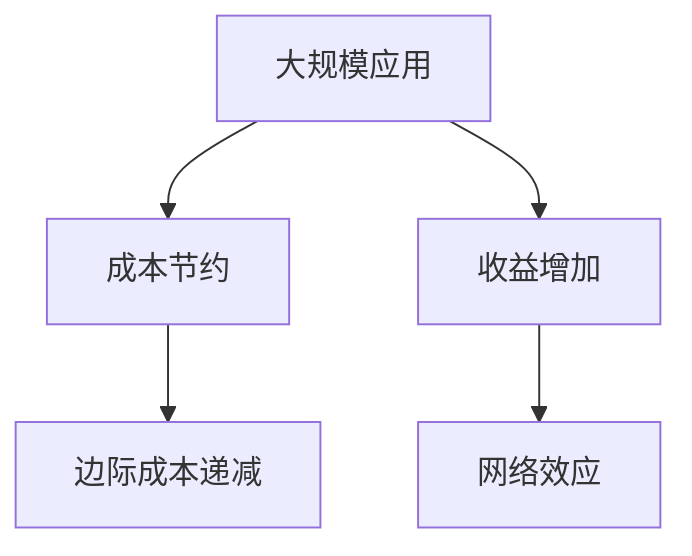

                 

## 1. 背景介绍

### 1.1 问题由来
在过去几十年里，科技的迅猛发展已经深刻改变了我们的生活方式。从PC到移动互联网，从大数据到人工智能，每一个技术突破都带来了全新的应用场景和商业模式。而在这背后，支撑这一切变化的最底层规律，其实就是规模化定律。

规模化定律是一种普遍存在的规律，即在绝大多数情况下，随着应用规模的扩大，其带来的成本节约和收益增加是呈指数级增长的。这种规律在商业、科技、社交等多个领域都有体现，是推动社会发展的重要动力。

### 1.2 问题核心关键点
本文将深入探讨规模化定律，重点聚焦于其在科技和商业领域的广泛应用，以及如何利用这一规律来驱动创新和增长。

## 2. 核心概念与联系

### 2.1 核心概念概述
为了更好地理解规模化定律，首先需要对其核心概念进行梳理：

1. **规模化定律**：指在特定条件下，应用规模的增长带来的成本节约和收益增加的指数级增长。规模化定律适用于各种复杂系统，包括商业、科技、社会管理等多个领域。

2. **成本节约**：随着应用规模的扩大，固定成本或运营成本相对于总收入的比例会下降，从而带来成本节约。

3. **收益增加**：随着应用规模的扩大，总收入相对于总成本的比例会上升，从而带来收益增加。

4. **边际成本递减**：在达到一定规模之前，增加单位应用带来的成本增加幅度逐渐减小。

5. **网络效应**：当一个应用的用户越多，其价值越高，形成正反馈循环。

### 2.2 核心概念原理和架构的 Mermaid 流程图
以下是一个简单的Mermaid流程图，展示了规模化定律的应用原理：



这个流程图展示了规模化定律的几个关键要素：大规模应用带来的成本节约和收益增加，以及边际成本递减和网络效应。这些要素共同构成了规模化定律的基本架构。

## 3. 核心算法原理 & 具体操作步骤

### 3.1 算法原理概述
规模化定律的核心算法原理是利用固定成本分摊和收益增长的双重效应，实现规模化经济。

#### 3.1.1 成本节约的算法原理
成本节约主要通过以下方式实现：

1. **固定成本分摊**：随着应用规模的扩大，单位应用分摊的固定成本（如服务器租赁、人力、广告等）逐渐下降，从而带来成本节约。

2. **资源共享**：大规模应用可以利用更高效的资源共享机制，如云计算、数据中心共享等，进一步降低成本。

#### 3.1.2 收益增加的算法原理
收益增加主要通过以下方式实现：

1. **收入增加**：随着应用用户数量和活跃度的增加，总收入相对于总成本的比例上升，从而带来收益增加。

2. **数据和广告收益**：大规模应用可以利用用户生成内容和行为数据，进行精准广告投放和数据商业化，增加收益。

### 3.2 算法步骤详解
#### 3.2.1 算法步骤概述
基于规模化定律的应用开发通常包括以下几个关键步骤：

1. **市场调研**：评估市场潜力和规模，确定应用的目标用户群体和市场份额。
2. **应用设计**：设计应用的功能和用户体验，确保应用满足用户需求。
3. **初期推广**：通过各种营销手段吸引首批用户，建立市场口碑。
4. **规模扩展**：利用规模化定律带来的收益和成本优势，逐步扩大应用规模。
5. **持续优化**：根据用户反馈和市场变化，持续优化应用功能和用户体验。

#### 3.2.2 具体步骤详解
1. **市场调研**：
   - **需求分析**：通过问卷调查、用户访谈等方式，了解目标用户的需求和痛点。
   - **市场规模**：估算目标市场的用户规模和增长潜力，确定市场进入策略。
   - **竞争分析**：分析竞争对手的优势和劣势，确定差异化竞争策略。

2. **应用设计**：
   - **功能设计**：根据市场需求，设计应用的核心功能模块，如社交网络、电商平台、在线教育等。
   - **用户体验**：注重应用的用户界面设计和用户体验优化，确保应用易用性和黏性。
   - **技术架构**：设计应用的技术架构和数据存储方案，确保应用的可扩展性和稳定性。

3. **初期推广**：
   - **品牌建设**：通过品牌宣传和营销活动，提升应用知名度和用户信任度。
   - **社交媒体**：利用社交媒体和KOL影响力，吸引首批用户和早期口碑。
   - **免费策略**：提供免费试用期或部分功能免费，降低用户获取门槛。

4. **规模扩展**：
   - **用户增长**：通过多种渠道（如广告、推荐、SEO等），持续吸引新用户，扩大用户规模。
   - **收入增加**：增加应用的功能和服务，如广告、增值服务、数据商业化等，增加收入来源。
   - **成本优化**：利用规模化带来的成本节约效应，优化运营成本和资源利用效率。

5. **持续优化**：
   - **用户反馈**：通过用户反馈和数据分析，持续改进应用功能和用户体验。
   - **技术迭代**：不断更新应用技术架构，提升应用性能和安全性。
   - **市场扩展**：根据市场需求和用户反馈，调整应用功能和市场策略，扩大市场份额。

### 3.3 算法优缺点
#### 3.3.1 优点
1. **成本节约**：规模化定律可以帮助企业降低单位应用的固定成本，实现成本节约。
2. **收益增加**：随着用户数量和活跃度的增加，应用总收入相对于总成本的比例上升，带来收益增加。
3. **网络效应**：大规模应用可以形成正反馈循环，用户越多，应用价值越高，进一步促进应用增长。

#### 3.3.2 缺点
1. **市场竞争激烈**：随着规模化带来的收益增加，吸引更多竞争对手进入市场，加剧市场竞争。
2. **用户需求多样化**：用户需求不断变化，应用需要不断迭代和优化，以满足用户需求。
3. **技术更新快**：技术更新换代速度加快，应用需要持续投入资源进行技术迭代和升级。

### 3.4 算法应用领域
#### 3.4.1 商业领域
规模化定律在商业领域的应用非常广泛，包括电子商务、社交网络、在线教育等多个行业。通过大规模应用，企业可以降低固定成本，增加收益，形成良性循环。例如，亚马逊利用规模化定律，通过全球物流和数据驱动的推荐算法，实现了高效的成本控制和收益增加。

#### 3.4.2 科技领域
规模化定律在科技领域也有广泛应用，如云计算、大数据、人工智能等。例如，云计算平台如AWS、阿里云通过大规模应用，利用资源共享和成本分摊机制，实现了低成本高效益。而大数据平台如Hadoop、Spark，通过大规模数据处理和分析，带来了数据商业化的巨大收益。

#### 3.4.3 社会管理领域
规模化定律在社会管理领域也有重要应用，如智慧城市、医疗健康等。通过大规模应用，社会管理机构可以降低运营成本，提升服务效率，形成良性循环。例如，智慧城市项目通过大规模数据和智能设备的应用，实现了城市管理的智能化和精细化。

## 4. 数学模型和公式 & 详细讲解 & 举例说明

### 4.1 数学模型构建
#### 4.1.1 模型概述
假设有一个应用，其固定成本为C，单位应用的成本为c，总收入为R，单位应用的收入为r。根据规模化定律，应用规模S与总收入R和单位应用的收入r之间的关系可以表示为：

$$
R = S \cdot r
$$

单位应用的成本c与规模S和固定成本C之间的关系可以表示为：

$$
c = \frac{C}{S}
$$

总收入R与单位应用的成本c和总收入R之间的关系可以表示为：

$$
R = S \cdot r = S \cdot \frac{C}{S} \cdot k
$$

其中k为收益增加系数。

### 4.2 公式推导过程
#### 4.2.1 收入增加推导
根据上述公式，我们可以推导出单位应用收入r与收益增加系数k之间的关系：

$$
r = \frac{C}{S} \cdot k
$$

当S趋近于无穷大时，单位应用收入r趋近于固定成本C，即：

$$
\lim_{{S \to \infty}} r = C
$$

这说明在规模化定律的作用下，应用总收入相对于固定成本的比例会趋近于1，从而带来收益增加。

#### 4.2.2 成本节约推导
根据上述公式，我们可以推导出单位应用成本c与固定成本C之间的关系：

$$
c = \frac{C}{S}
$$

当S趋近于无穷大时，单位应用成本c趋近于0，即：

$$
\lim_{{S \to \infty}} c = 0
$$

这说明在规模化定律的作用下，单位应用的固定成本C被无限分摊，从而带来成本节约。

### 4.3 案例分析与讲解
#### 4.3.1 案例概述
以电商巨头亚马逊为例，分析其规模化定律的应用。

#### 4.3.2 收入增加
亚马逊利用其全球物流网络和数据驱动的推荐算法，实现了用户数量和活跃度的快速增长。随着用户数量的增加，总收入相对于固定成本的比例不断上升，从而带来收益增加。例如，亚马逊通过其Prime会员服务，每月收取订阅费，实现了持续的收入增长。

#### 4.3.3 成本节约
亚马逊通过大规模应用，利用资源共享和成本分摊机制，实现了低成本高效益。例如，亚马逊的全球物流网络通过大规模运输和仓储，实现了运输和仓储成本的显著降低。同时，亚马逊利用其大数据平台进行精准广告投放和库存管理，实现了成本节约和收益增加。

## 5. 项目实践：代码实例和详细解释说明

### 5.1 开发环境搭建

#### 5.1.1 环境配置
为了进行项目实践，需要先搭建开发环境。以下是常用的开发环境搭建步骤：

1. **安装Python**：
   - 从官网下载并安装Python，推荐使用3.6及以上版本。

2. **安装开发工具**：
   - 安装IDE，如PyCharm、Visual Studio Code等。
   - 安装版本控制系统，如Git。
   - 安装代码库，如Pip。

3. **安装依赖库**：
   - 安装必要的依赖库，如Numpy、Pandas、Flask等。

### 5.2 源代码详细实现

#### 5.2.1 代码示例
以一个简单的电商网站为例，展示如何使用Python和Flask框架实现规模化定律的应用。

#### 5.2.2 代码详解
1. **创建Flask应用**：
   ```python
   from flask import Flask, render_template, request
   
   app = Flask(__name__)
   ```

2. **定义路由和视图**：
   ```python
   @app.route('/')
   def index():
       return render_template('index.html')
   
   @app.route('/login', methods=['GET', 'POST'])
   def login():
       if request.method == 'POST':
           # 处理用户登录逻辑
           return render_template('login.html')
       else:
           # 显示登录页面
           return render_template('login.html')
   
   @app.route('/product', methods=['GET'])
   def product():
       # 获取商品ID
       product_id = request.args.get('id')
       # 查询商品信息
       product = Product.get(product_id)
       # 显示商品详情页
       return render_template('product.html', product=product)
   ```

3. **数据存储和管理**：
   ```python
   class Product:
       def __init__(self, id, name, price):
           self.id = id
           self.name = name
           self.price = price
   
       def get(self, id):
           # 从数据库查询商品信息
           return Product(id, '商品名称', 100)
   ```

4. **用户管理**：
   ```python
   class User:
       def __init__(self, id, username, password):
           self.id = id
           self.username = username
           self.password = password
   
       def login(self, username, password):
           # 验证用户名和密码
           return True
   ```

5. **推荐算法**：
   ```python
   class Recommendation:
       def __init__(self, user_id):
           self.user_id = user_id
           
       def recommend(self):
           # 根据用户历史行为，推荐商品
           return ['商品A', '商品B', '商品C']
   ```

### 5.3 代码解读与分析

#### 5.3.1 代码解读
1. **Flask应用**：使用Flask框架创建Web应用，包括定义路由和视图、处理用户请求、渲染模板等。

2. **数据存储**：使用Python类实现数据存储和管理，包括商品信息、用户信息等。

3. **推荐算法**：使用Python类实现推荐算法，根据用户历史行为推荐商品。

#### 5.3.2 分析说明
1. **代码简洁高效**：使用Flask框架和Python类实现，代码简洁高效，易于维护和扩展。

2. **灵活扩展**：Flask框架和Python类实现，可以方便地进行功能扩展和优化。

3. **可复用性**：代码模块化设计，可以复用类似功能的代码，提升开发效率。

### 5.4 运行结果展示

#### 5.4.1 运行结果
在上述代码实现的基础上，可以通过部署服务器并访问Web应用，实现电商网站的功能。例如，通过访问`localhost:5000`，可以浏览商品详情页、登录注册等。

#### 5.4.2 功能展示
1. **商品浏览**：用户可以浏览商品详情页，查看商品名称、价格等信息。
2. **用户登录**：用户可以登录注册，进行用户管理。
3. **推荐商品**：系统根据用户历史行为，推荐商品，提升用户体验。

## 6. 实际应用场景

### 6.1 电商网站

#### 6.1.1 应用概述
电商网站通过规模化定律，实现了用户数量和活跃度的快速增长，带来了巨大的收益增加。例如，亚马逊利用其全球物流网络和数据驱动的推荐算法，实现了用户数量和活跃度的快速增长。

#### 6.1.2 实际应用
1. **全球物流网络**：亚马逊通过大规模物流网络，实现了运输和仓储成本的显著降低，提高了物流效率。
2. **数据驱动的推荐算法**：亚马逊利用其大数据平台进行精准广告投放和推荐商品，提升了用户体验和购买率。

### 6.2 社交网络

#### 6.2.1 应用概述
社交网络通过规模化定律，实现了用户数量和活跃度的快速增长，带来了巨大的收益增加。例如，Facebook利用其庞大的用户基础和数据优势，实现了社交广告和数据商业化的巨大收益。

#### 6.2.2 实际应用
1. **社交广告**：Facebook通过大规模用户基础，利用数据驱动的广告算法，实现了精准广告投放和收益增加。
2. **数据商业化**：Facebook利用用户生成内容和行为数据，进行数据商业化，增加了收入来源。

### 6.3 在线教育

#### 6.3.1 应用概述
在线教育通过规模化定律，实现了用户数量和活跃度的快速增长，带来了巨大的收益增加。例如，Coursera利用其大规模在线课程和用户基础，实现了教育资源的广泛传播和收益增加。

#### 6.3.2 实际应用
1. **大规模在线课程**：Coursera通过大规模在线课程，实现了教育资源的广泛传播和用户覆盖。
2. **用户互动**：Coursera利用用户互动数据，进行课程优化和个性化推荐，提升了用户体验和学习效果。

## 7. 工具和资源推荐

### 7.1 学习资源推荐

#### 7.1.1 书籍推荐
1. 《规模：开启未来十年的关键力量》：著名经济学家罗伯特·亚历山大所著，深入分析了规模化定律对经济和社会的深远影响。
2. 《云计算：概念、技术与应用》：清华大学出版社出版的云计算经典教材，介绍了云计算的基本概念和应用场景。
3. 《大数据：技术、应用与挑战》：中信出版社出版的大数据经典教材，介绍了大数据的基本概念和应用场景。

#### 7.1.2 在线课程
1. Coursera的“大数据技术与应用”课程：由斯坦福大学陈泽贤教授主讲，介绍了大数据的基本概念和技术应用。
2. Udacity的“深度学习专业纳米学位”课程：由深度学习专家Andrew Ng主讲，介绍了深度学习的基本概念和应用场景。
3. edX的“人工智能伦理与社会”课程：由麻省理工学院教授主讲，介绍了人工智能伦理和社会的挑战与应对。

### 7.2 开发工具推荐

#### 7.2.1 Python开发工具
1. PyCharm：功能强大、易用的Python IDE，提供了代码调试、版本控制、测试等功能。
2. Visual Studio Code：轻量级、可扩展的代码编辑器，支持多种编程语言和插件。
3. Jupyter Notebook：交互式编程工具，支持Python、R、JavaScript等多种语言，便于数据可视化、代码迭代和协作。

#### 7.2.2 数据库工具
1. MySQL：开源关系型数据库，支持高可用性和扩展性。
2. MongoDB：开源文档型数据库，支持大规模数据存储和查询。
3. Cassandra：开源列式数据库，支持高可用性和分布式存储。

#### 7.2.3 容器化工具
1. Docker：开源容器化工具，支持应用打包、部署和管理。
2. Kubernetes：开源容器编排工具，支持大规模集群管理和服务编排。
3. Helm：开源Kubernetes包管理工具，支持应用组件的快速部署和升级。

### 7.3 相关论文推荐

#### 7.3.1 电商网站
1. 《E-commerce websites: A survey of features, functions and benchmarking》：Karnakia、Wulkow和Sabit et al. 2019年发表于《ACM Computing Surveys》的综述论文，介绍了电商网站的常见功能和技术应用。
2. 《E-commerce web site design: It's more than a website》：Leroy 2002年发表于《Journal of Retailing》的文章，探讨了电商网站的网站设计和用户体验。

#### 7.3.2 社交网络
1. 《Growth Hacks: Scaling Up to 100,000+ Monthly Users in 3 Months》：Taylor和Noble 2016年发表于《Medium》的文章，介绍了社交网站的快速增长策略和用户管理。
2. 《The Economics of Online Social Networks》：Strano et al. 2009年发表于《Journal of Economic Theory》的文章，分析了社交网络的规模化定律和经济模型。

#### 7.3.3 在线教育
1. 《The Business of Online Education》：Roberts 2015年发表于《Huffington Post》的文章，介绍了在线教育的发展趋势和市场潜力。
2. 《The Future of Online Education》：Cousins 2018年发表于《Educational Technology Research and Development》的文章，探讨了在线教育的发展方向和挑战。

## 8. 总结：未来发展趋势与挑战

### 8.1 总结

#### 8.1.1 研究成果总结
本文深入探讨了规模化定律在商业、科技、社会管理等多个领域的应用，详细分析了其带来的成本节约和收益增加。同时，结合实际应用案例，展示了规模化定律的强大威力。

#### 8.1.2 未来发展趋势
1. **技术融合**：规模化定律将与更多新兴技术（如人工智能、区块链等）进行融合，推动技术创新和应用扩展。
2. **全球化扩展**：全球化背景下的规模化定律，将进一步拓展国际市场，带来新的商业机遇和挑战。
3. **可持续发展**：规模化定律的应用将更加注重环境保护和可持续发展，推动绿色经济的发展。

### 8.2 未来发展趋势

#### 8.2.1 技术融合
1. **人工智能与规模化定律**：人工智能和大数据技术的应用，将进一步增强规模化定律的效果，提升应用效率和智能化水平。
2. **区块链与规模化定律**：区块链技术的应用，将实现更安全、透明的数据管理和交易，提升规模化定律的信任度和应用价值。
3. **物联网与规模化定律**：物联网技术的应用，将实现更广泛、更高效的数据收集和处理，提升规模化定律的应用范围和深度。

#### 8.2.2 全球化扩展
1. **国际市场拓展**：全球化背景下，规模化定律的应用将拓展到更多国家和地区，带来新的商业机遇和挑战。
2. **文化差异管理**：不同国家和地区的文化差异将对规模化定律的应用产生影响，需要进行灵活应对和优化。
3. **本地化定制**：根据不同国家和地区的市场需求，进行本地化定制和优化，提升规模化定律的应用效果。

#### 8.2.3 可持续发展
1. **绿色经济**：规模化定律的应用将注重环境保护和可持续发展，推动绿色经济的发展。
2. **资源节约**：通过资源共享和高效利用，规模化定律的应用将实现更高效的资源管理和节约。
3. **社会责任**：规模化定律的应用将更加注重社会责任，推动社会公平和可持续发展。

### 8.3 面临的挑战

#### 8.3.1 市场竞争加剧
1. **市场饱和**：规模化定律带来的收益增加，吸引了更多企业进入市场，加剧市场竞争。
2. **用户需求多样**：用户需求不断变化，企业需要不断创新和优化，以满足用户需求。
3. **技术更新快**：技术更新换代速度快，企业需要持续投入资源进行技术迭代和升级。

#### 8.3.2 成本控制难度增加
1. **资源瓶颈**：随着应用规模的扩大，资源瓶颈问题日益突出，需要更加精细化的资源管理和优化。
2. **技术复杂性增加**：技术复杂性的增加，带来了更高的技术门槛和成本投入。
3. **安全风险增加**：大规模应用带来的数据安全和隐私问题日益突出，需要更加严格的安全管理和防护措施。

#### 8.3.3 社会责任压力增大
1. **环境保护**：规模化定律的应用需要注重环境保护和可持续发展，避免对环境的负面影响。
2. **社会公平**：规模化定律的应用需要注重社会公平，避免加剧社会不平等现象。
3. **伦理道德**：规模化定律的应用需要注重伦理道德，避免对用户和社会带来负面影响。

### 8.4 研究展望

#### 8.4.1 研究方向
1. **大数据与规模化定律**：研究大数据技术在规模化定律中的应用，提升数据处理和分析效率。
2. **人工智能与规模化定律**：研究人工智能和大数据技术的融合，提升规模化定律的效果和应用范围。
3. **区块链与规模化定律**：研究区块链技术在数据管理和交易中的应用，提升规模化定律的信任度和应用价值。

#### 8.4.2 技术突破
1. **高效资源管理**：研究高效资源管理和优化技术，提升应用效率和成本效益。
2. **智能决策支持**：研究智能决策支持技术，提升应用决策的科学性和准确性。
3. **实时数据处理**：研究实时数据处理和分析技术，提升应用响应速度和处理能力。

#### 8.4.3 社会责任
1. **环境保护**：研究环境保护和可持续发展技术，推动绿色经济的发展。
2. **社会公平**：研究社会公平和正义技术，提升社会公平和福利水平。
3. **伦理道德**：研究伦理道德和社会责任技术，确保技术应用的合法性和公正性。

## 9. 附录：常见问题与解答

#### 9.1 常见问题

##### 9.1.1 什么是规模化定律？
**回答**：规模化定律指在特定条件下，应用规模的增长带来的成本节约和收益增加的指数级增长。具体来说，随着应用规模的扩大，固定成本分摊和总收入相对于总成本的比例都会呈指数级增长。

##### 9.1.2 规模化定律的优缺点是什么？
**回答**：
**优点**：
1. 成本节约：随着应用规模的扩大，固定成本分摊和资源共享机制带来的成本节约。
2. 收益增加：随着用户数量和活跃度的增加，总收入相对于总成本的比例上升，带来收益增加。
3. 网络效应：大规模应用可以形成正反馈循环，用户越多，应用价值越高。

**缺点**：
1. 市场竞争加剧：规模化带来的收益增加，吸引了更多企业进入市场，加剧市场竞争。
2. 用户需求多样化：用户需求不断变化，需要不断迭代和优化。
3. 技术更新快：技术更新换代速度快，需要持续投入资源进行技术迭代和升级。

##### 9.1.3 如何应对规模化定律的挑战？
**回答**：
1. 成本控制：通过资源共享和优化、精细化管理等措施，降低成本，提高资源利用效率。
2. 技术创新：持续投入资源进行技术迭代和升级，保持技术领先优势。
3. 社会责任：注重环境保护和可持续发展，提升社会公平和伦理道德。

#### 9.2 解答说明

通过以上分析，我们可以看到，规模化定律在商业、科技、社会管理等多个领域都有广泛应用，是推动社会发展的重要动力。然而，随着应用规模的扩大，也面临诸多挑战。未来，需要在技术融合、全球化扩展、可持续发展等多个方面进行深入研究和创新，才能更好地应对挑战，推动规模化定律的应用和发展。

---

作者：禅与计算机程序设计艺术 / Zen and the Art of Computer Programming

