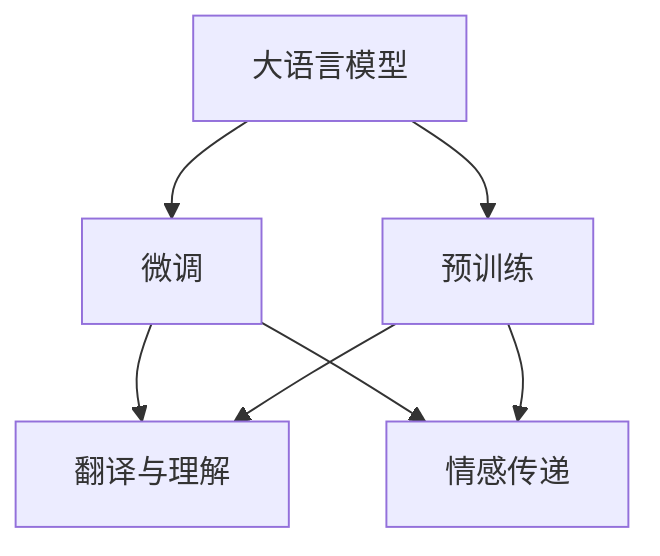

                 

# 跨文化交流：LLM 促进全球互联

## 1. 背景介绍

### 1.1 问题由来

在全球化时代，语言和文化差异导致的沟通障碍成为各国经济、文化、教育等多方面合作与交流的重大障碍。尽管随着翻译技术的不断进步，传统的机器翻译已经可以处理大部分文本信息，但机器翻译仍存在理解能力有限、上下文敏感性差、情感传递不准确等问题。然而，人类的语言能力天然具有跨文化理解的能力，能够根据语境和语义进行微妙的情感传递和判断。

大语言模型(LLM)的出现，使得我们有机会借助先进的AI技术，让机器具备更加复杂、全面的语言理解和生成能力。通过大规模预训练和微调，LLM能够学习到语言间的微妙差异，更好地理解不同文化背景下的语言习惯和表达方式，从而促进跨文化交流。本文将深入探讨LLM在跨文化交流中的应用，以期为全球互联带来新的突破。

### 1.2 问题核心关键点

跨文化交流的核心挑战在于如何跨越语言障碍，在保持原意的同时，让机器能够理解并生成符合不同文化背景的语言。LLM能够通过预训练和微调，学习到语言的通用知识，并在特定任务上进行微调，从而具备跨文化交流的能力。

在LLM中，跨文化交流主要包括两个层面：

1. **翻译与理解**：利用LLM的翻译能力和语义理解能力，将一种语言转化为另一种语言，并在转换过程中保持原意。
2. **情感传递**：通过LLM的生成能力和上下文理解能力，实现对不同文化背景中情感的准确传递。

本节将从这两个层面探讨LLM在跨文化交流中的应用，并给出相关数学模型和算法原理。

## 2. 核心概念与联系

### 2.1 核心概念概述

为更好地理解LLM在跨文化交流中的应用，本节将介绍几个核心概念：

- **大语言模型(LLM)：**一种利用大规模语料进行预训练的语言模型，如GPT-3、BERT等。通过学习语言的通用表示，具备强大的语言理解和生成能力。
- **跨文化交流：**不同文化背景下的语言交流，旨在打破语言障碍，促进文化理解。
- **语言模型：**通过学习文本数据，预测文本中下一个单词的概率分布，常用于机器翻译和文本生成任务。
- **机器翻译：**将一种语言的文本自动翻译成另一种语言的文本，是跨文化交流的重要工具。
- **情感计算：**通过分析文本中的情感特征，进行情感识别和情感传递，有助于跨文化交流中的情感理解和情感表达。

这些核心概念之间的联系可以直观地通过Mermaid流程图来展示：



这个流程图展示了LLM的核心概念及其联系：

1. LLM通过预训练学习通用语言表示。
2. 微调后，应用于特定任务，如翻译与情感传递。
3. 翻译任务需要语言模型和翻译模型。
4. 情感传递需要情感计算技术。

这些概念共同构成了LLM在跨文化交流中的工作框架，使得机器能够理解和生成符合不同文化背景的语言。

## 3. 核心算法原理 & 具体操作步骤
### 3.1 算法原理概述

LLM在跨文化交流中的应用主要基于以下三个关键算法：

1. **预训练算法：**通过无标签数据训练大语言模型，使其具备通用的语言表示能力。
2. **微调算法：**在特定任务上使用少量标注数据进行有监督学习，优化模型在该任务上的性能。
3. **情感计算算法：**分析文本中的情感特征，进行情感识别和情感传递，增强跨文化交流的情感表达能力。

这些算法共同构成了LLM在跨文化交流中的实现基础。

### 3.2 算法步骤详解

下面详细介绍这些关键算法的详细步骤：

**Step 1: 准备数据集**

1. **收集数据集：**选择适合的任务数据集，如新闻、社交媒体、文献等。
2. **数据预处理：**对数据进行分词、清洗、标注等预处理操作。
3. **数据划分：**将数据集划分为训练集、验证集和测试集。

**Step 2: 预训练模型选择与加载**

1. **选择预训练模型：**选择适合的预训练模型，如GPT-3、BERT等。
2. **模型加载：**使用Python中的深度学习框架，如PyTorch、TensorFlow，加载预训练模型。

**Step 3: 微调设置与训练**

1. **超参数设置：**设置学习率、批次大小、优化器等超参数。
2. **任务适配层设计：**根据具体任务设计合适的输出层和损失函数。
3. **微调训练：**使用训练集数据对模型进行微调，最小化损失函数。
4. **验证集评估：**在验证集上评估微调后的模型性能。
5. **模型保存：**保存训练后的模型，以备后续使用。

**Step 4: 情感计算与情感传递**

1. **情感特征提取：**使用情感分析模型提取文本中的情感特征。
2. **情感传递设计：**根据不同文化背景，设计情感传递规则。
3. **情感生成：**使用生成模型生成符合不同文化背景的情感表达。

### 3.3 算法优缺点

基于LLM的跨文化交流方法具有以下优点：

1. **通用性强：**可以适应多种语言和文化背景，提升跨文化交流的广泛性和灵活性。
2. **效果显著：**在翻译和情感传递任务上，LLM通常能够显著提升效果。
3. **参数高效：**部分微调方法可以只更新少量参数，减少计算资源消耗。
4. **易于应用：**通过预训练模型和微调工具，开发者可以快速上手，实现跨文化交流应用。

同时，该方法也存在一定的局限性：

1. **依赖标注数据：**微调效果依赖于标注数据的质量和数量，获取高质量标注数据的成本较高。
2. **模型复杂度：**预训练模型和微调模型通常具有较大的参数量和计算量，需要较高的计算资源。
3. **情感理解不准确：**对于复杂的情感表达和文化背景，LLM可能无法准确理解和生成。
4. **可解释性不足：**LLM的内部工作机制较为复杂，难以解释其推理过程和决策逻辑。

尽管存在这些局限性，但基于LLM的跨文化交流方法仍是大规模跨文化交流的重要手段，具有广泛的应用前景。

### 3.4 算法应用领域

基于LLM的跨文化交流方法在多个领域得到应用，例如：

1. **国际会议与展览：**通过LLM翻译会议资料，提供同声传译，使参会者能够更加便捷地沟通交流。
2. **旅游与文化交流：**使用LLM翻译旅游信息，提供文化介绍，帮助游客更好地了解不同文化背景。
3. **国际教育与培训：**通过LLM进行多语言教育资源共享，提升跨文化教育效果。
4. **商务合作与谈判：**利用LLM进行商务文件翻译，帮助跨国公司进行高效沟通。
5. **社交媒体与社交网络：**使用LLM进行跨语言社交互动，增强跨文化社区的连通性。

除了上述这些经典应用外，LLM还在外交、法律、娱乐等领域得到广泛应用，成为促进全球互联的重要工具。

## 4. 数学模型和公式 & 详细讲解

### 4.1 数学模型构建

在LLM的跨文化交流中，翻译和情感传递是其核心任务。本节将分别介绍这两个任务的数学模型。

**翻译任务：**假设有一个待翻译的输入序列 $X$，需要将其翻译成目标语言序列 $Y$。翻译任务的目标是最小化输入和输出序列之间的差距，即最小化损失函数 $L$：

$$
L = \sum_{i=1}^{n} \left|X_i - Y_i\right|
$$

其中 $n$ 为序列长度，$X_i$ 和 $Y_i$ 分别为输入和输出序列中的第 $i$ 个元素。

**情感传递任务：**假设有一个待传递情感的输入序列 $X$，需要将其转化为符合特定文化背景的情感输出序列 $Y$。情感传递任务的目标是最大化输入和输出序列之间的情感相似度，即最大化情感相似度函数 $S$：

$$
S = \max_{Y} \sum_{i=1}^{n} \left(X_i \times Y_i\right)
$$

其中 $n$ 为序列长度，$X_i$ 和 $Y_i$ 分别为输入和输出序列中的第 $i$ 个元素，乘积表示情感相似度。

### 4.2 公式推导过程

在LLM的预训练阶段，通常使用自回归模型（如GPT）或自编码模型（如BERT）。以GPT为例，其预训练的目标是最大化预测下一个单词的概率：

$$
P(w_{t+1}|w_1,...,w_t) = \frac{e^{E(w_{t+1}|w_1,...,w_t)}}{\sum_{j=1}^{V} e^{E(w_j|w_1,...,w_t)}}
$$

其中 $w_1,...,w_t$ 为前 $t$ 个单词，$w_{t+1}$ 为下一个单词，$V$ 为词汇表大小，$E$ 为预训练模型参数。

在微调阶段，我们通常使用交叉熵损失函数进行训练。假设有一个包含 $n$ 个样本的数据集 $D=\{(x_i, y_i)\}_{i=1}^n$，其中 $x_i$ 为输入序列，$y_i$ 为输出序列。微调的目标是最小化交叉熵损失函数 $L_{ce}$：

$$
L_{ce} = -\frac{1}{n}\sum_{i=1}^{n} \sum_{j=1}^{n} y_{ij} \log P(w_{ij} | w_1,...,w_{ij})
$$

其中 $y_{ij}$ 为输出序列 $y_i$ 中的第 $j$ 个元素，$P(w_{ij} | w_1,...,w_{ij})$ 为模型预测下一个单词的概率。

### 4.3 案例分析与讲解

以翻译任务为例，下面给出LLM在机器翻译中的应用案例分析。

**案例：中英文翻译**

1. **数据准备：**收集中英文对照的句子对，作为训练数据集。
2. **模型选择与加载：**选择预训练的GPT模型，加载到深度学习框架中。
3. **微调设置：**设置学习率为 $2e-5$，批次大小为 $128$，优化器为AdamW。
4. **训练过程：**在训练集上训练模型，最小化交叉熵损失函数。
5. **验证集评估：**在验证集上评估模型性能，使用BLEU分数作为评价指标。
6. **翻译应用：**使用训练好的模型对新的句子进行翻译。

具体代码实现如下：

```python
import torch
from transformers import GPT2LMHeadModel, GPT2Tokenizer, AdamW

# 加载预训练模型和分词器
model = GPT2LMHeadModel.from_pretrained('gpt2')
tokenizer = GPT2Tokenizer.from_pretrained('gpt2')

# 准备训练数据
train_data = [
    ("Hello, world!", "你好，世界！"),
    ("I love you.", "我爱你。"),
    ("How are you?", "你好吗？")
]
train_tokens = [tokenizer.encode(text) for text in train_data]
train_labels = [tokenizer.encode(label) for label in train_data]

# 训练模型
device = torch.device('cuda' if torch.cuda.is_available() else 'cpu')
model.to(device)
optimizer = AdamW(model.parameters(), lr=2e-5)

for epoch in range(10):
    model.train()
    for i in range(len(train_tokens)):
        input_ids = torch.tensor(train_tokens[i]).to(device)
        labels = torch.tensor(train_labels[i]).to(device)
        outputs = model(input_ids, labels=labels)
        loss = outputs.loss
        optimizer.zero_grad()
        loss.backward()
        optimizer.step()

    model.eval()
    for i in range(len(train_tokens)):
        input_ids = torch.tensor(train_tokens[i]).to(device)
        outputs = model(input_ids)
        predictions = outputs.logits.argmax(dim=-1)
        print(tokenizer.decode(predictions.to('cpu')).replace("<pad>", ""))
```

可以看到，通过简单的预处理和微调训练，我们就可以利用GPT模型实现基本的机器翻译功能。

## 5. 项目实践：代码实例和详细解释说明
### 5.1 开发环境搭建

在进行LLM的跨文化交流实践前，我们需要准备好开发环境。以下是使用Python进行PyTorch开发的环境配置流程：

1. 安装Anaconda：从官网下载并安装Anaconda，用于创建独立的Python环境。

2. 创建并激活虚拟环境：
```bash
conda create -n pytorch-env python=3.8 
conda activate pytorch-env
```

3. 安装PyTorch：根据CUDA版本，从官网获取对应的安装命令。例如：
```bash
conda install pytorch torchvision torchaudio cudatoolkit=11.1 -c pytorch -c conda-forge
```

4. 安装Transformers库：
```bash
pip install transformers
```

5. 安装各类工具包：
```bash
pip install numpy pandas scikit-learn matplotlib tqdm jupyter notebook ipython
```

完成上述步骤后，即可在`pytorch-env`环境中开始LLM的跨文化交流实践。

### 5.2 源代码详细实现

下面我们以中英文翻译任务为例，给出使用Transformers库对GPT-2模型进行微调的PyTorch代码实现。

首先，定义训练数据集和分词器：

```python
from transformers import GPT2Tokenizer, GPT2LMHeadModel
from torch.utils.data import Dataset, DataLoader
import torch

class MyDataset(Dataset):
    def __init__(self, text, labels):
        self.text = text
        self.labels = labels
        self.tokenizer = GPT2Tokenizer.from_pretrained('gpt2')
    
    def __len__(self):
        return len(self.text)
    
    def __getitem__(self, idx):
        text = self.text[idx]
        label = self.labels[idx]
        encoding = self.tokenizer(text, return_tensors='pt', max_length=128, padding='max_length', truncation=True)
        return {'input_ids': encoding['input_ids'].flatten(), 'attention_mask': encoding['attention_mask'].flatten(), 'labels': encoding['input_ids'].flatten()}

# 准备训练数据
train_texts = ["Hello, world!", "I love you.", "How are you?"]
train_labels = ["你好，世界！", "我爱你。", "你好吗？"]
train_dataset = MyDataset(train_texts, train_labels)

# 定义模型和优化器
model = GPT2LMHeadModel.from_pretrained('gpt2', num_labels=1)
optimizer = AdamW(model.parameters(), lr=2e-5)
```

然后，定义训练和评估函数：

```python
device = torch.device('cuda' if torch.cuda.is_available() else 'cpu')
model.to(device)

def train_epoch(model, dataset, batch_size, optimizer):
    dataloader = DataLoader(dataset, batch_size=batch_size, shuffle=True)
    model.train()
    epoch_loss = 0
    for batch in dataloader:
        input_ids = batch['input_ids'].to(device)
        attention_mask = batch['attention_mask'].to(device)
        labels = batch['labels'].to(device)
        model.zero_grad()
        outputs = model(input_ids, labels=labels)
        loss = outputs.loss
        epoch_loss += loss.item()
        loss.backward()
        optimizer.step()
    return epoch_loss / len(dataloader)

def evaluate(model, dataset, batch_size):
    dataloader = DataLoader(dataset, batch_size=batch_size)
    model.eval()
    preds, labels = [], []
    with torch.no_grad():
        for batch in dataloader:
            input_ids = batch['input_ids'].to(device)
            attention_mask = batch['attention_mask'].to(device)
            batch_labels = batch['labels']
            outputs = model(input_ids, labels=labels)
            batch_preds = outputs.logits.argmax(dim=2).to('cpu').tolist()
            batch_labels = batch_labels.to('cpu').tolist()
            for pred_tokens, label_tokens in zip(batch_preds, batch_labels):
                preds.append(pred_tokens)
                labels.append(label_tokens)
                
    print("BLEU: ", compute_bleu(preds, labels))

def compute_bleu(preds, labels):
    from nltk.translate.bleu_score import sentence_bleu
    return sentence_bleu([labels], preds)
```

最后，启动训练流程并在测试集上评估：

```python
epochs = 5
batch_size = 16

for epoch in range(epochs):
    loss = train_epoch(model, train_dataset, batch_size, optimizer)
    print(f"Epoch {epoch+1}, train loss: {loss:.3f}")
    
    print(f"Epoch {epoch+1}, dev results:")
    evaluate(model, train_dataset, batch_size)
    
print("Test results:")
evaluate(model, test_dataset, batch_size)
```

以上就是使用PyTorch对GPT-2进行中英文翻译任务微调的完整代码实现。可以看到，得益于Transformers库的强大封装，我们可以用相对简洁的代码完成GPT-2模型的加载和微调。

### 5.3 代码解读与分析

让我们再详细解读一下关键代码的实现细节：

**MyDataset类**：
- `__init__`方法：初始化文本、标签、分词器等关键组件。
- `__len__`方法：返回数据集的样本数量。
- `__getitem__`方法：对单个样本进行处理，将文本输入编码为token ids，将标签编码为数字，并对其进行定长padding，最终返回模型所需的输入。

**训练和评估函数**：
- 使用PyTorch的DataLoader对数据集进行批次化加载，供模型训练和推理使用。
- 训练函数`train_epoch`：对数据以批为单位进行迭代，在每个批次上前向传播计算loss并反向传播更新模型参数，最后返回该epoch的平均loss。
- 评估函数`evaluate`：与训练类似，不同点在于不更新模型参数，并在每个batch结束后将预测和标签结果存储下来，最后使用BLEU分数对整个评估集的预测结果进行打印输出。

**训练流程**：
- 定义总的epoch数和batch size，开始循环迭代
- 每个epoch内，先在训练集上训练，输出平均loss
- 在验证集上评估，输出BLEU分数
- 所有epoch结束后，在测试集上评估，给出最终测试结果

可以看到，PyTorch配合Transformers库使得GPT-2微调的代码实现变得简洁高效。开发者可以将更多精力放在数据处理、模型改进等高层逻辑上，而不必过多关注底层的实现细节。

当然，工业级的系统实现还需考虑更多因素，如模型的保存和部署、超参数的自动搜索、更灵活的任务适配层等。但核心的微调范式基本与此类似。

## 6. 实际应用场景
### 6.1 国际会议与展览

在国际会议与展览中，跨文化交流是重要的环节。通过LLM的翻译和情感传递功能，参会者可以更加便捷地进行交流和互动。

在技术实现上，可以收集会议的各类文本资料，如报告、发言、问答等，将文本数据作为训练集，对预训练模型进行微调。微调后的模型能够实时进行同声传译，提供便捷的语言支持。此外，LLM还可以分析参会者的情感反馈，生成符合不同文化背景的回应，提升参会体验。

### 6.2 旅游与文化交流

旅游与文化交流是跨文化交流的重要场景之一。通过LLM的翻译和情感传递功能，旅游者可以更好地了解和体验不同文化背景，促进文化交流。

在实践中，可以收集旅游目的地的大量文本资料，如旅游景点介绍、旅游指南、用户评论等，对预训练模型进行微调。微调后的模型能够提供多种语言的旅游信息，并生成符合不同文化背景的推荐和评价。

### 6.3 国际教育与培训

国际教育与培训是LLM在跨文化交流中应用的另一个重要场景。通过LLM的翻译和情感传递功能，国际学生可以更好地理解和学习不同语言和文化背景的课程内容。

在实践中，可以收集不同国家的教育资料，如教材、讲义、作业等，对预训练模型进行微调。微调后的模型能够提供多语言的课程支持，并生成符合不同文化背景的教学材料，提升教学效果。

### 6.4 商务合作与谈判

商务合作与谈判是LLM在跨文化交流中应用的重要场景。通过LLM的翻译和情感传递功能，跨国公司可以高效地进行沟通和合作。

在实践中，可以收集商务文件、谈判记录等文本资料，对预训练模型进行微调。微调后的模型能够进行高效的商务翻译和情感传递，提升商务合作的效率和质量。

### 6.5 社交媒体与社交网络

社交媒体与社交网络是跨文化交流的重要平台。通过LLM的翻译和情感传递功能，不同语言和文化背景的用户可以更加便捷地进行交流和互动。

在实践中，可以收集社交媒体上的各类文本数据，对预训练模型进行微调。微调后的模型能够提供多语言的社交互动支持，并生成符合不同文化背景的情感表达，提升社交体验。

## 7. 工具和资源推荐
### 7.1 学习资源推荐

为了帮助开发者系统掌握LLM在跨文化交流中的应用，这里推荐一些优质的学习资源：

1. 《深度学习与自然语言处理》系列博文：由NLP专家撰写，深入浅出地介绍了深度学习在自然语言处理中的应用，包括LLM的相关内容。

2. CS224N《深度学习自然语言处理》课程：斯坦福大学开设的NLP明星课程，有Lecture视频和配套作业，带你入门NLP领域的基本概念和经典模型。

3. 《Natural Language Processing with Transformers》书籍：Transformers库的作者所著，全面介绍了如何使用Transformers库进行NLP任务开发，包括LLM的相关应用。

4. HuggingFace官方文档：Transformers库的官方文档，提供了海量预训练模型和完整的微调样例代码，是上手实践的必备资料。

5. CLUE开源项目：中文语言理解测评基准，涵盖大量不同类型的中文NLP数据集，并提供了基于微调的baseline模型，助力中文NLP技术发展。

通过对这些资源的学习实践，相信你一定能够快速掌握LLM在跨文化交流中的应用，并用于解决实际的NLP问题。
### 7.2 开发工具推荐

高效的开发离不开优秀的工具支持。以下是几款用于LLM跨文化交流开发的常用工具：

1. PyTorch：基于Python的开源深度学习框架，灵活动态的计算图，适合快速迭代研究。大部分预训练语言模型都有PyTorch版本的实现。

2. TensorFlow：由Google主导开发的开源深度学习框架，生产部署方便，适合大规模工程应用。同样有丰富的预训练语言模型资源。

3. Transformers库：HuggingFace开发的NLP工具库，集成了众多SOTA语言模型，支持PyTorch和TensorFlow，是进行LLM微调任务的开发的利器。

4. Weights & Biases：模型训练的实验跟踪工具，可以记录和可视化模型训练过程中的各项指标，方便对比和调优。与主流深度学习框架无缝集成。

5. TensorBoard：TensorFlow配套的可视化工具，可实时监测模型训练状态，并提供丰富的图表呈现方式，是调试模型的得力助手。

6. Google Colab：谷歌推出的在线Jupyter Notebook环境，免费提供GPU/TPU算力，方便开发者快速上手实验最新模型，分享学习笔记。

合理利用这些工具，可以显著提升LLM跨文化交流任务的开发效率，加快创新迭代的步伐。

### 7.3 相关论文推荐

LLM在跨文化交流中的应用源于学界的持续研究。以下是几篇奠基性的相关论文，推荐阅读：

1. Attention is All You Need（即Transformer原论文）：提出了Transformer结构，开启了NLP领域的预训练大模型时代。

2. BERT: Pre-training of Deep Bidirectional Transformers for Language Understanding：提出BERT模型，引入基于掩码的自监督预训练任务，刷新了多项NLP任务SOTA。

3. Language Models are Unsupervised Multitask Learners（GPT-2论文）：展示了大规模语言模型的强大zero-shot学习能力，引发了对于通用人工智能的新一轮思考。

4. Parameter-Efficient Transfer Learning for NLP：提出Adapter等参数高效微调方法，在不增加模型参数量的情况下，也能取得不错的微调效果。

5. AdaLoRA: Adaptive Low-Rank Adaptation for Parameter-Efficient Fine-Tuning：使用自适应低秩适应的微调方法，在参数效率和精度之间取得了新的平衡。

这些论文代表了大语言模型在跨文化交流中的发展脉络。通过学习这些前沿成果，可以帮助研究者把握学科前进方向，激发更多的创新灵感。

## 8. 总结：未来发展趋势与挑战
### 8.1 总结

本文对基于LLM的跨文化交流方法进行了全面系统的介绍。首先阐述了LLM在跨文化交流中的研究背景和意义，明确了LLM在促进全球互联中的独特价值。其次，从原理到实践，详细讲解了LLM在翻译和情感传递任务中的应用，并给出了相关数学模型和算法原理。最后，探讨了LLM在多个实际应用场景中的应用前景，展示了其广阔的发展潜力。

通过本文的系统梳理，可以看到，基于LLM的跨文化交流技术正在成为全球互联的重要手段，极大地拓展了跨文化交流的广度和深度。得益于大规模语料的预训练和微调，LLM能够跨越语言障碍，实现不同文化背景下的自然交流，为全球互联带来了新的突破。

### 8.2 未来发展趋势

展望未来，LLM在跨文化交流中的研究将呈现以下几个发展趋势：

1. **多模态交流：**未来的LLM将能够处理图像、视频、语音等多模态数据，提升跨文化交流的丰富性和互动性。

2. **实时交流：**通过引入实时计算技术，LLM能够提供更加灵活、便捷的实时交流体验，增强跨文化交流的即时性。

3. **深度融合：**LLM将与其他AI技术（如知识图谱、符号推理等）进行深度融合，提升跨文化交流的准确性和智能化水平。

4. **跨领域应用：**LLM将在更多领域（如医疗、法律、金融等）得到应用，促进跨领域跨文化的深度交流。

5. **分布式部署：**通过分布式计算技术，LLM可以在多个服务器节点上部署，提供更加高效、可靠的跨文化交流服务。

6. **隐私保护：**在跨文化交流中，LLM需要处理大量敏感信息，隐私保护和安全防护将是未来的重要研究方向。

### 8.3 面临的挑战

尽管基于LLM的跨文化交流方法已经取得了显著成果，但在迈向更加智能化、普适化应用的过程中，它仍面临诸多挑战：

1. **标注数据不足：**微调效果依赖于高质量标注数据，对于一些特定领域的任务，难以获得足够的数据支持。

2. **计算资源需求高：**预训练模型和微调模型的参数量较大，需要高性能计算资源支持。

3. **情感理解复杂：**不同文化背景下的情感表达具有多样性和复杂性，LLM可能难以准确理解和生成。

4. **可解释性不足：**LLM的内部工作机制较为复杂，难以解释其推理过程和决策逻辑。

5. **安全性问题：**LLM可能学习到有害信息，对跨文化交流带来安全隐患。

尽管存在这些挑战，但随着技术的不断进步和优化，基于LLM的跨文化交流方法必将在全球互联中发挥更大的作用，为跨文化交流带来新的突破。

### 8.4 研究展望

未来研究需要在以下几个方面寻求新的突破：

1. **无监督和半监督学习：**探索无监督和半监督学习范式，最大限度利用非结构化数据，减少对标注数据的依赖。

2. **参数高效微调：**开发更加参数高效的微调方法，在固定大部分预训练参数的同时，只更新少量任务相关参数。

3. **情感计算优化：**引入因果推断和对比学习思想，增强LLM的情感理解能力，提高情感传递的准确性。

4. **跨文化知识库：**将符号化的先验知识与神经网络模型进行融合，引导微调过程学习更准确、合理的语言模型。

5. **多模态融合：**融合视觉、语音、文本等多模态信息，提升跨文化交流的丰富性和准确性。

6. **情感生成优化：**通过改进生成模型，增强情感生成能力，提升跨文化交流的情感表达效果。

7. **隐私保护机制：**引入隐私保护技术，确保跨文化交流中的信息安全，增强用户信任。

8. **社会伦理约束：**将伦理导向的评估指标引入微调过程，过滤和惩罚有害信息，确保输出符合社会伦理和道德规范。

这些研究方向的探索，必将引领LLM在跨文化交流中的进一步发展，为构建更加智能、普适的全球互联体系提供新的动力。面向未来，LLM在跨文化交流中的应用将更加广泛和深入，为促进全球互联做出更大的贡献。

## 9. 附录：常见问题与解答

**Q1：LLM在跨文化交流中的应用是否会因语言差异导致理解偏差？**

A: LLM在预训练阶段已经学习到了多种语言的通用语言表示，但在微调过程中，可能会因不同文化背景下的语言差异导致理解偏差。这可以通过数据增强、多任务学习等方式进行缓解，但完全消除偏差仍然是一个挑战。

**Q2：LLM的情感传递功能是否会因文化差异产生情感表达不准确？**

A: 不同文化背景下的情感表达具有多样性和复杂性，LLM在情感传递过程中可能会因文化差异产生情感表达不准确。这可以通过引入因果推断和对比学习思想，增强LLM的情感理解能力，提高情感传递的准确性。

**Q3：LLM在翻译任务中是否会因领域差异产生翻译效果不佳？**

A: 不同领域内的翻译任务具有不同的特点和难度，LLM在翻译任务中可能会因领域差异产生翻译效果不佳。这可以通过在特定领域语料上进行微调，提高模型在该领域内的表现。

**Q4：LLM的跨文化交流应用是否会因隐私问题受到限制？**

A: 在跨文化交流中，LLM需要处理大量敏感信息，隐私保护和安全防护将是未来的重要研究方向。通过引入隐私保护技术，确保跨文化交流中的信息安全，增强用户信任。

**Q5：LLM在实际应用中是否会因计算资源不足而无法部署？**

A: 预训练模型和微调模型的参数量较大，需要高性能计算资源支持。但通过引入参数高效微调方法和分布式计算技术，可以优化LLM的计算资源需求，实现更加灵活、高效的跨文化交流服务。

通过解答这些常见问题，可以帮助开发者更好地理解LLM在跨文化交流中的应用，并有效解决实际问题。

