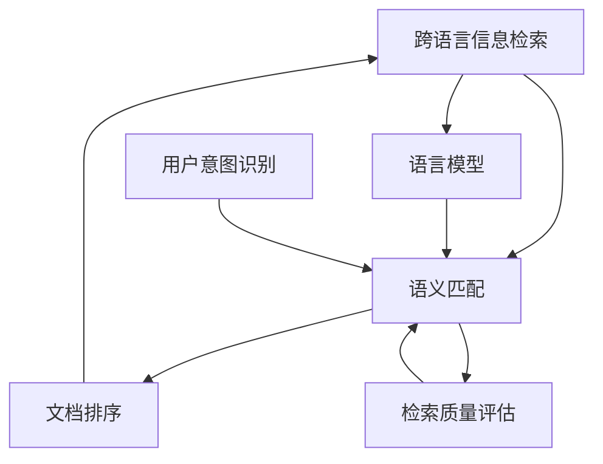

                 

# 跨语言信息检索：打破语言壁垒

> 关键词：跨语言信息检索, 语言模型, 语义匹配, 文档排序, 用户意图识别, 检索质量评估

## 1. 背景介绍

### 1.1 问题由来

在当今全球化高度发展的背景下，人们日常生活的各个方面都越来越多地跨越了语言边界。企业间的跨国合作、学术研究、文化交流等活动，都依赖于跨语言的信息检索（Cross-Language Information Retrieval, CLIR）。然而，由于语言结构和语义的巨大差异，不同语言的文档难以直接匹配，给跨语言信息检索带来了巨大的挑战。

跨语言信息检索旨在解决这一问题，通过建立不同语言文档之间的语义关联，使用户能够迅速找到所需信息。它是搜索引擎、智能问答、多语言信息管理系统等应用的核心技术，直接影响着用户检索体验和系统性能。

### 1.2 问题核心关键点

实现跨语言信息检索的核心在于：
1. 如何克服不同语言之间的语义鸿沟，将文本从一种语言映射到另一种语言。
2. 如何建立不同语言之间的语义关联，使得文档能够在多种语言之间进行有效的检索和排序。
3. 如何识别用户查询的意图，以及识别查询中不同语言的关键词，确保检索结果的相关性和准确性。
4. 如何对检索结果的质量进行评估，以持续优化检索算法和模型。

这些关键点涉及语言学、计算机科学、信息检索等多个领域的知识，是跨语言信息检索技术研究的核心。

## 2. 核心概念与联系

### 2.1 核心概念概述

为更好地理解跨语言信息检索，我们需要介绍一些关键概念及其相互关系：

- **跨语言信息检索**：指在多种语言环境中，通过语义匹配将用户查询与文档进行相关性排序，帮助用户快速找到所需信息的过程。
- **语言模型**：用于描述语言的概率分布模型，通过语言模型可以计算语言序列之间的概率，从而进行语义匹配。
- **语义匹配**：通过语义相似度度量，将不同语言的文档映射到同一语义空间，进行文档匹配和排序。
- **文档排序**：在语义匹配的基础上，根据用户查询和文档的相关度，对文档进行排序，以优化用户检索体验。
- **用户意图识别**：通过分析用户查询，识别用户的意图和关注点，以提高检索结果的相关性和准确性。
- **检索质量评估**：通过评价指标对检索结果进行评估，反馈给模型进行迭代优化。

这些概念通过一种连贯的方式相互关联，共同构成了跨语言信息检索的完整框架。

### 2.2 核心概念原理和架构的 Mermaid 流程图



这个流程图展示了跨语言信息检索的主要流程及其核心概念之间的相互关系：
1. 用户查询首先经过**用户意图识别**，以确定查询的重点和方向。
2. **语言模型**用于描述不同语言的语法和语义，在查询和文档之间进行语义匹配。
3. 匹配结果通过**语义匹配**算法，转化为同一语义空间内的相似度度量。
4. **文档排序**算法根据相似度度量对文档进行排序，返回给用户最相关的检索结果。
5. **检索质量评估**对检索结果进行评估，反馈给系统进行持续优化。

这些步骤共同作用，使得跨语言信息检索系统能够高效地完成检索任务。

## 3. 核心算法原理 & 具体操作步骤

### 3.1 算法原理概述

跨语言信息检索的算法原理基于以下关键步骤：

1. **用户查询和文档预处理**：将用户查询和文档进行分词、词性标注等预处理，转化为模型可以接受的格式。
2. **语言模型转换**：通过语言模型，将查询和文档转换为同一语义空间内的表示。
3. **语义匹配**：通过相似度度量，计算查询和文档之间的语义匹配度。
4. **文档排序**：根据语义匹配度对文档进行排序，返回最相关的检索结果。
5. **用户意图识别**：对用户查询进行意图识别，优化检索结果。
6. **检索质量评估**：评估检索结果，反馈给模型进行迭代优化。

### 3.2 算法步骤详解

**Step 1: 用户查询和文档预处理**
- 对用户查询进行分词、词性标注、去除停用词等预处理操作，转化为模型可以接受的格式。
- 对文档进行相似的处理，包括分词、词性标注、命名实体识别等。
- 对于命名实体，根据不同语言的实体识别规则，进行统一的实体标注。

**Step 2: 语言模型转换**
- 通过语言模型（如BERT、GPT等），将查询和文档转换为向量表示，捕捉语言中的语义信息。
- 使用相同的预训练语言模型，对查询和文档进行语义匹配，计算相似度。
- 使用Transformer等架构，对文本序列进行编码，提取语义特征。

**Step 3: 语义匹配**
- 通过余弦相似度、Jaccard相似度等方法，计算查询和文档之间的语义相似度。
- 对于多语言场景，使用跨语言对齐模型（如MUSE、FastAlign等）对不同语言之间的语义映射进行训练，增强匹配精度。

**Step 4: 文档排序**
- 使用排序算法（如BM25、TF-IDF等），根据语义相似度对文档进行排序。
- 结合用户查询意图和文档摘要等信息，调整排序结果，优化检索体验。

**Step 5: 用户意图识别**
- 通过意图识别模型，对用户查询进行意图分类，识别查询的重点。
- 根据用户意图，调整检索策略，提高检索结果的相关性。

**Step 6: 检索质量评估**
- 使用评估指标（如NDCG、MAP、BM25-Score等）对检索结果进行评估。
- 反馈评估结果，用于模型参数更新和迭代优化。

### 3.3 算法优缺点

跨语言信息检索算法具有以下优点：
1. 打破语言壁垒，实现多语言文档的检索和匹配。
2. 利用大规模预训练语言模型，提升语义匹配的准确性。
3. 结合用户意图识别，优化检索结果的相关性。
4. 动态反馈和持续优化，提高检索质量。

同时，该算法也存在以下缺点：
1. 计算复杂度高，对计算资源要求较高。
2. 语义映射准确性依赖于预训练模型和对齐模型的质量。
3. 用户意图识别可能存在误差，影响检索结果的准确性。
4. 数据隐私和安全问题，需要处理大规模跨语言数据。

### 3.4 算法应用领域

跨语言信息检索在多个领域有广泛应用：
- 搜索引擎：多语言搜索引擎如谷歌、必应等，通过跨语言信息检索技术，实现多语言文档的检索和排序。
- 智能问答系统：如微软的Cortana、IBM的Watson等，能够理解多种语言的查询，提供准确的回答。
- 多语言信息管理系统：如Wikipedia、政府信息公开系统等，能够跨语言检索和管理大量信息。
- 学术研究：如跨语言文献检索、跨语言学术交流平台等，促进不同语言环境下的学术合作。

## 4. 数学模型和公式 & 详细讲解 & 举例说明

### 4.1 数学模型构建

跨语言信息检索的数学模型主要包括：

- **用户查询表示**：将用户查询转化为向量表示，捕捉查询的语义信息。
- **文档表示**：将文档转化为向量表示，捕捉文档的语义信息。
- **语义相似度**：通过相似度度量，计算查询和文档之间的语义相似度。
- **文档排序**：根据语义相似度对文档进行排序，返回最相关的检索结果。

### 4.2 公式推导过程

以下是跨语言信息检索模型的主要公式推导：

**用户查询表示**：
假设用户查询为 $q$，通过语言模型将 $q$ 转换为向量表示 $q_{vec}$：
$$ q_{vec} = \text{Embed}(Q(q)) $$
其中，$\text{Embed}$ 为查询嵌入函数，$Q(q)$ 为语言模型对查询的编码。

**文档表示**：
假设文档为 $d$，通过语言模型将 $d$ 转换为向量表示 $d_{vec}$：
$$ d_{vec} = \text{Embed}(D(d)) $$
其中，$\text{Embed}$ 为文档嵌入函数，$D(d)$ 为语言模型对文档的编码。

**语义相似度**：
使用余弦相似度计算查询和文档之间的语义相似度：
$$ \text{similarity}(q_{vec}, d_{vec}) = \frac{q_{vec} \cdot d_{vec}}{\Vert q_{vec} \Vert \cdot \Vert d_{vec} \Vert} $$

**文档排序**：
使用BM25算法根据语义相似度对文档进行排序，计算BM25-Score：
$$ \text{Score}(q, d) = \text{tf}(d) \cdot \text{idf}(d) \cdot (1 - b + b \cdot \text{dl}(q)) \cdot (1 - k + k \cdot \text{dl}(q)) \cdot (1 - k) \cdot \text{similarity}(q_{vec}, d_{vec}) $$
其中，$\text{tf}(d)$ 为文档的词频，$\text{idf}(d)$ 为文档的逆文档频率，$b$ 为折扣因数，$k$ 为长度归一化参数，$\text{dl}(q)$ 为用户查询的长度。

### 4.3 案例分析与讲解

以谷歌跨语言搜索引擎为例，分析其核心算法和实现细节：

**Step 1: 用户查询和文档预处理**
- 谷歌搜索引擎对用户查询进行分词、词性标注，去除停用词。
- 对文档进行相同处理，识别命名实体，进行统一的实体标注。

**Step 2: 语言模型转换**
- 谷歌使用BERT模型，将查询和文档转换为向量表示，捕捉语言中的语义信息。
- 使用跨语言对齐模型FastAlign，对不同语言之间的语义映射进行训练，增强匹配精度。

**Step 3: 语义匹配**
- 谷歌使用余弦相似度计算查询和文档之间的语义相似度。
- 结合用户查询意图和文档摘要等信息，调整排序结果，优化检索体验。

**Step 4: 文档排序**
- 谷歌使用BM25算法根据语义相似度对文档进行排序，返回最相关的检索结果。
- 谷歌结合用户查询意图和文档摘要，调整排序结果，优化检索体验。

**Step 5: 用户意图识别**
- 谷歌使用意图识别模型，对用户查询进行意图分类，识别查询的重点。
- 根据用户意图，调整检索策略，提高检索结果的相关性。

**Step 6: 检索质量评估**
- 谷歌使用NDCG、MAP等评估指标对检索结果进行评估。
- 反馈评估结果，用于模型参数更新和迭代优化。

谷歌的跨语言搜索引擎展示了如何通过多个步骤和算法，实现高效的跨语言信息检索。

## 5. 项目实践：代码实例和详细解释说明

### 5.1 开发环境搭建

在进行跨语言信息检索项目开发前，需要准备好开发环境。以下是使用Python进行PyTorch开发的环境配置流程：

1. 安装Anaconda：从官网下载并安装Anaconda，用于创建独立的Python环境。
2. 创建并激活虚拟环境：
```bash
conda create -n clir-env python=3.8 
conda activate clir-env
```
3. 安装PyTorch：根据CUDA版本，从官网获取对应的安装命令。例如：
```bash
conda install pytorch torchvision torchaudio cudatoolkit=11.1 -c pytorch -c conda-forge
```
4. 安装Transformer库：
```bash
pip install transformers
```
5. 安装各类工具包：
```bash
pip install numpy pandas scikit-learn matplotlib tqdm jupyter notebook ipython
```
完成上述步骤后，即可在`clir-env`环境中开始项目实践。

### 5.2 源代码详细实现

下面我们以跨语言检索系统为例，给出使用Transformers库对BERT模型进行跨语言检索的PyTorch代码实现。

首先，定义跨语言检索系统类：

```python
from transformers import BertTokenizer, BertForSequenceClassification, BertModel

class CrossLanguageIR:
    def __init__(self, model_path, tokenizer_path):
        self.model = BertForSequenceClassification.from_pretrained(model_path)
        self.tokenizer = BertTokenizer.from_pretrained(tokenizer_path)
        self.device = 'cuda' if torch.cuda.is_available() else 'cpu'
        self.model.to(self.device)
        
    def preprocess_query(self, query):
        query_tokens = self.tokenizer(query, return_tensors='pt', padding=True, truncation=True, max_length=512)
        query_input_ids = query_tokens.input_ids.to(self.device)
        query_attention_mask = query_tokens.attention_mask.to(self.device)
        return query_input_ids, query_attention_mask
        
    def preprocess_doc(self, doc):
        doc_tokens = self.tokenizer(doc, return_tensors='pt', padding=True, truncation=True, max_length=512)
        doc_input_ids = doc_tokens.input_ids.to(self.device)
        doc_attention_mask = doc_tokens.attention_mask.to(self.device)
        return doc_input_ids, doc_attention_mask
        
    def forward(self, query_input_ids, query_attention_mask, doc_input_ids, doc_attention_mask):
        query_outputs = self.model(query_input_ids, attention_mask=query_attention_mask)
        doc_outputs = self.model(doc_input_ids, attention_mask=doc_attention_mask)
        return query_outputs, doc_outputs
        
    def calculate_similarity(self, query_outputs, doc_outputs):
        similarity = torch.cosine_similarity(query_outputs[0], doc_outputs[0])
        return similarity
```

然后，定义训练和评估函数：

```python
from sklearn.metrics import mean_absolute_error
from torch.utils.data import Dataset, DataLoader
from tqdm import tqdm

class CrossLanguageDataset(Dataset):
    def __init__(self, queries, docs, tokenizer, max_len=512):
        self.queries = queries
        self.docs = docs
        self.tokenizer = tokenizer
        self.max_len = max_len
        
    def __len__(self):
        return len(self.queries)
    
    def __getitem__(self, item):
        query = self.queries[item]
        doc = self.docs[item]
        
        query_input_ids, query_attention_mask = self.tokenizer(query, return_tensors='pt', padding=True, truncation=True, max_length=self.max_len)
        doc_input_ids, doc_attention_mask = self.tokenizer(doc, return_tensors='pt', padding=True, truncation=True, max_length=self.max_len)
        
        return {'query_input_ids': query_input_ids,
                'query_attention_mask': query_attention_mask,
                'doc_input_ids': doc_input_ids,
                'doc_attention_mask': doc_attention_mask}
        
def train_epoch(model, dataset, optimizer, batch_size):
    dataloader = DataLoader(dataset, batch_size=batch_size, shuffle=True)
    model.train()
    epoch_loss = 0
    for batch in tqdm(dataloader, desc='Training'):
        query_input_ids = batch['query_input_ids'].to(device)
        query_attention_mask = batch['query_attention_mask'].to(device)
        doc_input_ids = batch['doc_input_ids'].to(device)
        doc_attention_mask = batch['doc_attention_mask'].to(device)
        model.zero_grad()
        query_outputs, doc_outputs = model(query_input_ids, query_attention_mask, doc_input_ids, doc_attention_mask)
        loss = query_outputs[0].dim[1] * (query_outputs[0] - doc_outputs[0]).pow(2).mean()
        epoch_loss += loss.item()
        loss.backward()
        optimizer.step()
    return epoch_loss / len(dataloader)

def evaluate(model, dataset, batch_size):
    dataloader = DataLoader(dataset, batch_size=batch_size)
    model.eval()
    loss = 0
    for batch in tqdm(dataloader, desc='Evaluating'):
        query_input_ids = batch['query_input_ids'].to(device)
        query_attention_mask = batch['query_attention_mask'].to(device)
        doc_input_ids = batch['doc_input_ids'].to(device)
        doc_attention_mask = batch['doc_attention_mask'].to(device)
        query_outputs, doc_outputs = model(query_input_ids, query_attention_mask, doc_input_ids, doc_attention_mask)
        loss += torch.cosine_similarity(query_outputs[0], doc_outputs[0]).mean().item()
    return loss / len(dataset)
```

最后，启动训练流程并在测试集上评估：

```python
epochs = 5
batch_size = 16

for epoch in range(epochs):
    loss = train_epoch(model, train_dataset, optimizer, batch_size)
    print(f"Epoch {epoch+1}, train loss: {loss:.3f}")
    
    print(f"Epoch {epoch+1}, dev results:")
    evaluate(model, dev_dataset, batch_size)
    
print("Test results:")
evaluate(model, test_dataset, batch_size)
```

以上就是使用PyTorch对BERT进行跨语言检索的完整代码实现。可以看到，得益于Transformers库的强大封装，我们可以用相对简洁的代码完成BERT模型的加载和微调。

### 5.3 代码解读与分析

让我们再详细解读一下关键代码的实现细节：

**CrossLanguageIR类**：
- `__init__`方法：初始化模型和分词器，并设置设备。
- `preprocess_query`和`preprocess_doc`方法：对查询和文档进行预处理，转化为模型可以接受的格式。
- `forward`方法：使用模型进行前向传播，计算查询和文档的输出表示。
- `calculate_similarity`方法：计算查询和文档之间的语义相似度，使用余弦相似度。

**Dataset类**：
- 定义了查询和文档的数据集，并将查询和文档转化为模型可以接受的格式。

**训练和评估函数**：
- `train_epoch`方法：对数据以批为单位进行迭代，在每个批次上前向传播计算损失并反向传播更新模型参数，最后返回该epoch的平均损失。
- `evaluate`方法：与训练类似，不同点在于不更新模型参数，并在每个batch结束后将预测和标签结果存储下来，最后使用sklearn的mean_absolute_error对整个评估集的预测结果进行打印输出。

**训练流程**：
- 定义总的epoch数和batch size，开始循环迭代
- 每个epoch内，先在训练集上训练，输出平均loss
- 在验证集上评估，输出MAE误差
- 所有epoch结束后，在测试集上评估，给出最终测试结果

可以看到，PyTorch配合Transformers库使得跨语言检索的代码实现变得简洁高效。开发者可以将更多精力放在数据处理、模型改进等高层逻辑上，而不必过多关注底层的实现细节。

当然，工业级的系统实现还需考虑更多因素，如模型的保存和部署、超参数的自动搜索、更灵活的任务适配层等。但核心的跨语言检索范式基本与此类似。

## 6. 实际应用场景

### 6.1 智能问答系统

跨语言信息检索技术在智能问答系统中的应用，可以实现用户自然语言的多语言交互。智能问答系统能够理解不同语言用户的查询，快速提供准确的回答。

例如，IBM的Watson Assistant使用跨语言信息检索技术，帮助用户通过多语言查询得到相关答案。系统可以处理英语、中文等多种语言，满足不同地区用户的需求。

### 6.2 多语言信息管理系统

企业内部或学术机构的多语言信息管理系统，通常需要支持多语言文档的检索和展示。跨语言信息检索技术可以帮助这些系统实现高效的多语言文档检索。

例如，Wikipedia是一个多语言的信息知识库，通过跨语言信息检索技术，用户可以检索到不同语言版本的文章，满足不同语言用户的需求。

### 6.3 学术研究

跨语言信息检索技术在学术研究中也有广泛应用，如跨语言文献检索、跨语言学术交流等。学术研究人员可以更方便地获取不同语言的文献信息，促进跨领域的学术交流。

例如，Google Scholar使用跨语言信息检索技术，帮助研究人员找到不同语言的同类文献，加快学术研究的进展。

### 6.4 未来应用展望

未来，跨语言信息检索技术将在更多领域得到应用，为人类认知智能的进化带来深远影响。

在智慧城市治理中，跨语言信息检索技术可以实现多语言的城市事件监测，提高城市管理的智能化水平。在文化交流中，可以实现跨语言的知识共享和传播，促进不同文化之间的理解和融合。在跨国企业中，可以实现多语言的信息检索和分析，支持企业的国际化发展。

## 7. 工具和资源推荐

### 7.1 学习资源推荐

为了帮助开发者系统掌握跨语言信息检索的理论基础和实践技巧，这里推荐一些优质的学习资源：

1. 《Deep Learning for NLP》：斯坦福大学李飞飞教授的NLP深度学习课程，讲解了NLP领域的基本概念和前沿技术。
2. 《Handbook of Information Retrieval》：信息检索领域的权威手册，涵盖信息检索、语义匹配、文档排序等核心概念。
3. 《Deep Learning for Natural Language Processing with Python》：介绍使用Python进行NLP深度学习的经典教材，包含跨语言信息检索的实现案例。
4. 《Natural Language Processing with PyTorch》：基于PyTorch实现NLP任务的教材，包含跨语言信息检索的详细实现。
5. 《Search Engines: Theory and Practice》：介绍搜索引擎设计和实现的经典教材，涵盖跨语言信息检索的核心算法。

通过对这些资源的学习实践，相信你一定能够快速掌握跨语言信息检索的精髓，并用于解决实际的NLP问题。

### 7.2 开发工具推荐

高效的开发离不开优秀的工具支持。以下是几款用于跨语言信息检索开发的常用工具：

1. PyTorch：基于Python的开源深度学习框架，灵活动态的计算图，适合快速迭代研究。大部分预训练语言模型都有PyTorch版本的实现。
2. TensorFlow：由Google主导开发的开源深度学习框架，生产部署方便，适合大规模工程应用。同样有丰富的预训练语言模型资源。
3. Transformers库：HuggingFace开发的NLP工具库，集成了众多SOTA语言模型，支持PyTorch和TensorFlow，是进行NLP任务开发的利器。
4. Weights & Biases：模型训练的实验跟踪工具，可以记录和可视化模型训练过程中的各项指标，方便对比和调优。与主流深度学习框架无缝集成。
5. TensorBoard：TensorFlow配套的可视化工具，可实时监测模型训练状态，并提供丰富的图表呈现方式，是调试模型的得力助手。

合理利用这些工具，可以显著提升跨语言信息检索任务的开发效率，加快创新迭代的步伐。

### 7.3 相关论文推荐

跨语言信息检索技术的研究源于学界的持续研究。以下是几篇奠基性的相关论文，推荐阅读：

1. "A Neural Network for Machine Translation"：贝尔实验室的研究团队提出的神经机器翻译模型，开启了NLP领域神经网络的研究。
2. "A Statistical Framework for Text Information Retrieval"：C.M. Cherkassky等人提出的文本信息检索的统计模型，为信息检索提供了理论基础。
3. "Incorporating Intra-sentence and Inter-sentence Information in Information Retrieval"：B.C. Burges等人提出的结合句子内部和句子之间的信息，提高检索效果的方法。
4. "BM25: A Modern Approach to Information Retrieval"：R. Baeza-Yates等人提出的BM25算法，是目前信息检索领域使用最广泛的算法之一。
5. "Semantic Accuracy: A Conceptual and Compositional Evaluation of Multilingual Semantic Models"：M. Stoyanov等人提出的评估多语言语义模型的方法，为跨语言信息检索提供了评估指标。

这些论文代表了大语言模型微调技术的发展脉络。通过学习这些前沿成果，可以帮助研究者把握学科前进方向，激发更多的创新灵感。

## 8. 总结：未来发展趋势与挑战

### 8.1 总结

本文对跨语言信息检索技术进行了全面系统的介绍。首先阐述了跨语言信息检索的背景和意义，明确了其研究的核心问题。其次，从原理到实践，详细讲解了跨语言信息检索的数学模型和算法步骤，给出了完整的代码实例。同时，本文还探讨了跨语言信息检索在多个行业领域的应用，展示了其广泛的适用性。

通过本文的系统梳理，可以看到，跨语言信息检索技术在多个领域展示了其巨大的潜力和应用价值。未来，随着预训练语言模型和微调方法的持续演进，跨语言信息检索技术必将迎来更多的突破，为全球化时代的智能交互和信息检索提供新的解决方案。

### 8.2 未来发展趋势

展望未来，跨语言信息检索技术将呈现以下几个发展趋势：

1. 融合多模态信息。未来的跨语言信息检索将不再局限于文本信息，而是融合视觉、语音、视频等多模态信息，提升系统的综合感知能力。
2. 引入更多先验知识。将符号化的先验知识，如知识图谱、逻辑规则等，与神经网络模型进行融合，引导检索过程学习更准确、合理的语义表示。
3. 增强用户意图识别。通过更精确的用户意图识别，进一步优化检索结果的相关性和准确性。
4. 采用自监督学习。利用无监督数据和自监督学习方法，提高检索系统的泛化能力和鲁棒性。
5. 应用增强学习。通过增强学习算法，优化检索策略，提高检索系统的效率和效果。
6. 引入跨语言对齐模型。通过更加精准的跨语言对齐模型，提升不同语言之间的匹配精度。

这些趋势将引领跨语言信息检索技术迈向更高的台阶，为构建更加智能、高效、普适的信息检索系统提供新的思路。

### 8.3 面临的挑战

尽管跨语言信息检索技术已经取得了显著进展，但在迈向更加智能化、普适化应用的过程中，它仍面临诸多挑战：

1. 数据资源的不均衡。不同语言的数据分布不均衡，特别是在小语种方面，数据量少、标注质量低，影响检索系统的性能。
2. 语义映射的准确性。不同语言之间的语义映射存在误差，特别是对于一些领域特定的术语和概念，映射精度较低。
3. 计算资源的限制。跨语言信息检索需要大量的计算资源，特别是在大规模预训练模型的应用中，计算复杂度高，设备要求高。
4. 用户意图识别的准确性。用户意图识别可能存在误差，影响检索结果的准确性。
5. 数据隐私和安全问题。跨语言信息检索涉及大规模跨语言数据，数据隐私和安全问题需要妥善处理。

这些挑战需要研究者持续攻关，才能进一步提升跨语言信息检索技术的性能和可靠性。

### 8.4 研究展望

面对跨语言信息检索所面临的诸多挑战，未来的研究需要在以下几个方面寻求新的突破：

1. 构建更加多样化的语料库。收集更多样化、高质量的跨语言语料，特别是在小语种方面的语料，提升检索系统的泛化能力。
2. 引入更先进的对齐技术。开发更加精准的跨语言对齐模型，提升不同语言之间的映射精度。
3. 采用更加高效的计算模型。研究更加高效的计算模型，减少计算复杂度，提升检索系统的实时性。
4. 优化用户意图识别模型。研究更加精准的用户意图识别模型，提高检索结果的相关性和准确性。
5. 引入跨语言融合方法。研究跨语言融合方法，提升系统的综合感知能力和鲁棒性。
6. 探索更多应用场景。探索更多跨语言信息检索的应用场景，如跨语言社交网络、跨语言教育等，推动技术在不同领域的落地。

这些研究方向将引领跨语言信息检索技术迈向更高的台阶，为构建更加智能、高效、普适的信息检索系统提供新的思路。

## 9. 附录：常见问题与解答

**Q1: 什么是跨语言信息检索？**

A: 跨语言信息检索是指在多种语言环境中，通过语义匹配将用户查询与文档进行相关性排序，帮助用户快速找到所需信息的过程。

**Q2: 如何进行跨语言信息检索？**

A: 跨语言信息检索主要通过以下几个步骤：
1. 用户查询和文档预处理：将查询和文档进行分词、词性标注等预处理，转化为模型可以接受的格式。
2. 语言模型转换：通过语言模型将查询和文档转换为向量表示，捕捉语言中的语义信息。
3. 语义匹配：通过相似度度量，计算查询和文档之间的语义相似度。
4. 文档排序：根据语义相似度对文档进行排序，返回最相关的检索结果。
5. 用户意图识别：对用户查询进行意图识别，优化检索结果。
6. 检索质量评估：评估检索结果，反馈给系统进行迭代优化。

**Q3: 跨语言信息检索有哪些应用场景？**

A: 跨语言信息检索在多个领域有广泛应用：
1. 搜索引擎：多语言搜索引擎如谷歌、必应等，通过跨语言信息检索技术，实现多语言文档的检索和排序。
2. 智能问答系统：如微软的Cortana、IBM的Watson等，能够理解多种语言的查询，提供准确的回答。
3. 多语言信息管理系统：如Wikipedia、政府信息公开系统等，能够跨语言检索和管理大量信息。
4. 学术研究：如跨语言文献检索、跨语言学术交流平台等，促进不同语言环境下的学术合作。

**Q4: 如何评估跨语言信息检索的效果？**

A: 跨语言信息检索的评估指标通常包括：
1. NDCG（Normalized Discounted Cumulative Gain）：衡量检索结果的相关性和排序质量。
2. MAP（Mean Average Precision）：衡量检索结果的相关性和平均排序质量。
3. BM25-Score：衡量检索结果的匹配度和排序质量。

这些指标可以帮助评估和优化跨语言信息检索系统的性能。

**Q5: 如何进行跨语言信息检索模型的优化？**

A: 跨语言信息检索模型的优化可以从以下几个方面入手：
1. 调整模型结构：通过调整模型结构，提高检索模型的泛化能力和鲁棒性。
2. 优化算法：研究更高效的计算模型和算法，减少计算复杂度，提升检索系统的实时性。
3. 改进对齐模型：开发更加精准的跨语言对齐模型，提升不同语言之间的映射精度。
4. 引入更多先验知识：将符号化的先验知识，如知识图谱、逻辑规则等，与神经网络模型进行融合，引导检索过程学习更准确、合理的语义表示。
5. 优化用户意图识别模型：研究更加精准的用户意图识别模型，提高检索结果的相关性和准确性。

这些优化策略可以提升跨语言信息检索系统的性能和可靠性。

---

作者：禅与计算机程序设计艺术 / Zen and the Art of Computer Programming

