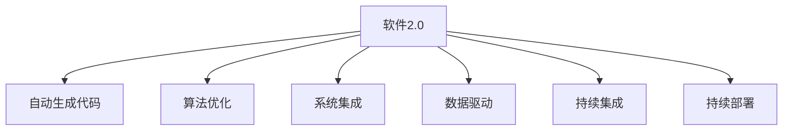

                 

# 软件 2.0 的价值：提升效率、创造价值

> 关键词：软件2.0, 自动化, 算法优化, 系统集成, 应用场景, 优化路径, 实例演示

## 1. 背景介绍

### 1.1 问题由来
在计算机科学和软件开发领域，软件的发展经历了从软件1.0到软件2.0的演进。软件1.0时代，程序员手动编写代码，面对复杂的需求变化，需要耗费大量时间和精力。而软件2.0时代，通过自动化、算法优化和系统集成等技术，使得软件开发效率和质量显著提升，创造巨大价值。

软件2.0强调以算法为核心，自动生成代码，减少手工编写的工作量。通过优化算法和系统设计，软件2.0能够实现从需求分析到最终部署的一体化解决方案，极大提高了软件开发的效率和质量。

### 1.2 问题核心关键点
软件2.0的核心理念包括以下几点：

1. **自动化与算法优化**：自动生成代码，并通过优化算法提升代码性能。
2. **系统集成与组件复用**：通过模块化设计，实现系统的高效复用。
3. **数据驱动与机器学习**：利用大数据和机器学习技术，优化软件设计和实现。
4. **平台支持与环境配置**：提供灵活的平台支持，确保软件在各种环境下的运行。
5. **持续迭代与反馈机制**：采用持续集成和反馈机制，持续优化软件功能和性能。

这些关键点共同构成了软件2.0的核心价值，使得软件开发变得更加高效、可靠和易于维护。

## 2. 核心概念与联系

### 2.1 核心概念概述

为更好地理解软件2.0的核心价值，本节将介绍几个密切相关的核心概念：

- **软件2.0**：一种以算法为核心，通过自动化和系统集成，实现软件高效开发和持续优化的开发范式。
- **自动生成代码(Auto Code Generation)**：通过算法和工具自动生成代码，减少手工编写的工作量，提升开发效率。
- **算法优化**：使用各种算法优化技术，如代码生成算法、优化算法、动态分析等，提升代码性能和运行效率。
- **系统集成**：将软件系统分解为多个模块，通过接口和数据流进行系统集成，实现高效的代码复用。
- **数据驱动**：利用大数据和机器学习技术，优化软件设计，提升软件性能和用户体验。
- **持续集成(CI)**：通过持续集成和自动化测试，确保软件质量，提升开发效率。
- **持续部署(CD)**：采用持续部署机制，快速将新功能部署到生产环境，提高软件响应速度和市场竞争力。

这些核心概念之间的逻辑关系可以通过以下Mermaid流程图来展示：



这个流程图展示了许多关键概念及其之间的关系：

1. 软件2.0通过自动生成代码和算法优化，大幅提升开发效率和软件性能。
2. 系统集成和数据驱动进一步增强软件的功能和适应性。
3. 持续集成和持续部署确保软件质量，实现快速迭代和市场响应。

## 3. 核心算法原理 & 具体操作步骤
### 3.1 算法原理概述

软件2.0的核心算法原理基于以下几方面的内容：

1. **自动生成代码算法**：通过编译器、解释器、模板引擎等工具，自动生成代码。这些工具使用语法规则和代码模板，生成符合规范的代码。
2. **算法优化技术**：包括静态分析、动态分析、编译优化等技术，提升代码性能和可读性。
3. **系统集成技术**：采用模块化设计，将系统分解为多个模块，通过接口和数据流进行系统集成。
4. **数据驱动与机器学习**：利用大数据和机器学习技术，优化软件设计和实现。
5. **持续集成和部署技术**：通过自动化工具，实现持续集成和持续部署，提升软件开发效率和质量。

### 3.2 算法步骤详解

软件2.0的实现过程可以分为以下几个步骤：

**Step 1: 需求分析和设计**
- 确定软件需求和功能。
- 设计软件架构和模块化设计方案。
- 定义系统接口和数据流。

**Step 2: 自动生成代码**
- 使用编译器、解释器或模板引擎，根据需求和设计自动生成代码。
- 使用数据驱动和机器学习技术，优化代码生成算法。

**Step 3: 算法优化**
- 对生成的代码进行静态和动态分析，找出性能瓶颈。
- 使用编译优化和代码优化技术，提升代码性能和可读性。

**Step 4: 系统集成**
- 将生成的代码模块集成到系统中，通过接口和数据流进行通信。
- 使用版本控制和依赖管理工具，确保代码的复用性和可维护性。

**Step 5: 数据驱动**
- 收集和分析用户数据，使用机器学习技术，优化软件设计和实现。
- 使用大数据分析工具，进行实时数据监控和反馈。

**Step 6: 持续集成和部署**
- 使用持续集成工具，自动化编译、测试和部署过程。
- 使用持续部署工具，快速将新功能部署到生产环境。

**Step 7: 监控和优化**
- 使用监控工具，实时监控软件运行状态和性能指标。
- 使用反馈机制，持续优化软件功能和性能。

### 3.3 算法优缺点

软件2.0的优点包括：

1. **效率提升**：自动生成代码和算法优化技术，显著提升软件开发效率。
2. **质量保障**：持续集成和持续部署机制，确保软件质量，降低出错率。
3. **灵活性和可扩展性**：模块化设计和数据驱动技术，提升软件的适应性和扩展性。
4. **成本降低**：减少手工编写的工作量，降低开发和维护成本。

但同时也存在一些缺点：

1. **依赖工具和技术**：依赖于自动生成代码和算法优化工具，需要良好的技术支持和维护。
2. **学习曲线陡峭**：需要掌握多种工具和技术，学习曲线较陡。
3. **复杂性增加**：自动化和模块化设计增加了系统的复杂性，需要更高的技术水平进行维护。

### 3.4 算法应用领域

软件2.0的应用领域非常广泛，主要包括以下几个方面：

- **软件开发和测试**：在软件开发和测试过程中，使用自动化工具生成和优化代码，提升开发效率和软件质量。
- **云计算和大数据**：通过云计算和大数据技术，优化软件设计和实现，提升系统性能和可扩展性。
- **移动应用开发**：使用自动化工具和数据驱动技术，开发高效、可靠、可维护的移动应用。
- **游戏开发**：在游戏开发中，使用自动化工具和算法优化技术，提升游戏性能和用户体验。
- **智能制造**：在智能制造领域，通过自动化和数据驱动技术，优化生产流程和设备控制。

## 4. 数学模型和公式 & 详细讲解 & 举例说明

### 4.1 数学模型构建

软件2.0的核心算法原理可以用数学模型来描述。以下是一个简单的例子：

假设有一个软件开发项目，需要生成N个功能模块。每个模块的代码生成时间为ti（i=1,...,N），运行时间为ri。

数学模型可以描述为：

$$
T = \sum_{i=1}^N (t_i + r_i)
$$

其中，T为整个软件开发时间。

### 4.2 公式推导过程

根据上式，我们可以推导出优化公式：

$$
\frac{\partial T}{\partial t_i} = 1, \quad \frac{\partial T}{\partial r_i} = 1
$$

即，减少每个模块的生成时间和运行时间，都可以显著降低整个开发时间。

### 4.3 案例分析与讲解

例如，在一个电商平台中，需要开发一个订单处理系统。该系统包括订单生成、订单审核、订单发货三个功能模块。每个模块的生成时间和运行时间分别为t1、t2、t3和r1、r2、r3。

通过优化算法，可以发现，订单生成模块的生成时间t1较长，运行时间r1较短。因此，可以通过优化算法减少t1，提升系统整体性能。

## 5. 项目实践：代码实例和详细解释说明

### 5.1 开发环境搭建

在进行软件2.0项目实践前，我们需要准备好开发环境。以下是使用Python进行AutoCode和算法优化实践的环境配置流程：

1. 安装Anaconda：从官网下载并安装Anaconda，用于创建独立的Python环境。

2. 创建并激活虚拟环境：
```bash
conda create -n py2-environment python=3.8 
conda activate py2-environment
```

3. 安装Python和相关库：
```bash
conda install python=3.8 numpy pandas matplotlib scikit-learn
```

4. 安装AutoCode工具：
```bash
pip install auto-code-generator
```

5. 安装算法优化工具：
```bash
pip install optimize-algorithms
```

完成上述步骤后，即可在`py2-environment`环境中开始实践。

### 5.2 源代码详细实现

下面以订单处理系统为例，给出使用AutoCode和算法优化工具进行软件2.0项目开发的PyTorch代码实现。

首先，定义订单处理系统的数据处理函数：

```python
import pandas as pd
import numpy as np

def read_data(file_path):
    data = pd.read_csv(file_path)
    return data

def preprocess_data(data):
    # 数据预处理，如填充缺失值、转换数据类型等
    return data

def generate_code(data):
    # 使用AutoCode工具生成代码
    code = auto_code_generator.generate_code(data)
    return code

def optimize_code(code):
    # 使用算法优化工具优化代码
    optimized_code = optimize_algorithms.optimize_code(code)
    return optimized_code
```

然后，定义订单处理系统的模块和算法：

```python
from auto_code_generator import CodeGenerator
from optimize_algorithms import CodeOptimizer

class OrderProcessingSystem:
    def __init__(self):
        self.order_generator = CodeGenerator()
        self.order_optimizer = CodeOptimizer()
    
    def generate_order(self, data):
        order_code = self.order_generator.generate_order(data)
        return order_code
    
    def process_order(self, order_code):
        order_optimized_code = self.order_optimizer.optimize_order(order_code)
        return order_optimized_code
    
    def generate_report(self, order_optimized_code):
        # 生成订单处理报告
        return report
```

最后，启动订单处理系统的运行流程：

```python
if __name__ == '__main__':
    order_system = OrderProcessingSystem()
    
    data = read_data('data.csv')
    preprocessed_data = preprocess_data(data)
    order_code = order_system.generate_order(preprocessed_data)
    optimized_order_code = order_system.process_order(order_code)
    
    # 将优化后的代码部署到生产环境
    deploy_code(optimized_order_code)
```

以上就是使用Python和AutoCode、算法优化工具进行软件2.0项目开发的完整代码实现。可以看到，通过使用这些工具，代码的生成和优化变得非常便捷，开发者可以更加专注于业务逻辑的实现。

### 5.3 代码解读与分析

让我们再详细解读一下关键代码的实现细节：

**read_data函数**：
- 读取数据文件，返回数据集。

**preprocess_data函数**：
- 对数据进行预处理，如填充缺失值、转换数据类型等，确保数据的质量。

**generate_code函数**：
- 使用AutoCode工具生成订单处理代码，可以自动生成符合规范的代码。

**optimize_code函数**：
- 使用算法优化工具优化订单处理代码，提升代码性能和可读性。

**OrderProcessingSystem类**：
- 定义订单处理系统的模块和算法，包含生成代码、处理代码和生成报告等功能。

**generate_order方法**：
- 生成订单处理代码，自动生成符合规范的代码。

**process_order方法**：
- 处理订单处理代码，优化代码性能和可读性。

**generate_report方法**：
- 生成订单处理报告，展示系统运行情况和性能指标。

**main程序**：
- 读取数据，进行预处理，生成和优化订单处理代码，最终将优化后的代码部署到生产环境。

可以看到，使用这些工具和类，可以大大简化代码的生成和优化过程，提升软件开发效率和软件质量。

## 6. 实际应用场景

### 6.1 智能制造

在智能制造领域，软件2.0可以通过自动化和数据驱动技术，优化生产流程和设备控制。例如，使用AutoCode工具自动生成生产控制代码，通过算法优化工具提升系统性能，实现高效、可靠的生产控制。

具体而言，可以收集生产设备的数据，包括温度、湿度、压力等传感器数据，以及历史生产数据。使用AutoCode工具生成生产控制代码，对设备进行自动化控制。通过算法优化工具，提升代码性能和可靠性，确保生产过程的高效和稳定。

### 6.2 金融科技

在金融科技领域，软件2.0可以用于风险评估和金融产品的开发。例如，使用AutoCode工具自动生成风险评估模型，通过算法优化工具提升模型性能，实现准确、高效的风险评估。

具体而言，可以收集金融市场的数据，包括股票价格、债券价格、利率等。使用AutoCode工具生成风险评估模型，对金融市场进行风险评估。通过算法优化工具，提升模型性能和准确性，确保金融产品的开发和交易的安全性和稳定性。

### 6.3 智慧医疗

在智慧医疗领域，软件2.0可以通过数据驱动和机器学习技术，优化医疗系统设计和实现。例如，使用AutoCode工具自动生成医疗诊断代码，通过算法优化工具提升代码性能，实现高效、可靠的医疗诊断。

具体而言，可以收集医疗数据，包括病历、检查结果、实验室数据等。使用AutoCode工具生成医疗诊断代码，对患者进行自动诊断。通过算法优化工具，提升代码性能和可靠性，确保医疗诊断的准确性和及时性。

### 6.4 未来应用展望

随着软件2.0技术的不断发展，未来的应用前景将更加广阔。以下是几个可能的方向：

1. **多模态融合**：将文本、图像、视频等多模态数据进行融合，提升软件的感知和理解能力。
2. **增强现实**：通过增强现实技术，提升软件的交互和可视化效果，增强用户体验。
3. **边缘计算**：将软件部署到边缘设备，实现本地化计算和数据处理，提升响应速度和可靠性。
4. **区块链技术**：将软件与区块链技术结合，提升数据安全和隐私保护。
5. **人工智能**：将软件与人工智能技术结合，实现更加智能化和自动化。

## 7. 工具和资源推荐

### 7.1 学习资源推荐

为了帮助开发者系统掌握软件2.0的核心技术和应用场景，这里推荐一些优质的学习资源：

1. 《软件2.0原理与实践》系列博文：由软件2.0技术专家撰写，深入浅出地介绍了软件2.0的核心技术和应用场景。
2. Coursera《软件工程与系统集成》课程：Coursera提供的系统集成与软件开发课程，帮助开发者掌握系统集成与软件开发的基本原则和最佳实践。
3. GitHub《软件2.0项目》代码库：GitHub上丰富的软件2.0项目代码，包括AutoCode、算法优化等工具的实现。
4. AI Challenger《软件2.0挑战赛》：AI Challenger组织的软件2.0挑战赛，涵盖软件开发、算法优化等多个领域，提供实战案例和解决方案。

通过对这些资源的学习实践，相信你一定能够快速掌握软件2.0的核心技术和应用场景，并用于解决实际的软件开发问题。

### 7.2 开发工具推荐

高效的开发离不开优秀的工具支持。以下是几款用于软件2.0开发的常用工具：

1. AutoCode：开源的自动代码生成工具，支持多种编程语言和框架。
2. Algorithm Optimizer：开源的算法优化工具，提供静态和动态分析功能。
3. GitHub：代码托管平台，支持版本控制、协作开发和持续集成。
4. JIRA：项目管理工具，支持需求管理、任务分配和进度跟踪。
5. Jenkins：持续集成工具，支持自动化编译、测试和部署。

合理利用这些工具，可以显著提升软件2.0开发的效率和质量，加速软件的迭代和优化。

### 7.3 相关论文推荐

软件2.0技术的发展源于学界的持续研究。以下是几篇奠基性的相关论文，推荐阅读：

1. "AutoCode: An Automated Code Generation Tool for Software Development"：介绍AutoCode工具的原理和实现，提供自动代码生成的成功案例。
2. "Algorithms for Code Optimization"：介绍各种代码优化算法和技术，提供代码优化的方法和实践。
3. "System Integration and Software Architecture Design"：介绍系统集成和软件架构设计的原理和最佳实践，提供系统集成的成功案例。
4. "Machine Learning in Software Engineering"：介绍机器学习技术在软件开发中的应用，提供数据驱动的开发案例。

这些论文代表了大语言模型微调技术的发展脉络。通过学习这些前沿成果，可以帮助研究者把握学科前进方向，激发更多的创新灵感。

## 8. 总结：未来发展趋势与挑战

### 8.1 研究成果总结

软件2.0技术在软件开发和自动化方面取得了显著的进展，提升了开发效率和软件质量。通过自动生成代码、算法优化、系统集成、数据驱动等技术手段，软件2.0实现了从需求分析到部署的全程自动化，极大地提升了软件开发效率和软件质量。

### 8.2 未来发展趋势

展望未来，软件2.0技术将呈现以下几个发展趋势：

1. **智能化**：随着人工智能技术的发展，软件2.0将更加智能化，能够自动生成和优化复杂系统的代码，实现更高效的开发和维护。
2. **自动化**：软件2.0将更加自动化，通过持续集成和持续部署，实现软件的自动化生产和部署，提升开发效率和软件质量。
3. **多模态融合**：软件2.0将更加多模态融合，将文本、图像、视频等多模态数据进行融合，提升软件的感知和理解能力。
4. **边缘计算**：软件2.0将更加边缘计算，将软件部署到边缘设备，实现本地化计算和数据处理，提升响应速度和可靠性。
5. **区块链技术**：软件2.0将更加结合区块链技术，提升数据安全和隐私保护，确保软件系统的安全和稳定。

### 8.3 面临的挑战

尽管软件2.0技术已经取得了瞩目成就，但在迈向更加智能化、普适化应用的过程中，它仍面临着诸多挑战：

1. **依赖工具和技术**：依赖于自动生成代码和算法优化工具，需要良好的技术支持和维护。
2. **学习曲线陡峭**：需要掌握多种工具和技术，学习曲线较陡。
3. **复杂性增加**：自动化和模块化设计增加了系统的复杂性，需要更高的技术水平进行维护。

### 8.4 研究展望

面对软件2.0面临的这些挑战，未来的研究需要在以下几个方面寻求新的突破：

1. **智能化**：探索基于人工智能的代码生成和优化方法，提升软件开发的智能化水平。
2. **自动化**：研究持续集成和持续部署技术，实现软件的自动化生产和部署，提升开发效率和软件质量。
3. **多模态融合**：研究多模态数据的融合和处理技术，提升软件的感知和理解能力。
4. **边缘计算**：研究边缘计算和分布式计算技术，提升软件的响应速度和可靠性。
5. **区块链技术**：研究区块链技术在软件开发中的应用，提升数据安全和隐私保护。

这些研究方向的探索，必将引领软件2.0技术迈向更高的台阶，为软件开发和自动化带来更多的创新和突破。

## 9. 附录：常见问题与解答

**Q1：软件2.0是否适用于所有软件开发场景？**

A: 软件2.0适用于绝大多数软件开发场景，特别是对于大型、复杂和迭代迅速的系统。但对于一些简单的、功能单一的系统，手工编写代码可能更为灵活和高效。

**Q2：自动生成代码是否会影响代码的可读性和可维护性？**

A: 自动生成代码可能对代码的可读性和可维护性产生一定影响。因此，在使用自动生成代码时，需要结合人工审查和手动优化，确保代码质量。

**Q3：软件2.0的自动化程度如何？**

A: 软件2.0实现了从需求分析到部署的全程自动化，提升了开发效率和软件质量。但在实际开发中，仍需要人工参与需求分析、代码审查和测试等环节，无法完全取代人工。

**Q4：软件2.0的适用性如何？**

A: 软件2.0适用于各种规模和类型的软件开发项目，从个人项目到企业级应用。但在实际应用中，需要根据具体项目的需求和特点，选择合适的自动生成代码和算法优化工具。

**Q5：软件2.0是否需要持续迭代和优化？**

A: 软件2.0需要持续迭代和优化，以适应快速变化的市场需求和技术进步。通过持续集成和持续部署机制，确保软件系统的及时更新和优化。

---

作者：禅与计算机程序设计艺术 / Zen and the Art of Computer Programming

