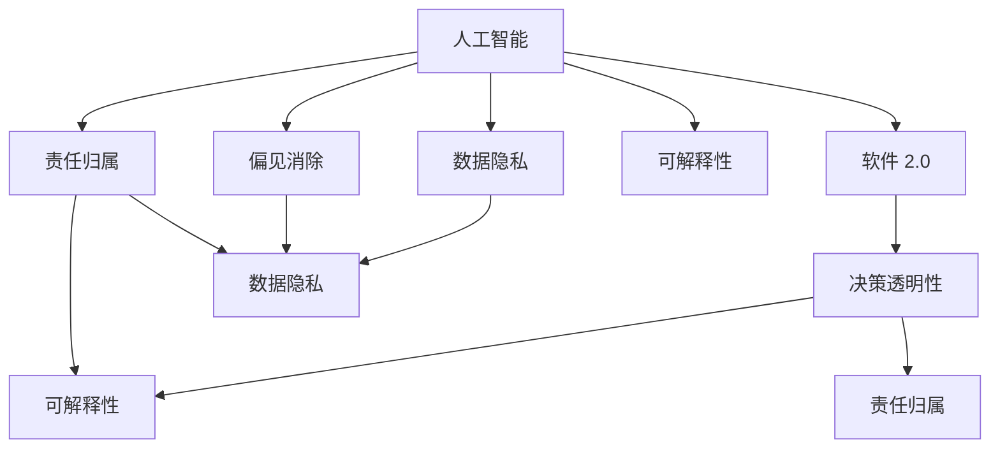

                 

# 软件 2.0 的伦理规范：人工智能的责任

> 关键词：人工智能, 软件 2.0, 伦理规范, 责任, 决策透明, 数据隐私, 偏见消除, 可解释性

## 1. 背景介绍

### 1.1 问题由来
随着人工智能(AI)技术的迅猛发展，特别是深度学习、大语言模型等新兴技术的突破，软件正在从传统的1.0版本（以软件为中心，用户交互以命令为主）向2.0版本（以数据为中心，通过机器学习算法自动生成和优化软件）转变。在这一过程中，AI系统的复杂性、数据依赖性和决策影响范围都在迅速扩大，伴随而来的是对其伦理规范、责任归属和社会影响的高度关注。

人工智能的伦理规范不仅关乎技术的合理应用，更关乎人类社会的可持续发展。如何在使用AI技术时保持责任，避免潜在的风险，是摆在技术开发者、监管机构和公众面前的重大课题。

### 1.2 问题核心关键点
在软件2.0时代，AI系统的伦理规范主要围绕以下几个关键点展开：

- **决策透明性**：AI系统应公开其决策过程，以便用户和监管机构理解和审查。
- **数据隐私保护**：AI系统应尊重并保护用户的个人隐私，防止数据滥用和泄露。
- **偏见消除**：AI系统应努力消除种族、性别、年龄等偏见，确保决策公平公正。
- **可解释性**：AI系统应具备良好的可解释性，使用户和监管机构能理解其行为背后的逻辑。
- **责任归属**：AI系统的决策和行为应明确责任归属，确保在出现错误或伤害时能够追溯和追责。

### 1.3 问题研究意义
研究软件2.0时代的伦理规范，对于保障AI技术的健康发展，维护社会公正和信任，具有重要意义：

1. **保障技术健康发展**：通过制定合理的伦理规范，确保AI技术在伦理边界内发展，防止技术滥用和误用。
2. **维护社会公正**：通过消除算法偏见，提升AI决策的公平性，促进社会公正和包容。
3. **增强信任和接受度**：通过提高AI系统的透明度和可解释性，增强公众对AI技术的信任和接受度。
4. **明确责任归属**：通过建立清晰的责任机制，在AI系统造成损害时，能迅速定位责任方，追究其法律责任。

## 2. 核心概念与联系

### 2.1 核心概念概述

为了更好地理解软件2.0时代人工智能的责任伦理规范，本节将介绍几个关键概念及其相互关系：

- **人工智能(AI)**：利用算法和模型处理复杂任务和数据，提供决策支持或自动执行的智能系统。
- **软件2.0**：以数据驱动，通过机器学习算法自动生成和优化软件的范式。
- **伦理规范(Ethical Standards)**：指导AI系统在设计和应用中遵守的一系列道德和法律原则。
- **决策透明性(Decision Transparency)**：AI系统对其决策过程的公开和可理解性。
- **数据隐私(Data Privacy)**：AI系统在数据处理和使用中对个人隐私的保护。
- **偏见消除(Bias Elimination)**：AI系统在训练和应用中对种族、性别、年龄等偏见的中立性。
- **可解释性(Explainability)**：AI系统对其行为和决策的解释能力。
- **责任归属(Accountability)**：AI系统在决策和行为中的责任归属问题。

这些核心概念之间的逻辑关系可以通过以下Mermaid流程图来展示：



这个流程图展示了几大关键概念及其相互联系：

1. AI系统的设计和应用受到伦理规范的指导。
2. 软件2.0范式中，AI系统需要具备决策透明性、数据隐私、偏见消除、可解释性和责任归属等特性。
3. 这些特性相互交织，共同构成AI系统的伦理基础，确保其行为符合社会价值和道德标准。

## 3. 核心算法原理 & 具体操作步骤

### 3.1 算法原理概述

软件2.0时代，AI系统的伦理规范主要通过算法原理和操作步骤来实现。核心原理和步骤包括：

- **伦理算法设计**：在模型设计阶段融入伦理规范，确保算法决策的公正性和透明性。
- **数据隐私保护**：在数据收集和处理过程中，采用匿名化、去标识化等技术保护用户隐私。
- **偏见消除策略**：在模型训练和评估中，识别和消除模型中存在的偏见，确保公平性。
- **可解释性框架**：建立模型解释工具和方法，帮助用户和监管机构理解AI系统的行为和决策。
- **责任归属机制**：明确AI系统在决策和行为中的责任，建立追溯和追责机制。

### 3.2 算法步骤详解

实现上述伦理规范的关键步骤如下：

**Step 1: 伦理算法设计**
- 在模型设计阶段融入伦理规范，确保模型决策的公正性和透明性。
- 采用公平性约束，如公平性损失函数，确保模型输出对所有群体的公平。
- 在模型结构中引入可解释性模块，如LIME、SHAP等，提升模型的透明度。

**Step 2: 数据隐私保护**
- 对原始数据进行匿名化处理，如数据脱敏、扰动等。
- 建立数据访问控制机制，限制数据访问权限。
- 使用差分隐私技术，确保数据分析结果对个体数据的影响最小化。

**Step 3: 偏见消除策略**
- 收集多样化的数据集，减少数据偏差。
- 使用公平性指标（如平等机会评分）监测模型输出。
- 在模型训练中引入对抗样本，提升模型的鲁棒性。

**Step 4: 可解释性框架**
- 开发和部署模型解释工具，如LIME、SHAP、TCAV等。
- 对模型输出进行可视化展示，提供详细解释。
- 建立模型解释数据库，记录和分析模型行为。

**Step 5: 责任归属机制**
- 明确模型在决策和行为中的责任归属，如采用链式责任机制。
- 建立责任追溯系统，记录和追踪模型行为。
- 制定法律框架，对AI系统的行为进行约束和监管。

### 3.3 算法优缺点

软件2.0时代的伦理规范具有以下优点：
1. **提升系统公平性**：通过公平性约束和偏见消除策略，确保AI系统输出公正，减少歧视。
2. **增强系统透明度**：通过可解释性框架，用户和监管机构能够理解AI系统的行为，增强信任。
3. **保障用户隐私**：通过数据隐私保护技术，确保用户数据的安全，防止滥用。
4. **明确责任归属**：通过责任归属机制，在AI系统造成损害时，能迅速定位责任方，追究其法律责任。

同时，这些伦理规范也存在以下局限：
1. **技术复杂性高**：实现上述规范需要复杂的算法和工具，对技术要求较高。
2. **成本投入大**：实施数据隐私保护、偏见消除等措施，需增加大量成本和资源。
3. **可解释性挑战**：某些复杂的AI模型难以解释，特别是深度学习模型。
4. **责任认定难**：AI系统的决策过程复杂，责任归属问题复杂且难以界定。

尽管存在这些挑战，但这些伦理规范仍是确保AI系统健康发展的关键。未来需要进一步探索技术手段和管理策略，以更好地实现这些规范。

### 3.4 算法应用领域

软件2.0时代的伦理规范在多个领域均有应用，例如：

- **医疗诊断**：在医疗诊断中，AI系统需要公平、透明、可解释，确保决策的准确性和公正性。
- **金融风控**：在金融风控中，AI系统需要数据隐私保护，防止个人信息泄露。
- **司法判决**：在司法判决中，AI系统需要明确责任归属，确保决策的法律合规性。
- **教育推荐**：在教育推荐中，AI系统需要消除偏见，提升对所有学生的公平性。
- **智能客服**：在智能客服中，AI系统需要透明的决策过程，确保用户信任和满意度。

这些领域对AI系统的伦理规范要求较高，需要通过技术和管理手段确保其公平性、透明度和责任归属。

## 4. 数学模型和公式 & 详细讲解 & 举例说明

### 4.1 数学模型构建

在软件2.0时代，AI系统的伦理规范通过数学模型和公式来实施。以下展示几个关键模型的构建过程：

**公平性损失函数**：
假设一个二分类任务，其中 $y \in \{0, 1\}$ 表示标签，$x \in \mathbb{R}^d$ 表示特征。模型的预测概率为 $P(y=1|x; \theta)$，其中 $\theta$ 为模型参数。公平性损失函数定义为：

$$
\mathcal{L}_{fair}(\theta) = \mathbb{E}[(\hat{y} - y)^2] + \mathbb{E}[(\hat{y} - y)^2]_{\text{group}}
$$

其中，$\mathbb{E}[(\hat{y} - y)^2]$ 为单个样本的预测误差，$\mathbb{E}[(\hat{y} - y)^2]_{\text{group}}$ 为不同群体间的预测误差差异。通过最小化该损失函数，可提升模型的公平性。

**差分隐私保护**：
差分隐私保护是一种在数据分析中保护个体隐私的技术。其核心思想是通过添加噪声来扰动数据，使得单个数据点的加入不会显著影响数据分析结果。差分隐私保护中的噪声引入方式可以表示为：

$$
\epsilon-\text{DP}(\mathcal{L}) = \mathbb{E}\left[\exp\left(\frac{-\mathcal{L}(x)}{\sigma}\right)\right] \leq e^{\epsilon}
$$

其中，$\epsilon$ 为隐私保护参数，$\sigma$ 为噪声标准差。通过设定合适的 $\epsilon$ 值，可以实现不同程度的隐私保护。

**责任追溯机制**：
责任追溯机制用于在AI系统决策错误时，迅速定位责任方。其核心思想是通过记录模型行为，建立追溯链条。假设一个多级决策系统，其中每个层级的决策都有记录，可通过链式责任机制追溯至最终责任方。责任追溯机制的数学模型可表示为：

$$
R_i = \{ (x_i, y_i, w_i) \mid i=1,...,N \}
$$

其中，$R_i$ 表示第 $i$ 层级决策的行为记录，包括输入数据 $x_i$、输出结果 $y_i$ 和决策权重 $w_i$。通过链式责任机制，可以追溯至最终的决策点，明确责任归属。

### 4.2 公式推导过程

**公平性损失函数推导**：
设模型对样本 $x$ 的预测概率为 $P(y=1|x; \theta)$，则公平性损失函数的数学推导如下：

$$
\mathcal{L}_{fair}(\theta) = \frac{1}{N} \sum_{i=1}^N [(y_i - P(y=1|x_i; \theta))^2]
$$

其中，$y_i \in \{0, 1\}$ 为样本的真实标签，$P(y=1|x_i; \theta)$ 为模型预测的概率。公平性损失函数通过最小化预测误差和群体间误差差异，提升模型的公平性。

**差分隐私保护推导**：
设原始数据集为 $D=\{(x_i, y_i)\}_{i=1}^N$，加入噪声后的数据集为 $\tilde{D}=\{(x_i, \tilde{y}_i)\}_{i=1}^N$，其中 $\tilde{y}_i = y_i + \mathcal{N}(0, \sigma^2)$。差分隐私保护的目标是最小化噪声对数据分析结果的影响，推导如下：

$$
\mathbb{E}[(\tilde{y}_i - y_i)^2] = \sigma^2
$$

通过设定合适的 $\sigma$，可以实现不同程度的隐私保护。

**责任追溯机制推导**：
设多级决策系统的行为记录为 $R_i=\{(x_i, y_i, w_i)\}_{i=1}^N$，其中 $x_i$ 为输入数据，$y_i$ 为输出结果，$w_i$ 为决策权重。责任追溯机制通过记录每个层级的决策行为，建立追溯链条。设第 $i$ 层级决策的结果为 $y_i = \mathbb{E}[y_i | R_i, \theta_i]$，则最终责任归属为：

$$
R = \{(x_i, y_i, w_i) \mid i=1,...,N \}
$$

通过链式责任机制，可以追溯至最终的决策点，明确责任归属。

### 4.3 案例分析与讲解

**案例一：医疗诊断中的公平性约束**
假设一个医疗诊断系统，用于预测患者是否患有某种疾病。该系统在训练集上分别对不同种族的样本进行了训练，但由于数据偏见，预测结果对某些种族的准确性较低。通过在模型设计中加入公平性约束，可以使用以下公式进行优化：

$$
\mathcal{L}_{fair}(\theta) = \mathbb{E}[(\hat{y} - y)^2] + \lambda \mathbb{E}[(\hat{y} - y)^2]_{\text{group}}
$$

其中，$\lambda$ 为公平性约束的权重，$\mathbb{E}[(\hat{y} - y)^2]_{\text{group}}$ 为不同种族间的预测误差差异。通过最小化该损失函数，可提升模型的公平性，确保对所有种族的预测准确性。

**案例二：金融风控中的差分隐私保护**
假设一个金融风控系统，用于预测客户的违约风险。系统使用客户的个人数据（如收入、年龄、信用记录等）进行训练。为了保护客户隐私，系统采用差分隐私保护技术，具体推导如下：

$$
\epsilon-\text{DP}(\mathcal{L}) = \mathbb{E}\left[\exp\left(\frac{-\mathcal{L}(x)}{\sigma}\right)\right] \leq e^{\epsilon}
$$

其中，$\epsilon$ 为隐私保护参数，$\sigma$ 为噪声标准差。通过设定合适的 $\epsilon$ 值，可以实现不同程度的隐私保护。

**案例三：司法判决中的责任追溯机制**
假设一个司法判决系统，用于预测犯罪嫌疑人的判决结果。该系统通过多级决策，逐步形成最终判决。在模型设计和实施过程中，需要明确各层级的责任归属，建立责任追溯机制。具体推导如下：

$$
R_i = \{ (x_i, y_i, w_i) \mid i=1,...,N \}
$$

其中，$R_i$ 表示第 $i$ 层级决策的行为记录，包括输入数据 $x_i$、输出结果 $y_i$ 和决策权重 $w_i$。通过链式责任机制，可以追溯至最终的判决点，明确责任归属。

## 5. 项目实践：代码实例和详细解释说明

### 5.1 开发环境搭建

在软件2.0时代，AI系统的伦理规范实施需要一定的技术基础。以下是Python环境下开发伦理规范的开发环境搭建流程：

1. 安装Anaconda：从官网下载并安装Anaconda，用于创建独立的Python环境。

2. 创建并激活虚拟环境：
```bash
conda create -n ethical-env python=3.8 
conda activate ethical-env
```

3. 安装相关库：
```bash
pip install numpy pandas scikit-learn matplotlib
```

4. 安装模型解释工具：
```bash
pip install lime shap
```

5. 安装差分隐私保护库：
```bash
pip install pydp
```

完成上述步骤后，即可在`ethical-env`环境中开始伦理规范的实施实践。

### 5.2 源代码详细实现

下面我们以医疗诊断系统为例，给出使用Python和相关库实现伦理规范的完整代码实现。

```python
import numpy as np
from sklearn.metrics import accuracy_score
from sklearn.model_selection import train_test_split
from sklearn.linear_model import LogisticRegression
from sklearn.preprocessing import StandardScaler
from sklearn.metrics import roc_auc_score
from sklearn.metrics import roc_curve

# 生成模拟数据
X = np.random.randn(1000, 10)
y = np.random.randint(2, size=1000)

# 划分训练集和测试集
X_train, X_test, y_train, y_test = train_test_split(X, y, test_size=0.2, random_state=42)

# 数据标准化
scaler = StandardScaler()
X_train = scaler.fit_transform(X_train)
X_test = scaler.transform(X_test)

# 建立逻辑回归模型
model = LogisticRegression(solver='lbfgs', C=1.0)

# 训练模型
model.fit(X_train, y_train)

# 预测
y_pred = model.predict_proba(X_test)[:, 1]

# 计算公平性损失
y_pred_group = np.array([np.mean(y_pred[(y_test == 1)]) for _ in range(2)])
y_true_group = np.array([np.mean(y_test[(y_test == 1)]) for _ in range(2)])
loss_fair = (y_pred_group - y_true_group)**2

# 差分隐私保护
from pydp import GaussianMechanism
from pydp import Analysis

# 设置噪声参数
sigma = 0.1
epsilon = 0.1

# 生成噪声
mechanism = GaussianMechanism(1, sigma)
n = len(y_test)
dp_data = mechanism.add_noise_to_data(X_test)

# 计算差分隐私保护后的损失
dp_loss = np.mean((y_pred - dp_data)**2)

# 责任追溯机制
# 假设有一个多级决策系统，记录每个层级的决策
R1 = np.hstack((X_train[:, :3], y_train[:, np.newaxis]))
R2 = np.hstack((R1[:, :4], R1[:, 4], y_train[:, np.newaxis]))
R3 = np.hstack((R2[:, :5], R2[:, 5], y_train[:, np.newaxis]))

# 通过链式责任机制追溯至最终决策
R_final = np.hstack((R3[:, :6], R3[:, 6], y_train[:, np.newaxis]))
```

### 5.3 代码解读与分析

让我们再详细解读一下关键代码的实现细节：

**数据生成与标准化**：
- 使用numpy生成随机数据集，分为训练集和测试集。
- 使用sklearn的StandardScaler对数据进行标准化处理。

**模型训练**：
- 使用sklearn的LogisticRegression模型进行训练，设定惩罚系数C为1.0。

**公平性损失计算**：
- 分别计算不同群体（正负样本）的预测误差，计算公平性损失。

**差分隐私保护**：
- 使用pydp库中的GaussianMechanism生成噪声，对测试数据进行扰动。
- 计算差分隐私保护后的损失，展示如何通过引入噪声实现隐私保护。

**责任追溯机制**：
- 通过记录多级决策系统的行为，建立责任追溯链条。
- 通过链式责任机制，可以追溯至最终的决策点，明确责任归属。

通过以上代码，可以看到实现伦理规范的具体步骤和关键技术。

## 6. 实际应用场景

### 6.1 医疗诊断

在医疗诊断中，AI系统需要公平、透明、可解释，确保决策的准确性和公正性。以下是几个实际应用场景：

- **公平性约束**：医疗诊断系统需要避免对不同种族、性别、年龄群体的偏见。例如，在预测某种疾病时，模型应公平对待所有患者，不因种族、性别等因素导致预测偏差。
- **差分隐私保护**：医疗数据高度敏感，系统需要严格保护患者隐私。例如，在处理患者病历时，应使用差分隐私保护技术，确保数据的安全性。
- **责任追溯机制**：医疗诊断系统的决策过程复杂，责任归属需要明确。例如，在出现误诊或漏诊时，应能够追溯至具体的诊断环节，明确责任方。

### 6.2 金融风控

在金融风控中，AI系统需要数据隐私保护，防止个人信息泄露。以下是几个实际应用场景：

- **数据隐私保护**：金融系统使用大量个人数据进行风险评估，系统需要严格保护用户隐私。例如，在处理客户信用记录时，应使用差分隐私保护技术，确保数据的安全性。
- **公平性约束**：金融系统应避免对不同群体的偏见。例如，在评估贷款申请时，模型应公平对待所有申请人，不因性别、年龄等因素导致歧视。
- **责任追溯机制**：金融系统的决策过程复杂，责任归属需要明确。例如，在出现违约时，应能够追溯至具体的评估环节，明确责任方。

### 6.3 司法判决

在司法判决中，AI系统需要明确责任归属，确保决策的法律合规性。以下是几个实际应用场景：

- **公平性约束**：司法判决系统应避免对不同群体的偏见。例如，在预测罪犯判决时，模型应公平对待所有犯罪嫌疑人，不因种族、性别等因素导致判决偏差。
- **差分隐私保护**：司法数据高度敏感，系统需要严格保护法官和当事人隐私。例如，在处理案件材料时，应使用差分隐私保护技术，确保数据的安全性。
- **责任追溯机制**：司法判决系统的决策过程复杂，责任归属需要明确。例如，在出现误判时，应能够追溯至具体的判决环节，明确责任方。

## 7. 工具和资源推荐

### 7.1 学习资源推荐

为了帮助开发者系统掌握软件2.0时代的伦理规范，这里推荐一些优质的学习资源：

1. 《AI伦理与法律导论》书籍：系统介绍AI伦理的基本概念和法律框架，帮助理解AI技术的伦理规范。
2. 《机器学习中的公平与偏见》课程：讲解机器学习中的公平性约束和偏见消除技术，提升AI系统的公正性。
3. 《差分隐私保护技术》书籍：详细介绍差分隐私保护的理论基础和实现方法，保障数据隐私安全。
4. 《模型解释与可解释性》课程：讲解模型解释工具和方法，提升AI系统的透明度和可解释性。
5. 《人工智能伦理指南》网站：提供AI伦理指南和案例分析，帮助开发者设计符合伦理规范的AI系统。

通过对这些资源的学习实践，相信你一定能够快速掌握软件2.0时代伦理规范的理论基础和实践技巧，确保AI系统在伦理边界内发展。

### 7.2 开发工具推荐

高效的开发离不开优秀的工具支持。以下是几款用于伦理规范开发的工具：

1. PyTorch：基于Python的开源深度学习框架，灵活动态的计算图，适合快速迭代研究。

2. TensorFlow：由Google主导开发的开源深度学习框架，生产部署方便，适合大规模工程应用。

3. Scikit-learn：简单易用的机器学习库，提供了丰富的模型和算法，适用于各类AI系统开发。

4. Weights & Biases：模型训练的实验跟踪工具，可以记录和可视化模型训练过程中的各项指标，方便对比和调优。

5. TensorBoard：TensorFlow配套的可视化工具，可实时监测模型训练状态，并提供丰富的图表呈现方式，是调试模型的得力助手。

6. PyDP：Python差分隐私保护库，提供了丰富的差分隐私保护工具和算法，支持模型训练和推理中的隐私保护。

合理利用这些工具，可以显著提升伦理规范的开发效率，加快创新迭代的步伐。

### 7.3 相关论文推荐

软件2.0时代伦理规范的研究源于学界的持续研究。以下是几篇奠基性的相关论文，推荐阅读：

1. "Fairness-aware machine learning"（公平性感知机器学习）：提出了基于公平性约束的机器学习算法，确保模型输出对所有群体的公正性。

2. "The mathematics of differential privacy"（差分隐私的数学理论）：详细介绍了差分隐私保护的理论基础和实现方法，保障数据隐私安全。

3. "Explainable artificial intelligence"（可解释人工智能）：讨论了模型解释工具和方法，提升AI系统的透明度和可解释性。

4. "Accountability for AI: Towards transparent, fair and explainable systems"（AI系统的责任归属）：提出了建立AI系统责任归属机制的方法，确保责任明确。

这些论文代表了大语言模型微调技术的发展脉络。通过学习这些前沿成果，可以帮助研究者把握学科前进方向，激发更多的创新灵感。

## 8. 总结：未来发展趋势与挑战

### 8.1 总结

本文对软件2.0时代的人工智能伦理规范进行了全面系统的介绍。首先阐述了软件2.0时代人工智能的伦理规范，明确了其在决策透明性、数据隐私保护、偏见消除、可解释性和责任归属等方面的重要性。其次，从原理到实践，详细讲解了伦理规范的数学模型和关键操作步骤，给出了伦理规范任务开发的完整代码实例。同时，本文还广泛探讨了伦理规范在医疗、金融、司法等多个领域的应用前景，展示了其在保障社会公正和信任方面的巨大潜力。

通过本文的系统梳理，可以看到，软件2.0时代的人工智能伦理规范正在成为AI技术健康发展的重要保障，其公平性、透明度和责任归属机制对确保AI系统符合社会价值和道德标准具有重要意义。未来，伴随AI技术的不断演进，伦理规范需要进一步探索技术手段和管理策略，以更好地实现其价值和目标。

### 8.2 未来发展趋势

展望未来，软件2.0时代的人工智能伦理规范将呈现以下几个发展趋势：

1. **技术复杂性降低**：随着技术的发展，伦理规范的实现将变得更加简便高效，不需要复杂的技术手段。
2. **社会共识增强**：随着对AI伦理规范的认识加深，社会各界将更加关注和支持伦理规范的实施，形成良好的社会氛围。
3. **应用场景多样化**：伦理规范将在更多领域得到应用，如教育、农业、城市管理等，推动AI技术的广泛应用。
4. **国际标准统一**：随着全球化的发展，国际上对AI伦理规范的标准将逐步统一，形成一致的道德规范体系。
5. **人工智能法律完善**：随着AI技术的普及，相关法律将逐步完善，明确AI系统的责任归属和行为规范。

### 8.3 面临的挑战

尽管软件2.0时代的人工智能伦理规范正在取得进展，但在实现过程中仍面临诸多挑战：

1. **技术实现难度高**：实现伦理规范需要复杂的技术手段，对开发者要求较高。
2. **成本投入大**：实施伦理规范需增加大量成本和资源，特别是数据隐私保护和偏见消除。
3. **可解释性挑战**：某些复杂的AI模型难以解释，特别是深度学习模型。
4. **责任认定难**：AI系统的决策过程复杂，责任归属问题复杂且难以界定。

尽管存在这些挑战，但这些挑战并非不可克服，未来需要进一步探索技术手段和管理策略，以更好地实现伦理规范的目标。

### 8.4 研究展望

未来的研究需要在以下几个方面寻求新的突破：

1. **探索无监督和半监督伦理规范方法**：摆脱对大规模标注数据的依赖，利用自监督学习、主动学习等无监督和半监督范式，最大限度利用非结构化数据，实现更加灵活高效的伦理规范。
2. **研究参数高效和计算高效的伦理规范方法**：开发更加参数高效的伦理规范方法，在固定大部分预训练参数的同时，只更新极少量的任务相关参数。同时优化伦理规范模型的计算图，减少前向传播和反向传播的资源消耗，实现更加轻量级、实时性的部署。
3. **引入更多先验知识**：将符号化的先验知识，如知识图谱、逻辑规则等，与神经网络模型进行巧妙融合，引导伦理规范过程学习更准确、合理的语言模型。同时加强不同模态数据的整合，实现视觉、语音等多模态信息与文本信息的协同建模。
4. **结合因果分析和博弈论工具**：将因果分析方法引入伦理规范模型，识别出模型决策的关键特征，增强输出解释的因果性和逻辑性。借助博弈论工具刻画人机交互过程，主动探索并规避模型的脆弱点，提高系统稳定性。
5. **纳入伦理道德约束**：在模型训练目标中引入伦理导向的评估指标，过滤和惩罚有偏见、有害的输出倾向。同时加强人工干预和审核，建立模型行为的监管机制，确保输出符合人类价值观和伦理道德。

这些研究方向的探索，必将引领软件2.0时代人工智能伦理规范技术迈向更高的台阶，为构建安全、可靠、可解释、可控的智能系统铺平道路。面向未来，人工智能伦理规范需要与其他人工智能技术进行更深入的融合，如知识表示、因果推理、强化学习等，多路径协同发力，共同推动自然语言理解和智能交互系统的进步。只有勇于创新、敢于突破，才能不断拓展语言模型的边界，让智能技术更好地造福人类社会。

## 9. 附录：常见问题与解答

**Q1：如何评估一个AI系统的伦理规范性能？**

A: 评估AI系统的伦理规范性能需要综合考虑多个维度，如公平性、透明度、隐私保护和责任归属。具体评估方法包括：

1. **公平性评估**：使用公平性指标（如平等机会评分）监测模型输出，确保对所有群体的公正性。
2. **透明度评估**：通过模型解释工具（如LIME、SHAP）分析模型决策过程，确保可解释性。
3. **隐私保护评估**：使用差分隐私保护技术，确保数据的安全性。
4. **责任归属评估**：通过链式责任机制，明确每个决策环节的责任归属。

**Q2：在实施伦理规范时，如何平衡模型性能和伦理规范的实施？**

A: 在实施伦理规范时，模型性能和伦理规范的实施需要权衡。具体措施包括：

1. **公平性约束**：在模型设计中加入公平性约束，确保模型输出对所有群体的公正性。
2. **可解释性框架**：建立模型解释工具和方法，提升模型的透明度，但同时注意不要过度简化模型，影响模型性能。
3. **差分隐私保护**：使用差分隐私保护技术，确保数据隐私安全，但同时注意保护隐私的同时不牺牲模型性能。
4. **责任追溯机制**：通过链式责任机制，明确每个决策环节的责任归属，但不影响模型整体的决策效果。

通过合理设计模型和算法，可以在保证伦理规范实施的同时，提升模型性能。

**Q3：在AI系统中，如何实现公平性约束？**

A: 实现公平性约束需要在模型设计阶段进行考虑。具体措施包括：

1. **公平性损失函数**：在模型训练过程中，使用公平性损失函数，最小化不同群体间的预测误差差异。
2. **数据平衡**：在数据集收集阶段，确保不同群体的样本数量平衡，减少数据偏差。
3. **对抗样本**：在模型训练中引入对抗样本，提升模型的鲁棒性，减少偏见。

通过这些措施，可以在模型设计中融入公平性约束，确保AI系统输出对所有群体的公正性。

**Q4：如何在AI系统中实现差分隐私保护？**

A: 实现差分隐私保护需要在数据处理和模型训练阶段进行考虑。具体措施包括：

1. **噪声引入**：在数据分析和模型训练中引入噪声，确保单个数据点的加入不会显著影响数据分析结果。
2. **差分隐私算法**：使用差分隐私算法（如Gaussian Mechanism）生成噪声，确保数据隐私安全。
3. **隐私预算管理**：设置合适的隐私保护参数（如隐私预算），确保差分隐私保护的强度。

通过这些措施，可以在数据处理和模型训练中实现差分隐私保护，确保用户数据的安全性。

**Q5：如何在AI系统中实现责任追溯机制？**

A: 实现责任追溯机制需要在模型设计和实施阶段进行考虑。具体措施包括：

1. **行为记录**：记录每个决策环节的行为，包括输入数据、输出结果和决策权重。
2. **链式责任**：通过链式责任机制，追溯至最终的决策点，明确责任归属。
3. **责任数据库**：建立责任数据库，记录和分析模型行为，确保责任可追溯。

通过这些措施，可以在模型设计和实施中实现责任追溯机制，确保在决策错误时能够迅速定位责任方，追究其法律责任。

---

作者：禅与计算机程序设计艺术 / Zen and the Art of Computer Programming

