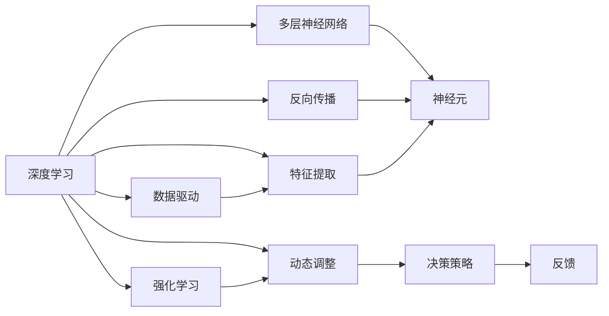

                 

## 1. 背景介绍

软件行业的发展一直是科技创新的引擎，伴随着计算能力、存储技术、网络通信等基础设施的不断进步，软件应用已从早期的静态程序执行，逐步演变为今天动态、智能、交互式的大数据应用。在众多前沿技术中，深度学习和强化学习作为两个重要的驱动因素，已经深刻改变了软件生态的结构和运作方式，引领着未来软件的发展趋势。

### 1.1 发展历史
软件行业的早期，开发者主要面对的是相对固定的业务需求，编写静态的、功能单一的程序。随着时间的推移，计算机硬件和网络通信技术的快速发展，尤其是互联网的出现，软件应用变得更加复杂、庞大、动态。搜索引擎、社交网络、电子商务、在线广告等应用逐渐兴起，而支撑这些应用的核心驱动力之一就是数据。

数据的丰富性使得传统的数据分析工具已无法满足需求。机器学习技术的崛起，尤其是深度学习、强化学习等高级算法的出现，为大数据分析和智能应用的开发提供了强大的支撑。深度学习通过构建多层神经网络，学习数据间的复杂关系，用于图像识别、语音识别、自然语言处理等任务。强化学习通过不断试错，优化决策策略，广泛应用于游戏、推荐系统、自动驾驶等领域。

### 1.2 发展现状
当前，深度学习和强化学习已成为推动软件发展的核心动力，体现在以下几个方面：

- **自动驾驶**：通过强化学习算法，自动驾驶汽车能够从实时环境反馈中优化驾驶策略，实现自主导航。
- **医疗影像**：深度学习算法可以自动分析医学影像，识别病灶，辅助医生诊断。
- **金融预测**：通过深度学习算法对历史金融数据进行分析，预测股市走势，辅助投资决策。
- **推荐系统**：通过强化学习算法，推荐系统能够根据用户行为动态调整推荐策略，提升用户体验。
- **智能客服**：通过深度学习算法，智能客服系统能够理解和处理自然语言，实现高效的问答互动。

## 2. 核心概念与联系

### 2.1 核心概念概述

深度学习（Deep Learning）和强化学习（Reinforcement Learning）是软件2.0时代的两大核心技术。以下是这两个概念的概述：

- **深度学习**：通过构建多层神经网络，利用反向传播算法不断调整网络参数，使得模型能够自动学习数据中的复杂关系。在深度学习中，模型通过堆叠多层感知器（MLP）来模拟人脑的神经元处理信息的方式。
- **强化学习**：通过不断试错，优化决策策略，以获得最大化的长期奖励。强化学习算法主要分为值函数和策略优化两种方法，其中Q-learning是经典算法之一。

两个概念虽然原理不同，但在实际应用中常常结合使用，相辅相成。深度学习用于处理大量的输入数据，提取特征；强化学习用于根据反馈不断优化决策策略，使得软件应用能够更好地适应复杂的动态环境。

### 2.2 核心概念联系

深度学习和强化学习的联系主要体现在以下几个方面：

1. **数据驱动决策**：两者都依赖于大量的数据进行训练，通过学习数据中的模式和规律，指导决策。
2. **动态调整**：两者都具备动态调整策略的能力，通过反馈不断优化模型或决策，适应环境变化。
3. **自适应**：两者都能够根据新数据和新环境进行自我调整，提高应用的适应性和鲁棒性。
4. **应用广泛**：两者在自动驾驶、医疗、金融、推荐系统、智能客服等多个领域都有广泛应用。

这些联系表明，深度学习和强化学习是推动软件2.0时代发展的重要技术手段，它们通过协同作用，推动软件应用向更智能、更灵活、更高效的方向发展。

### 2.3 核心概念原理和架构的 Mermaid 流程图



这张图展示了深度学习和强化学习的核心概念和相互关系。深度学习通过构建多层神经网络，利用反向传播算法提取数据特征，进行决策；而强化学习则通过不断试错，动态调整决策策略，适应环境变化。两者的结合，使得软件应用能够更好地处理复杂数据和动态环境。

## 3. 核心算法原理 & 具体操作步骤

### 3.1 算法原理概述

深度学习和强化学习的核心算法原理分别介绍如下：

**深度学习**：

深度学习算法通过多层神经网络，对输入数据进行特征提取和模式识别。核心在于神经网络的反向传播算法，通过不断调整网络参数，使得模型能够学习到数据中的复杂关系。常见的深度学习算法包括卷积神经网络（CNN）、循环神经网络（RNN）、长短时记忆网络（LSTM）等。

**强化学习**：

强化学习算法通过与环境交互，不断优化决策策略。核心在于奖励机制和Q值函数的优化。算法通过试错，学习最优的策略，使得模型能够最大化长期奖励。常见的强化学习算法包括Q-learning、SARSA、策略梯度等。

### 3.2 算法步骤详解

**深度学习算法步骤**：

1. **数据准备**：收集大量的训练数据，并将其分为训练集和验证集。
2. **模型构建**：选择合适的深度学习模型架构，如CNN、RNN、LSTM等。
3. **模型训练**：使用反向传播算法，不断调整模型参数，使得模型能够学习到数据的复杂关系。
4. **模型评估**：在验证集上评估模型的性能，使用准确率、召回率等指标进行评估。
5. **模型应用**：将训练好的模型应用于实际任务，进行数据处理和特征提取。

**强化学习算法步骤**：

1. **环境定义**：定义需要优化的环境，如自动驾驶场景、游戏环境、推荐系统等。
2. **策略选择**：选择适当的强化学习算法，如Q-learning、SARSA、策略梯度等。
3. **训练**：在环境中不断试错，优化决策策略，使得模型能够最大化长期奖励。
4. **策略评估**：在测试集上评估模型的性能，使用奖励指标进行评估。
5. **部署应用**：将训练好的模型应用于实际任务，进行决策优化。

### 3.3 算法优缺点

**深度学习算法优缺点**：

优点：
- 能够处理大量的非结构化数据，如图像、文本、语音等。
- 在处理大规模数据时，具有较快的训练速度。
- 能够学习数据中的复杂关系，提取高层次的特征。

缺点：
- 需要大量的标注数据进行训练，标注成本较高。
- 模型复杂度较高，训练和推理速度较慢。
- 对输入数据的噪声敏感，容易出现过拟合。

**强化学习算法优缺点**：

优点：
- 能够自适应动态环境，优化决策策略。
- 能够处理非结构化数据，如图像、文本、语音等。
- 能够进行多目标优化，适应复杂的任务需求。

缺点：
- 需要大量的试错过程，训练时间长。
- 需要构建合适的奖励函数，设计复杂。
- 在处理非连续性动作空间时，算法复杂度较高。

### 3.4 算法应用领域

深度学习和强化学习在多个领域都有广泛应用，以下是几个典型的应用场景：

- **计算机视觉**：深度学习在图像识别、物体检测、人脸识别等领域取得了显著成果。
- **自然语言处理**：深度学习在机器翻译、情感分析、问答系统等领域表现优异。
- **推荐系统**：深度学习在个性化推荐、协同过滤等领域得到了广泛应用。
- **自动驾驶**：强化学习在自动驾驶、机器人导航等领域具有重要应用。
- **游戏AI**：强化学习在游戏AI、智能对抗等领域得到了广泛应用。

## 4. 数学模型和公式 & 详细讲解 & 举例说明

### 4.1 数学模型构建

深度学习和强化学习的数学模型分别介绍如下：

**深度学习数学模型**：

深度学习模型通常包括输入层、隐藏层和输出层。其中，隐藏层通过非线性激活函数（如ReLU、Sigmoid等）来提取特征。模型的目标是通过优化损失函数，使得输出结果尽可能接近真实标签。常见的深度学习模型包括全连接网络、卷积神经网络、循环神经网络等。

**强化学习数学模型**：

强化学习模型通常包括环境、状态、动作和奖励。状态和动作之间的转换关系由模型进行预测，通过不断的试错，优化决策策略，使得模型能够最大化长期奖励。常见的强化学习模型包括Q-learning、SARSA、策略梯度等。

### 4.2 公式推导过程

**深度学习公式推导**：

以最简单的全连接网络为例，假设输入数据为$x$，输出数据为$y$，模型的损失函数为均方误差损失（MSE），模型的损失函数可以表示为：

$$
\mathcal{L}(\theta) = \frac{1}{N} \sum_{i=1}^N (y_i - f_\theta(x_i))^2
$$

其中，$\theta$表示模型的参数，$f_\theta(x_i)$表示模型的预测输出，$y_i$表示真实标签。模型的优化目标是最小化损失函数$\mathcal{L}(\theta)$。

**强化学习公式推导**：

以Q-learning算法为例，假设当前状态为$s$，执行动作$a$，获得奖励$r$，下一个状态为$s'$。Q-learning的目标是最小化Q值，使得：

$$
Q_{\theta}(s, a) \approx Q_{\theta}(s, a) + \alpha [r + \gamma \max_{a'} Q_{\theta}(s', a') - Q_{\theta}(s, a)]
$$

其中，$\theta$表示模型的参数，$\alpha$表示学习率，$\gamma$表示折扣因子。模型的优化目标是最小化Q值，使得模型能够最大化长期奖励。

### 4.3 案例分析与讲解

**案例分析：计算机视觉中的深度学习应用**

在计算机视觉领域，深度学习被广泛应用于图像分类、目标检测、图像分割等任务。以图像分类为例，可以使用卷积神经网络（CNN）来处理图像数据。CNN通过卷积层和池化层来提取图像特征，并通过全连接层进行分类。在训练过程中，使用反向传播算法不断调整网络参数，使得模型能够学习到图像中的复杂关系，从而实现准确的分类。

**案例分析：自动驾驶中的强化学习应用**

在自动驾驶领域，强化学习被用于优化驾驶策略。自动驾驶车辆在行驶过程中，不断接收传感器反馈，通过试错学习最优的驾驶策略。例如，可以使用Q-learning算法，将车辆的位置和速度作为状态，加速和转向等操作作为动作，行驶过程中的奖励函数可以定义为目标位置的到达。通过不断的试错和优化，自动驾驶车辆能够适应各种复杂的道路环境，实现安全的自主导航。

## 5. 项目实践：代码实例和详细解释说明

### 5.1 开发环境搭建

在深度学习和强化学习的项目实践中，需要搭建相应的开发环境。以下是使用Python进行PyTorch和TensorFlow开发的环境配置流程：

1. 安装Anaconda：从官网下载并安装Anaconda，用于创建独立的Python环境。

2. 创建并激活虚拟环境：
```bash
conda create -n pytorch-env python=3.8 
conda activate pytorch-env
```

3. 安装PyTorch：根据CUDA版本，从官网获取对应的安装命令。例如：
```bash
conda install pytorch torchvision torchaudio cudatoolkit=11.1 -c pytorch -c conda-forge
```

4. 安装TensorFlow：使用pip安装TensorFlow版本，如TensorFlow 2.0。

5. 安装TensorBoard：TensorFlow配套的可视化工具，可以实时监测模型训练状态，并提供丰富的图表呈现方式，是调试模型的得力助手。

6. 安装相关的深度学习框架，如Keras、MXNet等。

完成上述步骤后，即可在`pytorch-env`环境中开始深度学习和强化学习项目实践。

### 5.2 源代码详细实现

下面以图像分类任务为例，给出使用PyTorch进行深度学习的代码实现。

首先，定义数据加载函数：

```python
import torch
import torch.nn as nn
from torchvision import datasets, transforms
from torch.utils.data import DataLoader

transform = transforms.Compose([
    transforms.Resize(256),
    transforms.CenterCrop(224),
    transforms.ToTensor(),
    transforms.Normalize(mean=[0.485, 0.456, 0.406],
                         std=[0.229, 0.224, 0.225])
])

train_dataset = datasets.CIFAR10(root='data', train=True,
                                download=True, transform=transform)
test_dataset = datasets.CIFAR10(root='data', train=False,
                                download=True, transform=transform)

train_loader = DataLoader(train_dataset, batch_size=64,
                          shuffle=True, num_workers=2)
test_loader = DataLoader(test_dataset, batch_size=64,
                         shuffle=False, num_workers=2)
```

然后，定义模型和损失函数：

```python
import torch.nn as nn
import torch.optim as optim

class Net(nn.Module):
    def __init__(self):
        super(Net, self).__init__()
        self.conv1 = nn.Conv2d(3, 64, kernel_size=3, stride=1, padding=1)
        self.pool = nn.MaxPool2d(kernel_size=2, stride=2)
        self.conv2 = nn.Conv2d(64, 128, kernel_size=3, stride=1, padding=1)
        self.fc1 = nn.Linear(128 * 8 * 8, 512)
        self.fc2 = nn.Linear(512, 10)

    def forward(self, x):
        x = self.pool(F.relu(self.conv1(x)))
        x = self.pool(F.relu(self.conv2(x)))
        x = x.view(-1, 128 * 8 * 8)
        x = F.relu(self.fc1(x))
        x = self.fc2(x)
        return x

model = Net()
criterion = nn.CrossEntropyLoss()
optimizer = optim.SGD(model.parameters(), lr=0.001, momentum=0.9)
```

接着，定义训练和评估函数：

```python
import torch.nn.functional as F

def train_epoch(model, data_loader, optimizer):
    model.train()
    total_loss = 0
    for data, target in data_loader:
        optimizer.zero_grad()
        output = model(data)
        loss = criterion(output, target)
        loss.backward()
        optimizer.step()
        total_loss += loss.item()
    return total_loss / len(data_loader)

def evaluate(model, data_loader):
    model.eval()
    total_correct = 0
    total_num = 0
    with torch.no_grad():
        for data, target in data_loader:
            output = model(data)
            _, predicted = torch.max(output.data, 1)
            total_correct += (predicted == target).sum().item()
            total_num += target.size(0)
    return total_correct / total_num

for epoch in range(10):
    train_loss = train_epoch(model, train_loader, optimizer)
    print('Epoch: {}, Train Loss: {:.4f}'.format(epoch+1, train_loss))

    test_acc = evaluate(model, test_loader)
    print('Epoch: {}, Test Accuracy: {:.4f}'.format(epoch+1, test_acc))
```

以上就是使用PyTorch进行深度学习的代码实现。可以看到，深度学习模型的训练和评估过程相对简单，可以通过标准化的库函数快速实现。

### 5.3 代码解读与分析

让我们再详细解读一下关键代码的实现细节：

**数据加载函数**：
- 使用`transforms`模块对原始图片进行预处理，包括尺寸调整、中心裁剪、转换为Tensor张量等。
- 使用`datasets`模块加载CIFAR-10数据集，并进行数据拆分和批处理。

**模型定义**：
- 定义一个简单的卷积神经网络，包括两个卷积层、两个池化层和两个全连接层。
- 使用`nn.Module`定义模型类，重写`__init__`和`forward`方法。

**损失函数和优化器**：
- 定义交叉熵损失函数，用于分类任务。
- 使用随机梯度下降（SGD）优化器进行模型训练。

**训练和评估函数**：
- 定义`train_epoch`函数，实现模型训练过程。
- 定义`evaluate`函数，实现模型评估过程。

**模型训练和评估**：
- 在每个epoch内，先进行训练，输出平均损失。
- 在验证集上评估模型性能，输出准确率。

可以看到，深度学习模型的训练和评估过程相对简单，可以通过标准化的库函数快速实现。深度学习的优势在于其强大的特征提取能力和自适应学习能力，但同时也需要注意过拟合和计算资源消耗等问题。

## 6. 实际应用场景

### 6.1 智能客服系统

在智能客服系统中，深度学习被用于处理自然语言输入，实现自动问答和问题解答。例如，可以使用序列到序列模型（Seq2Seq）进行文本翻译和对话生成。深度学习模型能够自动学习语言模式，理解用户的意图，并生成符合语法和语义的回复。

### 6.2 金融舆情监测

在金融舆情监测中，深度学习被用于分析新闻、社交媒体等非结构化数据，识别金融市场的情绪变化。例如，可以使用文本分类模型对新闻进行情感分类，使用序列标注模型识别关键词和实体，从而判断市场的情绪倾向。

### 6.3 个性化推荐系统

在个性化推荐系统中，深度学习被用于分析用户行为数据，生成个性化的推荐结果。例如，可以使用协同过滤模型（CF）分析用户的历史行为，推荐相似用户喜欢的商品或内容。使用深度学习模型，可以更好地处理非结构化数据，提高推荐系统的准确性和多样性。

### 6.4 未来应用展望

随着深度学习和强化学习技术的不断发展，未来的应用场景将更加广泛，以下是几个未来应用展望：

1. **自动驾驶**：深度学习被用于自动驾驶的感知和决策，强化学习被用于优化驾驶策略，实现更安全和高效的自动驾驶。
2. **医疗影像**：深度学习被用于医疗影像分析，识别病灶和病变区域，辅助医生诊断和治疗。
3. **智能机器人**：深度学习被用于机器人的视觉和语音识别，强化学习被用于优化机器人的行为策略，实现更加智能的机器人应用。
4. **智能城市**：深度学习被用于城市交通和环境监测，强化学习被用于优化城市管理和调度，实现更加智能的城市管理。
5. **教育**：深度学习被用于个性化教育，分析学生的学习行为和效果，推荐适合的教育资源。

## 7. 工具和资源推荐

### 7.1 学习资源推荐

为了帮助开发者系统掌握深度学习和强化学习的理论基础和实践技巧，以下是一些优质的学习资源：

1. 《深度学习》（Deep Learning）：Ian Goodfellow、Yoshua Bengio和Aaron Courville的巨著，系统介绍了深度学习的理论基础和应用实践。
2. 《强化学习：一种现代方法》（Reinforcement Learning: An Introduction）：Richard S. Sutton和Andrew G. Barto的经典著作，系统介绍了强化学习的理论基础和算法实现。
3. 斯坦福大学的CS231n课程：深度学习视觉识别课程，讲解了深度学习在计算机视觉中的应用。
4. DeepLearning.AI的Coursera课程：Andrew Ng教授的深度学习课程，讲解了深度学习的基本概念和实现方法。
5. OpenAI的《Reinforcement Learning from Human Preferences》课程：讲解了强化学习的理论和应用实践。

通过对这些资源的学习实践，相信你一定能够快速掌握深度学习和强化学习的精髓，并用于解决实际的NLP问题。

### 7.2 开发工具推荐

高效的开发离不开优秀的工具支持。以下是几款用于深度学习和强化学习开发的常用工具：

1. PyTorch：基于Python的开源深度学习框架，灵活动态的计算图，适合快速迭代研究。
2. TensorFlow：由Google主导开发的开源深度学习框架，生产部署方便，适合大规模工程应用。
3. Keras：高层次的深度学习框架，基于TensorFlow等后端实现，易于使用和部署。
4. TensorBoard：TensorFlow配套的可视化工具，可以实时监测模型训练状态，并提供丰富的图表呈现方式。
5. Jupyter Notebook：交互式的开发环境，支持多种编程语言和库函数，方便调试和实验。

合理利用这些工具，可以显著提升深度学习和强化学习任务的开发效率，加快创新迭代的步伐。

### 7.3 相关论文推荐

深度学习和强化学习的相关论文代表了该领域的最新进展，以下是几篇奠基性的相关论文，推荐阅读：

1. AlexNet：ImageNet大规模视觉识别挑战赛的冠军模型，标志着深度学习在图像识别领域的突破。
2. GoogLeNet：引入了Inception模块的深度神经网络，显著提升了模型的计算效率和精度。
3. ResNet：引入了残差连接的深度神经网络，解决了深度学习中的梯度消失问题。
4. AlphaGo：使用深度学习和强化学习相结合的模型，在围棋比赛中战胜了人类顶级选手，标志着AI在决策策略方面的突破。
5. PPO：提出了一种基于策略梯度的优化算法，大幅提高了强化学习的训练效率和性能。

这些论文代表了大深度学习和强化学习的研究进展，通过学习这些前沿成果，可以帮助研究者把握学科前进方向，激发更多的创新灵感。

## 8. 总结：未来发展趋势与挑战

### 8.1 总结

深度学习和强化学习是软件2.0时代的两大核心技术，通过其协同作用，推动软件应用向更智能、更灵活、更高效的方向发展。本文对深度学习和强化学习的核心概念和应用进行了全面系统的介绍，展示了其在自动驾驶、计算机视觉、自然语言处理等领域的重要应用，并给出了详细的代码实例和分析。

通过本文的系统梳理，可以看到，深度学习和强化学习技术已经深刻改变了软件生态的结构和运作方式，成为推动软件发展的核心动力。未来，伴随深度学习和强化学习技术的不断发展，软件应用将进一步智能化、自动化、实时化，为各行各业带来变革性影响。

### 8.2 未来发展趋势

展望未来，深度学习和强化学习的发展趋势将主要体现在以下几个方面：

1. **模型规模持续增大**：随着算力成本的下降和数据规模的扩张，深度学习模型的参数量还将持续增长。超大规模模型蕴含的丰富知识，将支撑更加复杂多变的任务。
2. **模型自适应性增强**：通过引入自适应算法，使模型能够实时学习和更新，适应动态环境变化。
3. **模型鲁棒性提升**：通过引入鲁棒性优化算法，使模型能够处理噪声数据和对抗样本，提高模型的鲁棒性。
4. **模型解释性增强**：通过引入可解释性算法，使模型能够提供透明、可解释的决策过程，提高模型的可信度。
5. **模型跨领域泛化能力增强**：通过引入跨领域泛化算法，使模型能够高效迁移学习到新领域，提高模型的应用范围。

以上趋势表明，深度学习和强化学习技术将进一步推动软件应用的智能化和自动化，为各行各业带来新的变革。

### 8.3 面临的挑战

尽管深度学习和强化学习技术已经取得了显著进展，但在迈向更加智能化、普适化应用的过程中，仍然面临诸多挑战：

1. **数据需求巨大**：深度学习和强化学习需要大量的标注数据进行训练，对于某些领域，获取高质量标注数据的成本较高。如何利用小样本学习和无监督学习，降低对标注数据的依赖，将是未来的重要研究方向。
2. **模型复杂度高**：深度学习和强化学习模型通常较为复杂，训练和推理速度较慢，对计算资源要求较高。如何设计更高效的模型架构，优化训练和推理效率，将是未来的重要研究方向。
3. **模型泛化能力不足**：深度学习和强化学习模型在处理非结构化数据和动态环境时，泛化能力有限。如何提高模型的泛化能力，使其能够更好地适应各种复杂任务，将是未来的重要研究方向。
4. **模型鲁棒性不足**：深度学习和强化学习模型对输入数据的噪声和对抗样本敏感，容易发生误判。如何提高模型的鲁棒性，避免过拟合和误判，将是未来的重要研究方向。
5. **模型安全性问题**：深度学习和强化学习模型可能会学习到有害的偏见和有害信息，使用于不良目的。如何确保模型的安全性，避免恶意用途，将是未来的重要研究方向。

### 8.4 研究展望

未来，深度学习和强化学习技术需要在以下几个方面寻求新的突破：

1. **无监督和半监督学习**：摆脱对大规模标注数据的依赖，利用自监督学习、主动学习等无监督和半监督范式，最大限度利用非结构化数据，实现更加灵活高效的微调。
2. **参数高效和计算高效**：开发更加参数高效和计算高效的模型架构，在固定大部分预训练参数的情况下，只更新极少量的任务相关参数。同时优化模型计算图，减少前向传播和反向传播的资源消耗，实现更加轻量级、实时性的部署。
3. **跨领域和多模态学习**：引入跨领域和多模态学习算法，使模型能够高效迁移学习到新领域，提高模型的应用范围。
4. **因果学习和对比学习**：引入因果学习和对比学习思想，增强模型建立稳定因果关系的能力，学习更加普适、鲁棒的语言表征，从而提升模型泛化性和抗干扰能力。
5. **模型解释性和可控性**：引入可解释性算法，使模型能够提供透明、可解释的决策过程，提高模型的可信度。同时，引入模型可控性算法，使模型能够根据需求调整决策策略，提高模型的可控性。

这些研究方向的探索，必将引领深度学习和强化学习技术迈向更高的台阶，为构建安全、可靠、可解释、可控的智能系统铺平道路。面向未来，深度学习和强化学习技术还需要与其他人工智能技术进行更深入的融合，如知识表示、因果推理、强化学习等，多路径协同发力，共同推动自然语言理解和智能交互系统的进步。只有勇于创新、敢于突破，才能不断拓展深度学习和强化学习技术的边界，让智能技术更好地造福人类社会。

## 9. 附录：常见问题与解答

**Q1：深度学习和强化学习的区别是什么？**

A: 深度学习主要通过构建多层神经网络，自动学习数据中的复杂关系，适用于处理结构化数据。强化学习则通过试错，不断优化决策策略，适用于处理非结构化数据和动态环境。

**Q2：深度学习和强化学习各自的应用场景有哪些？**

A: 深度学习适用于图像识别、语音识别、自然语言处理、推荐系统等领域。强化学习适用于自动驾驶、游戏AI、机器人导航、金融预测等领域。

**Q3：深度学习和强化学习各自的优缺点是什么？**

A: 深度学习的优点在于能够处理大量的非结构化数据，具有较强的特征提取能力和泛化能力。缺点在于需要大量的标注数据进行训练，模型复杂度较高，计算资源消耗大。

强化学习的优点在于能够自适应动态环境，优化决策策略。缺点在于需要大量的试错过程，训练时间长，对环境的建模要求较高。

**Q4：深度学习和强化学习如何结合使用？**

A: 深度学习和强化学习可以通过协同作用，实现更强大的智能应用。例如，可以使用深度学习进行特征提取，使用强化学习进行决策优化，实现更加智能的应用。

**Q5：深度学习和强化学习的未来发展方向有哪些？**

A: 未来，深度学习和强化学习技术将在无监督学习、跨领域学习、多模态学习、因果学习等方面寻求新的突破，推动软件应用的智能化和自动化，为各行各业带来新的变革。

