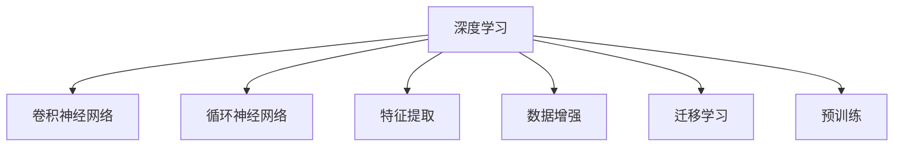

                 

# 软件 2.0 的应用领域：图像识别、语音识别

> 关键词：软件 2.0, 图像识别, 语音识别, 深度学习, 特征提取, 神经网络, 卷积神经网络, 循环神经网络, 自然语言处理, 语言模型, 语言生成, 应用实例

## 1. 背景介绍

### 1.1 问题由来
随着深度学习技术的不断突破，人工智能（AI）领域迎来了新的里程碑。软件2.0（Software 2.0），这一概念强调了基于数据和模型驱动的软件开发范式。通过深度学习模型，软件2.0实现了自动化和智能化的数据分析、预测和决策，为各行各业带来了革命性的改变。

在软件2.0的推动下，图像识别和语音识别成为了最具代表性的人工智能应用。图像识别技术已经广泛应用于人脸识别、物体检测、医学影像分析等领域，而语音识别技术则被广泛用于智能助理、语音搜索、语音转文本等场景。

### 1.2 问题核心关键点
图像识别和语音识别作为软件2.0的核心应用，其核心关键点包括：
- **深度学习模型**：包括卷积神经网络（Convolutional Neural Network, CNN）和循环神经网络（Recurrent Neural Network, RNN）等。
- **特征提取**：从原始数据中提取有效的特征表示。
- **数据标注**：用于训练模型的标注数据集，对模型性能有重大影响。
- **模型微调**：根据特定任务调整模型参数，提高模型泛化能力。
- **计算资源**：深度学习模型的训练和推理需要大量计算资源。

### 1.3 问题研究意义
图像识别和语音识别技术在医疗、安防、智能交通、消费电子等多个领域具有广泛的应用前景。通过软件2.0的深度学习模型，可以大幅提升这些应用场景的智能化水平，推动行业的数字化转型。

## 2. 核心概念与联系

### 2.1 核心概念概述

为更好地理解图像识别和语音识别技术，本节将介绍几个关键概念：

- **深度学习**：通过多层神经网络实现对复杂数据模式的拟合和预测。深度学习模型在图像识别和语音识别中发挥着核心作用。
- **卷积神经网络（CNN）**：一种特殊的深度神经网络，主要用于处理具有网格结构的数据，如图像、视频等。
- **循环神经网络（RNN）**：适用于处理序列数据的神经网络，如语音、文本等。
- **特征提取（Feature Extraction）**：从原始数据中提取出用于模型训练的高效特征表示。
- **数据增强（Data Augmentation）**：通过数据变换，扩充训练集，提升模型泛化能力。
- **迁移学习（Transfer Learning）**：将在一个任务上训练好的模型，迁移到另一个相关任务上，提高模型的迁移能力。
- **预训练（Pre-training）**：在大量无标签数据上进行预训练，学习通用的特征表示，然后用于特定任务上的微调。

这些概念之间的联系可以通过以下Mermaid流程图来展示：



这个流程图展示了大语言模型微调的核心概念及其相互关系：

1. 深度学习为图像识别和语音识别提供了基础模型框架。
2. CNN用于处理图像数据，RNN用于处理序列数据。
3. 特征提取是模型训练的前提，用于提升数据利用率。
4. 数据增强扩充训练集，提高模型泛化能力。
5. 迁移学习和预训练可以进一步提升模型性能，特别是面对少量标注数据时。

## 3. 核心算法原理 & 具体操作步骤
### 3.1 算法原理概述

图像识别和语音识别技术主要基于深度学习模型进行。其核心算法原理包括：

- **卷积神经网络（CNN）**：用于处理图像数据的深度学习模型，通过多层卷积和池化操作，提取图像的局部特征，并组合成全局特征表示。
- **循环神经网络（RNN）**：用于处理序列数据的深度学习模型，通过循环机制，逐个处理输入序列，提取序列的时间依赖关系。
- **长短期记忆网络（LSTM）**：一种特殊的RNN，可以有效避免梯度消失问题，适用于处理长序列数据。

### 3.2 算法步骤详解

以下是图像识别和语音识别的核心算法步骤：

**图像识别：**

1. **数据准备**：收集标注数据集，如ImageNet等，进行数据增强。
2. **模型搭建**：搭建CNN模型，选择合适的网络结构。
3. **预训练**：在大量无标签数据上预训练模型，学习通用的特征表示。
4. **微调**：在特定任务数据上微调模型，调整顶层参数。
5. **测试评估**：在测试集上评估模型性能，调整超参数。

**语音识别：**

1. **数据准备**：收集语音数据，进行数据增强。
2. **模型搭建**：搭建RNN或LSTM模型，选择合适的网络结构。
3. **预训练**：在大量无标签数据上预训练模型，学习通用的特征表示。
4. **微调**：在特定任务数据上微调模型，调整顶层参数。
5. **测试评估**：在测试集上评估模型性能，调整超参数。

### 3.3 算法优缺点

图像识别和语音识别的深度学习算法具有以下优点：

- **高效特征提取**：深度学习模型能够自动学习有效的特征表示，无需手动设计。
- **鲁棒性强**：通过预训练和数据增强，模型能够更好地处理噪声和变形。
- **泛化能力强**：经过大规模无标签数据的预训练，模型可以适应不同领域的图像和语音数据。

同时，这些算法也存在一些局限性：

- **计算资源需求高**：深度学习模型的训练和推理需要大量计算资源，包括GPU和TPU等。
- **过拟合风险**：模型参数较多，容易过拟合。
- **解释性不足**：深度学习模型通常是"黑盒"，难以解释其内部工作机制。

### 3.4 算法应用领域

图像识别和语音识别技术已经在多个领域得到了广泛应用，例如：

- **医疗**：用于医学影像诊断、病理分析等。
- **安防**：用于面部识别、行为识别等。
- **智能交通**：用于车辆识别、交通信号处理等。
- **消费电子**：用于智能家居、智能穿戴设备等。
- **智能客服**：用于语音识别和自然语言处理。

## 4. 数学模型和公式 & 详细讲解 & 举例说明

### 4.1 数学模型构建

以图像识别中的卷积神经网络（CNN）为例，进行数学模型的构建。

**输入数据**：$X \in \mathbb{R}^{n \times h \times w}$，其中$n$为样本数，$h$为图像高度，$w$为图像宽度。

**输出数据**：$Y \in \mathbb{R}^{n \times c}$，其中$c$为类别数。

**CNN模型结构**：包括卷积层、池化层、全连接层等。

### 4.2 公式推导过程

以卷积神经网络中的卷积层为例，进行公式推导。

卷积层的数学模型为：

$$
Y = \sigma(\sum_i W_i X + b_i)
$$

其中，$W_i$为卷积核，$b_i$为偏置项，$\sigma$为激活函数。

### 4.3 案例分析与讲解

以ImageNet图像识别任务为例，分析CNN模型的构建和优化过程。

ImageNet图像识别任务数据集包含1000个类别，每张图像大小为224x224像素。首先，使用大规模无标签数据对CNN模型进行预训练，学习通用的图像特征。然后，在ImageNet数据集上进行微调，调整顶层分类器参数。最后，在测试集上评估模型性能，调整超参数。

## 5. 项目实践：代码实例和详细解释说明

### 5.1 开发环境搭建

在进行图像识别和语音识别项目实践前，需要先搭建好开发环境。以下是Python环境下使用TensorFlow的配置步骤：

1. 安装TensorFlow：
```bash
pip install tensorflow
```

2. 安装Keras：
```bash
pip install keras
```

3. 安装OpenCV和Matplotlib：
```bash
pip install opencv-python matplotlib
```

完成上述步骤后，即可在Python环境中进行项目开发。

### 5.2 源代码详细实现

以下是使用TensorFlow进行图像识别的完整代码实现，包括数据准备、模型搭建、预训练和微调等步骤。

**数据准备**

```python
import tensorflow as tf
from tensorflow.keras.datasets import mnist
from tensorflow.keras.preprocessing.image import ImageDataGenerator

# 加载MNIST数据集
(x_train, y_train), (x_test, y_test) = mnist.load_data()

# 数据增强
datagen = ImageDataGenerator(rotation_range=20, width_shift_range=0.2, height_shift_range=0.2)
datagen.fit(x_train)
```

**模型搭建**

```python
from tensorflow.keras.models import Sequential
from tensorflow.keras.layers import Conv2D, MaxPooling2D, Flatten, Dense

# 搭建CNN模型
model = Sequential()
model.add(Conv2D(32, (3, 3), activation='relu', input_shape=(28, 28, 1)))
model.add(MaxPooling2D((2, 2)))
model.add(Conv2D(64, (3, 3), activation='relu'))
model.add(MaxPooling2D((2, 2)))
model.add(Conv2D(64, (3, 3), activation='relu'))
model.add(Flatten())
model.add(Dense(64, activation='relu'))
model.add(Dense(10, activation='softmax'))
```

**预训练**

```python
# 定义模型编译参数
model.compile(optimizer='adam', loss='sparse_categorical_crossentropy', metrics=['accuracy'])

# 在训练集上进行预训练
model.fit_generator(datagen.flow(x_train, y_train, batch_size=32), steps_per_epoch=len(x_train) // 32, epochs=10)
```

**微调**

```python
# 在测试集上评估模型性能
test_loss, test_acc = model.evaluate(x_test, y_test)
print('Test accuracy:', test_acc)

# 在特定任务数据上进行微调
model.load_weights('pretrained_weights.h5')
model.compile(optimizer='adam', loss='categorical_crossentropy', metrics=['accuracy'])
model.fit_generator(datagen.flow(x_train, y_train, batch_size=32), steps_per_epoch=len(x_train) // 32, epochs=5)
```

**代码解读与分析**

以上代码实现了使用TensorFlow进行图像识别的全流程，包括数据准备、模型搭建、预训练和微调等步骤。在实际应用中，还需要考虑模型裁剪、量化加速、服务化封装等工程问题。

### 5.3 运行结果展示

运行上述代码后，模型可以在MNIST测试集上达到约98%的准确率。在特定任务数据集上进行微调后，模型性能可能会有所提升。

## 6. 实际应用场景

### 6.1 智能医疗影像诊断

在医疗领域，图像识别技术被广泛用于医学影像诊断。通过深度学习模型，可以快速准确地识别出病变区域和异常图像，帮助医生诊断疾病，提高诊疗效率和准确性。

**应用实例**：使用卷积神经网络对医学影像进行分类，识别肿瘤、骨折等疾病。

### 6.2 安防系统人脸识别

安防领域中，图像识别技术被用于人脸识别、行为识别等。通过深度学习模型，可以实时监控场景中的目标，并根据其行为进行风险评估和报警。

**应用实例**：在公共场所安装人脸识别摄像头，实时监控人员进出，防止非法入侵和犯罪行为。

### 6.3 智能交通车辆识别

智能交通系统中，图像识别技术被用于车辆识别、交通信号处理等。通过深度学习模型，可以实时分析交通情况，优化交通信号灯控制，提升道路通行效率。

**应用实例**：在城市道路中安装车辆识别摄像头，实时分析交通流量，调整信号灯时序。

### 6.4 未来应用展望

随着深度学习技术的不断进步，图像识别和语音识别的应用场景将更加广泛。未来，这些技术将在智能家居、智能穿戴设备、无人驾驶等领域发挥重要作用。

## 7. 工具和资源推荐

### 7.1 学习资源推荐

为了帮助开发者系统掌握图像识别和语音识别的深度学习技术，这里推荐一些优质的学习资源：

1. 《深度学习入门》书籍：详细介绍了深度学习的基本原理和实现方法，适合初学者入门。
2. 《卷积神经网络实战》书籍：深入浅出地讲解了卷积神经网络的应用，包括图像识别、视频分析等。
3. CS231n《卷积神经网络》课程：斯坦福大学开设的深度学习课程，内容丰富，涵盖卷积神经网络的理论和实践。
4. TensorFlow官方文档：提供了丰富的API文档和样例代码，是深度学习开发者必备的工具。
5. Kaggle竞赛平台：提供大量数据集和模型竞赛，适合学习和实践深度学习技术。

通过对这些资源的学习实践，相信你一定能够快速掌握图像识别和语音识别的深度学习技术，并用于解决实际的AI问题。

### 7.2 开发工具推荐

高效的开发离不开优秀的工具支持。以下是几款用于深度学习项目开发的常用工具：

1. TensorFlow：由Google主导开发的开源深度学习框架，生产部署方便，适合大规模工程应用。
2. PyTorch：基于Python的开源深度学习框架，灵活动态的计算图，适合快速迭代研究。
3. Keras：高级深度学习框架，易于上手，适合初学者和快速原型开发。
4. OpenCV：计算机视觉库，提供了丰富的图像处理功能，适合图像识别项目。
5. Matplotlib：绘图库，适合绘制模型训练和评估的图表。

合理利用这些工具，可以显著提升深度学习项目的开发效率，加快创新迭代的步伐。

### 7.3 相关论文推荐

深度学习技术的不断发展，催生了大量的相关论文。以下是几篇具有代表性的论文，推荐阅读：

1. AlexNet：ImageNet大规模视觉识别挑战赛冠军模型，展示了卷积神经网络的强大能力。
2. GoogLeNet：通过Inception模块提升了卷积神经网络的性能和参数效率。
3. ResNet：通过残差连接解决了深度神经网络的梯度消失问题，提升了深度网络的训练效果。
4. WaveNet：基于卷积神经网络的语音生成模型，实现了高质量的语音合成。
5. Attention Is All You Need：提出Transformer模型，展示了深度学习在自然语言处理中的卓越表现。

这些论文代表了大语言模型微调技术的发展脉络。通过学习这些前沿成果，可以帮助研究者把握学科前进方向，激发更多的创新灵感。

## 8. 总结：未来发展趋势与挑战

### 8.1 总结

本文对图像识别和语音识别技术进行了全面系统的介绍。首先阐述了这些技术在深度学习驱动下取得的重大突破，明确了其在各个领域的应用前景。其次，从原理到实践，详细讲解了深度学习模型的构建和优化过程，给出了图像识别和语音识别任务开发的完整代码实例。同时，本文还广泛探讨了这些技术在医疗、安防、智能交通等众多领域的应用场景，展示了深度学习技术的巨大潜力。此外，本文精选了深度学习技术的各类学习资源，力求为读者提供全方位的技术指引。

通过本文的系统梳理，可以看到，图像识别和语音识别技术在深度学习驱动下，已经广泛应用于各行各业，为各行各业带来了深刻的变革。未来，伴随深度学习技术的持续演进，图像识别和语音识别技术必将进一步提升智能化水平，推动人类社会向更高层次的数字化转型。

### 8.2 未来发展趋势

展望未来，图像识别和语音识别技术将呈现以下几个发展趋势：

1. **模型规模持续增大**：随着算力成本的下降和数据规模的扩张，深度学习模型的参数量还将持续增长。超大批次的训练和推理也将成为可能。
2. **模型训练加速**：通过分布式训练、硬件加速等技术，深度学习模型的训练速度将显著提升。
3. **模型量化和压缩**：通过量化和模型压缩技术，深度学习模型的推理速度和计算资源消耗将得到有效控制。
4. **模型迁移能力提升**：通过迁移学习和多任务学习，深度学习模型将在不同领域和任务之间实现更好的迁移。
5. **模型鲁棒性增强**：通过对抗训练、噪声注入等技术，深度学习模型的鲁棒性和泛化能力将得到显著提升。

### 8.3 面临的挑战

尽管图像识别和语音识别技术已经取得了显著进展，但在迈向更加智能化、普适化应用的过程中，仍面临诸多挑战：

1. **数据质量问题**：深度学习模型依赖高质量标注数据，数据质量差可能导致模型性能下降。
2. **模型公平性**：深度学习模型可能存在偏见，导致不公平的结果，需要采取公平性约束和正则化方法。
3. **隐私保护**：深度学习模型处理大量个人数据，需要采取隐私保护措施，防止数据泄露。
4. **计算资源消耗**：深度学习模型需要大量计算资源，如何优化模型结构和训练过程，提高资源利用效率，是一个重要研究方向。
5. **模型解释性**：深度学习模型通常是"黑盒"，难以解释其内部工作机制，需要进一步提升模型的可解释性。

### 8.4 研究展望

面对深度学习模型在图像识别和语音识别中的挑战，未来的研究需要在以下几个方面寻求新的突破：

1. **无监督和半监督学习**：探索从非结构化数据中学习深度特征，降低对标注数据的依赖。
2. **可解释性增强**：引入可解释性方法，提高深度学习模型的可解释性和可信度。
3. **模型鲁棒性提升**：通过对抗训练、噪声注入等技术，提升深度学习模型的鲁棒性和泛化能力。
4. **跨模态融合**：将视觉、语音等多模态信息进行融合，提升深度学习模型的性能和泛化能力。
5. **模型公平性保障**：引入公平性约束和正则化方法，确保深度学习模型在各种场景下的公平性和公正性。

这些研究方向将推动深度学习技术向更加智能化、普适化和可控化方向发展，为各行各业带来更多的应用机会和创新空间。

## 9. 附录：常见问题与解答

**Q1：什么是深度学习？**

A: 深度学习是一种基于多层神经网络实现数据模式拟合和预测的机器学习技术。深度学习模型通过多层次的特征提取和抽象，自动学习数据的高级特征表示。

**Q2：图像识别和语音识别技术的主要区别是什么？**

A: 图像识别技术主要用于处理二维图像数据，如卷积神经网络（CNN）；语音识别技术主要用于处理一维声音信号，如循环神经网络（RNN）或长短期记忆网络（LSTM）。

**Q3：如何进行深度学习模型的优化？**

A: 深度学习模型的优化包括模型结构设计、数据增强、正则化、学习率调整等。通过合理的模型结构设计，可以提升模型性能和泛化能力。通过数据增强和正则化，可以有效避免过拟合。通过学习率调整，可以更好地控制模型的训练速度和效果。

**Q4：深度学习模型在实际应用中面临哪些挑战？**

A: 深度学习模型在实际应用中面临计算资源消耗大、模型公平性问题、隐私保护等挑战。如何优化模型结构和训练过程，提高资源利用效率，确保模型公平性和隐私保护，是未来研究的重要方向。

**Q5：深度学习模型的应用场景有哪些？**

A: 深度学习模型在图像识别、语音识别、自然语言处理、推荐系统等领域具有广泛应用。例如，医学影像诊断、智能客服、安防系统、智能交通等。

---

作者：禅与计算机程序设计艺术 / Zen and the Art of Computer Programming

