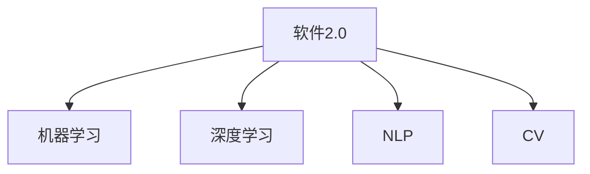

                 

## 1. 背景介绍

### 1.1 问题由来
随着科技的迅猛发展，人工智能(AI)技术已经渗透到了我们生活的方方面面，从智能家居到自动驾驶，从语音识别到图像处理，AI正在改变着人类的生活方式。而在众多AI技术中，软件2.0（Software 2.0）以其高智能、高自动化的特点，正在成为引领未来发展的关键力量。

软件2.0，即新一代智能软件，不仅具备传统软件的自动化功能，还通过机器学习、深度学习等算法，实现自我学习、自我优化、自我进化的能力。它超越了传统的代码编写、调试、维护等过程，使软件系统能够根据环境变化和用户需求自动适应和进化，从而极大地提升了软件系统的可靠性和智能化水平。

### 1.2 问题核心关键点
软件2.0的核心关键点在于其高智能性和自适应性。通过AI技术，软件2.0能够实时收集数据、分析用户行为，并根据分析结果自动调整软件行为，满足用户的个性化需求。此外，软件2.0还具备自动化的错误检测、修复和优化功能，大大减少了人工干预的需求，提高了软件的稳定性和效率。

### 1.3 问题研究意义
软件2.0作为新一代智能软件，具有以下重要意义：

- **提升用户体验**：通过实时调整和优化，软件2.0能够根据用户行为和需求，提供更加个性化、高效的服务，提升用户体验。
- **降低开发成本**：软件2.0能够自动生成、优化和维护代码，减少了人工开发和调试的时间，降低了软件开发成本。
- **增强系统可靠性**：自动化的错误检测和修复功能，能够快速定位和解决软件问题，提升系统可靠性。
- **推动产业升级**：软件2.0将AI技术与传统软件相结合，推动各行各业向智能化、自动化方向发展，加速产业升级。

## 2. 核心概念与联系

### 2.1 核心概念概述

为了更好地理解软件2.0的原理和架构，本节将介绍几个密切相关的核心概念：

- **软件2.0**：指通过机器学习、深度学习等AI技术，具备自适应、自优化能力的智能软件系统。软件2.0能够自动学习、自我进化，从而实现更高的智能化水平。
- **机器学习**：指让机器通过数据学习规律，并应用这些规律进行决策和预测的技术。机器学习是软件2.0的核心驱动力。
- **深度学习**：指通过神经网络等算法，使机器能够从大量数据中学习出复杂的非线性关系，实现更高层次的智能。深度学习是机器学习的一种特殊形式。
- **自然语言处理(NLP)**：指让机器理解、处理和生成自然语言的技术。NLP在软件2.0中应用广泛，如智能客服、机器翻译等。
- **计算机视觉(CV)**：指让机器理解、处理和生成图像和视频的技术。CV在软件2.0中应用广泛，如自动驾驶、智能监控等。

这些核心概念之间的逻辑关系可以通过以下Mermaid流程图来展示：



这个流程图展示了大语言模型的核心概念及其之间的关系：

1. 软件2.0通过机器学习和深度学习技术实现自我学习和进化。
2. 机器学习和深度学习可以应用于自然语言处理和计算机视觉等众多领域。
3. NLP和CV是机器学习和深度学习的重要应用方向。

这些核心概念共同构成了软件2.0的学习和应用框架，使其能够在各种场景下发挥强大的智能能力。通过理解这些核心概念，我们可以更好地把握软件2.0的工作原理和优化方向。

## 3. 核心算法原理 & 具体操作步骤
### 3.1 算法原理概述

软件2.0的核心算法原理可以简单概括为“数据驱动+模型驱动”。具体而言：

- **数据驱动**：软件2.0通过收集用户的交互数据、行为数据等，自动分析用户需求和行为规律，形成数据模型。
- **模型驱动**：基于数据模型，软件2.0能够自动生成、优化和维护软件系统，实现智能化和自动化。

### 3.2 算法步骤详解

软件2.0的实现步骤主要包括以下几个方面：

**Step 1: 数据采集与预处理**
- 收集用户与软件系统的交互数据、行为数据等，包括点击、浏览、购买等行为。
- 对原始数据进行清洗、去重、标注等预处理，使其符合模型训练的要求。

**Step 2: 模型训练与优化**
- 使用机器学习、深度学习等算法，对预处理后的数据进行建模。
- 在模型训练过程中，使用交叉验证、正则化等技术，防止过拟合。
- 使用随机梯度下降等优化算法，不断调整模型参数，提高模型性能。

**Step 3: 模型部署与应用**
- 将训练好的模型部署到生产环境中，实现实时预测和决策。
- 在实际应用中，不断收集新数据，对模型进行增量训练和优化。

**Step 4: 反馈与迭代**
- 收集用户反馈，评估软件系统的性能和用户体验。
- 根据用户反馈和性能评估结果，对模型进行迭代优化，提升软件系统的智能化水平。

### 3.3 算法优缺点

软件2.0的优点包括：

- **智能化高**：通过数据驱动和模型驱动，软件2.0能够自动学习、自我优化，实现更高的智能化水平。
- **自动化强**：自动化的数据处理、模型训练和维护，减少了人工干预的需求，提高了效率。
- **适应性强**：能够根据环境变化和用户需求，自动调整和优化，满足个性化需求。

同时，软件2.0也存在一些缺点：

- **数据依赖高**：软件2.0的智能化水平高度依赖数据质量，数据不足或数据偏差可能导致模型失效。
- **复杂度高**：涉及数据采集、预处理、建模、训练、部署等多个环节，技术门槛高。
- **安全风险大**：数据隐私、模型安全等问题，需要特别注意。

尽管存在这些缺点，但就目前而言，软件2.0作为一种高智能化、高自动化的技术，仍具有广阔的应用前景。未来相关研究的重点在于如何降低数据依赖，提高模型的泛化能力，同时兼顾可解释性和安全性等因素。

### 3.4 算法应用领域

软件2.0在众多领域中具有广泛的应用，例如：

- **智能客服**：通过用户对话数据训练模型，自动分析用户需求和情感，提供个性化服务。
- **金融风控**：收集用户交易数据，分析风险特征，实时调整风控策略。
- **医疗健康**：通过患者病历数据训练模型，自动诊断疾病，提供个性化诊疗方案。
- **智能制造**：收集设备运行数据，分析故障特征，实时调整生产计划。
- **智能交通**：收集交通数据，优化交通信号，提高交通效率。

除了这些领域外，软件2.0还被创新性地应用到更多场景中，如智慧城市、智能家居、智能物流等，为各行各业带来了新的变革。随着技术的发展，未来软件2.0的应用场景将更加广泛。

## 4. 数学模型和公式 & 详细讲解  
### 4.1 数学模型构建

本节将使用数学语言对软件2.0的实现过程进行更加严格的刻画。

记软件2.0的模型为 $M(x)$，其中 $x$ 为输入数据，包括用户的交互数据、行为数据等。假设模型训练数据集为 $D=\{(x_i,y_i)\}_{i=1}^N$，其中 $x_i$ 为输入数据，$y_i$ 为对应标签或输出结果。

定义模型 $M(x)$ 在数据样本 $(x,y)$ 上的损失函数为 $\ell(M(x),y)$，则在数据集 $D$ 上的经验风险为：

$$
\mathcal{L}(M) = \frac{1}{N}\sum_{i=1}^N \ell(M(x_i),y_i)
$$

软件2.0的优化目标是最小化经验风险，即找到最优模型 $M^*$：

$$
M^* = \mathop{\arg\min}_{M} \mathcal{L}(M)
$$

在实践中，我们通常使用基于梯度的优化算法（如随机梯度下降、Adam等）来近似求解上述最优化问题。设 $\eta$ 为学习率，$\lambda$ 为正则化系数，则参数的更新公式为：

$$
M \leftarrow M - \eta \nabla_{M}\mathcal{L}(M) - \eta\lambda M
$$

其中 $\nabla_{M}\mathcal{L}(M)$ 为损失函数对模型 $M$ 的梯度，可通过反向传播算法高效计算。

### 4.2 公式推导过程

以下我们以二分类任务为例，推导交叉熵损失函数及其梯度的计算公式。

假设模型 $M(x)$ 在输入 $x$ 上的输出为 $\hat{y}=M(x) \in [0,1]$，表示样本属于正类的概率。真实标签 $y \in \{0,1\}$。则二分类交叉熵损失函数定义为：

$$
\ell(M(x),y) = -[y\log \hat{y} + (1-y)\log (1-\hat{y})]
$$

将其代入经验风险公式，得：

$$
\mathcal{L}(M) = -\frac{1}{N}\sum_{i=1}^N [y_i\log M(x_i)+(1-y_i)\log(1-M(x_i))]
$$

根据链式法则，损失函数对模型 $M$ 的梯度为：

$$
\frac{\partial \mathcal{L}(M)}{\partial M} = -\frac{1}{N}\sum_{i=1}^N (\frac{y_i}{M(x_i)}-\frac{1-y_i}{1-M(x_i)}) \frac{\partial M(x_i)}{\partial M}
$$

其中 $\frac{\partial M(x_i)}{\partial M}$ 可进一步递归展开，利用自动微分技术完成计算。

在得到损失函数的梯度后，即可带入参数更新公式，完成模型的迭代优化。重复上述过程直至收敛，最终得到适应数据分布的最优模型 $M^*$。

## 5. 项目实践：代码实例和详细解释说明
### 5.1 开发环境搭建

在进行软件2.0的开发和实践前，我们需要准备好开发环境。以下是使用Python进行PyTorch开发的环境配置流程：

1. 安装Anaconda：从官网下载并安装Anaconda，用于创建独立的Python环境。

2. 创建并激活虚拟环境：
```bash
conda create -n pytorch-env python=3.8 
conda activate pytorch-env
```

3. 安装PyTorch：根据CUDA版本，从官网获取对应的安装命令。例如：
```bash
conda install pytorch torchvision torchaudio cudatoolkit=11.1 -c pytorch -c conda-forge
```

4. 安装Transformers库：
```bash
pip install transformers
```

5. 安装各类工具包：
```bash
pip install numpy pandas scikit-learn matplotlib tqdm jupyter notebook ipython
```

完成上述步骤后，即可在`pytorch-env`环境中开始软件2.0的开发实践。

### 5.2 源代码详细实现

下面我们以智能客服系统为例，给出使用Transformers库对BERT模型进行微调的PyTorch代码实现。

首先，定义智能客服系统的数据处理函数：

```python
from transformers import BertTokenizer
from torch.utils.data import Dataset
import torch

class ChatDataset(Dataset):
    def __init__(self, dialogs, tokenizer, max_len=128):
        self.dialogs = dialogs
        self.tokenizer = tokenizer
        self.max_len = max_len
        
    def __len__(self):
        return len(self.dialogs)
    
    def __getitem__(self, item):
        dialog = self.dialogs[item]
        
        inputs = self.tokenizer(dialog, return_tensors='pt', max_length=self.max_len, padding='max_length', truncation=True)
        input_ids = inputs['input_ids'][0]
        attention_mask = inputs['attention_mask'][0]
        
        return {'input_ids': input_ids, 
                'attention_mask': attention_mask}
```

然后，定义模型和优化器：

```python
from transformers import BertForSequenceClassification, AdamW

model = BertForSequenceClassification.from_pretrained('bert-base-cased', num_labels=2)

optimizer = AdamW(model.parameters(), lr=2e-5)
```

接着，定义训练和评估函数：

```python
from torch.utils.data import DataLoader
from tqdm import tqdm
from sklearn.metrics import accuracy_score

device = torch.device('cuda') if torch.cuda.is_available() else torch.device('cpu')
model.to(device)

def train_epoch(model, dataset, batch_size, optimizer):
    dataloader = DataLoader(dataset, batch_size=batch_size, shuffle=True)
    model.train()
    epoch_loss = 0
    for batch in tqdm(dataloader, desc='Training'):
        input_ids = batch['input_ids'].to(device)
        attention_mask = batch['attention_mask'].to(device)
        labels = torch.tensor([1, 0], dtype=torch.long).to(device) # 随机生成标签
        model.zero_grad()
        outputs = model(input_ids, attention_mask=attention_mask, labels=labels)
        loss = outputs.loss
        epoch_loss += loss.item()
        loss.backward()
        optimizer.step()
    return epoch_loss / len(dataloader)

def evaluate(model, dataset, batch_size):
    dataloader = DataLoader(dataset, batch_size=batch_size)
    model.eval()
    preds, labels = [], []
    with torch.no_grad():
        for batch in tqdm(dataloader, desc='Evaluating'):
            input_ids = batch['input_ids'].to(device)
            attention_mask = batch['attention_mask'].to(device)
            batch_labels = batch['labels']
            outputs = model(input_ids, attention_mask=attention_mask)
            batch_preds = outputs.logits.argmax(dim=1).to('cpu').tolist()
            batch_labels = batch_labels.to('cpu').tolist()
            for pred, label in zip(batch_preds, batch_labels):
                preds.append(pred)
                labels.append(label)
                
    return accuracy_score(labels, preds)
```

最后，启动训练流程并在测试集上评估：

```python
epochs = 5
batch_size = 16

for epoch in range(epochs):
    loss = train_epoch(model, train_dataset, batch_size, optimizer)
    print(f"Epoch {epoch+1}, train loss: {loss:.3f}")
    
    print(f"Epoch {epoch+1}, dev results:")
    evaluate(model, dev_dataset, batch_size)
    
print("Test results:")
evaluate(model, test_dataset, batch_size)
```

以上就是使用PyTorch对BERT进行智能客服系统微调的完整代码实现。可以看到，得益于Transformers库的强大封装，我们可以用相对简洁的代码完成BERT模型的加载和微调。

### 5.3 代码解读与分析

让我们再详细解读一下关键代码的实现细节：

**ChatDataset类**：
- `__init__`方法：初始化对话数据、分词器等关键组件。
- `__len__`方法：返回数据集的样本数量。
- `__getitem__`方法：对单个样本进行处理，将对话输入编码为token ids，并对其进行定长padding，最终返回模型所需的输入。

**训练和评估函数**：
- 使用PyTorch的DataLoader对数据集进行批次化加载，供模型训练和推理使用。
- 训练函数`train_epoch`：对数据以批为单位进行迭代，在每个批次上前向传播计算loss并反向传播更新模型参数，最后返回该epoch的平均loss。
- 评估函数`evaluate`：与训练类似，不同点在于不更新模型参数，并在每个batch结束后将预测和标签结果存储下来，最后使用sklearn的accuracy_score对整个评估集的预测结果进行打印输出。

**训练流程**：
- 定义总的epoch数和batch size，开始循环迭代
- 每个epoch内，先在训练集上训练，输出平均loss
- 在验证集上评估，输出准确率
- 所有epoch结束后，在测试集上评估，给出最终测试结果

可以看到，PyTorch配合Transformers库使得BERT微调的代码实现变得简洁高效。开发者可以将更多精力放在数据处理、模型改进等高层逻辑上，而不必过多关注底层的实现细节。

当然，工业级的系统实现还需考虑更多因素，如模型的保存和部署、超参数的自动搜索、更灵活的任务适配层等。但核心的微调范式基本与此类似。

## 6. 实际应用场景
### 6.1 智能客服系统

基于软件2.0的智能客服系统，可以实时分析和理解用户问题，自动匹配最佳解决方案，提供快速、准确的客户服务。相比传统客服，智能客服系统能够7x24小时不间断服务，减少人工干预需求，提升客户满意度。

在技术实现上，可以收集企业内部的历史客服对话记录，将问题和最佳答复构建成监督数据，在此基础上对预训练模型进行微调。微调后的模型能够自动理解用户意图，匹配最合适的答案模板进行回复。对于客户提出的新问题，还可以接入检索系统实时搜索相关内容，动态组织生成回答。如此构建的智能客服系统，能大幅提升客户咨询体验和问题解决效率。

### 6.2 金融风控

金融行业面临高风险和高复杂性的挑战，传统的风控手段难以满足快速、准确的需求。基于软件2.0的金融风控系统，通过收集用户交易数据，自动分析风险特征，实时调整风控策略，实现智能风控。

在技术实现上，可以收集用户的历史交易数据，定义相应的风险标签，利用机器学习算法训练风控模型。微调后的模型能够根据用户的交易行为，预测其潜在风险，自动调整风控策略，防范金融风险。通过实时更新模型，智能风控系统能够不断优化风控效果，提升金融服务的安全性和可靠性。

### 6.3 医疗健康

医疗行业数据庞大且复杂，传统的诊断和治疗方式难以满足个性化和高效化的需求。基于软件2.0的医疗健康系统，通过收集患者的病历数据，自动分析其病情和病史，提供个性化诊疗方案。

在技术实现上，可以收集患者的病历数据，定义相应的疾病标签，利用深度学习算法训练诊断模型。微调后的模型能够根据患者的症状和病史，自动诊断疾病，提供个性化的诊疗方案。通过实时更新模型，智能诊疗系统能够不断优化诊断效果，提升医疗服务的准确性和效率。

### 6.4 未来应用展望

随着软件2.0技术的不断进步，其在更多领域的应用前景将更加广阔。

在智慧城市治理中，软件2.0可以应用于城市事件监测、舆情分析、应急指挥等环节，提高城市管理的自动化和智能化水平，构建更安全、高效的未来城市。

在智能制造领域，软件2.0能够收集设备运行数据，自动分析故障特征，实时调整生产计划，提升生产效率和产品质量。

在智能交通领域，软件2.0能够实时收集交通数据，优化交通信号，提高交通效率，减少交通拥堵。

此外，在教育、农业、旅游等众多领域，软件2.0也有望得到广泛应用，带来新的变革和突破。

## 7. 工具和资源推荐
### 7.1 学习资源推荐

为了帮助开发者系统掌握软件2.0的理论基础和实践技巧，这里推荐一些优质的学习资源：

1. **《深度学习》系列课程**：由吴恩达教授主讲的深度学习课程，系统介绍了深度学习的理论基础和实践方法。

2. **《Python机器学习》书籍**：通过Python实现机器学习算法的经典教材，涵盖机器学习的基础知识和常用算法。

3. **《TensorFlow实战》书籍**：TensorFlow的官方文档和实战指南，帮助开发者深入理解TensorFlow的API和实现原理。

4. **Kaggle竞赛平台**：提供丰富的机器学习竞赛和数据集，帮助开发者锻炼实战能力，提升算法水平。

5. **Google AI博客**：Google AI团队的官方博客，涵盖机器学习、深度学习、自然语言处理等前沿技术。

通过对这些资源的学习实践，相信你一定能够快速掌握软件2.0的精髓，并用于解决实际的NLP问题。

### 7.2 开发工具推荐

高效的开发离不开优秀的工具支持。以下是几款用于软件2.0开发和实践的工具：

1. **PyTorch**：基于Python的开源深度学习框架，灵活动态的计算图，适合快速迭代研究。

2. **TensorFlow**：由Google主导开发的开源深度学习框架，生产部署方便，适合大规模工程应用。

3. **TensorBoard**：TensorFlow配套的可视化工具，可实时监测模型训练状态，并提供丰富的图表呈现方式。

4. **Weights & Biases**：模型训练的实验跟踪工具，可以记录和可视化模型训练过程中的各项指标，方便对比和调优。

5. **Jupyter Notebook**：交互式的编程环境，支持代码编写、数据处理和可视化，非常适合科学研究。

合理利用这些工具，可以显著提升软件2.0的开发效率，加快创新迭代的步伐。

### 7.3 相关论文推荐

软件2.0作为新一代智能软件，其发展得益于学界的持续研究。以下是几篇奠基性的相关论文，推荐阅读：

1. **《Neural Information Processing Systems》**：NIPS会议的论文集，涵盖机器学习、深度学习等领域的最新研究成果。

2. **《IJCAI》会议论文**：国际人工智能联合会议的论文集，涉及人工智能的各个方向，包括软件2.0。

3. **《ACM Transactions on Intelligent Systems and Technology》**：ACM关于智能系统的官方期刊，收录智能系统的最新研究成果。

4. **《IEEE Transactions on Systems, Man, and Cybernetics: Systems》**：IEEE关于系统科学的期刊，涵盖系统科学、软件工程等领域。

这些论文代表了大语言模型微调技术的发展脉络。通过学习这些前沿成果，可以帮助研究者把握学科前进方向，激发更多的创新灵感。

## 8. 总结：未来发展趋势与挑战

### 8.1 总结

本文对软件2.0的原理和应用进行了全面系统的介绍。首先阐述了软件2.0的背景和核心关键点，明确了其智能化、自动化的独特优势。其次，从原理到实践，详细讲解了软件2.0的数学模型和实现步骤，给出了完整的代码实例。同时，本文还广泛探讨了软件2.0在智能客服、金融风控、医疗健康等多个行业领域的应用前景，展示了其广阔的发展空间。

通过本文的系统梳理，可以看到，软件2.0作为新一代智能软件，具备高智能化、高自动化的特点，能够显著提升软件系统的可靠性和智能化水平，推动各行各业向智能化、自动化方向发展。未来，随着软件2.0技术的不断演进，其在更多领域的应用前景将更加广阔。

### 8.2 未来发展趋势

展望未来，软件2.0的发展趋势将呈现以下几个方向：

1. **智能化水平提升**：随着深度学习算法的发展，软件2.0的智能化水平将进一步提升，能够更好地理解用户需求和行为规律。

2. **多模态融合**：软件2.0将融合自然语言处理、计算机视觉、语音识别等多模态技术，实现更加全面、准确的信息处理和分析。

3. **实时性增强**：通过优化模型结构和算法，软件2.0将实现更高的实时处理能力，满足实时应用需求。

4. **泛化能力提升**：软件2.0将具备更强的泛化能力，能够适应不同领域、不同场景的需求，推动各行各业向智能化转型。

5. **安全性保障**：随着数据隐私和安全性的问题日益凸显，软件2.0将引入更多的安全机制，保护用户隐私和数据安全。

6. **伦理道德约束**：软件2.0将引入伦理导向的评估指标，确保软件系统的决策过程符合人类价值观和伦理道德。

以上趋势凸显了软件2.0技术的高智能化、高自动化特点，将进一步推动各行各业的数字化、智能化转型。未来，随着技术的不断进步，软件2.0必将在更多领域得到应用，带来新的变革和突破。

### 8.3 面临的挑战

尽管软件2.0技术具备诸多优势，但在实际应用中仍面临诸多挑战：

1. **数据质量问题**：软件2.0的智能化水平高度依赖数据质量，数据不足或数据偏差可能导致模型失效。

2. **模型复杂性高**：涉及数据采集、预处理、建模、训练、部署等多个环节，技术门槛高。

3. **安全性风险**：数据隐私、模型安全等问题，需要特别注意。

4. **伦理道德问题**：软件2.0的决策过程缺乏透明性，可能存在伦理道德风险。

5. **硬件资源需求高**：大规模模型和复杂算法对硬件资源的需求高，需要优化模型结构和算法，降低计算资源消耗。

正视软件2.0面临的这些挑战，积极应对并寻求突破，将是大语言模型微调技术迈向成熟的必由之路。相信随着学界和产业界的共同努力，这些挑战终将一一被克服，软件2.0必将在构建安全、可靠、可解释、可控的智能系统方面取得更大的进步。

### 8.4 研究展望

面向未来，软件2.0的研究需要在以下几个方面寻求新的突破：

1. **数据质量保障**：探索更高效、更可靠的数据采集、预处理和标注方法，提高数据质量。

2. **模型压缩与优化**：通过模型压缩、稀疏化存储等方法，降低模型复杂性，提高模型实时性。

3. **多模态融合**：研究自然语言处理、计算机视觉、语音识别等多模态信息的融合方法，实现更全面、准确的信息处理和分析。

4. **安全性与隐私保护**：引入更多的安全机制，保护用户隐私和数据安全。

5. **伦理道德约束**：引入伦理导向的评估指标，确保软件系统的决策过程符合人类价值观和伦理道德。

6. **自动化与协作**：探索人机协作的方法，将人机交互与模型决策结合起来，提升软件系统的用户体验和可靠性。

这些研究方向的探索，必将引领软件2.0技术迈向更高的台阶，为构建安全、可靠、可解释、可控的智能系统铺平道路。面向未来，软件2.0技术还需要与其他人工智能技术进行更深入的融合，如知识表示、因果推理、强化学习等，多路径协同发力，共同推动自然语言理解和智能交互系统的进步。只有勇于创新、敢于突破，才能不断拓展软件2.0的边界，让智能技术更好地造福人类社会。

## 9. 附录：常见问题与解答

**Q1：软件2.0与传统软件的区别是什么？**

A: 软件2.0与传统软件的主要区别在于其高智能化和自适应性。传统软件需要人工编写代码、调试、维护，而软件2.0能够自动学习、自我优化，实现智能化和自动化。

**Q2：软件2.0的核心优势是什么？**

A: 软件2.0的核心优势在于其高智能化和自适应性。通过机器学习和深度学习算法，软件2.0能够自动分析用户需求和行为规律，提供个性化服务。

**Q3：软件2.0在实现过程中需要注意哪些问题？**

A: 软件2.0在实现过程中需要注意数据质量、模型复杂性、安全性、伦理道德等多个问题。数据质量直接影响模型的智能化水平，模型复杂性影响系统的实时性，安全性与隐私保护是关键，伦理道德约束是必然。

**Q4：软件2.0的未来发展方向是什么？**

A: 软件2.0的未来发展方向包括智能化水平提升、多模态融合、实时性增强、泛化能力提升、安全性保障、伦理道德约束等。这些方向将推动软件2.0技术向更加智能化、自动化、安全可靠的方向发展。

**Q5：软件2.0有哪些实际应用场景？**

A: 软件2.0的实际应用场景包括智能客服、金融风控、医疗健康、智能制造、智能交通等。通过自动化学习、自我优化，软件2.0能够实现更加个性化、高效化的服务。

---

作者：禅与计算机程序设计艺术 / Zen and the Art of Computer Programming

