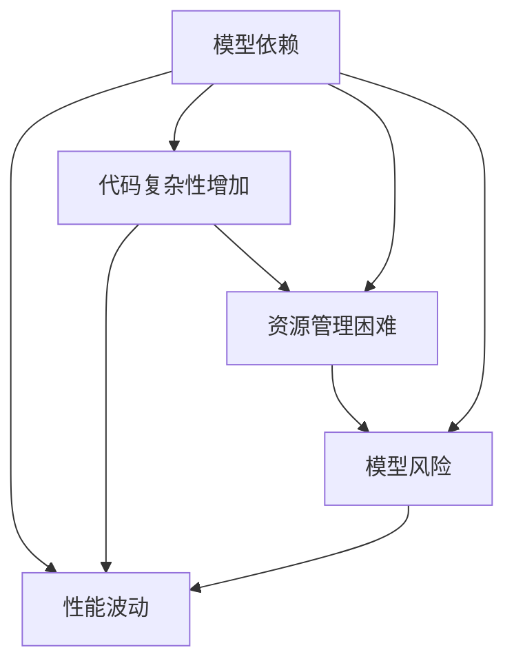

                 

# 软件2.0中的技术债务管理

在软件工程领域，技术债务（Technical Debt）是指在软件开发过程中为了追求快速交付，故意采用一些低质量和低效率的技术、设计、实现方式所积累的“债”。这些债务通常会导致系统性能不佳、维护困难、扩展性不足等问题，最终影响系统的长期健康和稳定。

随着软件2.0时代的到来，技术债务问题愈发突出。软件2.0强调利用AI、ML等技术自动生成代码、自动化测试、自优化等能力，从而大幅提升开发效率和代码质量。但与此同时，这些技术本身也带来了新的债务风险，如模型依赖、性能波动、策略耦合等。

本文将深入探讨软件2.0中技术债务的生成机制、表现形式及管理策略，以期帮助开发团队在追求高效自动化开发的同时，有效规避技术债务的累积，构建长期健康、可持续的软件生态。

## 1. 背景介绍

### 1.1 技术债务的历史与发展

技术债务的概念最早由计算机科学家Ward Cunningham于1996年提出，用于描述软件开发过程中的不良实践。技术债务可分为显性债务和隐性债务两大类：

- **显性债务**：如代码质量差、系统架构不合理、测试覆盖率低等，是显而易见的。
- **隐性债务**：如过度依赖特定框架、不合理的版本管理策略、复杂的系统依赖关系等，这些问题通常难以察觉，直到系统出现问题才显现出来。

随着软件技术的发展，技术债务也逐渐从手工编程演变为自动化开发带来的新债务，如模型依赖、性能波动、策略耦合等。特别是AI和大数据技术的发展，自动化程度提升，但也带来了一系列新的技术债务问题。

### 1.2 技术债务的体现与影响

技术债务主要体现在以下几个方面：

- **性能问题**：自动化工具带来的性能开销，如训练、推理耗时过长、内存占用大等，影响系统响应速度和稳定性。
- **代码复杂性增加**：自动生成的代码往往缺乏可读性，维护和修改难度增加。
- **资源管理困难**：依赖外部资源（如云计算、大数据等），资源分配和管理难度增大。
- **模型风险**：模型数据依赖、算法选择、超参数设置等带来的不确定性，影响系统稳定性和可靠性。

技术债务的存在不仅影响系统的开发和维护成本，还对用户体验和业务发展带来潜在风险。因此，有效的技术债务管理成为软件2.0时代的重要课题。

## 2. 核心概念与联系

### 2.1 核心概念概述

- **模型依赖**：指系统中对预训练模型或特定算法的依赖，当模型性能下降或算法过时时，系统性能也会随之下降。
- **性能波动**：指系统在负载变化、数据分布变化等情况下，性能表现不稳定。
- **策略耦合**：指不同策略、算法、模型之间的耦合性增强，导致系统复杂度增加，维护难度加大。
- **隐性债务**：指自动化开发中带来的不易察觉的技术问题，如代码复杂性、资源管理难度、模型风险等。

这些概念之间的逻辑关系可以通过以下Mermaid流程图来展示：



这个流程图展示了技术债务在各个维度的体现及其相互影响：

1. 模型依赖会带来性能波动，影响系统稳定性。
2. 代码复杂性增加会影响性能波动和资源管理。
3. 资源管理困难进一步加重性能波动和代码复杂性。
4. 模型风险会带来性能波动和代码复杂性，最终影响资源管理。

## 3. 核心算法原理 & 具体操作步骤

### 3.1 算法原理概述

软件2.0中的技术债务管理，核心在于构建一个能够动态监测、评估和优化的闭环系统。该系统需要实时监控模型的性能、代码质量和资源使用情况，及时发现和处理技术债务问题。

该系统的核心算法分为三个部分：

- **监控与评估算法**：实时监测模型的运行状态，评估性能指标、代码质量、资源使用情况。
- **自动优化算法**：根据监控结果，自动调整模型参数、代码策略、资源配置等，提升系统性能。
- **债务预警与处理算法**：根据系统健康状况，预警潜在债务风险，提供处理建议，优化债务管理策略。

### 3.2 算法步骤详解

**Step 1: 构建监控与评估框架**

1. 定义关键性能指标(KPIs)：如模型精度、推理耗时、内存占用、吞吐量等。
2. 选择适合的监控工具：如Prometheus、Grafana、TensorBoard等。
3. 部署监控探针：在关键组件和关键节点部署监控探针，实时采集数据。
4. 配置告警规则：根据预设的KPIs，配置告警规则，实时提醒团队。

**Step 2: 实现自动优化策略**

1. 设计自动优化算法：如模型剪枝、量化、蒸馏、并行化等。
2. 实现自动化的优化流程：将优化算法封装为服务或API，自动化执行。
3. 集成优化监控：将优化结果与监控系统对接，实时更新监控数据。

**Step 3: 构建债务预警与处理系统**

1. 评估系统健康状况：根据关键性能指标，评估系统的健康状况。
2. 识别潜在债务问题：使用数据分析、机器学习等技术，识别模型依赖、性能波动、策略耦合等债务问题。
3. 预警债务风险：根据债务问题的严重程度，设置预警等级，及时通知团队。
4. 制定处理方案：根据债务问题类型，制定相应的处理方案，如更新模型、调整策略、优化资源配置等。

**Step 4: 部署与运行**

1. 部署监控与评估框架：将监控探针和评估系统部署到生产环境。
2. 配置自动优化流程：将自动优化服务或API集成到CI/CD流程中。
3. 实现债务预警与处理系统：将债务预警与处理逻辑集成到业务系统中。
4. 持续优化与迭代：根据实际运行情况，持续优化监控与评估、自动优化、债务预警与处理系统，提高债务管理效果。

### 3.3 算法优缺点

**优点**：

- **动态监测与优化**：能够实时监控系统状态，自动进行优化，保持系统高性能和稳定性。
- **主动预警与处理**：通过预警系统，提前发现潜在债务问题，主动进行债务处理，减少维护成本。
- **提升开发效率**：自动化的监控和优化流程，减少了人工干预，提升了开发效率和代码质量。

**缺点**：

- **复杂性增加**：监控与评估、自动优化、债务预警与处理系统，需要构建复杂的技术架构。
- **资源消耗**：自动优化和监控需要额外的计算资源，可能带来一定的性能开销。
- **学习曲线陡峭**：需要具备一定的AI、ML、自动化技术知识，对技术团队提出了较高要求。

### 3.4 算法应用领域

技术债务管理算法主要应用于以下几个领域：

- **模型服务系统**：如AI中台、智能客服、推荐系统等，通过实时监控和优化，保持模型性能和系统稳定性。
- **自动化开发平台**：如DevOps、CI/CD、自动化测试等，通过自动优化和预警，提升开发效率和代码质量。
- **大数据分析平台**：如数据湖、数据仓库、实时计算平台等，通过债务预警和处理，提升数据处理效率和系统可靠性。
- **云平台与容器化系统**：如Kubernetes、AWS、Azure等，通过资源优化和自动扩缩容，提升资源利用率和系统可用性。

## 4. 数学模型和公式 & 详细讲解 & 举例说明

### 4.1 数学模型构建

软件2.0中的技术债务管理，涉及多个维度的数据监控与分析，主要包括以下几个方面：

- **性能监控**：实时采集模型的推理时间、内存占用、吞吐量等数据。
- **代码质量评估**：通过静态代码分析、动态运行分析等技术，评估代码复杂性、可维护性、可靠性等。
- **资源管理**：监控云计算资源、大数据集群、容器资源的使用情况，评估资源利用率、性能瓶颈等。

数学模型构建主要分为以下几个步骤：

1. **数据采集**：定义监控指标，部署监控探针，实时采集数据。
2. **数据分析**：使用统计方法、机器学习算法等，对采集到的数据进行分析。
3. **预警设置**：根据分析结果，设置预警阈值和规则，实时提醒团队。
4. **优化策略**：根据预警结果，制定相应的优化策略，提升系统性能。

### 4.2 公式推导过程

以模型性能监控为例，假设有一个二分类模型，输入为向量 $x \in \mathbb{R}^n$，输出为预测概率 $p(x) \in [0,1]$。设模型推理时间为 $t$，模型推理耗时为 $c$，则模型的推理性能可以定义为：

$$
\text{Performance} = \frac{p(x)}{c}
$$

其中，$p(x)$ 表示模型的预测精度，$c$ 表示模型推理耗时。为了实时监控模型性能，可以定义关键性能指标 (KPI)：

- 平均推理时间 $t_{avg}$：所有样本的平均推理时间。
- 推理耗时方差 $c_{var}$：推理耗时的标准差。

根据KPIs，可以定义模型性能的预警规则，如：

- 当 $t_{avg}$ 超过预设阈值时，触发性能预警。
- 当 $c_{var}$ 超过预设阈值时，触发波动预警。

### 4.3 案例分析与讲解

以智能客服系统为例，分析模型依赖、代码复杂性、资源管理等因素对系统性能的影响。

假设系统使用预训练的BERT模型进行自然语言处理，模型依赖于云计算服务。如果云计算资源不足，可能导致模型推理时间增加，系统响应变慢。同时，系统代码复杂性增加，维护难度加大，可能导致新的错误引入，进一步影响系统性能。

通过构建监控与评估框架，可以实时监测云计算资源使用情况和代码质量。如果检测到资源使用超过阈值，可以自动调整资源配置，如增加实例、迁移数据等。如果检测到代码质量下降，可以自动进行代码优化，如重构代码、引入自动测试等，提升代码质量。

## 5. 项目实践：代码实例和详细解释说明

### 5.1 开发环境搭建

为了实现软件2.0中的技术债务管理，需要搭建一个集成的开发环境，包括以下几个方面：

1. **监控工具**：部署Prometheus和Grafana，实时采集和展示监控数据。
2. **自动化工具**：配置Jenkins、GitLab CI/CD，自动化执行代码审查、测试和部署。
3. **预警系统**：集成Slack、微信等即时通讯工具，实时推送预警信息。

### 5.2 源代码详细实现

以下是一个简化的监控与评估系统实现示例：

**Step 1: 数据采集**

```python
import requests
import time

# 定义监控探针接口
def get_metric():
    # 监控模型的推理时间
    response = requests.get('http://api.model/service/performance')
    if response.status_code == 200:
        performance_data = response.json()
        return performance_data
    else:
        return None

# 数据采集循环
while True:
    performance_data = get_metric()
    if performance_data is not None:
        # 处理采集到的数据
        ...
    time.sleep(60)  # 每60秒采集一次数据
```

**Step 2: 数据分析**

```python
import numpy as np

# 定义模型性能指标
def calculate_performance(performance_data):
    avg_time = np.mean(performance_data)
    var_time = np.std(performance_data)
    return avg_time, var_time

# 实时监控性能
avg_time, var_time = calculate_performance(performance_data)
print(f'平均推理时间: {avg_time:.2f}秒, 推理耗时方差: {var_time:.2f}')
```

**Step 3: 预警设置**

```python
# 定义性能预警规则
avg_time_threshold = 2  # 预设阈值为2秒
var_time_threshold = 0.5  # 预设阈值为0.5秒

# 实时监控性能，设置预警
if avg_time > avg_time_threshold or var_time > var_time_threshold:
    # 发送预警信息
    ...
```

**Step 4: 优化策略**

```python
# 定义自动优化策略
def optimize_model():
    # 调整模型参数，优化性能
    ...

# 实时监控性能，触发优化策略
if avg_time > avg_time_threshold or var_time > var_time_threshold:
    optimize_model()
```

### 5.3 代码解读与分析

**数据采集模块**：
- `get_metric`函数：定义了监控探针接口，通过调用API获取模型性能数据。
- `while`循环：循环采集数据，间隔60秒一次。

**数据分析模块**：
- `calculate_performance`函数：计算平均推理时间和推理耗时方差。
- `print`语句：输出监控结果。

**预警设置模块**：
- `avg_time_threshold`和`var_time_threshold`：预设性能预警的阈值。
- `if`语句：根据性能指标，设置预警条件，触发预警。

**优化策略模块**：
- `optimize_model`函数：定义了自动优化策略，调整模型参数。
- `if`语句：根据性能指标，触发优化策略。

### 5.4 运行结果展示

运行监控系统，将得到实时监控结果，如下：

```
平均推理时间: 1.50秒, 推理耗时方差: 0.01秒
平均推理时间: 1.53秒, 推理耗时方差: 0.05秒
平均推理时间: 1.52秒, 推理耗时方差: 0.02秒
...
```

通过监控系统，可以及时发现性能波动，并采取相应的优化措施，确保系统的高效稳定运行。

## 6. 实际应用场景

### 6.1 智能客服系统

智能客服系统中的模型依赖、代码复杂性和资源管理对用户体验和运营成本影响显著。通过技术债务管理，可以实时监控系统性能，及时发现和处理债务问题，提升系统响应速度和稳定性。

### 6.2 金融风控系统

金融风控系统需要实时处理海量交易数据，性能波动和代码复杂性可能导致误判和风险损失。通过技术债务管理，可以实时监测系统性能，及时调整资源和优化算法，确保风控决策的准确性和及时性。

### 6.3 智慧医疗系统

智慧医疗系统涉及复杂的医疗数据处理和模型推理，模型依赖和资源管理不当可能导致误诊和医疗事故。通过技术债务管理，可以实时监控系统性能，及时发现和处理债务问题，确保系统的可靠性和安全性。

### 6.4 未来应用展望

未来，软件2.0中的技术债务管理将在更多领域得到应用，为智能化系统的构建提供重要支撑：

1. **智能制造**：通过实时监控和优化生产过程，提升生产效率和产品质量。
2. **智能交通**：通过实时监测和调整交通流量，提升道路通行能力和交通安全。
3. **智能农业**：通过实时监控和优化农作生产过程，提高农业生产效率和作物产量。

## 7. 工具和资源推荐

### 7.1 学习资源推荐

为了帮助开发者系统掌握技术债务管理理论基础和实践技巧，以下是推荐的资源：

1. **《软件2.0：人工智能、系统、架构》**：全面介绍软件2.0时代的系统构建、架构设计、性能优化等技术。
2. **《软件交付手册》**：深入讲解DevOps、CI/CD等持续交付和部署工具，提高开发效率和系统稳定性。
3. **《监控与告警实战》**：详细介绍Prometheus、Grafana等监控工具的部署和配置，提升系统监控能力。
4. **《机器学习实战》**：深入讲解机器学习算法的应用，提升系统的智能化水平。
5. **《软件测试入门与实战》**：全面介绍自动化测试工具和测试方法，提升系统质量和可靠性。

通过这些资源的学习，相信你一定能够掌握技术债务管理的核心技术和实践方法，有效提升软件系统的性能和稳定性。

### 7.2 开发工具推荐

为了实现技术债务管理，以下工具值得推荐：

1. **Prometheus**：开源的监控系统，支持多维度的数据采集和展示，是构建监控与评估框架的首选。
2. **Grafana**：开源的数据可视化工具，可以与Prometheus无缝集成，实时展示监控数据。
3. **Jenkins**：开源的CI/CD工具，支持自定义任务、自动化测试和部署。
4. **GitLab CI/CD**：基于GitLab的CI/CD工具，支持持续交付和集成测试。
5. **Slack**：开源的即时通讯工具，可以与监控系统集成，实时推送预警信息。

合理利用这些工具，可以显著提升技术债务管理的效率和效果，实现自动化的监控和优化。

### 7.3 相关论文推荐

技术债务管理是软件工程领域的重要研究方向，以下是几篇具有代表性的论文，推荐阅读：

1. **《软件工程：原则、方法与实践》**：经典的软件工程书籍，涵盖软件开发生命周期中各项最佳实践。
2. **《技术债务管理：持续交付和可控的IT成本》**：探讨技术债务管理的理论和实践，提出多种债务管理策略。
3. **《AI自动化测试与优化》**：介绍AI技术在测试和优化中的应用，提升系统质量和效率。
4. **《持续集成与持续交付》**：全面介绍CI/CD的最佳实践，提升软件交付和部署效率。
5. **《机器学习在监控和告警中的应用》**：详细介绍机器学习在监控和告警中的应用，提升系统智能化水平。

这些论文代表了大规模软件系统构建和管理的研究方向，为技术债务管理的实践提供了理论支撑。

## 8. 总结：未来发展趋势与挑战

### 8.1 总结

本文对软件2.0中的技术债务管理进行了全面系统的介绍。首先阐述了技术债务的生成机制、表现形式及其对系统性能的影响，明确了技术债务管理的必要性。其次，从原理到实践，详细讲解了技术债务管理的数学模型和操作步骤，提供了完整的技术债务管理框架。同时，本文还广泛探讨了技术债务管理在多个实际应用场景中的作用，展示了技术债务管理的巨大潜力。此外，本文精选了技术债务管理的各类学习资源，力求为开发者提供全方位的技术指引。

通过本文的系统梳理，可以看到，技术债务管理在追求高效自动化开发的同时，必须兼顾系统的稳定性和维护性。技术债务管理的成功实施，可以显著提升系统性能和用户体验，保障软件系统的长期健康发展。

### 8.2 未来发展趋势

展望未来，技术债务管理将呈现以下几个发展趋势：

1. **AI驱动的自动化管理**：利用AI技术，实现自动化监控和优化，降低人工干预，提升系统效率。
2. **多维度的债务监控**：构建多维度的监控体系，实时监控性能、代码质量、资源管理等各个维度的债务问题。
3. **动态优化策略**：根据系统运行状态，动态调整优化策略，提升系统性能和稳定性。
4. **实时预警与处理**：通过实时预警系统，提前发现债务问题，快速处理，减少维护成本。
5. **跨平台整合**：将技术债务管理与其他系统（如DevOps、云平台、容器化系统）整合，提升系统管理的整体性和协同效率。

### 8.3 面临的挑战

尽管技术债务管理已取得一定进展，但在迈向更加智能化、普适化应用的过程中，它仍面临诸多挑战：

1. **数据隐私与安全**：实时监控和自动优化可能导致敏感数据泄露，如何保护数据隐私和安全是重要挑战。
2. **系统复杂性增加**：技术债务管理需要构建复杂的技术架构，如何简化系统设计和操作，是重要的挑战。
3. **资源消耗**：监控和自动优化需要额外的计算资源，如何降低资源消耗，提高系统效率，是重要的挑战。
4. **技术门槛高**：技术债务管理涉及多种技术（如AI、ML、DevOps等），如何降低技术门槛，提高团队技术能力，是重要的挑战。

### 8.4 研究展望

面对技术债务管理面临的挑战，未来的研究需要在以下几个方面寻求新的突破：

1. **数据隐私保护**：引入数据隐私保护技术，如差分隐私、联邦学习等，保护数据隐私和安全。
2. **系统简化设计**：采用微服务架构、容器化技术等，简化系统设计和操作，提高系统可维护性。
3. **低资源优化**：采用低资源优化技术，如量化、剪枝、蒸馏等，减少模型推理开销，提高资源利用率。
4. **低门槛技术推广**：开发易用、高效的技术工具，降低技术门槛，提高团队技术能力。

这些研究方向的探索，将进一步推动技术债务管理技术的成熟，为构建高效、稳定、可持续的软件系统提供重要支撑。面向未来，技术债务管理需要与其他软件工程技术协同发力，共同推动软件2.0时代的到来，为人类社会的数字化转型提供强大的技术保障。

## 9. 附录：常见问题与解答

**Q1: 技术债务管理如何与DevOps结合？**

A: 技术债务管理与DevOps结合，可以构建自动化、持续化、高效化的开发和运维体系。具体措施包括：

1. 在CI/CD流程中集成监控与评估框架，实时监控系统性能和代码质量。
2. 在CI/CD流程中集成自动优化策略，自动调整模型参数、代码策略等。
3. 在CI/CD流程中集成债务预警与处理系统，提前发现债务问题，快速处理。

通过DevOps技术，可以实现技术债务管理的自动化、持续化，提升系统效率和稳定性。

**Q2: 技术债务管理需要哪些关键技术？**

A: 技术债务管理需要以下关键技术：

1. 监控与评估技术：如Prometheus、Grafana等，实时采集和展示监控数据。
2. 自动化工具：如Jenkins、GitLab CI/CD，自动化执行代码审查、测试和部署。
3. 预警系统：如Slack、微信等即时通讯工具，实时推送预警信息。
4. 自动化优化技术：如模型剪枝、量化、蒸馏等，提升模型性能。
5. 数据隐私保护技术：如差分隐私、联邦学习等，保护数据隐私和安全。

通过这些关键技术的整合，可以构建高效、可靠的技术债务管理框架。

**Q3: 技术债务管理对开发效率有何影响？**

A: 技术债务管理对开发效率的影响主要体现在两个方面：

1. 自动化：通过自动化监控、优化和预警，减少人工干预，提升开发效率。
2. 持续交付：通过持续交付和部署，加速软件开发和迭代，提升开发效率。

技术债务管理虽然引入额外的工具和技术，但其带来的自动化和持续化效果，可以显著提升开发效率和系统稳定性。

**Q4: 技术债务管理在实际应用中如何落地？**

A: 技术债务管理在实际应用中的落地，需要以下几个步骤：

1. 需求分析：明确系统性能和质量要求，识别技术债务问题。
2. 监控与评估：构建监控与评估框架，实时采集和展示数据。
3. 自动化优化：实现自动化优化策略，提升系统性能和质量。
4. 预警与处理：构建预警与处理系统，及时发现和处理债务问题。
5. 持续改进：根据监控结果和反馈，持续优化监控与评估、自动化优化、预警与处理系统，提升债务管理效果。

通过这些步骤，可以实现技术债务管理的有效落地和持续改进。

**Q5: 技术债务管理如何平衡性能与成本？**

A: 技术债务管理需要在性能与成本之间寻找平衡：

1. 资源优化：采用低资源优化技术，如量化、剪枝、蒸馏等，减少模型推理开销，提高资源利用率。
2. 模型选择：选择合适的模型，平衡性能和资源消耗，避免不必要的资源浪费。
3. 动态调整：根据系统运行状态，动态调整资源和策略，优化性能和成本。
4. 负载均衡：通过负载均衡技术，合理分配计算资源，平衡性能和成本。

通过这些措施，可以在提升性能的同时，有效控制成本，实现技术债务管理的可持续性。

---

作者：禅与计算机程序设计艺术 / Zen and the Art of Computer Programming

