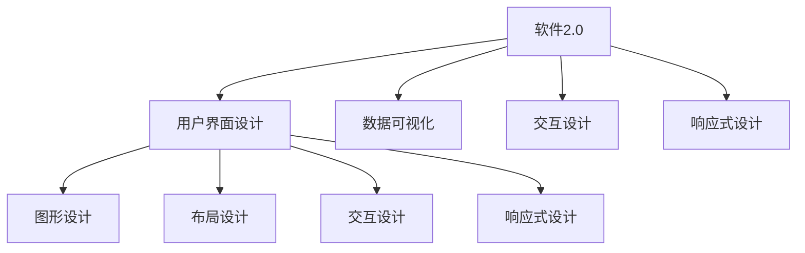

                 

# 软件2.0的用户界面设计原则

## 1. 背景介绍

### 1.1 问题由来
在软件开发过程中，用户界面（User Interface, UI）设计是一个至关重要的环节。良好的UI设计不仅能提高用户的使用体验，还能促进软件的成功部署和推广。特别是在软件2.0（即“以数据为中心的软件”）时代，数据驱动和AI驱动的应用程序对UI设计的要求变得更为严格和复杂。

### 1.2 问题核心关键点
软件2.0的UI设计挑战主要集中在以下几个方面：

- **数据可视化**：如何将复杂的数据信息直观地呈现在用户面前。
- **交互性**：如何设计出流畅、高效的交互流程。
- **自动化和智能决策**：如何结合AI技术，实现智能化的用户引导和建议。
- **响应式设计**：如何设计出适用于多种设备和屏幕尺寸的UI界面。

### 1.3 问题研究意义
有效的UI设计能够极大提高软件的使用效率和用户满意度，缩短用户的学习曲线，减少错误发生。特别是在数据密集型的应用场景中，优秀的UI设计能够帮助用户快速理解和利用数据，提升决策质量。

## 2. 核心概念与联系

### 2.1 核心概念概述

在探讨软件2.0的UI设计原则之前，我们需要先理解几个关键概念：

- **软件2.0（Software 2.0）**：一种基于数据和人工智能的新一代软件开发范式，其核心在于通过数据驱动和AI技术来提升软件的功能性和用户体验。
- **用户界面（UI）设计**：将软件的功能、数据和用户体验相结合，通过图形、布局、交互等方式展现给用户。
- **数据可视化**：将数据转化为易于理解和分析的图形、图表等形式，帮助用户快速获取关键信息。
- **交互设计**：围绕用户体验，设计出直观、流畅的操作流程，优化用户的互动体验。
- **响应式设计**：创建灵活、可适应多种屏幕尺寸的UI界面，提升跨设备的用户体验。

这些概念之间的联系可以通过以下Mermaid流程图来展示：



这个流程图展示了软件2.0的UI设计如何从数据可视化、交互设计和响应式设计三个方面，与图形设计、布局设计等具体实现手段相结合，最终形成高质量的UI界面。

## 3. 核心算法原理 & 具体操作步骤
### 3.1 算法原理概述

软件2.0的UI设计原则是结合数据驱动和AI技术，通过科学的方法论，设计出直观、高效、个性化的用户界面。其核心算法原理主要包括以下几个方面：

- **数据驱动设计**：利用数据分析结果指导UI设计决策，确保设计符合用户实际需求。
- **机器学习辅助设计**：通过机器学习模型分析用户行为数据，优化UI交互流程。
- **自适应设计**：设计出能够动态调整的UI界面，适应不同设备、不同网络环境下的用户体验。

### 3.2 算法步骤详解

软件2.0的UI设计流程可以分为以下几步：

1. **需求分析**：明确软件的功能目标和用户需求。
2. **数据收集**：通过日志、用户反馈等手段收集数据。
3. **数据处理**：对数据进行清洗、分类、聚类等处理，得到有价值的信息。
4. **设计原型**：根据数据处理结果，设计出初步的UI界面原型。
5. **用户测试**：通过A/B测试等方式，收集用户对UI原型的反馈，进行优化。
6. **部署上线**：将优化后的UI界面上线，收集真实数据，进行后续迭代。

### 3.3 算法优缺点

软件2.0的UI设计具有以下优点：

- **高效性**：通过数据分析和机器学习，UI设计过程可以更加科学和高效。
- **个性化**：能够根据用户行为数据，设计出符合个性化需求的UI界面。
- **灵活性**：响应式设计能够适应不同设备和环境。

但同时也存在一些缺点：

- **复杂性**：涉及到数据分析、机器学习等多个学科，技术门槛较高。
- **数据依赖**：过度依赖数据收集和处理，可能影响设计速度和效率。
- **成本较高**：需要投入大量的时间和资源在数据处理和模型训练上。

### 3.4 算法应用领域

软件2.0的UI设计不仅适用于传统的软件应用，还广泛应用在以下几个领域：

- **数据可视化工具**：如Tableau、PowerBI等，通过直观的图表帮助用户理解复杂数据。
- **智能推荐系统**：如Amazon推荐引擎、Netflix推荐系统等，通过用户行为数据优化推荐UI界面。
- **企业管理系统**：如CRM、ERP等，通过数据分析提升企业管理效率。
- **智能家居设备**：如智能音箱、智能电视等，通过响应式设计提升用户交互体验。

## 4. 数学模型和公式 & 详细讲解 & 举例说明

### 4.1 数学模型构建

软件2.0的UI设计涉及到的数学模型主要包括以下几个：

- **回归模型**：用于分析用户行为数据和UI设计参数之间的关系。
- **聚类算法**：用于将用户行为数据进行分组，发现不同的用户群体。
- **优化算法**：用于设计出最优的UI交互流程和布局。

### 4.2 公式推导过程

以回归模型为例，假设有一个包含$N$个用户行为的训练集$D=\{(x_i,y_i)\}_{i=1}^N$，其中$x_i$表示用户行为数据，$y_i$表示UI设计参数。通过回归模型$f(x_i)$，可以建立用户行为数据和UI设计参数之间的映射关系：

$$
y_i = f(x_i) + \epsilon_i
$$

其中$\epsilon_i$为随机误差项，可以通过最小二乘法等方法求得$f(x_i)$，即：

$$
\hat{f}(x_i) = \arg\min_{f(x_i)}\sum_{i=1}^N(y_i - f(x_i))^2
$$

通过求解上述最小化问题，可以得到最优的UI设计参数。

### 4.3 案例分析与讲解

假设我们正在设计一个电商推荐系统的UI界面，需要根据用户的浏览和购买行为，推荐合适的商品。通过收集用户的浏览历史数据$x_i$和购买历史数据$y_i$，我们可以建立一个回归模型$f(x_i)$，用于预测用户对不同商品的评分$y_i$。

利用Python中的Scikit-Learn库，我们可以实现上述回归模型：

```python
from sklearn.linear_model import LinearRegression
import pandas as pd

# 假设我们有一个包含用户行为数据和购买评分的训练集
data = pd.read_csv('user_behavior.csv')

# 将数据分为特征和标签
X = data.drop(['purchase_score'], axis=1)
y = data['purchase_score']

# 创建并训练回归模型
model = LinearRegression()
model.fit(X, y)
```

通过训练得到的模型，我们可以根据用户的新行为数据$x_{new}$，预测其对商品的评分$y_{new}$：

```python
# 预测新用户行为对商品的评分
new_behavior = pd.read_csv('new_user_behavior.csv')
X_new = new_behavior.drop(['purchase_score'], axis=1)

# 利用训练好的模型进行预测
y_pred = model.predict(X_new)
```

通过上述过程，我们可以利用数据驱动的方式，优化电商推荐系统的UI设计，提升用户的购物体验。

## 5. 项目实践：代码实例和详细解释说明
### 5.1 开发环境搭建

在进行软件2.0的UI设计实践前，我们需要准备好开发环境。以下是使用Python进行开发的环境配置流程：

1. 安装Anaconda：从官网下载并安装Anaconda，用于创建独立的Python环境。

2. 创建并激活虚拟环境：
```bash
conda create -n software2o-env python=3.8 
conda activate software2o-env
```

3. 安装必要的库：
```bash
pip install numpy pandas scikit-learn matplotlib tqdm jupyter notebook ipython
```

完成上述步骤后，即可在`software2o-env`环境中开始实践。

### 5.2 源代码详细实现

下面我们将以数据可视化工具Tableau为例，展示如何使用Python进行软件2.0的UI设计。

首先，定义数据处理和模型训练的函数：

```python
import pandas as pd
from sklearn.linear_model import LinearRegression

def load_data(file_path):
    data = pd.read_csv(file_path)
    return data

def train_model(data, features, label):
    X = data[features]
    y = data[label]
    model = LinearRegression()
    model.fit(X, y)
    return model

def predict(model, X):
    return model.predict(X)
```

然后，定义数据可视化函数：

```python
import matplotlib.pyplot as plt

def plot_results(y_true, y_pred, title='Prediction Results'):
    plt.figure(figsize=(10, 5))
    plt.plot(y_true, label='True')
    plt.plot(y_pred, label='Predicted')
    plt.legend()
    plt.title(title)
    plt.show()
```

接着，启动数据处理和UI设计流程：

```python
# 加载数据
data = load_data('user_behavior.csv')

# 定义特征和标签
features = ['browsing_hours', 'clicks_per_session', 'session_duration']
label = 'purchase_score'

# 训练模型
model = train_model(data, features, label)

# 预测新用户行为对商品的评分
new_behavior = pd.read_csv('new_user_behavior.csv')
X_new = new_behavior[features]

# 预测评分
y_pred = predict(model, X_new)

# 可视化预测结果
plot_results(data['purchase_score'], y_pred, title='Prediction Results')
```

### 5.3 代码解读与分析

让我们再详细解读一下关键代码的实现细节：

**load_data函数**：
- 定义了一个用于加载数据的文件读取函数，通过pandas库读取CSV文件，并返回数据框。

**train_model函数**：
- 定义了一个用于训练线性回归模型的函数，通过Scikit-Learn库创建并训练线性回归模型，并返回模型对象。

**predict函数**：
- 定义了一个用于进行预测的函数，通过训练好的模型进行预测，并返回预测结果。

**plot_results函数**：
- 定义了一个用于绘制预测结果的函数，通过matplotlib库绘制真实评分与预测评分的对比图。

**主流程代码**：
- 加载用户行为数据，定义特征和标签，训练线性回归模型。
- 加载新用户行为数据，提取特征，进行预测。
- 可视化预测结果。

可以看出，通过Python中的Scikit-Learn和matplotlib库，我们能够方便地实现基于数据驱动的软件2.0的UI设计，提升电商推荐系统的用户体验。

## 6. 实际应用场景

### 6.1 智能推荐系统

基于软件2.0的UI设计，智能推荐系统可以更加精准地推荐商品，提升用户满意度和转化率。具体实现步骤如下：

1. **数据收集**：收集用户的历史行为数据，包括浏览记录、点击次数、购买记录等。
2. **数据处理**：对数据进行清洗、分类、聚类等处理，得到有价值的信息。
3. **设计原型**：根据数据处理结果，设计出初步的UI界面原型，包含商品推荐列表、评价分数、评分预测等功能。
4. **用户测试**：通过A/B测试等方式，收集用户对UI原型的反馈，进行优化。
5. **部署上线**：将优化后的UI界面上线，收集真实数据，进行后续迭代。

### 6.2 企业管理系统

软件2.0的UI设计能够提升企业管理的效率和准确性。具体实现步骤如下：

1. **数据收集**：收集企业内部各个部门的数据，包括销售数据、财务数据、库存数据等。
2. **数据处理**：对数据进行清洗、分类、聚类等处理，得到有价值的信息。
3. **设计原型**：根据数据处理结果，设计出初步的UI界面原型，包含报表展示、数据筛选、决策支持等功能。
4. **用户测试**：通过A/B测试等方式，收集用户对UI原型的反馈，进行优化。
5. **部署上线**：将优化后的UI界面上线，收集真实数据，进行后续迭代。

### 6.3 智能家居设备

基于软件2.0的UI设计，智能家居设备可以提升用户的交互体验和设备功能。具体实现步骤如下：

1. **数据收集**：收集用户的设备使用数据，包括设备开关状态、温度调节、湿度调节等。
2. **数据处理**：对数据进行清洗、分类、聚类等处理，得到有价值的信息。
3. **设计原型**：根据数据处理结果，设计出初步的UI界面原型，包含设备状态展示、智能推荐、自动化控制等功能。
4. **用户测试**：通过A/B测试等方式，收集用户对UI原型的反馈，进行优化。
5. **部署上线**：将优化后的UI界面上线，收集真实数据，进行后续迭代。

## 7. 工具和资源推荐

### 7.1 学习资源推荐

为了帮助开发者系统掌握软件2.0的UI设计理论基础和实践技巧，这里推荐一些优质的学习资源：

1. **《软件2.0：数据驱动和人工智能的软件开发》**：由软件开发领域的权威专家撰写，深入浅出地介绍了软件2.0的理论基础和实际应用。
2. **《UI设计基础》**：由知名UI设计师撰写的入门级教程，涵盖UI设计的各个方面，包括设计原则、工具使用、用户测试等。
3. **Coursera上的《Data Visualization with Python》课程**：由数据可视化领域的专家授课，介绍如何使用Python进行数据可视化。
4. **Udemy上的《Python Machine Learning》课程**：由机器学习领域的权威专家授课，介绍如何使用Python进行机器学习建模和优化。

通过对这些资源的学习实践，相信你一定能够快速掌握软件2.0的UI设计精髓，并用于解决实际的UI设计问题。

### 7.2 开发工具推荐

高效的UI设计开发离不开优秀的工具支持。以下是几款用于软件2.0的UI设计开发的常用工具：

1. **Adobe XD**：一款专业的UI设计工具，支持原型设计和交互设计，能够导出多种格式的设计稿。
2. **Sketch**：另一款流行的UI设计工具，支持协作设计，能够导出多种格式的设计稿。
3. **Figma**：一款基于Web的UI设计工具，支持实时协作，能够在云端进行设计和管理。
4. **Axure**：一款原型设计工具，支持交互设计，能够生成可交互的原型和文档。

合理利用这些工具，可以显著提升软件2.0的UI设计开发效率，加快创新迭代的步伐。

### 7.3 相关论文推荐

软件2.0的UI设计涉及多个学科的交叉，需要阅读大量的相关论文来深入理解其原理和实践方法。以下是几篇具有代表性的相关论文，推荐阅读：

1. **《软件2.0：数据驱动和人工智能的软件开发》**：由软件2.0的先驱者撰写的综述性论文，系统介绍了软件2.0的理论基础和实际应用。
2. **《数据可视化设计指南》**：由数据可视化领域的专家撰写的论文，介绍数据可视化的设计原则和方法。
3. **《用户界面设计中的机器学习技术》**：由UI设计专家和机器学习专家共同撰写的论文，探讨如何将机器学习技术应用到UI设计中。

这些论文代表了大数据和人工智能在UI设计中的应用前沿，通过学习这些前沿成果，可以帮助研究者把握学科前进方向，激发更多的创新灵感。

## 8. 总结：未来发展趋势与挑战

### 8.1 总结

本文对软件2.0的UI设计进行了全面系统的介绍。首先阐述了软件2.0的UI设计背景和意义，明确了UI设计在软件2.0中的应用场景和挑战。其次，从原理到实践，详细讲解了UI设计的数学模型和具体实现步骤，给出了软件2.0的UI设计代码实例。同时，本文还广泛探讨了UI设计在智能推荐系统、企业管理系统和智能家居设备等场景中的应用前景，展示了UI设计范式的广泛适用性。最后，本文精选了UI设计的各类学习资源，力求为读者提供全方位的技术指引。

通过本文的系统梳理，可以看到，软件2.0的UI设计不仅是一个技术问题，更是一个多学科交叉的复杂系统工程。UI设计需要融合数据分析、机器学习、图形设计等多个领域的知识，才能设计出高效、个性化、适应性强的用户界面。

### 8.2 未来发展趋势

展望未来，软件2.0的UI设计将呈现以下几个发展趋势：

1. **数据驱动设计**：利用大数据分析和机器学习技术，更好地理解用户需求和行为，设计出更加符合用户期望的界面。
2. **智能化交互设计**：结合自然语言处理和语音识别技术，实现与用户的智能对话，提升用户体验。
3. **跨平台设计**：设计出能够在多种设备和操作系统上无缝使用的UI界面，提升用户的跨设备体验。
4. **自适应设计**：根据用户的行为和环境变化，动态调整UI界面，提升用户体验的稳定性和适应性。

### 8.3 面临的挑战

尽管软件2.0的UI设计已经取得了一定的成果，但在迈向更加智能化、普适化应用的过程中，它仍面临着诸多挑战：

1. **数据隐私和安全**：如何保护用户数据隐私和安全，防止数据泄露和滥用，是UI设计的重要挑战。
2. **用户隐私保护**：如何在使用数据分析和机器学习的过程中，保护用户的隐私权利，防止数据滥用。
3. **设计复杂度**：软件2.0的UI设计涉及多个学科的交叉，设计过程较为复杂，需要协调多方面的需求和限制。
4. **用户接受度**：用户对新技术和新设计的接受度较低，需要不断优化和迭代，提高用户的接受度和满意度。

### 8.4 研究展望

未来，软件2.0的UI设计需要在以下几个方面寻求新的突破：

1. **隐私保护技术**：开发更加高效和安全的隐私保护技术，保护用户数据隐私。
2. **智能交互技术**：引入自然语言处理和语音识别技术，实现与用户的智能对话，提升用户体验。
3. **多学科融合**：将数据科学、图形设计、心理学等多个学科的知识进行融合，设计出更加符合用户需求的界面。
4. **跨平台设计**：设计出能够在多种设备和操作系统上无缝使用的UI界面，提升用户的跨设备体验。

这些研究方向凸显了软件2.0的UI设计面临的挑战和机遇，需要研究者不断探索和突破，才能更好地满足用户需求，提升软件的用户体验和市场竞争力。

## 9. 附录：常见问题与解答

**Q1：软件2.0的UI设计是否适用于所有应用场景？**

A: 软件2.0的UI设计适用于数据密集型的应用场景，如电商推荐系统、智能推荐系统等。但对于一些非数据驱动的应用场景，如传统企业管理系统、传统UI设计等，可能并不适用。需要根据具体场景进行综合评估。

**Q2：如何选择合适的数据可视化工具？**

A: 选择数据可视化工具需要考虑以下因素：
1. 工具的功能和特性，是否满足需求。
2. 工具的易用性和学习成本，是否容易上手。
3. 工具的社区和支持，是否有丰富的用户和文档支持。
4. 工具的成本，是否适合预算。

常见的数据可视化工具包括Tableau、PowerBI、D3.js等，需要根据具体需求进行选择。

**Q3：数据驱动设计过程中需要注意哪些问题？**

A: 数据驱动设计过程中需要注意以下问题：
1. 数据的质量和完整性，是否能够反映真实情况。
2. 数据的隐私和安全，是否保护用户隐私。
3. 数据的更新频率，是否及时反映用户需求变化。
4. 数据的可视化方式，是否直观易懂。

通过合理处理数据，可以设计出更加符合用户需求的界面。

**Q4：如何设计出高效的UI交互流程？**

A: 设计高效的UI交互流程需要考虑以下因素：
1. 用户体验，是否简洁、直观、易用。
2. 交互方式，是否高效、流畅、自然。
3. 反馈机制，是否及时、准确、明确。
4. 兼容性，是否能够适应多种设备和操作系统。

通过优化交互流程，可以提升用户的体验和满意度。

**Q5：如何在跨平台设计中保证一致性？**

A: 在跨平台设计中保证一致性需要考虑以下因素：
1. 界面元素和交互方式的一致性，是否符合用户习惯。
2. 布局和设计的统一性，是否符合品牌风格。
3. 用户体验的一致性，是否无缝切换。

通过合理设计，可以保证跨平台设计的一致性和用户体验。

---

作者：禅与计算机程序设计艺术 / Zen and the Art of Computer Programming

