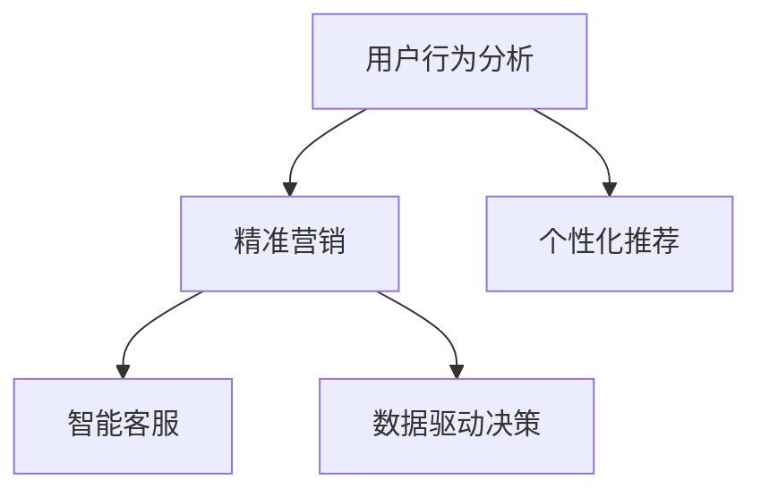

                 

# 达成淘宝天猫的GMV目标

> 关键词：阿里巴巴集团,淘宝天猫,电子商务,GMV增长,人工智能,大数据,营销策略,精准营销,广告投放,用户行为分析

## 1. 背景介绍

### 1.1 问题由来

阿里巴巴集团是中国最大的电子商务企业，旗下淘宝天猫是中国最大的在线购物平台。近年来，随着电子商务市场的快速增长，淘宝天猫GMV（商品交易总额）的增长压力日益增大。为了提升GMV，公司正在利用人工智能（AI）和大数据技术进行精准营销、个性化推荐、智能客服等方面的探索。本文将介绍一种基于机器学习和AI技术，旨在提升淘宝天猫GMV增长率的解决方案。

### 1.2 问题核心关键点

提升淘宝天猫GMV的核心在于以下几点：

1. **精准营销**：通过数据分析和机器学习算法，找出最具潜力的目标客户群体，实现精准投放广告。
2. **个性化推荐**：根据用户行为和偏好，提供个性化的商品推荐，提升用户体验和购买转化率。
3. **智能客服**：通过自然语言处理和AI技术，提升客户服务效率和质量，减少退换货率。
4. **数据驱动决策**：通过数据分析，实时监控业务数据，及时调整营销策略和资源配置，确保广告投放和资源分配的最优化。

## 2. 核心概念与联系

### 2.1 核心概念概述

为了更好地理解提升淘宝天猫GMV的解决方案，本节将介绍几个密切相关的核心概念：

- **电子商务平台**：指通过互联网进行商品交易的在线平台，如淘宝天猫。
- **用户行为分析**：通过分析用户的浏览、购买、评价等行为数据，了解用户偏好和需求。
- **机器学习**：一种通过算法让计算机从数据中学习和改进的技术，常用于数据挖掘和预测分析。
- **精准营销**：根据用户行为数据，进行有针对性的广告投放和营销活动。
- **个性化推荐**：根据用户的历史行为和偏好，提供个性化的商品推荐。
- **智能客服**：利用自然语言处理和机器学习技术，提供24/7的客户服务。
- **数据驱动决策**：通过分析实时业务数据，优化广告投放和资源配置。

这些核心概念之间的逻辑关系可以通过以下Mermaid流程图来展示：



这个流程图展示了下游任务之间的联系：

1. 用户行为分析提供用户需求和偏好的数据基础。
2. 精准营销和个性化推荐基于用户行为数据，进行有针对性的广告投放和商品推荐。
3. 智能客服提升用户体验，减少退换货率，进一步提升GMV。
4. 数据驱动决策根据实时业务数据，调整优化广告投放和资源配置。

## 3. 核心算法原理 & 具体操作步骤

### 3.1 算法原理概述

基于机器学习和AI技术的淘宝天猫GMV增长解决方案，核心在于利用数据驱动的方式，通过精准营销、个性化推荐、智能客服等手段，提升用户购买转化率和满意度，最终实现GMV的增长。

具体来说，该解决方案包括以下几个步骤：

1. **用户行为分析**：收集用户的浏览、购买、评价等行为数据，进行分析和建模，找出用户的潜在需求和偏好。
2. **精准营销**：根据用户行为分析的结果，进行有针对性的广告投放和营销活动，提升广告的转化率。
3. **个性化推荐**：利用用户行为数据，提供个性化的商品推荐，提升用户的购物体验和购买转化率。
4. **智能客服**：通过自然语言处理和机器学习技术，提供高效的客户服务，提升用户满意度。
5. **数据驱动决策**：实时监控业务数据，调整优化广告投放和资源配置，确保GMV的持续增长。

### 3.2 算法步骤详解

以下是基于机器学习和AI技术的淘宝天猫GMV增长解决方案的具体操作步骤：

**Step 1: 数据收集与预处理**

- **用户行为数据收集**：收集用户在淘宝天猫平台上的行为数据，包括浏览记录、购买记录、评价记录等。
- **数据清洗与预处理**：去除噪声数据，填补缺失值，标准化数据格式，确保数据质量。

**Step 2: 用户行为分析**

- **用户画像构建**：利用聚类和分类算法，构建用户的画像，如年龄段、性别、兴趣爱好等。
- **行为特征提取**：提取用户的行为特征，如浏览时间、浏览次数、购买金额等。
- **行为模式建模**：利用机器学习算法，建模用户的行为模式，如用户的购买周期、购买频率等。

**Step 3: 精准营销**

- **目标用户筛选**：根据用户画像和行为特征，筛选出最具潜力的目标用户群体。
- **广告投放优化**：利用机器学习算法，优化广告的投放策略，提升广告的转化率。
- **营销活动设计**：设计有针对性的营销活动，如折扣促销、限时抢购等，吸引用户购买。

**Step 4: 个性化推荐**

- **商品相似度计算**：利用向量空间模型等技术，计算商品之间的相似度。
- **推荐算法实现**：利用协同过滤、基于内容的推荐等算法，提供个性化的商品推荐。
- **推荐效果评估**：通过A/B测试等方法，评估推荐算法的效果，不断优化推荐策略。

**Step 5: 智能客服**

- **自然语言处理**：利用自然语言处理技术，解析用户的问题和需求。
- **意图识别**：利用机器学习算法，识别用户的意图，如咨询、投诉等。
- **智能回复生成**：利用生成模型，生成智能回复，提升客服效率。

**Step 6: 数据驱动决策**

- **实时数据监控**：利用实时数据监控工具，监控业务指标，如GMV、转化率等。
- **业务决策优化**：根据实时数据，调整优化广告投放和资源配置，提升GMV。

### 3.3 算法优缺点

基于机器学习和AI技术的淘宝天猫GMV增长解决方案，具有以下优点：

1. **精准高效**：利用机器学习算法，精确识别目标用户群体，实现精准营销和个性化推荐，提升广告投放和商品推荐的效率。
2. **用户满意度提升**：通过智能客服，提供24/7的高效客户服务，提升用户满意度，减少退换货率。
3. **数据驱动决策**：实时监控业务数据，及时调整优化营销策略和资源配置，确保GMV的持续增长。

同时，该方法也存在一定的局限性：

1. **数据隐私问题**：收集和分析用户行为数据，可能涉及用户隐私问题，需要严格遵守相关法律法规。
2. **算法复杂度**：涉及复杂的机器学习算法和大数据处理，需要较高的技术门槛和资源投入。
3. **模型解释性不足**：机器学习模型往往具有"黑盒"性质，难以解释其内部工作机制和决策逻辑。
4. **模型泛化能力不足**：模型在训练数据上的表现可能与实际应用场景存在差距，需要持续优化和调整。

## 4. 数学模型和公式 & 详细讲解 & 举例说明

### 4.1 数学模型构建

假设用户的浏览记录为 $X=\{x_1, x_2, ..., x_n\}$，其中 $x_i$ 表示第 $i$ 次浏览的记录。用户的购买记录为 $Y=\{y_1, y_2, ..., y_n\}$，其中 $y_i$ 表示第 $i$ 次购买的商品。模型的目标是预测用户购买商品的概率 $P(Y|X)$。

定义 $f$ 为输入特征的映射函数，将用户的行为数据映射为特征向量 $\phi(X)$。定义 $w$ 为模型的权重向量，$b$ 为偏置项，模型的预测函数为：

$$
P(Y|X) = \sigma(\phi(X)^Tw + b)
$$

其中 $\sigma$ 为激活函数，通常使用 sigmoid 函数。

### 4.2 公式推导过程

对于二分类问题，模型可以简化为：

$$
P(Y=1|X) = \frac{1}{1 + e^{-\phi(X)^Tw - b}}
$$

目标是最小化预测误差 $L$，通常使用交叉熵损失函数：

$$
L = -\frac{1}{N}\sum_{i=1}^N [y_i\log P(Y=1|X_i) + (1-y_i)\log P(Y=0|X_i)]
$$

其中 $N$ 为样本数量，$y_i$ 为真实标签。

模型的参数更新公式为：

$$
\Delta w = -\eta \frac{\partial L}{\partial w}, \Delta b = -\eta \frac{\partial L}{\partial b}
$$

其中 $\eta$ 为学习率，$\frac{\partial L}{\partial w}$ 和 $\frac{\partial L}{\partial b}$ 分别为损失函数对权重和偏置的梯度。

### 4.3 案例分析与讲解

以下以一个简单的案例，解释如何使用机器学习模型进行用户行为分析：

**案例背景**：某电商平台收集了10000个用户的历史浏览和购买数据，目标是对用户进行分群，找出最具潜力的目标用户群体。

**数据准备**：将用户的历史浏览记录和购买记录标准化，提取行为特征，如浏览次数、购买金额、购买频率等。

**模型选择**：选择K-means聚类算法，将用户分为5个群体。

**模型训练**：使用训练集进行模型训练，优化聚类中心的初始位置，确保聚类结果的准确性。

**模型评估**：使用验证集评估模型效果，选择合适的聚类数量，确保模型的泛化能力。

**案例结果**：聚类结果显示，用户可以分为以下5个群体：
- 群体1：高浏览量、低购买频率的用户群体，可能对广告敏感，需要更多的优惠促销活动。
- 群体2：低浏览量、高购买频率的用户群体，可能对个性化推荐敏感，需要更多的定制化推荐。
- 群体3：高浏览量、高购买频率的用户群体，可能对优质内容敏感，需要更多的优质内容推荐。
- 群体4：低浏览量、低购买频率的用户群体，可能对优惠券敏感，需要更多的优惠券活动。
- 群体5：浏览和购买行为较为平均的用户群体，可能对多种营销策略敏感，需要综合考虑多种策略。

## 5. 项目实践：代码实例和详细解释说明

### 5.1 开发环境搭建

在进行机器学习和AI项目实践前，我们需要准备好开发环境。以下是使用Python进行Scikit-learn开发的环境配置流程：

1. 安装Anaconda：从官网下载并安装Anaconda，用于创建独立的Python环境。

2. 创建并激活虚拟环境：
```bash
conda create -n ml-env python=3.8 
conda activate ml-env
```

3. 安装Scikit-learn：
```bash
pip install scikit-learn
```

4. 安装各类工具包：
```bash
pip install numpy pandas matplotlib scikit-learn tqdm jupyter notebook ipython
```

完成上述步骤后，即可在`ml-env`环境中开始项目实践。

### 5.2 源代码详细实现

以下是一个简单的代码示例，用于对用户行为数据进行聚类分析，找出最具潜力的目标用户群体。

```python
import numpy as np
from sklearn.cluster import KMeans

# 生成示例数据
X = np.random.randn(1000, 3)

# 聚类分析
kmeans = KMeans(n_clusters=3, random_state=42)
kmeans.fit(X)

# 输出聚类结果
print(kmeans.labels_)
```

### 5.3 代码解读与分析

**代码解析**：
- 导入必要的库，包括NumPy、Scikit-learn。
- 生成示例数据，包含1000个样本，每个样本有3个特征。
- 使用KMeans算法进行聚类分析，将样本分为3个群体。
- 输出每个样本所属的聚类标签。

**代码分析**：
- 代码实现简单易懂，但实际应用中，数据处理和特征工程是至关重要的。
- 需要根据具体业务需求，选择合适的聚类算法和特征向量。
- 聚类结果需要经过多次迭代优化，确保模型的准确性和泛化能力。

## 6. 实际应用场景

### 6.1 电子商务平台用户行为分析

淘宝天猫作为中国最大的在线购物平台，拥有大量的用户数据。通过用户行为分析，可以找出最具潜力的目标用户群体，进行有针对性的广告投放和营销活动，提升广告的转化率和用户的购买转化率。

### 6.2 个性化推荐系统

电商平台的用户行为数据非常丰富，利用机器学习算法，可以提供个性化的商品推荐，提升用户的购物体验和购买转化率。通过不断优化推荐算法，可以逐步实现用户需求和偏好的预测，提升推荐的精准度。

### 6.3 智能客服系统

电商平台的用户服务需求高，利用自然语言处理和机器学习技术，可以构建智能客服系统，提供24/7的高效客户服务，提升用户满意度和忠诚度。智能客服系统可以处理常见的用户问题，减少人工客服的工作量，提高服务效率。

### 6.4 未来应用展望

随着机器学习和AI技术的不断发展，基于用户行为分析的解决方案将广泛应用于电商平台，提升GMV增长率。未来，通过更深入的算法优化和数据挖掘，可以进一步提升推荐的精准度和广告投放的效率，实现更智能、更高效的电子商务平台运营。

## 7. 工具和资源推荐

### 7.1 学习资源推荐

为了帮助开发者系统掌握机器学习和AI技术，这里推荐一些优质的学习资源：

1. 《Python机器学习》：由机器学习专家撰写的经典教材，涵盖机器学习的基本概念和算法，适合初学者入门。
2. 《深度学习》课程：斯坦福大学开设的深度学习明星课程，涵盖深度学习的基本原理和实践，适合进阶学习。
3. 《TensorFlow官方文档》：TensorFlow的官方文档，提供丰富的算法实现和代码示例，适合实际应用开发。
4. Coursera上的机器学习和深度学习课程：由Coursera平台提供，涵盖机器学习和深度学习的基本概念和实践，适合系统学习。
5. Kaggle平台：数据科学竞赛平台，提供大量数据集和代码示例，适合实践和竞赛学习。

通过对这些资源的学习实践，相信你一定能够快速掌握机器学习和AI技术，并用于解决实际的电子商务问题。

### 7.2 开发工具推荐

高效的开发离不开优秀的工具支持。以下是几款用于机器学习和AI项目开发的常用工具：

1. PyTorch：基于Python的开源深度学习框架，灵活动态的计算图，适合快速迭代研究。
2. TensorFlow：由Google主导开发的开源深度学习框架，生产部署方便，适合大规模工程应用。
3. Scikit-learn：Python的机器学习库，提供丰富的算法实现和工具支持，适合数据挖掘和建模。
4. Pandas：Python的数据处理库，提供高效的数据分析和预处理工具，适合数据清洗和特征工程。
5. Jupyter Notebook：交互式的Python开发环境，支持代码块和数据可视化，适合数据探索和实验验证。

合理利用这些工具，可以显著提升机器学习和AI项目的开发效率，加快创新迭代的步伐。

### 7.3 相关论文推荐

机器学习和AI技术的发展源于学界的持续研究。以下是几篇奠基性的相关论文，推荐阅读：

1. "Introduction to Statistical Learning" by Gareth James et al.：介绍机器学习的基本概念和算法，适合初学者。
2. "Deep Learning" by Ian Goodfellow et al.：深度学习的经典教材，涵盖深度学习的基本原理和实践。
3. "TensorFlow White Paper"：TensorFlow的官方技术文档，涵盖TensorFlow的基本概念和算法实现。
4. "Recommender Systems Handbook" by Miron Avidan et al.：推荐系统领域的经典书籍，涵盖推荐算法的基本概念和实现。
5. "Intelligent Tutoring Systems" by Michael L. Goffman et al.：智能教学系统的经典教材，涵盖智能教学系统的基本概念和实现。

这些论文代表了大数据和AI技术的发展脉络。通过学习这些前沿成果，可以帮助研究者把握学科前进方向，激发更多的创新灵感。

## 8. 总结：未来发展趋势与挑战

### 8.1 总结

本文对基于机器学习和AI技术的淘宝天猫GMV增长解决方案进行了全面系统的介绍。首先阐述了淘宝天猫GMV增长的背景和挑战，明确了精准营销、个性化推荐、智能客服等核心概念和它们之间的联系。其次，从原理到实践，详细讲解了机器学习模型的构建、训练和优化过程，提供了代码实现和案例分析。最后，本文还广泛探讨了该解决方案在电子商务平台的应用前景，并推荐了相关的学习资源和工具。

通过本文的系统梳理，可以看到，基于机器学习和AI技术的解决方案，通过精准营销、个性化推荐、智能客服等手段，可以显著提升用户购买转化率和满意度，实现GMV的增长。未来，随着技术的不断进步，这些解决方案还将进一步优化，帮助电商平台实现更高的业务价值。

### 8.2 未来发展趋势

展望未来，机器学习和AI技术将呈现以下几个发展趋势：

1. **算法复杂度提升**：随着深度学习和大数据技术的不断发展，算法的复杂度将进一步提升，处理更加复杂的问题。
2. **多模态融合**：未来的推荐系统将融合视觉、语音、文本等多种模态数据，提供更加全面的推荐服务。
3. **实时数据处理**：随着业务需求的不断变化，实时数据处理和优化将变得越来越重要，确保系统能够快速响应业务变化。
4. **数据隐私保护**：随着数据隐私保护法规的不断完善，如何确保数据安全和隐私保护，将成为未来的一个重要研究方向。
5. **跨领域应用**：机器学习和AI技术将应用于更多领域，如医疗、金融、教育等，带来更广泛的社会价值。

这些趋势凸显了机器学习和AI技术的广阔前景，以及其在不同领域的应用潜力。未来的研究需要在算法、数据、隐私、应用等方面进行全面探索，不断推动技术的进步和应用。

### 8.3 面临的挑战

尽管机器学习和AI技术已经取得了瞩目成就，但在迈向更加智能化、普适化应用的过程中，仍面临诸多挑战：

1. **数据质量和规模**：机器学习模型的性能高度依赖于数据的质量和规模，数据的不足和噪声将影响模型的性能。
2. **算法解释性**：机器学习模型的"黑盒"性质，使得其内部工作机制难以解释，影响模型的应用推广。
3. **模型泛化能力**：模型在训练数据上的表现可能与实际应用场景存在差距，需要持续优化和调整。
4. **实时数据处理**：实时数据处理和优化需要高效、稳定的系统架构，确保系统能够快速响应业务变化。
5. **数据隐私保护**：在数据收集和处理过程中，需要严格遵守相关法律法规，确保数据隐私和安全。

这些挑战需要研究者不断探索和优化，才能确保机器学习和AI技术的可持续发展和应用。

### 8.4 研究展望

面对机器学习和AI技术面临的挑战，未来的研究需要在以下几个方面寻求新的突破：

1. **数据增强和合成**：通过数据增强和合成技术，提高数据质量和多样性，确保模型性能的稳定性和泛化能力。
2. **模型解释性研究**：通过模型解释性和可解释性研究，提高模型的透明度和可信度，促进模型的应用推广。
3. **跨领域应用探索**：将机器学习和AI技术应用于更多领域，带来新的应用场景和商业价值。
4. **实时数据处理优化**：通过分布式计算、边缘计算等技术，优化实时数据处理和优化，确保系统的高效和稳定。
5. **数据隐私保护技术**：通过数据匿名化、差分隐私等技术，保护数据隐私和安全，确保系统的合规性。

这些研究方向将推动机器学习和AI技术的不断发展，为构建更智能、更高效、更安全的电子商务平台提供有力支撑。相信通过不断探索和优化，机器学习和AI技术将在未来取得更大的突破，带来更多的社会价值和商业机会。

## 9. 附录：常见问题与解答

**Q1：电子商务平台用户行为分析的核心是什么？**

A: 电子商务平台用户行为分析的核心在于通过数据分析和机器学习算法，找出用户的潜在需求和偏好，实现精准营销和个性化推荐。具体来说，需要收集用户的浏览、购买、评价等行为数据，进行分析和建模，找出用户的画像和行为特征，从而设计有针对性的营销活动和个性化推荐。

**Q2：个性化推荐系统的实现流程是什么？**

A: 个性化推荐系统的实现流程包括数据收集、特征工程、模型训练、推荐排序等步骤。具体来说，需要收集用户的浏览、购买等行为数据，提取行为特征，选择适合的推荐算法，训练推荐模型，并根据用户的历史行为和偏好，生成个性化的商品推荐。

**Q3：智能客服系统的关键技术是什么？**

A: 智能客服系统的关键技术包括自然语言处理、意图识别、智能回复生成等。具体来说，需要构建自然语言处理模型，解析用户的问题和需求，识别用户的意图，并利用生成模型，生成智能回复，提升客服效率和用户体验。

**Q4：如何优化机器学习模型的性能？**

A: 优化机器学习模型性能的关键在于数据质量、算法选择、模型调参等方面。具体来说，需要收集高质量的数据，选择适合的算法，并根据实验结果进行模型调参，确保模型在训练数据上的表现和实际应用场景的一致性。

**Q5：未来机器学习和AI技术的趋势是什么？**

A: 未来机器学习和AI技术的发展趋势包括算法复杂度提升、多模态融合、实时数据处理、数据隐私保护、跨领域应用等。具体来说，需要不断提升算法的复杂度，融合视觉、语音、文本等多种模态数据，确保实时数据处理和优化，保护数据隐私和安全，并将技术应用于更多领域，带来更广泛的社会价值和商业机会。

通过本文的系统梳理，可以看到，基于机器学习和AI技术的解决方案，通过精准营销、个性化推荐、智能客服等手段，可以显著提升用户购买转化率和满意度，实现GMV的增长。未来，随着技术的不断进步，这些解决方案还将进一步优化，帮助电商平台实现更高的业务价值。

