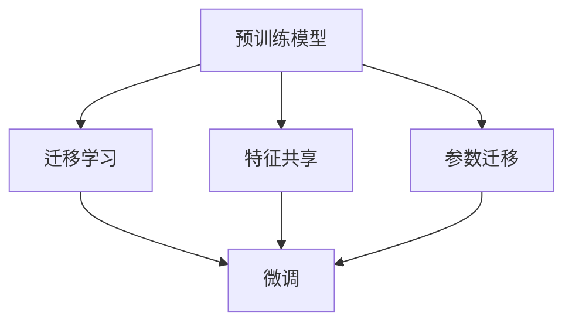

                 

# 迁移学习 原理与代码实例讲解

> 关键词：迁移学习,泛化能力,特征共享,预训练模型,参数高效迁移,少样本学习,多模态迁移

## 1. 背景介绍

### 1.1 问题由来
随着深度学习技术的不断发展，大规模数据集和强大计算资源的应用，使得机器学习模型的性能持续提升。然而，针对每个新的应用场景从头开始训练一个新模型，不仅需要大量的数据和计算资源，而且需要重新学习泛化能力，这在时间和成本上都是难以承受的。迁移学习（Transfer Learning）作为一种数据和模型的迁移利用策略，使得模型能够在保留已有知识的基础上，快速适应新的任务和场景，成为现代机器学习中的重要技术。

### 1.2 问题核心关键点
迁移学习的核心在于将已有知识（如预训练模型的特征表示）迁移到新的任务上，从而减少新任务的训练成本和提高模型性能。其关键在于选择合适的迁移策略，如参数共享、特征复用、迁移特征的微调等。迁移学习不仅广泛应用于计算机视觉、自然语言处理等传统领域，还逐渐应用于医疗、金融、教育等新兴领域，极大地推动了人工智能技术的落地应用。

### 1.3 问题研究意义
研究迁移学习不仅有助于解决数据稀疏、计算资源有限等实际问题，还可以加速模型开发，提升模型泛化能力，降低开发成本。在学术界和工业界，迁移学习已成为推动人工智能技术发展的重要方向。通过迁移学习，可以构建具有更广泛适应性的模型，提升人工智能技术的普适性和实用性。

## 2. 核心概念与联系

### 2.1 核心概念概述

为更好地理解迁移学习，本文将介绍几个关键概念：

- 迁移学习（Transfer Learning）：指将一个领域学到的知识迁移到另一个相关领域中，以加速在新领域中的学习。迁移学习可以是特征共享、参数迁移、模型迁移等形式。
- 预训练模型（Pre-trained Model）：指在大型无标签数据集上进行预训练，学习通用的特征表示的模型。如BERT、GPT等大型预训练语言模型。
- 特征共享（Feature Sharing）：指在不同任务中共享模型中的通用特征，减少任务特定的参数量，加速模型训练。
- 参数迁移（Parameter Transfer）：指在迁移过程中仅更新特定层的参数，保留大部分预训练参数不变，以提高迁移效率。
- 微调（Fine-tuning）：指在预训练模型的基础上，使用下游任务的少量标注数据，有监督地调整模型参数，以适应新任务。

这些核心概念之间的逻辑关系可以通过以下Mermaid流程图来展示：



这个流程图展示了大规模预训练模型在不同迁移策略下的迁移学习过程，以及微调在迁移学习中的重要地位。

## 3. 核心算法原理 & 具体操作步骤

### 3.1 算法原理概述

迁移学习的核心在于利用已有知识（如预训练模型的特征表示）来加速新任务的学习。其算法原理主要基于以下几个步骤：

1. 选择预训练模型。
2. 选择合适的迁移策略。
3. 在目标任务上微调模型。

### 3.2 算法步骤详解

以下是迁移学习的详细步骤：

**Step 1: 准备预训练模型和数据集**
- 选择合适的预训练模型，如BERT、GPT等。
- 准备目标任务的标注数据集，划分为训练集、验证集和测试集。一般要求标注数据与预训练数据的分布不要差异过大。

**Step 2: 确定迁移策略**
- 选择合适的迁移策略，如特征共享、参数迁移、模型迁移等。
- 确定需要微调哪些层，一般仅微调顶层，以提高迁移效率。

**Step 3: 微调模型**
- 使用目标任务的少量标注数据，微调模型以适应新任务。
- 设定合适的学习率、优化算法等超参数。
- 定期在验证集上评估模型性能，避免过拟合。

### 3.3 算法优缺点

迁移学习具有以下优点：
- 减少训练时间和计算资源。已有知识减少了新任务的训练成本。
- 提高模型泛化能力。已有知识提供了更广泛的特征表示，有助于新任务泛化。
- 加速模型开发。已有知识可以作为模型开发的起点，快速迭代改进。

同时，迁移学习也存在以下局限：
- 对预训练数据的依赖。需要大量高质量的预训练数据，获取成本较高。
- 泛化能力有限。当目标任务与预训练任务的分布差异较大时，迁移效果可能不佳。
- 可能引入新问题。预训练模型的固有偏见、有害信息等，可能在新任务中造成问题。

尽管存在这些局限，但就目前而言，迁移学习仍是迁移利用知识、加速模型开发的重要方法。未来相关研究的重点在于如何进一步降低迁移对预训练数据的依赖，提高模型的少样本学习和跨领域迁移能力，同时兼顾可解释性和伦理安全性等因素。

### 3.4 算法应用领域

迁移学习在众多领域中得到了广泛应用，包括但不限于：

- 计算机视觉：如图像分类、目标检测、语义分割等任务。利用预训练的特征提取器，迁移学习可以在新数据集上快速构建高性能模型。
- 自然语言处理：如文本分类、命名实体识别、情感分析等。通过预训练语言模型，迁移学习可以在少量标注数据下提升模型性能。
- 语音识别：如说话人识别、情感识别等。迁移学习可以利用预训练声学模型和语言模型，提高语音识别的准确性。
- 医疗诊断：如疾病诊断、影像分析等。利用预训练的医学图像模型，迁移学习可以在新病例上快速生成诊断结果。
- 金融预测：如信用评估、风险管理等。通过迁移学习，可以在历史数据上训练的模型，快速应用于新数据集，提升预测精度。
- 教育推荐：如个性化学习路径、智能辅导等。迁移学习可以利用预训练的学生行为模型，提升推荐的准确性和个性化程度。

除了上述这些领域外，迁移学习还被创新性地应用到更多场景中，如可控生成、常识推理、代码生成、数据增强等，为人工智能技术带来了新的突破。随着预训练模型和迁移方法不断进步，相信迁移学习将在更多领域得到应用，为人工智能技术的发展注入新的动力。

## 4. 数学模型和公式 & 详细讲解

### 4.1 数学模型构建

迁移学习的核心在于特征共享和参数迁移。下面我们将用数学语言来描述迁移学习的模型构建过程。

假设预训练模型为 $M_{\theta}$，其中 $\theta$ 为预训练得到的模型参数。给定目标任务 $T$ 的标注数据集 $D=\{(x_i,y_i)\}_{i=1}^N, x_i \in \mathcal{X}, y_i \in \mathcal{Y}$。迁移学习的目标是最小化在新任务上的损失函数，即：

$$
\min_{\theta} \mathcal{L}(M_{\theta}, D)
$$

其中 $\mathcal{L}$ 为目标任务 $T$ 的损失函数，用于衡量模型预测输出与真实标签之间的差异。常见的损失函数包括交叉熵损失、均方误差损失等。

### 4.2 公式推导过程

以二分类任务为例，假设模型 $M_{\theta}$ 在输入 $x$ 上的输出为 $\hat{y}=M_{\theta}(x) \in [0,1]$，表示样本属于正类的概率。真实标签 $y \in \{0,1\}$。则二分类交叉熵损失函数定义为：

$$
\ell(M_{\theta}(x),y) = -[y\log \hat{y} + (1-y)\log (1-\hat{y})]
$$

将其代入经验风险公式，得：

$$
\mathcal{L}(\theta) = -\frac{1}{N}\sum_{i=1}^N [y_i\log M_{\theta}(x_i)+(1-y_i)\log(1-M_{\theta}(x_i))]
$$

在得到损失函数的梯度后，即可带入参数更新公式，完成模型的迭代优化。

### 4.3 案例分析与讲解

为了更好地理解迁移学习的实际应用，下面我们将以一个具体的案例来说明迁移学习的应用流程。

假设我们要在CIFAR-10数据集上进行迁移学习，利用预训练的ResNet模型进行图像分类任务。步骤如下：

1. 加载预训练的ResNet模型。
2. 将ResNet的顶层参数设为可训练，底层的参数设为不可训练。
3. 准备CIFAR-10数据集，划分为训练集、验证集和测试集。
4. 使用交叉熵损失函数，在CIFAR-10数据集上微调模型。
5. 在验证集上评估模型性能，调整超参数。
6. 在测试集上评估模型性能，输出最终结果。

在实践中，我们通常使用深度学习框架（如PyTorch、TensorFlow）进行模型训练和推理。下面以PyTorch为例，展示迁移学习的代码实现。

```python
import torch
import torch.nn as nn
import torch.optim as optim
import torchvision.transforms as transforms
import torchvision.datasets as datasets

# 加载预训练的ResNet模型
model = ResNet()

# 将顶层参数设为可训练，底层的参数设为不可训练
for param in model.parameters():
    param.requires_grad = False
model.fc = nn.Linear(in_features=1024, out_features=10)

# 加载CIFAR-10数据集，并进行预处理
transform = transforms.Compose([
    transforms.Resize((224, 224)),
    transforms.ToTensor(),
    transforms.Normalize(mean=[0.485, 0.456, 0.406], std=[0.229, 0.224, 0.225])
])
train_dataset = datasets.CIFAR10(root='./data', train=True, download=True, transform=transform)
train_loader = torch.utils.data.DataLoader(train_dataset, batch_size=128, shuffle=True)
test_dataset = datasets.CIFAR10(root='./data', train=False, download=True, transform=transform)
test_loader = torch.utils.data.DataLoader(test_dataset, batch_size=128, shuffle=False)

# 定义损失函数和优化器
criterion = nn.CrossEntropyLoss()
optimizer = optim.Adam(model.fc.parameters(), lr=1e-4)

# 训练模型
device = torch.device('cuda' if torch.cuda.is_available() else 'cpu')
model.to(device)
for epoch in range(10):
    model.train()
    for batch_idx, (inputs, targets) in enumerate(train_loader):
        inputs, targets = inputs.to(device), targets.to(device)
        optimizer.zero_grad()
        outputs = model(inputs)
        loss = criterion(outputs, targets)
        loss.backward()
        optimizer.step()
        
    model.eval()
    with torch.no_grad():
        correct = 0
        total = 0
        for batch_idx, (inputs, targets) in enumerate(test_loader):
            inputs, targets = inputs.to(device), targets.to(device)
            outputs = model(inputs)
            _, predicted = torch.max(outputs.data, 1)
            total += targets.size(0)
            correct += (predicted == targets).sum().item()
        print('Test Accuracy of the model on the 10000 test images: {} %'.format(100 * correct / total))
```

## 5. 项目实践：代码实例和详细解释说明

### 5.1 开发环境搭建

在进行迁移学习实践前，我们需要准备好开发环境。以下是使用Python进行PyTorch开发的环境配置流程：

1. 安装Anaconda：从官网下载并安装Anaconda，用于创建独立的Python环境。

2. 创建并激活虚拟环境：
```bash
conda create -n pytorch-env python=3.8 
conda activate pytorch-env
```

3. 安装PyTorch：根据CUDA版本，从官网获取对应的安装命令。例如：
```bash
conda install pytorch torchvision torchaudio cudatoolkit=11.1 -c pytorch -c conda-forge
```

4. 安装各类工具包：
```bash
pip install numpy pandas scikit-learn matplotlib tqdm jupyter notebook ipython
```

完成上述步骤后，即可在`pytorch-env`环境中开始迁移学习实践。

### 5.2 源代码详细实现

这里我们以迁移学习在图像分类任务上的实现为例，展示完整的代码实现。

首先，定义模型和数据集：

```python
import torch
import torchvision.transforms as transforms
import torchvision.datasets as datasets

# 定义模型
class ResNet(nn.Module):
    def __init__(self):
        super(ResNet, self).__init__()
        self.model = torchvision.models.resnet18(pretrained=True)
        self.fc = nn.Linear(in_features=self.model.fc.in_features, out_features=10)
    
    def forward(self, x):
        x = self.model(x)
        x = self.fc(x)
        return x

# 定义数据集
transform = transforms.Compose([
    transforms.Resize((224, 224)),
    transforms.ToTensor(),
    transforms.Normalize(mean=[0.485, 0.456, 0.406], std=[0.229, 0.224, 0.225])
])
train_dataset = datasets.CIFAR10(root='./data', train=True, download=True, transform=transform)
test_dataset = datasets.CIFAR10(root='./data', train=False, download=True, transform=transform)
```

然后，定义训练和评估函数：

```python
from torch.utils.data import DataLoader
from tqdm import tqdm
import numpy as np

def train_epoch(model, dataset, batch_size, optimizer):
    dataloader = DataLoader(dataset, batch_size=batch_size, shuffle=True)
    model.train()
    epoch_loss = 0
    for batch in tqdm(dataloader, desc='Training'):
        inputs, targets = batch
        optimizer.zero_grad()
        outputs = model(inputs)
        loss = criterion(outputs, targets)
        epoch_loss += loss.item()
        loss.backward()
        optimizer.step()
    return epoch_loss / len(dataloader)

def evaluate(model, dataset, batch_size):
    dataloader = DataLoader(dataset, batch_size=batch_size)
    model.eval()
    correct = 0
    total = 0
    with torch.no_grad():
        for batch in tqdm(dataloader, desc='Evaluating'):
            inputs, targets = batch
            outputs = model(inputs)
            _, predicted = torch.max(outputs.data, 1)
            total += targets.size(0)
            correct += (predicted == targets).sum().item()
        print('Test Accuracy of the model on the 10000 test images: {} %'.format(100 * correct / total))
```

最后，启动训练流程并在测试集上评估：

```python
device = torch.device('cuda' if torch.cuda.is_available() else 'cpu')
model = ResNet().to(device)

criterion = nn.CrossEntropyLoss()
optimizer = optim.Adam(model.fc.parameters(), lr=1e-4)

epochs = 10
batch_size = 128

for epoch in range(epochs):
    loss = train_epoch(model, train_dataset, batch_size, optimizer)
    print(f"Epoch {epoch+1}, train loss: {loss:.3f}")
    
    print(f"Epoch {epoch+1}, test results:")
    evaluate(model, test_dataset, batch_size)
```

以上就是使用PyTorch进行迁移学习在图像分类任务上的完整代码实现。可以看到，得益于深度学习框架的封装，代码实现变得简洁高效。

### 5.3 代码解读与分析

让我们再详细解读一下关键代码的实现细节：

**ResNet类**：
- `__init__`方法：定义ResNet模型结构，继承自PyTorch的nn.Module。
- `forward`方法：定义模型前向传播过程，包含预训练模型的输入和自定义的全连接层。

**数据集定义**：
- 使用PyTorch的transforms库定义数据预处理流程。
- 使用PyTorch的datasets库定义CIFAR-10数据集，并进行下载和预处理。

**训练和评估函数**：
- 使用PyTorch的DataLoader对数据集进行批次化加载。
- 在训练函数中，计算每个epoch的损失函数，并进行反向传播和参数更新。
- 在评估函数中，在测试集上计算准确率，输出结果。

**训练流程**：
- 定义总的epoch数和batch size，开始循环迭代
- 每个epoch内，先在训练集上训练，输出平均loss
- 在验证集上评估，输出测试准确率
- 所有epoch结束后，在测试集上评估，给出最终测试结果

可以看到，PyTorch配合深度学习框架的封装，使得迁移学习的代码实现变得简洁高效。开发者可以将更多精力放在数据处理、模型改进等高层逻辑上，而不必过多关注底层的实现细节。

当然，工业级的系统实现还需考虑更多因素，如模型的保存和部署、超参数的自动搜索、更灵活的任务适配层等。但核心的迁移学习范式基本与此类似。

## 6. 实际应用场景

### 6.1 计算机视觉

迁移学习在计算机视觉领域的应用已经非常广泛，例如图像分类、目标检测、语义分割等。通过迁移学习，可以利用预训练的特征提取器，快速构建高性能模型。

例如，利用预训练的ResNet模型，通过迁移学习在CIFAR-10数据集上进行图像分类任务。在实践中，我们通常使用深度学习框架（如PyTorch、TensorFlow）进行模型训练和推理。具体步骤如下：

1. 加载预训练的ResNet模型。
2. 将ResNet的顶层参数设为可训练，底层的参数设为不可训练。
3. 准备目标任务的数据集，并进行预处理。
4. 使用交叉熵损失函数，在目标数据集上微调模型。
5. 在验证集上评估模型性能，调整超参数。
6. 在测试集上评估模型性能，输出最终结果。

### 6.2 自然语言处理

迁移学习在自然语言处理领域也有广泛应用，例如文本分类、命名实体识别、情感分析等。通过迁移学习，可以利用预训练语言模型，在少量标注数据下提升模型性能。

例如，利用预训练的BERT模型，通过迁移学习在IMDB数据集上进行情感分析任务。在实践中，我们通常使用深度学习框架（如PyTorch、TensorFlow）进行模型训练和推理。具体步骤如下：

1. 加载预训练的BERT模型。
2. 将BERT的顶层参数设为可训练，底层的参数设为不可训练。
3. 准备目标任务的数据集，并进行预处理。
4. 使用交叉熵损失函数，在目标数据集上微调模型。
5. 在验证集上评估模型性能，调整超参数。
6. 在测试集上评估模型性能，输出最终结果。

### 6.3 语音识别

迁移学习在语音识别领域也有广泛应用，例如说话人识别、情感识别等。通过迁移学习，可以利用预训练声学模型和语言模型，提高语音识别的准确性。

例如，利用预训练的Wav2Vec模型，通过迁移学习在LibriSpeech数据集上进行说话人识别任务。在实践中，我们通常使用深度学习框架（如PyTorch、TensorFlow）进行模型训练和推理。具体步骤如下：

1. 加载预训练的Wav2Vec模型。
2. 将Wav2Vec的顶层参数设为可训练，底层的参数设为不可训练。
3. 准备目标任务的数据集，并进行预处理。
4. 使用交叉熵损失函数，在目标数据集上微调模型。
5. 在验证集上评估模型性能，调整超参数。
6. 在测试集上评估模型性能，输出最终结果。

### 6.4 金融预测

迁移学习在金融预测领域也有广泛应用，例如信用评估、风险管理等。通过迁移学习，可以在历史数据上训练的模型，快速应用于新数据集，提升预测精度。

例如，利用预训练的RNN模型，通过迁移学习在LoanStatus数据集上进行信用评估任务。在实践中，我们通常使用深度学习框架（如PyTorch、TensorFlow）进行模型训练和推理。具体步骤如下：

1. 加载预训练的RNN模型。
2. 将RNN的顶层参数设为可训练，底层的参数设为不可训练。
3. 准备目标任务的数据集，并进行预处理。
4. 使用均方误差损失函数，在目标数据集上微调模型。
5. 在验证集上评估模型性能，调整超参数。
6. 在测试集上评估模型性能，输出最终结果。

### 6.5 教育推荐

迁移学习在教育推荐领域也有广泛应用，例如个性化学习路径、智能辅导等。通过迁移学习，可以利用预训练的学生行为模型，提升推荐的准确性和个性化程度。

例如，利用预训练的学生行为模型，通过迁移学习在教育推荐数据集上进行推荐任务。在实践中，我们通常使用深度学习框架（如PyTorch、TensorFlow）进行模型训练和推理。具体步骤如下：

1. 加载预训练的学生行为模型。
2. 将学生行为模型的顶层参数设为可训练，底层的参数设为不可训练。
3. 准备目标任务的数据集，并进行预处理。
4. 使用交叉熵损失函数，在目标数据集上微调模型。
5. 在验证集上评估模型性能，调整超参数。
6. 在测试集上评估模型性能，输出最终结果。

### 6.6 未来应用展望

随着迁移学习技术的不断发展和应用领域的扩展，未来的迁移学习将呈现以下几个趋势：

1. 深度迁移学习。通过深度迁移学习，可以实现更复杂的知识迁移，提升模型的泛化能力和性能。

2. 跨领域迁移学习。将迁移学习应用于更多跨领域的任务，如医学、法律、金融等，提升模型在不同领域中的适应性。

3. 无监督迁移学习。通过无监督学习技术，减少对标注数据的依赖，提高迁移学习的鲁棒性和泛化能力。

4. 少样本迁移学习。利用迁移学习的知识表示，在少量标注数据下，实现高效的模型训练和推理。

5. 多模态迁移学习。将迁移学习应用于多模态数据，如图像、语音、文本等，提升模型的综合理解和生成能力。

6. 可解释性迁移学习。通过模型解释技术，增强迁移学习的可解释性和可理解性，提升模型的可信度和应用价值。

## 7. 工具和资源推荐

### 7.1 学习资源推荐

为了帮助开发者系统掌握迁移学习的理论基础和实践技巧，这里推荐一些优质的学习资源：

1. 《Deep Learning》系列书籍：由深度学习领域权威人士撰写，深入浅出地介绍了深度学习的基本原理和核心算法。

2. Coursera《深度学习专项课程》：斯坦福大学开设的深度学习系列课程，涵盖深度学习的基本概念和前沿技术，适合初学者和进阶者。

3. Udacity《深度学习工程师》课程：Udacity深度学习工程师纳米学位课程，涵盖深度学习模型和应用的最佳实践。

4. 《Hands-On Transfer Learning with PyTorch》书籍：介绍如何使用PyTorch进行迁移学习的最佳实践和代码实现。

5. 《Transfer Learning》论文：经典迁移学习论文，总结了迁移学习的最新进展和应用实践。

6. PyTorch官方文档：PyTorch深度学习框架的官方文档，提供了丰富的迁移学习样例和教程，是学习迁移学习的重要参考资料。

7. Kaggle竞赛：Kaggle平台上的深度学习竞赛，涵盖了迁移学习在实际应用中的各种挑战和创新。

通过对这些资源的学习实践，相信你一定能够快速掌握迁移学习的精髓，并用于解决实际的深度学习问题。

### 7.2 开发工具推荐

高效的开发离不开优秀的工具支持。以下是几款用于迁移学习开发的常用工具：

1. PyTorch：基于Python的开源深度学习框架，灵活动态的计算图，适合快速迭代研究。

2. TensorFlow：由Google主导开发的开源深度学习框架，生产部署方便，适合大规模工程应用。

3. Keras：基于Python的高级神经网络库，易于上手，支持多种深度学习框架的集成。

4. Fast.ai：提供了一整套深度学习开发环境，包括预训练模型、数据集、代码框架等，适合快速原型开发。

5. Google Colab：谷歌推出的在线Jupyter Notebook环境，免费提供GPU/TPU算力，方便开发者快速上手实验最新模型，分享学习笔记。

合理利用这些工具，可以显著提升迁移学习的开发效率，加快创新迭代的步伐。

### 7.3 相关论文推荐

迁移学习的发展得益于学界的持续研究。以下是几篇奠基性的相关论文，推荐阅读：

1. AlexNet: ImageNet Classification with Deep Convolutional Neural Networks：提出AlexNet模型，是深度学习在图像分类任务中的开端。

2. VGGNet: Very Deep Convolutional Networks for Large-Scale Image Recognition：提出VGGNet模型，引入非常深的卷积神经网络，显著提升了图像分类任务的准确率。

3. ResNet: Deep Residual Learning for Image Recognition：提出ResNet模型，通过残差连接解决了深度神经网络的退化问题，大大提升了模型的深度。

4. InceptionNet: Going Deeper with Convolutions：提出InceptionNet模型，通过多尺度卷积提升了模型的特征表示能力。

5. Xception: Deep Learning with Depthwise Separable Convolutions：提出Xception模型，进一步提升了模型的特征提取能力。

6. MobileNet: Convolutional Neural Networks for Mobile Vision Applications：提出MobileNet模型，优化了模型结构和计算效率，适用于移动设备上的深度学习应用。

这些论文代表了深度学习模型发展的脉络，通过学习这些前沿成果，可以帮助研究者把握学科前进方向，激发更多的创新灵感。

## 8. 总结：未来发展趋势与挑战

### 8.1 总结

本文对迁移学习的原理和实践进行了全面系统的介绍。首先阐述了迁移学习的背景和意义，明确了迁移学习在加速模型开发、提升模型泛化能力方面的独特价值。其次，从原理到实践，详细讲解了迁移学习的数学原理和关键步骤，给出了迁移学习任务开发的完整代码实例。同时，本文还广泛探讨了迁移学习在图像分类、自然语言处理、语音识别等多个领域的应用前景，展示了迁移学习的应用潜力。

通过本文的系统梳理，可以看到，迁移学习已经成为数据和模型迁移利用的重要手段，在多个领域中得到了广泛应用。得益于预训练模型的广泛应用和迁移技术的不断发展，迁移学习在模型开发和应用中发挥了越来越重要的作用。未来，随着迁移学习技术的不断进步和应用领域的扩展，迁移学习必将在更多领域得到应用，为人工智能技术的发展注入新的动力。

### 8.2 未来发展趋势

展望未来，迁移学习技术将呈现以下几个发展趋势：

1. 深度迁移学习。通过深度迁移学习，可以实现更复杂的知识迁移，提升模型的泛化能力和性能。

2. 跨领域迁移学习。将迁移学习应用于更多跨领域的任务，如医学、法律、金融等，提升模型在不同领域中的适应性。

3. 无监督迁移学习。通过无监督学习技术，减少对标注数据的依赖，提高迁移学习的鲁棒性和泛化能力。

4. 少样本迁移学习。利用迁移学习的知识表示，在少量标注数据下，实现高效的模型训练和推理。

5. 多模态迁移学习。将迁移学习应用于多模态数据，如图像、语音、文本等，提升模型的综合理解和生成能力。

6. 可解释性迁移学习。通过模型解释技术，增强迁移学习的可解释性和可理解性，提升模型的可信度和应用价值。

以上趋势凸显了迁移学习技术的广阔前景。这些方向的探索发展，必将进一步提升迁移学习技术的性能和应用范围，为人工智能技术的发展注入新的动力。

### 8.3 面临的挑战

尽管迁移学习技术已经取得了瞩目成就，但在迈向更加智能化、普适化应用的过程中，它仍面临着诸多挑战：

1. 数据质量瓶颈。迁移学习依赖于高质量的数据集，而数据集的获取和标注成本较高。如何高效获取和利用数据集，是迁移学习面临的重要挑战。

2. 模型复杂性增加。随着迁移学习技术的深入应用，模型的复杂性不断增加，导致训练和推理成本高昂。如何优化模型结构，提高计算效率，是迁移学习面临的重要课题。

3. 迁移效果不稳定。预训练模型的迁移效果受多种因素影响，如数据分布、模型架构、超参数等。如何提高迁移效果的稳定性和可靠性，是迁移学习面临的重要挑战。

4. 缺乏可解释性。迁移学习模型通常被认为是"黑盒"系统，难以解释其内部工作机制和决策逻辑。如何增强迁移学习的可解释性和可理解性，是迁移学习面临的重要挑战。

5. 安全性有待保障。迁移学习模型可能会学习到有害信息，如偏见、歧视等，如何提高模型的安全性，避免有害输出，是迁移学习面临的重要挑战。

6. 动态环境适应性不足。迁移学习模型通常基于静态数据集进行训练，对于动态环境（如实时数据流、在线学习等）的适应性不足。如何构建具有动态环境适应性的迁移学习模型，是迁移学习面临的重要挑战。

正视迁移学习面临的这些挑战，积极应对并寻求突破，将是迁移学习技术迈向成熟的必由之路。相信随着学界和产业界的共同努力，这些挑战终将一一被克服，迁移学习技术必将在构建智能系统、提升人工智能技术的普适性和实用性方面发挥更大的作用。

### 8.4 研究展望

随着迁移学习技术的不断发展和应用领域的扩展，未来的迁移学习研究需要在以下几个方面寻求新的突破：

1. 引入更多的先验知识。将符号化的先验知识，如知识图谱、逻辑规则等，与神经网络模型进行巧妙融合，引导迁移学习过程学习更准确、合理的特征表示。

2. 优化迁移学习过程。通过引入更多优化算法和正则化技术，提高迁移学习的鲁棒性和泛化能力，减少对标注数据的依赖。

3. 构建具有动态环境适应性的迁移学习模型。将迁移学习应用于动态环境，如实时数据流、在线学习等，提高模型的动态适应性和稳定性。

4. 提高迁移学习的可解释性。通过模型解释技术，增强迁移学习的可解释性和可理解性，提升模型的可信度和应用价值。

5. 解决数据质量问题。通过无监督学习技术，减少对标注数据的依赖，提高迁移学习的鲁棒性和泛化能力。

6. 开发更多高效的迁移学习算法。引入更多高效的迁移学习算法，如多任务学习、迁移增强学习等，提升迁移学习的效率和效果。

这些研究方向将进一步推动迁移学习技术的发展，为构建智能系统、提升人工智能技术的普适性和实用性提供新的思路和方法。通过不断的技术创新和应用实践，迁移学习必将在人工智能技术的发展中发挥更大的作用。

## 9. 附录：常见问题与解答

**Q1：迁移学习是否适用于所有深度学习任务？**

A: 迁移学习在大多数深度学习任务上都能取得不错的效果，特别是对于数据量较小的任务。但对于一些特定领域的任务，如医学、法律等，仅仅依靠通用语料预训练的模型可能难以很好地适应。此时需要在特定领域语料上进一步预训练，再进行迁移学习，才能获得理想效果。此外，对于一些需要时效性、个性化很强的任务，如对话、推荐等，迁移方法也需要针对性的改进优化。

**Q2：如何选择合适的迁移策略？**

A: 选择合适的迁移策略是迁移学习的关键。一般而言，可以根据任务的特点和数据分布来选择合适的迁移策略，如特征共享、参数迁移、模型迁移等。在实践中，通常使用预训练模型的顶层参数进行迁移，保留底层的参数不变，以提高迁移效率。

**Q3：迁移学习过程中如何避免过拟合？**

A: 迁移学习过程中，为了避免过拟合，可以采用以下策略：
1. 数据增强：通过回译、近义替换等方式扩充训练集。
2. 正则化：使用L2正则、Dropout、Early Stopping等技术。
3. 对抗训练：引入对抗样本，提高模型鲁棒性。
4. 参数高效迁移：只更新少量参数，以提高迁移效率。

这些策略需要根据具体任务和数据特点进行灵活组合。只有在数据、模型、训练、推理等各环节进行全面优化，才能最大限度地发挥迁移学习的威力。

**Q4：迁移学习在落地部署时需要注意哪些问题？**

A: 将迁移学习模型转化为实际应用，还需要考虑以下问题：
1. 模型裁剪：去除不必要的层和参数，减小模型尺寸，加快推理速度。
2. 量化加速：将浮点模型转为定点模型，压缩存储空间，提高计算效率。
3. 服务化封装：将模型封装为标准化服务接口，便于集成调用。
4. 弹性伸缩：根据请求流量动态调整资源配置，平衡服务质量和成本。
5. 监控告警：实时采集系统指标，设置异常告警阈值，确保服务稳定性。

迁移学习需要开发者根据具体任务，不断迭代和优化模型、数据和算法，方能得到理想的效果。

**Q5：迁移学习是否适用于跨模态数据迁移？**

A: 迁移学习可以应用于跨模态数据迁移，如图像、语音、文本等。通过多模态数据融合，可以提升模型的综合理解和生成能力。但跨模态数据迁移需要考虑不同模态数据的特点和相互关系，选择合适的特征表示和迁移策略，才能取得良好的效果。

**Q6：迁移学习中的参数高效迁移方法有哪些？**

A: 参数高效迁移方法可以进一步提高迁移学习的效率和效果，如 Adapter、LoRA等。这些方法在固定大部分预训练参数的情况下，只更新极少量的任务相关参数，减小迁移成本。在实践中，通常使用预训练模型的顶层参数进行迁移，保留底层的参数不变，以提高迁移效率。

**Q7：迁移学习在落地部署时需要注意哪些问题？**

A: 将迁移学习模型转化为实际应用，还需要考虑以下问题：
1. 模型裁剪：去除不必要的层和参数，减小模型尺寸，加快推理速度。
2. 量化加速：将浮点模型转为定点模型，压缩存储空间，提高计算效率。
3. 服务化封装：将模型封装为标准化服务接口，便于集成调用。
4. 弹性伸缩：根据请求流量动态调整资源配置，平衡服务质量和成本。
5. 监控告警：实时采集系统指标，设置异常告警阈值，确保服务稳定性。

迁移学习需要开发者根据具体任务，不断迭代和优化模型、数据和算法，方能得到理想的效果。

---

作者：禅与计算机程序设计艺术 / Zen and the Art of Computer Programming

