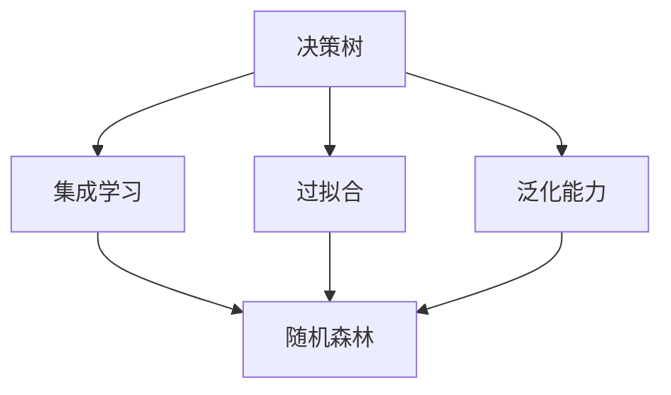

                 

## 1. 背景介绍

随机森林（Random Forests）是一种基于决策树的集成学习方法，它在机器学习和数据挖掘领域中有着广泛的应用。随机森林的提出者是李威（Leo Breiman），他在1996年的一篇名为《Bagging Predictors》的论文中首次提出了这个算法。

### 1.1 问题由来
在机器学习领域，决策树算法由于其简单直观、易于解释等特点，成为了一个非常受欢迎的分类和回归算法。然而，决策树也有其固有的问题：当数据集中的特征数量较多时，决策树的复杂度会变得很高，容易过拟合；此外，单个决策树也不具备泛化能力。

随机森林算法正是在这种情况下诞生的。它通过对决策树进行集成学习，利用决策树之间的交互作用，达到降低方差、提高稳定性和准确性的目的。

### 1.2 问题核心关键点
随机森林的核心思想是：通过随机抽样和特征选择，构建多个决策树，然后通过投票的方式决定最终的预测结果。具体而言，随机森林包含以下几个核心关键点：

- 随机抽样：在每个决策树中，随机选择训练数据进行训练。
- 特征选择：在每个决策树中，随机选择特征进行划分。
- 决策树集成：多个决策树通过投票或平均的方式决定最终预测结果。
- 随机性：通过引入随机性，随机森林可以有效避免过拟合问题。

## 2. 核心概念与联系

### 2.1 核心概念概述

为了更好地理解随机森林算法，我们首先需要了解一些相关的核心概念：

- **决策树（Decision Tree）**：是一种基于树结构的分类或回归算法。决策树通过一系列的条件判断，将数据集不断划分，直到到达叶节点，并给出最终的预测结果。
- **集成学习（Ensemble Learning）**：是指将多个单一模型的预测结果进行集成，以达到更准确、更稳定的预测结果。集成学习包括 Bagging、Boosting、Stacking 等多种方法。
- **过拟合（Overfitting）**：是指模型在训练集上表现良好，但在测试集上表现不佳的现象。过拟合通常发生在模型复杂度过高的情况下。
- **泛化能力（Generalization）**：是指模型在新数据上的表现能力。泛化能力强的模型能够在未见过的数据上表现良好。

这些核心概念之间的逻辑关系可以通过以下Mermaid流程图来展示：



这个流程图展示了几组核心概念之间的逻辑关系：

1. 决策树是集成学习的核心组成部分。
2. 过拟合和泛化能力是评估模型表现的重要指标。
3. 随机森林通过引入随机性，可以有效避免过拟合问题，并提升模型的泛化能力。

## 3. 核心算法原理 & 具体操作步骤
### 3.1 算法原理概述

随机森林算法的基本思想是通过随机抽样和特征选择，构建多个决策树，然后通过投票的方式决定最终的预测结果。随机森林的训练过程分为以下步骤：

1. 从原始数据集中随机选择 $m$ 个样本（$m$ 通常为训练样本的 $\sqrt{n}$，$n$ 为训练样本数量）。
2. 从原始特征集中随机选择 $p$ 个特征（$p$ 通常为特征总数的 $\sqrt{k}$，$k$ 为特征数量）。
3. 在选定的样本和特征上，使用决策树算法训练单个决策树。
4. 对每个决策树进行预测，并取投票结果或平均值作为最终预测结果。

通过上述步骤，随机森林算法构建了一个集成模型，具有以下优势：

- 随机性：通过随机抽样和特征选择，减少了过拟合的风险。
- 稳定性：多个决策树的投票结果可以降低方差，提高模型的泛化能力。
- 并行性：随机森林可以通过并行计算，提升训练速度。

### 3.2 算法步骤详解

随机森林算法的训练过程可以分为以下几个步骤：

**Step 1: 准备数据集**
- 将数据集划分为训练集和测试集。
- 对数据集进行预处理，如归一化、缺失值处理等。

**Step 2: 创建随机森林模型**
- 设定随机森林的参数，如树的数量、叶子节点的大小、最大深度等。
- 使用随机森林算法进行训练。

**Step 3: 模型评估与优化**
- 在测试集上评估模型的准确率和泛化能力。
- 根据评估结果调整模型参数，进一步优化模型性能。

**Step 4: 预测**
- 使用训练好的模型进行预测，得到最终的预测结果。

### 3.3 算法优缺点

随机森林算法具有以下优点：

- 可解释性：通过投票机制，随机森林可以给出每个特征的贡献度，提高了模型的可解释性。
- 抗过拟合能力强：通过随机抽样和特征选择，可以有效避免过拟合问题。
- 计算效率高：随机森林可以并行计算，训练速度快。

同时，随机森林算法也存在以下缺点：

- 对噪声敏感：随机森林对于噪声数据的处理不够有效。
- 难以处理缺失数据：随机森林对于缺失数据的处理需要特殊处理。
- 模型复杂度高：随机森林的参数设置较多，调参较难。

### 3.4 算法应用领域

随机森林算法在多个领域中有着广泛的应用，包括但不限于：

- 金融风险评估：用于预测股票市场的趋势，评估贷款违约风险等。
- 医疗诊断：用于预测患者病情，评估治疗效果等。
- 图像识别：用于图像分类、目标检测等任务。
- 自然语言处理：用于文本分类、情感分析等任务。
- 推荐系统：用于用户行为预测、商品推荐等。

## 4. 数学模型和公式 & 详细讲解
### 4.1 数学模型构建

随机森林算法的数学模型构建基于决策树的分类模型。假设我们有一组训练数据 $(x_i, y_i)$，其中 $x_i \in \mathbb{R}^n$ 为输入特征向量，$y_i \in \{0, 1\}$ 为输出标签。我们的目标是构建一个随机森林模型 $f_{\theta}$，使得 $f_{\theta}(x)$ 能够尽可能准确地预测 $y$。

随机森林模型的构建过程如下：

1. 从原始数据集中随机选择 $m$ 个样本 $x_i^{(1)}, x_i^{(2)}, \cdots, x_i^{(m)}$。
2. 从原始特征集中随机选择 $p$ 个特征 $f_{j_1}, f_{j_2}, \cdots, f_{j_p}$。
3. 使用决策树算法对选定的样本和特征进行训练，得到决策树 $T_1, T_2, \cdots, T_M$。
4. 对每个决策树进行预测，并取投票结果或平均值作为最终预测结果。

### 4.2 公式推导过程

下面，我们将对随机森林模型的公式进行推导。假设我们有 $n$ 个样本，$m$ 个决策树，每个决策树有 $k$ 个叶子节点。设 $T_j$ 表示第 $j$ 个决策树，$y_{T_j}(x)$ 表示在决策树 $T_j$ 上的预测结果。

假设输入特征 $x$ 属于第 $j$ 个决策树的第 $k$ 个叶子节点，则 $y_{T_j}(x)$ 可以表示为：

$$
y_{T_j}(x) = 
\begin{cases}
1, & \text{if node } k \text{ is a leaf node and } \text{node } k \text{ of tree } T_j \text{ is on the left branch} \\
0, & \text{if node } k \text{ is a leaf node and } \text{node } k \text{ of tree } T_j \text{ is on the right branch}
\end{cases}
$$

因此，随机森林的预测结果 $y_{RF}(x)$ 可以表示为：

$$
y_{RF}(x) = \frac{1}{M} \sum_{j=1}^{M} y_{T_j}(x)
$$

### 4.3 案例分析与讲解

我们可以使用一个简单的二分类问题来解释随机森林的预测过程。假设有以下数据集：

| $x_1$ | $x_2$ | $y$ |
| --- | --- | --- |
| 1 | 2 | 0 |
| 1 | 3 | 0 |
| 2 | 1 | 0 |
| 2 | 2 | 1 |
| 3 | 1 | 1 |
| 3 | 2 | 1 |

我们随机选择 4 个样本进行训练，并随机选择 2 个特征进行划分。假设第一棵决策树的根节点为 $x_1$ 和 $x_2$，划分为两个子节点 $x_1 \leq 2$ 和 $x_1 > 2$。假设在第一个子节点上，我们选择 $x_2$ 作为划分特征，将数据集划分为两个子集。假设在第一个子集上，我们选择 $x_2 \leq 2$ 作为划分特征，将数据集划分为两个子集。在第二个子集上，我们选择 $x_2 > 2$ 作为划分特征，将数据集划分为两个子集。最终得到如下决策树：

| 决策树 | 叶子节点 | 预测结果 |
| --- | --- | --- |
| $T_1$ | $x_1 \leq 2$ 和 $x_2 \leq 2$ | 0 |
| $T_1$ | $x_1 \leq 2$ 和 $x_2 > 2$ | 0 |
| $T_2$ | $x_1 > 2$ 和 $x_2 \leq 2$ | 0 |
| $T_2$ | $x_1 > 2$ 和 $x_2 > 2$ | 1 |

对于新数据 $x' = (1, 4)$，我们可以将其输入到每个决策树中，得到 $y_{T_1}(x') = 0$ 和 $y_{T_2}(x') = 1$，因此随机森林的预测结果为 $y_{RF}(x') = \frac{1}{2}(0 + 1) = 0.5$。

## 5. 项目实践：代码实例和详细解释说明
### 5.1 开发环境搭建

在进行随机森林实践前，我们需要准备好开发环境。以下是使用Python进行Scikit-learn开发的环境配置流程：

1. 安装Anaconda：从官网下载并安装Anaconda，用于创建独立的Python环境。

2. 创建并激活虚拟环境：
```bash
conda create -n sklearn-env python=3.8 
conda activate sklearn-env
```

3. 安装Scikit-learn：
```bash
conda install scikit-learn
```

4. 安装各类工具包：
```bash
pip install numpy pandas matplotlib scikit-learn seaborn
```

完成上述步骤后，即可在`sklearn-env`环境中开始随机森林实践。

### 5.2 源代码详细实现

下面我们以iris数据集为例，给出使用Scikit-learn库对随机森林进行构建的Python代码实现。

首先，导入必要的库：

```python
import numpy as np
import pandas as pd
from sklearn.model_selection import train_test_split
from sklearn.ensemble import RandomForestClassifier
from sklearn.metrics import accuracy_score, confusion_matrix
```

然后，加载数据集：

```python
# 加载鸢尾花数据集
iris = pd.read_csv('iris.csv')
```

接着，数据预处理：

```python
# 将数据集分为特征和标签
X = iris.drop(['species'], axis=1)
y = iris['species']

# 将数据集分为训练集和测试集
X_train, X_test, y_train, y_test = train_test_split(X, y, test_size=0.2, random_state=42)
```

接下来，构建随机森林模型并进行训练：

```python
# 创建随机森林模型
clf = RandomForestClassifier(n_estimators=100, random_state=42)

# 训练模型
clf.fit(X_train, y_train)
```

最后，评估模型并输出预测结果：

```python
# 在测试集上评估模型性能
y_pred = clf.predict(X_test)

# 计算准确率
accuracy = accuracy_score(y_test, y_pred)
print(f"Accuracy: {accuracy:.2f}")
```

## 6. 实际应用场景
### 6.1 金融风险评估

在金融领域，随机森林算法可以用于预测股票市场的趋势、评估贷款违约风险等。金融机构可以利用随机森林模型，根据历史交易数据和市场指标，预测未来的投资趋势和风险水平，从而帮助投资者做出更加理性的决策。

### 6.2 医疗诊断

在医疗领域，随机森林算法可以用于预测患者的病情、评估治疗效果等。医院可以利用随机森林模型，根据患者的病历数据和基因信息，预测其患病的概率和治疗效果，从而提供更加个性化的医疗方案。

### 6.3 图像识别

在计算机视觉领域，随机森林算法可以用于图像分类、目标检测等任务。例如，在医学影像分析中，随机森林模型可以自动识别出肿瘤、病灶等重要区域，从而帮助医生进行诊断和治疗。

### 6.4 自然语言处理

在自然语言处理领域，随机森林算法可以用于文本分类、情感分析等任务。例如，在社交媒体分析中，随机森林模型可以根据用户的评论和回复，判断其情感倾向，从而帮助企业了解用户的满意度。

## 7. 工具和资源推荐
### 7.1 学习资源推荐

为了帮助开发者系统掌握随机森林的理论基础和实践技巧，这里推荐一些优质的学习资源：

1. 《Python机器学习基础教程》：由李宏毅教授主讲的在线课程，涵盖了随机森林算法的理论基础和实际应用。

2. Scikit-learn官方文档：Scikit-learn库的官方文档，提供了详尽的随机森林算法介绍和样例代码。

3. 《机器学习实战》：由Peter Harrington 著的实战书籍，介绍了随机森林算法的基本原理和实现方法。

4. Kaggle竞赛平台：Kaggle上有很多与随机森林相关的竞赛和项目，可以通过实战学习随机森林算法的应用。

5. Coursera《机器学习》课程：由Andrew Ng教授主讲的在线课程，涵盖了机器学习的基本概念和算法，包括随机森林算法。

通过对这些资源的学习实践，相信你一定能够快速掌握随机森林算法的精髓，并用于解决实际的机器学习问题。
###  7.2 开发工具推荐

高效的开发离不开优秀的工具支持。以下是几款用于随机森林开发的常用工具：

1. Jupyter Notebook：开源的交互式编程环境，支持Python和Scikit-learn库，方便进行代码调试和结果展示。

2. Visual Studio Code：微软开源的IDE，支持Python开发，提供了丰富的扩展和插件，方便进行代码编写和调试。

3. Scikit-learn库：由Facebook开发的机器学习库，提供了丰富的机器学习算法和工具，包括随机森林算法。

4. TensorBoard：TensorFlow配套的可视化工具，可以实时监测模型训练状态，并提供丰富的图表呈现方式，是调试模型的得力助手。

5. Weights & Biases：模型训练的实验跟踪工具，可以记录和可视化模型训练过程中的各项指标，方便对比和调优。

合理利用这些工具，可以显著提升随机森林开发的效率，加快创新迭代的步伐。

### 7.3 相关论文推荐

随机森林算法在机器学习领域已经得到了广泛的研究和应用。以下是几篇奠基性的相关论文，推荐阅读：

1. Breiman, L. (2001). Random Forests. Machine Learning, 45(1), 5-32.

2. Ho, T. K. (1998). The random subspace method for constructing decision forests. Pattern Analysis and Machine Intelligence, IEEE Transactions on, 20(8), 832-844.

3. Quinlan, J. R. (1986). Induction of decision trees. Machine Learning, 1(1), 81-106.

4. Hortaçsu, A., & Frey, B. J. (2009). An experiment with random forests. Journal of Computational and Graphical Statistics, 18(2), 303-314.

5. Chen, P. S., & Chen, W. (2018). Decision tree forests for learning large-scale decision models with short histories. In Proceedings of the 2018 ACM SIGKDD International Conference on Knowledge Discovery & Data Mining (pp. 1629-1637).

这些论文代表了一随机森林算法的发展脉络。通过学习这些前沿成果，可以帮助研究者把握学科前进方向，激发更多的创新灵感。

## 8. 总结：未来发展趋势与挑战
### 8.1 总结

本文对随机森林算法进行了全面系统的介绍。首先阐述了随机森林算法的基本思想和应用背景，明确了随机森林在机器学习领域的重要地位。其次，从原理到实践，详细讲解了随机森林算法的数学模型和实际操作步骤，给出了随机森林算法的Python代码实现。同时，本文还探讨了随机森林算法在金融、医疗、计算机视觉、自然语言处理等领域的广泛应用，展示了随机森林算法的巨大潜力。此外，本文还精选了随机森林算法的学习资源和开发工具，力求为读者提供全方位的技术指引。

通过本文的系统梳理，可以看到，随机森林算法在机器学习领域有着广泛的应用和前景。随机森林算法通过引入随机性，提高了模型的泛化能力和稳定性，具有抗过拟合能力强、计算效率高、可解释性好等诸多优点。未来，伴随机器学习技术的不断进步，随机森林算法必将在更多领域发挥重要作用，成为机器学习领域的重要基石。

### 8.2 未来发展趋势

展望未来，随机森林算法将呈现以下几个发展趋势：

1. 参数调优自动化：随着机器学习自动化技术的发展，随机森林算法的参数调优将变得更加智能和高效。

2. 多模态数据融合：随机森林算法可以与其他机器学习算法（如深度学习）进行融合，实现多模态数据的协同建模。

3. 集成学习多样化：除了传统的随机森林算法，未来的集成学习将更加多样化和复杂化，例如使用基于神经网络的集成学习模型。

4. 模型压缩与加速：随着硬件计算能力的提升，随机森林算法的模型压缩与加速技术将更加成熟，提高模型的实时性和可部署性。

5. 可视化与解释：随机森林算法的可视化与解释技术将更加完善，帮助用户更好地理解模型的决策过程。

这些趋势凸显了随机森林算法未来的发展方向，相信在学术界和工业界的共同努力下，随机森林算法将会迎来更加广泛的应用和更强的竞争力。

### 8.3 面临的挑战

尽管随机森林算法已经取得了瞩目成就，但在迈向更加智能化、普适化应用的过程中，它仍面临着诸多挑战：

1. 数据缺失问题：随机森林算法对于缺失数据的处理不够有效，如何更好地处理缺失数据，将是未来的研究重点。

2. 模型复杂度：随机森林算法的模型复杂度较高，如何降低模型的复杂度，提升模型的训练和推理效率，将是未来的研究方向。

3. 泛化能力：随机森林算法在处理非线性数据时存在一定的局限性，如何提高模型的泛化能力，将是未来的研究重点。

4. 并行计算：随机森林算法的并行计算技术虽然已较为成熟，但在分布式计算环境下，如何进一步提升计算效率，将是未来的研究方向。

5. 可解释性：随机森林算法的决策过程缺乏可解释性，如何增强模型的可解释性，将使得模型更加透明和可信。

6. 公平性：随机森林算法的公平性问题尚未得到充分研究，如何在模型训练过程中避免数据偏差，提升模型的公平性，将是未来的研究方向。

这些挑战虽然存在，但正是它们推动了随机森林算法不断进步，相信在未来的研究中，这些问题将逐步得到解决。

### 8.4 研究展望

面对随机森林算法所面临的挑战，未来的研究需要在以下几个方面寻求新的突破：

1. 数据增强与合成：通过数据增强和合成技术，提升随机森林算法对缺失数据和噪声数据的处理能力。

2. 模型压缩与优化：通过模型压缩与优化技术，降低随机森林算法的模型复杂度，提升模型的训练和推理效率。

3. 多模态融合与协同：将随机森林算法与其他机器学习算法进行融合，实现多模态数据的协同建模，提升模型的泛化能力。

4. 可视化与解释：引入可视化与解释技术，增强随机森林算法的可解释性，提升模型的透明度和可信度。

5. 公平性保障：引入公平性保障技术，避免数据偏差和算法歧视，提升模型的公平性和可信度。

这些研究方向将引领随机森林算法进入新的发展阶段，相信在未来的研究中，随机森林算法将进一步拓展其应用范围，为机器学习领域的持续进步提供新的动力。

## 9. 附录：常见问题与解答

**Q1：随机森林算法是否适用于所有数据集？**

A: 随机森林算法对于数据集的质量和特征分布要求较高。如果数据集中存在缺失值、异常值等问题，将会影响模型的性能。因此，在使用随机森林算法时，需要对数据集进行预处理，确保数据集的完整性和合理性。

**Q2：随机森林算法如何处理缺失数据？**

A: 随机森林算法对于缺失数据的处理一般有以下几种方法：

1. 删除缺失数据：直接删除包含缺失数据的样本或特征，但会丢失部分信息，影响模型性能。

2. 均值填补：使用均值填补缺失数据，但可能会导致模型过拟合。

3. 随机填补：随机填补缺失数据，能够保留部分信息，但需要根据实际情况调整填补方法。

**Q3：随机森林算法的计算复杂度如何？**

A: 随机森林算法的计算复杂度较高，尤其是在处理高维数据时，计算量会显著增加。因此，在实际应用中，需要根据数据集的大小和特征数量，合理选择树的数量和深度，避免过拟合和欠拟合。

**Q4：随机森林算法的参数调优有哪些方法？**

A: 随机森林算法的参数调优方法一般包括以下几个步骤：

1. 网格搜索：在给定的参数空间内，穷举所有可能的参数组合，选择最优参数。

2. 随机搜索：在给定的参数空间内，随机选取参数组合，选择最优参数。

3. 贝叶斯优化：通过贝叶斯优化算法，快速找到最优参数。

4. 遗传算法：使用遗传算法，在参数空间中寻找最优参数。

这些方法都可以用来进行参数调优，但需要根据具体问题和数据集的特点，选择合适的方法。

**Q5：随机森林算法与其他集成学习方法相比有何优劣？**

A: 随机森林算法与其他集成学习方法相比，具有以下优缺点：

优点：
- 可解释性强：通过投票机制，随机森林算法能够给出每个特征的贡献度，提高模型的可解释性。
- 抗过拟合能力强：通过随机抽样和特征选择，能够有效避免过拟合问题。
- 计算效率高：随机森林算法可以并行计算，训练速度快。

缺点：
- 对于噪声数据敏感：随机森林算法对于噪声数据的处理不够有效。
- 难以处理缺失数据：随机森林算法对于缺失数据的处理需要特殊处理。
- 模型复杂度高：随机森林算法的参数设置较多，调参较难。

因此，在实际应用中，需要根据具体问题和数据集的特点，选择合适的集成学习方法。

---

作者：禅与计算机程序设计艺术 / Zen and the Art of Computer Programming

