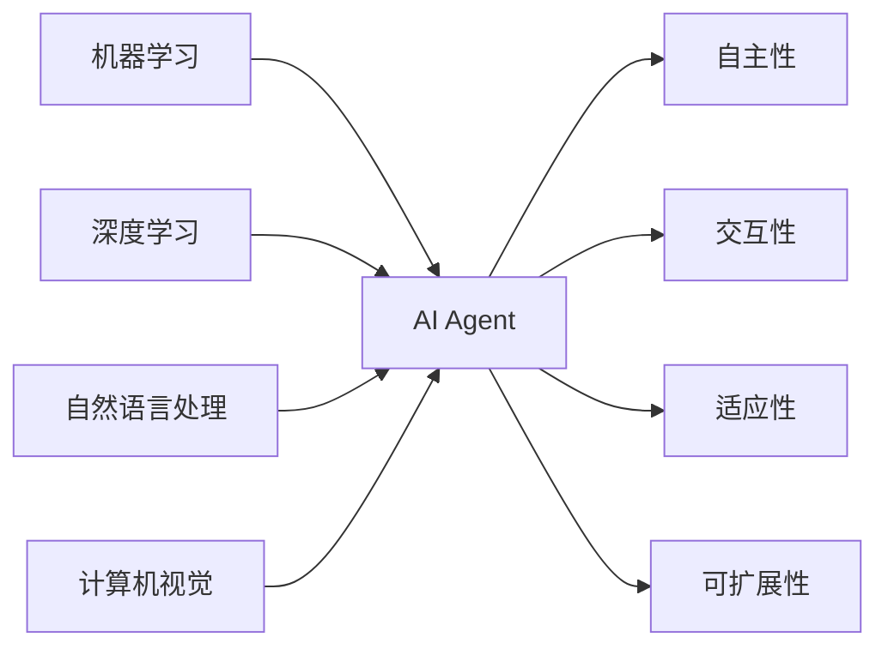

# AI Agent: AI的下一个风口 典型案例和商业应用

## 1. 背景介绍
### 1.1 人工智能发展历程回顾
#### 1.1.1 人工智能的起源与早期发展
#### 1.1.2 人工智能的低谷期
#### 1.1.3 人工智能的复兴与繁荣
### 1.2 AI Agent的兴起
#### 1.2.1 AI Agent的定义与特点
#### 1.2.2 AI Agent的发展现状
#### 1.2.3 AI Agent的应用前景

## 2. 核心概念与联系
### 2.1 AI Agent的核心概念
#### 2.1.1 自主性
#### 2.1.2 交互性
#### 2.1.3 适应性
#### 2.1.4 可扩展性
### 2.2 AI Agent与其他AI技术的关系
#### 2.2.1 AI Agent与机器学习
#### 2.2.2 AI Agent与深度学习
#### 2.2.3 AI Agent与自然语言处理
#### 2.2.4 AI Agent与计算机视觉



## 3. 核心算法原理具体操作步骤
### 3.1 强化学习算法
#### 3.1.1 马尔可夫决策过程
#### 3.1.2 Q-learning
#### 3.1.3 策略梯度
### 3.2 自然语言处理算法
#### 3.2.1 Transformer
#### 3.2.2 BERT
#### 3.2.3 GPT
### 3.3 计算机视觉算法
#### 3.3.1 卷积神经网络
#### 3.3.2 YOLO
#### 3.3.3 Mask R-CNN

## 4. 数学模型和公式详细讲解举例说明
### 4.1 马尔可夫决策过程
马尔可夫决策过程(Markov Decision Process, MDP)是一个数学框架,用于对随机动态系统建模,特别是在强化学习中。MDP由一个四元组 $(S,A,P,R)$ 定义:

- $S$ 是有限的状态集合
- $A$ 是有限的动作集合
- $P$ 是状态转移概率矩阵,其中 $P_{ss'}^a=P[S_{t+1}=s'|S_t=s,A_t=a]$
- $R$ 是奖励函数,其中 $R_s^a=E[R_{t+1}|S_t=s,A_t=a]$

在每个时间步 $t$,agent处于状态 $s_t\in S$,选择一个动作 $a_t\in A$。系统根据状态转移概率 $P_{s_ts_{t+1}}^{a_t}$ 转移到新状态 $s_{t+1}$,同时agent接收到一个奖励 $r_{t+1}\in R$。agent的目标是最大化累积奖励 $\sum_{k=0}^{\infty}\gamma^kr_{t+k+1}$,其中 $\gamma\in[0,1]$ 是折扣因子。

### 4.2 Q-learning
Q-learning是一种常用的强化学习算法,用于学习最优策略。Q-learning算法的核心是Q表,它存储每个状态-动作对的Q值。Q值表示在状态 $s$ 下采取动作 $a$ 的期望累积奖励。Q表可以通过以下更新规则迭代更新:

$$Q(s_t,a_t) \leftarrow Q(s_t,a_t)+\alpha[r_{t+1}+\gamma \max_aQ(s_{t+1},a)-Q(s_t,a_t)]$$

其中 $\alpha\in(0,1]$ 是学习率。在每次与环境交互后,agent根据观察到的转移 $(s_t,a_t,r_{t+1},s_{t+1})$ 更新Q表。当Q表收敛时,最优策略可以通过在每个状态选择Q值最大的动作得到。

## 5. 项目实践：代码实例和详细解释说明
下面是一个使用PyTorch实现DQN(Deep Q-Network)玩CartPole游戏的示例代码:

```python
import gym
import math
import random
import numpy as np
import matplotlib
import matplotlib.pyplot as plt
from collections import namedtuple
from itertools import count
from PIL import Image
import torch
import torch.nn as nn
import torch.optim as optim
import torch.nn.functional as F
import torchvision.transforms as T

env = gym.make('CartPole-v0').unwrapped

# 定义超参数
BATCH_SIZE = 128
GAMMA = 0.999
EPS_START = 0.9
EPS_END = 0.05
EPS_DECAY = 200
TARGET_UPDATE = 10

# 定义网络结构
class DQN(nn.Module):
    def __init__(self, h, w, outputs):
        super(DQN, self).__init__()
        self.conv1 = nn.Conv2d(3, 16, kernel_size=5, stride=2)
        self.bn1 = nn.BatchNorm2d(16)
        self.conv2 = nn.Conv2d(16, 32, kernel_size=5, stride=2)
        self.bn2 = nn.BatchNorm2d(32)
        self.conv3 = nn.Conv2d(32, 32, kernel_size=5, stride=2)
        self.bn3 = nn.BatchNorm2d(32)

        def conv2d_size_out(size, kernel_size = 5, stride = 2):
            return (size - (kernel_size - 1) - 1) // stride  + 1
        convw = conv2d_size_out(conv2d_size_out(conv2d_size_out(w)))
        convh = conv2d_size_out(conv2d_size_out(conv2d_size_out(h)))
        linear_input_size = convw * convh * 32
        self.head = nn.Linear(linear_input_size, outputs)

    def forward(self, x):
        x = F.relu(self.bn1(self.conv1(x)))
        x = F.relu(self.bn2(self.conv2(x)))
        x = F.relu(self.bn3(self.conv3(x)))
        return self.head(x.view(x.size(0), -1))

# 初始化网络
screen_height, screen_width = 40, 90
n_actions = env.action_space.n
policy_net = DQN(screen_height, screen_width, n_actions).to(device)
target_net = DQN(screen_height, screen_width, n_actions).to(device)
target_net.load_state_dict(policy_net.state_dict())
target_net.eval()
optimizer = optim.RMSprop(policy_net.parameters())

# 定义Replay Memory
Transition = namedtuple('Transition',
                        ('state', 'action', 'next_state', 'reward'))
class ReplayMemory(object):
    def __init__(self, capacity):
        self.capacity = capacity
        self.memory = []
        self.position = 0

    def push(self, *args):
        if len(self.memory) < self.capacity:
            self.memory.append(None)
        self.memory[self.position] = Transition(*args)
        self.position = (self.position + 1) % self.capacity

    def sample(self, batch_size):
        return random.sample(self.memory, batch_size)

    def __len__(self):
        return len(self.memory)

memory = ReplayMemory(10000)

# 定义选择动作的函数
steps_done = 0
def select_action(state):
    global steps_done
    sample = random.random()
    eps_threshold = EPS_END + (EPS_START - EPS_END) * \
        math.exp(-1. * steps_done / EPS_DECAY)
    steps_done += 1
    if sample > eps_threshold:
        with torch.no_grad():
            return policy_net(state).max(1)[1].view(1, 1)
    else:
        return torch.tensor([[random.randrange(n_actions)]], device=device, dtype=torch.long)

# 定义训练函数
def optimize_model():
    if len(memory) < BATCH_SIZE:
        return
    transitions = memory.sample(BATCH_SIZE)
    batch = Transition(*zip(*transitions))

    non_final_mask = torch.tensor(tuple(map(lambda s: s is not None,
                                          batch.next_state)), device=device, dtype=torch.bool)
    non_final_next_states = torch.cat([s for s in batch.next_state
                                                if s is not None])
    state_batch = torch.cat(batch.state)
    action_batch = torch.cat(batch.action)
    reward_batch = torch.cat(batch.reward)

    state_action_values = policy_net(state_batch).gather(1, action_batch)

    next_state_values = torch.zeros(BATCH_SIZE, device=device)
    next_state_values[non_final_mask] = target_net(non_final_next_states).max(1)[0].detach()
    expected_state_action_values = (next_state_values * GAMMA) + reward_batch

    loss = F.smooth_l1_loss(state_action_values, expected_state_action_values.unsqueeze(1))

    optimizer.zero_grad()
    loss.backward()
    for param in policy_net.parameters():
        param.grad.data.clamp_(-1, 1)
    optimizer.step()

# 开始训练
num_episodes = 1000
for i_episode in range(num_episodes):
    env.reset()
    last_screen = get_screen()
    current_screen = get_screen()
    state = current_screen - last_screen
    for t in count():
        action = select_action(state)
        _, reward, done, _ = env.step(action.item())
        reward = torch.tensor([reward], device=device)

        last_screen = current_screen
        current_screen = get_screen()
        if not done:
            next_state = current_screen - last_screen
        else:
            next_state = None

        memory.push(state, action, next_state, reward)

        state = next_state

        optimize_model()
        if done:
            break
    if i_episode % TARGET_UPDATE == 0:
        target_net.load_state_dict(policy_net.state_dict())

print('Complete')
env.close()
```

这个示例代码展示了如何使用PyTorch实现DQN算法来玩CartPole游戏。主要步骤包括:

1. 定义DQN网络结构,包括卷积层和全连接层。
2. 初始化两个DQN网络:policy_net和target_net,其中policy_net用于与环境交互并更新参数,target_net用于计算目标Q值。
3. 定义Replay Memory用于存储转移(transition),包括当前状态、动作、奖励和下一状态。
4. 定义选择动作的函数select_action,使用epsilon-greedy策略平衡探索和利用。
5. 定义训练函数optimize_model,从Replay Memory中随机采样一批转移,计算TD误差并更新policy_net的参数。
6. 在每个episode中,与环境交互并存储转移到Replay Memory中,同时调用optimize_model函数更新网络参数。每隔一定步数将policy_net的参数复制到target_net中。

通过不断与环境交互并更新网络参数,agent逐步学习最优策略,最终可以在CartPole游戏中取得好的表现。

## 6. 实际应用场景
### 6.1 智能客服
AI Agent可以用于构建智能客服系统,通过自然语言交互为用户提供24小时不间断的服务。典型案例包括:
- 微软小冰:集成了聊天、音乐、绘画等多种功能的情感交互AI系统
- 阿里天猫精灵:支持语音交互、智能家居控制等功能的AI助手
- 苹果Siri:内置于苹果设备中的智能语音助手

### 6.2 自动驾驶
AI Agent是自动驾驶系统的核心,负责环境感知、决策规划和车辆控制。典型案例包括:
- 特斯拉Autopilot:支持自适应巡航、自动转向等功能的辅助驾驶系统
- Waymo:谷歌旗下的L4级自动驾驶出租车服务
- 百度Apollo:支持多种车型的开源自动驾驶平台

### 6.3 智能推荐
AI Agent可以用于构建个性化推荐系统,通过分析用户行为给出精准的推荐内容。典型案例包括:
- 抖音:基于用户喜好和互动历史的短视频推荐
- 网易云音乐:基于听歌记录和收藏的音乐推荐
- 亚马逊商品推荐:基于用户购买和浏览历史的商品推荐

### 6.4 智能医疗
AI Agent在医疗领域有广泛应用,如医学影像分析、药物研发等。典型案例包括:
- IBM Watson Health:提供癌症诊断、临床试验匹配等服务的AI医疗平台
- 腾讯觅影:基于深度学习的医学影像分析平台
- 百度灵医:支持智能导诊、AI问诊等功能的移动医疗助手

## 7. 工具和资源推荐
### 7.1 开发平台
- OpenAI Gym:强化学习算法测试平台
- DeepMind Lab:第一人称3D游戏平台
- Unity ML-Agents:游戏引擎中构建训练环境

### 7.2 开源框架
- TensorFlow:谷