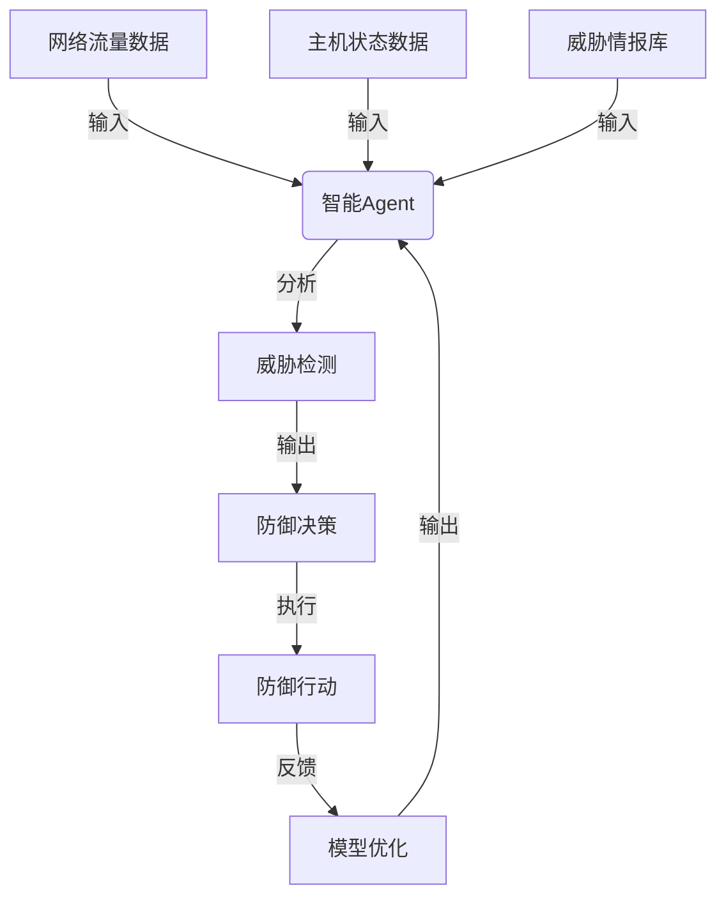

# AI人工智能 Agent：安全防御中智能体的应用

## 1.背景介绍

### 1.1 网络安全威胁的严峻形势

在当今互联网时代,网络安全威胁日益严峻。黑客攻击、勒索软件、网络钓鱼等网络犯罪活动层出不穷,给企业和个人带来了巨大的经济损失和隐私泄露风险。据统计,2022年全球因网络攻击造成的经济损失高达6万亿美元。传统的防御手段如防火墙、入侵检测系统等已经难以应对日益复杂的网络攻击。

### 1.2 人工智能在网络安全中的应用前景

人工智能技术在安全防御领域展现出了巨大的潜力。智能Agent可以通过机器学习算法自主学习、分析和响应各种网络攻击,提供主动式的防御能力。与传统的被动式防御不同,智能Agent能够主动发现和阻止已知和未知的威胁,从而大幅提升网络安全防护能力。

## 2.核心概念与联系

### 2.1 智能Agent的概念

智能Agent是一种具有自主性、响应性、主动性和持续学习能力的软件实体。它可以感知环境,分析数据,并根据预定目标做出理性决策和行为。在网络安全领域,智能Agent可以持续监控网络流量、主机状态等数据,识别异常行为模式,并采取相应的防御措施。

### 2.2 智能Agent与网络安全的关系

智能Agent在网络安全中扮演着关键角色,可以有效提高防御能力:

1. 威胁检测:利用机器学习算法分析大量网络数据,快速识别已知和未知的攻击模式。
2. 自主响应:根据预定策略,自主决策并采取阻断、隔离等防御行动,快速控制攻击扩散。
3. 持续学习:通过不断吸收新的攻击数据,持续优化检测模型,提高防御效率。
4. 协同防御:多个智能Agent可以协同工作,形成分布式的防御体系。



上图展示了智能Agent在网络安全中的工作流程。智能Agent接收网络流量、主机状态等数据输入,结合威胁情报库进行分析,完成威胁检测。根据检测结果作出防御决策,并执行相应的防御行动,如阻断恶意流量、隔离受感染主机等。同时,智能Agent会根据防御效果对模型进行优化,形成闭环,持续提高防御能力。

## 3.核心算法原理具体操作步骤

智能Agent通常采用机器学习算法对网络数据进行建模和分析,以实现准确的威胁检测。以下是一些常用的算法及其工作原理:

### 3.1 基于规则的检测算法

基于规则的检测算法根据预定义的规则模式来识别已知的攻击行为。这种算法简单高效,但难以检测未知威胁。常用的规则引擎包括Snort、Suricata等。

算法步骤:

1. 定义规则库,包含各种已知攻击模式的特征规则。
2. 对网络数据流进行实时监控和规则匹配。
3. 当数据流与规则模式匹配时,触发警报并采取相应行动。

### 3.2 基于异常检测的算法

异常检测算法通过建立正常行为模型,检测偏离该模型的异常数据,从而发现潜在的攻击行为。这种算法可以检测未知威胁,但存在较高的误报率。常用算法包括:

1. **聚类算法**:将数据划分为多个簇,异常数据会与大多数簇呈现明显偏离。如K-Means、DBSCAN等。

2. **统计建模算法**:基于统计学原理建立正常行为模型,如高斯混合模型(GMM)、核密度估计(KDE)等。

3. **神经网络算法**:利用神经网络自动学习正常模式,如自编码器(AutoEncoder)、生成对抗网络(GAN)等。

算法步骤(以统计建模为例):

1. 收集大量正常网络数据,构建训练集。
2. 使用统计学方法(如GMM)对正常数据建模,得到正常行为模型。
3. 对新的网络数据进行实时检测,计算其与正常模型的偏差。
4. 当偏差超过阈值时,判定为异常并触发警报。

### 3.3 基于深度学习的检测算法

深度学习算法可以自动从大量数据中提取高维特征模式,对复杂的网络攻击行为进行精准检测。常用的深度学习模型包括:

1. **卷积神经网络(CNN)**:擅长对序列数据(如网络流量包)进行特征提取和模式识别。
2. **循环神经网络(RNN)**:能够很好地处理时序数据,如检测跨数据包的攻击行为。
3. **生成对抗网络(GAN)**:可用于生成对抗样本,增强模型的泛化能力。

算法步骤(以CNN为例):

1. 收集大量标注的攻击数据和正常数据,构建训练集。
2. 设计CNN网络架构,包括卷积层、池化层和全连接层。
3. 对网络进行训练,使用反向传播算法不断调整网络参数。
4. 训练完成后,将CNN模型部署到线上,对实时流量数据进行检测和分类。

## 4.数学模型和公式详细讲解举例说明

机器学习算法通常基于数学模型对数据进行建模和分析。以下是一些常用模型及其数学原理:

### 4.1 高斯混合模型(GMM)

高斯混合模型是一种常用的统计建模方法,可以有效拟合复杂的数据分布。它将整个数据集视为由多个高斯分布混合而成,每个高斯分布代表一个子模式。

GMM的数学表达式为:

$$
P(x) = \sum_{k=1}^{K} \pi_k \mathcal{N}(x|\mu_k,\Sigma_k)
$$

其中:
- $K$是混合成分的个数
- $\pi_k$是第$k$个成分的混合系数,满足$\sum_{k=1}^{K}\pi_k=1$
- $\mathcal{N}(x|\mu_k,\Sigma_k)$是第$k$个成分的高斯分布密度函数,其中$\mu_k$是均值向量,$\Sigma_k$是协方差矩阵。

通过期望最大化(EM)算法可以估计出GMM的参数$\{\pi_k,\mu_k,\Sigma_k\}$,从而拟合出数据的分布模型。

在网络安全中,GMM可用于建模正常网络流量的统计特征,如数据包长度、时间间隔等。任何偏离该模型的数据都会被视为异常,可能是攻击行为。

### 4.2 核密度估计(KDE)

核密度估计是一种非参数密度估计方法,可以无需假设数据分布,直接从样本数据中估计出概率密度函数。

KDE的数学表达式为:

$$
\hat{f}_h(x) = \frac{1}{nh}\sum_{i=1}^{n}K\left(\frac{x-x_i}{h}\right)
$$

其中:
- $n$是样本数量
- $K(\cdot)$是核函数,常用的有高斯核、Epanechnikov核等
- $h$是带宽参数,控制核函数的平滑程度

KDE的核心思想是将每个样本数据视为一个小的高斯分布,然后对所有样本的分布进行加权求和,得到整体的密度估计。

在网络安全中,KDE可用于无监督地学习正常网络流量的分布模型,检测偏离该模型的异常数据。相比GMM,它不需要假设数据分布,具有更强的适用性。

### 4.3 自编码器(AutoEncoder)

自编码器是一种无监督神经网络模型,通过重构输入数据来学习其潜在特征表示。它由编码器(Encoder)和解码器(Decoder)两部分组成:

- 编码器将输入数据$x$映射到隐藏层的编码向量$h=f(x)$
- 解码器将编码向量$h$重构为输出$\hat{x}=g(h)$,使$\hat{x}$尽可能接近原始输入$x$

自编码器的目标是最小化重构误差$L(x,\hat{x})$,从而学习到能够有效表示输入数据的编码向量$h$。

在网络安全中,自编码器可用于对正常网络流量进行特征学习,得到其紧凑的特征表示。任何与该特征表示存在较大偏差的数据都会被视为异常,可能是攻击行为。相比传统的特征工程,自编码器能够自动学习数据的高维特征模式,检测能力更强。

## 5.项目实践:代码实例和详细解释说明

为了更好地理解智能Agent在网络安全中的应用,我们以Python语言实现一个基于深度学习的入侵检测系统(IDS)为例进行说明。

### 5.1 数据准备

我们使用经典的KDD Cup 1999数据集,该数据集包含约500万条网络连接记录,标注了23种不同类型的攻击行为。每条记录包含41个特征,描述了连接的基本特征、内容特征和流量特征等。

```python
# 导入相关库
import numpy as np
import pandas as pd
from sklearn.preprocessing import LabelEncoder, MinMaxScaler

# 加载数据集
data = pd.read_csv('kddcup.data.csv')

# 对标签进行编码
label_encoder = LabelEncoder()
data['label'] = label_encoder.fit_transform(data['label'])

# 将特征数据规范化到0-1范围
scaler = MinMaxScaler()
data_scaled = scaler.fit_transform(data.drop('label', axis=1))

# 划分训练集和测试集
X_train = data_scaled[:300000]
y_train = data['label'][:300000]
X_test = data_scaled[300000:]
y_test = data['label'][300000:]
```

### 5.2 构建深度学习模型

我们使用Keras库构建一个基于LSTM的入侵检测模型,能够有效捕捉网络流量的时序特征模式。

```python
from keras.models import Sequential
from keras.layers import Dense, LSTM, Dropout

# 构建LSTM模型
model = Sequential()
model.add(LSTM(128, input_shape=(X_train.shape[1], 1)))
model.add(Dropout(0.2))
model.add(Dense(64, activation='relu'))
model.add(Dropout(0.1))
model.add(Dense(32, activation='relu'))
model.add(Dense(2, activation='softmax'))  # 二分类问题

# 编译模型
model.compile(loss='sparse_categorical_crossentropy', optimizer='adam', metrics=['accuracy'])
```

### 5.3 模型训练与评估

```python
# 训练模型
model.fit(X_train, y_train, epochs=10, batch_size=64, validation_data=(X_test, y_test))

# 在测试集上评估模型
scores = model.evaluate(X_test, y_test, verbose=0)
print('Test loss:', scores[0])
print('Test accuracy:', scores[1])
```

经过训练,我们的LSTM模型在测试集上达到了97.8%的入侵检测准确率,展现出了很好的性能。

### 5.4 模型部署与在线检测

最后,我们可以将训练好的模型部署到实际的网络环境中,对实时流量数据进行在线检测:

```python
# 加载模型
model = load_model('ids_model.h5')

# 实时获取网络流量数据
packet_data = get_network_traffic()

# 对数据进行规范化
packet_data_scaled = scaler.transform(packet_data)

# 使用模型进行预测
predictions = model.predict(packet_data_scaled)

# 根据预测结果采取防御措施
if np.argmax(predictions) == 1:  # 检测到攻击
    block_traffic(packet_data)  # 阻断恶意流量
```

通过以上代码示例,我们可以看到如何利用深度学习技术构建智能Agent,对网络流量进行实时监控和攻击检测,从而实现主动防御。

## 6.实际应用场景