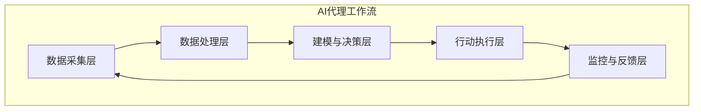

# AI人工智能代理工作流 AI Agent Workflow：在环保行业中的应用

## 1.背景介绍

### 1.1 环境问题的严峻性

当前,地球正面临着前所未有的环境挑战。气候变化、资源枯竭、生物多样性丧失等问题已经成为全球性的威胁。据联合国环境规划署报告,全球每年约有1200万人死于环境污染相关疾病,而这一数字还在持续上升。因此,采取有效措施保护环境,实现可持续发展已经刻不容缓。

### 1.2 传统环保方法的局限性

传统的环保方法主要依赖于人工监测和干预,存在以下局限性:

- 人力成本高昂
- 覆盖范围有限
- 响应效率低下
- 决策缺乏科学依据

### 1.3 人工智能在环保领域的应用前景

人工智能(AI)技术的快速发展为环保事业带来了新的契机。AI代理可以通过自主学习和决策,高效地执行环境监测、预测和优化等任务,大幅提高环保工作的精度和效率。AI代理工作流将AI技术与环保实践有机结合,为构建智能化环保体系奠定基础。

## 2.核心概念与联系

### 2.1 AI代理(AI Agent)

AI代理是指能够感知环境、执行行为并与环境交互的智能体系统。在环保领域,AI代理可以通过传感器获取环境数据,基于机器学习模型进行分析和决策,并执行相应的环保行动。

### 2.2 工作流(Workflow)

工作流是指为完成特定任务而设计的一系列有序活动。AI代理工作流将多个AI代理按特定逻辑组织起来,协同完成复杂的环保任务。

### 2.3 核心组成部分

AI代理工作流通常包括以下核心组成部分:

1. **数据采集层**: 负责从各种传感器和数据源获取环境数据。
2. **数据处理层**: 对原始数据进行清洗、整合和预处理,为后续分析做准备。
3. **建模与决策层**: 基于机器学习算法构建环境模型,并据此进行预测和决策。
4. **行动执行层**: 根据决策结果,执行相应的环保行动,如控制设备、发布警报等。
5. **监控与反馈层**: 持续监控环境变化,并将反馈数据输入到工作流中,实现闭环优化。



## 3.核心算法原理具体操作步骤

AI代理工作流中的核心算法主要包括数据处理、机器学习建模和优化决策三个方面。

### 3.1 数据处理

环境数据通常来自多种异构传感器,存在噪声、缺失值和不一致性等问题。因此,需要对原始数据进行预处理,以提高后续建模的准确性。常用的数据处理技术包括:

1. **数据清洗**:剔除异常值和重复数据。
2. **数据标准化**:将数据转换到同一量纲,便于模型训练。
3. **数据插值**:估算缺失值,补全数据集。
4. **特征工程**:从原始数据中提取有价值的特征,增强模型的表达能力。

### 3.2 机器学习建模

基于处理后的数据,可以构建各种机器学习模型来描述和预测环境状态。常用的模型包括:

1. **回归模型**:预测连续型环境指标,如温度、湿度等。
2. **分类模型**:识别离散型环境状态,如空气质量等级。
3. **时序模型**:捕捉环境数据的时间依赖性,如污染物扩散趋势。
4. **深度学习模型**:自动从原始数据中提取特征,建模复杂环境模式。

模型训练过程中,需要采用合适的优化算法(如梯度下降)和损失函数(如均方误差),以提高模型的泛化能力。

### 3.3 优化决策

基于机器学习模型的预测结果,AI代理需要作出最优决策,以实现环保目标。这通常是一个约束优化问题,需要在多个目标(如减排、成本控制等)之间寻求平衡。常用的优化技术包括:

1. **线性规划**:求解线性目标函数在线性约束条件下的最优解。
2. **动态规划**:将复杂问题分解为子问题,递归求解最优解。
3. **启发式算法**:如遗传算法、模拟退火等,用于求解NP难问题的近似最优解。
4. **强化学习**:AI代理通过与环境交互,不断尝试和学习,逐步优化决策策略。

优化决策的结果将指导AI代理执行相应的环保行动,如调节设备参数、发布预警等。

## 4.数学模型和公式详细讲解举例说明

### 4.1 线性回归模型

线性回归是一种常用的机器学习模型,可用于预测连续型环境指标。假设我们要预测某地区的PM2.5浓度,线性回归模型可表示为:

$$
y = w_0 + w_1x_1 + w_2x_2 + ... + w_nx_n
$$

其中:
- $y$是PM2.5浓度的预测值
- $x_1, x_2, ..., x_n$是影响PM2.5的特征变量,如温度、湿度、风速等
- $w_0, w_1, ..., w_n$是模型参数,需要通过训练数据进行估计

模型的目标是最小化预测值与真实值之间的均方误差:

$$
\min \sum_{i=1}^{m}(y_i - (w_0 + w_1x_{i1} + w_2x_{i2} + ... + w_nx_{in}))^2
$$

其中$m$是训练样本的数量。

通过梯度下降等优化算法,可以求解出模型参数$w$的最优值,从而获得PM2.5浓度的预测模型。

### 4.2 约束优化问题

在环保决策中,我们通常需要在多个目标之间寻求平衡,这可以建模为约束优化问题。假设我们要确定某工厂的最优排放量,需要最小化排放量同时控制生产成本在可接受范围内,可以表示为:

$$
\begin{aligned}
\min \quad & f(x) = x \\
\text{s.t.} \quad & g(x) \leq C \\
& 0 \leq x \leq X_{\max}
\end{aligned}
$$

其中:
- $x$是工厂的排放量
- $f(x)$是目标函数,即最小化排放量
- $g(x)$是成本函数,表示排放量$x$对应的生产成本
- $C$是可接受的最大成本
- $X_{\max}$是排放量的上限

这是一个线性规划问题,可以使用单纯形算法等方法求解。

## 5.项目实践:代码实例和详细解释说明

以下是一个基于Python和scikit-learn库实现的PM2.5浓度预测示例:

```python
import pandas as pd
from sklearn.linear_model import LinearRegression
from sklearn.model_selection import train_test_split
from sklearn.metrics import mean_squared_error

# 加载数据
data = pd.read_csv('air_quality.csv')
X = data[['temperature', 'humidity', 'wind_speed']]
y = data['pm25']

# 拆分训练集和测试集
X_train, X_test, y_train, y_test = train_test_split(X, y, test_size=0.2, random_state=42)

# 训练线性回归模型
model = LinearRegression()
model.fit(X_train, y_train)

# 模型评估
y_pred = model.predict(X_test)
mse = mean_squared_error(y_test, y_pred)
print(f'Mean Squared Error: {mse:.2f}')

# 输出模型参数
print('Model Coefficients:')
print(f'Intercept: {model.intercept_:.2f}')
for coef, feature in zip(model.coef_, X.columns):
    print(f'{feature}: {coef:.2f}')
```

1. 首先从CSV文件中加载环境数据,包括温度、湿度、风速和PM2.5浓度。
2. 将数据拆分为训练集和测试集,用于模型训练和评估。
3. 使用scikit-learn的`LinearRegression`类训练线性回归模型,将温度、湿度和风速作为特征变量,PM2.5浓度作为目标变量。
4. 在测试集上评估模型性能,计算均方误差(MSE)。
5. 输出模型的截距项和各特征变量的系数。

运行结果示例:

```
Mean Squared Error: 8.76
Model Coefficients:
Intercept: 25.87
temperature: 0.92
humidity: -0.21
wind_speed: -1.35
```

该示例展示了如何使用Python和scikit-learn库构建和评估一个简单的PM2.5预测模型。在实际应用中,我们还需要进行更多的特征工程、模型选择和超参数调优,以提高预测精度。

## 6.实际应用场景

AI代理工作流在环保领域有广泛的应用前景,包括但不限于:

### 6.1 空气质量监测与预警

通过部署空气质量监测站点,AI代理可以实时采集PM2.5、PM10、臭氧等污染物浓度数据。基于机器学习模型,AI代理能够预测未来一段时间内的空气质量变化趋势,并在污染物浓度超标时发出预警,提醒公众采取相应防护措施。

### 6.2 水资源管理

AI代理可以监测河流、湖泊和地下水的水质指标,如溶解氧、化学需氧量等。通过建模和优化,AI代理能够制定最佳的水资源调度方案,合理分配水资源,同时控制污染物排放,维护水体健康。

### 6.3 能源优化

在工业生产和建筑运营中,AI代理可以实时监控能源消耗情况,并通过机器学习算法优化能源使用策略,降低能源浪费和温室气体排放,提高能源利用效率。

### 6.4 生态环境保护

AI代理可以通过遥感影像、视频监控等手段,实时监测森林、湿地等生态系统的状况。一旦发现火灾、非法捕猎等威胁,AI代理能够快速作出决策并采取行动,如派遣执法人员、控制火情等,最大限度地保护生态环境。

### 6.5 环境政策制定

AI代理可以整合各领域的环境数据,构建复杂的环境模型,模拟不同政策措施的影响。决策者可以基于AI代理的模拟结果,制定出科学、高效的环保政策,促进可持续发展。

## 7.工具和资源推荐

在构建AI代理工作流时,可以利用以下工具和资源:

### 7.1 开源框架

- **TensorFlow**:谷歌开源的机器学习框架,支持构建和训练深度神经网络模型。
- **PyTorch**:Meta开源的机器学习库,具有动态计算图和高效内存管理等优势。
- **scikit-learn**:Python中流行的机器学习库,提供了多种经典算法的实现。
- **Apache Airflow**:一种编程式工作流管理系统,可用于编排AI代理工作流。

### 7.2 云平台

- **Google Cloud AI Platform**:谷歌云提供的AI平台,集成了多种AI服务和工具。
- **AWS AI Services**:亚马逊云服务中的AI产品组合,包括计算机视觉、自然语言处理等服务。
- **Azure AI Platform**:微软云平台的AI解决方案,支持模型开发、部署和管理。

### 7.3 数据资源

- **NASA Earth Data**:NASA提供的地球科学数据资源,包括卫星影像、气候数据等。
- **World Air Quality Index**:全球空气质量指数数据,可用于训练空气质量预测模型。
- **UNEP Environmental Data Explorer**:联合国环境规划署提供的环境数据资源。

### 7.4 在线课程

- **吴恩达机器学习课程(Coursera)**:机器学习领域经典的在线课程,由斯坦福大学吴恩达教授主讲。
- **DeepLearning.AI深度学习专业证书(Coursera)**:涵盖深度学习基础、计算机视觉、自然