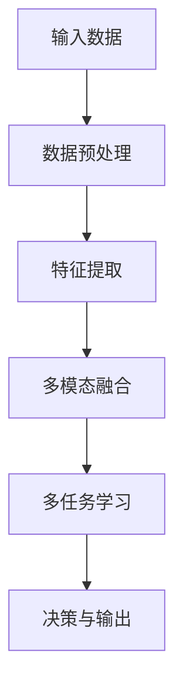

# AI人工智能代理工作流AI Agent WorkFlow：AI代理的多模态感知与处理能力

## 1.背景介绍

在当今快速发展的数字化时代，人工智能(AI)技术已经渗透到了我们生活和工作的方方面面。随着数据量的爆炸式增长和计算能力的不断提升,AI系统正在变得越来越复杂和智能化。传统的单一模态AI系统(如仅处理文本或图像)已经无法满足现代应用的需求,因此,多模态AI代理(Multi-modal AI Agents)应运而生。

多模态AI代理是指能够同时感知和处理多种模态数据(如文本、图像、语音、视频等)的智能系统。它们可以更好地模拟人类的认知和交互方式,提供更自然、更智能的用户体验。多模态AI代理在各个领域都有广泛的应用前景,如虚拟助手、智能家居、自动驾驶、医疗诊断等。

## 2.核心概念与联系

### 2.1 模态(Modality)

模态是指人类或机器感知和交互的方式,常见的模态包括:

- 文本(Text)
- 图像(Image)
- 语音(Speech)
- 视频(Video)
- 传感器数据(Sensor Data)

不同模态之间存在内在联系,如图像中可能包含文本信息,语音可以转换为文本等。利用多模态数据可以提高AI系统的理解和决策能力。

### 2.2 多模态融合(Multi-modal Fusion)

多模态融合是指将来自不同模态的信息进行有效整合,从而获得更丰富、更准确的数据表示。常见的多模态融合方法包括:

- 特征级融合(Feature-level Fusion)
- 决策级融合(Decision-level Fusion)
- 混合融合(Hybrid Fusion)

### 2.3 多任务学习(Multi-task Learning)

多任务学习旨在同时优化多个相关任务的性能,利用不同任务之间的相关性提高整体学习效果。在多模态AI代理中,多任务学习可以帮助模型更好地捕捉不同模态之间的相关性,提高模型的泛化能力。

## 3.核心算法原理具体操作步骤

多模态AI代理的核心算法原理可以概括为以下几个步骤:



### 3.1 输入数据

多模态AI代理可以接收多种形式的输入数据,如文本、图像、语音、视频等。

### 3.2 数据预处理

对原始输入数据进行必要的预处理,如去噪、规范化、分词等,以提高后续处理的效率和准确性。

### 3.3 特征提取

使用适当的算法(如CNN、RNN等)从不同模态的数据中提取相应的特征表示,为后续的融合和建模做准备。

### 3.4 多模态融合

将来自不同模态的特征表示进行融合,获得更丰富、更准确的数据表示。常见的融合方法包括特征级融合、决策级融合和混合融合等。

### 3.5 多任务学习

基于融合后的多模态数据表示,通过多任务学习的方式同时优化多个相关任务的性能,利用不同任务之间的相关性提高整体学习效果。

### 3.6 决策与输出

根据多任务学习的结果,对输入数据进行决策和输出,完成相应的任务,如问答、推理、预测等。

## 4.数学模型和公式详细讲解举例说明

在多模态AI代理中,常见的数学模型和公式包括:

### 4.1 特征融合

特征级融合通常使用串联(Concatenation)或加权求和(Weighted Sum)的方式将不同模态的特征向量进行融合。

串联融合:

$$
\vec{f} = [\vec{f}_1, \vec{f}_2, \dots, \vec{f}_n]
$$

其中,$\vec{f}_i$表示第$i$个模态的特征向量,$\vec{f}$为融合后的特征向量。

加权求和融合:

$$
\vec{f} = \sum_{i=1}^{n} w_i \vec{f}_i
$$

其中,$w_i$为第$i$个模态的权重系数,可通过学习得到。

### 4.2 多任务学习

在多任务学习中,通常会引入任务特定层(Task-specific Layers)和共享层(Shared Layers)。共享层用于学习多个任务之间的共同知识,任务特定层则针对每个具体任务进行建模。

对于任务$t$,其损失函数可表示为:

$$
\mathcal{L}_t = \mathcal{L}_t(y_t, \hat{y}_t)
$$

其中,$y_t$为任务$t$的真实标签,$\hat{y}_t$为模型预测的输出。

多任务学习的总损失函数为所有任务损失函数的加权求和:

$$
\mathcal{L} = \sum_{t=1}^{T} \lambda_t \mathcal{L}_t
$$

其中,$\lambda_t$为任务$t$的权重系数,可通过学习得到。

### 4.3 注意力机制(Attention Mechanism)

注意力机制是多模态AI代理中常用的技术,它可以自适应地分配不同模态和不同位置的权重,从而更好地捕捉相关信息。

对于查询向量$\vec{q}$和键值对$(\vec{k}_i, \vec{v}_i)$,注意力分数可计算为:

$$
\alpha_i = \frac{\exp(\vec{q} \cdot \vec{k}_i)}{\sum_{j=1}^{n} \exp(\vec{q} \cdot \vec{k}_j)}
$$

注意力权重向量为:

$$
\vec{\alpha} = [\alpha_1, \alpha_2, \dots, \alpha_n]
$$

加权求和后的注意力输出为:

$$
\vec{o} = \sum_{i=1}^{n} \alpha_i \vec{v}_i
$$

通过注意力机制,模型可以自适应地关注更重要的模态和位置信息,提高决策的准确性。

## 5.项目实践:代码实例和详细解释说明

以下是一个基于PyTorch实现的多模态AI代理示例代码,用于图像-文本匹配任务。

```python
import torch
import torch.nn as nn

# 文本编码器
class TextEncoder(nn.Module):
    def __init__(self, vocab_size, emb_dim, hidden_dim):
        super(TextEncoder, self).__init__()
        self.embedding = nn.Embedding(vocab_size, emb_dim)
        self.rnn = nn.GRU(emb_dim, hidden_dim, batch_first=True)

    def forward(self, text):
        embedded = self.embedding(text)
        _, hidden = self.rnn(embedded)
        return hidden

# 图像编码器
class ImageEncoder(nn.Module):
    def __init__(self, cnn):
        super(ImageEncoder, self).__init__()
        self.cnn = cnn

    def forward(self, image):
        features = self.cnn(image)
        return features

# 多模态融合
class MultimodalFusion(nn.Module):
    def __init__(self, text_encoder, image_encoder, fusion_dim):
        super(MultimodalFusion, self).__init__()
        self.text_encoder = text_encoder
        self.image_encoder = image_encoder
        self.fusion = nn.Linear(text_encoder.hidden_dim + image_encoder.output_dim, fusion_dim)

    def forward(self, text, image):
        text_features = self.text_encoder(text)
        image_features = self.image_encoder(image)
        fused_features = torch.cat((text_features, image_features), dim=1)
        fused_features = self.fusion(fused_features)
        return fused_features

# 多模态匹配
class MultimodalMatching(nn.Module):
    def __init__(self, fusion_dim):
        super(MultimodalMatching, self).__init__()
        self.classifier = nn.Linear(fusion_dim, 1)

    def forward(self, fused_features):
        scores = self.classifier(fused_features)
        return scores
```

在这个示例中,我们首先定义了文本编码器`TextEncoder`和图像编码器`ImageEncoder`,分别用于编码文本和图像输入。然后,我们使用`MultimodalFusion`模块将文本和图像特征进行融合。最后,`MultimodalMatching`模块根据融合后的特征计算匹配分数。

在训练过程中,我们可以使用二元交叉熵损失函数优化模型参数,实现图像-文本匹配任务。

## 6.实际应用场景

多模态AI代理在许多领域都有广泛的应用前景,以下是一些典型的应用场景:

### 6.1 虚拟助手

虚拟助手需要同时处理用户的语音、文本、图像等多种模态输入,并给出自然的多模态响应。多模态AI代理可以帮助虚拟助手更好地理解用户意图,提供更智能、更人性化的交互体验。

### 6.2 自动驾驶

自动驾驶系统需要融合来自多个传感器(如摄像头、雷达、激光雷达等)的数据,才能全面感知周围环境。多模态AI代理可以有效地融合这些异构数据,提高环境感知和决策的准确性,从而提升自动驾驶的安全性和可靠性。

### 6.3 医疗诊断

医疗诊断往往需要综合患者的病史、症状、影像数据等多种信息。多模态AI代理可以帮助医生更好地整合这些异构数据,提高诊断的准确性和效率。

### 6.4 智能家居

智能家居系统需要处理来自多个传感器的数据,如语音指令、环境监测数据等。多模态AI代理可以有效地融合这些数据,实现更智能、更人性化的家居控制和交互。

### 6.5 机器人技术

机器人需要同时处理视觉、语音、触觉等多种模态输入,才能更好地感知和理解周围环境。多模态AI代理可以帮助机器人更准确地理解指令,更高效地完成任务。

## 7.工具和资源推荐

### 7.1 开源框架

- **PyTorch**:功能强大的深度学习框架,支持多模态建模和训练。
- **TensorFlow**:另一个流行的深度学习框架,也支持多模态建模。
- **MMF**:Facebook开源的多模态框架,提供了多种多模态任务和模型。
- **MMML**:微软开源的多模态机器学习工具包。

### 7.2 数据集

- **Flickr30k**:包含30,000张图像和对应的文本描述。
- **MS-COCO**:包含330,000张图像和对应的文本标注。
- **VQA**:视觉问答数据集,包含765,000个图像-问题对。
- **AudioCaps**:包含49,000个音频剪辑和对应的文本描述。

### 7.3 预训练模型

- **BERT**:谷歌开源的自然语言处理预训练模型。
- **ViT**:Vision Transformer,用于图像建模的预训练模型。
- **CLIP**:OpenAI开源的图像-文本对预训练模型。
- **DALL-E**:OpenAI开源的文本到图像生成模型。

## 8.总结:未来发展趋势与挑战

多模态AI代理是一个充满活力和前景的研究领域,它将为人机交互、智能系统等多个领域带来革命性的变化。未来,多模态AI代理将朝着以下几个方向发展:

### 8.1 更强大的多模态融合能力

未来的多模态AI代理需要能够更有效地融合异构数据,捕捉不同模态之间的内在联系,从而提高决策的准确性和鲁棒性。

### 8.2 更自然的人机交互

借助多模态AI代理,人机交互将变得更加自然、无缝,模拟人类的认知和交互方式,提供更出色的用户体验。

### 8.3 更广泛的应用场景

多模态AI代理将在越来越多的领域发挥作用,如智能家居、自动驾驶、医疗诊断、机器人技术等,为我们的生活和工作带来巨大的便利。

### 8.4 更强大的计算能力需求

训练和部署多模态AI代理需要大量的计算资源,未来需要更强大的硬件支持,如专用AI芯片、云计算等。

### 8.5 隐私和安全挑战

多模态AI代理涉及大量个人数据,如何保护用户隐私和系统安全将是一个重大挑战。需要制定相应的法律法规,并采取有效的技术手段来解决这些问题。

##