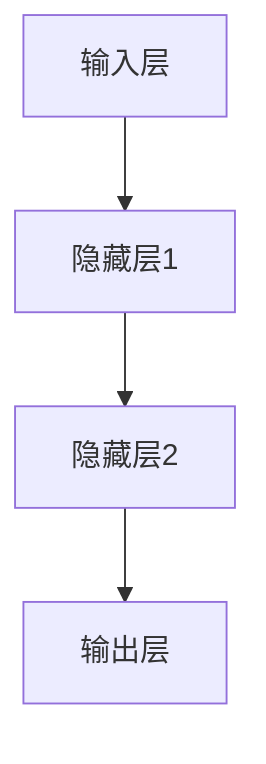

# AI人工智能深度学习算法：在金融风险预测中的应用

## 1. 背景介绍

### 1.1 金融风险的重要性

在当今快节奏的金融环境中,风险管理是确保金融机构和投资者财务稳健的关键因素。金融风险可能来自多个方面,包括市场波动、信用违约、操作失误等。及时识别和量化这些风险对于制定有效的风险缓解策略至关重要。传统的风险评估方法通常依赖人工分析和经验法则,存在效率低下、主观性强等缺陷。

### 1.2 人工智能在金融风险中的作用

随着大数据和人工智能技术的快速发展,将人工智能应用于金融风险预测和管理已成为一个新兴热点。人工智能算法能够从海量历史数据中提取隐藏的模式和规律,捕捉传统方法难以发现的细微信号,从而提高风险识别的准确性和及时性。其中,深度学习作为人工智能的一个重要分支,展现出了强大的数据挖掘和模式识别能力,在金融风险预测领域备受关注。

## 2. 核心概念与联系

### 2.1 深度学习简介

深度学习(Deep Learning)是机器学习的一种新技术,它模仿人脑的结构和功能,通过构建神经网络对输入数据进行表征学习和分层传递变换,自动从数据中挖掘出特征模式。与传统的机器学习算法相比,深度学习具有自动提取特征、端到端优化、处理非结构化数据等优势,在计算机视觉、自然语言处理、语音识别等领域表现出色。

### 2.2 金融风险预测中的关键概念

- **违约风险(Default Risk)**: 指债务人无法按时偿还债务的风险。
- **市场风险(Market Risk)**: 由于利率、汇率、商品价格等市场因素波动而导致的风险。
- **操作风险(Operational Risk)**: 由于内部流程、人员和系统的不完善或失效而造成损失的风险。
- **信用风险(Credit Risk)**: 交易对手无法履行合同义务而造成损失的风险。

### 2.3 深度学习与金融风险预测的联系

深度学习算法能够从复杂的金融大数据中自动提取特征,捕捉传统方法难以发现的非线性模式和高阶交互关系,从而更精准地对上述各类金融风险进行建模和预测。此外,深度学习模型具有很强的泛化能力,能够适应金融数据的动态变化,持续提高风险预测的准确性。

## 3. 核心算法原理具体操作步骤

在金融风险预测中,常用的深度学习算法包括前馈神经网络(Feedforward Neural Network)、卷积神经网络(Convolutional Neural Network)、循环神经网络(Recurrent Neural Network)、长短期记忆网络(Long Short-Term Memory)等。下面以前馈神经网络为例,介绍其在金融风险预测中的应用原理和操作步骤。

### 3.1 前馈神经网络原理

前馈神经网络(FNN)是深度学习中最基本的一种网络结构,它由输入层、隐藏层和输出层组成。每个神经元接收上一层所有神经元的加权输入,经过激活函数后向下一层传递。在金融风险预测中,FNN可以将各类风险因素(如资产负债率、利率等)作为输入,预测违约、亏损等风险事件的发生概率。



### 3.2 算法步骤

1. **数据预处理**：对原始金融数据进行清洗、标准化、编码等预处理,将其转换为算法可识别的数值向量形式。

2. **构建网络结构**：根据问题的复杂程度,设计FNN的层数和每层神经元数量。通常使用3-5层隐藏层。

3. **初始化权重**：使用随机数或特定方法(如Xavier初始化)对网络权重进行初始化。

4. **前向传播**：按照网络结构,将输入数据经过加权求和和激活函数,一层层向前传播到输出层。

5. **计算损失**：比较输出层的预测值与真实标签,计算损失函数(如交叉熵损失)的值。

6. **反向传播**：使用优化算法(如梯度下降),沿着网络从输出层向输入层反向传播,更新每层权重。

7. **模型训练**：重复4-6步骤,使用训练数据不断优化网络参数,直至损失函数收敛或达到预期精度。

8. **模型评估**：在测试数据上评估模型的泛化能力,计算评估指标(如准确率、AUC等)。

9. **模型调优**：根据评估结果,调整超参数(如学习率、正则化系数等),重复训练过程。

10. **模型部署**：将训练好的模型应用于实际的金融风险评估系统中。

## 4. 数学模型和公式详细讲解举例说明

### 4.1 前馈神经网络数学模型

设输入层有$n$个神经元,隐藏层有$m$个神经元,输出层有$k$个神经元。令$\mathbf{x} = (x_1, x_2, \dots, x_n)^T$为输入向量,$\mathbf{y} = (y_1, y_2, \dots, y_k)^T$为输出向量。

对于第$l$层的第$j$个神经元,其加权输入为:

$$z_j^{(l)} = \sum_{i=1}^{n_l} w_{ij}^{(l)}a_i^{(l-1)} + b_j^{(l)}$$

其中,$w_{ij}^{(l)}$为连接第$(l-1)$层第$i$个神经元与第$l$层第$j$个神经元的权重,$b_j^{(l)}$为第$l$层第$j$个神经元的偏置项,$a_i^{(l-1)}$为第$(l-1)$层第$i$个神经元的输出。

通过激活函数$\sigma(\cdot)$,第$l$层第$j$个神经元的输出为:

$$a_j^{(l)} = \sigma(z_j^{(l)})$$

常用的激活函数包括Sigmoid函数、ReLU函数等。

对于整个网络,输出向量可表示为:

$$\mathbf{y} = f(\mathbf{x}; \mathbf{W}, \mathbf{b})$$

其中,$\mathbf{W}$为所有权重参数的集合,$\mathbf{b}$为所有偏置参数的集合,函数$f$表示前馈神经网络的前向传播过程。

### 4.2 损失函数

在监督学习中,我们需要定义一个损失函数(Loss Function)来衡量模型预测值与真实值之间的差异。对于金融风险预测问题,常用的损失函数包括:

1. **二元交叉熵损失函数**:

   $$L = -\frac{1}{N}\sum_{i=1}^N[y_i\log(\hat{y}_i) + (1-y_i)\log(1-\hat{y}_i)]$$

   其中,$y_i$为第$i$个样本的真实标签(0或1),$\hat{y}_i$为模型对第$i$个样本的预测概率。

2. **均方误差损失函数**:

   $$L = \frac{1}{N}\sum_{i=1}^N(\hat{y}_i - y_i)^2$$

   其中,$y_i$为第$i$个样本的真实值,$\hat{y}_i$为模型对第$i$个样本的预测值。

### 4.3 优化算法

为了使损失函数最小化,我们需要采用优化算法来更新网络参数。常用的优化算法包括:

1. **梯度下降(Gradient Descent)**:

   $$\theta_{t+1} = \theta_t - \eta \frac{\partial L}{\partial \theta_t}$$

   其中,$\theta$为需要优化的参数,$\eta$为学习率,梯度$\frac{\partial L}{\partial \theta_t}$可以通过反向传播算法计算得到。

2. **随机梯度下降(Stochastic Gradient Descent, SGD)**:

   在每次迭代中,SGD随机选择一个或一个批次的训练样本,根据这些样本的梯度更新参数,从而加快了收敛速度。

3. **自适应优化算法**:

   除了SGD,还有一些自适应调整学习率的优化算法,如AdaGrad、RMSProp、Adam等,能够进一步提高优化效率。

## 5. 项目实践:代码实例和详细解释说明

以下是使用PyTorch框架实现前馈神经网络对信用违约风险进行二分类预测的代码示例:

```python
import torch
import torch.nn as nn
import torch.optim as optim

# 定义前馈神经网络模型
class FeedforwardNeuralNet(nn.Module):
    def __init__(self, input_size, hidden_size, num_classes):
        super(FeedforwardNeuralNet, self).__init__()
        self.fc1 = nn.Linear(input_size, hidden_size)
        self.relu = nn.ReLU()
        self.fc2 = nn.Linear(hidden_size, num_classes)

    def forward(self, x):
        out = self.fc1(x)
        out = self.relu(out)
        out = self.fc2(out)
        return out

# 加载数据
# ...

# 定义模型、损失函数和优化器
model = FeedforwardNeuralNet(input_size, hidden_size, num_classes)
criterion = nn.CrossEntropyLoss()
optimizer = optim.SGD(model.parameters(), lr=learning_rate)

# 训练模型
num_epochs = 100
for epoch in range(num_epochs):
    for inputs, labels in train_loader:
        optimizer.zero_grad()
        outputs = model(inputs)
        loss = criterion(outputs, labels)
        loss.backward()
        optimizer.step()

    # 在测试集上评估模型
    # ...

# 使用训练好的模型进行预测
with torch.no_grad():
    test_outputs = model(test_inputs)
    predictions = torch.argmax(test_outputs, dim=1)
```

上述代码定义了一个包含一个隐藏层的前馈神经网络模型`FeedforwardNeuralNet`。在`__init__`函数中,我们初始化了两个全连接层(`nn.Linear`)和一个ReLU激活函数。`forward`函数定义了模型的前向传播过程。

在训练过程中,我们使用PyTorch的`nn.CrossEntropyLoss`作为损失函数,`optim.SGD`作为优化器。每个epoch中,我们遍历训练数据,计算损失,反向传播梯度,并更新模型参数。同时,我们可以在测试集上评估模型的性能。

最后,我们可以使用训练好的模型对新的输入数据进行预测。`torch.no_grad()`确保在预测过程中不计算梯度,从而节省计算资源。

需要注意的是,上述代码只是一个简单的示例,在实际应用中可能需要进行数据预处理、模型调优、特征工程等额外工作,以提高模型的性能和泛化能力。

## 6. 实际应用场景

深度学习在金融风险预测领域有着广泛的应用前景,主要包括以下几个方面:

### 6.1 信用风险评估

通过分析企业财务数据、行业数据、宏观经济指标等,深度学习模型可以预测企业违约概率,为银行、投资机构等金融机构提供信用风险评估支持。

### 6.2 交易策略优化

利用深度学习对金融市场数据(如股票行情、新闻事件等)进行建模,可以发现潜在的交易机会,优化投资组合,提高交易策略的收益率。

### 6.3 反欺诈监控

深度学习能够从海量交易数据中识别出异常模式,有助于及时发现金融欺诈行为,如洗钱、内幕交易等,从而降低操作风险。

### 6.4 风险压力测试

通过构建深度学习模型模拟极端情况下的金融风险暴露程度,可以为风险管理决策提供依据,提高金融机构的抗风险能力。

### 6.5 合规审查

深度学习可以自动分析合同文本、交易记录等非结构化数据,识别潜在的合规风险,为金融机构的内部审计和合规管理提供支持。

## 7. 工具和资源推荐

在金融风险预测领域,有许多优秀的开源工具和资源可供参考:

1. **深度