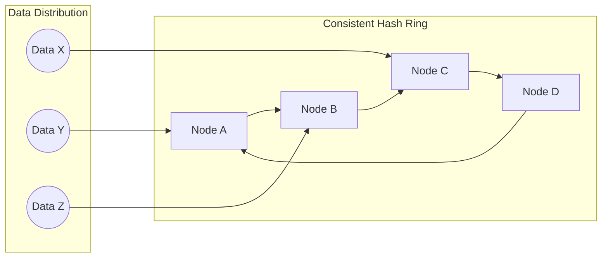
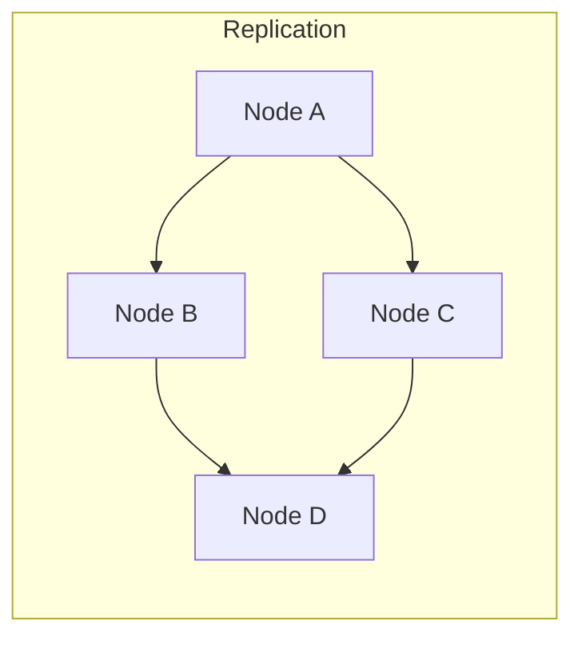
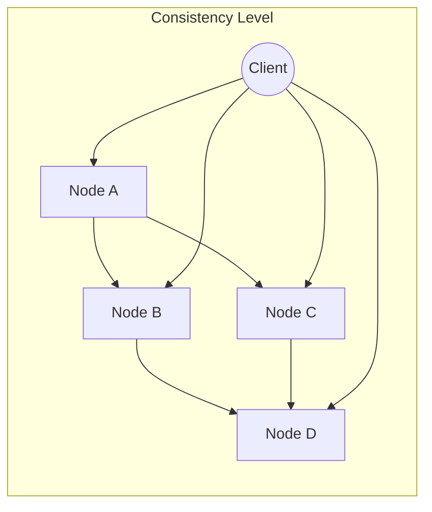

# AI系统Cassandra原理与代码实战案例讲解

## 1.背景介绍

在当今数据爆炸式增长的时代,传统的关系型数据库已经无法满足大规模数据存储和高并发访问的需求。这就催生了NoSQL(Not Only SQL)数据库的诞生,作为关系型数据库的有力补充。NoSQL数据库具有高可扩展性、高可用性、灵活的数据模型等优势,非常适合处理海量数据和高并发场景。

Apache Cassandra就是一种广为人知的分布式NoSQL数据库,最初由Facebook设计,后被Apache软件基金会纳入顶级项目。它提供了无单点故障、可伸缩性卓越和高度可用的分布式数据存储解决方案。Cassandra被设计为处理由集群化部署在多个节点上的节点组成的大量数据,提供高可用性和无单点故障。

## 2.核心概念与联系

### 2.1 数据模型

Cassandra采用了非常简单的数据模型,只有三个概念:键空间(Keyspace)、列族(Column Family)和列(Column)。

- **键空间(Keyspace)**:可以看作是一个命名空间,用于逻辑上隔离不同的应用数据。
- **列族(Column Family)**:相当于关系型数据库的表,是存储数据的载体。
- **列(Column)**: 由列名(name)和列值(value)组成,每个列都有一个时间戳。

### 2.2 分布式系统

Cassandra作为分布式系统,具有以下核心概念:

- **节点(Node)**: Cassandra集群由多个节点组成,每个节点都是一个独立的计算机。
- **数据分区(Data Partitioning)**: 将数据分布在整个集群中,每个节点负责其中一部分数据。
- **数据复制(Data Replication)**: 为了实现容错和高可用性,每份数据会在多个节点上保存副本。
- **一致性级别(Consistency Level)**: 控制读写操作需要等待多少个副本节点成功响应。

### 2.3 其他概念

- **Gossip协议**: 用于节点间的成员资格信息交换,检测节点加入或离开。
- **Hinted Handoff**: 当某些副本节点暂时不可用时,暂存写入数据,等节点恢复后再传输数据。
- **Snitch**: 用于计算节点间的网络拓扑结构,确定数据复制的节点位置。

## 3.核心算法原理具体操作步骤

### 3.1 数据分区

Cassandra使用一致性哈希(Consistent Hashing)算法将数据分布在集群中。具体步骤如下:

1. 为每个节点分配一个Token,Token是一个64位整数,范围覆盖整个哈希环。
2. 通过分区器(Partitioner)计算每条数据的哈希值,确定其Token位置。
3. 数据被分配到Token环上顺时针方向离它最近的节点上。



### 3.2 数据复制

为了实现容错和高可用性,Cassandra采用了数据复制策略。步骤如下:

1. 指定复制因子(Replication Factor),即每份数据需要保存多少个副本。
2. 根据复制策略(Replication Strategy)选择副本节点的位置。
3. 将数据复制到指定的副本节点上。



### 3.3 一致性级别

Cassandra支持可调节的一致性级别,用于控制读写操作需要等待多少个副本节点成功响应。

常用的一致性级别包括:

- `ONE`: 只需要等待一个节点成功响应即可。
- `QUORUM`: 需要等待超过半数节点(如3个副本,需要等待2个)成功响应。
- `ALL`: 需要等待所有副本节点成功响应。



## 4.数学模型和公式详细讲解举例说明

### 4.1 一致性哈希算法

一致性哈希算法是Cassandra实现数据分区的核心算法。它将节点和数据哈希到一个环形空间中,解决了传统哈希算法在节点数量变化时需要重新哈希的问题。

假设哈希环的范围是$[0, 2^{64})$,节点和数据的哈希值都落在这个范围内。对于一个节点$n$,它的哈希值为$hash(n)$。对于一个数据项$d$,它的哈希值为$hash(d)$。

数据$d$被分配到环上顺时针方向离它最近的节点上,即:

$$
node(d) = \min\limits_{n \in Nodes} \{hash(n) \geq hash(d)\}
$$

当节点加入或离开时,只有少量的数据需要重新分配,从而实现了良好的扩展性。

### 4.2 复制策略

Cassandra支持多种复制策略,用于确定每份数据的副本应该存储在哪些节点上。常用的复制策略包括:

- **SimpleStrategy**: 适用于单数据中心部署,将副本分布在环形空间的连续节点上。
- **NetworkTopologyStrategy**: 适用于多数据中心部署,根据数据中心和机架的网络拓扑结构分布副本。

假设复制因子为$N$,NetworkTopologyStrategy的副本分布公式如下:

$$
replicas(d) = \{node(d), node(d+1), \ldots, node(d+N-1)\}
$$

其中$node(d+i)$表示环上顺时针方向离$hash(d)$第$i$近的节点。

## 5.项目实践:代码实例和详细解释说明

下面是一个使用Python的Driver连接Cassandra并执行基本操作的示例:

```python
from cassandra.cluster import Cluster

# 连接Cassandra集群
cluster = Cluster(['192.168.1.100', '192.168.1.101'])
session = cluster.connect()

# 创建键空间
session.execute("""
    CREATE KEYSPACE IF NOT EXISTS demo
    WITH REPLICATION = {
        'class': 'SimpleStrategy',
        'replication_factor': 3
    }
""")

# 创建表
session.execute("""
    CREATE TABLE IF NOT EXISTS demo.users (
        user_id UUID PRIMARY KEY,
        name TEXT,
        email TEXT
    )
""")

# 插入数据
user_id = uuid.uuid4()
session.execute("""
    INSERT INTO demo.users (user_id, name, email)
    VALUES (%s, 'John Doe', 'john@example.com')
""", (user_id,))

# 查询数据
rows = session.execute("SELECT * FROM demo.users")
for row in rows:
    print(row)

# 更新数据
session.execute("""
    UPDATE demo.users
    SET email = 'john.doe@example.com'
    WHERE user_id = %s
""", (user_id,))

# 删除数据
session.execute("""
    DELETE FROM demo.users
    WHERE user_id = %s
""", (user_id,))
```

代码解释:

1. 首先导入`cassandra.cluster`模块,并创建一个`Cluster`对象连接到Cassandra集群。
2. 使用`session.execute()`方法执行CQL(Cassandra Query Language)语句。
3. 创建一个名为`demo`的键空间,并指定复制策略为`SimpleStrategy`,复制因子为3。
4. 在`demo`键空间中创建一个名为`users`的表,包含`user_id`(UUID类型)作为主键,以及`name`和`email`两个列。
5. 插入一条用户数据,使用`uuid.uuid4()`生成一个随机的UUID作为`user_id`。
6. 使用`SELECT`语句查询表中的数据,并打印结果。
7. 使用`UPDATE`语句更新指定用户的`email`列。
8. 使用`DELETE`语句删除指定用户的数据。

## 6.实际应用场景

Cassandra作为一款优秀的分布式NoSQL数据库,广泛应用于以下场景:

1. **物联网(IoT)数据管理**: 物联网设备产生大量时序数据,Cassandra可以高效地存储和查询这些数据。
2. **电子商务系统**: 电商网站需要处理大量的产品目录、订单和用户数据,Cassandra可以提供高吞吐量和低延迟的读写性能。
3. **时间序列数据**: Cassandra天生适合存储时间序列数据,如传感器数据、日志数据等。
4. **内容分发网络(CDN)**: CDN需要在全球范围内存储和分发大量的静态内容,Cassandra可以提供高度可扩展的分布式存储。
5. **消息队列**: Cassandra可以作为高性能的分布式消息队列,用于异步处理和解耦系统组件。

## 7.工具和资源推荐

1. **Apache Cassandra官网**: https://cassandra.apache.org/
2. **Cassandra查询语言(CQL)参考**: https://cassandra.apache.org/doc/latest/cql/
3. **Cassandra可视化工具**:
   - DataStax DevCenter: https://www.datastax.com/dev/devcenter
   - Cassandra Web: https://github.com/Bvlgari/Cassandra-Web
4. **Cassandra驱动程序**:
   - Java Driver: https://github.com/datastax/java-driver
   - Python Driver: https://github.com/datastax/python-driver
5. **Cassandra监控工具**:
   - DataStax OpsCenter: https://www.datastax.com/products/datastax-opscenter
   - Cassandra Metrics Collector: https://github.com/datastax/metric-collector-for-apache-cassandra

## 8.总结:未来发展趋势与挑战

Cassandra作为一款成熟的分布式NoSQL数据库,已经被众多大型公司广泛采用。未来,Cassandra将继续在以下几个方向发展:

1. **云原生支持**: 加强对云原生技术(如Kubernetes)的支持,实现更好的自动化部署和管理。
2. **人工智能与机器学习**: 探索将Cassandra与AI/ML技术相结合的新应用场景。
3. **流式处理**: 增强对流式数据处理的支持,与Apache Kafka等系统更好地集成。
4. **性能优化**: 持续优化查询性能、并发性能和存储效率。
5. **安全性增强**: 加强数据安全性和隐私保护措施,满足更严格的合规要求。

同时,Cassandra也面临一些挑战,例如:

- 查询语言和开发工具的易用性有待提高。
- 需要更好地支持混合云和多云环境。
- 与其他大数据生态系统(如Apache Spark)的集成需要加强。
- 需要提供更好的可观测性和故障排查工具。

## 9.附录:常见问题与解答

1. **Cassandra适合什么样的应用场景?**

Cassandra非常适合需要处理大量结构化数据、需要高吞吐量和低延迟读写、需要高可用性和无单点故障的应用场景。例如物联网数据管理、电子商务系统、时间序列数据存储等。

2. **Cassandra与传统关系型数据库有什么区别?**

Cassandra是一种分布式NoSQL数据库,采用了完全不同的数据模型和存储架构。它具有高度的可扩展性、高可用性和容错能力,但牺牲了一些关系型数据库所具备的功能,如复杂的事务支持和连接查询。

3. **如何选择合适的复制策略和复制因子?**

选择复制策略时,需要考虑部署环境是单数据中心还是多数据中心。复制因子的选择需要权衡数据可用性和存储成本。通常情况下,复制因子设置为3或5是一个不错的选择。

4. **Cassandra是否支持事务?**

Cassandra支持轻量级事务,即对单个分区键(Partition Key)内的数据进行原子操作。但它不支持跨多个分区键的分布式事务。

5. **如何监控和优化Cassandra的性能?**

可以使用DataStax OpsCenter或其他开源工具(如Cassandra Metrics Collector)来监控Cassandra集群的性能指标。优化性能的方法包括:调整数据模型、优化查询模式、调整内存和磁盘配置等。

作者: 禅与计算机程序设计艺术 / Zen and the Art of Computer